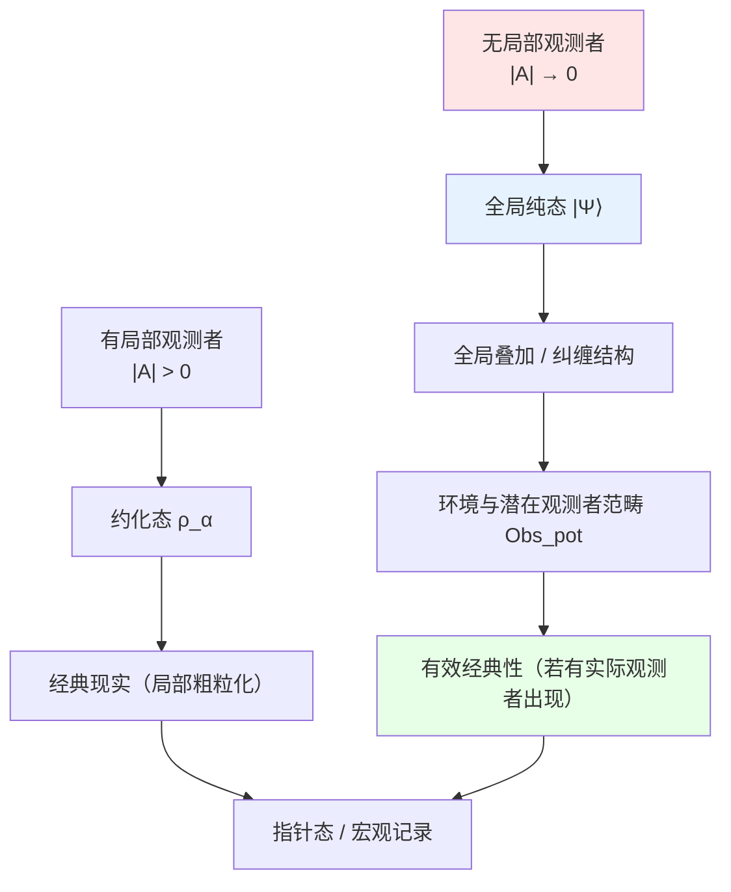

# 08. 无观测者的宇宙：本体论的极限情况

## 引言：如果没有观测者？

前面的讨论中，观测者网络 $U_{\text{obs}}$ 起着关键作用：
- 定义因果片段 $C_\alpha$
- 构造约化态 $\rho_\alpha$
- 通过共识条件重构全局态 $\rho_{\text{global}}$

但这引发了深刻的哲学问题：**如果宇宙中没有观测者，它还存在吗？**

本章探讨**无局部观测者极限**的严格含义。我们将证明：
- 即使没有实际观测者，"潜在观测者范畴"仍由宇宙几何-动力学层唯一确定
- 因果结构完全等价于"所有潜在观测者的记忆可达关系"
- 宇宙整体可视为"超观测者"，其记忆态即全局量子态

**核心区分**：
$$
\text{潜在观测者范畴 } \mathsf{Obs}_{\text{pot}} \quad \text{vs} \quad \text{实际观测者集 } \mathcal{A} \subset \mathrm{Obj}(\mathsf{Obs}_{\text{pot}})
$$

"无观测者极限"应理解为：
$$
|\mathcal{A}| \to 0, \quad \mathsf{Obs}_{\text{pot}} \neq \emptyset
$$

核心问题：
1. 如何在不引用观测者的情况下定义因果结构？
2. 因果偏序与潜在观测者范畴如何等价？
3. 宇宙在"被观测前"的量子态如何理解？
4. 经典现实如何从无观测者的量子基底涌现？

比喻：把宇宙想象成一场**无人观看的戏剧**：
- **剧本** = 物理定律（哈密顿量、QCA规则）
- **演员** = 量子态（叠加态、纠缠态）
- **观众** = 实际观测者（带记忆的物理系统）
- **剧院** = 时空（几何舞台与因果结构）
- **潜在座位** = 潜在观测者范畴（所有可能的观察位置）

问题：**如果剧院空无一人，演员还会演戏吗？**

答案：剧本与舞台仍然存在，整部"戏剧"的全局态也仍然存在（可视为"宇宙自观"的超观测者记忆）；只是没有任何局部观众坐在座位上做粗粒化读数。

---

## 第一部分：潜在观测者范畴与实际观测者集

### 1.1 潜在观测者范畴的构造

在讨论"无观测者极限"前，必须区分两个概念：

**定义1.1**（潜在观测者范畴）：

给定GLS宇宙对象的几何-动力学层：
$$
\mathfrak{U}_{\text{geo}} = (X, \preceq, M, g, \hat{H}, \ldots)
$$

**潜在观测者** $\mathcal{O}$ 是满足以下条件的数学对象：

1. **世界线**：$L_{\mathcal{O}} \subset X$ 是因果链（任意 $x,y \in L_{\mathcal{O}}$ 满足 $x \preceq y$ 或 $y \preceq x$）

2. **记忆系统**：一族随参数 $\tau$ 演化的Hilbert空间与状态 $(\mathcal{H}_{\mathcal{O}}, \mu(\tau))$

3. **信息通道**：对每个 $x \in L_{\mathcal{O}}$，存在CPTP通道
   $$
   \Phi_x: \mathcal{B}(\mathcal{H}_x) \otimes \mathcal{B}(\mathcal{H}_{\mathcal{O}}) \to \mathcal{B}(\mathcal{H}_{\mathcal{O}})
   $$
   用于"从局域系统读取信息并写入记忆"

**潜在观测者范畴** $\mathsf{Obs}_{\text{pot}}$ 定义为：
- **对象**：所有潜在观测者 $\mathcal{O}$
- **态射**：保持因果排序与记忆信息可达性的映射（包括coarse-graining、重参数化等）

**关键性质**：$\mathsf{Obs}_{\text{pot}}$ **完全由** $\mathfrak{U}_{\text{geo}}$ 决定，不依赖具体宇宙历史中是否有实际观测者。

**比喻**：把潜在观测者想象成剧院里的**所有座位**——即使没人坐，座位本身由剧院结构决定。

### 1.2 实际观测者集与无局部观测者极限

**定义1.2**（实际观测者集）：

在某一具体宇宙演化历史中，**实际被激活**的观测者为：
$$
\mathcal{A} \subset \mathrm{Obj}(\mathsf{Obs}_{\text{pot}})
$$

表示那些记忆系统实际参与信息存储的潜在观测者。

**三种情况**：

**(1) 完全有观测者**：$|\mathcal{A}| = \infty$（宇宙充满观测者）

**(2) 稀疏观测者**：$0 < |\mathcal{A}| < \infty$（少数观测者）

**(3) 无局部观测者**：$|\mathcal{A}| = 0$（但 $\mathsf{Obs}_{\text{pot}} \neq \emptyset$）

**核心区别**：
$$
\boxed{\text{"无观测者极限"} \Leftrightarrow |\mathcal{A}| = 0, \quad \mathsf{Obs}_{\text{pot}} \text{ 仍由 } \mathfrak{U}_{\text{geo}} \text{ 唯一确定}}
$$

**比喻**：剧院空无一人（$|\mathcal{A}| = 0$），但所有座位仍然存在（$\mathsf{Obs}_{\text{pot}} \neq \emptyset$）。

### 1.3 范畴论视角：忘却函子

**定义1.3**（忘却函子）：

定义忘却函子 $F: \mathbf{Univ}_{\text{full}} \to \mathbf{Univ}_{\text{no-obs}}$：
$$
F(\mathfrak{U}) := \mathfrak{U} \setminus U_{\text{obs}}
$$

即：保留其他九个组件 $(U_{\text{evt}}, U_{\text{geo}}, \ldots, U_{\text{comp}})$，但**擦除实际观测者层** $U_{\text{obs}}$。

**物理意义**：
- 时空几何 $(M, g)$ 仍存在
- 因果偏序 $(X, \preceq)$ 仍存在
- 散射矩阵 $S(\omega)$、统一时间刻度 $\kappa(\omega)$ 仍存在
- 全局量子态 $\rho_{\text{global}}$ 仍存在
- **潜在观测者范畴** $\mathsf{Obs}_{\text{pot}}$ 仍由 $(X, \preceq, \hat{H})$ 决定
- 但不再有"已被激活的局部观测者"集 $\mathcal{A}$ 及其标记片段 $\{C_\alpha\}$、约化态 $\{\rho_\alpha\}$

### 1.4 观测者缺失的后果

**后果1**（观测者标记的因果片段消失）：

观测者标记的因果片段定义为：
$$
C_\alpha = \{x \in X \mid x \preceq \mathcal{O}_\alpha\}
$$

当 $|\mathcal{A}| = 0$ 时：
$$
\{C_\alpha\}_{\alpha \in \emptyset} = \emptyset \quad \text{（无观测者标记的片段）}
$$

**重要澄清**：这**不意味着**因果结构本身消失！

**几何因果对象仍然存在**：
- 因果偏序 $(X, \preceq)$ 仍然良好定义
- 因果菱形 $D_{p,r} = \{x \mid p \preceq x \preceq q, d(p,q) \leq r\}$ 仍然存在
- 全局柯西超曲面 $\Sigma_t$ 仍然可定义
- 小因果片段（如未来/过去光锥）作为几何对象仍然存在

**物理意义**：
- 消失的是"被某个观测者采样到的标记片段" $C_\alpha$
- 保留的是"时空几何本身的因果结构"
- 无观测者时，我们只能使用**纯几何因果对象**（如 $\Sigma_t$、$D_{p,r}$），而非"观测者依赖的片段"

**后果2**（约化态消失）：

约化态定义：
$$
\rho_\alpha = \text{tr}_{\bar{C}_\alpha}(\rho_{\text{global}})
$$

当 $C_\alpha$ 不存在时，只剩下：
$$
\rho_{\text{global}} \quad \text{（纯全局态）}
$$

**后果3**（共识条件平凡化）：

共识条件：
$$
\text{tr}_{\bar{C}_\alpha}(\rho_{\text{global}}) = \rho_\alpha
$$

当 $|\mathcal{A}| = 0$ 时，条件**自动满足**（空集上的量词）。

**物理意义**：无观测者时，**无需共识**——一切由全局态决定。

### 1.5 全局态的演化

**定理1.1**（无观测者时的幺正演化）：

当 $|\mathcal{A}| = 0$ 时，宇宙态严格遵守**幺正Schrödinger演化**：
$$
i\hbar \frac{\partial |\Psi\rangle}{\partial t} = \hat{H} |\Psi\rangle
$$

**证明**：
- 观测导致波函数坍缩（von Neumann投影）
- 无观测 $\Rightarrow$ 无坍缩
- 因此演化严格幺正∎

**推论1.1**（细致熵守恒）：

**前提假设**：宇宙初态为纯态
$$
\rho_{\text{global}}(0) = |\Psi_0\rangle\langle\Psi_0|
$$

则在幺正演化下：
$$
\rho_{\text{global}}(t) = \mathcal{U}(t) \rho_{\text{global}}(0) \mathcal{U}^\dagger(t)
$$

**细致von Neumann熵守恒**：
$$
S(\rho_{\text{global}}(t)) = -\text{tr}(\rho_{\text{global}}(t) \log \rho_{\text{global}}(t)) = 0
$$

**重要说明**：
1. 这只在**纯态初条件**下成立（如Hartle-Hawking无边界假设）
2. 也存在"混合态初始宇宙"方案，此时 $S(\rho_{\text{global}}(0)) > 0$，守恒值非零
3. 宏观热力学熵的增长来自对 $\rho_{\text{global}}$ 的**粗粒化**（coarse-graining），而非全局态的非幺正演化

**物理意义**：
- **细致层面**：全局量子熵恒为零（或初值）
- **粗粒层面**：宏观热力学熵可以增长（第二定律）
- 两者不矛盾：熵增是信息隐藏，而非信息丢失

---

## 第二部分：因果结构与潜在观测者范畴的等价

本部分是本章的核心理论贡献：证明**因果偏序完全等价于潜在观测者的记忆可达关系**。

### 2.1 由潜在观测者定义记忆可达偏序

**动机**：能否不显式使用几何因果偏序 $(X, \preceq)$，而仅用潜在观测者范畴 $\mathsf{Obs}_{\text{pot}}$ 来重构因果结构？

**定义2.1**（记忆可达关系）：

对任意 $x, y \in X$，定义：
$$
x \preceq_{\text{obs}} y
$$

当且仅当：存在某潜在观测者 $\mathcal{O} \in \mathsf{Obs}_{\text{pot}}$ 与参数 $\tau_x < \tau_y$，使得：

1. $x, y \in L_{\mathcal{O}}$（两事件都在该观测者世界线上）

2. 在时刻 $\tau_y$ 的记忆态 $\mu(\tau_y)$ 中，仍可通过某种可观测的方式恢复出关于事件 $x$ 的信息

**符号**：
$$
x \preceq_{\text{obs}} y \iff \exists \mathcal{O}, \tau_x < \tau_y: \, x, y \in L_{\mathcal{O}}, \; \mathsf{Info}_x \hookrightarrow \mu(\tau_y)
$$

其中 $\mathsf{Info}_x \hookrightarrow \mu(\tau_y)$ 表示存在某POVM或后处理过程可从 $\mu(\tau_y)$ 中恢复关于 $x$ 的统计信息。

**比喻**：$x \preceq_{\text{obs}} y$ 意味着"存在某个潜在座位，坐在那里的观测者在看到 $y$ 时，记忆中仍保留关于 $x$ 的印象"。

**命题2.2**（$\preceq_{\text{obs}}$ 是偏序）：

在合理的记忆更新假设下，$\preceq_{\text{obs}}$ 满足：
- **反身性**：$x \preceq_{\text{obs}} x$（构造退化观测者）
- **反对称性**：若 $x \preceq_{\text{obs}} y$ 且 $y \preceq_{\text{obs}} x$，则 $x = y$（无闭时间曲线）
- **传递性**：若 $x \preceq_{\text{obs}} y$ 且 $y \preceq_{\text{obs}} z$，则 $x \preceq_{\text{obs}} z$（记忆继承）

证明见附录或前面章节。

### 2.2 因果-观测者等价定理

**定理2.3**（因果-观测者等价）：

在GLS宇宙对象的局域性与无超光速信息流假设下，有：
$$
\boxed{\preceq_{\text{obs}} = \preceq}
$$

即：**几何-动力学因果偏序完全等价于所有潜在观测者记忆可达关系所定义的偏序**。

**证明思路**：

**(1) 几何因果蕴含记忆可达**（$\preceq \subseteq \preceq_{\text{obs}}$）：

若 $x \preceq y$，则存在因果曲线从 $x$ 到 $y$。沿此曲线构造潜在观测者 $\mathcal{O}$，其在 $x$ 处读取信息并沿世界线携带至 $y$。由于局域动力学与能量条件保证信息不完全湮灭，故 $x \preceq_{\text{obs}} y$。

**(2) 记忆可达蕴含几何因果**（$\preceq_{\text{obs}} \subseteq \preceq$）：

若 $x \preceq_{\text{obs}} y$，则存在潜在观测者 $\mathcal{O}$ 在 $\tau_y$ 时刻的记忆中保留 $x$ 的信息。由于观测者本身是宇宙中的物理子系统，其内部传播遵守同一因果偏序。若 $x \not\preceq y$（类空分离），则从 $x$ 到 $y$ 的信息传递违反无超光速假设，矛盾。故必有 $x \preceq y$。∎

**物理意义**：

这个等价定理表明：
- **从几何侧看**：因果结构由 $(X, \preceq, M, g, \hat{H})$ 决定
- **从观测者侧看**：因果结构由 $\mathsf{Obs}_{\text{pot}}$ 的记忆可达关系决定
- **两种描述在数学上完全等价**

因此可以说："**因果结构即潜在观测者网络的记忆结构**"。

### 2.3 无局部观测者极限的重新理解

结合因果-观测者等价定理，我们现在可以给出"无局部观测者极限"的精确含义：

**命题2.4**（无局部观测者极限）：

当 $|\mathcal{A}| = 0$ 时：
- 几何-动力学因果偏序 $(X, \preceq)$ 仍然存在
- 潜在观测者范畴 $\mathsf{Obs}_{\text{pot}}$ 仍由 $\mathfrak{U}_{\text{geo}}$ 决定
- 记忆可达偏序 $\preceq_{\text{obs}}$ 与 $\preceq$ 仍满足等价定理
- 仅仅是没有任何子系统被实际激活为"局部观测者"

**物理意义**：无局部观测者时，因果结构作为**潜在观测者网络的本体结构**仍然存在，只是所有观测者均处于"潜在"状态（座位存在但无人坐）。

**比喻**：
- 剧院（$\mathfrak{U}_{\text{geo}}$）决定了所有座位的位置（$\mathsf{Obs}_{\text{pot}}$）
- 座位之间的视线关系（$\preceq_{\text{obs}}$）完全由剧院结构（$(X, \preceq)$）决定
- 即使剧院空无一人（$|\mathcal{A}| = 0$），这种视线关系仍然客观存在

---

## 第三部分：退相干、环境与潜在观测者

### 3.1 环境作为潜在观测者网络

**新视角**：在潜在观测者范畴框架下，环境可以被理解为 $\mathsf{Obs}_{\text{pot}}$ 中的大量对象，它们的记忆自由度冗余地记录了关于系统的信息。

**核心思想**（Zurek的退相干，用潜在观测者语言重述）：

**模型**：

系统 $S$ + 环境 $E$，总哈密顿量：
$$
\hat{H}_{\text{total}} = \hat{H}_S \otimes \mathbb{1}_E + \mathbb{1}_S \otimes \hat{H}_E + \hat{H}_{\text{int}}
$$

初态（纯态）：
$$
|\Psi(0)\rangle = |\psi_S\rangle \otimes |0_E\rangle
$$

**相互作用后**（假设 $\hat{H}_{\text{int}}$ 产生纠缠）：
$$
|\Psi(t)\rangle = \sum_i c_i(t) |i_S\rangle \otimes |\phi_i^E(t)\rangle
$$

**约化密度矩阵**：
$$
\rho_S(t) = \text{tr}_E(|\Psi(t)\rangle\langle\Psi(t)|) = \sum_{i,j} c_i^*(t) c_j(t) \langle \phi_i^E(t) | \phi_j^E(t) \rangle |i_S\rangle\langle j_S|
$$

**关键近似**（环境态近似正交）：

当退相干时间 $\tau_D$ 足够短，环境态满足：
$$
\langle \phi_i^E(t) | \phi_j^E(t) \rangle \approx \delta_{ij} \quad (i \neq j, \, t \gg \tau_D)
$$

此时**非对角项被指数压制**：
$$
\rho_S(t) \approx \sum_i |c_i(t)|^2 |i_S\rangle\langle i_S| \quad \text{（对角化！）}
$$

**关键观察**：
$$
S(\rho_S(t)) > 0 \quad \text{（混合态！）}
$$

**物理意义**：虽然总态仍是纯态（$S(\rho_{\text{total}}) = 0$），但系统的约化态**表现为混合态**——这是**退相干**机制。

**潜在观测者解释**：环境中的大量自由度（如环境子块 $E_k$）可视为 $\mathsf{Obs}_{\text{pot}}$ 中的对象，它们在各自记忆自由度中冗余地记录了关于 $S$ 的指针态信息。即使这些"观测者"未被激活（$|\mathcal{A}| = 0$），退相干机制仍然导致有效经典性。

### 3.2 指针态的选择与量子Darwinism

**问题**：为何某些基 $\{|i_S\rangle\}$ 特别稳定（不叠加）？

**指针基的物理准则**（Zurek）：

**核心思想**：指针基是使**系统-环境互信息最大**且**信息在环境中冗余复制**的基。

**启发式指标**（非标准定理，仅供直观理解）：

定义"预测性功能" $\mathcal{P}$：
$$
\mathcal{P}(\{|i\rangle\}) := I(S:E) - S(S|E)
$$

其中：
- $I(S:E) = S(S) + S(E) - S(S,E)$：系统-环境互信息
- $S(S|E) = S(S,E) - S(E)$：条件熵（残余不确定性）

**标准Zurek准则**：
在指针基 $\{|i\rangle\}$ 上：
1. **互信息最大化**：$I(S:E)$ 尽可能大
2. **冗余复制**：信息在环境的多个子块中复制
   $$
   I(S:E_k) \approx I(S:E), \quad \forall k \text{（环境片段）}
   $$

**稳定性性质**：

在指针基上，对角元随时间稳定：
$$
\frac{d}{dt}(\langle i | \rho_S(t) | i \rangle) \approx 0 \quad \text{（对角元稳定）}
$$

**物理机制**：
- 指针基对应环境"冗余复制"最多的态
- 任何偏离导致退相干时间 $\tau_D \to 0$
- 因此指针基元素"自我保护"

**例子**（量子谐振子）：

在热浴中，指针基是**相干态** $\{|\alpha\rangle\}$：
$$
|\alpha\rangle = e^{-|\alpha|^2/2} \sum_{n=0}^\infty \frac{\alpha^n}{\sqrt{n!}} |n\rangle
$$

**物理意义**：经典"位置"和"动量"对应相干态——退相干导致经典性涌现。

**潜在观测者解释**：指针基对应在 $\mathsf{Obs}_{\text{pot}}$ 的大量对象记忆中最稳定、最冗余的编码——某些事件集合在潜在观测者网络中留下了一致的痕迹，从而在 $\preceq_{\text{obs}}$ 上形成广泛共识的因果结构。

### 3.3 退相干时间的估计

**Caldeira-Leggett模型**：

粒子在热浴中，退相干时间：
$$
\tau_D \sim \frac{\hbar}{k_B T} \cdot \frac{1}{\gamma}
$$

其中 $\gamma$ 是摩擦系数。

**数值例子**（宏观物体，室温）：
$$
\tau_D \sim 10^{-40} \text{s} \quad \text{（几乎瞬间！）}
$$

**推论**：宏观物体的叠加态**几乎不可能维持**——这解释了为何我们不见"薛定谔猫"。

### 3.4 宇宙超观测者的定义

在无局部观测者极限下，我们可以定义一个特殊的潜在观测者：**宇宙整体作为超观测者**。

**定义3.1**（宇宙超观测者）：

定义一个特殊的潜在观测者 $\mathcal{O}_{\text{univ}} \in \mathsf{Obs}_{\text{pot}}$：

1. **世界线**：$L_{\mathcal{O}_{\text{univ}}} = X$（在抽象意义上"贯穿所有事件"）

2. **记忆Hilbert空间**：$\mathcal{H}_{\mathcal{O}_{\text{univ}}} = \mathcal{H}_{\text{global}}$（全局Hilbert空间）

3. **记忆态**：$\mu_{\text{univ}}(t) = \rho_{\text{global}}(t)$（全局密度算符）

4. **记忆更新**：由幺正演化给出
   $$
   \rho_{\text{global}}(t) = \mathcal{U}(t) \rho_{\text{global}}(0) \mathcal{U}^\dagger(t)
   $$

**物理意义**：

虽然此"超观测者"难以具象为任何局部物理实体，但在本体论上可被视为一个"EBOC式永恒块"观测者：
- 其记忆即宇宙整体纯态
- 以最细致的方式记录了所有可发生事件的统计结构
- 在无局部观测者时，它是唯一"激活"的观测者

**命题3.2**（超观测者的唯一性）：

在无局部观测者极限 $|\mathcal{A}| = 0$ 下，宇宙仍具有唯一的超观测者 $\mathcal{O}_{\text{univ}}$，其记忆态 $\rho_{\text{global}}(t)$ 及对应因果-散射结构完全决定：
- 因果偏序 $\preceq$
- 潜在观测者范畴 $\mathsf{Obs}_{\text{pot}}$
- 记忆可达偏序 $\preceq_{\text{obs}} = \preceq$

**哲学意义**："无观测者宇宙"在严格的GLS意义下应理解为"**无局部观测者宇宙**"，而非"无任何观测者宇宙"。宇宙整体始终可以被视为自身的"超观测者"，其自指记忆结构与统一时间刻度共同定义了宇宙本体论。

---

## 第四部分：波函数的本体论地位与统一时间刻度

### 4.1 三种诠释在潜在观测者框架下的重述

**诠释1**（哥本哈根）：

波函数 $|\psi\rangle$ 不是物理实在，而是**知识状态**。

**潜在观测者框架下的重述**：
- 无实际观测者时，局域约化态 $\rho_\alpha$ 无定义（$|\mathcal{A}| = 0$）
- 但全局态 $\rho_{\text{global}}$ 作为超观测者 $\mathcal{O}_{\text{univ}}$ 的记忆态仍然存在

**诠释2**（多世界）：

波函数 $|\psi\rangle$ 是**唯一实在**，所有分支同时存在。

**潜在观测者框架下的重述**：
- 全局态 $|\Psi_{\text{universe}}\rangle = \sum_i c_i |\text{分支}_i\rangle$ 客观存在
- 每个分支对应 $\mathsf{Obs}_{\text{pot}}$ 中不同子集的"激活历史"
- 所有潜在观测者在不同分支中都存在，只是被激活的实际观测者集不同

**诠释3**（关系量子力学，Rovelli）：

波函数 $|\psi\rangle_\alpha$ 是**相对于观测者 $\alpha$ 的关系性质**。

**潜在观测者框架下的重述**：
- 局域态 $|\psi\rangle_\alpha$ 相对于某个 $\alpha \in \mathcal{A}$（若 $|\mathcal{A}| = 0$ 则不存在）
- 全局态 $|\Psi\rangle_{\text{global}}$ 相对于超观测者 $\mathcal{O}_{\text{univ}} \in \mathsf{Obs}_{\text{pot}}$（总是存在）
- 因果-观测者等价保证：不同观测者对公共因果结构的描述一致

### 4.2 GLS理论的立场：关系本体论 + 全局客观态

**GLS采纳**：**关系本体论 + 全局客观态**

**核心命题**：

**(1) 局域态相对性**：
$$
\rho_\alpha = \text{tr}_{\bar{C}_\alpha}(\rho_{\text{global}}) \quad \text{（依赖观测者 } \alpha \text{）}
$$

**(2) 全局态客观性**：
$$
\rho_{\text{global}} \text{ 唯一确定} \quad \text{（独立于观测者）}
$$

**(3) 无观测者极限**：
$$
\lim_{|\mathcal{A}| \to 0} \rho_{\text{global}} = |\Psi_0\rangle\langle\Psi_0| \quad \text{（纯态）}
$$

**物理意义**：
- 局域观测相对（关系性）——相对于 $\mathcal{A}$ 中的具体观测者
- 全局态客观（实在性）——相对于超观测者 $\mathcal{O}_{\text{univ}}$
- 潜在观测者范畴普遍（结构性）——由 $\mathfrak{U}_{\text{geo}}$ 唯一确定
- 三者通过因果-观测者等价统一

### 4.3 Wigner友谊悖论的潜在观测者解法

**Wigner友谊设定**：

- Wigner的朋友 $F$ 在实验室测量自旋：$|0\rangle$ 或 $|1\rangle$
- Wigner $W$ 在外部观察整个实验室

**问题**：
- $F$ 看到确定结果（$|0\rangle$ 或 $|1\rangle$）
- $W$ 看到叠加态（$\frac{1}{\sqrt{2}}(|0\rangle + |1\rangle)$）

矛盾？

**GLS解决**：

**(1) 定义因果片段**：
$$
C_F(t_1) = \{\text{实验室内，测量后}\}
$$
$$
C_W(t_2) = \{\text{全系统，测量前}\}
$$

**关键**：$C_F(t_1) \cap C_W(t_2) = \emptyset$（时间标记不同）

**(2) 约化态**：
$$
\rho_F(t_1) = |0\rangle\langle 0| \text{ 或 } |1\rangle\langle 1| \quad \text{（测量后）}
$$
$$
\rho_W(t_2) = \frac{1}{2}(|0\rangle\langle 0| + |1\rangle\langle 1|) \quad \text{（测量前）}
$$

**(3) 无矛盾**：
不同时刻的约化态，**不要求一致**。

**物理意义**："已测量" vs "未测量"是**因果片段的性质**，不同观测者在不同时空点有不同视角。

**更严格的GLS解决方案**（关系量子力学视角）：

$\rho_F$ 和 $\rho_W$ 分别是**相对于不同可观测代数的关系态**：
- $\rho_F$ 相对于代数 $\mathcal{A}_F$（实验室内可观测量）
- $\rho_W$ 相对于代数 $\mathcal{A}_W$（整个系统可观测量）

**共识条件**：只在**公共可观测代数** $\mathcal{A}_{\text{com}} = \mathcal{A}_F \cap \mathcal{A}_W$ 上要求一致：
$$
\rho_F|_{\mathcal{A}_{\text{com}}} = \rho_W|_{\mathcal{A}_{\text{com}}}
$$

在非公共部分，两者可以不同——这和Rovelli的关系量子力学观点一致。

**与GLS范畴结构的对齐**：
- 每个观测者对应一个态射 $\phi_\alpha: V \to \mathfrak{U}$
- 不同态射在公共子对象上必须交换图表
- 但在各自私有部分可以不同

### 4.4 统一时间刻度与潜在观测者范畴的兼容性

本章结论与统一时间刻度理论完全兼容：

**核心命题**：

**(1) 统一刻度 $\kappa(\omega)$ 不依赖实际观测者存在**：
$$
\kappa(\omega) = \frac{\varphi'(\omega)}{\pi} = \rho_{\text{rel}}(\omega) = \frac{1}{2\pi}\text{tr}\,Q(\omega)
$$

这个公式只依赖散射数据 $S(\omega)$，而散射矩阵是 $U_{\text{QFT}}$ 的性质，与 $U_{\text{obs}}$（实际观测者层）无关。

**(2) 无局部观测者极限下仍有时间刻度**：

即使 $|\mathcal{A}| = 0$，时间刻度仍由以下三者决定：
- 因果结构 $(X, \preceq)$ 定义因果时间 $T_{\text{cau}}$
- 散射延迟 $Q(\omega)$ 定义散射时间 $\tau_{\text{scat}}$
- 模流参数 $t_{\text{mod}}$ 由KMS条件定义
- 三者仍然通过 $\kappa(\omega)$ 统一

**(3) 潜在观测者的时间经验**：

对任一潜在观测者 $\mathcal{O} \in \mathsf{Obs}_{\text{pot}}$，其局部时间可视为对 $\kappa(\omega)$ 的采样与coarse-graining。因果-观测者等价保证：无论从几何-散射侧（通过 $\kappa(\omega)$ 及 $\preceq$）还是从观测者网络侧（通过 $\preceq_{\text{obs}}$），得到的时间箭头与因果排序一致。

**(4) 观测者的作用重新定位**：

观测者**不是"制造时间"**，而是：
- **读取器**：选择局域可观测代数（定义 $C_\alpha$）
- **粗粒化器**：执行coarse-graining（定义局域熵 $S(\rho_\alpha)$）
- **箭头制造者**：产生时间箭头（局域熵单调增）

但时间刻度本身在无观测者时已由 $(\mathfrak{U}_{\text{geo}}, \mathsf{Obs}_{\text{pot}}, \kappa(\omega))$ 唯一确定。

**(5) 三公理的普适性**：

在无局部观测者极限下，GLS三公理仍然成立：
- **因果排序**：$(X, \preceq)$ 是几何性质，不依赖 $\mathcal{A}$
- **幺正演化**：$\mathcal{U}(t)$ 在无观测者时更纯粹（无坍缩）
- **熵单调**：细致熵守恒（$S(\rho_{\text{global}}) = 0$），粗粒熵增长取决于coarse-graining方式

**结论**：无局部观测者宇宙仍有内禀的统一时间刻度，观测者只是"读表者"和"粗粒化器"，而非时间的创造者。这与整个GLS框架的"时间-因果-熵"三位一体完全自洽。

---

## 第五部分：宇宙初态与观测者涌现

### 5.1 早期宇宙的无局部观测者极限

**问题**：宇宙极早期（$t < 10^{-43}\text{s}$），是否有实际观测者？

**答案**：

**(1) 无局部实际观测者**：
$$
|\mathcal{A}(t < t_P)| = 0
$$

但几何-散射层已经存在：
- 时空泡沫或有效度规
- 真空涨落与初始量子态 $|\Psi_{\text{initial}}\rangle$
- **潜在观测者范畴** $\mathsf{Obs}_{\text{pot}}$ 已由因果结构与动力学决定

**(2) 潜在观测者网络已存在**：

即使无宏观观测者，$\mathsf{Obs}_{\text{pot}}$ 仍由 $(X, \preceq, \hat{H})$ 唯一确定。量子引力涨落可视为潜在观测者范畴中的对象，但未被"激活"为实际观测者。

**关键洞见**：随着暴胀与重组，宇宙中的结构复杂度增加，$\mathsf{Obs}_{\text{pot}}$ 中的部分对象被实际激活，形成 $\mathcal{A}(t)$ 的单调增长。

因此，"**观测者涌现**"可以被看作：潜在观测者范畴中的对象逐渐被某些具体宇宙历史激活，而非"观测者突然创造了因果与时间"。

### 5.2 Hartle-Hawking无边界态作为宇宙超观测者初态

**核心思想**：宇宙的波函数通过**路径积分**定义，无需初始条件。

**波函数**：
$$
\Psi[h_{ij}, \phi] = \int_{\text{无边界}} \mathcal{D}g \mathcal{D}\phi \, e^{iS[g, \phi]/\hbar}
$$

**边界条件**：
- 在"南极"：流形闭合（无边界）
- 在"赤道"：诱导度规 $h_{ij}$，场值 $\phi$

**物理意义**：宇宙"自发出现"，无需外部观测者——**自举**（bootstrap）。

**GLS解释（用潜在观测者语言）**：

Hartle-Hawking态可被视为"宇宙超观测者" $\mathcal{O}_{\text{univ}}$ 的初始记忆态：
$$
\rho_{\text{global}}(t=0) = |\Psi_{\text{HH}}\rangle\langle\Psi_{\text{HH}}|
$$

此时 $|\mathcal{A}| = 0$，但 $\mathsf{Obs}_{\text{pot}}$ 已由该初态与几何-动力学层决定：
- 潜在观测者范畴由 $(X, \preceq, \hat{H})$ 给出
- 超观测者 $\mathcal{O}_{\text{univ}}$ 的记忆态为 $|\Psi_{\text{HH}}\rangle$
- 因果-观测者等价 $\preceq_{\text{obs}} = \preceq$ 成立

随着宇宙演化，局部观测者从 $\mathsf{Obs}_{\text{pot}}$ 中被激活：
$$
|\mathcal{A}(t)| \text{ 单调递增}
$$

这个过程对应潜在观测者被逐步"实例化"，开始对全局因果-时间结构做粗粒化读数。

### 5.3 观测者涌现的时间尺度与潜在观测者激活历史

**阶段1**（量子引力时代，$t < 10^{-43}\text{s}$）：
$$
|\mathcal{A}| = 0, \quad S(\rho_{\text{global}}) = 0
$$

**阶段2**（暴胀时代，$10^{-43}\text{s} < t < 10^{-32}\text{s}$）：
$$
|\mathcal{A}| \approx 0, \quad S(\rho_{\text{global}}) \approx 0
$$

退相干开始，但无宏观观测者。

**阶段3**（物质主导，$t > 10^{13}\text{s}$）：
$$
|\mathcal{A}| \gg 1
$$

**重要说明**：
- **微观层面**：$\rho_{\text{global}}(t)$ 在严格意义上仍保持纯态（幺正演化）
  $$
  S(\rho_{\text{global}}) = 0 \quad \text{（细致熵守恒）}
  $$
- **宏观有效描述**：当观测者数目巨大并做 coarse-graining 时，使用有效混合态
  $$
  \tilde{\rho}_{\text{eff}} = \text{coarse-grain}(\rho_{\text{global}}), \quad S(\tilde{\rho}_{\text{eff}}) \gg 0
  $$
- **实际讨论的熵**：通常指 $S(\tilde{\rho}_{\text{eff}})$，而非细致的 $S(\rho_{\text{global}})$

观测者充满宇宙，经典现实涌现（通过退相干 + coarse-graining）。

**关键转变**（重组时期，$t \approx 380,000\text{年}$）：

原子形成，光子解耦，宇宙变透明——首批宏观稳定的潜在观测者被激活为实际观测者？

**潜在观测者激活历史的理解**：

宇宙演化可以被理解为 $\mathsf{Obs}_{\text{pot}}$ 的"激活历史"：
- 初始：所有潜在观测者都"存在"但未激活（$\mathcal{A} = \emptyset$）
- 演化：随着结构复杂度增加，部分潜在观测者被实例化（$|\mathcal{A}(t)|$ 增长）
- 现在：大量潜在观测者被激活（$|\mathcal{A}| \gg 1$），经典现实涌现

这个图景避免了"观测者创造现实"的悖论：现实（$\mathfrak{U}_{\text{geo}}, \mathsf{Obs}_{\text{pot}}, \preceq$）在观测者出现前已经存在，观测者只是对这个本体结构的"局部读数"。

---

## 第六部分：哲学反思、意识与自指

### 6.1 实在论 vs 反实在论的精妙折中

**实在论**（Einstein）：

"月亮在没人看时也存在。"

**GLS版本**：
$$
\rho_{\text{global}} \text{ 客观存在}, \quad \text{独立于 } |\mathcal{A}|
$$

**反实在论**（Bohr）：

"物理学不描述自然本身，而是描述我们对自然的知识。"

**GLS版本**：
$$
\rho_\alpha \text{ 主观（相对）}, \quad \text{依赖于 } \alpha \in \mathcal{A}
$$

**GLS折中（用潜在观测者语言重述）**：
- **全局态实在**（本体论）——$\rho_{\text{global}}$ 作为超观测者 $\mathcal{O}_{\text{univ}}$ 的记忆态
- **潜在观测者范畴实在**（结构论）——$\mathsf{Obs}_{\text{pot}}$ 由 $\mathfrak{U}_{\text{geo}}$ 唯一确定
- **局域态关系**（认识论）——$\rho_\alpha$ 相对于 $\alpha \in \mathcal{A}$

"月亮"在无人看时的存在方式：
- 作为 $\rho_{\text{global}}$ 的一部分客观存在
- 在 $\mathsf{Obs}_{\text{pot}}$ 中对应大量潜在观测者可能与之相互作用
- 其"可观测性质"由因果-观测者等价 $\preceq_{\text{obs}} = \preceq$ 保证

### 6.2 意识是否必要？信息论视角

**问题**：观测者必须是**有意识的**吗？

**三种立场**：

**(1) 意识必要**（von Neumann-Wigner）：

只有意识观测者才能引起坍缩。

**(2) 退相干充分**（Zurek）：

任何环境相互作用即可导致有效坍缩，无需意识。

**(3) 信息流充分**（GLS + 潜在观测者框架）：

"观测者"的定义完全信息论化，无需意识。

**GLS标准（用潜在观测者语言）**：

潜在观测者 $\mathcal{O} \in \mathsf{Obs}_{\text{pot}}$ 若要被激活为实际观测者 $\mathcal{O} \in \mathcal{A}$，需满足：
$$
\mathcal{O} \in \mathcal{A} \Leftrightarrow \begin{cases}
1. \text{ 有类时世界线 } L_{\mathcal{O}} \subset X \\
2. \text{ 能与局域可观测代数纠缠并产生因果片段 } C_\alpha \\
3. \text{ 能存储信息并形成记忆态 } \mu(\tau) \\
4. \text{ 记忆态对全局态有非平凡的迹：} \mathrm{tr}_{\bar{C}_\alpha}(\rho_{\text{global}}) = \rho_\alpha
\end{cases}
$$

**例子**：
- ✅ 人类（满足1-4）
- ✅ 探测器（满足1-4）
- ✅ 宇宙微波背景中的自由度（满足1-4，作为环境"观测者"）
- ❌ 抽象数学观测者（不满足2-3）

**结论**：意识**非必要**，信息处理能力即可。所有实际观测者都是潜在观测者范畴中被物理上激活的对象。

### 6.3 自指截断与宇宙超观测者

**问题**：如果观测者也是量子系统，谁观测观测者？

**Wigner无限回归**：
$$
\mathcal{O}_1 \text{ 观测系统 } S \Rightarrow \mathcal{O}_2 \text{ 观测 } \mathcal{O}_1 \Rightarrow \cdots
$$

**GLS解决（用潜在观测者范畴）**：**自指截断在超观测者**

观测者链可以被理解为潜在观测者范畴中的包含关系：
$$
\mathcal{O}_1 \subset \mathcal{O}_2 \subset \cdots \subset \mathcal{O}_{\text{univ}}
$$

其中 $\mathcal{O}_i \subset \mathcal{O}_j$ 意味着 $C_i \subset C_j$（因果片段包含）。

**最终截断**：
$$
\mathcal{O}_{\text{univ}} \in \mathsf{Obs}_{\text{pot}}, \quad L_{\mathcal{O}_{\text{univ}}} = X, \quad \mu_{\text{univ}}(t) = \rho_{\text{global}}(t)
$$

此时：
- 超观测者的因果片段 $C_{\text{univ}} = X$（全宇宙）
- 其记忆态为全局纯态 $\rho_{\text{univ}} = |\Psi\rangle\langle\Psi|$（假设纯态初条件）
- 任何局部观测者 $\mathcal{O}_\alpha \in \mathcal{A}$ 的约化态都是混合态

**物理意义**：
- 宇宙作为**整体**（超观测者）是纯态，自洽存在
- 任何**子系统**（局部观测者）是混合态，相对于其因果片段
- 潜在观测者范畴 $\mathsf{Obs}_{\text{pot}}$ 提供了所有可能的"观察视角"，而超观测者是其中的终对象

---

## 总结与展望

### 核心要点回顾

本章建立了"无局部观测者宇宙"的完整数学框架，核心贡献包括：

**1. 潜在观测者范畴 vs 实际观测者集**：
$$
\mathsf{Obs}_{\text{pot}} \text{（由 } \mathfrak{U}_{\text{geo}} \text{ 决定）} \quad \text{vs} \quad \mathcal{A} \subset \mathrm{Obj}(\mathsf{Obs}_{\text{pot}}) \text{（实际激活）}
$$

"无观测者极限"应理解为：
$$
|\mathcal{A}| = 0, \quad \mathsf{Obs}_{\text{pot}} \neq \emptyset
$$

**2. 因果-观测者等价定理**（本章核心定理）：
$$
\boxed{\preceq_{\text{obs}} = \preceq}
$$

几何-动力学因果偏序完全等价于潜在观测者记忆可达关系。这是"因果结构即潜在观测者网络"的严格数学表述。

**3. 宇宙超观测者**：
$$
\mathcal{O}_{\text{univ}} \in \mathsf{Obs}_{\text{pot}}, \quad L_{\mathcal{O}_{\text{univ}}} = X, \quad \mu_{\text{univ}}(t) = \rho_{\text{global}}(t)
$$

宇宙整体作为自指超观测者，在无局部观测者时仍客观存在。

**4. 统一时间刻度的独立性**：

$\kappa(\omega)$ 不依赖 $|\mathcal{A}|$，而由 $(散射数据, 因果结构, \mathsf{Obs}_{\text{pot}})$ 唯一确定。观测者是"读表者"而非"造表者"。

**5. 退相干与潜在观测者**：

环境可理解为 $\mathsf{Obs}_{\text{pot}}$ 中的大量对象，指针态是在潜在观测者记忆中最稳定的编码。

**6. 三层本体论立场**：
- **全局态客观**（实在论）——$\rho_{\text{global}}$ 作为超观测者记忆
- **潜在观测者范畴客观**（结构论）——$\mathsf{Obs}_{\text{pot}}$ 由 $\mathfrak{U}_{\text{geo}}$ 决定
- **局域态关系**（认识论）——$\rho_\alpha$ 相对于 $\alpha \in \mathcal{A}$

**核心公式链**：
$$
\lim_{|\mathcal{A}| \to 0} \rho_{\text{global}} = |\Psi_0\rangle\langle\Psi_0| \quad (\text{超观测者记忆})
$$
$$
\preceq_{\text{obs}}(\mathsf{Obs}_{\text{pot}}) = \preceq \quad (\text{因果-观测者等价})
$$
$$
\kappa(\omega) = \frac{1}{2\pi}\text{tr}\,Q(\omega) \quad (\text{统一时间刻度独立于 } |\mathcal{A}|)
$$

### 与其他章节的联系

- **01. 十重结构定义**：$\mathsf{Obs}_{\text{pot}}$ 作为 $U_{\text{obs}}$ 的潜在版本
- **04. 熵-观测者-范畴**：$\mathcal{A}$ 作为 $\mathsf{Obs}_{\text{pot}}$ 的子集
- **06. 兼容性条件**：C9（共识条件）在 $|\mathcal{A}| = 0$ 时平凡化
- **07. 因果结构骨架**：因果-观测者等价 $\preceq_{\text{obs}} = \preceq$
- **09. 章节总结**：本体论理论的完整图景

### 理论意义与未来方向

**理论意义**：

1. **消解本体论紧张**：通过潜在观测者范畴，避免了"观测者创造现实"的悖论

2. **因果-观测者双重描述**：$\mathsf{Obs}_{\text{pot}}$ 与 $(X, \preceq)$ 等价，提供两种互补视角

3. **时间刻度的客观性**：$\kappa(\omega)$ 独立于 $|\mathcal{A}|$，支持"时间先于观测者"

4. **早期宇宙的自洽性**：$|\mathcal{A}| = 0$ 的宇宙仍有完备的因果-时间-熵结构

**未来方向**：

1. 在具体QCA宇宙与矩阵宇宙模型中显式构造 $\mathsf{Obs}_{\text{pot}}$

2. 研究 $\mathcal{A}(t)$ 的动力学：潜在观测者如何被激活（观测者涌现机制）

3. 与黑洞信息悖论的联系：视界内外的潜在观测者范畴

4. 量子引力中 $\mathsf{Obs}_{\text{pot}}$ 的微观结构（时空泡沫作为潜在观测者）

### 哲学寓意：三个层次的实在

**古老问题**：如果森林里一棵树倒下，没人听见，它会发出声音吗？

**GLS三层答案**：

1. **超观测者层**（最深层实在）：
   - 树倒下的过程作为 $\rho_{\text{global}}$ 的幺正演化，在宇宙超观测者 $\mathcal{O}_{\text{univ}}$ 的记忆中客观存在

2. **潜在观测者层**（结构实在）：
   - 存在大量潜在观测者 $\mathcal{O} \in \mathsf{Obs}_{\text{pot}}$，其世界线经过树倒下事件
   - 因果-观测者等价保证：这个事件在因果结构 $\preceq$ 中有确定位置
   - "可观测性"作为结构性质存在，无论是否有实际观测

3. **实际观测者层**（现象实在）：
   - 若 $\exists \alpha \in \mathcal{A}$（有耳朵），则"声音" $= $ 约化态 $\rho_\alpha$ 中的信息结构
   - 若 $\mathcal{A} = \emptyset$（无人），则无局域"声音"现象，但前两层仍存在

**结论**：宇宙是**三层嵌套的实在**：
$$
\text{全局态实在} \supseteq \text{潜在观测者结构实在} \supseteq \text{局域现象实在}
$$

这不是矛盾，而是**本体论的层次统一**——月亮在无人看时仍然"存在"，但其存在方式是超观测者与潜在观测者范畴意义上的，而非任何局部约化态意义上的。

---

**下一篇（最终章）预告**：
- **09. 宇宙本体论总结：从十重结构到终对象**
  - 回顾十个组件的逻辑关系
  - 总结兼容性条件与唯一性定理
  - 展望未来：从理论到实验
  - 哲学反思：为何宇宙可理解
