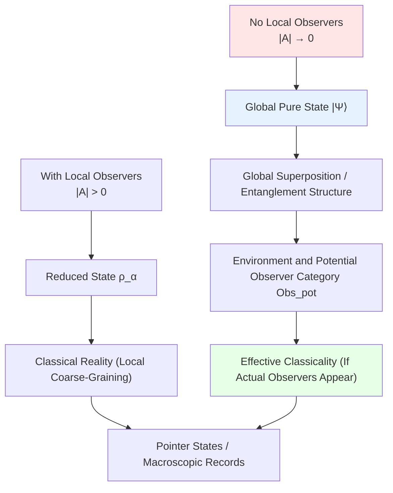

# 08. Universe Without Observers: Ontological Limit Case

## Introduction: What If No Observers?

In previous discussions, observer network $U_{\text{obs}}$ plays key role:
- Defines causal fragments $C_\alpha$
- Constructs reduced states $\rho_\alpha$
- Reconstructs global state $\rho_{\text{global}}$ through consensus conditions

But this raises deep philosophical question: **If no observers in universe, does it still exist?**

This chapter explores strict meaning of **observer-free limit**. We will prove:
- Even without actual observers, "potential observer category" still uniquely determined by universe's geometric-dynamical layer
- Causal structure completely equivalent to "memory accessibility relation of all potential observers"
- Universe as whole can be viewed as "super-observer", whose memory state is global quantum state

**Core Distinction**:
$$
\text{Potential Observer Category } \mathsf{Obs}_{\text{pot}} \quad \text{vs} \quad \text{Actual Observer Set } \mathcal{A} \subset \mathrm{Obj}(\mathsf{Obs}_{\text{pot}})
$$

"Observer-free limit" should be understood as:
$$
|\mathcal{A}| \to 0, \quad \mathsf{Obs}_{\text{pot}} \neq \emptyset
$$

Core questions:
1. How to define causal structure without referencing observers?
2. How are causal partial order and potential observer category equivalent?
3. How to understand quantum state of universe "before being observed"?
4. How does classical reality emerge from observer-free quantum substrate?

Analogy: Imagine universe as **play with no audience**:
- **Script** = Physical laws (Hamiltonian, QCA rules)
- **Actors** = Quantum states (superpositions, entangled states)
- **Audience** = Actual observers (physical systems with memory)
- **Theater** = Spacetime (geometric stage and causal structure)
- **Potential Seats** = Potential observer category (all possible observation positions)

Question: **If theater empty, will actors still perform?**

Answer: Script and stage still exist, global state of entire "play" also exists (can be viewed as "universe self-observation" super-observer memory); just no local audience sitting in seats doing coarse-grained readings.

---

## Part I: Potential Observer Category and Actual Observer Set

### 1.1 Construction of Potential Observer Category

Before discussing "observer-free limit", must distinguish two concepts:

**Definition 1.1** (Potential Observer Category):

Given geometric-dynamical layer of GLS universe object:
$$
\mathfrak{U}_{\text{geo}} = (X, \preceq, M, g, \hat{H}, \ldots)
$$

**Potential Observer** $\mathcal{O}$ is mathematical object satisfying:

1. **Worldline**: $L_{\mathcal{O}} \subset X$ is causal chain (any $x,y \in L_{\mathcal{O}}$ satisfy $x \preceq y$ or $y \preceq x$)

2. **Memory System**: Family of Hilbert spaces and states evolving with parameter $\tau$: $(\mathcal{H}_{\mathcal{O}}, \mu(\tau))$

3. **Information Channel**: For each $x \in L_{\mathcal{O}}$, exists CPTP channel
   $$
   \Phi_x: \mathcal{B}(\mathcal{H}_x) \otimes \mathcal{B}(\mathcal{H}_{\mathcal{O}}) \to \mathcal{B}(\mathcal{H}_{\mathcal{O}})
   $$
   for "reading information from local system and writing to memory"

**Potential Observer Category** $\mathsf{Obs}_{\text{pot}}$ defined as:
- **Objects**: All potential observers $\mathcal{O}$
- **Morphisms**: Maps preserving causal ordering and memory information accessibility (including coarse-graining, reparameterization, etc.)

**Key Property**: $\mathsf{Obs}_{\text{pot}}$ **completely determined** by $\mathfrak{U}_{\text{geo}}$, independent of whether actual observers exist in specific universe history.

**Analogy**: Think of potential observers as **all seats** in theater—even if no one sits, seats themselves determined by theater structure.

### 1.2 Actual Observer Set and Observer-Free Limit

**Definition 1.2** (Actual Observer Set):

In specific universe evolution history, **actually activated** observers are:
$$
\mathcal{A} \subset \mathrm{Obj}(\mathsf{Obs}_{\text{pot}})
$$

representing those potential observers whose memory systems actually participate in information storage.

**Three Cases**:

**(1) Fully Observed**: $|\mathcal{A}| = \infty$ (universe filled with observers)

**(2) Sparse Observers**: $0 < |\mathcal{A}| < \infty$ (few observers)

**(3) No Local Observers**: $|\mathcal{A}| = 0$ (but $\mathsf{Obs}_{\text{pot}} \neq \emptyset$)

**Core Distinction**:
$$
\boxed{\text{"Observer-Free Limit"} \Leftrightarrow |\mathcal{A}| = 0, \quad \mathsf{Obs}_{\text{pot}} \text{ still uniquely determined by } \mathfrak{U}_{\text{geo}}}
$$

**Analogy**: Theater empty ($|\mathcal{A}| = 0$), but all seats still exist ($\mathsf{Obs}_{\text{pot}} \neq \emptyset$).

### 1.3 Categorical Perspective: Forgetful Functor

**Definition 1.3** (Forgetful Functor):

Define forgetful functor $F: \mathbf{Univ}_{\text{full}} \to \mathbf{Univ}_{\text{no-obs}}$:
$$
F(\mathfrak{U}) := \mathfrak{U} \setminus U_{\text{obs}}
$$

That is: Keep other nine components $(U_{\text{evt}}, U_{\text{geo}}, \ldots, U_{\text{comp}})$, but **erase actual observer layer** $U_{\text{obs}}$.

**Physical Meaning**:
- Spacetime geometry $(M, g)$ still exists
- Causal partial order $(X, \preceq)$ still exists
- Scattering matrix $S(\omega)$, unified time scale $\kappa(\omega)$ still exist
- Global quantum state $\rho_{\text{global}}$ still exists
- **Potential observer category** $\mathsf{Obs}_{\text{pot}}$ still determined by $(X, \preceq, \hat{H})$
- But no longer have "activated local observers" set $\mathcal{A}$ and their marked fragments $\{C_\alpha\}$, reduced states $\{\rho_\alpha\}$

### 1.4 Consequences of Observer Absence

**Consequence 1** (Observer-Marked Causal Fragments Disappear):

Observer-marked causal fragments defined as:
$$
C_\alpha = \{x \in X \mid x \preceq \mathcal{O}_\alpha\}
$$

When $|\mathcal{A}| = 0$:
$$
\{C_\alpha\}_{\alpha \in \emptyset} = \emptyset \quad \text{(no observer-marked fragments)}
$$

**Important Clarification**: This **does not mean** causal structure itself disappears!

**Geometric Causal Objects Still Exist**:
- Causal partial order $(X, \preceq)$ still well-defined
- Causal diamonds $D_{p,r} = \{x \mid p \preceq x \preceq q, d(p,q) \leq r\}$ still exist
- Global Cauchy hypersurfaces $\Sigma_t$ still definable
- Small causal fragments (e.g., future/past light cones) as geometric objects still exist

**Physical Meaning**:
- What disappears is "marked fragments sampled by some observer" $C_\alpha$
- What remains is "causal structure of spacetime geometry itself"
- Without observers, can only use **pure geometric causal objects** (e.g., $\Sigma_t$, $D_{p,r}$), not "observer-dependent fragments"

**Consequence 2** (Reduced States Disappear):

Reduced state definition:
$$
\rho_\alpha = \text{tr}_{\bar{C}_\alpha}(\rho_{\text{global}})
$$

When $C_\alpha$ does not exist, only remains:
$$
\rho_{\text{global}} \quad \text{(pure global state)}
$$

**Consequence 3** (Trivialization of Consensus Condition):

Consensus condition:
$$
\text{tr}_{\bar{C}_\alpha}(\rho_{\text{global}}) = \rho_\alpha
$$

When $|\mathcal{A}| = 0$, condition **automatically satisfied** (quantifier over empty set).

**Physical Meaning**: Without observers, **no consensus needed**—everything determined by global state.

### 1.5 Evolution of Global State

**Theorem 1.1** (Unitary Evolution Without Observers):

When $|\mathcal{A}| = 0$, universe state strictly follows **unitary Schrödinger evolution**:
$$
i\hbar \frac{\partial |\Psi\rangle}{\partial t} = \hat{H} |\Psi\rangle
$$

**Proof**:
- Observation causes wave function collapse (von Neumann projection)
- No observation $\Rightarrow$ no collapse
- Therefore evolution strictly unitary ∎

**Corollary 1.1** (Fine-Grained Entropy Conservation):

**Premise**: Universe initial state is pure state
$$
\rho_{\text{global}}(0) = |\Psi_0\rangle\langle\Psi_0|
$$

Then under unitary evolution:
$$
\rho_{\text{global}}(t) = \mathcal{U}(t) \rho_{\text{global}}(0) \mathcal{U}^\dagger(t)
$$

**Fine-Grained von Neumann Entropy Conservation**:
$$
S(\rho_{\text{global}}(t)) = -\text{tr}(\rho_{\text{global}}(t) \log \rho_{\text{global}}(t)) = 0
$$

**Important Notes**:
1. This only holds under **pure state initial condition** (e.g., Hartle-Hawking no-boundary proposal)
2. Also exist "mixed state initial universe" schemes, where $S(\rho_{\text{global}}(0)) > 0$, conserved value non-zero
3. Macroscopic thermodynamic entropy growth comes from **coarse-graining** of $\rho_{\text{global}}$, not non-unitary evolution of global state

**Physical Meaning**:
- **Fine-grained level**: Global quantum entropy constant zero (or initial value)
- **Coarse-grained level**: Macroscopic thermodynamic entropy can grow (second law)
- Two not contradictory: Entropy increase is information hiding, not information loss

---

## Part II: Equivalence of Causal Structure and Potential Observer Category

This part is core theoretical contribution of chapter: proving **causal partial order completely equivalent to memory accessibility relation of potential observers**.

### 2.1 Defining Memory Accessibility Partial Order from Potential Observers

**Motivation**: Can we reconstruct causal structure using only potential observer category $\mathsf{Obs}_{\text{pot}}$, without explicitly using geometric causal partial order $(X, \preceq)$?

**Definition 2.1** (Memory Accessibility Relation):

For any $x, y \in X$, define:
$$
x \preceq_{\text{obs}} y
$$

if and only if: Exists some potential observer $\mathcal{O} \in \mathsf{Obs}_{\text{pot}}$ and parameters $\tau_x < \tau_y$, such that:

1. $x, y \in L_{\mathcal{O}}$ (both events on observer's worldline)

2. In memory state $\mu(\tau_y)$ at time $\tau_y$, can still recover information about event $x$ through some observable means

**Notation**:
$$
x \preceq_{\text{obs}} y \iff \exists \mathcal{O}, \tau_x < \tau_y: \, x, y \in L_{\mathcal{O}}, \; \mathsf{Info}_x \hookrightarrow \mu(\tau_y)
$$

where $\mathsf{Info}_x \hookrightarrow \mu(\tau_y)$ means exists some POVM or post-processing procedure can recover statistical information about $x$ from $\mu(\tau_y)$.

**Analogy**: $x \preceq_{\text{obs}} y$ means "exists some potential seat, observer sitting there when seeing $y$, memory still retains impression about $x$".

**Proposition 2.2** ($\preceq_{\text{obs}}$ is Partial Order):

Under reasonable memory update assumptions, $\preceq_{\text{obs}}$ satisfies:
- **Reflexivity**: $x \preceq_{\text{obs}} x$ (construct degenerate observer)
- **Antisymmetry**: If $x \preceq_{\text{obs}} y$ and $y \preceq_{\text{obs}} x$, then $x = y$ (no closed timelike curves)
- **Transitivity**: If $x \preceq_{\text{obs}} y$ and $y \preceq_{\text{obs}} z$, then $x \preceq_{\text{obs}} z$ (memory inheritance)

Proof see appendix or previous chapters.

### 2.2 Causality-Observer Equivalence Theorem

**Theorem 2.3** (Causality-Observer Equivalence):

Under locality and no-superluminal-information-flow assumptions of GLS universe objects:
$$
\boxed{\preceq_{\text{obs}} = \preceq}
$$

That is: **Geometric-dynamical causal partial order completely equivalent to partial order defined by memory accessibility relation of all potential observers**.

**Proof Outline**:

**(1) Geometric Causality Implies Memory Accessibility** ($\preceq \subseteq \preceq_{\text{obs}}$):

If $x \preceq y$, then exists causal curve from $x$ to $y$. Construct potential observer $\mathcal{O}$ along this curve, which reads information at $x$ and carries along worldline to $y$. Since local dynamics and energy conditions guarantee information not completely annihilated, therefore $x \preceq_{\text{obs}} y$.

**(2) Memory Accessibility Implies Geometric Causality** ($\preceq_{\text{obs}} \subseteq \preceq$):

If $x \preceq_{\text{obs}} y$, then exists potential observer $\mathcal{O}$ whose memory at time $\tau_y$ retains information about $x$. Since observer itself is physical subsystem in universe, its internal propagation obeys same causal partial order. If $x \not\preceq y$ (spacelike separated), then information transmission from $x$ to $y$ violates no-superluminal assumption, contradiction. Therefore must have $x \preceq y$. ∎

**Physical Meaning**:

This equivalence theorem shows:
- **From geometry side**: Causal structure determined by $(X, \preceq, M, g, \hat{H})$
- **From observer side**: Causal structure determined by memory accessibility relation of $\mathsf{Obs}_{\text{pot}}$
- **Two descriptions mathematically completely equivalent**

Therefore can say: "**Causal structure is memory structure of potential observer network**".

### 2.3 Reinterpretation of Observer-Free Limit

Combining causality-observer equivalence theorem, we can now give precise meaning of "observer-free limit":

**Proposition 2.4** (Observer-Free Limit):

When $|\mathcal{A}| = 0$:
- Geometric-dynamical causal partial order $(X, \preceq)$ still exists
- Potential observer category $\mathsf{Obs}_{\text{pot}}$ still determined by $\mathfrak{U}_{\text{geo}}$
- Memory accessibility partial order $\preceq_{\text{obs}}$ and $\preceq$ still satisfy equivalence theorem
- Merely no subsystem actually activated as "local observer"

**Physical Meaning**: Without local observers, causal structure as **ontological structure of potential observer network** still exists, just all observers in "potential" state (seats exist but no one sits).

**Analogy**:
- Theater ($\mathfrak{U}_{\text{geo}}$) determines positions of all seats ($\mathsf{Obs}_{\text{pot}}$)
- Sightline relations between seats ($\preceq_{\text{obs}}$) completely determined by theater structure ($(X, \preceq)$)
- Even if theater empty ($|\mathcal{A}| = 0$), these sightline relations still objectively exist

---

## Part III: Decoherence, Environment, and Potential Observers

### 3.1 Environment as Potential Observer Network

**New Perspective**: Under potential observer category framework, environment can be understood as large number of objects in $\mathsf{Obs}_{\text{pot}}$, whose memory degrees of freedom redundantly record information about system.

**Core Idea** (Zurek's decoherence, restated in potential observer language):

**Model**:

System $S$ + Environment $E$, total Hamiltonian:
$$
\hat{H}_{\text{total}} = \hat{H}_S \otimes \mathbb{1}_E + \mathbb{1}_S \otimes \hat{H}_E + \hat{H}_{\text{int}}
$$

Initial state (pure):
$$
|\Psi(0)\rangle = |\psi_S\rangle \otimes |0_E\rangle
$$

**After Interaction** (assume $\hat{H}_{\text{int}}$ creates entanglement):
$$
|\Psi(t)\rangle = \sum_i c_i(t) |i_S\rangle \otimes |\phi_i^E(t)\rangle
$$

**Reduced Density Matrix**:
$$
\rho_S(t) = \text{tr}_E(|\Psi(t)\rangle\langle\Psi(t)|) = \sum_{i,j} c_i^*(t) c_j(t) \langle \phi_i^E(t) | \phi_j^E(t) \rangle |i_S\rangle\langle j_S|
$$

**Key Approximation** (Environment States Approximately Orthogonal):

When decoherence time $\tau_D$ sufficiently short, environment states satisfy:
$$
\langle \phi_i^E(t) | \phi_j^E(t) \rangle \approx \delta_{ij} \quad (i \neq j, \, t \gg \tau_D)
$$

At this point **off-diagonal terms exponentially suppressed**:
$$
\rho_S(t) \approx \sum_i |c_i(t)|^2 |i_S\rangle\langle i_S| \quad \text{(diagonalized!)}
$$

**Key Observation**:
$$
S(\rho_S(t)) > 0 \quad \text{(mixed state!)}
$$

**Physical Meaning**: Although total state still pure ($S(\rho_{\text{total}}) = 0$), system's reduced state **behaves as mixed state**—this is **decoherence** mechanism.

**Potential Observer Interpretation**: Large number of degrees of freedom in environment (e.g., environment sub-blocks $E_k$) can be viewed as objects in $\mathsf{Obs}_{\text{pot}}$, which redundantly record pointer state information about $S$ in their respective memory degrees of freedom. Even if these "observers" not activated ($|\mathcal{A}| = 0$), decoherence mechanism still causes effective classicality.

### 3.2 Selection of Pointer States and Quantum Darwinism

**Question**: Why are certain bases $\{|i_S\rangle\}$ particularly stable (no superposition)?

**Physical Criterion for Pointer Basis** (Zurek):

**Core Idea**: Pointer basis is basis maximizing **system-environment mutual information** and **redundant copying of information in environment**.

**Heuristic Index** (non-standard theorem, for intuitive understanding only):

Define "predictability function" $\mathcal{P}$:
$$
\mathcal{P}(\{|i\rangle\}) := I(S:E) - S(S|E)
$$

where:
- $I(S:E) = S(S) + S(E) - S(S,E)$: System-environment mutual information
- $S(S|E) = S(S,E) - S(E)$: Conditional entropy (residual uncertainty)

**Standard Zurek Criterion**:
On pointer basis $\{|i\rangle\}$:
1. **Mutual Information Maximized**: $I(S:E)$ as large as possible
2. **Redundant Copying**: Information copied in multiple sub-blocks of environment
   $$
   I(S:E_k) \approx I(S:E), \quad \forall k \text{ (environment fragments)}
   $$

**Stability Property**:

On pointer basis, diagonal elements stable over time:
$$
\frac{d}{dt}(\langle i | \rho_S(t) | i \rangle) \approx 0 \quad \text{(diagonal elements stable)}
$$

**Physical Mechanism**:
- Pointer basis corresponds to states with most "redundant copying" by environment
- Any deviation leads to decoherence time $\tau_D \to 0$
- Therefore pointer basis elements "self-protect"

**Example** (Quantum Harmonic Oscillator):

In heat bath, pointer basis is **coherent states** $\{|\alpha\rangle\}$:
$$
|\alpha\rangle = e^{-|\alpha|^2/2} \sum_{n=0}^\infty \frac{\alpha^n}{\sqrt{n!}} |n\rangle
$$

**Physical Meaning**: Classical "position" and "momentum" correspond to coherent states—decoherence causes classicality emergence.

**Potential Observer Interpretation**: Pointer basis corresponds to most stable, most redundant encoding in memories of large number of objects in $\mathsf{Obs}_{\text{pot}}$—certain event sets leave consistent traces in potential observer network, thus forming widely consensus causal structure on $\preceq_{\text{obs}}$.

### 3.3 Estimation of Decoherence Time

**Caldeira-Leggett Model**:

Particle in heat bath, decoherence time:
$$
\tau_D \sim \frac{\hbar}{k_B T} \cdot \frac{1}{\gamma}
$$

where $\gamma$ is friction coefficient.

**Numerical Example** (Macroscopic object, room temperature):
$$
\tau_D \sim 10^{-40} \text{s} \quad \text{(almost instant!)}
$$

**Corollary**: Superposition states of macroscopic objects **almost impossible to maintain**—this explains why we don't see "Schrödinger cat".

### 3.4 Definition of Universe Super-Observer

Under observer-free limit, we can define special potential observer: **Universe as whole as super-observer**.

**Definition 3.1** (Universe Super-Observer):

Define special potential observer $\mathcal{O}_{\text{univ}} \in \mathsf{Obs}_{\text{pot}}$:

1. **Worldline**: $L_{\mathcal{O}_{\text{univ}}} = X$ (in abstract sense "traverses all events")

2. **Memory Hilbert Space**: $\mathcal{H}_{\mathcal{O}_{\text{univ}}} = \mathcal{H}_{\text{global}}$ (global Hilbert space)

3. **Memory State**: $\mu_{\text{univ}}(t) = \rho_{\text{global}}(t)$ (global density operator)

4. **Memory Update**: Given by unitary evolution
   $$
   \rho_{\text{global}}(t) = \mathcal{U}(t) \rho_{\text{global}}(0) \mathcal{U}^\dagger(t)
   $$

**Physical Meaning**:

Although this "super-observer" difficult to concretize as any local physical entity, ontologically can be viewed as "EBOC-style eternal block" observer:
- Its memory is universe's global pure state
- Records statistical structure of all possible events in finest detail
- Without local observers, it is only "activated" observer

**Proposition 3.2** (Uniqueness of Super-Observer):

Under observer-free limit $|\mathcal{A}| = 0$, universe still has unique super-observer $\mathcal{O}_{\text{univ}}$, whose memory state $\rho_{\text{global}}(t)$ and corresponding causal-scattering structure completely determine:
- Causal partial order $\preceq$
- Potential observer category $\mathsf{Obs}_{\text{pot}}$
- Memory accessibility partial order $\preceq_{\text{obs}} = \preceq$

**Philosophical Meaning**: "Universe without observers" in strict GLS sense should be understood as "**universe without local observers**", not "universe without any observers". Universe as whole can always be viewed as its own "super-observer", whose self-referential memory structure and unified time scale together define universe ontology.

---

## Part IV: Ontological Status of Wave Function and Unified Time Scale

### 4.1 Restatement of Three Interpretations in Potential Observer Framework

**Interpretation 1** (Copenhagen):

Wave function $|\psi\rangle$ not physical reality, but **knowledge state**.

**Restatement in Potential Observer Framework**:
- Without actual observers, local reduced states $\rho_\alpha$ undefined ($|\mathcal{A}| = 0$)
- But global state $\rho_{\text{global}}$ as super-observer $\mathcal{O}_{\text{univ}}$'s memory state still exists

**Interpretation 2** (Many-Worlds):

Wave function $|\psi\rangle$ is **only reality**, all branches exist simultaneously.

**Restatement in Potential Observer Framework**:
- Global state $|\Psi_{\text{universe}}\rangle = \sum_i c_i |\text{branch}_i\rangle$ objectively exists
- Each branch corresponds to different "activation history" of subset in $\mathsf{Obs}_{\text{pot}}$
- All potential observers exist in different branches, just actual observer sets activated differ

**Interpretation 3** (Relational Quantum Mechanics, Rovelli):

Wave function $|\psi\rangle_\alpha$ is **relational property relative to observer $\alpha$**.

**Restatement in Potential Observer Framework**:
- Local state $|\psi\rangle_\alpha$ relative to some $\alpha \in \mathcal{A}$ (if $|\mathcal{A}| = 0$ then doesn't exist)
- Global state $|\Psi\rangle_{\text{global}}$ relative to super-observer $\mathcal{O}_{\text{univ}} \in \mathsf{Obs}_{\text{pot}}$ (always exists)
- Causality-observer equivalence guarantees: Different observers' descriptions of common causal structure consistent

### 4.2 GLS Theory's Position: Relational Ontology + Global Objective State

**GLS Adopts**: **Relational Ontology + Global Objective State**

**Core Proposition**:

**(1) Locality of Local States**:
$$
\rho_\alpha = \text{tr}_{\bar{C}_\alpha}(\rho_{\text{global}}) \quad \text{(depends on observer } \alpha \text{)}
$$

**(2) Objectivity of Global State**:
$$
\rho_{\text{global}} \text{ uniquely determined} \quad \text{(independent of observers)}
$$

**(3) Observer-Free Limit**:
$$
\lim_{|\mathcal{A}| \to 0} \rho_{\text{global}} = |\Psi_0\rangle\langle\Psi_0| \quad \text{(pure state)}
$$

**Physical Meaning**:
- Local observations relative (relational)—relative to specific observers in $\mathcal{A}$
- Global state objective (realistic)—relative to super-observer $\mathcal{O}_{\text{univ}}$
- Potential observer category universal (structural)—uniquely determined by $\mathfrak{U}_{\text{geo}}$
- Three unified through causality-observer equivalence

### 4.3 Potential Observer Solution to Wigner's Friend Paradox

**Wigner's Friend Setting**:

- Wigner's friend $F$ measures spin in lab: $|0\rangle$ or $|1\rangle$
- Wigner $W$ observes entire lab from outside

**Problem**:
- $F$ sees definite result ($|0\rangle$ or $|1\rangle$)
- $W$ sees superposition ($\frac{1}{\sqrt{2}}(|0\rangle + |1\rangle)$)

Contradiction?

**GLS Resolution**:

**(1) Define Causal Fragments**:
$$
C_F(t_1) = \{\text{inside lab, after measurement}\}
$$
$$
C_W(t_2) = \{\text{entire system, before measurement}\}
$$

**Key**: $C_F(t_1) \cap C_W(t_2) = \emptyset$ (different time labels)

**(2) Reduced States**:
$$
\rho_F(t_1) = |0\rangle\langle 0| \text{ or } |1\rangle\langle 1| \quad \text{(after measurement)}
$$
$$
\rho_W(t_2) = \frac{1}{2}(|0\rangle\langle 0| + |1\rangle\langle 1|) \quad \text{(before measurement)}
$$

**(3) No Contradiction**:
Reduced states at different times **not required to agree**.

**Physical Meaning**: "Measured" vs "not measured" is **property of causal fragments**, different observers at different spacetime points have different perspectives.

**Stricter GLS Resolution** (Relational Quantum Mechanics Perspective):

$\rho_F$ and $\rho_W$ are respectively **relational states relative to different observable algebras**:
- $\rho_F$ relative to algebra $\mathcal{A}_F$ (observables inside lab)
- $\rho_W$ relative to algebra $\mathcal{A}_W$ (observables of entire system)

**Consensus Condition**: Only require agreement on **common observable algebra** $\mathcal{A}_{\text{com}} = \mathcal{A}_F \cap \mathcal{A}_W$:
$$
\rho_F|_{\mathcal{A}_{\text{com}}} = \rho_W|_{\mathcal{A}_{\text{com}}}
$$

On non-common parts, two can differ—this consistent with Rovelli's relational quantum mechanics view.

**Alignment with GLS Categorical Structure**:
- Each observer corresponds to morphism $\phi_\alpha: V \to \mathfrak{U}$
- Different morphisms must commute on common sub-objects
- But can differ on respective private parts

### 4.4 Compatibility of Unified Time Scale with Potential Observer Category

This chapter's conclusions completely compatible with unified time scale theory:

**Core Proposition**:

**(1) Unified Scale $\kappa(\omega)$ Independent of Actual Observer Existence**:
$$
\kappa(\omega) = \frac{\varphi'(\omega)}{\pi} = \rho_{\text{rel}}(\omega) = \frac{1}{2\pi}\text{tr}\,Q(\omega)
$$

This formula only depends on scattering data $S(\omega)$, and scattering matrix is property of $U_{\text{QFT}}$, independent of $U_{\text{obs}}$ (actual observer layer).

**(2) Time Scale Still Exists Under Observer-Free Limit**:

Even if $|\mathcal{A}| = 0$, time scale still determined by:
- Causal structure $(X, \preceq)$ defines causal time $T_{\text{cau}}$
- Scattering delay $Q(\omega)$ defines scattering time $\tau_{\text{scat}}$
- Modular flow parameter $t_{\text{mod}}$ defined by KMS condition
- Three still unified through $\kappa(\omega)$

**(3) Time Experience of Potential Observers**:

For any potential observer $\mathcal{O} \in \mathsf{Obs}_{\text{pot}}$, its local time can be viewed as sampling and coarse-graining of $\kappa(\omega)$. Causality-observer equivalence guarantees: Whether from geometry-scattering side (through $\kappa(\omega)$ and $\preceq$) or observer network side (through $\preceq_{\text{obs}}$), obtained time arrow and causal ordering consistent.

**(4) Re-positioning Observer's Role**:

Observers **do not "create time"**, but:
- **Readers**: Select local observable algebras (define $C_\alpha$)
- **Coarse-grainers**: Perform coarse-graining (define local entropy $S(\rho_\alpha)$)
- **Arrow makers**: Produce time arrow (local entropy monotonically increasing)

But time scale itself already uniquely determined by $(\mathfrak{U}_{\text{geo}}, \mathsf{Obs}_{\text{pot}}, \kappa(\omega))$ without observers.

**(5) Universality of Three Axioms**:

Under observer-free limit, GLS three axioms still hold:
- **Causal Ordering**: $(X, \preceq)$ is geometric property, independent of $\mathcal{A}$
- **Unitary Evolution**: $\mathcal{U}(t)$ purer without observers (no collapse)
- **Entropy Monotonicity**: Fine-grained entropy conserved ($S(\rho_{\text{global}}) = 0$), coarse-grained entropy growth depends on coarse-graining method

**Conclusion**: Universe without local observers still has intrinsic unified time scale, observers are just "clock readers" and "coarse-grainers", not creators of time. This completely self-consistent with entire GLS framework's "time-causality-entropy" trinity.

---

## Part V: Initial State of Universe and Observer Emergence

### 5.1 Observer-Free Limit in Early Universe

**Question**: In very early universe ($t < 10^{-43}\text{s}$), are there actual observers?

**Answer**:

**(1) No Local Actual Observers**:
$$
|\mathcal{A}(t < t_P)| = 0
$$

But geometric-scattering layer already exists:
- Spacetime foam or effective metric
- Vacuum fluctuations and initial quantum state $|\Psi_{\text{initial}}\rangle$
- **Potential observer category** $\mathsf{Obs}_{\text{pot}}$ already determined by causal structure and dynamics

**(2) Potential Observer Network Already Exists**:

Even without macroscopic observers, $\mathsf{Obs}_{\text{pot}}$ still uniquely determined by $(X, \preceq, \hat{H})$. Quantum gravity fluctuations can be viewed as objects in potential observer category, but not "activated" as actual observers.

**Key Insight**: As inflation and recombination proceed, structural complexity in universe increases, part of objects in $\mathsf{Obs}_{\text{pot}}$ actually activated, forming monotonic growth of $\mathcal{A}(t)$.

Therefore, "**observer emergence**" can be viewed as: Objects in potential observer category gradually activated by specific universe history, not "observers suddenly create causality and time".

### 5.2 Hartle-Hawking No-Boundary State as Initial State of Universe Super-Observer

**Core Idea**: Universe's wave function defined through **path integral**, no initial conditions needed.

**Wave Function**:
$$
\Psi[h_{ij}, \phi] = \int_{\text{no boundary}} \mathcal{D}g \mathcal{D}\phi \, e^{iS[g, \phi]/\hbar}
$$

**Boundary Conditions**:
- At "South Pole": Manifold closed (no boundary)
- At "Equator": Induced metric $h_{ij}$, field values $\phi$

**Physical Meaning**: Universe "spontaneously appears", no external observer needed—**bootstrap**.

**GLS Interpretation** (in potential observer language):

Hartle-Hawking state can be viewed as initial memory state of "universe super-observer" $\mathcal{O}_{\text{univ}}$:
$$
\rho_{\text{global}}(t=0) = |\Psi_{\text{HH}}\rangle\langle\Psi_{\text{HH}}|
$$

At this time $|\mathcal{A}| = 0$, but $\mathsf{Obs}_{\text{pot}}$ already determined by this initial state and geometric-dynamical layer:
- Potential observer category given by $(X, \preceq, \hat{H})$
- Super-observer $\mathcal{O}_{\text{univ}}$'s memory state is $|\Psi_{\text{HH}}\rangle$
- Causality-observer equivalence $\preceq_{\text{obs}} = \preceq$ holds

As universe evolves, local observers activated from $\mathsf{Obs}_{\text{pot}}$:
$$
|\mathcal{A}(t)| \text{ monotonically increases}
$$

This process corresponds to potential observers gradually "instantiated", beginning to do coarse-grained readings of global causal-time structure.

### 5.3 Time Scale of Observer Emergence and Potential Observer Activation History

**Stage 1** (Quantum Gravity Era, $t < 10^{-43}\text{s}$):
$$
|\mathcal{A}| = 0, \quad S(\rho_{\text{global}}) = 0
$$

**Stage 2** (Inflation Era, $10^{-43}\text{s} < t < 10^{-32}\text{s}$):
$$
|\mathcal{A}| \approx 0, \quad S(\rho_{\text{global}}) \approx 0
$$

Decoherence begins, but no macroscopic observers.

**Stage 3** (Matter Dominated, $t > 10^{13}\text{s}$):
$$
|\mathcal{A}| \gg 1
$$

**Important Notes**:
- **Microscopic Level**: $\rho_{\text{global}}(t)$ still maintains pure state in strict sense (unitary evolution)
  $$
  S(\rho_{\text{global}}) = 0 \quad \text{(fine-grained entropy conserved)}
  $$
- **Macroscopic Effective Description**: When observer number huge and doing coarse-graining, use effective mixed state
  $$
  \tilde{\rho}_{\text{eff}} = \text{coarse-grain}(\rho_{\text{global}}), \quad S(\tilde{\rho}_{\text{eff}}) \gg 0
  $$
- **Actually Discussed Entropy**: Usually refers to $S(\tilde{\rho}_{\text{eff}})$, not fine-grained $S(\rho_{\text{global}})$

Observers fill universe, classical reality emerges (through decoherence + coarse-graining).

**Key Transition** (Recombination Era, $t \approx 380,000\text{ years}$):

Atoms form, photons decouple, universe becomes transparent—first batch of macroscopically stable potential observers activated as actual observers?

**Understanding of Potential Observer Activation History**:

Universe evolution can be understood as "activation history" of $\mathsf{Obs}_{\text{pot}}$:
- Initial: All potential observers "exist" but not activated ($\mathcal{A} = \emptyset$)
- Evolution: As structural complexity increases, part of potential observers instantiated ($|\mathcal{A}(t)|$ grows)
- Now: Large number of potential observers activated ($|\mathcal{A}| \gg 1$), classical reality emerges

This picture avoids paradox of "observers create reality": Reality ($\mathfrak{U}_{\text{geo}}, \mathsf{Obs}_{\text{pot}}, \preceq$) already exists before observers appear, observers just "local readings" of this ontological structure.

---

## Part VI: Philosophical Reflection, Consciousness, and Self-Reference

### 6.1 Subtle Compromise Between Realism and Anti-Realism

**Realism** (Einstein):

"The moon exists even when no one looks."

**GLS Version**:
$$
\rho_{\text{global}} \text{ objectively exists}, \quad \text{independent of } |\mathcal{A}|
$$

**Anti-Realism** (Bohr):

"Physics does not describe nature itself, but our knowledge of nature."

**GLS Version**:
$$
\rho_\alpha \text{ subjective (relative)}, \quad \text{depends on } \alpha \in \mathcal{A}
$$

**GLS Compromise** (restated in potential observer language):
- **Global state real** (ontology)—$\rho_{\text{global}}$ as super-observer $\mathcal{O}_{\text{univ}}$'s memory state
- **Potential observer category real** (structural)—$\mathsf{Obs}_{\text{pot}}$ uniquely determined by $\mathfrak{U}_{\text{geo}}$
- **Local state relational** (epistemology)—$\rho_\alpha$ relative to $\alpha \in \mathcal{A}$

Way "moon" exists when no one looks:
- Objectively exists as part of $\rho_{\text{global}}$
- Corresponds to large number of potential observers in $\mathsf{Obs}_{\text{pot}}$ that can interact with it
- Its "observable properties" guaranteed by causality-observer equivalence $\preceq_{\text{obs}} = \preceq$

### 6.2 Is Consciousness Necessary? Information-Theoretic Perspective

**Question**: Must observers be **conscious**?

**Three Positions**:

**(1) Consciousness Necessary** (von Neumann-Wigner):

Only conscious observers can cause collapse.

**(2) Decoherence Sufficient** (Zurek):

Any environmental interaction can cause effective collapse, consciousness not needed.

**(3) Information Flow Sufficient** (GLS + Potential Observer Framework):

Definition of "observer" completely information-theoretic, no consciousness needed.

**GLS Criterion** (in potential observer language):

Potential observer $\mathcal{O} \in \mathsf{Obs}_{\text{pot}}$ to be activated as actual observer $\mathcal{O} \in \mathcal{A}$, must satisfy:
$$
\mathcal{O} \in \mathcal{A} \Leftrightarrow \begin{cases}
1. \text{ Has timelike worldline } L_{\mathcal{O}} \subset X \\
2. \text{ Can entangle with local observable algebra and produce causal fragment } C_\alpha \\
3. \text{ Can store information and form memory state } \mu(\tau) \\
4. \text{ Memory state has non-trivial trace on global state: } \mathrm{tr}_{\bar{C}_\alpha}(\rho_{\text{global}}) = \rho_\alpha
\end{cases}
$$

**Examples**:
- ✅ Human (satisfies 1-4)
- ✅ Detector (satisfies 1-4)
- ✅ Degrees of freedom in cosmic microwave background (satisfies 1-4, as environmental "observers")
- ❌ Abstract mathematical observer (does not satisfy 2-3)

**Conclusion**: Consciousness **not necessary**, information processing capability sufficient. All actual observers are objects in potential observer category physically activated.

### 6.3 Self-Reference Truncation and Universe Super-Observer

**Question**: If observers are also quantum systems, who observes observers?

**Wigner Infinite Regression**:
$$
\mathcal{O}_1 \text{ observes system } S \Rightarrow \mathcal{O}_2 \text{ observes } \mathcal{O}_1 \Rightarrow \cdots
$$

**GLS Resolution** (using potential observer category): **Self-Reference Truncation at Super-Observer**

Observer chain can be understood as inclusion relations in potential observer category:
$$
\mathcal{O}_1 \subset \mathcal{O}_2 \subset \cdots \subset \mathcal{O}_{\text{univ}}
$$

where $\mathcal{O}_i \subset \mathcal{O}_j$ means $C_i \subset C_j$ (causal fragment inclusion).

**Final Truncation**:
$$
\mathcal{O}_{\text{univ}} \in \mathsf{Obs}_{\text{pot}}, \quad L_{\mathcal{O}_{\text{univ}}} = X, \quad \mu_{\text{univ}}(t) = \rho_{\text{global}}(t)
$$

At this point:
- Super-observer's causal fragment $C_{\text{univ}} = X$ (entire universe)
- Its memory state is global pure state $\rho_{\text{univ}} = |\Psi\rangle\langle\Psi|$ (assuming pure state initial condition)
- Any local observer $\mathcal{O}_\alpha \in \mathcal{A}$'s reduced state is mixed state

**Physical Meaning**:
- Universe as **whole** (super-observer) is pure state, self-consistently exists
- Any **subsystem** (local observer) is mixed state, relative to its causal fragment
- Potential observer category $\mathsf{Obs}_{\text{pot}}$ provides all possible "observation perspectives", and super-observer is terminal object among them

---

## Summary and Outlook

### Core Points Review

This chapter established complete mathematical framework for "universe without local observers", core contributions include:

**1. Potential Observer Category vs Actual Observer Set**:
$$
\mathsf{Obs}_{\text{pot}} \text{ (determined by } \mathfrak{U}_{\text{geo}} \text{)} \quad \text{vs} \quad \mathcal{A} \subset \mathrm{Obj}(\mathsf{Obs}_{\text{pot}}) \text{ (actually activated)}
$$

"Observer-free limit" should be understood as:
$$
|\mathcal{A}| = 0, \quad \mathsf{Obs}_{\text{pot}} \neq \emptyset
$$

**2. Causality-Observer Equivalence Theorem** (core theorem of chapter):
$$
\boxed{\preceq_{\text{obs}} = \preceq}
$$

Geometric-dynamical causal partial order completely equivalent to potential observer memory accessibility relation. This is strict mathematical formulation of "causal structure is potential observer network".

**3. Universe Super-Observer**:
$$
\mathcal{O}_{\text{univ}} \in \mathsf{Obs}_{\text{pot}}, \quad L_{\mathcal{O}_{\text{univ}}} = X, \quad \mu_{\text{univ}}(t) = \rho_{\text{global}}(t)
$$

Universe as whole as self-referential super-observer, still objectively exists without local observers.

**4. Independence of Unified Time Scale**:

$\kappa(\omega)$ independent of $|\mathcal{A}|$, uniquely determined by (scattering data, causal structure, $\mathsf{Obs}_{\text{pot}}$). Observers are "clock readers" not "clock makers".

**5. Decoherence and Potential Observers**:

Environment can be understood as large number of objects in $\mathsf{Obs}_{\text{pot}}$, pointer states are most stable encodings in potential observer memories.

**6. Three-Layer Ontological Position**:
- **Global state objective** (realism)—$\rho_{\text{global}}$ as super-observer memory
- **Potential observer category objective** (structural)—$\mathsf{Obs}_{\text{pot}}$ determined by $\mathfrak{U}_{\text{geo}}$
- **Local state relational** (epistemology)—$\rho_\alpha$ relative to $\alpha \in \mathcal{A}$

**Core Formula Chain**:
$$
\lim_{|\mathcal{A}| \to 0} \rho_{\text{global}} = |\Psi_0\rangle\langle\Psi_0| \quad \text{(super-observer memory)}
$$
$$
\preceq_{\text{obs}}(\mathsf{Obs}_{\text{pot}}) = \preceq \quad \text{(causality-observer equivalence)}
$$
$$
\kappa(\omega) = \frac{1}{2\pi}\text{tr}\,Q(\omega) \quad \text{(unified time scale independent of } |\mathcal{A}|)
$$

### Connections with Other Chapters

- **01. Ten-Fold Structure Definition**: $\mathsf{Obs}_{\text{pot}}$ as potential version of $U_{\text{obs}}$
- **04. Entropy-Observer-Category**: $\mathcal{A}$ as subset of $\mathsf{Obs}_{\text{pot}}$
- **06. Compatibility Conditions**: C9 (consensus condition) trivialized when $|\mathcal{A}| = 0$
- **07. Causal Structure Skeleton**: Causality-observer equivalence $\preceq_{\text{obs}} = \preceq$
- **09. Chapter Summary**: Complete picture of ontological theory

### Theoretical Significance and Future Directions

**Theoretical Significance**:

1. **Resolves Ontological Tension**: Through potential observer category, avoids paradox of "observers create reality"

2. **Causal-Observer Dual Description**: $\mathsf{Obs}_{\text{pot}}$ and $(X, \preceq)$ equivalent, providing two complementary perspectives

3. **Objectivity of Time Scale**: $\kappa(\omega)$ independent of $|\mathcal{A}|$, supports "time precedes observers"

4. **Self-Consistency of Early Universe**: Universe with $|\mathcal{A}| = 0$ still has complete causal-time-entropy structure

**Future Directions**:

1. Explicitly construct $\mathsf{Obs}_{\text{pot}}$ in concrete QCA universe and matrix universe models

2. Study dynamics of $\mathcal{A}(t)$: How potential observers activated (observer emergence mechanism)

3. Connection with black hole information paradox: Potential observer categories inside and outside horizon

4. Microscopic structure of $\mathsf{Obs}_{\text{pot}}$ in quantum gravity (spacetime foam as potential observers)

### Philosophical Implication: Three Levels of Reality

**Ancient Question**: If tree falls in forest and no one hears, does it make sound?

**GLS Three-Layer Answer**:

1. **Super-Observer Level** (Deepest Reality):
   - Process of tree falling as unitary evolution of $\rho_{\text{global}}$, objectively exists in memory of universe super-observer $\mathcal{O}_{\text{univ}}$

2. **Potential Observer Level** (Structural Reality):
   - Exists large number of potential observers $\mathcal{O} \in \mathsf{Obs}_{\text{pot}}$, whose worldlines pass through tree falling event
   - Causality-observer equivalence guarantees: This event has definite position in causal structure $\preceq$
   - "Observability" exists as structural property, regardless of actual observation

3. **Actual Observer Level** (Phenomenal Reality):
   - If $\exists \alpha \in \mathcal{A}$ (has ears), then "sound" $=$ information structure in reduced state $\rho_\alpha$
   - If $\mathcal{A} = \emptyset$ (no one), then no local "sound" phenomenon, but first two layers still exist

**Conclusion**: Universe is **three-layer nested reality**:
$$
\text{Global State Reality} \supseteq \text{Potential Observer Structural Reality} \supseteq \text{Local Phenomenal Reality}
$$

This is not contradiction, but **hierarchical unity of ontology**—moon still "exists" when no one looks, but its mode of existence is in sense of super-observer and potential observer category, not in sense of any local reduced state.

---

**Next Article (Final Chapter) Preview**:
- **09. Summary of Universe Ontology: From Ten-Fold Structure to Terminal Object**
  - Review logical relations of ten components
  - Summarize compatibility conditions and uniqueness theorem
  - Outlook: From theory to experiment
  - Philosophical reflection: Why universe is comprehensible

