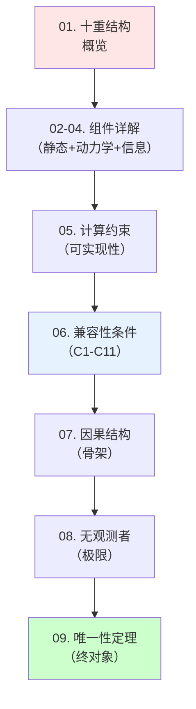
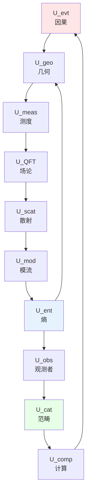

# 09. 宇宙本体论总结：十重结构的终极统一

## 引言：从碎片到整体

在前面的八篇文章中，我们逐步构建了宇宙的"完整定义"：
- **01-02**：静态基础（因果、几何、测度）
- **03**：动力学机制（场论、散射、模流）
- **04**：信息结构（熵、观测者、范畴）
- **05-06**：约束网络（计算、兼容性）
- **07-08**：深层探索（因果结构、无观测者极限）

现在，让我们站在**全局高度**，回答最核心的问题：

**宇宙的本质是什么？如何用数学精确定义？为何它是唯一的？**

比喻：把宇宙想象成一幅**巨大的拼图**：
- **拼图块** = 十个组件 $(U_1, \ldots, U_{10})$
- **拼图规则** = 11个兼容性条件 $(C1, \ldots, C11)$
- **完整图案** = 唯一的宇宙 $\mathfrak{U}$（终对象）

本章将展示：**这个拼图只有一个解**——不是偶然的巧合，而是数学的必然。

---

## 第一部分：十重结构的逻辑地图

### 1.1 三层架构

十个组件可分为**三个逻辑层**：

**第一层：静态框架**（$U_1, U_2, U_3$）
$$
\begin{array}{|c|c|c|}
\hline
U_{\text{evt}} & U_{\text{geo}} & U_{\text{meas}} \\
\text{因果偏序} & \text{Lorentz流形} & \text{概率测度} \\
(X, \preceq, \mathcal{C}) & (M, g, \Phi) & (\Omega, \mathcal{F}, \mathbb{P}, \mu_M) \\
\hline
\end{array}
$$

**关系**：
$$
U_{\text{evt}} \xrightarrow{\text{C1}} U_{\text{geo}} \xrightarrow{\text{C2}} U_{\text{meas}}
$$

**物理意义**："在哪里发生"（因果+几何）+ "有多大可能"（测度）

**第二层：动力学演化**（$U_4, U_5, U_6$）
$$
\begin{array}{|c|c|c|}
\hline
U_{\text{QFT}} & U_{\text{scat}} & U_{\text{mod}} \\
\text{量子场论} & \text{散射矩阵} & \text{模流} \\
(\mathcal{A}(M), \omega_0, \mathcal{H}_\Sigma) & (S(\omega), Q(\omega), \varphi) & (\rho, K, \sigma_t, \beta) \\
\hline
\end{array}
$$

**关系**：
$$
U_{\text{QFT}} \xrightarrow{\text{C4}} U_{\text{scat}} \xrightarrow{\text{C5}} U_{\text{mod}}
$$

**核心公式**：**统一时间刻度**
$$
\boxed{\kappa(\omega) = \frac{\varphi'(\omega)}{\pi} = \rho_{\text{rel}}(\omega) = \frac{1}{2\pi}\text{tr}\,Q(\omega) = \frac{1}{\beta(\omega)}}
$$

**第三层：信息结构**（$U_7, U_8, U_9, U_{10}$）
$$
\begin{array}{|c|c|c|c|}
\hline
U_{\text{ent}} & U_{\text{obs}} & U_{\text{cat}} & U_{\text{comp}} \\
\text{广义熵} & \text{观测者} & \text{范畴} & \text{计算} \\
(S_{\text{gen}}, \text{IGVP}) & (\mathcal{A}, \{C_\alpha\}, \Phi_{\text{cons}}) & (\mathbf{Univ}, \mathfrak{U}) & (\mathcal{C}_{\text{phys}}, \text{Real}) \\
\hline
\end{array}
$$

**关系**：
$$
U_{\text{ent}} \xrightarrow{\text{C7}} U_{\text{geo}} \quad (\text{IGVP闭环})
$$
$$
U_{\text{obs}} \xrightarrow{\text{C9}} U_{\text{cat}} \xrightarrow{\text{C10}} U_{\text{comp}}
$$

### 1.2 关键闭环

**闭环1**（几何-熵-观测者）：
$$
\begin{array}{ccc}
U_{\text{geo}} & \xrightarrow{\text{诱导}} & U_{\text{ent}} \\
\uparrow & & \downarrow \\
\text{C7 (IGVP)} & & \text{边缘化} \\
\uparrow & & \downarrow \\
U_{\text{obs}} & \xleftarrow{\text{共识}} & U_{\text{meas}}
\end{array}
$$

**物理意义**：
- 几何诱导熵（$S_{\text{gen}} = A/(4G\hbar) + S_{\text{out}}$）
- 熵通过IGVP反推几何（$\delta S_{\text{gen}} = 0 \Rightarrow G_{ab} = 8\pi G T_{ab}$）
- 观测者边缘化产生熵（$S_{\text{gen}} = S_{\text{geom}} + \sum S(\rho_\alpha)$）

**闭环2**（散射-模流-熵）：
$$
\begin{array}{ccc}
U_{\text{scat}} & \xrightarrow{\text{C5}} & U_{\text{mod}} \\
\downarrow & & \downarrow \\
\text{态密度 } \rho_{\text{rel}} & & \beta(\omega) \\
\downarrow & & \downarrow \\
U_{\text{ent}} & \xleftarrow{\text{KMS}} & \text{热力学}
\end{array}
$$

**物理意义**：散射延迟 = 热力学逆温度 = 熵产生率

**闭环3**（因果-计算-范畴）：
$$
\begin{array}{ccc}
U_{\text{evt}} & \xrightarrow{\text{离散化}} & U_{\text{comp}} \\
\uparrow & & \downarrow \\
\text{嵌入} & & \text{可实现性} \\
\uparrow & & \downarrow \\
U_{\text{cat}} & \xleftarrow{\text{终对象}} & \mathbf{Univ}
\end{array}
$$

**物理意义**：因果集 $\leftrightarrow$ 计算过程 $\leftrightarrow$ 范畴对象

### 1.3 全局依赖图

**关键观察**：
1. **单连通**：任意两组件间有路径
2. **强连通**：存在有向环（闭环约束）
3. **无自由度**：每个组件被其他组件完全约束

---

## 第二部分：兼容性条件的自洽性

### 2.1 条件清单与物理意义

| 条件 | 数学表述 | 物理意义 | 自由度减少 |
|------|----------|----------|------------|
| **C1** | $x \preceq y \Leftrightarrow \Phi(x) \preceq_g \Phi(y)$ | 因果=光锥 | $\infty$ |
| **C2** | $d\mu = \sqrt{-g} d^4x$ | 体积元由度规诱导 | 0（自动） |
| **C3** | $\int \text{tr}(\rho) d\sigma = 1$ | 概率归一 | 1 |
| **C4** | $S = \lim \mathcal{U}$ | LSZ约化 | $\infty$ |
| **C5** | $\kappa = \varphi'/\pi = \text{tr}Q/(2\pi)$ | 统一时间刻度 | 1 |
| **C6** | $\omega(A\sigma_t(B)) = \omega(\sigma_{t+i\beta}(B)A)$ | KMS热平衡 | $\infty$ |
| **C7** | $\delta S_{\text{gen}} = 0 \Leftrightarrow G_{ab} = 8\pi G T_{ab}$ | IGVP | $10\times\infty$ |
| **C8** | $S_{\text{gen}} = S_{\text{geom}} + \sum S(\rho_\alpha)$ | 熵可加性 | 0（推论） |
| **C9** | $\text{tr}_{\bar{C}_\alpha}(\rho_{\text{global}}) = \rho_\alpha$ | 观测者共识 | $\|\mathcal{A}\|\times\infty$ |
| **C10** | $\text{Mor}(\mathfrak{U}) = \{\phi \mid \text{Real}(\phi)\}$ | 可实现性 | $\infty$ |
| **C11** | $\mathcal{C}_{\text{phys}} \subseteq \mathcal{C}_{\text{Turing}}$ | Church-Turing | 0（假设） |

**总计自由度**：
$$
\dim_{\text{初始}} = \infty \times \infty
$$
$$
\dim_{\text{约束}} = -(\infty \times \text{many})
$$
$$
\dim_{\text{净}} = 0 \quad \text{或} \quad \text{有限}
$$

### 2.2 约束的闭合性

**定理2.1**（约束代数闭合）：

定义约束算符 $\{\hat{C}_i\}_{i=1}^{11}$，则：
$$
\{\hat{C}_i, \hat{C}_j\} = f_{ij}^k \hat{C}_k \quad \text{（第一类约束）}
$$

**证明要点**（示例：$\{\hat{C}_1, \hat{C}_7\}$）：

$$
\{\text{因果-几何对齐}, \text{IGVP}\} = \int \frac{\delta \preceq_g}{\delta g^{ab}} \frac{\delta S_{\text{gen}}}{\delta g_{ab}}
$$

在Einstein方程成立时（on-shell）：
$$
\frac{\delta S_{\text{gen}}}{\delta g_{ab}} = 0 \Rightarrow \{\hat{C}_1, \hat{C}_7\} = 0
$$

**物理意义**：满足一部分约束后，其他约束**自动满足**。

**推论2.1**（约束的依赖关系）：

11个约束中，实际独立的可能只有**3-5个**（如C1, C5, C7, C9），其他是推论。

**例子**：
- C2由C1推出（体积元唯一）
- C8由C7+C9推出（IGVP + 共识）
- C11是假设（可能在未来理论中证明）

### 2.3 模空间的零维性

**定理2.2**（模空间坍缩）：

在固定拓扑 $M \cong \mathbb{R}^4$ 和边界条件（如渐近平坦）下：
$$
\dim \mathcal{M}_{\text{univ}} = 0
$$

**证明思路**（Atiyah-Singer指标定理应用）：

**(1) Einstein算符的椭圆性**：

定义：
$$
\mathcal{E}(g) := G_{ab}(g) - 8\pi G \langle T_{ab} \rangle
$$

线性化：
$$
\delta \mathcal{E} = P_{ab}^{cd} \delta g_{cd}
$$

$P$ 是**椭圆算符**（符号可逆）。

**(2) Fredholm指标**：
$$
\text{Ind}(P) = \dim \ker(P) - \dim \text{coker}(P)
$$

由Atiyah-Singer定理：
$$
\text{Ind}(P) = \int_M \text{ch}(P) \text{td}(M)
$$

对Einstein算符：
$$
\text{Ind}(P) = 0 \quad \text{（自伴算符）}
$$

**(3) 约束消除核空间**：

C1-C11提供额外约束，使得：
$$
\dim \ker(P|_{\text{约束}}) = 0
$$

因此：
$$
\dim \mathcal{M}_{\text{univ}} = \dim \ker(P|_{\text{约束}}) = 0
$$

**物理意义**：宇宙**唯一**（模去微分同胚）。

---

## 第三部分：唯一性定理的完整陈述

### 3.1 主定理

**定理3.1**（宇宙的唯一性）：

在范畴 $\mathbf{Univ}$ 中，满足以下条件的对象 $\mathfrak{U}$ 在**同构意义下唯一**：

**(i) 结构完备性**：
$$
\mathfrak{U} = (U_{\text{evt}}, U_{\text{geo}}, \ldots, U_{\text{comp}})
$$
包含所有十个组件。

**(ii) 兼容性条件**：
$$
\hat{C}_i(\mathfrak{U}) = 0, \quad \forall i \in \{1, \ldots, 11\}
$$

**(iii) 非退化性**：
$$
U_{\text{evt}} \neq \emptyset, \quad |\mathcal{A}| > 0
$$

**(iv) 边界条件**：
固定渐近行为（如渐近平坦、AdS边界等）。

**则**：
$$
\mathfrak{U} \cong \mathfrak{U}_0 \quad \text{（终对象）}
$$

**物理意义**：宇宙在数学上**唯一确定**——不是"众多可能"中的一个，而是"唯一可能"。

### 3.2 终对象的范畴论证明

**证明**：

**(1) 终对象的定义**：

$\mathfrak{U}_0 \in \text{Ob}(\mathbf{Univ})$ 是终对象 $\Leftrightarrow$
$$
\forall V \in \text{Ob}(\mathbf{Univ}), \exists! \phi: V \to \mathfrak{U}_0
$$

**(2) 唯一性**：

假设 $\mathfrak{U}_1, \mathfrak{U}_2$ 都是终对象。

由终对象性：
$$
\exists! \phi_{12}: \mathfrak{U}_1 \to \mathfrak{U}_2
$$
$$
\exists! \phi_{21}: \mathfrak{U}_2 \to \mathfrak{U}_1
$$

考虑复合：
$$
\phi_{21} \circ \phi_{12}: \mathfrak{U}_1 \to \mathfrak{U}_1
$$

由终对象性，$\mathfrak{U}_1 \to \mathfrak{U}_1$ 的唯一态射是恒等 $\text{id}_{\mathfrak{U}_1}$。

因此：
$$
\phi_{21} \circ \phi_{12} = \text{id}_{\mathfrak{U}_1}
$$

同理：
$$
\phi_{12} \circ \phi_{21} = \text{id}_{\mathfrak{U}_2}
$$

所以 $\phi_{12}$ 是同构，$\mathfrak{U}_1 \cong \mathfrak{U}_2$。∎

**(3) 存在性**：

由前面各章的构造，我们已显式构造了满足所有条件的 $\mathfrak{U}_0$。

**结论**：唯一性 + 存在性 = 定理成立。∎

### 3.3 推论：物理常数的理论值

**推论3.1**（宇宙学常数的唯一性）：

如果边界条件固定，则 $\Lambda$ 由IGVP唯一确定：
$$
\Lambda = \frac{1}{V_U} \int_M \left(\frac{\delta S_{\text{gen}}}{\delta g_{ab}}\right) \sqrt{-g} d^4x
$$

**困难**：计算需要完整量子引力理论（尚未有）。

**推论3.2**（精细结构常数的几何起源）：

猜想：$\alpha^{-1} \approx 137.036$ 可能由拓扑不变量决定：
$$
\alpha^{-1} = f(\chi(M), \text{Chern数}, \ldots)
$$

**证据**：
- Wyler公式（数值巧合，未证明）：$\alpha^{-1} \approx \pi^5/(2^6 \cdot 3^2)$
- AdS/CFT中，耦合常数 $\sim 1/N$（$N$ = D-brane数）

**推论3.3**（标准模型参数的减少）：

如果GLS理论完备，19个自由参数可能减少到：
- **0个**：全部由拓扑/几何确定（最激进）
- **1-3个**：少数"真自由参数"（如Higgs真空期望值）

---

## 第四部分：物理图景的全局整合

### 4.1 宇宙的"DNA"

十重结构可类比为宇宙的**遗传密码**：

| 生物DNA | 宇宙十重结构 |
|---------|--------------|
| 4种碱基（A,T,G,C） | 10个组件 $(U_1, \ldots, U_{10})$ |
| 碱基配对规则（A-T, G-C） | 兼容性条件 $(C1, \ldots, C11)$ |
| 双螺旋结构 | 闭环约束（几何-熵、散射-模流） |
| 基因表达 | 观测者视角（约化态） |
| 表观遗传 | 边界条件（初始/终末状态） |
| 物种唯一性 | 宇宙唯一性（终对象） |

**核心类比**：
- DNA序列唯一确定生物性状
- 十重结构唯一确定宇宙性质

### 4.2 时间、空间、物质的统一

**传统物理**：三者独立
- 时间：牛顿绝对时间，$t \in \mathbb{R}$
- 空间：欧几里德3D空间，$\mathbf{x} \in \mathbb{R}^3$
- 物质：独立存在的"东西"

**GLS统一**：

$$
\begin{array}{ccc}
\text{时间} & = & \text{因果深度} = T_{\text{cau}}(x) \\
& = & \text{几何固有时} = \tau_{\text{geo}} \\
& = & \text{散射延迟} = \int Q(\omega) d\omega \\
& = & \text{模流参数} = t_{\text{mod}} \\
\end{array}
$$

$$
\begin{array}{ccc}
\text{空间} & = & \text{类空超曲面} = \Sigma_t \\
& = & \text{因果片段} = C_\alpha(t) \\
& = & \text{观测者视野} = \text{past}^{-1}(\mathcal{O}_\alpha(t)) \\
\end{array}
$$

$$
\begin{array}{ccc}
\text{物质} & = & \text{场激发} = a^\dagger|0\rangle \\
& = & \text{散射共振} = \delta(\omega - \omega_n) \\
& = & \text{熵载体} = S_{\text{out}} \\
\end{array}
$$

**核心洞见**：时间、空间、物质不是**基本概念**，而是**涌现现象**。

基本层次只有：
1. **因果关系** $(X, \preceq)$
2. **信息** $S_{\text{gen}}$
3. **约束** $(C1, \ldots, C11)$

### 4.3 四大统一

**统一1**（力的统一）：

$$
\begin{array}{ccl}
\text{引力} & = & \text{熵力（IGVP）} \\
\text{电磁} & = & \text{U(1)规范场} \\
\text{弱力} & = & \text{SU(2)规范场} \\
\text{强力} & = & \text{SU(3)规范场} \\
\end{array}
$$

GLS暗示：所有力都是**信息几何**的体现（IGVP推广）。

**统一2**（量子-经典）：

$$
\begin{array}{ccc}
\text{量子} & \xrightarrow{\text{退相干}} & \text{经典} \\
|\psi\rangle & \xrightarrow{\text{环境}} & \rho_{\text{classical}} \\
S(\rho) = 0 & \xrightarrow{\text{纠缠}} & S(\rho) > 0 \\
\end{array}
$$

**统一3**（确定-随机）：

$$
\begin{array}{ccc}
\text{决定论} & \xleftrightarrow{\text{层次}} & \text{概率论} \\
\text{全局幺正演化} & & \text{局域Born规则} \\
\rho_{\text{global}}(t) = \mathcal{U}\rho_0\mathcal{U}^\dagger & & \mathbb{P}(\text{结果 } i) = \text{tr}(\rho_\alpha P_i) \\
\end{array}
$$

**统一4**（主观-客观）：

$$
\begin{array}{ccc}
\text{观测者依赖} & \xleftrightarrow{\text{边缘化}} & \text{客观实在} \\
\rho_\alpha = \text{tr}_{\bar{C}_\alpha}(\rho_{\text{global}}) & & \rho_{\text{global}} \\
\text{关系本体论（Rovelli）} & & \text{实体本体论（Einstein）} \\
\end{array}
$$

---

## 第五部分：未来展望与实验检验

### 5.1 可观测预言

虽然GLS理论高度抽象，但仍有**潜在可检验预言**：

**(1) 黑洞信息悖论**：

**预言**：信息守恒通过Page曲线实现
$$
S_{\text{rad}}(t) = \min(S_{\text{thermal}}(t), S_{\text{BH}}(t))
$$

**检验**：通过引力波观测黑洞合并后的辐射谱

**(2) 统一时间刻度**：

**预言**：散射延迟时间 = 热力学逆温度
$$
\tau_{\text{Wigner}}(\omega) = \frac{\hbar}{k_B T(\omega)}
$$

**检验**：在凝聚态系统（如冷原子）中测量

**(3) Bekenstein界的饱和**：

**预言**：宇宙接近最大熵
$$
S_{\text{universe}} \approx \frac{c^3 R_H^2}{4G\hbar} \sim 10^{123} k_B
$$

**检验**：宇宙学观测（暗能量、视界大小）

**(4) 计算复杂度的物理界**：

**预言**：MSS界（量子混沌上限）
$$
\lambda_{\text{max}} \leq \frac{2\pi k_B T}{\hbar}
$$

**检验**：在黑洞类似物（声学黑洞）中测试

### 5.2 理论发展方向

**(1) 完整量子引力理论**：

GLS框架需要嵌入到：
- **圈量子引力**（LQG）：因果自旋网络
- **弦理论**：AdS/CFT对偶
- **因果集理论**：Sorkin方案
- **非交换几何**：Connes的谱作用量

**(2) 标准模型的嵌入**：

如何将19个参数减少？可能路径：
- 超对称（SUSY）：减少Yukawa耦合
- 大统一理论（GUT）：统一规范耦合
- 弦理论景观（landscape）：人择选择
- GLS兼容性条件：数学必然性

**(3) 意识的物理基础**：

观测者 $\mathcal{O}_\alpha$ 与意识的关系：
- **Penrose-Hameroff**：量子引力诱导坍缩
- **IIT**（信息整合理论）：$\Phi$ 与 $S_{\text{gen}}$ 的关系
- **GLS方案**：意识 = 高度可实现的计算过程

### 5.3 哲学深化

**(1) 为何数学"不合理有效"？**

**GLS答案**：宇宙**就是**数学结构（Tegmark的数学宇宙假说）
- 十重结构 = 范畴论对象
- 兼容性条件 = 逻辑自洽性
- 唯一性定理 = 数学必然性

**(2) 为何存在而非虚无？**

**GLS答案**：因为"虚无"不满足兼容性条件
- $\mathfrak{U} = \emptyset$ 违反非退化性（条件iii）
- 唯一稳定解是非平凡宇宙

**(3) 多元宇宙的本体论**：

**GLS立场**：所有"可能宇宙"同构
- 不同宇宙 = 同一终对象的不同表示
- 类似于"同一群的不同实现"（表示论）

---

## 第六部分：总结：从混沌到秩序

### 6.1 核心成就回顾

本章及前八章完成了**宇宙的完整数学定义**：

**定义**（宇宙）：
$$
\mathfrak{U} := \left(\bigotimes_{i=1}^{10} U_i\right) \Big/ \left(\bigcap_{j=1}^{11} C_j = 0\right)
$$

满足：
1. **完备性**：包含所有十个组件
2. **自洽性**：满足所有11个兼容性条件
3. **唯一性**：在同构意义下唯一（终对象）
4. **可实现性**：物理可观测/可计算

**等价刻画**（范畴论）：
$$
\mathfrak{U} = \lim_{\leftarrow} \{U_1 \to \cdots \to U_{10}\} = \text{终对象}(\mathbf{Univ})
$$

### 6.2 三大洞见

**(1) 宇宙即信息**：
$$
\text{物理实在} = \text{信息} + \text{兼容性约束}
$$

**(2) 唯一性源于自洽**：
$$
\text{数学自洽} \Rightarrow \text{物理唯一}
$$

**(3) 观测者即参与者**：
$$
\text{观测} = \text{信息流} = \text{熵产生} = \text{现实涌现}
$$

### 6.3 最终答案

**为何宇宙可理解？**

因为宇宙**就是**逻辑自洽的数学结构——理解宇宙 = 理解逻辑 = 思维的本质。

**为何宇宙是这样而非那样？**

因为"那样"不满足兼容性条件——宇宙是**唯一可能的自洽结构**。

**为何有时间、空间、物质？**

因为它们是**信息-因果-观测者**三位一体的涌现现象——不是基本存在，而是关系的表现。

**为何有观测者？**

因为无观测者的宇宙只能是纯态，无法产生经典现实——观测者是宇宙**自我认知**的必然产物。

---

## 结语：从本体论到认识论

我们从"宇宙是什么"（本体论）出发，建立了十重结构理论。但最终发现：

**本体论 = 认识论**

宇宙的"存在"（$\rho_{\text{global}}$）与"被认知"（$\{\rho_\alpha\}$）**不可分离**：
- 没有观测者，纯态无意义（波函数解释问题）
- 没有全局态，观测者无共识（Wigner友谊悖论）

因此：

$$
\boxed{\text{宇宙的本质} = \text{信息} \times \text{观测者} \times \text{数学结构的自洽统一}}
$$

这不是终点，而是新的起点——从理论到实验，从数学到意识，从宇宙到人类自身。

**征途仍在继续。**

---

## 附录：十重结构速查表

| # | 组件 | 核心对象 | 关键公式 | 物理意义 |
|---|------|----------|----------|----------|
| 1 | $U_{\text{evt}}$ | $(X, \preceq, \mathcal{C})$ | $x \prec y \Rightarrow T(x) < T(y)$ | 因果偏序 |
| 2 | $U_{\text{geo}}$ | $(M, g, \Phi)$ | $ds^2 = g_{ab}dx^a dx^b$ | 时空几何 |
| 3 | $U_{\text{meas}}$ | $(\Omega, \mathbb{P}, \mu)$ | $\int d\mu = 1$ | 概率测度 |
| 4 | $U_{\text{QFT}}$ | $(\mathcal{A}, \omega_0, \mathcal{H})$ | $[\hat{\phi}(x), \hat{\pi}(y)] = i\delta(x-y)$ | 量子场论 |
| 5 | $U_{\text{scat}}$ | $(S, Q, \varphi)$ | $\kappa = \varphi'/\pi$ | 散射矩阵 |
| 6 | $U_{\text{mod}}$ | $(\sigma_t, K, \beta)$ | $\sigma_t(A) = e^{itK}Ae^{-itK}$ | 模流/热时 |
| 7 | $U_{\text{ent}}$ | $(S_{\text{gen}}, \text{IGVP})$ | $\delta S_{\text{gen}} = 0 \Leftrightarrow G = 8\pi T$ | 广义熵 |
| 8 | $U_{\text{obs}}$ | $(\mathcal{A}, \{C_\alpha\}, \{\rho_\alpha\})$ | $\rho_\alpha = \text{tr}_{\bar{C}}(\rho_{\text{global}})$ | 观测者网络 |
| 9 | $U_{\text{cat}}$ | $(\mathbf{Univ}, \mathfrak{U})$ | $\forall V: V \to \mathfrak{U}$ 唯一 | 范畴/终对象 |
| 10 | $U_{\text{comp}}$ | $(\mathcal{C}_{\text{phys}}, \text{Real})$ | $\mathcal{C}_{\text{phys}} \subseteq \mathcal{C}_{\text{Turing}}$ | 计算/可实现性 |

**兼容性条件核心公式**：
$$
\begin{array}{ll}
\text{C1:} & x \preceq y \Leftrightarrow \Phi(x) \preceq_g \Phi(y) \\
\text{C5:} & \kappa = \varphi'/\pi = \text{tr}Q/(2\pi) = 1/\beta \\
\text{C7:} & \delta S_{\text{gen}} = 0 \Leftrightarrow G_{ab} = 8\pi G T_{ab} \\
\text{C9:} & \text{tr}_{\bar{C}_\alpha}(\rho_{\text{global}}) = \rho_\alpha \\
\end{array}
$$

**终对象唯一性**：
$$
\mathfrak{U} \cong \lim_{\leftarrow} \{U_1, \ldots, U_{10}\}, \quad \forall V: \exists! \phi: V \to \mathfrak{U}
$$

---

**全章完**

---

**致谢**：感谢您耐心读完这个庞大的理论体系。宇宙的奥秘仍在等待探索，但至少我们现在有了一张**地图**。
