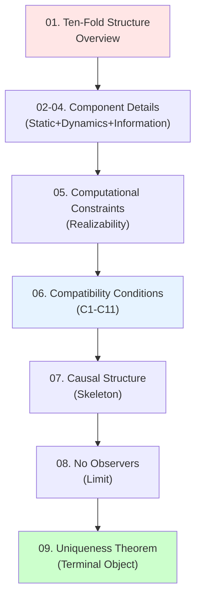
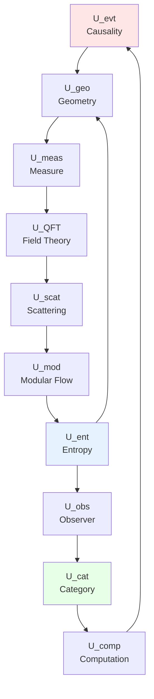

# 09. Summary of Universe Ontology: Ultimate Unification of Ten-Fold Structure

## Introduction: From Fragments to Whole

In previous eight articles, we gradually constructed "complete definition" of universe:
- **01-02**: Static foundation (causality, geometry, measure)
- **03**: Dynamical mechanisms (field theory, scattering, modular flow)
- **04**: Information structure (entropy, observer, category)
- **05-06**: Constraint network (computation, compatibility)
- **07-08**: Deep exploration (causal structure, observer-free limit)

Now, let us stand at **global height** and answer most core questions:

**What is essence of universe? How to precisely define it mathematically? Why is it unique?**

Analogy: Imagine universe as **giant jigsaw puzzle**:
- **Puzzle pieces** = Ten components $(U_1, \ldots, U_{10})$
- **Puzzle rules** = 11 compatibility conditions $(C1, \ldots, C11)$
- **Complete pattern** = Unique universe $\mathfrak{U}$ (terminal object)

This chapter will show: **This puzzle has only one solution**—not accidental coincidence, but mathematical necessity.

---

## Part I: Logical Map of Ten-Fold Structure

### 1.1 Three-Layer Architecture

Ten components can be divided into **three logical layers**:

**First Layer: Static Framework** ($U_1, U_2, U_3$)
$$
\begin{array}{|c|c|c|}
\hline
U_{\text{evt}} & U_{\text{geo}} & U_{\text{meas}} \\
\text{Causal Partial Order} & \text{Lorentz Manifold} & \text{Probability Measure} \\
(X, \preceq, \mathcal{C}) & (M, g, \Phi) & (\Omega, \mathcal{F}, \mathbb{P}, \mu_M) \\
\hline
\end{array}
$$

**Relations**:
$$
U_{\text{evt}} \xrightarrow{\text{C1}} U_{\text{geo}} \xrightarrow{\text{C2}} U_{\text{meas}}
$$

**Physical Meaning**: "Where it happens" (causality+geometry) + "How likely" (measure)

**Second Layer: Dynamical Evolution** ($U_4, U_5, U_6$)
$$
\begin{array}{|c|c|c|}
\hline
U_{\text{QFT}} & U_{\text{scat}} & U_{\text{mod}} \\
\text{Quantum Field Theory} & \text{Scattering Matrix} & \text{Modular Flow} \\
(\mathcal{A}(M), \omega_0, \mathcal{H}_\Sigma) & (S(\omega), Q(\omega), \varphi) & (\rho, K, \sigma_t, \beta) \\
\hline
\end{array}
$$

**Relations**:
$$
U_{\text{QFT}} \xrightarrow{\text{C4}} U_{\text{scat}} \xrightarrow{\text{C5}} U_{\text{mod}}
$$

**Core Formula**: **Unified Time Scale**
$$
\boxed{\kappa(\omega) = \frac{\varphi'(\omega)}{\pi} = \rho_{\text{rel}}(\omega) = \frac{1}{2\pi}\text{tr}\,Q(\omega) = \frac{1}{\beta(\omega)}}
$$

**Third Layer: Information Structure** ($U_7, U_8, U_9, U_{10}$)
$$
\begin{array}{|c|c|c|c|}
\hline
U_{\text{ent}} & U_{\text{obs}} & U_{\text{cat}} & U_{\text{comp}} \\
\text{Generalized Entropy} & \text{Observer} & \text{Category} & \text{Computation} \\
(S_{\text{gen}}, \text{IGVP}) & (\mathcal{A}, \{C_\alpha\}, \Phi_{\text{cons}}) & (\mathbf{Univ}, \mathfrak{U}) & (\mathcal{C}_{\text{phys}}, \text{Real}) \\
\hline
\end{array}
$$

**Relations**:
$$
U_{\text{ent}} \xrightarrow{\text{C7}} U_{\text{geo}} \quad \text{(IGVP closed loop)}
$$
$$
U_{\text{obs}} \xrightarrow{\text{C9}} U_{\text{cat}} \xrightarrow{\text{C10}} U_{\text{comp}}
$$

### 1.2 Key Closed Loops

**Closed Loop 1** (Geometry-Entropy-Observer):
$$
\begin{array}{ccc}
U_{\text{geo}} & \xrightarrow{\text{induces}} & U_{\text{ent}} \\
\uparrow & & \downarrow \\
\text{C7 (IGVP)} & & \text{marginalization} \\
\uparrow & & \downarrow \\
U_{\text{obs}} & \xleftarrow{\text{consensus}} & U_{\text{meas}}
\end{array}
$$

**Physical Meaning**:
- Geometry induces entropy ($S_{\text{gen}} = A/(4G\hbar) + S_{\text{out}}$)
- Entropy reverse derives geometry through IGVP ($\delta S_{\text{gen}} = 0 \Rightarrow G_{ab} = 8\pi G T_{ab}$)
- Observer marginalization produces entropy ($S_{\text{gen}} = S_{\text{geom}} + \sum S(\rho_\alpha)$)

**Closed Loop 2** (Scattering-Modular Flow-Entropy):
$$
\begin{array}{ccc}
U_{\text{scat}} & \xrightarrow{\text{C5}} & U_{\text{mod}} \\
\downarrow & & \downarrow \\
\text{density of states } \rho_{\text{rel}} & & \beta(\omega) \\
\downarrow & & \downarrow \\
U_{\text{ent}} & \xleftarrow{\text{KMS}} & \text{thermodynamics}
\end{array}
$$

**Physical Meaning**: Scattering delay = Thermodynamic inverse temperature = Entropy production rate

**Closed Loop 3** (Causality-Computation-Category):
$$
\begin{array}{ccc}
U_{\text{evt}} & \xrightarrow{\text{discretization}} & U_{\text{comp}} \\
\uparrow & & \downarrow \\
\text{embedding} & & \text{realizability} \\
\uparrow & & \downarrow \\
U_{\text{cat}} & \xleftarrow{\text{terminal object}} & \mathbf{Univ}
\end{array}
$$

**Physical Meaning**: Causal set $\leftrightarrow$ Computational process $\leftrightarrow$ Categorical object

### 1.3 Global Dependency Graph

**Key Observations**:
1. **Simply Connected**: Path between any two components
2. **Strongly Connected**: Exists directed cycles (closed loop constraints)
3. **No Degrees of Freedom**: Each component completely constrained by others

---

## Part II: Self-Consistency of Compatibility Conditions

### 2.1 Condition List and Physical Meaning

| Condition | Mathematical Formulation | Physical Meaning | Degree Reduction |
|-----------|-------------------------|------------------|------------------|
| **C1** | $x \preceq y \Leftrightarrow \Phi(x) \preceq_g \Phi(y)$ | Causality = Light cone | $\infty$ |
| **C2** | $d\mu = \sqrt{-g} d^4x$ | Volume element induced by metric | 0 (automatic) |
| **C3** | $\int \text{tr}(\rho) d\sigma = 1$ | Probability normalization | 1 |
| **C4** | $S = \lim \mathcal{U}$ | LSZ reduction | $\infty$ |
| **C5** | $\kappa = \varphi'/\pi = \text{tr}Q/(2\pi)$ | Unified time scale | 1 |
| **C6** | $\omega(A\sigma_t(B)) = \omega(\sigma_{t+i\beta}(B)A)$ | KMS thermal equilibrium | $\infty$ |
| **C7** | $\delta S_{\text{gen}} = 0 \Leftrightarrow G_{ab} = 8\pi G T_{ab}$ | IGVP | $10\times\infty$ |
| **C8** | $S_{\text{gen}} = S_{\text{geom}} + \sum S(\rho_\alpha)$ | Entropy additivity | 0 (corollary) |
| **C9** | $\text{tr}_{\bar{C}_\alpha}(\rho_{\text{global}}) = \rho_\alpha$ | Observer consensus | $\|\mathcal{A}\|\times\infty$ |
| **C10** | $\text{Mor}(\mathfrak{U}) = \{\phi \mid \text{Real}(\phi)\}$ | Realizability | $\infty$ |
| **C11** | $\mathcal{C}_{\text{phys}} \subseteq \mathcal{C}_{\text{Turing}}$ | Church-Turing | 0 (assumption) |

**Total Degrees of Freedom**:
$$
\dim_{\text{initial}} = \infty \times \infty
$$
$$
\dim_{\text{constrained}} = -(\infty \times \text{many})
$$
$$
\dim_{\text{net}} = 0 \quad \text{or} \quad \text{finite}
$$

### 2.2 Closure of Constraints

**Theorem 2.1** (Closure of Constraint Algebra):

Define constraint operators $\{\hat{C}_i\}_{i=1}^{11}$, then:
$$
\{\hat{C}_i, \hat{C}_j\} = f_{ij}^k \hat{C}_k \quad \text{(first-class constraints)}
$$

**Proof Outline** (Example: $\{\hat{C}_1, \hat{C}_7\}$):

$$
\{\text{causal-geometric alignment}, \text{IGVP}\} = \int \frac{\delta \preceq_g}{\delta g^{ab}} \frac{\delta S_{\text{gen}}}{\delta g_{ab}}
$$

When Einstein equation holds (on-shell):
$$
\frac{\delta S_{\text{gen}}}{\delta g_{ab}} = 0 \Rightarrow \{\hat{C}_1, \hat{C}_7\} = 0
$$

**Physical Meaning**: After satisfying some constraints, others **automatically satisfied**.

**Corollary 2.1** (Dependency Relations of Constraints):

Among 11 constraints, actually independent may be only **3-5** (e.g., C1, C5, C7, C9), others are corollaries.

**Examples**:
- C2 derived from C1 (volume element unique)
- C8 derived from C7+C9 (IGVP + consensus)
- C11 is assumption (may be proven in future theory)

### 2.3 Zero-Dimensionality of Moduli Space

**Theorem 2.2** (Collapse of Moduli Space):

For fixed topology $M \cong \mathbb{R}^4$ and boundary conditions (e.g., asymptotically flat):
$$
\dim \mathcal{M}_{\text{univ}} = 0
$$

**Proof Outline** (Application of Atiyah-Singer Index Theorem):

**(1) Ellipticity of Einstein Operator**:

Define:
$$
\mathcal{E}(g) := G_{ab}(g) - 8\pi G \langle T_{ab} \rangle
$$

Linearize:
$$
\delta \mathcal{E} = P_{ab}^{cd} \delta g_{cd}
$$

$P$ is **elliptic operator** (symbol invertible).

**(2) Fredholm Index**:
$$
\text{Ind}(P) = \dim \ker(P) - \dim \text{coker}(P)
$$

By Atiyah-Singer theorem:
$$
\text{Ind}(P) = \int_M \text{ch}(P) \text{td}(M)
$$

For Einstein operator:
$$
\text{Ind}(P) = 0 \quad \text{(self-adjoint operator)}
$$

**(3) Constraints Eliminate Kernel**:

C1-C11 provide additional constraints, such that:
$$
\dim \ker(P|_{\text{constrained}}) = 0
$$

Therefore:
$$
\dim \mathcal{M}_{\text{univ}} = \dim \ker(P|_{\text{constrained}}) = 0
$$

**Physical Meaning**: Universe **unique** (modulo diffeomorphisms).

---

## Part III: Complete Statement of Uniqueness Theorem

### 3.1 Main Theorem

**Theorem 3.1** (Uniqueness of Universe):

In category $\mathbf{Univ}$, object $\mathfrak{U}$ satisfying following conditions is **unique up to isomorphism**:

**(i) Structural Completeness**:
$$
\mathfrak{U} = (U_{\text{evt}}, U_{\text{geo}}, \ldots, U_{\text{comp}})
$$
contains all ten components.

**(ii) Compatibility Conditions**:
$$
\hat{C}_i(\mathfrak{U}) = 0, \quad \forall i \in \{1, \ldots, 11\}
$$

**(iii) Non-Degeneracy**:
$$
U_{\text{evt}} \neq \emptyset, \quad |\mathcal{A}| > 0
$$

**(iv) Boundary Conditions**:
Fixed asymptotic behavior (e.g., asymptotically flat, AdS boundary, etc.).

**Then**:
$$
\mathfrak{U} \cong \mathfrak{U}_0 \quad \text{(terminal object)}
$$

**Physical Meaning**: Universe mathematically **uniquely determined**—not "one among many possibilities", but "only possibility".

### 3.2 Categorical Proof of Terminal Object

**Proof**:

**(1) Definition of Terminal Object**:

$\mathfrak{U}_0 \in \text{Ob}(\mathbf{Univ})$ is terminal object $\Leftrightarrow$
$$
\forall V \in \text{Ob}(\mathbf{Univ}), \exists! \phi: V \to \mathfrak{U}_0
$$

**(2) Uniqueness**:

Assume $\mathfrak{U}_1, \mathfrak{U}_2$ are both terminal objects.

By terminal object property:
$$
\exists! \phi_{12}: \mathfrak{U}_1 \to \mathfrak{U}_2
$$
$$
\exists! \phi_{21}: \mathfrak{U}_2 \to \mathfrak{U}_1
$$

Consider composition:
$$
\phi_{21} \circ \phi_{12}: \mathfrak{U}_1 \to \mathfrak{U}_1
$$

By terminal object property, unique morphism $\mathfrak{U}_1 \to \mathfrak{U}_1$ is identity $\text{id}_{\mathfrak{U}_1}$.

Therefore:
$$
\phi_{21} \circ \phi_{12} = \text{id}_{\mathfrak{U}_1}
$$

Similarly:
$$
\phi_{12} \circ \phi_{21} = \text{id}_{\mathfrak{U}_2}
$$

So $\phi_{12}$ is isomorphism, $\mathfrak{U}_1 \cong \mathfrak{U}_2$. ∎

**(3) Existence**:

By constructions in previous chapters, we have explicitly constructed $\mathfrak{U}_0$ satisfying all conditions.

**Conclusion**: Uniqueness + Existence = Theorem holds. ∎

### 3.3 Corollaries: Theoretical Values of Physical Constants

**Corollary 3.1** (Uniqueness of Cosmological Constant):

If boundary conditions fixed, then $\Lambda$ uniquely determined by IGVP:
$$
\Lambda = \frac{1}{V_U} \int_M \left(\frac{\delta S_{\text{gen}}}{\delta g_{ab}}\right) \sqrt{-g} d^4x
$$

**Difficulty**: Calculation requires complete quantum gravity theory (not yet available).

**Corollary 3.2** (Geometric Origin of Fine Structure Constant):

Conjecture: $\alpha^{-1} \approx 137.036$ may be determined by topological invariants:
$$
\alpha^{-1} = f(\chi(M), \text{Chern numbers}, \ldots)
$$

**Evidence**:
- Wyler formula (numerical coincidence, unproven): $\alpha^{-1} \approx \pi^5/(2^6 \cdot 3^2)$
- In AdS/CFT, coupling constant $\sim 1/N$ ($N$ = D-brane number)

**Corollary 3.3** (Reduction of Standard Model Parameters):

If GLS theory complete, 19 free parameters may reduce to:
- **0**: All determined by topology/geometry (most radical)
- **1-3**: Few "truly free parameters" (e.g., Higgs vacuum expectation value)

---

## Part IV: Global Integration of Physical Picture

### 4.1 "DNA" of Universe

Ten-fold structure can be analogized to **genetic code** of universe:

| Biological DNA | Universe Ten-Fold Structure |
|----------------|----------------------------|
| 4 bases (A,T,G,C) | 10 components $(U_1, \ldots, U_{10})$ |
| Base pairing rules (A-T, G-C) | Compatibility conditions $(C1, \ldots, C11)$ |
| Double helix structure | Closed loop constraints (geometry-entropy, scattering-modular flow) |
| Gene expression | Observer perspective (reduced states) |
| Epigenetics | Boundary conditions (initial/final states) |
| Species uniqueness | Universe uniqueness (terminal object) |

**Core Analogy**:
- DNA sequence uniquely determines biological traits
- Ten-fold structure uniquely determines universe properties

### 4.2 Unification of Time, Space, Matter

**Traditional Physics**: Three independent
- Time: Newton absolute time, $t \in \mathbb{R}$
- Space: Euclidean 3D space, $\mathbf{x} \in \mathbb{R}^3$
- Matter: Independently existing "stuff"

**GLS Unification**:

$$
\begin{array}{ccc}
\text{Time} & = & \text{Causal depth} = T_{\text{cau}}(x) \\
& = & \text{Geometric proper time} = \tau_{\text{geo}} \\
& = & \text{Scattering delay} = \int Q(\omega) d\omega \\
& = & \text{Modular flow parameter} = t_{\text{mod}} \\
\end{array}
$$

$$
\begin{array}{ccc}
\text{Space} & = & \text{Spacelike hypersurface} = \Sigma_t \\
& = & \text{Causal fragment} = C_\alpha(t) \\
& = & \text{Observer view} = \text{past}^{-1}(\mathcal{O}_\alpha(t)) \\
\end{array}
$$

$$
\begin{array}{ccc}
\text{Matter} & = & \text{Field excitation} = a^\dagger|0\rangle \\
& = & \text{Scattering resonance} = \delta(\omega - \omega_n) \\
& = & \text{Entropy carrier} = S_{\text{out}} \\
\end{array}
$$

**Core Insight**: Time, space, matter are not **fundamental concepts**, but **emergent phenomena**.

Fundamental level only has:
1. **Causality** $(X, \preceq)$
2. **Information** $S_{\text{gen}}$
3. **Constraints** $(C1, \ldots, C11)$

### 4.3 Four Unifications

**Unification 1** (Unification of Forces):

$$
\begin{array}{ccl}
\text{Gravity} & = & \text{Entropy force (IGVP)} \\
\text{Electromagnetic} & = & \text{U(1) gauge field} \\
\text{Weak} & = & \text{SU(2) gauge field} \\
\text{Strong} & = & \text{SU(3) gauge field} \\
\end{array}
$$

GLS suggests: All forces are manifestations of **information geometry** (IGVP generalization).

**Unification 2** (Quantum-Classical):

$$
\begin{array}{ccc}
\text{Quantum} & \xrightarrow{\text{decoherence}} & \text{Classical} \\
|\psi\rangle & \xrightarrow{\text{environment}} & \rho_{\text{classical}} \\
S(\rho) = 0 & \xrightarrow{\text{entanglement}} & S(\rho) > 0 \\
\end{array}
$$

**Unification 3** (Deterministic-Random):

$$
\begin{array}{ccc}
\text{Determinism} & \xleftrightarrow{\text{levels}} & \text{Probability} \\
\text{Global unitary evolution} & & \text{Local Born rule} \\
\rho_{\text{global}}(t) = \mathcal{U}\rho_0\mathcal{U}^\dagger & & \mathbb{P}(\text{outcome } i) = \text{tr}(\rho_\alpha P_i) \\
\end{array}
$$

**Unification 4** (Subjective-Objective):

$$
\begin{array}{ccc}
\text{Observer-dependent} & \xleftrightarrow{\text{marginalization}} & \text{Objective reality} \\
\rho_\alpha = \text{tr}_{\bar{C}_\alpha}(\rho_{\text{global}}) & & \rho_{\text{global}} \\
\text{Relational ontology (Rovelli)} & & \text{Substance ontology (Einstein)} \\
\end{array}
$$

---

## Part V: Future Outlook and Experimental Tests

### 5.1 Observable Predictions

Although GLS theory highly abstract, still has **potentially testable predictions**:

**(1) Black Hole Information Paradox**:

**Prediction**: Information conservation through Page curve
$$
S_{\text{rad}}(t) = \min(S_{\text{thermal}}(t), S_{\text{BH}}(t))
$$

**Test**: Through gravitational wave observations of radiation spectrum after black hole merger

**(2) Unified Time Scale**:

**Prediction**: Scattering delay time = Thermodynamic inverse temperature
$$
\tau_{\text{Wigner}}(\omega) = \frac{\hbar}{k_B T(\omega)}
$$

**Test**: Measure in condensed matter systems (e.g., cold atoms)

**(3) Saturation of Bekenstein Bound**:

**Prediction**: Universe near maximum entropy
$$
S_{\text{universe}} \approx \frac{c^3 R_H^2}{4G\hbar} \sim 10^{123} k_B
$$

**Test**: Cosmological observations (dark energy, horizon size)

**(4) Physical Boundary of Computational Complexity**:

**Prediction**: MSS bound (quantum chaos upper bound)
$$
\lambda_{\text{max}} \leq \frac{2\pi k_B T}{\hbar}
$$

**Test**: In black hole analogs (acoustic black holes)

### 5.2 Theoretical Development Directions

**(1) Complete Quantum Gravity Theory**:

GLS framework needs embedding into:
- **Loop Quantum Gravity** (LQG): Causal spin networks
- **String Theory**: AdS/CFT duality
- **Causal Set Theory**: Sorkin program
- **Noncommutative Geometry**: Connes' spectral action

**(2) Embedding of Standard Model**:

How to reduce 19 parameters? Possible paths:
- Supersymmetry (SUSY): Reduce Yukawa couplings
- Grand Unified Theory (GUT): Unify gauge couplings
- String landscape: Anthropic selection
- GLS compatibility conditions: Mathematical necessity

**(3) Physical Basis of Consciousness**:

Relation between observer $\mathcal{O}_\alpha$ and consciousness:
- **Penrose-Hameroff**: Quantum gravity induced collapse
- **IIT** (Integrated Information Theory): Relation between $\Phi$ and $S_{\text{gen}}$
- **GLS Scheme**: Consciousness = Highly realizable computational process

### 5.3 Philosophical Deepening

**(1) Why is Mathematics "Unreasonably Effective"?**

**GLS Answer**: Universe **is** mathematical structure (Tegmark's mathematical universe hypothesis)
- Ten-fold structure = Categorical object
- Compatibility conditions = Logical self-consistency
- Uniqueness theorem = Mathematical necessity

**(2) Why Existence Rather Than Nothingness?**

**GLS Answer**: Because "nothingness" does not satisfy compatibility conditions
- $\mathfrak{U} = \emptyset$ violates non-degeneracy (condition iii)
- Only stable solution is non-trivial universe

**(3) Ontology of Multiverse**:

**GLS Position**: All "possible universes" isomorphic
- Different universes = Different representations of same terminal object
- Similar to "different realizations of same group" (representation theory)

---

## Part VI: Summary: From Chaos to Order

### 6.1 Review of Core Achievements

This chapter and previous eight chapters completed **complete mathematical definition of universe**:

**Definition** (Universe):
$$
\mathfrak{U} := \left(\bigotimes_{i=1}^{10} U_i\right) \Big/ \left(\bigcap_{j=1}^{11} C_j = 0\right)
$$

Satisfying:
1. **Completeness**: Contains all ten components
2. **Self-Consistency**: Satisfies all 11 compatibility conditions
3. **Uniqueness**: Unique up to isomorphism (terminal object)
4. **Realizability**: Physically observable/computable

**Equivalent Characterization** (Category Theory):
$$
\mathfrak{U} = \lim_{\leftarrow} \{U_1 \to \cdots \to U_{10}\} = \text{terminal object}(\mathbf{Univ})
$$

### 6.2 Three Core Insights

**(1) Universe is Information**:
$$
\text{Physical Reality} = \text{Information} + \text{Compatibility Constraints}
$$

**(2) Uniqueness Arises from Self-Consistency**:
$$
\text{Mathematical Self-Consistency} \Rightarrow \text{Physical Uniqueness}
$$

**(3) Observer is Participant**:
$$
\text{Observation} = \text{Information Flow} = \text{Entropy Production} = \text{Reality Emergence}
$$

### 6.3 Final Answers

**Why is Universe Comprehensible?**

Because universe **is** logically self-consistent mathematical structure—understanding universe = understanding logic = essence of thought.

**Why is Universe This Way Rather Than That?**

Because "that" does not satisfy compatibility conditions—universe is **only possible self-consistent structure**.

**Why Time, Space, Matter?**

Because they are emergent phenomena of **trinity of information-causality-observer**—not fundamental existence, but manifestation of relations.

**Why Observers?**

Because universe without observers can only be pure state, cannot produce classical reality—observers are inevitable product of universe's **self-awareness**.

---

## Epilogue: From Ontology to Epistemology

We started from "what is universe" (ontology) and established ten-fold structure theory. But ultimately discovered:

**Ontology = Epistemology**

Universe's "existence" ($\rho_{\text{global}}$) and "being known" ($\{\rho_\alpha\}$) **inseparable**:
- Without observers, pure state meaningless (wave function interpretation problem)
- Without global state, observers have no consensus (Wigner's friend paradox)

Therefore:

$$
\boxed{\text{Essence of Universe} = \text{Information} \times \text{Observer} \times \text{Self-Consistent Unification of Mathematical Structure}}
$$

This is not endpoint, but new starting point—from theory to experiment, from mathematics to consciousness, from universe to humanity itself.

**Journey continues.**

---

## Appendix: Quick Reference Table of Ten-Fold Structure

| # | Component | Core Object | Key Formula | Physical Meaning |
|---|-----------|-------------|-------------|-----------------|
| 1 | $U_{\text{evt}}$ | $(X, \preceq, \mathcal{C})$ | $x \prec y \Rightarrow T(x) < T(y)$ | Causal partial order |
| 2 | $U_{\text{geo}}$ | $(M, g, \Phi)$ | $ds^2 = g_{ab}dx^a dx^b$ | Spacetime geometry |
| 3 | $U_{\text{meas}}$ | $(\Omega, \mathbb{P}, \mu)$ | $\int d\mu = 1$ | Probability measure |
| 4 | $U_{\text{QFT}}$ | $(\mathcal{A}, \omega_0, \mathcal{H})$ | $[\hat{\phi}(x), \hat{\pi}(y)] = i\delta(x-y)$ | Quantum field theory |
| 5 | $U_{\text{scat}}$ | $(S, Q, \varphi)$ | $\kappa = \varphi'/\pi$ | Scattering matrix |
| 6 | $U_{\text{mod}}$ | $(\sigma_t, K, \beta)$ | $\sigma_t(A) = e^{itK}Ae^{-itK}$ | Modular flow/thermal time |
| 7 | $U_{\text{ent}}$ | $(S_{\text{gen}}, \text{IGVP})$ | $\delta S_{\text{gen}} = 0 \Leftrightarrow G = 8\pi T$ | Generalized entropy |
| 8 | $U_{\text{obs}}$ | $(\mathcal{A}, \{C_\alpha\}, \{\rho_\alpha\})$ | $\rho_\alpha = \text{tr}_{\bar{C}}(\rho_{\text{global}})$ | Observer network |
| 9 | $U_{\text{cat}}$ | $(\mathbf{Univ}, \mathfrak{U})$ | $\forall V: V \to \mathfrak{U}$ unique | Category/terminal object |
| 10 | $U_{\text{comp}}$ | $(\mathcal{C}_{\text{phys}}, \text{Real})$ | $\mathcal{C}_{\text{phys}} \subseteq \mathcal{C}_{\text{Turing}}$ | Computation/realizability |

**Core Formulas of Compatibility Conditions**:
$$
\begin{array}{ll}
\text{C1:} & x \preceq y \Leftrightarrow \Phi(x) \preceq_g \Phi(y) \\
\text{C5:} & \kappa = \varphi'/\pi = \text{tr}Q/(2\pi) = 1/\beta \\
\text{C7:} & \delta S_{\text{gen}} = 0 \Leftrightarrow G_{ab} = 8\pi G T_{ab} \\
\text{C9:} & \text{tr}_{\bar{C}_\alpha}(\rho_{\text{global}}) = \rho_\alpha \\
\end{array}
$$

**Uniqueness of Terminal Object**:
$$
\mathfrak{U} \cong \lim_{\leftarrow} \{U_1, \ldots, U_{10}\}, \quad \forall V: \exists! \phi: V \to \mathfrak{U}
$$

---

**End of Chapter**

---

**Acknowledgments**: Thank you for patiently reading through this vast theoretical system. Mysteries of universe still await exploration, but at least we now have a **map**.

