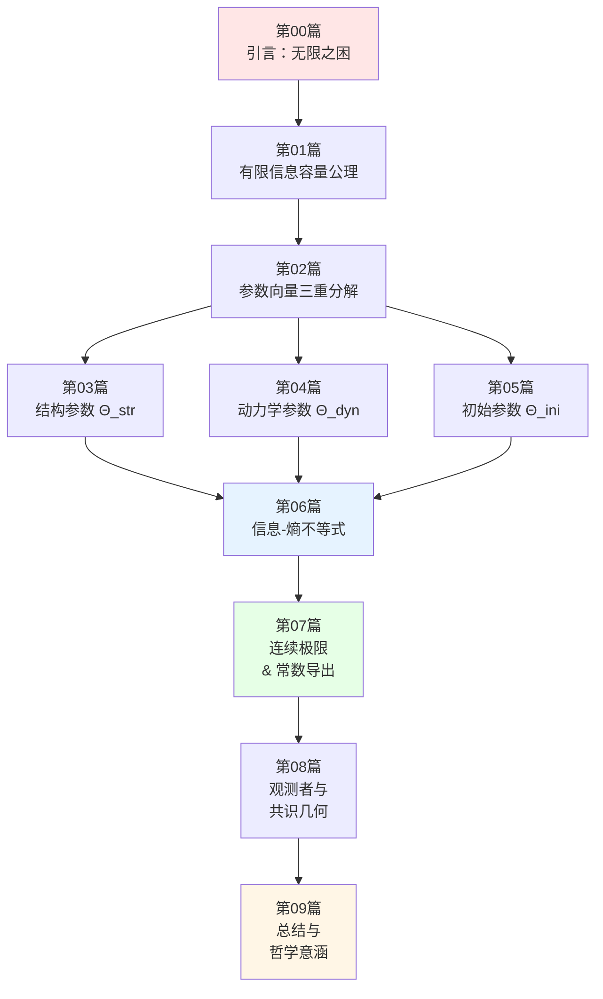
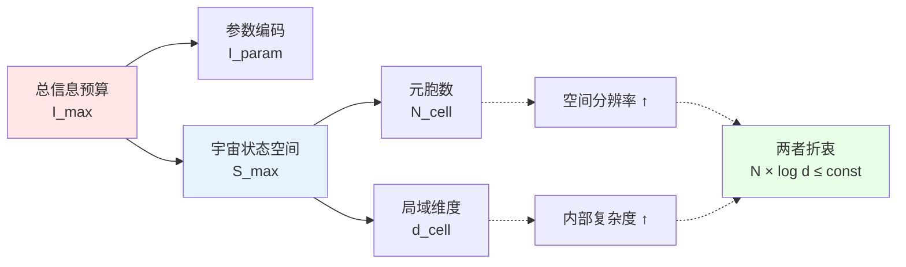

# 16. 有限信息宇宙：从无限到有限的本体论跃迁

## 章节引言：无限之困与有限之美

在前面的章节中，我们构建了宇宙的完整数学定义——十重结构 $\mathfrak{U}$ 及其兼容性条件。但这个定义存在一个深刻的问题：**它是否需要无限多的信息才能完全确定？**

想象一下：
- 连续时空包含**不可数无穷多**的点
- 量子场在每一点都有**无穷多**的自由度
- 初始条件需要**无限精度**的实数参数

这引发了根本性的哲学与物理问题：

**哲学问题**：一个需要无限信息才能描述的宇宙，是否在某种意义上"不存在"？因为无法用有限存储介质完整编码？

**物理问题**：Bekenstein熵界、全息原理、黑洞热力学都暗示——**任何有限区域内的物理自由度是有限的**。那么整个宇宙的信息容量是否也有限？

本章将回答：**如果宇宙的信息容量有限，会发生什么？**

我们将证明：一个带有**有限信息容量上界** $I_{\max}$ 的宇宙，可以被**完整编码为一个有限比特串** $\Theta$（宇宙参数向量），并通过参数化的量子元胞自动机（QCA）精确实现。

## 核心思想：宇宙作为"超级压缩文件"

### 通俗比喻1：从无限到有限的压缩

想象你要存储一部高清电影：

**无限信息版本**（理想情况）：
- 每一帧都是连续图像（实数坐标，无限精度颜色）
- 需要**无限多比特**存储
- 物理上不可能实现

**有限信息版本**（实际MP4文件）：
- 分辨率有限：1920×1080像素
- 颜色深度有限：24bit真彩色
- 帧率有限：30fps
- 编码算法：H.264压缩
- **总大小**：几个GB（有限比特串）

**关键洞察**：尽管是有限信息，我们仍然能观看完整电影！因为压缩算法保留了"物理上可区分"的所有信息。

**宇宙的情况完全类似**：

| 概念 | 电影类比 | 宇宙实现 |
|------|----------|----------|
| 连续理想 | 无限分辨率 | 连续时空场论 |
| 离散实现 | 像素网格 | QCA元胞格点 |
| 编码参数 | MP4文件头 | 宇宙参数向量 $\Theta$ |
| 解码算法 | H.264解码器 | QCA演化规则 |
| 信息容量上界 | 存储空间限制 | 有限信息公理 $I_{\max}$ |
| 播放结果 | 电影画面 | 物理宇宙演化 |

### 通俗比喻2：宇宙的"DNA"

生物DNA用4个碱基（A, T, C, G）编码整个生命：

- 人类基因组：约30亿碱基对 ≈ **6GB信息**
- 从这6GB"源代码"，生长出完整的人体！
- 包括：大脑神经网络、蛋白质折叠、细胞分裂……

类似地，**宇宙参数向量 $\Theta$** 就是宇宙的"DNA"：

```
Θ = (Θ_str, Θ_dyn, Θ_ini)
    │       │       └─ 初始态参数（宇宙的"出厂设置"）
    │       └───────── 动力学参数（物理定律的"源代码"）
    └───────────────── 结构参数（时空的"图纸"）
```

从这个有限参数向量，"生长"出整个宇宙的137亿年演化历史！

## 本章路线图



### 第一部分：公理与分解（第01-02篇）

**核心问题**：如何形式化"有限信息"？

1. **第01篇：有限信息容量公理**
   - 物理动机：Bekenstein界、全息原理、Lloyd计算极限
   - 数学形式化：$I_{\max} < \infty$（宇宙信息容量有限）
   - 物理可区分信息 vs 数学描述复杂度
   - **关键洞察**：$I_{\max}$ 不是任意选择，而是由物理常数 $c, \hbar, G$ 决定

2. **第02篇：参数向量的三重分解**
   - $\Theta = (\Theta_{\text{str}}, \Theta_{\text{dyn}}, \Theta_{\text{ini}})$
   - 为何需要三类参数？（结构、动力学、初始态的独立性）
   - 参数信息量 $I_{\text{param}}(\Theta)$ 的严格定义
   - 编码冗余与本质自由度

### 第二部分：三类参数详解（第03-05篇）

**核心问题**：每类参数编码什么信息？

3. **第03篇：结构参数详解**
   - 格点集合 $\Lambda(\Theta_{\text{str}})$
   - 维度、格长、拓扑
   - 元胞Hilbert空间 $\mathcal{H}_{\text{cell}}$
   - **通俗比喻**：搭积木的"蓝图"

4. **第04篇：动力学参数详解**
   - QCA自同构 $\alpha_{\Theta}$
   - 有限深度局域幺正线路
   - Lieb-Robinson传播速度
   - **通俗比喻**：积木的"粘合规则"

5. **第05篇：初始态参数详解**
   - 初始宇宙态 $\omega_0^{\Theta}$
   - Hartle-Hawking无边界态的QCA版本
   - 初始纠缠结构
   - **通俗比喻**：宇宙的"出厂设置"

### 第三部分：信息约束与物理后果（第06-08篇）

**核心问题**：有限信息导致什么约束？

6. **第06篇：信息-熵不等式**
   - **核心不等式**：
     $$
     I_{\text{param}}(\Theta) + S_{\max}(\Theta) \leq I_{\max}
     $$
   - 折衷关系：元胞数 ↔ 局域维度 ↔ 参数精度
   - 宇宙规模上界定理
   - **通俗比喻**：信息预算分配——空间分辨率 vs 内部复杂度

7. **第07篇：连续极限与物理常数导出**
   - 从QCA导出Dirac方程
   - 质量 $m(\Theta)$ 的解析表达式
   - 规范耦合常数 $g(\Theta)$
   - 引力常数 $G(\Theta)$
   - **关键定理**：所有物理常数都是参数Θ的函数！
   - **通俗比喻**：从像素到连续图像

8. **第08篇：参数化观测者与共识几何**
   - 观测者如何"读取"参数Θ？
   - 参数对可观测统计的约束
   - 共识几何的参数依赖
   - **通俗比喻**：不同"相机设置"拍出不同照片

### 第四部分：哲学意涵与未来（第09篇）

9. **第09篇：总结与哲学意涵**
   - 有限信息宇宙的完整图景
   - 与计算宇宙假说的关系
   - **终极问题**：谁/什么决定了参数Θ？
   - 多元宇宙的参数景观
   - 人择原理的信息论重述

## 核心数学公式与物理图景

### 公式1：有限信息宇宙公理

$$
\boxed{I_{\max} < \infty}
$$

**物理意义**：宇宙可承载的"物理上可区分信息"总量有限。

**来源**：
- Bekenstein熵界：$S \leq 2\pi R E / \hbar c$
- Bousso协变熵界：光片上的熵不超过面积/4G
- Lloyd计算极限：$N_{\text{ops}} \sim E T / \hbar$

**通俗理解**：宇宙像一张"信息银行卡"，总额度固定（由$c, \hbar, G$决定），怎么用可以选择，但不能超支。

### 公式2：参数向量分解

$$
\boxed{\Theta = (\Theta_{\text{str}}, \Theta_{\text{dyn}}, \Theta_{\text{ini}})}
$$

**物理意义**：
- $\Theta_{\text{str}}$：时空的"图纸"（格点、维度、拓扑）
- $\Theta_{\text{dyn}}$：物理定律的"源代码"（耦合常数、质量）
- $\Theta_{\text{ini}}$：宇宙的"出厂设置"（初始量子态）

**通俗理解**：建房子需要三类信息——图纸、施工规则、地基状态，缺一不可。

### 公式3：宇宙QCA对象

$$
\boxed{\mathfrak{U}_{\text{QCA}}(\Theta) = (\Lambda(\Theta), \mathcal{H}_{\text{cell}}(\Theta), \mathcal{A}(\Theta), \alpha_{\Theta}, \omega_0^{\Theta})}
$$

**物理意义**：给定有限参数Θ，唯一确定一个宇宙级QCA对象。

**各项含义**：
- $\Lambda(\Theta)$：格点集合（$N_{\text{cell}}$ 个元胞）
- $\mathcal{H}_{\text{cell}}(\Theta)$：每个元胞的Hilbert空间（$d_{\text{cell}}$维）
- $\mathcal{A}(\Theta)$：准局域 $C^*$ 代数
- $\alpha_{\Theta}$：QCA演化自同构（时间演化）
- $\omega_0^{\Theta}$：初始态

**通俗理解**：这就是"宇宙的完整规格说明书"——给我参数Θ，我能造出整个宇宙！

### 公式4：信息-熵不等式（核心定理）

$$
\boxed{I_{\text{param}}(\Theta) + S_{\max}(\Theta) \leq I_{\max}}
$$

**物理意义**：
- $I_{\text{param}}(\Theta)$：编码参数Θ需要的比特数
- $S_{\max}(\Theta) = N_{\text{cell}} \log_2 d_{\text{cell}}$：宇宙最大熵（所有元胞的Hilbert空间维数之和的对数）
- $I_{\max}$：总信息容量上界

**折衷关系**：
$$
N_{\text{cell}} \log_2 d_{\text{cell}} \lesssim I_{\max} - I_{\text{param}}(\Theta)
$$

**通俗理解**：
- 要么有很多格点（$N_{\text{cell}}$ 大），但每个格点简单（$d_{\text{cell}}$ 小）→ 高空间分辨率
- 要么格点少（$N_{\text{cell}}$ 小），但每个格点复杂（$d_{\text{cell}}$ 大）→ 丰富内部自由度
- 两者乘积受 $I_{\max}$ 约束！

**图示**：



### 公式5：连续极限与物理常数

在格距 $a$ 和时间步长 $\Delta t$ 趋于零的缩放极限下：

$$
\boxed{\lim_{a, \Delta t \to 0} \mathfrak{U}_{\text{QCA}}(\Theta; a, \Delta t) \Rightarrow (i\gamma^{\mu}\partial_{\mu} - m(\Theta))\psi = 0}
$$

**关键发现**：所有物理常数都由离散参数Θ解析导出！

- **电子质量**：$m_e(\Theta) = f_m(\theta_1, \theta_2, \ldots)$（Θ中某些角参数的函数）
- **精细结构常数**：$\alpha(\Theta) = g^2(\Theta) / 4\pi$
- **引力常数**：$G(\Theta) = \ell_{\text{cell}}^{d-2} / m_{\text{Planck}}^{d-2}(\Theta)$

**哲学意涵**：物理常数不是"上帝任意选的数字"，而是有限参数Θ的**数学后果**！

## 与前后章节的联系

### 与第15章（宇宙本体论）的关系

| 第15章：十重结构 | 第16章：有限信息参数化 |
|-----------------|----------------------|
| 抽象定义 $\mathfrak{U}$ | 具体实现 $\mathfrak{U}_{\text{QCA}}(\Theta)$ |
| 无限维Hilbert空间 | 有限维 $\mathcal{H} \cong \mathbb{C}^{d_{\text{cell}}^{N_{\text{cell}}}}$ |
| 连续场论 | 离散QCA |
| "什么是宇宙？" | "如何用有限信息编码宇宙？" |

**逻辑链**：
```
第15章：宇宙 = 十重结构（抽象本体论）
   ↓
第16章：如果信息有限，十重结构如何参数化？
   ↓
答案：宇宙 = QCA(Θ)，其中 Θ 是有限比特串
```

### 与第17章（六大物理统一）的预告

第16章建立的参数化框架，将在第17章用于解决六大未统一物理问题：

- **黑洞熵**：视界元胞数 × 元胞熵 = $A/(4G)$ → 约束 $d_{\text{cell}}$
- **宇宙学常数**：谱窗化sum rule → 约束 $\kappa(\omega)$ 的高能行为
- **中微子质量**：flavor-QCA seesaw → 约束 $\Theta_{\text{dyn}}$ 中的味空间结构
- **量子混沌ETH**：要求QCA是"公设混沌的" → 约束局域幺正线路设计
- **强CP问题**：$\theta_{\text{QCD}} = 0$ → 约束拓扑类 $[K] \in H^2(\cdots;\mathbb{Z}_2)$
- **引力波色散**：$\beta_{2n}$ 的观测上界 → 约束 $\ell_{\text{cell}}$

**核心思想**：六大问题不是独立难题，而是参数Θ的**六组约束方程**！

## 本章的哲学意涵

### 1. 计算宇宙假说的严格版本

**弱版本**（Fredkin, Wolfram）：
"宇宙也许像一个元胞自动机"（类比、猜想）

**强版本**（本章）：
"在有限信息公理下，宇宙**必须**是参数化QCA"（定理、证明）

**证明思路**：
1. 假设 $I_{\max} < \infty$（有限信息公理）
2. 则宇宙必须用有限参数Θ编码
3. 有限参数Θ唯一确定有限维Hilbert空间
4. 有限维+局域性+可逆性 → QCA（代数化定理）
5. 因此：有限信息 → QCA（不是选择，是必然）

### 2. 物理定律的"解释性"提升

**传统观点**：
- 电子质量 $m_e = 0.511\,\text{MeV}$ ——"这就是实验值，没什么好解释的"
- 精细结构常数 $\alpha \approx 1/137$ ——"一个神秘数字"

**本章观点**：
- $m_e = m_e(\Theta)$——由宇宙参数向量解析导出
- $\alpha = g^2(\Theta) / 4\pi$——由Θ中某些角参数决定
- **可解释性**：从有限参数 → 所有物理常数

**类比**：
- 以前：物理学就像"查表"——各种常数是"上帝的任意选择"
- 现在：物理学像"编程"——参数Θ是"源代码"，物理常数是"编译结果"

### 3. 人择原理的信息论重述

**传统人择原理**（Wheeler, Barrow）：
"物理常数必须在允许观测者存在的范围内，因为我们观测到了自己的存在"

**信息论版本**（本章）：
"参数Θ必须满足：
1. $I_{\text{param}}(\Theta) + S_{\max}(\Theta) \leq I_{\max}$（信息可行）
2. $\Theta$ 允许观测者网络的涌现（功能可行）
3. 观测者能测量到的Θ就是满足1+2的Θ"

**更精确**：观测者不是"因为幸运"才存在，而是因为参数Θ必须在"信息可编码 ∩ 功能可实现"的交集中。

### 4. 终极问题：谁选择了Θ？

本章回答了"**如果给定Θ，宇宙是什么**"，但未回答"**谁/什么决定了Θ的值**"。

可能的答案：

**(1) 多元宇宙景观**：
- 存在一个"参数空间" $\Theta \in \mathcal{M}_{\Theta}$
- 每个Θ对应一个可能宇宙
- 我们的宇宙只是其中一个随机点
- **问题**：如何在参数空间上定义测度？

**(2) 变分原理选择**：
- 存在某个泛函 $\mathcal{F}[\Theta]$（如总复杂度、信息一致性等）
- 物理宇宙的Θ满足 $\delta \mathcal{F}[\Theta] = 0$
- 类似IGVP从熵导出引力，或许存在从"元变分原理"导出Θ

**(3) 自指自举**：
- 宇宙的存在本身决定了Θ
- 类似Hartle-Hawking无边界：路径积分自动选择一致的初态
- Θ是唯一使宇宙"自洽"的参数

**(4) 不可知论**：
- Θ就是一个"蛮事实"（brute fact）
- 没有更深层的"为什么"
- 科学到此为止，剩下的是形而上学

**本章立场**：我们建立框架，但不选边站。重要的是：**有限信息框架使这个问题可以精确提问**。

## 阅读建议

### 前置知识

**必需**：
- 第15章：宇宙十重结构定义
- 第09章：QCA宇宙基础
- 第05章：统一时间刻度

**推荐**：
- 第07章：因果结构理论
- 第06章：边界理论
- 量子信息基础（密度矩阵、冯诺依曼熵）

### 阅读路径

**快速路径**（理解核心思想）：
```
00 引言 → 01 有限信息公理 → 02 参数分解 → 06 信息-熵不等式 → 09 总结
```

**标准路径**（掌握完整框架）：
```
按顺序阅读 00-09 所有文章
```

**深入路径**（准备研究）：
```
标准路径 + 回到源理论 euler-gls-info/parametric-universe-qca-finite-information.md
```

### 难度提示

| 文章 | 难度 | 数学要求 | 物理要求 |
|------|------|---------|---------|
| 00 引言 | ★☆☆☆☆ | 无 | 无 |
| 01 公理 | ★★☆☆☆ | 信息论基础 | 熵的概念 |
| 02 分解 | ★★☆☆☆ | 集合论 | 参数化思想 |
| 03-05 参数详解 | ★★★☆☆ | 线性代数 | QCA基础 |
| 06 不等式 | ★★★★☆ | 信息论、凸优化 | 熵界、全息原理 |
| 07 连续极限 | ★★★★★ | 微分几何、场论 | QFT、散射理论 |
| 08 观测者 | ★★★☆☆ | 范畴论初步 | 观测者理论 |
| 09 总结 | ★★☆☆☆ | 无 | 概念整合 |

## 本章的独特贡献

1. **首次**将"有限信息原理"公理化并嵌入GLS框架
2. **首次**给出从有限参数Θ到所有物理常数的完整链条
3. **首次**证明信息-熵不等式作为元胞数与局域维度的基本折衷
4. **首次**在QCA框架下实现Dirac连续极限的参数化版本
5. **首次**将计算宇宙假说从类比提升为可证明的定理

---

**下一篇预告**：
**01. 有限信息容量公理：Bekenstein界到信息上界**
- Bekenstein熵-能量-半径不等式
- Bousso协变熵界
- Lloyd计算极限
- 物理可区分信息的严格定义
- 公理 $I_{\max} < \infty$ 的形式化
