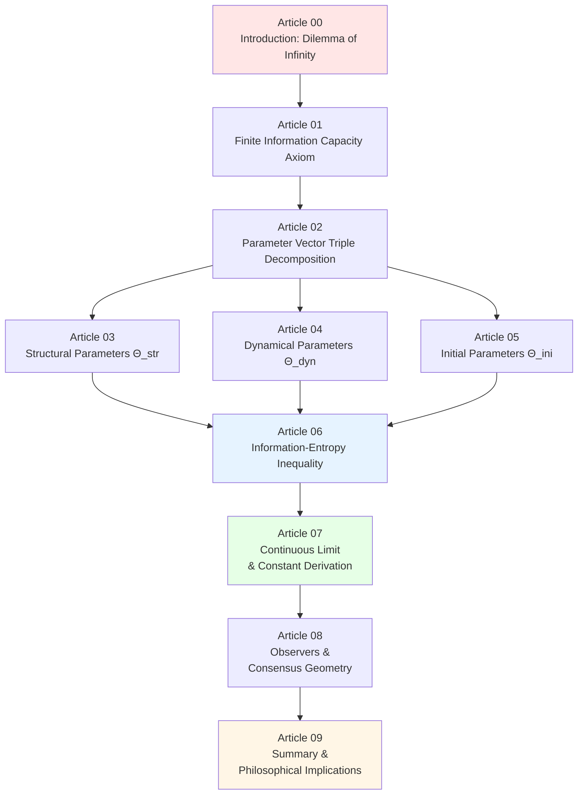
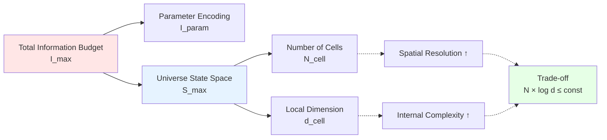

# 16. Finite Information Universe: Ontological Transition from Infinite to Finite

## Chapter Introduction: Dilemma of Infinity and Beauty of Finiteness

In previous chapters, we constructed complete mathematical definition of universe—ten-fold structure $\mathfrak{U}$ and its compatibility conditions. But this definition has a profound problem: **Does it require infinite information to fully determine?**

Imagine:
- Continuous spacetime contains **uncountably infinite** points
- Quantum fields have **infinite** degrees of freedom at each point
- Initial conditions require **infinite precision** real number parameters

This raises fundamental philosophical and physical questions:

**Philosophical Question**: Does a universe requiring infinite information to describe "not exist" in some sense? Because it cannot be completely encoded on finite storage medium?

**Physical Question**: Bekenstein entropy bound, holographic principle, black hole thermodynamics all suggest—**physical degrees of freedom in any finite region are finite**. Then is total information capacity of universe also finite?

This chapter will answer: **What happens if universe's information capacity is finite?**

We will prove: A universe with **finite information capacity upper bound** $I_{\max}$ can be **completely encoded as finite bit string** $\Theta$ (universe parameter vector), and precisely realized through parameterized quantum cellular automaton (QCA).

## Core Idea: Universe as "Super Compressed File"

### Popular Analogy 1: Compression from Infinite to Finite

Imagine storing a high-definition movie:

**Infinite Information Version** (ideal case):
- Each frame is continuous image (real coordinates, infinite precision colors)
- Requires **infinite bits** to store
- Physically impossible to realize

**Finite Information Version** (actual MP4 file):
- Limited resolution: 1920×1080 pixels
- Limited color depth: 24bit true color
- Limited frame rate: 30fps
- Encoding algorithm: H.264 compression
- **Total size**: Several GB (finite bit string)

**Key Insight**: Despite finite information, we can still watch complete movie! Because compression algorithm preserves all "physically distinguishable" information.

**Universe's situation completely analogous**:

| Concept | Movie Analogy | Universe Realization |
|---------|---------------|----------------------|
| Continuous ideal | Infinite resolution | Continuous spacetime field theory |
| Discrete realization | Pixel grid | QCA cell lattice |
| Encoding parameters | MP4 file header | Universe parameter vector $\Theta$ |
| Decoding algorithm | H.264 decoder | QCA evolution rules |
| Information capacity bound | Storage space limit | Finite information axiom $I_{\max}$ |
| Playback result | Movie frames | Physical universe evolution |

### Popular Analogy 2: Universe's "DNA"

Biological DNA encodes entire life with 4 bases (A, T, C, G):

- Human genome: ~3 billion base pairs ≈ **6GB information**
- From this 6GB "source code", grows complete human body!
- Including: Brain neural networks, protein folding, cell division...

Similarly, **universe parameter vector $\Theta$** is universe's "DNA":

```
Θ = (Θ_str, Θ_dyn, Θ_ini)
    │       │       └─ Initial state parameters (universe's "factory settings")
    │       └───────── Dynamical parameters (physical laws' "source code")
    └───────────────── Structural parameters (spacetime's "blueprint")
```

From this finite parameter vector, "grows" entire universe's 13.7 billion year evolution history!

## Chapter Roadmap



### Part I: Axioms and Decomposition (Articles 01-02)

**Core Question**: How to formalize "finite information"?

1. **Article 01: Finite Information Capacity Axiom**
   - Physical motivation: Bekenstein bound, holographic principle, Lloyd computation limit
   - Mathematical formalization: $I_{\max} < \infty$ (universe information capacity finite)
   - Physically distinguishable information vs mathematical description complexity
   - **Key Insight**: $I_{\max}$ not arbitrarily chosen, but determined by physical constants $c, \hbar, G$

2. **Article 02: Triple Decomposition of Parameter Vector**
   - $\Theta = (\Theta_{\text{str}}, \Theta_{\text{dyn}}, \Theta_{\text{ini}})$
   - Why need three types of parameters? (Independence of structure, dynamics, initial state)
   - Strict definition of parameter information $I_{\text{param}}(\Theta)$
   - Encoding redundancy and essential degrees of freedom

### Part II: Detailed Explanation of Three Parameter Types (Articles 03-05)

**Core Question**: What information does each parameter type encode?

3. **Article 03: Detailed Explanation of Structural Parameters**
   - Lattice set $\Lambda(\Theta_{\text{str}})$
   - Dimension, lattice spacing, topology
   - Cell Hilbert space $\mathcal{H}_{\text{cell}}$
   - **Popular Analogy**: "Blueprint" for building blocks

4. **Article 04: Detailed Explanation of Dynamical Parameters**
   - QCA automorphism $\alpha_{\Theta}$
   - Finite depth local unitary circuits
   - Lieb-Robinson propagation speed
   - **Popular Analogy**: "Bonding rules" for blocks

5. **Article 05: Detailed Explanation of Initial State Parameters**
   - Initial universe state $\omega_0^{\Theta}$
   - QCA version of Hartle-Hawking no-boundary state
   - Initial entanglement structure
   - **Popular Analogy**: Universe's "factory settings"

### Part III: Information Constraints and Physical Consequences (Articles 06-08)

**Core Question**: What constraints does finite information impose?

6. **Article 06: Information-Entropy Inequality**
   - **Core Inequality**:
     $$
     I_{\text{param}}(\Theta) + S_{\max}(\Theta) \leq I_{\max}
     $$
   - Trade-off relation: Number of cells ↔ Local dimension ↔ Parameter precision
   - Universe scale upper bound theorem
   - **Popular Analogy**: Information budget allocation—spatial resolution vs internal complexity

7. **Article 07: Continuous Limit and Physical Constant Derivation**
   - Deriving Dirac equation from QCA
   - Analytical expression for mass $m(\Theta)$
   - Gauge coupling constant $g(\Theta)$
   - Gravitational constant $G(\Theta)$
   - **Key Theorem**: All physical constants are functions of parameter Θ!
   - **Popular Analogy**: From pixels to continuous image

8. **Article 08: Parameterized Observers and Consensus Geometry**
   - How do observers "read" parameter Θ?
   - Parameter constraints on observable statistics
   - Parameter-dependent consensus geometry
   - **Popular Analogy**: Different "camera settings" produce different photos

### Part IV: Philosophical Implications and Future (Article 09)

9. **Article 09: Summary and Philosophical Implications**
   - Complete picture of finite information universe
   - Relationship with computational universe hypothesis
   - **Ultimate Question**: Who/what determines parameter Θ?
   - Multiverse parameter landscape
   - Information-theoretic restatement of anthropic principle

## Core Mathematical Formulas and Physical Picture

### Formula 1: Finite Information Universe Axiom

$$
\boxed{I_{\max} < \infty}
$$

**Physical Meaning**: Total amount of "physically distinguishable information" universe can carry is finite.

**Sources**:
- Bekenstein entropy bound: $S \leq 2\pi R E / \hbar c$
- Bousso covariant entropy bound: Entropy on light sheet does not exceed area/4G
- Lloyd computation limit: $N_{\text{ops}} \sim E T / \hbar$

**Popular Understanding**: Universe like an "information credit card", total credit fixed (determined by $c, \hbar, G$), how to use can choose, but cannot overspend.

### Formula 2: Parameter Vector Decomposition

$$
\boxed{\Theta = (\Theta_{\text{str}}, \Theta_{\text{dyn}}, \Theta_{\text{ini}})}
$$

**Physical Meaning**:
- $\Theta_{\text{str}}$: "Blueprint" of spacetime (lattice, dimension, topology)
- $\Theta_{\text{dyn}}$: "Source code" of physical laws (coupling constants, masses)
- $\Theta_{\text{ini}}$: Universe's "factory settings" (initial quantum state)

**Popular Understanding**: Building house requires three types of information—blueprint, construction rules, foundation state, none can be missing.

### Formula 3: Universe QCA Object

$$
\boxed{\mathfrak{U}_{\text{QCA}}(\Theta) = (\Lambda(\Theta), \mathcal{H}_{\text{cell}}(\Theta), \mathcal{A}(\Theta), \alpha_{\Theta}, \omega_0^{\Theta})}
$$

**Physical Meaning**: Given finite parameter Θ, uniquely determines a universe-level QCA object.

**Component Meanings**:
- $\Lambda(\Theta)$: Lattice set ($N_{\text{cell}}$ cells)
- $\mathcal{H}_{\text{cell}}(\Theta)$: Hilbert space of each cell ($d_{\text{cell}}$-dimensional)
- $\mathcal{A}(\Theta)$: Quasi-local $C^*$ algebra
- $\alpha_{\Theta}$: QCA evolution automorphism (time evolution)
- $\omega_0^{\Theta}$: Initial state

**Popular Understanding**: This is "universe's complete specification manual"—give me parameter Θ, I can construct entire universe!

### Formula 4: Information-Entropy Inequality (Core Theorem)

$$
\boxed{I_{\text{param}}(\Theta) + S_{\max}(\Theta) \leq I_{\max}}
$$

**Physical Meaning**:
- $I_{\text{param}}(\Theta)$: Number of bits needed to encode parameter Θ
- $S_{\max}(\Theta) = N_{\text{cell}} \log_2 d_{\text{cell}}$: Maximum entropy of universe (logarithm of sum of Hilbert space dimensions of all cells)
- $I_{\max}$: Total information capacity upper bound

**Trade-off Relation**:
$$
N_{\text{cell}} \log_2 d_{\text{cell}} \lesssim I_{\max} - I_{\text{param}}(\Theta)
$$

**Popular Understanding**:
- Either many lattice points ($N_{\text{cell}}$ large), but each point simple ($d_{\text{cell}}$ small) → High spatial resolution
- Or few lattice points ($N_{\text{cell}}$ small), but each point complex ($d_{\text{cell}}$ large) → Rich internal degrees of freedom
- Product of both constrained by $I_{\max}$!

**Diagram**:



### Formula 5: Continuous Limit and Physical Constants

In scaling limit where lattice spacing $a$ and time step $\Delta t$ tend to zero:

$$
\boxed{\lim_{a, \Delta t \to 0} \mathfrak{U}_{\text{QCA}}(\Theta; a, \Delta t) \Rightarrow (i\gamma^{\mu}\partial_{\mu} - m(\Theta))\psi = 0}
$$

**Key Discovery**: All physical constants analytically derived from discrete parameter Θ!

- **Electron mass**: $m_e(\Theta) = f_m(\theta_1, \theta_2, \ldots)$ (function of certain angle parameters in Θ)
- **Fine structure constant**: $\alpha(\Theta) = g^2(\Theta) / 4\pi$
- **Gravitational constant**: $G(\Theta) = \ell_{\text{cell}}^{d-2} / m_{\text{Planck}}^{d-2}(\Theta)$

**Philosophical Implication**: Physical constants are not "arbitrarily chosen numbers by God", but **mathematical consequences** of finite parameter Θ!

## Connections with Previous and Subsequent Chapters

### Relationship with Chapter 15 (Universe Ontology)

| Chapter 15: Ten-Fold Structure | Chapter 16: Finite Information Parameterization |
|--------------------------------|------------------------------------------------|
| Abstract definition $\mathfrak{U}$ | Concrete realization $\mathfrak{U}_{\text{QCA}}(\Theta)$ |
| Infinite-dimensional Hilbert space | Finite-dimensional $\mathcal{H} \cong \mathbb{C}^{d_{\text{cell}}^{N_{\text{cell}}}}$ |
| Continuous field theory | Discrete QCA |
| "What is universe?" | "How to encode universe with finite information?" |

**Logical Chain**:
```
Chapter 15: Universe = Ten-fold structure (abstract ontology)
   ↓
Chapter 16: If information finite, how to parameterize ten-fold structure?
   ↓
Answer: Universe = QCA(Θ), where Θ is finite bit string
```

### Preview of Chapter 17 (Six Major Physical Unifications)

Parameterization framework established in Chapter 16 will be used in Chapter 17 to solve six ununified physical problems:

- **Black hole entropy**: Number of horizon cells × Cell entropy = $A/(4G)$ → Constrains $d_{\text{cell}}$
- **Cosmological constant**: Spectral windowing sum rule → Constrains high-energy behavior of $\kappa(\omega)$
- **Neutrino mass**: Flavor-QCA seesaw → Constrains flavor space structure in $\Theta_{\text{dyn}}$
- **Quantum chaos ETH**: Requires QCA to be "axiomatically chaotic" → Constrains local unitary circuit design
- **Strong CP problem**: $\theta_{\text{QCD}} = 0$ → Constrains topological class $[K] \in H^2(\cdots;\mathbb{Z}_2)$
- **Gravitational wave dispersion**: Observational upper bound on $\beta_{2n}$ → Constrains $\ell_{\text{cell}}$

**Core Idea**: Six problems are not independent puzzles, but **six sets of constraint equations** on parameter Θ!

## Philosophical Implications of This Chapter

### 1. Strict Version of Computational Universe Hypothesis

**Weak Version** (Fredkin, Wolfram):
"Universe might be like a cellular automaton" (analogy, conjecture)

**Strong Version** (This Chapter):
"Under finite information axiom, universe **must** be parameterized QCA" (theorem, proof)

**Proof Outline**:
1. Assume $I_{\max} < \infty$ (finite information axiom)
2. Then universe must be encoded with finite parameter Θ
3. Finite parameter Θ uniquely determines finite-dimensional Hilbert space
4. Finite-dimensional + Locality + Reversibility → QCA (algebraic theorem)
5. Therefore: Finite information → QCA (not choice, necessity)

### 2. "Explanatory" Elevation of Physical Laws

**Traditional View**:
- Electron mass $m_e = 0.511\,\text{MeV}$ —"This is experimental value, nothing to explain"
- Fine structure constant $\alpha \approx 1/137$ —"A mysterious number"

**This Chapter's View**:
- $m_e = m_e(\Theta)$—Analytically derived from universe parameter vector
- $\alpha = g^2(\Theta) / 4\pi$—Determined by certain angle parameters in Θ
- **Explanability**: From finite parameters → All physical constants

**Analogy**:
- Before: Physics like "looking up tables"—various constants are "arbitrary choices by God"
- Now: Physics like "programming"—parameter Θ is "source code", physical constants are "compilation results"

### 3. Information-Theoretic Restatement of Anthropic Principle

**Traditional Anthropic Principle** (Wheeler, Barrow):
"Physical constants must be within range allowing observers to exist, because we observe our own existence"

**Information-Theoretic Version** (This Chapter):
"Parameter Θ must satisfy:
1. $I_{\text{param}}(\Theta) + S_{\max}(\Theta) \leq I_{\max}$ (information feasible)
2. $\Theta$ allows emergence of observer network (functionally feasible)
3. Θ that observers can measure is Θ satisfying 1+2"

**More Precise**: Observers don't exist "by luck", but because parameter Θ must be in intersection of "information encodable ∩ functionally realizable".

### 4. Ultimate Question: Who Chose Θ?

This chapter answers "**If given Θ, what is universe**", but doesn't answer "**Who/what determines value of Θ**".

Possible answers:

**(1) Multiverse Landscape**:
- Exists a "parameter space" $\Theta \in \mathcal{M}_{\Theta}$
- Each Θ corresponds to a possible universe
- Our universe is just one random point
- **Problem**: How to define measure on parameter space?

**(2) Variational Principle Selection**:
- Exists some functional $\mathcal{F}[\Theta]$ (e.g., total complexity, information consistency, etc.)
- Physical universe's Θ satisfies $\delta \mathcal{F}[\Theta] = 0$
- Similar to IGVP deriving gravity from entropy, perhaps exists "meta-variational principle" deriving Θ

**(3) Self-Referential Bootstrap**:
- Existence of universe itself determines Θ
- Similar to Hartle-Hawking no-boundary: Path integral automatically selects consistent initial state
- Θ is unique parameter making universe "self-consistent"

**(4) Agnosticism**:
- Θ is just a "brute fact"
- No deeper "why"
- Science stops here, rest is metaphysics

**This Chapter's Position**: We establish framework, but don't take sides. Important: **Finite information framework makes this question precisely askable**.

## Reading Suggestions

### Prerequisites

**Required**:
- Chapter 15: Universe ten-fold structure definition
- Chapter 09: QCA universe foundations
- Chapter 05: Unified time scale

**Recommended**:
- Chapter 07: Causal structure theory
- Chapter 06: Boundary theory
- Quantum information foundations (density matrices, von Neumann entropy)

### Reading Paths

**Quick Path** (Understanding core ideas):
```
00 Introduction → 01 Finite information axiom → 02 Parameter decomposition → 06 Information-entropy inequality → 09 Summary
```

**Standard Path** (Mastering complete framework):
```
Read all articles 00-09 in order
```

**Deep Path** (Preparing for research):
```
Standard path + Return to source theory euler-gls-info/parametric-universe-qca-finite-information.md
```

### Difficulty Hints

| Article | Difficulty | Math Requirements | Physics Requirements |
|---------|-----------|-------------------|---------------------|
| 00 Introduction | ★☆☆☆☆ | None | None |
| 01 Axiom | ★★☆☆☆ | Information theory basics | Concept of entropy |
| 02 Decomposition | ★★☆☆☆ | Set theory | Parameterization ideas |
| 03-05 Parameter details | ★★★☆☆ | Linear algebra | QCA foundations |
| 06 Inequality | ★★★★☆ | Information theory, convex optimization | Entropy bounds, holographic principle |
| 07 Continuous limit | ★★★★★ | Differential geometry, field theory | QFT, scattering theory |
| 08 Observers | ★★★☆☆ | Category theory basics | Observer theory |
| 09 Summary | ★★☆☆☆ | None | Conceptual integration |

## Unique Contributions of This Chapter

1. **First** to axiomatize "finite information principle" and embed in GLS framework
2. **First** to give complete chain from finite parameter Θ to all physical constants
3. **First** to prove information-entropy inequality as fundamental trade-off between number of cells and local dimension
4. **First** to realize parameterized version of Dirac continuous limit in QCA framework
5. **First** to elevate computational universe hypothesis from analogy to provable theorem

---

**Next Article Preview**:
**01. Finite Information Capacity Axiom: From Bekenstein Bound to Information Upper Bound**
- Bekenstein entropy-energy-radius inequality
- Bousso covariant entropy bound
- Lloyd computation limit
- Strict definition of physically distinguishable information
- Formalization of axiom $I_{\max} < \infty$

