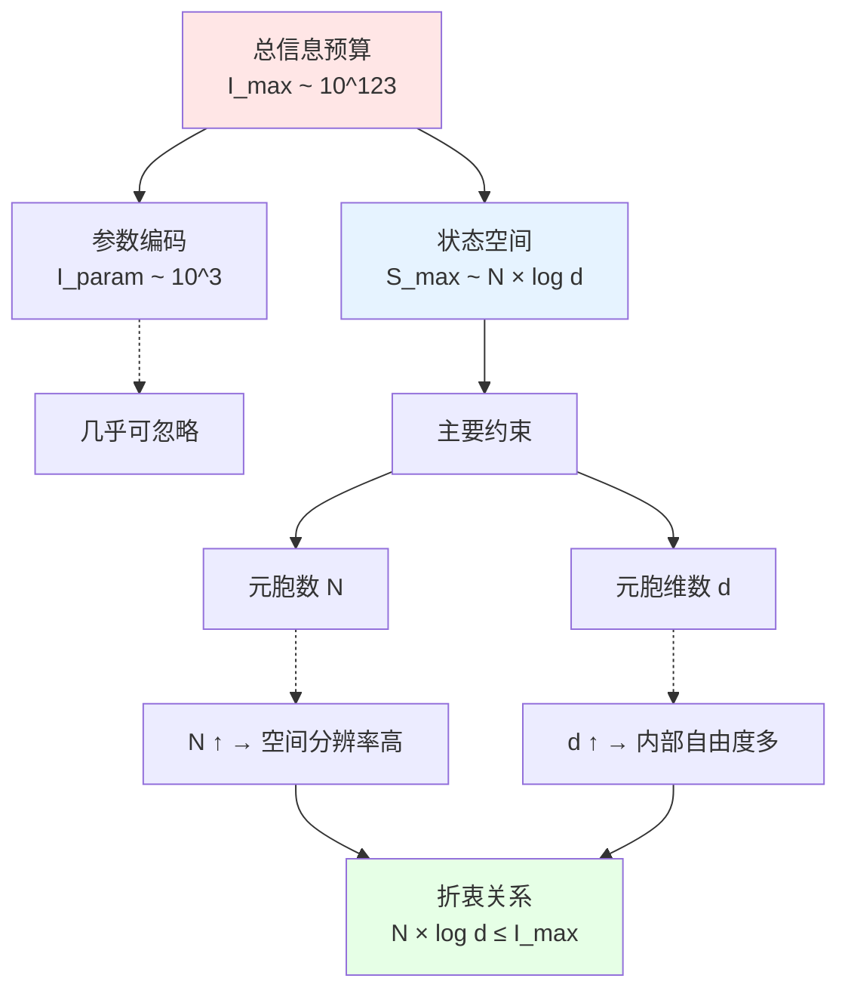

# 02. 参数向量的三重分解：结构、动力学与初始态

## 引言：建筑的三层图纸

在上一篇中,我们建立了有限信息宇宙公理：宇宙可以被编码为一个有限比特串 $\Theta \in \{0,1\}^{\leq I_{\max}}$。

但这引出新问题：**这个参数向量 $\Theta$ 应该如何组织？**

### 通俗比喻：建造一栋房子需要三类信息

想象你要建造一栋房子，需要以下三类独立的信息：

**第一类：建筑图纸**（结构信息）
- 有几层？每层多大？
- 房间如何布局？
- 墙体、柱子的位置
- 建筑材料类型（木头、砖、钢筋混凝土）
- **这决定了"房子的骨架"**

**第二类：施工规则**（动力学信息）
- 如何浇筑混凝土？
- 砖如何砌？（砌法、灰浆配比）
- 电路如何布线？
- 水管如何连接？
- **这决定了"房子如何搭建"**

**第三类：地基状态**（初始条件）
- 地基是否平整？
- 土壤承重如何？
- 地下水位多高？
- 已有的旧建筑如何处理？
- **这决定了"起点状态"**

**关键洞察**：这三类信息**逻辑独立**！
- 可以用相同图纸建不同地基上的房子
- 可以用不同施工规则实现相同图纸
- 但三类信息**缺一不可**

**宇宙的情况完全类似**：

$$
\boxed{\Theta = (\Theta_{\text{str}}, \Theta_{\text{dyn}}, \Theta_{\text{ini}})}
$$

| 建筑类比 | 宇宙参数 | 物理含义 |
|---------|---------|---------|
| 建筑图纸 | $\Theta_{\text{str}}$ | 时空结构（格点、维度、拓扑） |
| 施工规则 | $\Theta_{\text{dyn}}$ | 动力学定律（耦合常数、演化算子） |
| 地基状态 | $\Theta_{\text{ini}}$ | 初始量子态（大爆炸时刻的态） |

本篇将详细解释：
1. 为什么需要三重分解？（逻辑独立性）
2. 每类参数编码什么信息？（数学定义）
3. 如何定义总信息量 $I_{\text{param}}(\Theta)$？（比特计数）
4. 编码冗余与本质自由度（唯一性问题）

## 第一部分：为什么需要三重分解？

### 物理问题的三个层次

考虑经典力学中的一个简单系统：弹簧振子。

**要完整确定系统演化，需要三类信息**：

1. **系统构成**（结构）：
   - 是单个振子？还是耦合振子链？
   - 质量 $m$ 是多少？弹簧劲度系数 $k$ 是多少？
   - → 对应 $\Theta_{\text{str}}$（系统的"硬件规格"）

2. **运动方程**（动力学）：
   - 牛顿第二定律：$m\ddot{x} = -kx$
   - 或哈密顿方程：$\dot{p} = -\partial H/\partial x$
   - → 对应 $\Theta_{\text{dyn}}$（系统的"运行规则"）

3. **初始条件**（初态）：
   - $t=0$ 时刻：位置 $x_0$，速度 $v_0$
   - → 对应 $\Theta_{\text{ini}}$（系统的"起点"）

**关键观察**：
- 改变初始条件 $(x_0, v_0)$，不改变运动方程
- 改变质量 $m$，不改变初始位置 $x_0$
- 但三者**共同**决定轨迹 $x(t)$

这种分离在量子场论中同样存在：

| 经典力学 | 量子场论 | 宇宙QCA |
|---------|---------|---------|
| 系统构成 $(m, k)$ | 场的自由度与对称性 | $\Theta_{\text{str}}$（格点、Hilbert空间） |
| 运动方程 $F=ma$ | 拉格朗日量 $\mathcal{L}$ | $\Theta_{\text{dyn}}$（QCA自同构 $\alpha_\Theta$） |
| 初始条件 $(x_0, v_0)$ | 真空态 $|0\rangle$ | $\Theta_{\text{ini}}$（初始态 $\omega_0^\Theta$） |

### 数学独立性定理

**定理2.1**（参数空间的直积分解）：

在QCA框架下，宇宙参数空间可以分解为三个子空间的直积：

$$
\mathcal{M}_{\Theta} = \mathcal{M}_{\text{str}} \times \mathcal{M}_{\text{dyn}} \times \mathcal{M}_{\text{ini}}
$$

使得：
1. 结构参数 $\Theta_{\text{str}} \in \mathcal{M}_{\text{str}}$ 唯一确定：
   - 格点集合 $\Lambda$
   - 元胞Hilbert空间 $\mathcal{H}_{\text{cell}}$
   - 准局域代数 $\mathcal{A}(\Lambda, \mathcal{H}_{\text{cell}})$

2. 动力学参数 $\Theta_{\text{dyn}} \in \mathcal{M}_{\text{dyn}}$ 唯一确定：
   - QCA自同构 $\alpha: \mathcal{A} \to \mathcal{A}$
   - （给定 $\mathcal{A}$ 之后）

3. 初始态参数 $\Theta_{\text{ini}} \in \mathcal{M}_{\text{ini}}$ 唯一确定：
   - 初始态 $\omega_0: \mathcal{A} \to \mathbb{C}$
   - （给定 $\mathcal{A}$ 之后）

4. 三个子空间在逻辑上独立：
   $$
   \Theta_{\text{dyn}} \text{ 的选择不依赖于 } \Theta_{\text{ini}}
   $$
   $$
   \Theta_{\text{ini}} \text{ 的选择不依赖于 } \Theta_{\text{dyn}}
   $$
   （但两者都依赖于 $\Theta_{\text{str}}$ 确定的代数 $\mathcal{A}$）

**证明思路**：
- $\Theta_{\text{str}}$ 确定"舞台"（代数 $\mathcal{A}$）
- $\Theta_{\text{dyn}}$ 从自同构群 $\text{Aut}(\mathcal{A})$ 中选择一个自同构
- $\Theta_{\text{ini}}$ 从态空间 $\mathcal{S}(\mathcal{A})$ 中选择一个态
- 自同构群与态空间是 $\mathcal{A}$ 上的独立结构

### 为什么不能合并？

**错误尝试1**：将 $\Theta_{\text{dyn}}$ 并入 $\Theta_{\text{str}}$？
- **反例**：同一个格点结构 $\Lambda$，可以定义无穷多种不同的QCA演化规则
- 例如：一维 $\mathbb{Z}_L$ 格，可以是Dirac-QCA、Ising-QCA、Toffoli-QCA……
- **结论**：动力学不由结构唯一确定

**错误尝试2**：将 $\Theta_{\text{ini}}$ 并入 $\Theta_{\text{dyn}}$？
- **反例**：同一个哈密顿量 $H$，可以有不同的初态
- 例如：简谐振子 $H = p^2/2m + kx^2/2$，可以初始在基态 $|0\rangle$，也可以在相干态 $|\alpha\rangle$
- **结论**：初态不由动力学唯一确定

**错误尝试3**：将 $\Theta_{\text{str}}$ 并入 $\Theta_{\text{dyn}}$？
- **反例**：不同格点数的QCA是拓扑不等价的
- 例如：$\mathbb{Z}_{100}$ 与 $\mathbb{Z}_{101}$ 的QCA，无论演化规则如何都不同构
- **结论**：结构是动力学的前提

**因此**：三重分解是**最小**且**必要**的。

## 第二部分：结构参数 $\Theta_{\text{str}}$ 的定义

### 编码内容：时空的"图纸"

结构参数 $\Theta_{\text{str}}$ 需要指定以下信息：

#### (1) 空间维度 $d$

$$
d \in \{1, 2, 3, 4, \ldots\}
$$

**编码方式**：
- 用 $\lceil \log_2 d_{\max} \rceil$ 比特编码维度
- 若限制 $d \leq 10$（合理的物理假设），需要 $\lceil \log_2 10 \rceil = 4$ 比特

**物理意义**：
- $d=1$：玩具模型（Dirac链）
- $d=3$：我们的空间
- $d=4$：时空合一（闵可夫斯基格）
- $d>4$：额外维度（弦论）

#### (2) 各方向格长 $L_1, \ldots, L_d$

$$
\Lambda = \prod_{i=1}^d \{0, 1, \ldots, L_i - 1\}
$$

**编码方式**：
- 若每个 $L_i \leq 2^{64}$（宇宙学尺度足够），每个方向需要 64 比特
- 总共：$64d$ 比特

**例子**：
- $d=3$，$L_1 = L_2 = L_3 = 10^{30}$（以普朗克长度为单位的可观测宇宙）
- 总元胞数：$N_{\text{cell}} = (10^{30})^3 = 10^{90}$

#### (3) 边界条件与拓扑

**选项**：
- 开边界（open boundary）
- 周期边界（periodic boundary，拓扑为 $\mathbb{T}^d$）
- 扭曲边界（twisted boundary）
- 其他拓扑（$S^d$、流形粘合）

**编码方式**：
- 简单情况：用 $d \times 2$ 比特（每个方向两个边界各1比特）
- 复杂拓扑：需要额外编码粘合规则（拓扑不变量）

#### (4) 元胞内部Hilbert空间维数 $d_{\text{cell}}$

$$
\mathcal{H}_x \cong \mathbb{C}^{d_{\text{cell}}}
$$

**物理结构**（通常分解为多个子系统）：

$$
\mathcal{H}_{\text{cell}} = \mathcal{H}_{\text{fermion}} \otimes \mathcal{H}_{\text{gauge}} \otimes \mathcal{H}_{\text{aux}}
$$

- $\mathcal{H}_{\text{fermion}}$：费米子自由度（如 Dirac-QCA 的 $\mathbb{C}^2$ 自旋）
- $\mathcal{H}_{\text{gauge}}$：规范场寄存器（如 $\mathbb{C}^{|G|}$，$G$ 为规范群）
- $\mathcal{H}_{\text{aux}}$：辅助比特（用于保持幺正性）

**编码方式**：
- 指定各子系统维数（如 $\dim \mathcal{H}_{\text{fermion}} = 4$，$\dim \mathcal{H}_{\text{gauge}} = 8$）
- 总维数：$d_{\text{cell}} = \prod_i \dim \mathcal{H}_i$
- 需要 $\sim \log_2 d_{\text{cell}}$ 比特编码

**例子**（标准模型 QCA）：
- 费米子：3代 × 2自旋 × 3色 × 2（粒子/反粒子）= 36
- 规范场：SU(3) × SU(2) × U(1) → 约16个生成元
- 辅助：若干比特确保可逆性
- 总维数：$d_{\text{cell}} \sim 2^{10} = 1024$

#### (5) 对称性与守恒律

**编码内容**：
- 全局对称群 $G_{\text{global}}$（如 $U(1)$、$SU(2)$、洛伦兹群）
- 局域对称群 $G_{\text{local}}$（规范对称）
- 守恒量标签（如电荷扇区、自旋扇区）

**编码方式**：
- 指定群的类型（如"SU(3)"）→ 有限字符集编码
- 表示的选择（如"基本表示"、"伴随表示"）
- 对称性如何作用在 $\mathcal{H}_{\text{cell}}$ 上

#### (6) 缺陷与非平凡构型

**可选项**：
- 拓扑缺陷（如宇宙弦、磁单极）
- 畴壁（domain walls）
- 非均匀格长（refinement）

**编码方式**：
- 缺陷位置：坐标列表
- 缺陷类型：有限分类编码
- （通常在 $\Theta_{\text{str}}$ 中可选，不是所有宇宙都有）

### 结构参数的比特计数

综合以上，$\Theta_{\text{str}}$ 的信息量：

$$
\boxed{|\Theta_{\text{str}}| = \underbrace{4}_{\text{维度}} + \underbrace{64d}_{\text{格长}} + \underbrace{2d}_{\text{边界}} + \underbrace{\log_2 d_{\text{cell}}}_{\text{元胞维数}} + \underbrace{I_{\text{symm}}}_{\text{对称性}} + \underbrace{I_{\text{defect}}}_{\text{缺陷}}}
$$

**典型数值**（$d=3$，标准模型）：
- 维度：4 bits
- 格长：$3 \times 64 = 192$ bits
- 边界：$3 \times 2 = 6$ bits
- 元胞维数：$\log_2(1024) = 10$ bits
- 对称性：$\sim 50$ bits（编码"SU(3)×SU(2)×U(1)"及其表示）
- 缺陷：0 bits（假设均匀宇宙）

**总计**：
$$
|\Theta_{\text{str}}| \sim 262 \text{ bits}
$$

（相对于 $I_{\max} \sim 10^{123}$ bits，这是**微不足道**的！）

## 第三部分：动力学参数 $\Theta_{\text{dyn}}$ 的定义

### 编码内容：物理定律的"源代码"

动力学参数 $\Theta_{\text{dyn}}$ 指定 QCA 的时间演化规则，即自同构 $\alpha: \mathcal{A} \to \mathcal{A}$。

#### (1) 有限门集 $\mathcal{G} = \{G_1, \ldots, G_K\}$

**物理假设**：存在一个**固定的有限门集**，所有局域幺正演化都由这些门组合而成。

**类比**：
- 经典计算：NAND门是通用的（任何布尔函数都可由NAND组合）
- 量子计算：$\{H, T, \text{CNOT}\}$ 是通用的（可近似任何幺正门）

**QCA门集要求**：
- 每个门作用于半径 $r_0$ 邻域（如最近邻、次近邻）
- 矩阵元为代数数或有限精度角参数
- 保持局域性与可逆性

**编码方式**：
- 门集 $\mathcal{G}$ 可以**预先约定**（类似选定编程语言）
- 或将门集本身编码在 $\Theta_{\text{str}}$ 中（更通用）

**例子**（Dirac-QCA 的门集）：
- Coin 门：$C(\theta) = \exp(-i\theta \sigma_y)$
- Shift 门：$S = \sum_{x,s} |x+s, s\rangle\langle x, s|$
- 参数 $\theta$ 为离散角（见下）

#### (2) 线路深度 $D$

$$
U_{\Theta_{\text{dyn}}} = U_D \cdots U_2 U_1
$$

**物理意义**：
- $D$：一个时间步需要施加多少层门
- 类比：程序的"循环深度"

**编码方式**：
- 用 $\lceil \log_2 D_{\max} \rceil$ 比特
- 若 $D \leq 10^3$（足够复杂），需要 $\lceil \log_2 10^3 \rceil = 10$ 比特

#### (3) 每层的门类型与作用区域

对第 $\ell$ 层（$\ell = 1, \ldots, D$），需要指定：

**门类型索引** $k_\ell \in \{1, \ldots, K\}$：
- 从门集中选哪个门
- 编码：$\log_2 K$ 比特

**作用区域** $R_\ell \subset \Lambda$：
- 门作用在哪些元胞上
- 编码：坐标列表 + 平移对称性压缩

**例子**（平移不变QCA）：
- 每层：所有奇数格点施加门 $G_{k_{\ell}}$
- 编码：只需指定 $k_\ell$ 和"奇数/偶数"（1比特）
- 利用对称性，极大压缩

#### (4) 连续角参数的离散化

许多门包含连续参数（如旋转角 $\theta$）。有限信息要求这些参数**离散化**。

**离散化方案**：

$$
\theta_{\ell,j} = \frac{2\pi n_{\ell,j}}{2^{m_{\ell,j}}}
$$

其中：
- $n_{\ell,j} \in \{0, 1, \ldots, 2^{m_{\ell,j}} - 1\}$：离散标签
- $m_{\ell,j}$：精度比特数（如 $m=10$ 对应 $2^{10}=1024$ 个角度）

**编码方式**：
- 对每个需要角参数的门，编码 $n_{\ell,j}$
- 需要 $m_{\ell,j}$ 比特
- 若统一精度 $m$，每个角需要 $m$ 比特

**物理后果**：
- 角度精度 $\Delta\theta \sim 2\pi / 2^m$
- 传播到物理常数：$\Delta m_e / m_e \sim \Delta\theta$
- $m=10$：精度 $\sim 0.1\%$（粗糙）
- $m=50$：精度 $\sim 10^{-15}$（接近实验精度）

**通俗比喻**：
想象你在用数字音乐软件调音高：
- 模拟旋钮：连续调节（无限精度）→ 需要无限信息
- 数字滑块：离散档位（如1024档）→ 只需10比特
- 人耳分辨不出相邻档位 → 有限精度足够！

物理测量也类似：**物理可区分** ≠ **数学可区分**。

#### (5) 有效耦合常数的导出

从离散角参数，可以解析导出有效场论的耦合常数：

$$
m_e(\Theta_{\text{dyn}}) = f_m(\theta_1, \theta_2, \ldots)
$$
$$
\alpha(\Theta_{\text{dyn}}) = g^2(\theta'_1, \theta'_2, \ldots) / 4\pi
$$

**关键定理**（第07篇将详述）：
在连续极限 $a, \Delta t \to 0$ 下，Dirac质量与coin角的关系：

$$
m_{\text{eff}} c^2 \approx \frac{\theta}{\Delta t}
$$

因此：
$$
\Delta m_e / m_e \sim \Delta\theta / \theta \sim 2\pi / 2^m \theta
$$

若 $\theta \sim \pi/4$，$m=50$：
$$
\Delta m_e / m_e \sim 2\pi / (2^{50} \times \pi/4) = 8 / 2^{50} \sim 10^{-14}
$$

（接近当前电子质量测量精度 $\sim 10^{-9}$！）

### 动力学参数的比特计数

$$
\boxed{|\Theta_{\text{dyn}}| = \underbrace{10}_{\text{深度 } D} + D \times \left( \underbrace{\log_2 K}_{\text{门类型}} + \underbrace{I_{\text{region}}}_{\text{作用区域}} + \underbrace{m \times n_{\text{angles}}}_{\text{角参数}} \right)}
$$

**典型数值**（平移不变Dirac-QCA）：
- 深度：$D \sim 10$ → 10 bits
- 门类型：$K=5$ → $\log_2 5 \approx 3$ bits/层
- 作用区域：平移对称 → 1 bit/层
- 角参数：每层2个角，精度$m=50$ → $2 \times 50 = 100$ bits/层

**每层**：$3 + 1 + 100 = 104$ bits
**总计**：
$$
|\Theta_{\text{dyn}}| \sim 10 + 10 \times 104 = 1050 \text{ bits}
$$

（仍远小于 $I_{\max}$！）

## 第四部分：初始态参数 $\Theta_{\text{ini}}$ 的定义

### 编码内容：宇宙的"出厂设置"

初始态参数 $\Theta_{\text{ini}}$ 指定大爆炸时刻（$t=0$）的量子态 $\omega_0$。

#### (1) 初始态的物理选择

**经典宇宙学**：
- 初始条件：物质密度 $\rho_0$、哈勃常数 $H_0$、曲率 $k$……
- 需要**无限精度实数**（热大爆炸理论的困境）

**量子宇宙学**：
- Hartle-Hawking 无边界方案：$|\Psi_0\rangle$ 由路径积分自动选择
- "宇宙波函数"的概念

**QCA框架**：
- 初态必须是 $\mathcal{H}_{\Lambda}$ 中的某个态
- 但 $\dim \mathcal{H}_{\Lambda} = d_{\text{cell}}^{N_{\text{cell}}} \sim e^{S_{\max}}$（天文数字）
- 不能枚举所有态！需要**生成算法**

#### (2) 有限深度态制备线路

**核心思想**：用**有限深度量子线路**从简单参考态生成初态。

**参考积态**（trivial product state）：

$$
|0_\Lambda\rangle = \bigotimes_{x \in \Lambda} |0_{\text{cell}}\rangle_x
$$

（每个元胞都在某个固定的"真空态" $|0_{\text{cell}}\rangle$）

**态制备线路**：

$$
|\Psi_0^{\Theta}\rangle = V_{\Theta_{\text{ini}}} |0_\Lambda\rangle
$$

其中 $V_{\Theta_{\text{ini}}}$ 是由门集 $\mathcal{G}$ 构造的有限深度幺正算子。

**编码内容**（类似 $\Theta_{\text{dyn}}$）：
- 线路深度 $D_{\text{ini}}$
- 每层的门类型、作用区域、角参数

#### (3) 初始纠缠结构

有限深度线路只能产生**短程纠缠态**（Lieb-Robinson 界限制）。

**定理2.2**（Lieb-Robinson界对纠缠的约束）：

若态制备线路深度为 $D_{\text{ini}}$，Lieb-Robinson速度为 $v_{\text{LR}}$，则距离 $r > v_{\text{LR}} D_{\text{ini}}$ 的两个区域 $A, B$ 的互信息满足：

$$
I(A:B) \lesssim \exp(-c(r - v_{\text{LR}} D_{\text{ini}}))
$$

（指数衰减）

**物理含义**：
- 有限深度线路 → 长程纠缠受限
- 若要产生宇宙尺度的纠缠 → 需要深度 $D \sim N_{\text{cell}}$ → 参数爆炸
- **折衷**：初态是"局域准备的，全局弱纠缠的"

**宇宙学应用**：
- 宇宙微波背景的相关长度 $\sim 10^5$ 光年
- 可观测宇宙尺度 $\sim 10^{10}$ 光年
- 比值 $\sim 10^{-5}$ → 需要线路深度 $D_{\text{ini}} \sim \log N_{\text{cell}}$

#### (4) 初态的对称性

利用对称性压缩编码：

**例1**（平移不变初态）：
$$
|\Psi_0\rangle = \left( V_{\text{local}} \right)^{\otimes N_{\text{cell}}} |0_\Lambda\rangle
$$
- 每个元胞施加相同的局域幺正 $V_{\text{local}}$
- 编码：只需 $V_{\text{local}}$ 的参数（与 $N_{\text{cell}}$ 无关！）

**例2**（基态或热态）：
- 基态：$|\Psi_0\rangle = |GS(H_{\text{eff}})\rangle$（某个有效哈密顿量的基态）
- 编码：只需编码 $H_{\text{eff}}$（通常由 $\Theta_{\text{dyn}}$ 决定）
- 热态：$\rho_0 = \exp(-\beta H_{\text{eff}}) / Z$
- 编码：只需温度 $\beta$

**通俗比喻**：
想象工厂生产1000个相同零件：
- **笨方法**：给每个零件单独画图纸 → 1000份图纸
- **聪明方法**：画一份标准图纸 + "复制1000次"指令 → 1份图纸
- 对称性就是"复制指令"，极大压缩信息！

### 初始态参数的比特计数

$$
\boxed{|\Theta_{\text{ini}}| \sim 10 + D_{\text{ini}} \times (3 + I_{\text{region}} + m \times n_{\text{angles}})}
$$

**典型数值**（平移不变 + 短程纠缠）：
- 深度：$D_{\text{ini}} \sim 5$（短程纠缠足够）
- 每层：$\sim 104$ bits（同 $\Theta_{\text{dyn}}$）

**总计**：
$$
|\Theta_{\text{ini}}| \sim 10 + 5 \times 104 = 530 \text{ bits}
$$

（仍远小于 $I_{\max}$！）

## 第五部分：总信息量与有限信息不等式

### 参数信息量的定义

**定义2.3**（参数信息量）：

$$
\boxed{I_{\text{param}}(\Theta) := |\Theta_{\text{str}}| + |\Theta_{\text{dyn}}| + |\Theta_{\text{ini}}|}
$$

（以比特为单位）

**数值估计**（综合前面三部分）：

| 参数类型 | 典型比特数 |
|---------|-----------|
| $\|\Theta_{\text{str}}\|$ | $\sim 260$ |
| $\|\Theta_{\text{dyn}}\|$ | $\sim 1050$ |
| $\|\Theta_{\text{ini}}\|$ | $\sim 530$ |
| **总计** $I_{\text{param}}$ | $\sim 1840$ |

**关键观察**：
$$
I_{\text{param}} \sim 10^3 \text{ bits} \ll I_{\max} \sim 10^{123} \text{ bits}
$$

参数信息量**微不足道**！

### 状态空间最大熵

**定义2.4**（状态空间最大熵）：

$$
\boxed{S_{\max}(\Theta) := \log_2 \dim \mathcal{H}_{\Lambda} = N_{\text{cell}} \log_2 d_{\text{cell}}}
$$

**数值估计**：
- $N_{\text{cell}} \sim 10^{90}$（以普朗克长度为单位的可观测宇宙）
- $d_{\text{cell}} \sim 10^3$（标准模型自由度）
- $S_{\max} \sim 10^{90} \times 10 = 10^{91}$ bits

（这才是大头！）

### 有限信息不等式的再表述

**定理2.5**（有限信息不等式）：

$$
\boxed{I_{\text{param}}(\Theta) + S_{\max}(\Theta) \leq I_{\max}}
$$

**推论2.6**（元胞数上界）：

由于 $I_{\text{param}} \ll I_{\max}$（可忽略），有：

$$
N_{\text{cell}} \log_2 d_{\text{cell}} \lesssim I_{\max}
$$

因此：

$$
\boxed{N_{\text{cell}} \lesssim \frac{I_{\max}}{\log_2 d_{\text{cell}}}}
$$

**数值**：
- 若 $d_{\text{cell}} = 10^3$，$\log_2 d_{\text{cell}} = 10$
- 则 $N_{\text{cell}} \lesssim 10^{122}$ 个元胞

**物理解释**：
宇宙的空间分辨率（格点数）与内部复杂度（元胞维数）存在折衷：
- 想要更多格点 → 必须降低元胞维数
- 想要更复杂元胞 → 必须减少格点数
- 两者乘积（对数）受 $I_{\max}$ 约束

**图示**：

## 第六部分：编码冗余与唯一性

### 编码不唯一性的来源

**问题**：给定一个宇宙 QCA $\mathfrak{U}$，参数 $\Theta$ 是否唯一？

**答案**：不唯一！存在多种编码同一个宇宙的方式。

#### 来源1：规范等价

**例子**（格点重标记）：
- 将格点 $\Lambda = \{0, 1, \ldots, L-1\}$ 重新编号
- 物理上完全相同，但坐标表示不同
- $\Theta_{\text{str}}$ 的编码可能改变（如果编码了坐标）

**处理**：在等价类意义下视为同一参数

#### 来源2：线路等价

**例子**（量子线路优化）：
两个线路 $U_1, U_2$ 可能实现相同的自同构：
$$
U_1^\dagger A U_1 = U_2^\dagger A U_2, \quad \forall A \in \mathcal{A}
$$

但 $U_1 \neq U_2$（如差一个全局相位）

**处理**：两种线路编码为同一 $\Theta_{\text{dyn}}$

#### 来源3：精度冗余

**例子**（角参数舍入）：
$\theta = 0.5000$ 与 $\theta = 0.5001$ 可能物理上不可区分（测量精度有限）

**处理**：定义等价关系 $\theta_1 \sim \theta_2$ 当 $|\theta_1 - \theta_2| < \epsilon_{\text{meas}}$

### 编码唯一性定理

**定义2.7**（参数等价）：

两个参数向量 $\Theta, \Theta'$ 称为**等价**，记作 $\Theta \sim \Theta'$，当且仅当存在准局域 $C^*$ 代数同构 $\Phi: \mathcal{A}(\Theta) \to \mathcal{A}(\Theta')$ 与时间双射 $f: \mathbb{Z} \to \mathbb{Z}$，使得：

$$
\Phi \circ \alpha_\Theta^n = \alpha_{\Theta'}^{f(n)} \circ \Phi, \quad \forall n \in \mathbb{Z}
$$

且初态满足：
$$
\omega_0^{\Theta'} = \omega_0^{\Theta} \circ \Phi^{-1}
$$

**定理2.8**（参数编码的本质唯一性）：

在固定门集 $\mathcal{G}$ 与编码约定下，对每个物理可区分的宇宙 QCA 类，存在**唯一的**等价类代表 $\Theta \in \mathcal{M}_\Theta / \sim$。

**证明思路**：
1. 规范固定：选择标准格点标记、标准线路简化规则
2. 精度截断:四舍五入到测量精度 $\epsilon_{\text{meas}}$
3. 商掉等价关系：$\mathcal{M}_\Theta / \sim$ 中每个等价类选一个代表

**物理意义**：
虽然编码有冗余，但"本质自由度"是有限且唯一的。

### 有效参数维数

**定义2.9**（有效参数维数）：

$$
d_{\text{eff}} := \log_2 |\mathcal{M}_\Theta / \sim|
$$

**估计**：
$$
d_{\text{eff}} \approx I_{\text{param}} - I_{\text{redundancy}}
$$

其中 $I_{\text{redundancy}}$ 为编码冗余（规范对称性的维数）

**数值**：
- $I_{\text{param}} \sim 10^3$ bits
- $I_{\text{redundancy}} \sim 10^2$ bits（规范自由度、坐标选择等）
- $d_{\text{eff}} \sim 10^3 - 10^2 \sim 900$ bits

**结论**：宇宙的"本质自由参数"只有约 **900 比特**！

（相当于一个 112 字节的文件！）

## 本篇核心要点总结

### 三重分解的逻辑

$$
\boxed{\Theta = (\Theta_{\text{str}}, \Theta_{\text{dyn}}, \Theta_{\text{ini}})}
$$

| 参数类型 | 物理含义 | 数学对象 | 典型比特数 |
|---------|---------|---------|-----------|
| $\Theta_{\text{str}}$ | 时空结构 | 格点 + Hilbert空间 | $\sim 260$ |
| $\Theta_{\text{dyn}}$ | 动力学定律 | QCA自同构 $\alpha$ | $\sim 1050$ |
| $\Theta_{\text{ini}}$ | 初始态 | 态 $\omega_0$ | $\sim 530$ |
| **总计** | 宇宙参数 | 完整宇宙 $\mathfrak{U}_{\text{QCA}}(\Theta)$ | $\sim 1840$ |

### 参数信息量定义

$$
\boxed{I_{\text{param}}(\Theta) = |\Theta_{\text{str}}| + |\Theta_{\text{dyn}}| + |\Theta_{\text{ini}}|}
$$

### 有限信息不等式

$$
\boxed{I_{\text{param}}(\Theta) + S_{\max}(\Theta) \leq I_{\max}}
$$

其中：
- $S_{\max}(\Theta) = N_{\text{cell}} \log_2 d_{\text{cell}}$（状态空间最大熵）
- $I_{\max} \sim 10^{123}$ bits（宇宙信息容量）

### 折衷关系

$$
\boxed{N_{\text{cell}} \times \log_2 d_{\text{cell}} \lesssim I_{\max}}
$$

**物理图景**：
- 空间分辨率 $N_{\text{cell}}$ 与内部复杂度 $d_{\text{cell}}$ 存在折衷
- 参数信息 $I_{\text{param}}$ 相对可忽略（$\sim 10^3$ vs $10^{123}$）
- **主要约束来自状态空间大小**

### 关键洞察

1. **三类参数逻辑独立**：结构→动力学→初态，依次确定，但逻辑分离
2. **参数信息极小**：$I_{\text{param}} \sim 10^3 \ll I_{\max} \sim 10^{123}$
3. **对称性压缩**：利用平移/规范对称性，大幅降低编码成本
4. **离散化必然**：有限信息 → 连续参数必须离散化（有限精度角）
5. **本质自由度有限**：除去冗余，约 900 比特本质参数

---

**下一篇预告**：**03. 结构参数详解：时空的离散图纸**
- 格点集合 $\Lambda$ 的构造方式
- 元胞Hilbert空间的张量积分解
- 拓扑类型与边界条件
- 对称性群的表示论
- 格距 $a$ 与连续极限的预备
