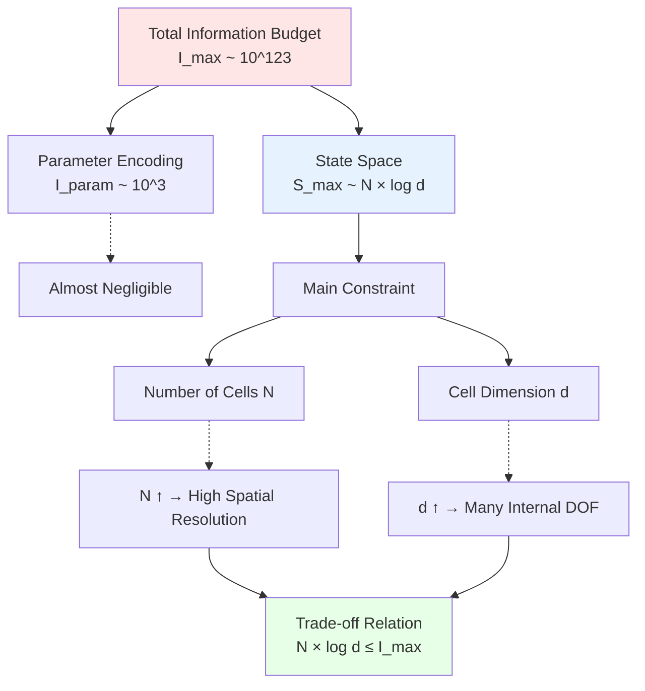

# 02. Triple Decomposition of Parameter Vector: Structure, Dynamics, and Initial State

## Introduction: Three Layers of Building Blueprints

In previous article, we established finite information universe axiom: Universe can be encoded as finite bit string $\Theta \in \{0,1\}^{\leq I_{\max}}$.

But this raises new question: **How should this parameter vector $\Theta$ be organized?**

### Popular Analogy: Building House Requires Three Types of Information

Imagine building a house requires following three independent types of information:

**Type 1: Architectural Blueprint** (Structural Information)
- How many floors? How large each floor?
- How are rooms laid out?
- Positions of walls, columns
- Building material types (wood, brick, reinforced concrete)
- **This determines "skeleton of house"**

**Type 2: Construction Rules** (Dynamical Information)
- How to pour concrete?
- How to lay bricks? (Laying method, mortar ratio)
- How to wire circuits?
- How to connect water pipes?
- **This determines "how house is built"**

**Type 3: Foundation State** (Initial Conditions)
- Is foundation level?
- What is soil bearing capacity?
- How high is water table?
- How to handle existing old buildings?
- **This determines "starting state"**

**Key Insight**: These three types of information are **logically independent**!
- Can build houses on different foundations with same blueprint
- Can realize same blueprint with different construction rules
- But three types of information **all necessary**

**Universe's situation completely analogous**:

$$
\boxed{\Theta = (\Theta_{\text{str}}, \Theta_{\text{dyn}}, \Theta_{\text{ini}})}
$$

| Building Analogy | Universe Parameter | Physical Meaning |
|-----------------|-------------------|-----------------|
| Architectural blueprint | $\Theta_{\text{str}}$ | Spacetime structure (lattice, dimension, topology) |
| Construction rules | $\Theta_{\text{dyn}}$ | Dynamical laws (coupling constants, evolution operators) |
| Foundation state | $\Theta_{\text{ini}}$ | Initial quantum state (state at big bang moment) |

This article will explain in detail:
1. Why need triple decomposition? (Logical independence)
2. What information does each parameter type encode? (Mathematical definition)
3. How to define total information $I_{\text{param}}(\Theta)$? (Bit counting)
4. Encoding redundancy and essential degrees of freedom (Uniqueness question)

## Part I: Why Need Triple Decomposition?

### Three Levels of Physical Problems

Consider simple system in classical mechanics: Harmonic oscillator.

**To completely determine system evolution, need three types of information**:

1. **System Composition** (Structure):
   - Single oscillator? Or coupled oscillator chain?
   - What is mass $m$? What is spring constant $k$?
   - → Corresponds to $\Theta_{\text{str}}$ (System's "hardware specifications")

2. **Equations of Motion** (Dynamics):
   - Newton's second law: $m\ddot{x} = -kx$
   - Or Hamiltonian equations: $\dot{p} = -\partial H/\partial x$
   - → Corresponds to $\Theta_{\text{dyn}}$ (System's "operating rules")

3. **Initial Conditions** (Initial State):
   - At $t=0$: Position $x_0$, velocity $v_0$
   - → Corresponds to $\Theta_{\text{ini}}$ (System's "starting point")

**Key Observation**:
- Changing initial conditions $(x_0, v_0)$ doesn't change equations of motion
- Changing mass $m$ doesn't change initial position $x_0$
- But three **together** determine trajectory $x(t)$

This separation also exists in quantum field theory:

| Classical Mechanics | Quantum Field Theory | Universe QCA |
|-------------------|---------------------|--------------|
| System composition $(m, k)$ | Field degrees of freedom and symmetry | $\Theta_{\text{str}}$ (lattice, Hilbert space) |
| Equations of motion $F=ma$ | Lagrangian $\mathcal{L}$ | $\Theta_{\text{dyn}}$ (QCA automorphism $\alpha_\Theta$) |
| Initial conditions $(x_0, v_0)$ | Vacuum state $|0\rangle$ | $\Theta_{\text{ini}}$ (initial state $\omega_0^\Theta$) |

### Mathematical Independence Theorem

**Theorem 2.1** (Direct Product Decomposition of Parameter Space):

In QCA framework, universe parameter space can be decomposed as direct product of three subspaces:

$$
\mathcal{M}_{\Theta} = \mathcal{M}_{\text{str}} \times \mathcal{M}_{\text{dyn}} \times \mathcal{M}_{\text{ini}}
$$

such that:
1. Structural parameter $\Theta_{\text{str}} \in \mathcal{M}_{\text{str}}$ uniquely determines:
   - Lattice set $\Lambda$
   - Cell Hilbert space $\mathcal{H}_{\text{cell}}$
   - Quasi-local algebra $\mathcal{A}(\Lambda, \mathcal{H}_{\text{cell}})$

2. Dynamical parameter $\Theta_{\text{dyn}} \in \mathcal{M}_{\text{dyn}}$ uniquely determines:
   - QCA automorphism $\alpha: \mathcal{A} \to \mathcal{A}$
   - (After $\mathcal{A}$ is given)

3. Initial state parameter $\Theta_{\text{ini}} \in \mathcal{M}_{\text{ini}}$ uniquely determines:
   - Initial state $\omega_0: \mathcal{A} \to \mathbb{C}$
   - (After $\mathcal{A}$ is given)

4. Three subspaces logically independent:
   $$
   \text{Choice of } \Theta_{\text{dyn}} \text{ does not depend on } \Theta_{\text{ini}}
   $$
   $$
   \text{Choice of } \Theta_{\text{ini}} \text{ does not depend on } \Theta_{\text{dyn}}
   $$
   (But both depend on algebra $\mathcal{A}$ determined by $\Theta_{\text{str}}$)

**Proof Outline**:
- $\Theta_{\text{str}}$ determines "stage" (algebra $\mathcal{A}$)
- $\Theta_{\text{dyn}}$ selects an automorphism from automorphism group $\text{Aut}(\mathcal{A})$
- $\Theta_{\text{ini}}$ selects a state from state space $\mathcal{S}(\mathcal{A})$
- Automorphism group and state space are independent structures on $\mathcal{A}$

### Why Cannot Merge?

**Failed Attempt 1**: Merge $\Theta_{\text{dyn}}$ into $\Theta_{\text{str}}$?
- **Counterexample**: Same lattice structure $\Lambda$ can define infinitely many different QCA evolution rules
- Example: One-dimensional $\mathbb{Z}_L$ lattice can be Dirac-QCA, Ising-QCA, Toffoli-QCA...
- **Conclusion**: Dynamics not uniquely determined by structure

**Failed Attempt 2**: Merge $\Theta_{\text{ini}}$ into $\Theta_{\text{dyn}}$?
- **Counterexample**: Same Hamiltonian $H$ can have different initial states
- Example: Harmonic oscillator $H = p^2/2m + kx^2/2$ can start in ground state $|0\rangle$ or coherent state $|\alpha\rangle$
- **Conclusion**: Initial state not uniquely determined by dynamics

**Failed Attempt 3**: Merge $\Theta_{\text{str}}$ into $\Theta_{\text{dyn}}$?
- **Counterexample**: QCA with different number of lattice points are topologically inequivalent
- Example: $\mathbb{Z}_{100}$ and $\mathbb{Z}_{101}$ QCA, regardless of evolution rules, are not isomorphic
- **Conclusion**: Structure is prerequisite for dynamics

**Therefore**: Triple decomposition is **minimal** and **necessary**.

## Part II: Definition of Structural Parameter $\Theta_{\text{str}}$

### Encoded Content: "Blueprint" of Spacetime

Structural parameter $\Theta_{\text{str}}$ needs to specify following information:

#### (1) Spatial Dimension $d$

$$
d \in \{1, 2, 3, 4, \ldots\}
$$

**Encoding Method**:
- Encode dimension with $\lceil \log_2 d_{\max} \rceil$ bits
- If restrict $d \leq 10$ (reasonable physical assumption), need $\lceil \log_2 10 \rceil = 4$ bits

**Physical Meaning**:
- $d=1$: Toy model (Dirac chain)
- $d=3$: Our space
- $d=4$: Spacetime unified (Minkowski lattice)
- $d>4$: Extra dimensions (string theory)

#### (2) Lattice Lengths in Each Direction $L_1, \ldots, L_d$

$$
\Lambda = \prod_{i=1}^d \{0, 1, \ldots, L_i - 1\}
$$

**Encoding Method**:
- If each $L_i \leq 2^{64}$ (sufficient for cosmological scales), each direction needs 64 bits
- Total: $64d$ bits

**Example**:
- $d=3$, $L_1 = L_2 = L_3 = 10^{30}$ (observable universe in Planck length units)
- Total number of cells: $N_{\text{cell}} = (10^{30})^3 = 10^{90}$

#### (3) Boundary Conditions and Topology

**Options**:
- Open boundary
- Periodic boundary (topology $\mathbb{T}^d$)
- Twisted boundary
- Other topologies ($S^d$, manifold gluing)

**Encoding Method**:
- Simple case: Use $d \times 2$ bits (each direction two boundaries, 1 bit each)
- Complex topology: Need additional encoding of gluing rules (topological invariants)

#### (4) Cell Internal Hilbert Space Dimension $d_{\text{cell}}$

$$
\mathcal{H}_x \cong \mathbb{C}^{d_{\text{cell}}}
$$

**Physical Structure** (usually decomposed into multiple subsystems):

$$
\mathcal{H}_{\text{cell}} = \mathcal{H}_{\text{fermion}} \otimes \mathcal{H}_{\text{gauge}} \otimes \mathcal{H}_{\text{aux}}
$$

- $\mathcal{H}_{\text{fermion}}$: Fermion degrees of freedom (e.g., $\mathbb{C}^2$ spin in Dirac-QCA)
- $\mathcal{H}_{\text{gauge}}$: Gauge field registers (e.g., $\mathbb{C}^{|G|}$, $G$ is gauge group)
- $\mathcal{H}_{\text{aux}}$: Auxiliary qubits (for maintaining unitarity)

**Encoding Method**:
- Specify dimension of each subsystem (e.g., $\dim \mathcal{H}_{\text{fermion}} = 4$, $\dim \mathcal{H}_{\text{gauge}} = 8$)
- Total dimension: $d_{\text{cell}} = \prod_i \dim \mathcal{H}_i$
- Need $\sim \log_2 d_{\text{cell}}$ bits to encode

**Example** (Standard Model QCA):
- Fermions: 3 generations × 2 spins × 3 colors × 2 (particle/antiparticle) = 36
- Gauge fields: SU(3) × SU(2) × U(1) → ~16 generators
- Auxiliary: Several qubits ensuring reversibility
- Total dimension: $d_{\text{cell}} \sim 2^{10} = 1024$

#### (5) Symmetries and Conservation Laws

**Encoded Content**:
- Global symmetry group $G_{\text{global}}$ (e.g., $U(1)$, $SU(2)$, Lorentz group)
- Local symmetry group $G_{\text{local}}$ (gauge symmetry)
- Conserved quantity labels (e.g., charge sector, spin sector)

**Encoding Method**:
- Specify group type (e.g., "SU(3)") → Encode with finite character set
- Choice of representation (e.g., "fundamental representation", "adjoint representation")
- How symmetry acts on $\mathcal{H}_{\text{cell}}$

#### (6) Defects and Non-Trivial Configurations

**Optional**:
- Topological defects (e.g., cosmic strings, magnetic monopoles)
- Domain walls
- Non-uniform lattice lengths (refinement)

**Encoding Method**:
- Defect positions: Coordinate list
- Defect types: Finite classification encoding
- (Usually optional in $\Theta_{\text{str}}$, not all universes have)

### Bit Count of Structural Parameters

Combining above, information content of $\Theta_{\text{str}}$:

$$
\boxed{|\Theta_{\text{str}}| = \underbrace{4}_{\text{dimension}} + \underbrace{64d}_{\text{lattice lengths}} + \underbrace{2d}_{\text{boundaries}} + \underbrace{\log_2 d_{\text{cell}}}_{\text{cell dimension}} + \underbrace{I_{\text{symm}}}_{\text{symmetries}} + \underbrace{I_{\text{defect}}}_{\text{defects}}}
$$

**Typical Numerical Value** ($d=3$, Standard Model):
- Dimension: 4 bits
- Lattice lengths: $3 \times 64 = 192$ bits
- Boundaries: $3 \times 2 = 6$ bits
- Cell dimension: $\log_2(1024) = 10$ bits
- Symmetries: $\sim 50$ bits (encoding "SU(3)×SU(2)×U(1)" and representations)
- Defects: 0 bits (assuming uniform universe)

**Total**:
$$
|\Theta_{\text{str}}| \sim 262 \text{ bits}
$$

(Relative to $I_{\max} \sim 10^{123}$ bits, this is **negligible**!)

## Part III: Definition of Dynamical Parameter $\Theta_{\text{dyn}}$

### Encoded Content: "Source Code" of Physical Laws

Dynamical parameter $\Theta_{\text{dyn}}$ specifies QCA time evolution rules, i.e., automorphism $\alpha: \mathcal{A} \to \mathcal{A}$.

#### (1) Finite Gate Set $\mathcal{G} = \{G_1, \ldots, G_K\}$

**Physical Assumption**: Exists a **fixed finite gate set**, all local unitary evolutions composed from these gates.

**Analogy**:
- Classical computation: NAND gate is universal (any Boolean function can be composed from NAND)
- Quantum computation: $\{H, T, \text{CNOT}\}$ is universal (can approximate any unitary gate)

**QCA Gate Set Requirements**:
- Each gate acts on radius $r_0$ neighborhood (e.g., nearest neighbor, next-nearest neighbor)
- Matrix elements are algebraic numbers or finite precision angle parameters
- Preserves locality and reversibility

**Encoding Method**:
- Gate set $\mathcal{G}$ can be **pre-agreed** (like choosing programming language)
- Or encode gate set itself in $\Theta_{\text{str}}$ (more general)

**Example** (Dirac-QCA gate set):
- Coin gate: $C(\theta) = \exp(-i\theta \sigma_y)$
- Shift gate: $S = \sum_{x,s} |x+s, s\rangle\langle x, s|$
- Parameter $\theta$ is discrete angle (see below)

#### (2) Circuit Depth $D$

$$
U_{\Theta_{\text{dyn}}} = U_D \cdots U_2 U_1
$$

**Physical Meaning**:
- $D$: How many layers of gates needed for one time step
- Analogy: "Loop depth" of program

**Encoding Method**:
- Use $\lceil \log_2 D_{\max} \rceil$ bits
- If $D \leq 10^3$ (sufficiently complex), need $\lceil \log_2 10^3 \rceil = 10$ bits

#### (3) Gate Type and Action Region for Each Layer

For layer $\ell$ ($\ell = 1, \ldots, D$), need to specify:

**Gate Type Index** $k_\ell \in \{1, \ldots, K\}$:
- Which gate from gate set
- Encoding: $\log_2 K$ bits

**Action Region** $R_\ell \subset \Lambda$:
- Which cells gate acts on
- Encoding: Coordinate list + translational symmetry compression

**Example** (Translation-invariant QCA):
- Each layer: Apply gate $G_{k_{\ell}}$ to all odd lattice points
- Encoding: Only need to specify $k_\ell$ and "odd/even" (1 bit)
- Using symmetry, greatly compressed

#### (4) Discretization of Continuous Angle Parameters

Many gates contain continuous parameters (e.g., rotation angle $\theta$). Finite information requires these parameters to be **discretized**.

**Discretization Scheme**:

$$
\theta_{\ell,j} = \frac{2\pi n_{\ell,j}}{2^{m_{\ell,j}}}
$$

where:
- $n_{\ell,j} \in \{0, 1, \ldots, 2^{m_{\ell,j}} - 1\}$: Discrete label
- $m_{\ell,j}$: Precision bit number (e.g., $m=10$ corresponds to $2^{10}=1024$ angles)

**Encoding Method**:
- For each gate needing angle parameter, encode $n_{\ell,j}$
- Need $m_{\ell,j}$ bits
- If uniform precision $m$, each angle needs $m$ bits

**Physical Consequences**:
- Angle precision $\Delta\theta \sim 2\pi / 2^m$
- Propagates to physical constants: $\Delta m_e / m_e \sim \Delta\theta$
- $m=10$: Precision $\sim 0.1\%$ (rough)
- $m=50$: Precision $\sim 10^{-15}$ (close to experimental precision)

**Popular Analogy**:
Imagine adjusting pitch in digital music software:
- Analog knob: Continuous adjustment (infinite precision) → Requires infinite information
- Digital slider: Discrete steps (e.g., 1024 steps) → Only needs 10 bits
- Human ear cannot distinguish adjacent steps → Finite precision sufficient!

Physical measurements similar: **Physically distinguishable** ≠ **Mathematically distinguishable**.

#### (5) Derivation of Effective Coupling Constants

From discrete angle parameters, can analytically derive effective field theory coupling constants:

$$
m_e(\Theta_{\text{dyn}}) = f_m(\theta_1, \theta_2, \ldots)
$$
$$
\alpha(\Theta_{\text{dyn}}) = g^2(\theta'_1, \theta'_2, \ldots) / 4\pi
$$

**Key Theorem** (Article 07 will detail):
In continuous limit $a, \Delta t \to 0$, relation between Dirac mass and coin angle:

$$
m_{\text{eff}} c^2 \approx \frac{\theta}{\Delta t}
$$

Therefore:
$$
\Delta m_e / m_e \sim \Delta\theta / \theta \sim 2\pi / 2^m \theta
$$

If $\theta \sim \pi/4$, $m=50$:
$$
\Delta m_e / m_e \sim 2\pi / (2^{50} \times \pi/4) = 8 / 2^{50} \sim 10^{-14}
$$

(Close to current electron mass measurement precision $\sim 10^{-9}$!)

### Bit Count of Dynamical Parameters

$$
\boxed{|\Theta_{\text{dyn}}| = \underbrace{10}_{\text{depth } D} + D \times \left( \underbrace{\log_2 K}_{\text{gate type}} + \underbrace{I_{\text{region}}}_{\text{action region}} + \underbrace{m \times n_{\text{angles}}}_{\text{angle parameters}} \right)}
$$

**Typical Numerical Value** (Translation-invariant Dirac-QCA):
- Depth: $D \sim 10$ → 10 bits
- Gate type: $K=5$ → $\log_2 5 \approx 3$ bits/layer
- Action region: Translation symmetry → 1 bit/layer
- Angle parameters: 2 angles per layer, precision $m=50$ → $2 \times 50 = 100$ bits/layer

**Per Layer**: $3 + 1 + 100 = 104$ bits
**Total**:
$$
|\Theta_{\text{dyn}}| \sim 10 + 10 \times 104 = 1050 \text{ bits}
$$

(Still much smaller than $I_{\max}$!)

## Part IV: Definition of Initial State Parameter $\Theta_{\text{ini}}$

### Encoded Content: Universe's "Factory Settings"

Initial state parameter $\Theta_{\text{ini}}$ specifies quantum state $\omega_0$ at big bang moment ($t=0$).

#### (1) Physical Choice of Initial State

**Classical Cosmology**:
- Initial conditions: Matter density $\rho_0$, Hubble constant $H_0$, curvature $k$...
- Requires **infinite precision real numbers** (dilemma of hot big bang theory)

**Quantum Cosmology**:
- Hartle-Hawking no-boundary proposal: $|\Psi_0\rangle$ automatically selected by path integral
- Concept of "universe wave function"

**QCA Framework**:
- Initial state must be some state in $\mathcal{H}_{\Lambda}$
- But $\dim \mathcal{H}_{\Lambda} = d_{\text{cell}}^{N_{\text{cell}}} \sim e^{S_{\max}}$ (astronomical number)
- Cannot enumerate all states! Need **generation algorithm**

#### (2) Finite Depth State Preparation Circuit

**Core Idea**: Use **finite depth quantum circuit** to generate initial state from simple reference state.

**Reference Product State** (trivial product state):

$$
|0_\Lambda\rangle = \bigotimes_{x \in \Lambda} |0_{\text{cell}}\rangle_x
$$

(Each cell in some fixed "vacuum state" $|0_{\text{cell}}\rangle$)

**State Preparation Circuit**:

$$
|\Psi_0^{\Theta}\rangle = V_{\Theta_{\text{ini}}} |0_\Lambda\rangle
$$

where $V_{\Theta_{\text{ini}}}$ is finite depth unitary operator constructed from gate set $\mathcal{G}$.

**Encoded Content** (similar to $\Theta_{\text{dyn}}$):
- Circuit depth $D_{\text{ini}}$
- Gate type, action region, angle parameters for each layer

#### (3) Initial Entanglement Structure

Finite depth circuit can only produce **short-range entangled states** (Lieb-Robinson bound limitation).

**Theorem 2.2** (Lieb-Robinson Bound Constraint on Entanglement):

If state preparation circuit depth is $D_{\text{ini}}$, Lieb-Robinson velocity is $v_{\text{LR}}$, then mutual information of two regions $A, B$ at distance $r > v_{\text{LR}} D_{\text{ini}}$ satisfies:

$$
I(A:B) \lesssim \exp(-c(r - v_{\text{LR}} D_{\text{ini}}))
$$

(exponential decay)

**Physical Meaning**:
- Finite depth circuit → Long-range entanglement limited
- To produce universe-scale entanglement → Need depth $D \sim N_{\text{cell}}$ → Parameter explosion
- **Trade-off**: Initial state is "locally prepared, globally weakly entangled"

**Cosmological Application**:
- Cosmic microwave background correlation length $\sim 10^5$ light years
- Observable universe scale $\sim 10^{10}$ light years
- Ratio $\sim 10^{-5}$ → Need circuit depth $D_{\text{ini}} \sim \log N_{\text{cell}}$

#### (4) Symmetry of Initial State

Using symmetry to compress encoding:

**Example 1** (Translation-invariant initial state):
$$
|\Psi_0\rangle = \left( V_{\text{local}} \right)^{\otimes N_{\text{cell}}} |0_\Lambda\rangle
$$
- Apply same local unitary $V_{\text{local}}$ to each cell
- Encoding: Only need parameters of $V_{\text{local}}$ (independent of $N_{\text{cell}}$!)

**Example 2** (Ground state or thermal state):
- Ground state: $|\Psi_0\rangle = |GS(H_{\text{eff}})\rangle$ (ground state of some effective Hamiltonian)
- Encoding: Only need to encode $H_{\text{eff}}$ (usually determined by $\Theta_{\text{dyn}}$)
- Thermal state: $\rho_0 = \exp(-\beta H_{\text{eff}}) / Z$
- Encoding: Only need temperature $\beta$

**Popular Analogy**:
Imagine factory producing 1000 identical parts:
- **Stupid method**: Draw separate blueprint for each part → 1000 blueprints
- **Smart method**: Draw one standard blueprint + "copy 1000 times" instruction → 1 blueprint
- Symmetry is "copy instruction", greatly compresses information!

### Bit Count of Initial State Parameters

$$
\boxed{|\Theta_{\text{ini}}| \sim 10 + D_{\text{ini}} \times (3 + I_{\text{region}} + m \times n_{\text{angles}})}
$$

**Typical Numerical Value** (Translation-invariant + short-range entanglement):
- Depth: $D_{\text{ini}} \sim 5$ (short-range entanglement sufficient)
- Per layer: $\sim 104$ bits (same as $\Theta_{\text{dyn}}$)

**Total**:
$$
|\Theta_{\text{ini}}| \sim 10 + 5 \times 104 = 530 \text{ bits}
$$

(Still much smaller than $I_{\max}$!)

## Part V: Total Information and Finite Information Inequality

### Definition of Parameter Information

**Definition 2.3** (Parameter Information):

$$
\boxed{I_{\text{param}}(\Theta) := |\Theta_{\text{str}}| + |\Theta_{\text{dyn}}| + |\Theta_{\text{ini}}|}
$$

(in bits)

**Numerical Estimate** (combining previous three parts):

| Parameter Type | Typical Bit Count |
|---------------|------------------|
| $|\Theta_{\text{str}}|$ | $\sim 260$ |
| $|\Theta_{\text{dyn}}|$ | $\sim 1050$ |
| $|\Theta_{\text{ini}}|$ | $\sim 530$ |
| **Total** $I_{\text{param}}$ | $\sim 1840$ |

**Key Observation**:
$$
I_{\text{param}} \sim 10^3 \text{ bits} \ll I_{\max} \sim 10^{123} \text{ bits}
$$

Parameter information **negligible**!

### Maximum Entropy of State Space

**Definition 2.4** (Maximum Entropy of State Space):

$$
\boxed{S_{\max}(\Theta) := \log_2 \dim \mathcal{H}_{\Lambda} = N_{\text{cell}} \log_2 d_{\text{cell}}}
$$

**Numerical Estimate**:
- $N_{\text{cell}} \sim 10^{90}$ (Observable universe in Planck length units)
- $d_{\text{cell}} \sim 10^3$ (Standard Model degrees of freedom)
- $S_{\max} \sim 10^{90} \times 10 = 10^{91}$ bits

(This is the main part!)

### Restatement of Finite Information Inequality

**Theorem 2.5** (Finite Information Inequality):

$$
\boxed{I_{\text{param}}(\Theta) + S_{\max}(\Theta) \leq I_{\max}}
$$

**Corollary 2.6** (Upper Bound on Number of Cells):

Since $I_{\text{param}} \ll I_{\max}$ (negligible), have:

$$
N_{\text{cell}} \log_2 d_{\text{cell}} \lesssim I_{\max}
$$

Therefore:

$$
\boxed{N_{\text{cell}} \lesssim \frac{I_{\max}}{\log_2 d_{\text{cell}}}}
$$

**Numerical Value**:
- If $d_{\text{cell}} = 10^3$, $\log_2 d_{\text{cell}} = 10$
- Then $N_{\text{cell}} \lesssim 10^{122}$ cells

**Physical Interpretation**:
Trade-off between spatial resolution (number of lattice points) and internal complexity (cell dimension):
- Want more lattice points → Must reduce cell dimension
- Want more complex cells → Must reduce number of lattice points
- Product (logarithm) constrained by $I_{\max}$

**Diagram**:

## Part VI: Encoding Redundancy and Uniqueness

### Sources of Encoding Non-Uniqueness

**Question**: Given a universe QCA $\mathfrak{U}$, is parameter $\Theta$ unique?

**Answer**: Not unique! Multiple ways to encode same universe.

#### Source 1: Gauge Equivalence

**Example** (Lattice relabeling):
- Relabel lattice points $\Lambda = \{0, 1, \ldots, L-1\}$
- Physically identical, but coordinate representation different
- Encoding of $\Theta_{\text{str}}$ may change (if coordinates encoded)

**Treatment**: Consider as same parameter in equivalence class sense

#### Source 2: Circuit Equivalence

**Example** (Quantum circuit optimization):
Two circuits $U_1, U_2$ may realize same automorphism:
$$
U_1^\dagger A U_1 = U_2^\dagger A U_2, \quad \forall A \in \mathcal{A}
$$

But $U_1 \neq U_2$ (e.g., differ by global phase)

**Treatment**: Two circuits encode as same $\Theta_{\text{dyn}}$

#### Source 3: Precision Redundancy

**Example** (Angle parameter rounding):
$\theta = 0.5000$ and $\theta = 0.5001$ may be physically indistinguishable (finite measurement precision)

**Treatment**: Define equivalence relation $\theta_1 \sim \theta_2$ when $|\theta_1 - \theta_2| < \epsilon_{\text{meas}}$

### Encoding Uniqueness Theorem

**Definition 2.7** (Parameter Equivalence):

Two parameter vectors $\Theta, \Theta'$ called **equivalent**, denoted $\Theta \sim \Theta'$, if and only if exists quasi-local $C^*$ algebra isomorphism $\Phi: \mathcal{A}(\Theta) \to \mathcal{A}(\Theta')$ and time bijection $f: \mathbb{Z} \to \mathbb{Z}$, such that:

$$
\Phi \circ \alpha_\Theta^n = \alpha_{\Theta'}^{f(n)} \circ \Phi, \quad \forall n \in \mathbb{Z}
$$

and initial state satisfies:
$$
\omega_0^{\Theta'} = \omega_0^{\Theta} \circ \Phi^{-1}
$$

**Theorem 2.8** (Essential Uniqueness of Parameter Encoding):

Under fixed gate set $\mathcal{G}$ and encoding convention, for each physically distinguishable universe QCA class, exists **unique** equivalence class representative $\Theta \in \mathcal{M}_\Theta / \sim$.

**Proof Outline**:
1. Gauge fixing: Choose standard lattice labeling, standard circuit simplification rules
2. Precision truncation: Round to measurement precision $\epsilon_{\text{meas}}$
3. Quotient equivalence relation: Select one representative from each equivalence class in $\mathcal{M}_\Theta / \sim$

**Physical Meaning**:
Although encoding has redundancy, "essential degrees of freedom" are finite and unique.

### Effective Parameter Dimension

**Definition 2.9** (Effective Parameter Dimension):

$$
d_{\text{eff}} := \log_2 |\mathcal{M}_\Theta / \sim|
$$

**Estimate**:
$$
d_{\text{eff}} \approx I_{\text{param}} - I_{\text{redundancy}}
$$

where $I_{\text{redundancy}}$ is encoding redundancy (dimension of gauge symmetries)

**Numerical Value**:
- $I_{\text{param}} \sim 10^3$ bits
- $I_{\text{redundancy}} \sim 10^2$ bits (gauge degrees of freedom, coordinate choices, etc.)
- $d_{\text{eff}} \sim 10^3 - 10^2 \sim 900$ bits

**Conclusion**: Universe's "essential free parameters" only about **900 bits**!

(Equivalent to a 112 byte file!)

## Summary of Core Points of This Article

### Logic of Triple Decomposition

$$
\boxed{\Theta = (\Theta_{\text{str}}, \Theta_{\text{dyn}}, \Theta_{\text{ini}})}
$$

| Parameter Type | Physical Meaning | Mathematical Object | Typical Bit Count |
|---------------|-----------------|-------------------|------------------|
| $\Theta_{\text{str}}$ | Spacetime structure | Lattice + Hilbert space | $\sim 260$ |
| $\Theta_{\text{dyn}}$ | Dynamical laws | QCA automorphism $\alpha$ | $\sim 1050$ |
| $\Theta_{\text{ini}}$ | Initial state | State $\omega_0$ | $\sim 530$ |
| **Total** | Universe parameters | Complete universe $\mathfrak{U}_{\text{QCA}}(\Theta)$ | $\sim 1840$ |

### Definition of Parameter Information

$$
\boxed{I_{\text{param}}(\Theta) = |\Theta_{\text{str}}| + |\Theta_{\text{dyn}}| + |\Theta_{\text{ini}}|}
$$

### Finite Information Inequality

$$
\boxed{I_{\text{param}}(\Theta) + S_{\max}(\Theta) \leq I_{\max}}
$$

where:
- $S_{\max}(\Theta) = N_{\text{cell}} \log_2 d_{\text{cell}}$ (Maximum entropy of state space)
- $I_{\max} \sim 10^{123}$ bits (Universe information capacity)

### Trade-off Relation

$$
\boxed{N_{\text{cell}} \times \log_2 d_{\text{cell}} \lesssim I_{\max}}
$$

**Physical Picture**:
- Trade-off between spatial resolution $N_{\text{cell}}$ and internal complexity $d_{\text{cell}}$
- Parameter information $I_{\text{param}}$ relatively negligible ($\sim 10^3$ vs $10^{123}$)
- **Main constraint from state space size**

### Key Insights

1. **Three parameter types logically independent**: Structure→Dynamics→Initial state, determined sequentially, but logically separated
2. **Parameter information extremely small**: $I_{\text{param}} \sim 10^3 \ll I_{\max} \sim 10^{123}$
3. **Symmetry compression**: Using translation/gauge symmetry, greatly reduces encoding cost
4. **Discretization necessary**: Finite information → Continuous parameters must be discretized (finite precision angles)
5. **Essential degrees of freedom finite**: After removing redundancy, ~900 bits essential parameters

---

**Next Article Preview**: **03. Detailed Explanation of Structural Parameters: Discrete Blueprint of Spacetime**
- Construction method of lattice set $\Lambda$
- Tensor product decomposition of cell Hilbert space
- Topology types and boundary conditions
- Representation theory of symmetry groups
- Lattice spacing $a$ and preparation for continuous limit

