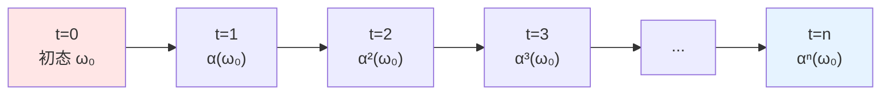

# 04. 动力学参数详解：物理定律的源代码

## 引言：从静态结构到动态演化

在第03篇中，我们建立了宇宙的"空间骨架"——格点集合 $\Lambda$ 和元胞Hilbert空间 $\mathcal{H}_{\text{cell}}$。但这只是静态的"舞台"。

**关键问题**：宇宙如何演化？时间如何推进？物理定律如何运作？

答案在**动力学参数** $\Theta_{\text{dyn}}$ 中。

### 通俗比喻：从建筑图纸到施工规则

继续我们的建筑类比：

**第03篇（结构参数）**：
- 建筑图纸：有多少层？每层多大？
- 这是**静态**信息——描述"房子长什么样"

**第04篇（动力学参数）**：
- 施工规则：砖如何砌？混凝土如何浇？
- 这是**动态**信息——描述"房子如何建造"

**宇宙的情况**：
- $\Theta_{\text{str}}$："宇宙长什么样"（空间结构）
- $\Theta_{\text{dyn}}$："宇宙如何运行"（时间演化）

| 建筑类比 | 宇宙QCA | 数学对象 |
|---------|---------|---------|
| 施工手册 | 动力学参数 $\Theta_{\text{dyn}}$ | 参数比特串 |
| 施工工具 | 局域幺正门 $\mathcal{G} = \{G_1, \ldots, G_K\}$ | 幺正算符集合 |
| 施工步骤 | 量子线路 $U = U_D \cdots U_2 U_1$ | 有限深度线路 |
| 施工结果 | 时间演化 $\alpha_{\Theta}$ | QCA自同构 |
| 物理定律 | 有效哈密顿量 $H_{\text{eff}}$ | 连续极限 |

本篇将详细解释如何从有限比特串 $\Theta_{\text{dyn}}$ 编码整个宇宙的时间演化。

## 第一部分：QCA自同构与时间演化

### 什么是时间演化？

**经典力学**：
- 初态：$(x_0, p_0)$
- 哈密顿量：$H(x, p)$
- 时间演化：$\dot{x} = \partial H / \partial p$，$\dot{p} = -\partial H / \partial x$
- 结果：轨迹 $(x(t), p(t))$

**量子力学**：
- 初态：$|\psi_0\rangle$
- 哈密顿量：$\hat{H}$
- 时间演化：$|\psi(t)\rangle = e^{-i\hat{H}t/\hbar} |\psi_0\rangle$
- 结果：量子态随时间的幺正演化

**量子元胞自动机**（QCA）：
- 初态：$\omega_0$ （态泛函）
- 演化算符：$U$ （幺正算符）
- 时间演化：$\omega_n(A) = \omega_0(U^{\dagger n} A U^n)$
- 结果：离散时间步的幺正自同构

### QCA自同构的定义

**定义4.1**（QCA时间演化）：

给定全局Hilbert空间 $\mathcal{H}_{\Lambda} = \bigotimes_{x \in \Lambda} \mathcal{H}_x$ 和准局域代数 $\mathcal{A}(\Lambda)$，QCA的一个时间步由幺正算符 $U: \mathcal{H}_{\Lambda} \to \mathcal{H}_{\Lambda}$ 实现：

$$
\alpha(A) = U^\dagger A U, \quad A \in \mathcal{A}(\Lambda)
$$

**性质**：
1. **幺正性**：$U^\dagger U = U U^\dagger = \mathbb{1}$（可逆）
2. **局域性**：$U$ 可表示为有限深度局域门的乘积
3. **因果性**：信息传播速度有限（Lieb-Robinson界）

**物理意义**：
- $\alpha$：将时刻 $t$ 的可观测量映射到时刻 $t+1$ 的可观测量
- 类比：相机快门每次拍摄，世界"跳跃"到下一帧

**通俗比喻**：
- 连续时间（经典/量子力学）= 电影胶片（无限帧率）
- 离散时间（QCA）= 定格动画（有限帧率）
- $U$：从一帧到下一帧的"变换规则"

### $\Theta_{\text{dyn}}$ 的任务

动力学参数 $\Theta_{\text{dyn}}$ 需要完整指定幺正算符 $U$。

**挑战**：
- $\mathcal{H}_{\Lambda}$ 的维数：$d_{\text{cell}}^{N_{\text{cell}}} \sim 10^{6 \times 10^{90}}$（天文数字）
- 幺正算符 $U$ 的自由度：$\sim (d_{\text{cell}}^{N_{\text{cell}}})^2$（双重指数）
- 直接编码：需要 $\sim 10^{180}$ 比特（远超 $I_{\max}$！）

**解决方案**：利用**局域性**！
- $U$ 不是任意幺正算符
- $U$ 由**有限深度局域门线路**组成
- 局域门作用在少数邻居上（如2-4个格点）
- 总自由度被**指数压缩**

## 第二部分：有限门集 $\mathcal{G}$

### 门集：QCA的"编程语言"

在经典计算中，所有逻辑运算可由基本门（如NAND）组合而成。在量子计算中，也有类似的"通用门集"。

**定义4.2**（有限门集）：

固定一个有限的局域幺正算符集合：

$$
\boxed{\mathcal{G} = \{G_1, G_2, \ldots, G_K\}}
$$

其中每个 $G_k$ 满足：
1. **有限维**：作用在有限个格点上（半径 $r_0$ 邻域内）
2. **幺正性**：$G_k^\dagger G_k = \mathbb{1}$
3. **参数化**：矩阵元由有限精度角参数决定

**例子1**（单格点门）：
作用在单个元胞 $\mathcal{H}_x \cong \mathbb{C}^2$ 上：
- Pauli门：$X = \begin{pmatrix} 0 & 1 \\ 1 & 0 \end{pmatrix}$，$Y = \begin{pmatrix} 0 & -i \\ i & 0 \end{pmatrix}$，$Z = \begin{pmatrix} 1 & 0 \\ 0 & -1 \end{pmatrix}$
- Hadamard门：$H = \frac{1}{\sqrt{2}} \begin{pmatrix} 1 & 1 \\ 1 & -1 \end{pmatrix}$
- 旋转门：$R_y(\theta) = \exp(-i\theta \sigma_y / 2) = \begin{pmatrix} \cos(\theta/2) & -\sin(\theta/2) \\ \sin(\theta/2) & \cos(\theta/2) \end{pmatrix}$

**例子2**（两格点门）：
作用在相邻两个元胞 $\mathcal{H}_x \otimes \mathcal{H}_{x+1} \cong \mathbb{C}^2 \otimes \mathbb{C}^2$：
- CNOT门：$\text{CNOT} = \begin{pmatrix} 1 & 0 & 0 & 0 \\ 0 & 1 & 0 & 0 \\ 0 & 0 & 0 & 1 \\ 0 & 0 & 1 & 0 \end{pmatrix}$
- SWAP门：$\text{SWAP} = \begin{pmatrix} 1 & 0 & 0 & 0 \\ 0 & 0 & 1 & 0 \\ 0 & 1 & 0 & 0 \\ 0 & 0 & 0 & 1 \end{pmatrix}$
- 受控旋转：$CR_y(\theta) = |\uparrow\rangle\langle\uparrow| \otimes \mathbb{1} + |\downarrow\rangle\langle\downarrow| \otimes R_y(\theta)$

**例子3**（Dirac-QCA的门集）：
- **Coin门**：$C(\theta) = \exp(-i\theta \sigma_y)$ 作用在自旋自由度
- **Shift门**：$S = \sum_{x, s} |x+s, s\rangle\langle x, s|$ （自旋依赖平移）
- 参数：角度 $\theta \in [0, 2\pi)$（需要离散化）

### 门集大小与通用性

**定理4.3**（通用量子门集）：

存在有限门集 $\mathcal{G}$，使得任意幺正算符可以被**任意精度近似**为 $\mathcal{G}$ 中门的有限深度组合。

**经典结果**（Solovay-Kitaev定理）：
- 门集 $\{H, T, \text{CNOT}\}$ 在 $\mathbb{C}^2$ 上是通用的
- $H = \text{Hadamard}$，$T = \begin{pmatrix} 1 & 0 \\ 0 & e^{i\pi/4} \end{pmatrix}$
- 逼近精度 $\epsilon$，需要深度 $D \sim \log^c(1/\epsilon)$（多对数增长）

**物理意义**：
- 不需要无限多种门
- 有限门集 $\mathcal{G}$（如 $K=10$）足够表达所有物理
- 类比：10个基本音符可以组合出所有交响乐

**编码开销**：
- 门集可以**预先约定**（如选定"标准模型QCA门集"）
- 或在 $\Theta_{\text{str}}$ 中编码（额外 $\sim 50$ 比特）
- 通常：约定固定门集，节省编码

### 门集的比特编码

若门集有 $K$ 个门，选择某个门需要：

$$
\log_2 K \text{ 比特}
$$

**例子**：
- $K=16$：需要 4 比特
- $K=256$：需要 8 比特

## 第三部分：量子线路的构造

### 有限深度线路

**定义4.4**（量子线路）：

全局幺正算符 $U$ 由 $D$ 层局域门组成：

$$
\boxed{U = U_D U_{D-1} \cdots U_2 U_1}
$$

其中每层 $U_\ell$ 是若干个局域门 $G_k$ 并行施加：

$$
U_\ell = \prod_{j} G_{k_{\ell,j}}^{(R_{\ell,j})}
$$

- $k_{\ell,j}$：第 $\ell$ 层第 $j$ 个门的类型（从 $\mathcal{G}$ 中选）
- $R_{\ell,j} \subset \Lambda$：该门的作用区域

**关键约束**：
- **有限深度**：$D < \infty$（通常 $D \sim 10$-$10^3$）
- **局域性**：同一层的门作用在不相交区域（可并行）
- **有限半径**：每个门作用在半径 $r_0$ 邻域内

**通俗比喻**：
想象一个工厂流水线：
- 每层 $U_\ell$：流水线的一个工位
- 每个门 $G_k$：工位上的一个操作（如"拧螺丝"、"焊接"）
- 深度 $D$：流水线有多少个工位
- 产品经过 $D$ 个工位后完成组装 = 宇宙经过一个时间步

### 线路深度的编码

**编码内容**：

1. **深度** $D$：
   - 用 $\lceil \log_2 D_{\max} \rceil$ 比特
   - 若 $D \leq 1024$，需要 10 比特

2. **每层的门配置**（对 $\ell = 1, \ldots, D$）：
   - 门类型 $k_{\ell,j}$：$\log_2 K$ 比特/门
   - 作用区域 $R_{\ell,j}$：取决于对称性

**平移不变情况**（极大简化）：

若每层的门配置是**平移不变**的（所有奇数/偶数格点施加相同门）：
- 只需指定：门类型 + 奇偶性
- 每层编码：$\log_2 K + 1$ 比特

**一般情况**（非平移不变）：

需要指定每个门的位置：
- 格点坐标：$\sim d \log_2 L$ 比特/门
- $n_{\text{gates}}$ 个门：$\sim n_{\text{gates}} \times d \log_2 L$ 比特

**对称性压缩的威力**：

| 情况 | 每层比特数 | $D=100$ 总比特数 |
|------|-----------|-----------------|
| 完全任意 | $\sim 10^{90}$ | $10^{92}$ (超过 $I_{\max}$!) |
| 平移不变 | $\sim 10$ | $10^3$ |

**结论**：平移对称性是**必需**的，否则参数爆炸！

## 第四部分：离散角参数

### 连续参数的问题

许多物理门包含连续参数：

$$
R_y(\theta) = \exp(-i\theta \sigma_y)
$$

其中 $\theta \in [0, 2\pi)$ 是**实数**。

**问题**：
- 实数 $\theta$ 需要**无限比特**精确编码（如 $\pi = 3.14159\ldots$）
- 与有限信息公理矛盾！

**解决**：离散化角参数。

### 离散化方案

**定义4.5**（离散角）：

将角度限制为有理数：

$$
\boxed{\theta = \frac{2\pi n}{2^m}}
$$

其中：
- $n \in \{0, 1, \ldots, 2^m - 1\}$：离散标签
- $m \in \mathbb{N}$：精度比特数

**例子**（$m=3$）：
- 可用角度：$\frac{2\pi \times 0}{8}, \frac{2\pi \times 1}{8}, \ldots, \frac{2\pi \times 7}{8}$
- 即：$0, \frac{\pi}{4}, \frac{\pi}{2}, \frac{3\pi}{4}, \pi, \frac{5\pi}{4}, \frac{3\pi}{2}, \frac{7\pi}{4}$
- 共8个离散值

**编码**：
- 只需存储整数 $n$（需要 $m$ 比特）
- 例：$n=5$ （二进制：101）代表 $\theta = 5\pi/4$

**精度分析**：

角度分辨率：
$$
\Delta\theta = \frac{2\pi}{2^m}
$$

| 精度比特 $m$ | 角度数 $2^m$ | 分辨率 $\Delta\theta$ |
|--------------|-------------|----------------------|
| 8 | 256 | $\sim 1.4°$ |
| 16 | 65536 | $\sim 0.02°$ |
| 32 | $4 \times 10^9$ | $\sim 10^{-9}$ rad |
| 64 | $2 \times 10^{19}$ | $\sim 10^{-19}$ rad |

**物理可区分性**：

当前最精密的原子钟角频率测量精度 $\sim 10^{-18}$，因此：
- $m=64$：精度远超当前实验（过剩）
- $m=32$：足够所有可预见的实验
- $m=16$：对许多应用足够

### 离散角对物理常数的影响

在Dirac-QCA中，电子质量与coin角的关系（来自源理论定理3.4）：

$$
m_{\text{eff}} c^2 \approx \frac{\theta}{\Delta t}
$$

**离散化影响**：

$$
\Delta m_e \sim m_e \frac{\Delta\theta}{\theta} = m_e \frac{2\pi / 2^m}{\theta}
$$

**数值例子**：
- 假设 $\theta \sim \pi/4$（典型值）
- $m=16$：$\Delta m_e / m_e \sim 2\pi / (2^{16} \times \pi/4) = 8 / 2^{16} \sim 10^{-4}$
- $m=32$：$\Delta m_e / m_e \sim 10^{-9}$（与当前测量精度相当）

**结论**：
- $m=32$ 足以匹配所有已知物理常数的测量精度
- $m=64$ 对可预见的未来过剩
- **保守选择**：$m=50$（中间值）

## 第五部分：Lieb-Robinson界与因果性

### 信息传播速度

QCA的局域性保证信息传播有限速度。

**定理4.6**（Lieb-Robinson界）：

给定有限深度 $D$ 的局域幺正线路 $U$，定义演化 $\alpha(A) = U^\dagger A U$。若算符 $A$ 支撑在区域 $X$（$A \in \mathcal{A}_X$），则对任意区域 $Y$ 与距离 $d(X, Y) > v_{\text{LR}} D$：

$$
\boxed{\|[\alpha(A), B]\| \leq C e^{-c(d(X,Y) - v_{\text{LR}} D)}}
$$

其中 $B \in \mathcal{A}_Y$，$v_{\text{LR}}$ 为Lieb-Robinson速度，$C, c$ 为常数。

**物理意义**：
- $v_{\text{LR}}$：信息传播的"有效光速"
- 时间 $D$ 步后，信息最多传播距离 $\sim v_{\text{LR}} D$
- 超出此距离，算符对易子指数衰减（几乎无相互作用）

**例子**（最近邻门）：
- 每层门只作用最近邻 → $v_{\text{LR}} = 1$ 格点/步
- 深度 $D=10$ → 信息传播 $\sim 10$ 格点
- 距离 $> 10$ 的区域几乎不受影响

**通俗比喻**：
- 想象在池塘扔一颗石子
- 波纹向外传播（信息传递）
- 波速有限（$v_{\text{LR}}$）
- 时间 $t$ 后，波纹半径 $\sim v_{\text{LR}} t$
- 远处的青蛙还没感觉到（对易子小）

### 光锥结构

**定义4.7**（QCA光锥）：

对格点 $x \in \Lambda$ 和时间 $n$，定义：

$$
\mathcal{C}_n(x) = \{y \in \Lambda : d(x, y) \leq v_{\text{LR}} n\}
$$

为 $x$ 在 $n$ 步后的**因果锥**（或光锥）。

**因果性原理**：
- 时刻 0 的格点 $x$ 上的信息，在时刻 $n$ 只能影响 $\mathcal{C}_n(x)$ 内的格点
- 外部格点 $y \notin \mathcal{C}_n(x)$ 几乎不受影响

**与相对论的类比**：

| 相对论 | QCA |
|--------|-----|
| 光速 $c$ | Lieb-Robinson速度 $v_{\text{LR}}$ |
| 光锥 $\{x^2 + y^2 + z^2 \leq c^2 t^2\}$ | 离散光锥 $\mathcal{C}_n(x)$ |
| 因果律（信息不超光速） | Lieb-Robinson界 |
| 类时间隔 $\Leftrightarrow$ 因果相关 | $d(x,y) \leq v_{\text{LR}} n$ $\Leftrightarrow$ 算符不对易 |

**数值例子**（宇宙QCA）：
- 格距 $a = \ell_p \sim 10^{-35}\,\text{m}$（普朗克长度）
- 时间步 $\Delta t \sim t_p \sim 10^{-43}\,\text{s}$（普朗克时间）
- Lieb-Robinson速度：$v_{\text{LR}} = a / \Delta t \sim c$（光速！）

这不是巧合——QCA在连续极限下**自动恢复相对论因果律**！

## 第六部分：动力学参数的比特计数

综合以上各部分：

$$
\boxed{|\Theta_{\text{dyn}}| = I_{\text{depth}} + D \times (I_{\text{gate}} + I_{\text{region}} + I_{\text{angles}})}
$$

### 各项分解

**(1) 线路深度**：
$$
I_{\text{depth}} = \lceil \log_2 D_{\max} \rceil
$$

**例子**：$D_{\max} = 1024$ → 10 比特

**(2) 每层门类型**（对每层 $\ell$）：
$$
I_{\text{gate}} = \log_2 K
$$

**例子**：$K=16$ → 4 比特/层

**(3) 作用区域**（对每层）：

**平移不变**：
$$
I_{\text{region}} = 1 \text{ 比特}
$$
（指定奇数/偶数格点）

**一般情况**：
$$
I_{\text{region}} = n_{\text{gates}} \times d \log_2 L
$$
（每个门的坐标）

**(4) 角参数**（对每层）：

若每层有 $n_{\text{angles}}$ 个需要角参数的门，每个精度 $m$ 比特：
$$
I_{\text{angles}} = n_{\text{angles}} \times m
$$

**例子**：$n_{\text{angles}}=2$，$m=50$ → 100 比特/层

### 总计（平移不变Dirac-QCA）

**参数设置**：
- $D=10$（深度）
- $K=16$（门集大小）
- 平移不变（$I_{\text{region}}=1$）
- 每层2个角参数，$m=50$

**计算**：
- $I_{\text{depth}} = 10$ 比特
- 每层：$I_{\text{gate}} + I_{\text{region}} + I_{\text{angles}} = 4 + 1 + 100 = 105$ 比特
- 总计：$10 + 10 \times 105 = 1060$ 比特

$$
\boxed{|\Theta_{\text{dyn}}| \sim 1000 \text{ 比特}}
$$

**关键观察**：
$$
|\Theta_{\text{dyn}}| \sim 10^3 \ll I_{\max} \sim 10^{123}
$$

动力学参数信息量**微不足道**！

## 第七部分：从离散到连续——连续极限预览

### QCA如何导出场方程？

**核心思想**：在格距 $a \to 0$、时间步 $\Delta t \to 0$ 的极限下，离散QCA收敛到连续场论。

**Dirac-QCA例子**（来自源理论定理3.4）：

**离散QCA**：
- 更新算符：$U = S \cdot C(\theta)$
- $C(\theta) = \exp(-i\theta \sigma_y)$（coin门）
- $S$：自旋依赖平移

**缩放极限**：
- $a, \Delta t, \theta \to 0$
- $c_{\text{eff}} = a / \Delta t$ 固定（有效光速）
- $m_{\text{eff}} = \theta / (\Delta t c_{\text{eff}}^2)$ 固定（有效质量）

**连续极限**：

$$
\boxed{i\partial_t \psi = \left( -i c_{\text{eff}} \sigma_z \partial_x + m_{\text{eff}} c_{\text{eff}}^2 \sigma_y \right) \psi}
$$

这正是**一维Dirac方程**！

**关键关系**（从源理论）：

$$
\boxed{m_{\text{eff}} \approx \frac{\theta}{\Delta t}}
$$

**物理意义**：
- 离散角参数 $\theta$ → 连续场论的质量 $m_{\text{eff}}$
- 通过调节 $\Theta_{\text{dyn}}$ 中的角参数，可以**解析导出**物理常数！

**例子**（电子质量）：
- 实验值：$m_e c^2 \approx 0.511\,\text{MeV}$
- 若 $\Delta t = t_p \sim 10^{-43}\,\text{s}$
- 则 $\theta = m_e \Delta t / \hbar \sim 10^{-22}$（极小角）

这将在第07篇详细展开。

### 规范场与引力常数

类似地，规范耦合常数和引力常数也可以从 $\Theta_{\text{dyn}}$ 导出。

**定理预览**（源理论定理3.5）：

在带规范寄存器的QCA中，规范耦合 $g(\Theta)$ 与 $\Theta_{\text{dyn}}$ 中的离散角组合相关：

$$
g(\Theta) = f_g(\theta_1, \theta_2, \ldots)
$$

引力常数：

$$
G(\Theta) = \ell_{\text{cell}}^{d-2} / m_{\text{Planck}}^{d-2}(\Theta)
$$

**哲学意涵**：
- 物理常数不是"上帝任意选择的数字"
- 而是有限参数 $\Theta$ 的**数学后果**
- 类比：$\pi$ 不是任意数，而是圆的几何后果

## 第八部分：与宇宙演化的联系

### 一个时间步 = 一次QCA更新

**宇宙演化图景**：

**每一步**：
- 施加幺正算符 $U_{\Theta_{\text{dyn}}}$
- 态变化：$\omega_n \to \omega_{n+1}$
- 算符变化：$A \to \alpha(A) = U^\dagger A U$

**时间的本质**：
- 离散时间步：$n = 0, 1, 2, \ldots$
- 物理时间：$t = n \Delta t$
- 连续极限：$\Delta t \to 0$ → 恢复连续时间

**通俗比喻**：
- 宇宙像一个巨大的"时钟"
- 每一"滴答"（时间步）施加一次 $U$
- $\Theta_{\text{dyn}}$ 就是时钟的"齿轮设计图"
- 137亿年 = $\sim 10^{60}$ 次"滴答"（以普朗克时间计）

### 宇宙的"程序"

**计算宇宙视角**：

$$
\text{宇宙} = \text{初态} + \text{演化规则} + \text{时间}
$$

$$
\mathfrak{U}(t) = \alpha_{\Theta_{\text{dyn}}}^{t/\Delta t} (\omega_0^{\Theta_{\text{ini}}})
$$

**类比**：
- 初态 $\omega_0$：程序的"输入"
- 演化 $\alpha$：程序的"算法"（由 $\Theta_{\text{dyn}}$ 编码）
- 时间 $t$：程序的"循环次数"
- 最终态 $\mathfrak{U}(t)$：程序的"输出"

**宇宙是一个量子程序**：
- 程序长度：$|\Theta| \sim 2000$ 比特（极短！）
- 运行时间：$10^{60}$ 步
- 状态空间：$\dim \mathcal{H} \sim 10^{10^{91}}$（巨大）
- 输出：我们观测到的物理宇宙

## 本篇核心要点总结

### 动力学参数的五大组成

$$
\Theta_{\text{dyn}} = (\mathcal{G}, D, \{k_\ell\}, \{R_\ell\}, \{\theta_{\ell,j}\})
$$

| 组成 | 物理含义 | 典型值 | 比特数 |
|------|---------|-------|--------|
| $\mathcal{G}$ | 有限门集 | $K=16$ | 预约定 |
| $D$ | 线路深度 | 10 | 10 |
| $k_\ell$ | 每层门类型 | 16选1 | 4/层 |
| $R_\ell$ | 作用区域 | 平移不变 | 1/层 |
| $\theta_{\ell,j}$ | 离散角参数 | $m=50$ | 100/层 |
| **总计** | | | **~1000** |

### QCA自同构

$$
\alpha(A) = U^\dagger A U, \quad U = U_D \cdots U_1
$$

**性质**：
- 幺正性（可逆）
- 局域性（有限深度）
- 因果性（Lieb-Robinson界）

### 离散角参数

$$
\theta = \frac{2\pi n}{2^m}, \quad n \in \{0, \ldots, 2^m-1\}
$$

**精度**：
- $m=16$：$\sim 10^{-4}$
- $m=32$：$\sim 10^{-9}$
- $m=50$：$\sim 10^{-15}$

### Lieb-Robinson界

$$
\|[\alpha(A), B]\| \leq C e^{-c(d - v_{\text{LR}} D)}
$$

**物理意义**：信息传播速度 $v_{\text{LR}}$，类似光速。

### 连续极限预览

$$
\lim_{a, \Delta t \to 0} \text{QCA} \Rightarrow i\partial_t \psi = (-ic\sigma_z \partial_x + m\sigma_y)\psi
$$

**质量-角参数关系**：
$$
m_{\text{eff}} \approx \theta / \Delta t
$$

### 核心洞察

1. **局域性压缩信息**：$|\Theta_{\text{dyn}}| \sim 10^3 \ll I_{\max}$
2. **对称性必然**：平移不变→信息量从 $10^{90}$ 降到 $10^3$
3. **离散化必然**：有限信息→角参数必须离散
4. **因果性自然**：Lieb-Robinson界→相对论因果律
5. **物理常数可导出**：$m, g, G$ 都是 $\Theta$ 的函数

### 关键术语

- **QCA自同构**（QCA automorphism）：$\alpha(A) = U^\dagger A U$
- **有限门集**（finite gate set）：$\mathcal{G} = \{G_1, \ldots, G_K\}$
- **有限深度线路**（finite-depth circuit）：$U = U_D \cdots U_1$
- **离散角**（discrete angle）：$\theta = 2\pi n / 2^m$
- **Lieb-Robinson界**（Lieb-Robinson bound）：信息传播速度上界
- **Lieb-Robinson速度**（Lieb-Robinson velocity）：$v_{\text{LR}}$

---

**下一篇预告**：**05. 初始态参数详解：宇宙的出厂设置**
- 初始态 $\omega_0^{\Theta}$ 的构造
- 态制备线路 $V_{\Theta_{\text{ini}}}$
- Hartle-Hawking无边界态的QCA版本
- 初始纠缠结构与Lieb-Robinson界
- 对称性对初态的约束
- 初始熵与宇宙"年龄"
