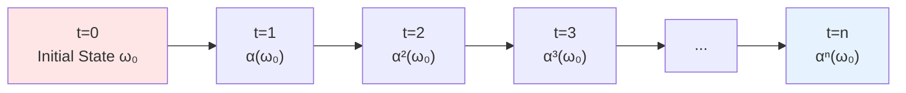

# 04. Detailed Explanation of Dynamical Parameters: Source Code of Physical Laws

## Introduction: From Static Structure to Dynamic Evolution

In Article 03, we established universe's "spatial skeleton"—lattice set $\Lambda$ and cell Hilbert space $\mathcal{H}_{\text{cell}}$. But this is only static "stage".

**Key Question**: How does universe evolve? How does time advance? How do physical laws operate?

Answer lies in **dynamical parameter** $\Theta_{\text{dyn}}$.

### Popular Analogy: From Architectural Blueprint to Construction Rules

Continuing our building analogy:

**Article 03 (Structural Parameters)**:
- Architectural blueprint: How many floors? How large each floor?
- This is **static** information—describes "what house looks like"

**Article 04 (Dynamical Parameters)**:
- Construction rules: How to lay bricks? How to pour concrete?
- This is **dynamic** information—describes "how house is built"

**Universe's Situation**:
- $\Theta_{\text{str}}$: "What universe looks like" (spatial structure)
- $\Theta_{\text{dyn}}$: "How universe operates" (temporal evolution)

| Building Analogy | Universe QCA | Mathematical Object |
|-----------------|--------------|-------------------|
| Construction manual | Dynamical parameter $\Theta_{\text{dyn}}$ | Parameter bit string |
| Construction tools | Local unitary gates $\mathcal{G} = \{G_1, \ldots, G_K\}$ | Set of unitary operators |
| Construction steps | Quantum circuit $U = U_D \cdots U_2 U_1$ | Finite depth circuit |
| Construction result | Time evolution $\alpha_{\Theta}$ | QCA automorphism |
| Physical laws | Effective Hamiltonian $H_{\text{eff}}$ | Continuous limit |

This article will explain in detail how to encode entire universe's time evolution from finite bit string $\Theta_{\text{dyn}}$.

## Part I: QCA Automorphism and Time Evolution

### What Is Time Evolution?

**Classical Mechanics**:
- Initial state: $(x_0, p_0)$
- Hamiltonian: $H(x, p)$
- Time evolution: $\dot{x} = \partial H / \partial p$, $\dot{p} = -\partial H / \partial x$
- Result: Trajectory $(x(t), p(t))$

**Quantum Mechanics**:
- Initial state: $|\psi_0\rangle$
- Hamiltonian: $\hat{H}$
- Time evolution: $|\psi(t)\rangle = e^{-i\hat{H}t/\hbar} |\psi_0\rangle$
- Result: Unitary evolution of quantum state over time

**Quantum Cellular Automaton** (QCA):
- Initial state: $\omega_0$ (state functional)
- Evolution operator: $U$ (unitary operator)
- Time evolution: $\omega_n(A) = \omega_0(U^{\dagger n} A U^n)$
- Result: Unitary automorphism at discrete time steps

### Definition of QCA Automorphism

**Definition 4.1** (QCA Time Evolution):

Given global Hilbert space $\mathcal{H}_{\Lambda} = \bigotimes_{x \in \Lambda} \mathcal{H}_x$ and quasi-local algebra $\mathcal{A}(\Lambda)$, one time step of QCA is realized by unitary operator $U: \mathcal{H}_{\Lambda} \to \mathcal{H}_{\Lambda}$:

$$
\alpha(A) = U^\dagger A U, \quad A \in \mathcal{A}(\Lambda)
$$

**Properties**:
1. **Unitarity**: $U^\dagger U = U U^\dagger = \mathbb{1}$ (reversible)
2. **Locality**: $U$ can be represented as product of finite depth local gates
3. **Causality**: Information propagates at finite speed (Lieb-Robinson bound)

**Physical Meaning**:
- $\alpha$: Maps observables at time $t$ to observables at time $t+1$
- Analogy: Camera shutter each shot, world "jumps" to next frame

**Popular Analogy**:
- Continuous time (classical/quantum mechanics) = Movie film (infinite frame rate)
- Discrete time (QCA) = Stop-motion animation (finite frame rate)
- $U$: "Transformation rule" from one frame to next

### Task of $\Theta_{\text{dyn}}$

Dynamical parameter $\Theta_{\text{dyn}}$ needs to completely specify unitary operator $U$.

**Challenge**:
- Dimension of $\mathcal{H}_{\Lambda}$: $d_{\text{cell}}^{N_{\text{cell}}} \sim 10^{6 \times 10^{90}}$ (astronomical number)
- Degrees of freedom of unitary operator $U$: $\sim (d_{\text{cell}}^{N_{\text{cell}}})^2$ (double exponential)
- Direct encoding: Need $\sim 10^{180}$ bits (far exceeds $I_{\max}$!)

**Solution**: Exploit **locality**!
- $U$ is not arbitrary unitary operator
- $U$ composed of **finite depth local gate circuits**
- Local gates act on few neighbors (e.g., 2-4 lattice points)
- Total degrees of freedom **exponentially compressed**

## Part II: Finite Gate Set $\mathcal{G}$

### Gate Set: QCA's "Programming Language"

In classical computation, all logical operations can be composed from basic gates (e.g., NAND). In quantum computation, similar "universal gate sets" exist.

**Definition 4.2** (Finite Gate Set):

Fix a finite set of local unitary operators:

$$
\boxed{\mathcal{G} = \{G_1, G_2, \ldots, G_K\}}
$$

where each $G_k$ satisfies:
1. **Finite dimension**: Acts on finite number of lattice points (within radius $r_0$ neighborhood)
2. **Unitarity**: $G_k^\dagger G_k = \mathbb{1}$
3. **Parameterized**: Matrix elements determined by finite precision angle parameters

**Example 1** (Single Lattice Point Gate):
Acts on single cell $\mathcal{H}_x \cong \mathbb{C}^2$:
- Pauli gates: $X = \begin{pmatrix} 0 & 1 \\ 1 & 0 \end{pmatrix}$, $Y = \begin{pmatrix} 0 & -i \\ i & 0 \end{pmatrix}$, $Z = \begin{pmatrix} 1 & 0 \\ 0 & -1 \end{pmatrix}$
- Hadamard gate: $H = \frac{1}{\sqrt{2}} \begin{pmatrix} 1 & 1 \\ 1 & -1 \end{pmatrix}$
- Rotation gate: $R_y(\theta) = \exp(-i\theta \sigma_y / 2) = \begin{pmatrix} \cos(\theta/2) & -\sin(\theta/2) \\ \sin(\theta/2) & \cos(\theta/2) \end{pmatrix}$

**Example 2** (Two Lattice Point Gate):
Acts on two adjacent cells $\mathcal{H}_x \otimes \mathcal{H}_{x+1} \cong \mathbb{C}^2 \otimes \mathbb{C}^2$:
- CNOT gate: $\text{CNOT} = \begin{pmatrix} 1 & 0 & 0 & 0 \\ 0 & 1 & 0 & 0 \\ 0 & 0 & 0 & 1 \\ 0 & 0 & 1 & 0 \end{pmatrix}$
- SWAP gate: $\text{SWAP} = \begin{pmatrix} 1 & 0 & 0 & 0 \\ 0 & 0 & 1 & 0 \\ 0 & 1 & 0 & 0 \\ 0 & 0 & 0 & 1 \end{pmatrix}$
- Controlled rotation: $CR_y(\theta) = |\uparrow\rangle\langle\uparrow| \otimes \mathbb{1} + |\downarrow\rangle\langle\downarrow| \otimes R_y(\theta)$

**Example 3** (Dirac-QCA Gate Set):
- **Coin gate**: $C(\theta) = \exp(-i\theta \sigma_y)$ acts on spin degree of freedom
- **Shift gate**: $S = \sum_{x, s} |x+s, s\rangle\langle x, s|$ (spin-dependent translation)
- Parameter: Angle $\theta \in [0, 2\pi)$ (needs discretization)

### Gate Set Size and Universality

**Theorem 4.3** (Universal Quantum Gate Set):

Exists finite gate set $\mathcal{G}$ such that any unitary operator can be **arbitrarily approximated** as finite depth combination of gates in $\mathcal{G}$.

**Classical Result** (Solovay-Kitaev Theorem):
- Gate set $\{H, T, \text{CNOT}\}$ is universal on $\mathbb{C}^2$
- $H = \text{Hadamard}$, $T = \begin{pmatrix} 1 & 0 \\ 0 & e^{i\pi/4} \end{pmatrix}$
- Approximation precision $\epsilon$, need depth $D \sim \log^c(1/\epsilon)$ (polylogarithmic growth)

**Physical Meaning**:
- Don't need infinite variety of gates
- Finite gate set $\mathcal{G}$ (e.g., $K=10$) sufficient to express all physics
- Analogy: 10 basic notes can combine into all symphonies

**Encoding Overhead**:
- Gate set can be **pre-agreed** (e.g., choose "Standard Model QCA gate set")
- Or encode in $\Theta_{\text{str}}$ (additional $\sim 50$ bits)
- Usually: Agree on fixed gate set, save encoding

### Bit Encoding of Gate Set

If gate set has $K$ gates, selecting a gate needs:

$$
\log_2 K \text{ bits}
$$

**Example**:
- $K=16$: Need 4 bits
- $K=256$: Need 8 bits

## Part III: Construction of Quantum Circuits

### Finite Depth Circuits

**Definition 4.4** (Quantum Circuit):

Global unitary operator $U$ composed of $D$ layers of local gates:

$$
\boxed{U = U_D U_{D-1} \cdots U_2 U_1}
$$

where each layer $U_\ell$ is parallel application of several local gates $G_k$:

$$
U_\ell = \prod_{j} G_{k_{\ell,j}}^{(R_{\ell,j})}
$$

- $k_{\ell,j}$: Type of $j$-th gate in layer $\ell$ (selected from $\mathcal{G}$)
- $R_{\ell,j} \subset \Lambda$: Action region of this gate

**Key Constraints**:
- **Finite depth**: $D < \infty$ (usually $D \sim 10$-$10^3$)
- **Locality**: Gates in same layer act on disjoint regions (can parallelize)
- **Finite radius**: Each gate acts within radius $r_0$ neighborhood

**Popular Analogy**:
Imagine factory assembly line:
- Each layer $U_\ell$: One workstation on assembly line
- Each gate $G_k$: One operation at workstation (e.g., "tighten screw", "weld")
- Depth $D$: How many workstations on assembly line
- Product passes through $D$ workstations to complete assembly = Universe passes one time step

### Encoding Circuit Depth

**Encoded Content**:

1. **Depth** $D$:
   - Use $\lceil \log_2 D_{\max} \rceil$ bits
   - If $D \leq 1024$, need 10 bits

2. **Gate Configuration for Each Layer** (for $\ell = 1, \ldots, D$):
   - Gate type $k_{\ell,j}$: $\log_2 K$ bits/gate
   - Action region $R_{\ell,j}$: Depends on symmetry

**Translation-Invariant Case** (greatly simplified):

If gate configuration of each layer is **translation-invariant** (all odd/even lattice points apply same gate):
- Only need to specify: Gate type + odd/even
- Encoding per layer: $\log_2 K + 1$ bits

**General Case** (non-translation-invariant):

Need to specify position of each gate:
- Lattice point coordinates: $\sim d \log_2 L$ bits/gate
- $n_{\text{gates}}$ gates: $\sim n_{\text{gates}} \times d \log_2 L$ bits

**Power of Symmetry Compression**:

| Case | Bits Per Layer | Total Bits for $D=100$ |
|------|---------------|----------------------|
| Completely arbitrary | $\sim 10^{90}$ | $10^{92}$ (exceeds $I_{\max}$!) |
| Translation-invariant | $\sim 10$ | $10^3$ |

**Conclusion**: Translation symmetry is **necessary**, otherwise parameter explosion!

## Part IV: Discrete Angle Parameters

### Problem of Continuous Parameters

Many physical gates contain continuous parameters:

$$
R_y(\theta) = \exp(-i\theta \sigma_y)
$$

where $\theta \in [0, 2\pi)$ is a **real number**.

**Problem**:
- Real number $\theta$ needs **infinite bits** for exact encoding (e.g., $\pi = 3.14159\ldots$)
- Contradicts finite information axiom!

**Solution**: Discretize angle parameters.

### Discretization Scheme

**Definition 4.5** (Discrete Angle):

Restrict angles to rational numbers:

$$
\boxed{\theta = \frac{2\pi n}{2^m}}
$$

where:
- $n \in \{0, 1, \ldots, 2^m - 1\}$: Discrete label
- $m \in \mathbb{N}$: Precision bit number

**Example** ($m=3$):
- Available angles: $\frac{2\pi \times 0}{8}, \frac{2\pi \times 1}{8}, \ldots, \frac{2\pi \times 7}{8}$
- That is: $0, \frac{\pi}{4}, \frac{\pi}{2}, \frac{3\pi}{4}, \pi, \frac{5\pi}{4}, \frac{3\pi}{2}, \frac{7\pi}{4}$
- Total 8 discrete values

**Encoding**:
- Only need to store integer $n$ (needs $m$ bits)
- Example: $n=5$ (binary: 101) represents $\theta = 5\pi/4$

**Precision Analysis**:

Angle resolution:
$$
\Delta\theta = \frac{2\pi}{2^m}
$$

| Precision Bits $m$ | Number of Angles $2^m$ | Resolution $\Delta\theta$ |
|-------------------|----------------------|-------------------------|
| 8 | 256 | $\sim 1.4°$ |
| 16 | 65536 | $\sim 0.02°$ |
| 32 | $4 \times 10^9$ | $\sim 10^{-9}$ rad |
| 64 | $2 \times 10^{19}$ | $\sim 10^{-19}$ rad |

**Physical Distinguishability**:

Current most precise atomic clock angular frequency measurement precision $\sim 10^{-18}$, therefore:
- $m=64$: Precision far exceeds current experiments (excessive)
- $m=32$: Sufficient for all foreseeable experiments
- $m=16$: Sufficient for many applications

### Effect of Discrete Angles on Physical Constants

In Dirac-QCA, relation between electron mass and coin angle (from source theory Theorem 3.4):

$$
m_{\text{eff}} c^2 \approx \frac{\theta}{\Delta t}
$$

**Discretization Effect**:

$$
\Delta m_e \sim m_e \frac{\Delta\theta}{\theta} = m_e \frac{2\pi / 2^m}{\theta}
$$

**Numerical Example**:
- Assume $\theta \sim \pi/4$ (typical value)
- $m=16$: $\Delta m_e / m_e \sim 2\pi / (2^{16} \times \pi/4) = 8 / 2^{16} \sim 10^{-4}$
- $m=32$: $\Delta m_e / m_e \sim 10^{-9}$ (comparable to current measurement precision)

**Conclusion**:
- $m=32$ sufficient to match all known physical constant measurement precisions
- $m=64$ excessive for foreseeable future
- **Conservative choice**: $m=50$ (middle value)

## Part V: Lieb-Robinson Bound and Causality

### Information Propagation Speed

Locality of QCA ensures information propagates at finite speed.

**Theorem 4.6** (Lieb-Robinson Bound):

Given finite depth $D$ local unitary circuit $U$, define evolution $\alpha(A) = U^\dagger A U$. If operator $A$ supported on region $X$ ($A \in \mathcal{A}_X$), then for any region $Y$ with distance $d(X, Y) > v_{\text{LR}} D$:

$$
\boxed{\|[\alpha(A), B]\| \leq C e^{-c(d(X,Y) - v_{\text{LR}} D)}}
$$

where $B \in \mathcal{A}_Y$, $v_{\text{LR}}$ is Lieb-Robinson velocity, $C, c$ are constants.

**Physical Meaning**:
- $v_{\text{LR}}$: "Effective speed of light" for information propagation
- After $D$ time steps, information propagates at most distance $\sim v_{\text{LR}} D$
- Beyond this distance, operator commutator decays exponentially (almost no interaction)

**Example** (Nearest-Neighbor Gates):
- Each layer gate only acts on nearest neighbors → $v_{\text{LR}} = 1$ lattice point/step
- Depth $D=10$ → Information propagates $\sim 10$ lattice points
- Regions at distance $> 10$ almost unaffected

**Popular Analogy**:
- Imagine throwing stone into pond
- Ripples propagate outward (information transfer)
- Wave speed finite ($v_{\text{LR}}$)
- After time $t$, ripple radius $\sim v_{\text{LR}} t$
- Distant frogs haven't felt yet (small commutator)

### Light Cone Structure

**Definition 4.7** (QCA Light Cone):

For lattice point $x \in \Lambda$ and time $n$, define:

$$
\mathcal{C}_n(x) = \{y \in \Lambda : d(x, y) \leq v_{\text{LR}} n\}
$$

as **causal cone** (or light cone) of $x$ after $n$ steps.

**Causality Principle**:
- Information at lattice point $x$ at time 0 can only affect lattice points in $\mathcal{C}_n(x)$ at time $n$
- External lattice points $y \notin \mathcal{C}_n(x)$ almost unaffected

**Analogy with Relativity**:

| Relativity | QCA |
|-----------|-----|
| Speed of light $c$ | Lieb-Robinson velocity $v_{\text{LR}}$ |
| Light cone $\{x^2 + y^2 + z^2 \leq c^2 t^2\}$ | Discrete light cone $\mathcal{C}_n(x)$ |
| Causality (information not faster than light) | Lieb-Robinson bound |
| Timelike interval $\Leftrightarrow$ Causally related | $d(x,y) \leq v_{\text{LR}} n$ $\Leftrightarrow$ Operators don't commute |

**Numerical Example** (Universe QCA):
- Lattice spacing $a = \ell_p \sim 10^{-35}\,\text{m}$ (Planck length)
- Time step $\Delta t \sim t_p \sim 10^{-43}\,\text{s}$ (Planck time)
- Lieb-Robinson velocity: $v_{\text{LR}} = a / \Delta t \sim c$ (speed of light!)

This is no coincidence—QCA in continuous limit **automatically recovers relativistic causality**!

## Part VI: Bit Count of Dynamical Parameters

Combining above parts:

$$
\boxed{|\Theta_{\text{dyn}}| = I_{\text{depth}} + D \times (I_{\text{gate}} + I_{\text{region}} + I_{\text{angles}})}
$$

### Decomposition of Terms

**(1) Circuit Depth**:
$$
I_{\text{depth}} = \lceil \log_2 D_{\max} \rceil
$$

**Example**: $D_{\max} = 1024$ → 10 bits

**(2) Gate Type Per Layer** (for each layer $\ell$):
$$
I_{\text{gate}} = \log_2 K
$$

**Example**: $K=16$ → 4 bits/layer

**(3) Action Region** (per layer):

**Translation-Invariant**:
$$
I_{\text{region}} = 1 \text{ bit}
$$
(Specify odd/even lattice points)

**General Case**:
$$
I_{\text{region}} = n_{\text{gates}} \times d \log_2 L
$$
(Coordinates of each gate)

**(4) Angle Parameters** (per layer):

If each layer has $n_{\text{angles}}$ gates needing angle parameters, each with precision $m$ bits:
$$
I_{\text{angles}} = n_{\text{angles}} \times m
$$

**Example**: $n_{\text{angles}}=2$, $m=50$ → 100 bits/layer

### Total (Translation-Invariant Dirac-QCA)

**Parameter Settings**:
- $D=10$ (depth)
- $K=16$ (gate set size)
- Translation-invariant ($I_{\text{region}}=1$)
- 2 angle parameters per layer, $m=50$

**Calculation**:
- $I_{\text{depth}} = 10$ bits
- Per layer: $I_{\text{gate}} + I_{\text{region}} + I_{\text{angles}} = 4 + 1 + 100 = 105$ bits
- Total: $10 + 10 \times 105 = 1060$ bits

$$
\boxed{|\Theta_{\text{dyn}}| \sim 1000 \text{ bits}}
$$

**Key Observation**:
$$
|\Theta_{\text{dyn}}| \sim 10^3 \ll I_{\max} \sim 10^{123}
$$

Dynamical parameter information **negligible**!

## Part VII: From Discrete to Continuous—Continuous Limit Preview

### How Does QCA Lead to Field Equations?

**Core Idea**: In limit of lattice spacing $a \to 0$, time step $\Delta t \to 0$, discrete QCA converges to continuous field theory.

**Dirac-QCA Example** (from source theory Theorem 3.4):

**Discrete QCA**:
- Update operator: $U = S \cdot C(\theta)$
- $C(\theta) = \exp(-i\theta \sigma_y)$ (coin gate)
- $S$: Spin-dependent translation

**Scaling Limit**:
- $a, \Delta t, \theta \to 0$
- $c_{\text{eff}} = a / \Delta t$ fixed (effective speed of light)
- $m_{\text{eff}} = \theta / (\Delta t c_{\text{eff}}^2)$ fixed (effective mass)

**Continuous Limit**:

$$
\boxed{i\partial_t \psi = \left( -i c_{\text{eff}} \sigma_z \partial_x + m_{\text{eff}} c_{\text{eff}}^2 \sigma_y \right) \psi}
$$

This is exactly **one-dimensional Dirac equation**!

**Key Relation** (from source theory):

$$
\boxed{m_{\text{eff}} \approx \frac{\theta}{\Delta t}}
$$

**Physical Meaning**:
- Discrete angle parameter $\theta$ → Continuous field theory mass $m_{\text{eff}}$
- By adjusting angle parameters in $\Theta_{\text{dyn}}$, can **analytically derive** physical constants!

**Example** (Electron Mass):
- Experimental value: $m_e c^2 \approx 0.511\,\text{MeV}$
- If $\Delta t = t_p \sim 10^{-43}\,\text{s}$
- Then $\theta = m_e \Delta t / \hbar \sim 10^{-22}$ (extremely small angle)

This will be detailed in Article 07.

### Gauge Fields and Gravitational Constant

Similarly, gauge coupling constants and gravitational constant can also be derived from $\Theta_{\text{dyn}}$.

**Theorem Preview** (source theory Theorem 3.5):

In QCA with gauge registers, gauge coupling $g(\Theta)$ related to discrete angle combinations in $\Theta_{\text{dyn}}$:

$$
g(\Theta) = f_g(\theta_1, \theta_2, \ldots)
$$

Gravitational constant:

$$
G(\Theta) = \ell_{\text{cell}}^{d-2} / m_{\text{Planck}}^{d-2}(\Theta)
$$

**Philosophical Implication**:
- Physical constants not "arbitrary numbers chosen by God"
- But **mathematical consequences** of finite parameter $\Theta$
- Analogy: $\pi$ not arbitrary number, but geometric consequence of circle

## Part VIII: Connection with Universe Evolution

### One Time Step = One QCA Update

**Universe Evolution Picture**:

**Each Step**:
- Apply unitary operator $U_{\Theta_{\text{dyn}}}$
- State changes: $\omega_n \to \omega_{n+1}$
- Operator changes: $A \to \alpha(A) = U^\dagger A U$

**Nature of Time**:
- Discrete time steps: $n = 0, 1, 2, \ldots$
- Physical time: $t = n \Delta t$
- Continuous limit: $\Delta t \to 0$ → Recover continuous time

**Popular Analogy**:
- Universe like giant "clock"
- Each "tick" (time step) applies $U$ once
- $\Theta_{\text{dyn}}$ is clock's "gear design blueprint"
- 13.7 billion years = $\sim 10^{60}$ "ticks" (in Planck time units)

### Universe's "Program"

**Computational Universe Perspective**:

$$
\text{Universe} = \text{Initial State} + \text{Evolution Rule} + \text{Time}
$$

$$
\mathfrak{U}(t) = \alpha_{\Theta_{\text{dyn}}}^{t/\Delta t} (\omega_0^{\Theta_{\text{ini}}})
$$

**Analogy**:
- Initial state $\omega_0$: Program's "input"
- Evolution $\alpha$: Program's "algorithm" (encoded by $\Theta_{\text{dyn}}$)
- Time $t$: Program's "number of iterations"
- Final state $\mathfrak{U}(t)$: Program's "output"

**Universe is a Quantum Program**:
- Program length: $|\Theta| \sim 2000$ bits (extremely short!)
- Running time: $10^{60}$ steps
- State space: $\dim \mathcal{H} \sim 10^{10^{91}}$ (huge)
- Output: Physical universe we observe

## Summary of Core Points of This Article

### Five Components of Dynamical Parameters

$$
\Theta_{\text{dyn}} = (\mathcal{G}, D, \{k_\ell\}, \{R_\ell\}, \{\theta_{\ell,j}\})
$$

| Component | Physical Meaning | Typical Value | Bit Count |
|-----------|-----------------|---------------|-----------|
| $\mathcal{G}$ | Finite gate set | $K=16$ | Pre-agreed |
| $D$ | Circuit depth | 10 | 10 |
| $k_\ell$ | Gate type per layer | Choose 1 from 16 | 4/layer |
| $R_\ell$ | Action region | Translation-invariant | 1/layer |
| $\theta_{\ell,j}$ | Discrete angle parameters | $m=50$ | 100/layer |
| **Total** | | | **~1000** |

### QCA Automorphism

$$
\alpha(A) = U^\dagger A U, \quad U = U_D \cdots U_1
$$

**Properties**:
- Unitarity (reversible)
- Locality (finite depth)
- Causality (Lieb-Robinson bound)

### Discrete Angle Parameters

$$
\theta = \frac{2\pi n}{2^m}, \quad n \in \{0, \ldots, 2^m-1\}
$$

**Precision**:
- $m=16$: $\sim 10^{-4}$
- $m=32$: $\sim 10^{-9}$
- $m=50$: $\sim 10^{-15}$

### Lieb-Robinson Bound

$$
\|[\alpha(A), B]\| \leq C e^{-c(d - v_{\text{LR}} D)}
$$

**Physical Meaning**: Information propagation speed $v_{\text{LR}}$, similar to speed of light.

### Continuous Limit Preview

$$
\lim_{a, \Delta t \to 0} \text{QCA} \Rightarrow i\partial_t \psi = (-ic\sigma_z \partial_x + m\sigma_y)\psi
$$

**Mass-Angle Parameter Relation**:
$$
m_{\text{eff}} \approx \theta / \Delta t
$$

### Core Insights

1. **Locality compresses information**: $|\Theta_{\text{dyn}}| \sim 10^3 \ll I_{\max}$
2. **Symmetry necessary**: Translation-invariance → Information from $10^{90}$ reduced to $10^3$
3. **Discretization necessary**: Finite information → Angle parameters must be discrete
4. **Causality natural**: Lieb-Robinson bound → Relativistic causality
5. **Physical constants derivable**: $m, g, G$ are all functions of $\Theta$

### Key Terminology

- **QCA Automorphism**: $\alpha(A) = U^\dagger A U$
- **Finite Gate Set**: $\mathcal{G} = \{G_1, \ldots, G_K\}$
- **Finite Depth Circuit**: $U = U_D \cdots U_1$
- **Discrete Angle**: $\theta = 2\pi n / 2^m$
- **Lieb-Robinson Bound**: Upper bound on information propagation speed
- **Lieb-Robinson Velocity**: $v_{\text{LR}}$

---

**Next Article Preview**: **05. Detailed Explanation of Initial State Parameters: Universe's Factory Settings**
- Construction of initial state $\omega_0^{\Theta}$
- State preparation circuit $V_{\Theta_{\text{ini}}}$
- QCA version of Hartle-Hawking no-boundary state
- Initial entanglement structure and Lieb-Robinson bound
- Symmetry constraints on initial state
- Initial entropy and universe "age"

