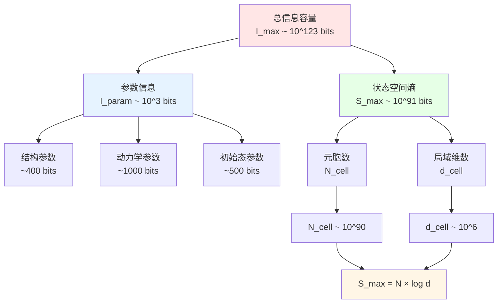
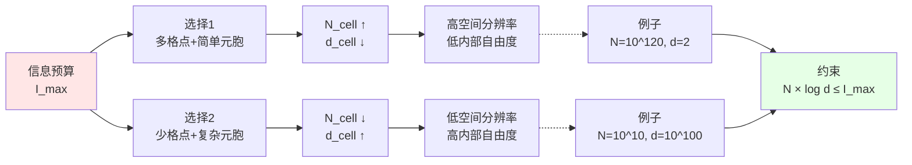

# 06. 信息-熵不等式：宇宙规模的终极约束

## 引言：信息预算的分配问题

在前面的篇章中，我们建立了宇宙的三类参数：
- **第03篇**：$\Theta_{\text{str}}$ ~400 bits（空间结构）
- **第04篇**：$\Theta_{\text{dyn}}$ ~1000 bits（演化规则）
- **第05篇**：$\Theta_{\text{ini}}$ ~500 bits（初始态）

**总参数信息**：$I_{\text{param}} \sim 2000$ bits

但这只是"配方"。真正的宇宙状态空间呢？

**核心问题**：
- 宇宙的Hilbert空间有多大？
- 最大熵是多少？
- 信息容量 $I_{\max}$ 如何分配？

本篇将探讨GLS有限信息理论的**核心定理**：

$$
\boxed{I_{\text{param}}(\Theta) + S_{\max}(\Theta) \leq I_{\max}}
$$

这个不等式揭示了宇宙规模的**终极约束**。

### 通俗比喻：公司的预算分配

想象一个公司的信息化建设：

**总预算**：$I_{\max}$ 元（固定）

**两大开销**：
1. **系统设计**（$I_{\text{param}}$）：
   - 购买软件
   - 编写代码
   - 配置参数
   - 培训员工
   - **类似**：$\Theta$ 的编码成本

2. **数据存储**（$S_{\max}$）：
   - 硬盘容量
   - 数据库规模
   - 备份系统
   - **类似**：宇宙状态空间大小

**预算约束**：
$$
\text{设计成本} + \text{存储成本} \leq \text{总预算}
$$

$$
I_{\text{param}} + S_{\max} \leq I_{\max}
$$

**折衷关系**：
- 系统设计复杂 → 数据存储就得省着点
- 数据存储大 → 系统设计就得简单

| 公司类比 | 宇宙QCA |
|---------|---------|
| 总预算 $I_{\max}$ | 宇宙信息容量 $\sim 10^{123}$ bits |
| 系统设计成本 | 参数信息 $I_{\text{param}} \sim 2000$ bits |
| 数据存储容量 | 状态空间熵 $S_{\max} = N_{\text{cell}} \log_2 d_{\text{cell}}$ |
| 预算约束 | 有限信息不等式 |
| 优化方案 | 对称性压缩、局域性、有限精度 |

本篇将详细解析这个不等式的来源、含义和后果。

## 第一部分：状态空间最大熵 $S_{\max}$

### Hilbert空间的维数

**回顾**（第03篇）：

全局Hilbert空间：
$$
\mathcal{H}_\Lambda = \bigotimes_{x \in \Lambda} \mathcal{H}_x
$$

维数：
$$
\dim \mathcal{H}_\Lambda = \prod_{x \in \Lambda} d_{\text{cell}}(x)
$$

**均匀情况**（所有元胞相同）：
$$
\dim \mathcal{H}_\Lambda = d_{\text{cell}}^{N_{\text{cell}}}
$$

这是一个**指数大**的数！

**例子**（宇宙尺度）：
- $N_{\text{cell}} = 10^{90}$（以普朗克长度为单位的可观测宇宙）
- $d_{\text{cell}} = 10^6$（标准模型自由度）
- $\dim \mathcal{H} = (10^6)^{10^{90}} = 10^{6 \times 10^{90}}$

这是**双重指数**！

### 最大von Neumann熵

**定义6.1**（最大熵）：

假设宇宙态可以是 $\mathcal{H}_\Lambda$ 中的任意纯态，则态空间的"大小"用熵衡量：

$$
\boxed{S_{\max}(\Theta) = \log_2 \dim \mathcal{H}_\Lambda}
$$

（以比特为单位）

**均匀情况**：
$$
S_{\max} = \log_2 (d_{\text{cell}}^{N_{\text{cell}}}) = N_{\text{cell}} \log_2 d_{\text{cell}}
$$

**物理意义**：
- $S_{\max}$：存储一个量子态需要多少比特信息
- 类比：硬盘容量（最多能存多少数据）

**数值例子**：
- $N_{\text{cell}} = 10^{90}$
- $d_{\text{cell}} = 10^6$
- $\log_2 d_{\text{cell}} = \log_2(10^6) \approx 20$
- $S_{\max} = 10^{90} \times 20 = 2 \times 10^{91}$ bits

**关键观察**：
$$
S_{\max} \sim 10^{91} \gg I_{\text{param}} \sim 10^3
$$

状态空间熵**主导**总信息！

### 为什么用熵而非Hilbert维数？

**原因1**（对数压缩）：

- Hilbert维数：$D = d_{\text{cell}}^{N_{\text{cell}}}$（双重指数）
- 熵：$S = \log_2 D = N_{\text{cell}} \log_2 d_{\text{cell}}$（线性）

熵使数字可处理。

**原因2**（信息论解释）：

- 存储维数为 $D$ 的量子态，需要 $\log_2 D$ 比特
- 熵 $S = \log_2 D$ 直接给出信息量

**原因3**（与热力学熵的联系）：

- von Neumann熵：$S = -\text{tr}(\rho \log \rho)$
- 最大熵态（均匀混态）：$\rho = \mathbb{1}/D$
- 则 $S = \log D$

## 第二部分：有限信息不等式的推导

### 来源：Bekenstein界的推广

**回顾**（第01篇）：

Bekenstein界：
$$
S \leq \frac{2\pi R E}{\hbar c}
$$

**应用到宇宙**：
- 半径：$R = R_{\text{uni}}$
- 能量：$E = E_{\text{uni}}$
- 熵上界：$S_{\max} \leq \frac{2\pi R_{\text{uni}} E_{\text{uni}}}{\hbar c} =: I_{\max}^{\text{(Bek)}}$

**关键洞察**：
宇宙的状态空间熵受物理定律约束，不能无限大！

### 参数信息的引入

**新问题**：除了状态熵，还需要编码参数 $\Theta$。

**总信息**：
$$
I_{\text{total}} = I_{\text{param}} + I_{\text{state}}
$$

其中：
- $I_{\text{param}}$：编码参数 $\Theta$ 的比特数
- $I_{\text{state}}$：描述量子态的比特数

**最坏情况**（态空间全满）：
$$
I_{\text{state}} = S_{\max} = \log_2 \dim \mathcal{H}_\Lambda
$$

**有限信息公理**：
$$
I_{\text{total}} \leq I_{\max}
$$

因此：

$$
\boxed{I_{\text{param}}(\Theta) + S_{\max}(\Theta) \leq I_{\max}}
$$

**定理6.2**（有限信息不等式）（来自源理论命题3.3）：

设 $\Theta = (\Theta_{\text{str}}, \Theta_{\text{dyn}}, \Theta_{\text{ini}})$ 为宇宙参数，则：

$$
I_{\text{param}}(\Theta) + N_{\text{cell}}(\Theta) \ln d_{\text{cell}}(\Theta) \leq I_{\max}
$$

其中 $\ln$ 转换为 $\log_2$ 需乘以 $1/\ln 2$。

### 不等式的图示

## 第三部分：折衷关系——元胞数与局域维数

### 定理：元胞数上界

**定理6.3**（元胞数上界）（源理论命题3.3第1条）：

$$
\boxed{N_{\text{cell}} \leq \frac{I_{\max} - I_{\text{param}}}{\ln 2}}
$$

**证明**：

从有限信息不等式：
$$
I_{\text{param}} + N_{\text{cell}} \ln d_{\text{cell}} \leq I_{\max}
$$

移项：
$$
N_{\text{cell}} \ln d_{\text{cell}} \leq I_{\max} - I_{\text{param}}
$$

由于 $d_{\text{cell}} \geq 2$（最小），有 $\ln d_{\text{cell}} \geq \ln 2$：
$$
N_{\text{cell}} \ln 2 \leq N_{\text{cell}} \ln d_{\text{cell}} \leq I_{\max} - I_{\text{param}}
$$

因此：
$$
N_{\text{cell}} \leq \frac{I_{\max} - I_{\text{param}}}{\ln 2}
$$

**数值例子**：
- $I_{\max} = 10^{123}$ bits
- $I_{\text{param}} = 2000$ bits（可忽略）
- $N_{\text{cell}} \leq 10^{123} / \ln 2 \approx 1.44 \times 10^{123}$

**物理意义**：
- 宇宙的格点数有**硬上限**
- 上限由信息容量决定（不是任意的）

### 定理：局域维数上界

**定理6.4**（局域Hilbert维数上界）（源理论命题3.3第2条）：

给定元胞数 $N_{\text{cell}}$，局域维数满足：

$$
\boxed{\ln d_{\text{cell}} \leq \frac{I_{\max} - I_{\text{param}}}{N_{\text{cell}}}}
$$

即：

$$
d_{\text{cell}} \leq \exp\left( \frac{I_{\max} - I_{\text{param}}}{N_{\text{cell}}} \right)
$$

**证明**：

从有限信息不等式直接除以 $N_{\text{cell}}$。

**数值例子**：
- $I_{\max} = 10^{123}$ bits
- $N_{\text{cell}} = 10^{90}$
- $\ln d_{\text{cell}} \leq 10^{123} / 10^{90} = 10^{33}$
- $d_{\text{cell}} \leq e^{10^{33}}$（天文数字）

但实际上：
- 标准模型：$d_{\text{cell}} \sim 10^6$
- $\ln d_{\text{cell}} \sim 14$
- 远小于上界 $10^{33}$！

**物理意义**：
- 元胞内部不能无限复杂
- 复杂度与格点数存在折衷

### 折衷关系的可视化

**核心不等式**：
$$
N_{\text{cell}} \times \log_2 d_{\text{cell}} \lesssim I_{\max}
$$

**等价形式**：
$$
\log_2 d_{\text{cell}} \lesssim \frac{I_{\max}}{N_{\text{cell}}}
$$

**图示**：

**通俗比喻**：

想象你有1000元预算买计算机：

**方案A**（多机器）：
- 买1000台树莓派（每台便宜）
- 单机性能弱，但机器多 → 并行计算
- **类似**：$N_{\text{cell}}$ 大，$d_{\text{cell}}$ 小

**方案B**（强机器）：
- 买1台高性能服务器
- 单机性能强，但只有一台
- **类似**：$N_{\text{cell}}$ 小，$d_{\text{cell}}$ 大

**约束**：
$$
\text{机器数} \times \text{单机性能} \lesssim \text{预算}
$$

宇宙选择了**方案A变种**：
- 很多格点（$\sim 10^{90}$）
- 中等复杂度（$d \sim 10^6$）
- 乘积在 $I_{\max}$ 范围内

## 第四部分：对称性、局域性、有限精度的必然性

### 为什么必须有对称性？

**反证法**：

假设宇宙**无对称性**（每个格点的参数独立）。

**参数信息**：
- 每个格点需要指定：Hilbert空间、哈密顿量、初态
- 每个格点约 $\sim 100$ bits
- 总参数：$I_{\text{param}} = N_{\text{cell}} \times 100 \sim 10^{92}$ bits

**状态空间熵**：
- $S_{\max} = N_{\text{cell}} \log_2 d_{\text{cell}} \sim 10^{91}$ bits

**总信息**：
$$
I_{\text{total}} \sim 10^{92} + 10^{91} \sim 10^{92} \text{ bits}
$$

但：
$$
I_{\max} \sim 10^{123} \text{ bits}
$$

看起来没问题？**错！**

问题在于：$N_{\text{cell}} \sim 10^{90}$ 本身就是假设。实际上根据定理6.3：

若 $I_{\text{param}} \sim 10^{92}$，则：
$$
N_{\text{cell}} \leq \frac{I_{\max} - I_{\text{param}}}{\ln 2} \sim \frac{10^{123} - 10^{92}}{\ln 2} \sim 10^{123}
$$

但状态空间：
$$
S_{\max} = N_{\text{cell}} \ln d_{\text{cell}}
$$

若 $N_{\text{cell}} \sim 10^{123}$，$d_{\text{cell}} \sim 10^6$：
$$
S_{\max} \sim 10^{123} \times 20 = 2 \times 10^{124} \text{ bits}
$$

**超出** $I_{\max}$！矛盾！

**结论**：
必须有对称性压缩 $I_{\text{param}}$，才能给状态空间留出足够空间。

### 为什么必须有局域性？

**非局域系统**：

若演化算符 $U$ 作用在**所有**格点上（无局域性）：

- 幺正矩阵维数：$D \times D$，$D = d_{\text{cell}}^{N_{\text{cell}}}$
- 矩阵元数：$D^2 = d_{\text{cell}}^{2N_{\text{cell}}}$
- 编码（实部+虚部）：$\sim 2D^2 \times m$ bits（$m$ 为精度）

**数值**：
- $N_{\text{cell}} = 10^{90}$，$d_{\text{cell}} = 10^6$
- $D = 10^{6 \times 10^{90}}$
- $D^2 = 10^{12 \times 10^{90}}$

需要 $\sim 10^{12 \times 10^{90}}$ bits → **远超** $I_{\max} \sim 10^{123}$！

**局域性的拯救**：

有限深度局域线路：
- 每个门作用在 $\sim 2$ 个格点
- 深度 $D \sim 10$
- 总门数：$\sim N_{\text{cell}} \times D \sim 10^{91}$
- 每个门：$\sim 100$ bits
- 总编码：$\sim 10^{93}$ bits

若有对称性（平移不变）：
- 降至 $\sim 10^3$ bits

**结论**：
局域性 + 对称性 → 信息量可控。

### 为什么必须离散化？

**连续参数**：

若动力学角参数 $\theta \in [0, 2\pi)$ 是实数：

- 需要无限精度（如 $\pi = 3.1415926\ldots$）
- 每个实数：无限bits
- 总参数信息：$\infty$ bits

**矛盾**：
$$
I_{\text{param}} = \infty \not\leq I_{\max} < \infty
$$

**离散化的拯救**：

$$
\theta = \frac{2\pi n}{2^m}, \quad n \in \{0, \ldots, 2^m-1\}
$$

- 每个角：$m$ bits（有限）
- 精度 $m=50$：$\Delta\theta \sim 10^{-15}$（足够）

**结论**：
有限信息 → 必须离散化。

## 第五部分：宇宙信息预算的实际分配

### 当前宇宙的参数

根据前面几篇的分析：

| 参数类型 | 比特数 | 占比 |
|---------|-------|------|
| $\Theta_{\text{str}}$ | ~400 | 0.02% |
| $\Theta_{\text{dyn}}$ | ~1000 | 0.05% |
| $\Theta_{\text{ini}}$ | ~500 | 0.025% |
| **参数总计** | **~2000** | **0.1%** |
| $S_{\max}$ | ~$2 \times 10^{91}$ | 99.9% |
| **总计** | ~$2 \times 10^{91}$ | 100% |

**关键观察**：
- 参数信息：微不足道（$< 0.1\%$）
- 状态空间：主导（$> 99.9\%$）

**通俗比喻**：
- 宇宙像一本巨著（$10^{91}$ 页）
- 书名、作者、目录（参数）：只占1页
- 正文内容（状态）：剩下的所有页

### 与 $I_{\max}$ 的比较

$$
I_{\text{total}} = I_{\text{param}} + S_{\max} \sim 2 \times 10^{91} \text{ bits}
$$

$$
I_{\max} \sim 10^{123} \text{ bits}
$$

**冗余度**：
$$
\frac{I_{\max}}{I_{\text{total}}} \sim \frac{10^{123}}{10^{91}} = 10^{32}
$$

宇宙只用了约 $10^{-32}$ 的信息容量！

**可能的解释**：

1. **保守估计**：$I_{\max}$ 的计算（Bekenstein界）可能过于粗糙

2. **未来增长**：宇宙仍在演化，熵可能增长（但受幺正性约束）

3. **多宇宙**：$I_{\max}$ 是所有可能宇宙的容量，我们只是一个

4. **维度之谜**：额外维度或隐藏自由度未计入

### 如果改变参数会怎样？

**实验1**：增加格点数 $N_{\text{cell}}$

若 $N_{\text{cell}} \to 10 N_{\text{cell}}$：
- $S_{\max} \to 10 S_{\max}$
- 仍远小于 $I_{\max}$
- **可行**

**实验2**：增加元胞维数 $d_{\text{cell}}$

若 $d_{\text{cell}} \to d_{\text{cell}}^{10}$：
- $S_{\max} = N_{\text{cell}} \log_2 d_{\text{cell}}^{10} = 10 N_{\text{cell}} \log_2 d_{\text{cell}}$
- 也增加10倍
- **可行**

**实验3**：两者同时增加

若 $N_{\text{cell}} \to 10^{16} N_{\text{cell}}$，$d_{\text{cell}} \to 10^{16} d_{\text{cell}}$：
- $S_{\max} \to 10^{16} \times 10^{16} \times S_{\max} / (N_{\text{cell}} \log d_{\text{cell}})$
- $\sim 10^{32} \times S_{\max} \sim 10^{123}$
- 接近 $I_{\max}$！

**结论**：
可以**指数增加**格点或维数，但**乘积**受 $I_{\max}$ 约束。

## 第六部分：对物理理论的约束

### 约束1：场论的自由度

**标准模型**：
- 费米子：$3 \times 2 \times 2 \times 3 = 36$（代、自旋、粒子/反粒子、色）
- 玻色子：$8 + 3 + 1 = 12$（胶子、弱玻色子、光子）
- 总自由度：$\sim 100$

**弦论/超对称**：
- 可能增加到 $\sim 10^3 - 10^6$

**约束**：
$$
d_{\text{cell}} \lesssim \exp\left( \frac{I_{\max}}{N_{\text{cell}}} \right)
$$

若 $N_{\text{cell}} \sim 10^{90}$，$I_{\max} \sim 10^{123}$：
$$
d_{\text{cell}} \lesssim e^{10^{33}}
$$

**结论**：
标准模型、弦论的自由度都远低于上界，**允许**。

### 约束2：额外维度

**Kaluza-Klein / 弦论**：
提出额外紧致维度（如6维Calabi-Yau流形）。

**影响**：
- 每个格点不是 $\mathbb{C}^{d_{\text{cell}}}$，而是更大空间
- 或：格点数增加（因为额外维度）

**例子**：
- 3+1维 → 9+1维（弦论）
- 额外6维紧致化，尺度 $R_{\text{compact}}$
- 若 $R_{\text{compact}} \sim \ell_p$（普朗克尺度）
- 额外格点数：$\sim (R_{\text{uni}} / \ell_p)^6 \sim 10^{366}$

**检查约束**：
$$
N_{\text{total}} = N_{\text{3D}} \times N_{\text{6D}} \sim 10^{90} \times 10^{366} = 10^{456}
$$

$$
S_{\max} = N_{\text{total}} \log_2 d_{\text{cell}} \sim 10^{456} \times 20 = 2 \times 10^{457}
$$

**远超** $I_{\max} \sim 10^{123}$！

**矛盾**！

**解决方案**：
1. 额外维度必须**极小**（$R \ll \ell_p$，难以想象）
2. 或额外维度不是"真实"格点（涌现、有效理论）
3. 或我们的 $I_{\max}$ 估计过于保守

**结论**：
有限信息约束对额外维度理论施加了**严格限制**。

### 约束3：暴涨理论

**暴涨宇宙学**：
早期宇宙指数膨胀，$N_{\text{cell}}$ 快速增长。

**问题**：
初始（暴涨前）：$N_{\text{cell}} \sim 10^3$
最终（暴涨后）：$N_{\text{cell}} \sim 10^{90}$

增长因子：$\sim 10^{87}$

**状态空间熵变化**：
$$
\Delta S_{\max} = \Delta N_{\text{cell}} \times \log_2 d_{\text{cell}} \sim 10^{87} \times 20 = 2 \times 10^{88}
$$

**来源**：
- 幺正演化：$S$ 守恒
- 但 $S_{\max}$ 是Hilbert空间大小，可以增长

**解释**：
- 暴涨创造了新的"空间格点"
- 这些格点最初处在低熵态（真空）
- 之后才逐渐填充（纠缠增长）

**约束检查**：
$$
S_{\max}^{\text{final}} \sim 2 \times 10^{91} < I_{\max} \sim 10^{123}
$$

**允许**！

## 本篇核心要点总结

### 有限信息不等式

$$
\boxed{I_{\text{param}}(\Theta) + S_{\max}(\Theta) \leq I_{\max}}
$$

其中：
- $I_{\text{param}} = |\Theta_{\text{str}}| + |\Theta_{\text{dyn}}| + |\Theta_{\text{ini}}|$
- $S_{\max} = N_{\text{cell}} \log_2 d_{\text{cell}}$
- $I_{\max} \sim 10^{123}$ bits（Bekenstein界）

### 元胞数上界定理

$$
\boxed{N_{\text{cell}} \leq \frac{I_{\max} - I_{\text{param}}}{\ln 2}}
$$

### 局域维数上界定理

$$
\boxed{\ln d_{\text{cell}} \leq \frac{I_{\max} - I_{\text{param}}}{N_{\text{cell}}}}
$$

### 折衷关系

$$
\boxed{N_{\text{cell}} \times \log_2 d_{\text{cell}} \lesssim I_{\max}}
$$

**物理意义**：
- 多格点 ↔ 简单元胞
- 少格点 ↔ 复杂元胞
- 乘积受限

### 三大必然性

| 必然性 | 原因 | 后果 |
|--------|------|------|
| 对称性 | $I_{\text{param}}$ 不能爆炸 | 平移不变、规范不变 |
| 局域性 | 编码演化算符 | 有限深度线路、Lieb-Robinson界 |
| 离散化 | 连续参数需无限bits | 角度 $= 2\pi n/2^m$ |

### 信息预算分配

| 项目 | 比特数 | 占比 |
|------|--------|------|
| 参数 | $10^3$ | 0.0001% |
| 状态 | $10^{91}$ | 99.9999% |
| **总计** | $\sim 10^{91}$ | 100% |
| 容量上界 | $10^{123}$ | 冗余 $10^{32}$ |

### 对物理理论的约束

1. **标准模型**：$d_{\text{cell}} \sim 10^2$ ✅ 允许
2. **弦论/超对称**：$d_{\text{cell}} \sim 10^6$ ✅ 允许
3. **大额外维度**：$N_{\text{cell}} \sim 10^{456}$ ❌ 禁止（除非 $R \ll \ell_p$）
4. **暴涨宇宙**：$\Delta S \sim 10^{88}$ ✅ 允许

### 核心洞察

1. **状态空间主导信息**：$S_{\max} \gg I_{\text{param}}$
2. **宇宙远未饱和**：$I_{\text{total}} \ll I_{\max}$
3. **对称性是必然**：否则参数信息爆炸
4. **局域性是必然**：否则演化算符编码爆炸
5. **离散化是必然**：否则连续参数需无限bits
6. **约束物理理论**：额外维度、弦论受限

---

**下一篇预告**：**07. 连续极限与物理常数导出**
- 从离散QCA到连续场论的严格证明
- Dirac方程的导出
- 质量-角参数关系 $m \approx \theta/\Delta t$ 的推导
- 规范耦合常数、引力常数的参数化表达式
- 所有物理常数都是 $\Theta$ 的函数！
