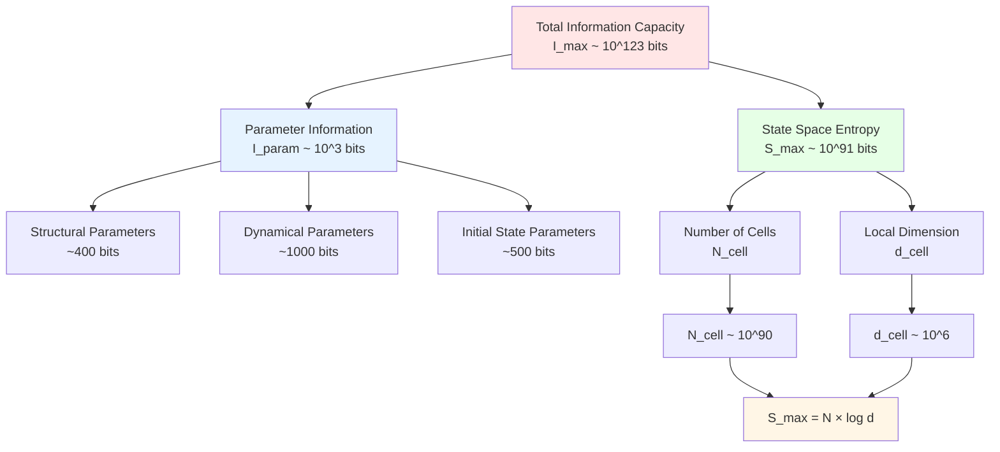
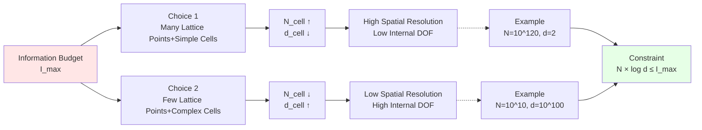

# 06. Information-Entropy Inequality: Ultimate Constraint on Universe Scale

## Introduction: Information Budget Allocation Problem

In previous articles, we established universe's three types of parameters:
- **Article 03**: $\Theta_{\text{str}}$ ~400 bits (spatial structure)
- **Article 04**: $\Theta_{\text{dyn}}$ ~1000 bits (evolution rules)
- **Article 05**: $\Theta_{\text{ini}}$ ~500 bits (initial state)

**Total Parameter Information**: $I_{\text{param}} \sim 2000$ bits

But this is only the "recipe". What about actual universe state space?

**Core Questions**:
- How large is universe's Hilbert space?
- What is maximum entropy?
- How is information capacity $I_{\max}$ allocated?

This article explores **core theorem** of GLS finite information theory:

$$
\boxed{I_{\text{param}}(\Theta) + S_{\max}(\Theta) \leq I_{\max}}
$$

This inequality reveals **ultimate constraint** on universe scale.

### Popular Analogy: Company Budget Allocation

Imagine a company's information technology construction:

**Total Budget**: $I_{\max}$ yuan (fixed)

**Two Major Expenses**:
1. **System Design** ($I_{\text{param}}$):
   - Purchase software
   - Write code
   - Configure parameters
   - Train employees
   - **Similar**: Encoding cost of $\Theta$

2. **Data Storage** ($S_{\max}$):
   - Hard drive capacity
   - Database scale
   - Backup systems
   - **Similar**: Universe state space size

**Budget Constraint**:
$$
\text{Design Cost} + \text{Storage Cost} \leq \text{Total Budget}
$$

$$
I_{\text{param}} + S_{\max} \leq I_{\max}
$$

**Trade-off Relation**:
- Complex system design → Must save on data storage
- Large data storage → Must simplify system design

| Company Analogy | Universe QCA |
|----------------|--------------|
| Total budget $I_{\max}$ | Universe information capacity $\sim 10^{123}$ bits |
| System design cost | Parameter information $I_{\text{param}} \sim 2000$ bits |
| Data storage capacity | State space entropy $S_{\max} = N_{\text{cell}} \log_2 d_{\text{cell}}$ |
| Budget constraint | Finite information inequality |
| Optimization scheme | Symmetry compression, locality, finite precision |

This article will analyze in detail the source, meaning, and consequences of this inequality.

## Part I: Maximum Entropy of State Space $S_{\max}$

### Dimension of Hilbert Space

**Review** (Article 03):

Global Hilbert space:
$$
\mathcal{H}_\Lambda = \bigotimes_{x \in \Lambda} \mathcal{H}_x
$$

Dimension:
$$
\dim \mathcal{H}_\Lambda = \prod_{x \in \Lambda} d_{\text{cell}}(x)
$$

**Uniform Case** (all cells identical):
$$
\dim \mathcal{H}_\Lambda = d_{\text{cell}}^{N_{\text{cell}}}
$$

This is an **exponentially large** number!

**Example** (Cosmological Scale):
- $N_{\text{cell}} = 10^{90}$ (Observable universe in Planck length units)
- $d_{\text{cell}} = 10^6$ (Standard Model degrees of freedom)
- $\dim \mathcal{H} = (10^6)^{10^{90}} = 10^{6 \times 10^{90}}$

This is **double exponential**!

### Maximum von Neumann Entropy

**Definition 6.1** (Maximum Entropy):

Assuming universe state can be any pure state in $\mathcal{H}_\Lambda$, "size" of state space measured by entropy:

$$
\boxed{S_{\max}(\Theta) = \log_2 \dim \mathcal{H}_\Lambda}
$$

(in bits)

**Uniform Case**:
$$
S_{\max} = \log_2 (d_{\text{cell}}^{N_{\text{cell}}}) = N_{\text{cell}} \log_2 d_{\text{cell}}
$$

**Physical Meaning**:
- $S_{\max}$: How many bits of information needed to store a quantum state
- Analogy: Hard drive capacity (maximum data that can be stored)

**Numerical Example**:
- $N_{\text{cell}} = 10^{90}$
- $d_{\text{cell}} = 10^6$
- $\log_2 d_{\text{cell}} = \log_2(10^6) \approx 20$
- $S_{\max} = 10^{90} \times 20 = 2 \times 10^{91}$ bits

**Key Observation**:
$$
S_{\max} \sim 10^{91} \gg I_{\text{param}} \sim 10^3
$$

State space entropy **dominates** total information!

### Why Use Entropy Instead of Hilbert Dimension?

**Reason 1** (Logarithmic Compression):

- Hilbert dimension: $D = d_{\text{cell}}^{N_{\text{cell}}}$ (double exponential)
- Entropy: $S = \log_2 D = N_{\text{cell}} \log_2 d_{\text{cell}}$ (linear)

Entropy makes numbers manageable.

**Reason 2** (Information-Theoretic Interpretation):

- Storing quantum state of dimension $D$ requires $\log_2 D$ bits
- Entropy $S = \log_2 D$ directly gives information content

**Reason 3** (Connection with Thermodynamic Entropy):

- von Neumann entropy: $S = -\text{tr}(\rho \log \rho)$
- Maximum entropy state (uniform mixed state): $\rho = \mathbb{1}/D$
- Then $S = \log D$

## Part II: Derivation of Finite Information Inequality

### Source: Generalization of Bekenstein Bound

**Review** (Article 01):

Bekenstein bound:
$$
S \leq \frac{2\pi R E}{\hbar c}
$$

**Applied to Universe**:
- Radius: $R = R_{\text{uni}}$
- Energy: $E = E_{\text{uni}}$
- Entropy upper bound: $S_{\max} \leq \frac{2\pi R_{\text{uni}} E_{\text{uni}}}{\hbar c} =: I_{\max}^{\text{(Bek)}}$

**Key Insight**:
Universe's state space entropy constrained by physical laws, cannot be infinite!

### Introduction of Parameter Information

**New Problem**: Besides state entropy, need to encode parameters $\Theta$.

**Total Information**:
$$
I_{\text{total}} = I_{\text{param}} + I_{\text{state}}
$$

where:
- $I_{\text{param}}$: Number of bits encoding parameters $\Theta$
- $I_{\text{state}}$: Number of bits describing quantum state

**Worst Case** (state space fully filled):
$$
I_{\text{state}} = S_{\max} = \log_2 \dim \mathcal{H}_\Lambda
$$

**Finite Information Axiom**:
$$
I_{\text{total}} \leq I_{\max}
$$

Therefore:

$$
\boxed{I_{\text{param}}(\Theta) + S_{\max}(\Theta) \leq I_{\max}}
$$

**Theorem 6.2** (Finite Information Inequality) (from source theory Proposition 3.3):

Let $\Theta = (\Theta_{\text{str}}, \Theta_{\text{dyn}}, \Theta_{\text{ini}})$ be universe parameters, then:

$$
I_{\text{param}}(\Theta) + N_{\text{cell}}(\Theta) \ln d_{\text{cell}}(\Theta) \leq I_{\max}
$$

where $\ln$ converted to $\log_2$ requires multiplying by $1/\ln 2$.

### Diagram of Inequality

## Part III: Trade-off Relation—Number of Cells and Local Dimension

### Theorem: Upper Bound on Number of Cells

**Theorem 6.3** (Upper Bound on Number of Cells) (Source theory Proposition 3.3, Item 1):

$$
\boxed{N_{\text{cell}} \leq \frac{I_{\max} - I_{\text{param}}}{\ln 2}}
$$

**Proof**:

From finite information inequality:
$$
I_{\text{param}} + N_{\text{cell}} \ln d_{\text{cell}} \leq I_{\max}
$$

Rearranging:
$$
N_{\text{cell}} \ln d_{\text{cell}} \leq I_{\max} - I_{\text{param}}
$$

Since $d_{\text{cell}} \geq 2$ (minimum), have $\ln d_{\text{cell}} \geq \ln 2$:
$$
N_{\text{cell}} \ln 2 \leq N_{\text{cell}} \ln d_{\text{cell}} \leq I_{\max} - I_{\text{param}}
$$

Therefore:
$$
N_{\text{cell}} \leq \frac{I_{\max} - I_{\text{param}}}{\ln 2}
$$

**Numerical Example**:
- $I_{\max} = 10^{123}$ bits
- $I_{\text{param}} = 2000$ bits (negligible)
- $N_{\text{cell}} \leq 10^{123} / \ln 2 \approx 1.44 \times 10^{123}$

**Physical Meaning**:
- Universe's number of lattice points has **hard upper bound**
- Bound determined by information capacity (not arbitrary)

### Theorem: Upper Bound on Local Dimension

**Theorem 6.4** (Upper Bound on Local Hilbert Dimension) (Source theory Proposition 3.3, Item 2):

Given number of cells $N_{\text{cell}}$, local dimension satisfies:

$$
\boxed{\ln d_{\text{cell}} \leq \frac{I_{\max} - I_{\text{param}}}{N_{\text{cell}}}}
$$

That is:

$$
d_{\text{cell}} \leq \exp\left( \frac{I_{\max} - I_{\text{param}}}{N_{\text{cell}}} \right)
$$

**Proof**:

Directly divide finite information inequality by $N_{\text{cell}}$.

**Numerical Example**:
- $I_{\max} = 10^{123}$ bits
- $N_{\text{cell}} = 10^{90}$
- $\ln d_{\text{cell}} \leq 10^{123} / 10^{90} = 10^{33}$
- $d_{\text{cell}} \leq e^{10^{33}}$ (astronomical number)

But actually:
- Standard Model: $d_{\text{cell}} \sim 10^6$
- $\ln d_{\text{cell}} \sim 14$
- Far less than upper bound $10^{33}$!

**Physical Meaning**:
- Cell interior cannot be infinitely complex
- Complexity and number of lattice points have trade-off

### Visualization of Trade-off Relation

**Core Inequality**:
$$
N_{\text{cell}} \times \log_2 d_{\text{cell}} \lesssim I_{\max}
$$

**Equivalent Form**:
$$
\log_2 d_{\text{cell}} \lesssim \frac{I_{\max}}{N_{\text{cell}}}
$$

**Diagram**:

**Popular Analogy**:

Imagine you have 1000 yuan budget to buy computers:

**Plan A** (Many Machines):
- Buy 1000 Raspberry Pis (each cheap)
- Single machine weak, but many machines → Parallel computation
- **Similar**: $N_{\text{cell}}$ large, $d_{\text{cell}}$ small

**Plan B** (Strong Machine):
- Buy 1 high-performance server
- Single machine strong, but only one
- **Similar**: $N_{\text{cell}}$ small, $d_{\text{cell}}$ large

**Constraint**:
$$
\text{Number of Machines} \times \text{Single Machine Performance} \lesssim \text{Budget}
$$

Universe chose **variant of Plan A**:
- Many lattice points ($\sim 10^{90}$)
- Medium complexity ($d \sim 10^6$)
- Product within $I_{\max}$ range

## Part IV: Necessity of Symmetry, Locality, and Finite Precision

### Why Must Have Symmetry?

**Proof by Contradiction**:

Assume universe has **no symmetry** (parameters at each lattice point independent).

**Parameter Information**:
- Each lattice point needs to specify: Hilbert space, Hamiltonian, initial state
- Each lattice point ~$\sim 100$ bits
- Total parameters: $I_{\text{param}} = N_{\text{cell}} \times 100 \sim 10^{92}$ bits

**State Space Entropy**:
- $S_{\max} = N_{\text{cell}} \log_2 d_{\text{cell}} \sim 10^{91}$ bits

**Total Information**:
$$
I_{\text{total}} \sim 10^{92} + 10^{91} \sim 10^{92} \text{ bits}
$$

But:
$$
I_{\max} \sim 10^{123} \text{ bits}
$$

Looks fine? **Wrong!**

Problem: $N_{\text{cell}} \sim 10^{90}$ itself is an assumption. Actually according to Theorem 6.3:

If $I_{\text{param}} \sim 10^{92}$, then:
$$
N_{\text{cell}} \leq \frac{I_{\max} - I_{\text{param}}}{\ln 2} \sim \frac{10^{123} - 10^{92}}{\ln 2} \sim 10^{123}
$$

But state space:
$$
S_{\max} = N_{\text{cell}} \ln d_{\text{cell}}
$$

If $N_{\text{cell}} \sim 10^{123}$, $d_{\text{cell}} \sim 10^6$:
$$
S_{\max} \sim 10^{123} \times 20 = 2 \times 10^{124} \text{ bits}
$$

**Exceeds** $I_{\max}$! Contradiction!

**Conclusion**:
Must have symmetry compression of $I_{\text{param}}$ to leave enough space for state space.

### Why Must Have Locality?

**Non-Local System**:

If evolution operator $U$ acts on **all** lattice points (no locality):

- Unitary matrix dimension: $D \times D$, $D = d_{\text{cell}}^{N_{\text{cell}}}$
- Number of matrix elements: $D^2 = d_{\text{cell}}^{2N_{\text{cell}}}$
- Encoding (real+imaginary parts): $\sim 2D^2 \times m$ bits ($m$ is precision)

**Numerical Value**:
- $N_{\text{cell}} = 10^{90}$, $d_{\text{cell}} = 10^6$
- $D = 10^{6 \times 10^{90}}$
- $D^2 = 10^{12 \times 10^{90}}$

Need $\sim 10^{12 \times 10^{90}}$ bits → **Far exceeds** $I_{\max} \sim 10^{123}$!

**Salvation by Locality**:

Finite depth local circuit:
- Each gate acts on $\sim 2$ lattice points
- Depth $D \sim 10$
- Total number of gates: $\sim N_{\text{cell}} \times D \sim 10^{91}$
- Each gate: $\sim 100$ bits
- Total encoding: $\sim 10^{93}$ bits

If have symmetry (translation-invariant):
- Reduced to $\sim 10^3$ bits

**Conclusion**:
Locality + Symmetry → Information content controllable.

### Why Must Discretize?

**Continuous Parameters**:

If dynamical angle parameter $\theta \in [0, 2\pi)$ is real number:

- Need infinite precision (e.g., $\pi = 3.1415926\ldots$)
- Each real number: Infinite bits
- Total parameter information: $\infty$ bits

**Contradiction**:
$$
I_{\text{param}} = \infty \not\leq I_{\max} < \infty
$$

**Salvation by Discretization**:

$$
\theta = \frac{2\pi n}{2^m}, \quad n \in \{0, \ldots, 2^m-1\}
$$

- Each angle: $m$ bits (finite)
- Precision $m=50$: $\Delta\theta \sim 10^{-15}$ (sufficient)

**Conclusion**:
Finite information → Must discretize.

## Part V: Actual Allocation of Universe Information Budget

### Current Universe Parameters

According to analysis in previous articles:

| Parameter Type | Bit Count | Percentage |
|---------------|-----------|------------|
| $\Theta_{\text{str}}$ | ~400 | 0.02% |
| $\Theta_{\text{dyn}}$ | ~1000 | 0.05% |
| $\Theta_{\text{ini}}$ | ~500 | 0.025% |
| **Parameter Total** | **~2000** | **0.1%** |
| $S_{\max}$ | ~$2 \times 10^{91}$ | 99.9% |
| **Total** | ~$2 \times 10^{91}$ | 100% |

**Key Observation**:
- Parameter information: Negligible ($< 0.1\%$)
- State space: Dominates ($> 99.9\%$)

**Popular Analogy**:
- Universe like a huge book ($10^{91}$ pages)
- Title, author, table of contents (parameters): Only 1 page
- Main content (state): All remaining pages

### Comparison with $I_{\max}$

$$
I_{\text{total}} = I_{\text{param}} + S_{\max} \sim 2 \times 10^{91} \text{ bits}
$$

$$
I_{\max} \sim 10^{123} \text{ bits}
$$

**Redundancy**:
$$
\frac{I_{\max}}{I_{\text{total}}} \sim \frac{10^{123}}{10^{91}} = 10^{32}
$$

Universe only uses about $10^{-32}$ of information capacity!

**Possible Explanations**:

1. **Conservative Estimate**: Calculation of $I_{\max}$ (Bekenstein bound) may be too rough

2. **Future Growth**: Universe still evolving, entropy may grow (but constrained by unitarity)

3. **Multiverse**: $I_{\max}$ is capacity of all possible universes, we are just one

4. **Dimension Mystery**: Extra dimensions or hidden degrees of freedom not counted

### What If Parameters Changed?

**Experiment 1**: Increase number of lattice points $N_{\text{cell}}$

If $N_{\text{cell}} \to 10 N_{\text{cell}}$:
- $S_{\max} \to 10 S_{\max}$
- Still far less than $I_{\max}$
- **Feasible**

**Experiment 2**: Increase cell dimension $d_{\text{cell}}$

If $d_{\text{cell}} \to d_{\text{cell}}^{10}$:
- $S_{\max} = N_{\text{cell}} \log_2 d_{\text{cell}}^{10} = 10 N_{\text{cell}} \log_2 d_{\text{cell}}$
- Also increases 10 times
- **Feasible**

**Experiment 3**: Increase both simultaneously

If $N_{\text{cell}} \to 10^{16} N_{\text{cell}}$, $d_{\text{cell}} \to 10^{16} d_{\text{cell}}$:
- $S_{\max} \to 10^{16} \times 10^{16} \times S_{\max} / (N_{\text{cell}} \log d_{\text{cell}})$
- $\sim 10^{32} \times S_{\max} \sim 10^{123}$
- Approaches $I_{\max}$!

**Conclusion**:
Can **exponentially increase** lattice points or dimension, but **product** constrained by $I_{\max}$.

## Part VI: Constraints on Physical Theories

### Constraint 1: Degrees of Freedom in Field Theory

**Standard Model**:
- Fermions: $3 \times 2 \times 2 \times 3 = 36$ (generations, spin, particle/antiparticle, color)
- Bosons: $8 + 3 + 1 = 12$ (gluons, weak bosons, photon)
- Total degrees of freedom: $\sim 100$

**String Theory/Supersymmetry**:
- May increase to $\sim 10^3 - 10^6$

**Constraint**:
$$
d_{\text{cell}} \lesssim \exp\left( \frac{I_{\max}}{N_{\text{cell}}} \right)
$$

If $N_{\text{cell}} \sim 10^{90}$, $I_{\max} \sim 10^{123}$:
$$
d_{\text{cell}} \lesssim e^{10^{33}}
$$

**Conclusion**:
Standard Model, string theory degrees of freedom all far below upper bound, **allowed**.

### Constraint 2: Extra Dimensions

**Kaluza-Klein/String Theory**:
Proposes extra compact dimensions (e.g., 6-dimensional Calabi-Yau manifolds).

**Impact**:
- Each lattice point not $\mathbb{C}^{d_{\text{cell}}}$, but larger space
- Or: Number of lattice points increases (because of extra dimensions)

**Example**:
- 3+1 dimensions → 9+1 dimensions (string theory)
- Extra 6 dimensions compactified, scale $R_{\text{compact}}$
- If $R_{\text{compact}} \sim \ell_p$ (Planck scale)
- Extra lattice points: $\sim (R_{\text{uni}} / \ell_p)^6 \sim 10^{366}$

**Check Constraint**:
$$
N_{\text{total}} = N_{\text{3D}} \times N_{\text{6D}} \sim 10^{90} \times 10^{366} = 10^{456}
$$

$$
S_{\max} = N_{\text{total}} \log_2 d_{\text{cell}} \sim 10^{456} \times 20 = 2 \times 10^{457}
$$

**Far exceeds** $I_{\max} \sim 10^{123}$!

**Contradiction**!

**Solutions**:
1. Extra dimensions must be **extremely small** ($R \ll \ell_p$, hard to imagine)
2. Or extra dimensions not "real" lattice points (emergent, effective theory)
3. Or our $I_{\max}$ estimate too conservative

**Conclusion**:
Finite information constraint imposes **strict limitations** on extra dimension theories.

### Constraint 3: Inflation Theory

**Inflationary Cosmology**:
Early universe exponentially expands, $N_{\text{cell}}$ rapidly grows.

**Problem**:
Initial (before inflation): $N_{\text{cell}} \sim 10^3$
Final (after inflation): $N_{\text{cell}} \sim 10^{90}$

Growth factor: $\sim 10^{87}$

**State Space Entropy Change**:
$$
\Delta S_{\max} = \Delta N_{\text{cell}} \times \log_2 d_{\text{cell}} \sim 10^{87} \times 20 = 2 \times 10^{88}
$$

**Source**:
- Unitary evolution: $S$ conserved
- But $S_{\max}$ is Hilbert space size, can grow

**Explanation**:
- Inflation creates new "spatial lattice points"
- These lattice points initially in low entropy state (vacuum)
- Later gradually filled (entanglement grows)

**Constraint Check**:
$$
S_{\max}^{\text{final}} \sim 2 \times 10^{91} < I_{\max} \sim 10^{123}
$$

**Allowed**!

## Summary of Core Points of This Article

### Finite Information Inequality

$$
\boxed{I_{\text{param}}(\Theta) + S_{\max}(\Theta) \leq I_{\max}}
$$

where:
- $I_{\text{param}} = |\Theta_{\text{str}}| + |\Theta_{\text{dyn}}| + |\Theta_{\text{ini}}|$
- $S_{\max} = N_{\text{cell}} \log_2 d_{\text{cell}}$
- $I_{\max} \sim 10^{123}$ bits (Bekenstein bound)

### Theorem: Upper Bound on Number of Cells

$$
\boxed{N_{\text{cell}} \leq \frac{I_{\max} - I_{\text{param}}}{\ln 2}}
$$

### Theorem: Upper Bound on Local Dimension

$$
\boxed{\ln d_{\text{cell}} \leq \frac{I_{\max} - I_{\text{param}}}{N_{\text{cell}}}}
$$

### Trade-off Relation

$$
\boxed{N_{\text{cell}} \times \log_2 d_{\text{cell}} \lesssim I_{\max}}
$$

**Physical Meaning**:
- Many lattice points ↔ Simple cells
- Few lattice points ↔ Complex cells
- Product constrained

### Three Necessities

| Necessity | Reason | Consequence |
|-----------|--------|-------------|
| Symmetry | $I_{\text{param}}$ cannot explode | Translation-invariance, gauge-invariance |
| Locality | Encoding evolution operator | Finite depth circuits, Lieb-Robinson bound |
| Discretization | Continuous parameters need infinite bits | Angle $= 2\pi n/2^m$ |

### Information Budget Allocation

| Item | Bit Count | Percentage |
|------|-----------|------------|
| Parameters | $10^3$ | 0.0001% |
| State | $10^{91}$ | 99.9999% |
| **Total** | $\sim 10^{91}$ | 100% |
| Capacity upper bound | $10^{123}$ | Redundancy $10^{32}$ |

### Constraints on Physical Theories

1. **Standard Model**: $d_{\text{cell}} \sim 10^2$ ✅ Allowed
2. **String Theory/Supersymmetry**: $d_{\text{cell}} \sim 10^6$ ✅ Allowed
3. **Large Extra Dimensions**: $N_{\text{cell}} \sim 10^{456}$ ❌ Forbidden (unless $R \ll \ell_p$)
4. **Inflationary Universe**: $\Delta S \sim 10^{88}$ ✅ Allowed

### Core Insights

1. **State space dominates information**: $S_{\max} \gg I_{\text{param}}$
2. **Universe far from saturated**: $I_{\text{total}} \ll I_{\max}$
3. **Symmetry necessary**: Otherwise parameter information explodes
4. **Locality necessary**: Otherwise evolution operator encoding explodes
5. **Discretization necessary**: Otherwise continuous parameters need infinite bits
6. **Constraints physical theories**: Extra dimensions, string theory limited

---

**Next Article Preview**: **07. Continuous Limit and Derivation of Physical Constants**
- Rigorous proof from discrete QCA to continuous field theory
- Derivation of Dirac equation
- Derivation of mass-angle parameter relation $m \approx \theta/\Delta t$
- Parameterized expressions for gauge coupling constants, gravitational constant
- All physical constants are functions of $\Theta$!

