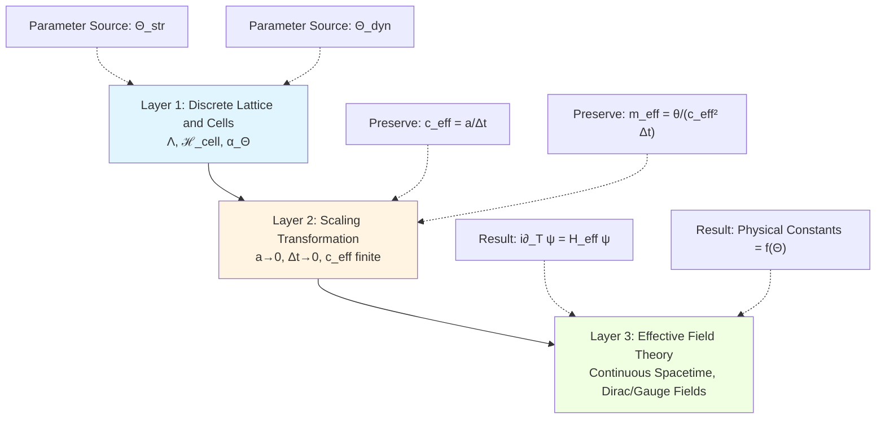
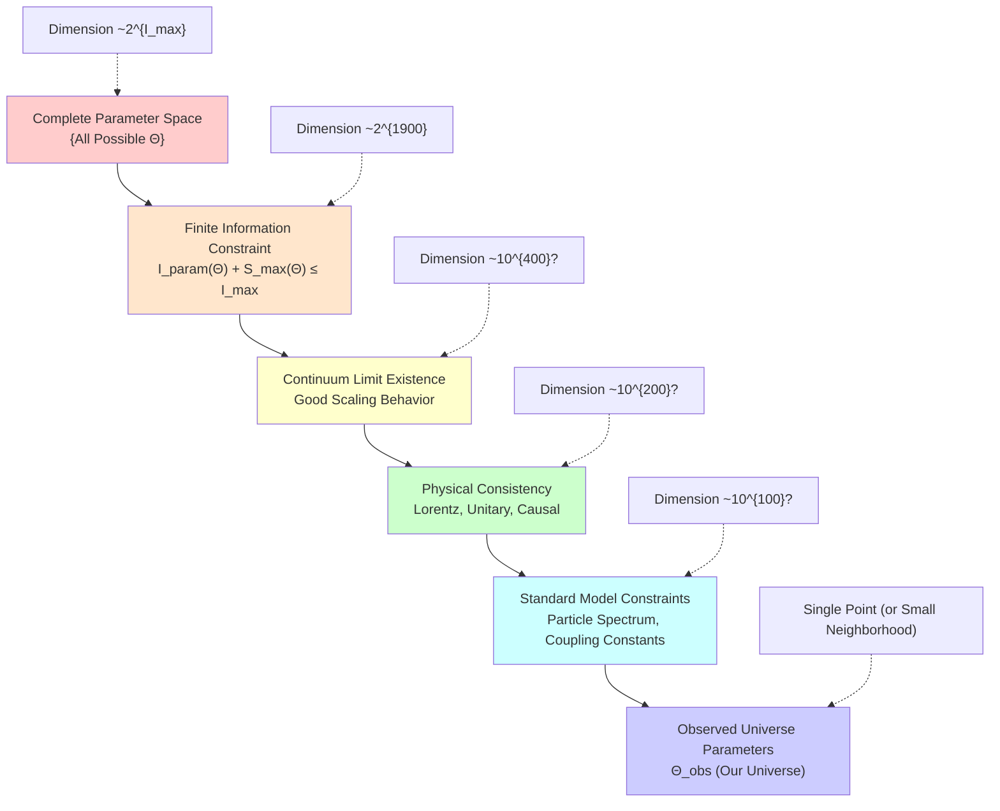
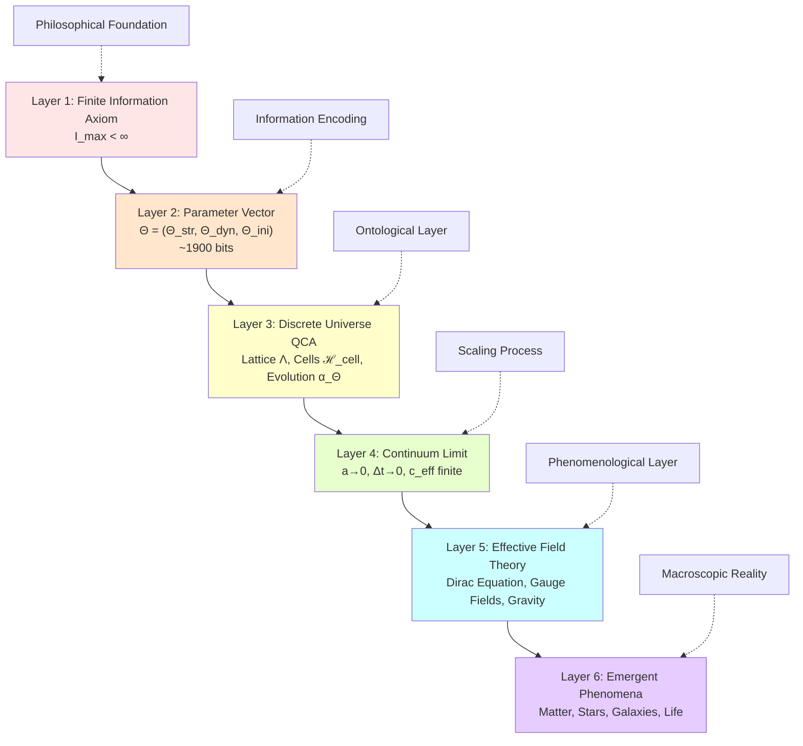
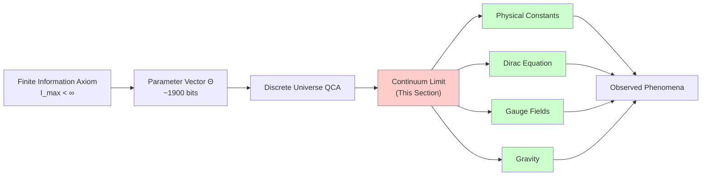

# Section 07: Continuum Limit Derivation—From Discrete Pixels to Continuous Physics

## Introduction: From Mosaic to Oil Painting

Imagine holding a high-resolution digital photo. When you zoom in continuously, you eventually see individual colored pixel squares—this is the discrete nature of the digital world. But when viewed from normal distance, these pixels blend into a continuous smooth image, showing no trace of discreteness.

**This is exactly the universe's secret**:

- **Microscopic Level**: Universe is a "pixel world" composed of discrete QCA cells
- **Macroscopic Level**: What we observe is continuous spacetime, smooth physical fields
- **Connecting Bridge**: **Continuum limit**—scaling process when discrete scales tend to zero

In previous chapters, we already know:

1. Universe completely determined by finite parameters $\Theta = (\Theta_{\text{str}}, \Theta_{\text{dyn}}, \Theta_{\text{ini}})$
2. These parameters only ~1900 bits, encoding entire universe's structure, dynamics, and initial conditions
3. Finite information inequality $I_{\text{param}}(\Theta) + S_{\max}(\Theta) \leq I_{\max}$ constrains universe's scale and complexity

**But a core question remains unanswered**:

> **How do such few discrete parameters produce the continuous physical laws we observe?**
>
> **What exactly is the relationship between physical constants (e.g., electron mass, speed of light, gravitational constant) and parameters $\Theta$?**

This section will answer this question. We will show:

1. **Mathematical Framework of Continuum Limit**: How to transition from discrete QCA to continuous field theory
2. **Derivation of Dirac Equation**: How particle mass emerges from discrete angle parameter $\theta(\Theta)$
3. **Parameter Mapping of Physical Constants**: All physical constants are mathematical functions of $\Theta$
4. **Uniqueness of Universe Design**: Parameters $\Theta$ are not arbitrary, but constrained by continuum limit consistency

**Popular Analogy**:

- **Discrete QCA**: Like a huge LEGO model
- **Continuum Limit**: Like rebuilding with infinitely small blocks until model surface becomes completely smooth
- **Physical Constants**: Like "assembly rules" of blocks, uniquely determined by block type (parameters $\Theta$)

---

## Part I: Mathematical Framework of Scaling Limit

### 1.1 What Is Continuum Limit

In discrete universe QCA, there are two basic discrete scales:

| Discrete Scale | Physical Meaning | Typical Value | Parameter Source |
|---------------|-----------------|---------------|-----------------|
| $a$ | Spatial lattice spacing | $\sim 10^{-35}$ m (Planck length) | $\Theta_{\text{str}}$ |
| $\Delta t$ | Temporal evolution step | $\sim 10^{-44}$ s (Planck time) | $\Theta_{\text{dyn}}$ |

**Continuum limit** refers to scaling process letting these two scales tend to zero:

$$
a \to 0, \quad \Delta t \to 0
$$

**Key Questions**:

- What happens if directly let $a, \Delta t \to 0$?
- What continuous equation does discrete evolution rule converge to?
- How do physical quantities (e.g., velocity, mass, energy) change under scaling?

**Core of Answer**: Must **synchronously scale** multiple quantities, keeping certain **dimensionless combinations** finite.

---

### 1.2 Definition of Effective Speed of Light

Consider information propagation in QCA:

- Each time step $\Delta t$, information propagates at most distance $r_0 a$ (Lieb-Robinson velocity)
- Define **effective speed of light**:

$$
c_{\text{eff}}(\Theta) := \frac{a}{\Delta t}
$$

**Physical Meaning**:

- This is "maximum signal velocity" in discrete universe
- In continuum limit, it should converge to observed speed of light $c \approx 3 \times 10^8$ m/s

**Scaling Requirement**:

$$
\lim_{a, \Delta t \to 0} \frac{a}{\Delta t} = c_{\text{eff}} = \text{finite constant}
$$

**This means**:

- Space and time **must scale in same proportion**
- Parameters $\Theta$ must be chosen such that $c_{\text{eff}}(\Theta) = c$

---

### 1.3 Preservation of Dimensionless Parameters

Besides $c_{\text{eff}}$, there are other important dimensionless combinations:

1. **Discrete Angle Parameters**:

$$
\theta(\Theta) \in \Theta_{\text{dyn}}
$$

- This is discrete angle in dynamical parameters (e.g., $\theta = 2\pi n / 2^m$)
- In continuum limit, $\theta(\Theta) \to 0$ (tends to small angle)

2. **Effective Mass**:

$$
m_{\text{eff}}(\Theta) = \frac{\theta(\Theta)}{c_{\text{eff}}^2(\Theta) \Delta t}
$$

- This combination should converge to particle's physical mass in continuum limit

3. **Fine Structure Constant Analogy**:

$$
\alpha_{\text{eff}}(\Theta) = \frac{g^2(\Theta)}{4\pi c_{\text{eff}}(\Theta)}
$$

- Dimensionless constant constructed from gauge field coupling $g(\Theta)$

**Core Principle**:

> **Only dimensionless combinations have physical meaning in continuum limit.**
>
> **All physical constants are manifestations of these dimensionless combinations in specific unit systems.**

---

### 1.4 Three-Layer Structure of Continuum Limit

Transition from discrete to continuous can be divided into three layers:

**Interpretation**:

1. **Layer 1**: Discrete structure completely determined by $\Theta$
2. **Layer 2**: Scaling process preserves specific combinations finite
3. **Layer 3**: Obtain continuous effective theory, physical constants emerge as functions of $\Theta$

---

## Part II: Derivation from Dirac-QCA to Dirac Equation

### 2.1 One-Dimensional Dirac-QCA Model

Consider simplest one-dimensional two-state system (simulating spin-1/2 particle):

**Structural Parameter $\Theta_{\text{str}}$**:

- Lattice: $\Lambda = \mathbb{Z}_L = \{0, 1, \ldots, L-1\}$
- Cell Hilbert space: $\mathcal{H}_x \cong \mathbb{C}^2$ (two-level system)

**Dynamical Parameter $\Theta_{\text{dyn}}$**:

- Update operator: $U_\Theta = S \cdot C(\theta(\Theta))$
- $S$: Shift operator (translation operator)
- $C(\theta)$: Coin operator (rotation operator)

$$
S = \sum_{x \in \Lambda} |x+1\rangle\langle x| \otimes \begin{pmatrix} 1 & 0 \\ 0 & 0 \end{pmatrix} + |x-1\rangle\langle x| \otimes \begin{pmatrix} 0 & 0 \\ 0 & 1 \end{pmatrix}
$$

$$
C(\theta) = \mathbf{1} \otimes \begin{pmatrix} \cos\theta & -\sin\theta \\ \sin\theta & \cos\theta \end{pmatrix} = \mathbf{1} \otimes \exp(-i\theta \sigma_y)
$$

**Physical Intuition**:

- **Shift $S$**: Like particle "jumping" on lattice points
- **Rotation $C(\theta)$**: Like particle "rotating" in internal spin space
- **Combination $U_\Theta = S \cdot C(\theta)$**: Rotate first, then jump

---

### 2.2 Update Matrix in Momentum Space

Under periodic boundary conditions, perform Fourier transform to momentum space:

$$
|\psi\rangle = \sum_{x \in \Lambda} \psi_x |x\rangle \to |\tilde{\psi}\rangle = \sum_{k} \tilde{\psi}_k |k\rangle
$$

where momentum $k = 2\pi n / L$, $n = 0, 1, \ldots, L-1$.

**Representation of Shift Operator in Momentum Space**:

$$
S(k) = \begin{pmatrix} e^{ik} & 0 \\ 0 & e^{-ik} \end{pmatrix} = \text{diag}(e^{ik}, e^{-ik})
$$

**Coin Operator Unchanged**:

$$
C(\theta) = \begin{pmatrix} \cos\theta & -\sin\theta \\ \sin\theta & \cos\theta \end{pmatrix}
$$

**Total Update Matrix**:

$$
U_\Theta(k) = S(k) \cdot C(\theta) = \begin{pmatrix} e^{ik} & 0 \\ 0 & e^{-ik} \end{pmatrix} \begin{pmatrix} \cos\theta & -\sin\theta \\ \sin\theta & \cos\theta \end{pmatrix}
$$

**Physical Intuition**:

- In momentum space, each $k$ mode evolves independently
- $U_\Theta(k)$ is $2 \times 2$ unitary matrix acting on internal spin state

---

### 2.3 Small Parameter Expansion

Now consider **continuum limit**: $k \to 0$, $\theta(\Theta) \to 0$.

**Step 1**: Expand coin operator

$$
\begin{aligned}
C(\theta) &= \begin{pmatrix} \cos\theta & -\sin\theta \\ \sin\theta & \cos\theta \end{pmatrix} \\
&\approx \begin{pmatrix} 1 - \frac{1}{2}\theta^2 & -\theta \\ \theta & 1 - \frac{1}{2}\theta^2 \end{pmatrix} \\
&= \mathbf{1} - i\theta \sigma_y - \frac{1}{2}\theta^2 \mathbf{1} + O(\theta^3)
\end{aligned}
$$

where $\sigma_y = \begin{pmatrix} 0 & -i \\ i & 0 \end{pmatrix}$.

**Step 2**: Expand shift operator

$$
\begin{aligned}
S(k) &= \begin{pmatrix} e^{ik} & 0 \\ 0 & e^{-ik} \end{pmatrix} \\
&\approx \begin{pmatrix} 1 + ik - \frac{1}{2}k^2 & 0 \\ 0 & 1 - ik - \frac{1}{2}k^2 \end{pmatrix} \\
&= \mathbf{1} + ik\sigma_z - \frac{1}{2}k^2 \mathbf{1} + O(k^3)
\end{aligned}
$$

where $\sigma_z = \begin{pmatrix} 1 & 0 \\ 0 & -1 \end{pmatrix}$.

**Step 3**: Compute product

$$
\begin{aligned}
U_\Theta(k) &= S(k) \cdot C(\theta) \\
&\approx \left(\mathbf{1} + ik\sigma_z - \frac{1}{2}k^2 \mathbf{1}\right) \left(\mathbf{1} - i\theta \sigma_y - \frac{1}{2}\theta^2 \mathbf{1}\right) \\
&\approx \mathbf{1} - i(k\sigma_z + \theta\sigma_y) - \frac{1}{2}(k^2 + \theta^2)\mathbf{1} + O(k^2\theta, k\theta^2, k^3, \theta^3)
\end{aligned}
$$

**Physical Meaning**:

- First-order term: $-i(k\sigma_z + \theta\sigma_y)$ is "effective Hamiltonian"
- Second-order term: $-\frac{1}{2}(k^2 + \theta^2)\mathbf{1}$ is energy correction

---

### 2.4 Identification of Effective Hamiltonian

According to quantum mechanics, time evolution operator has form:

$$
U(t) = \exp(-iHt)
$$

In discrete case, each step time is $\Delta t$:

$$
U_\Theta(k) = \exp(-iH_{\text{eff}}(k)\Delta t)
$$

**First-Order Approximation**:

$$
U_\Theta(k) \approx \mathbf{1} - iH_{\text{eff}}(k)\Delta t
$$

Comparing with previous expansion:

$$
U_\Theta(k) \approx \mathbf{1} - i(k\sigma_z + \theta\sigma_y)
$$

Obtain:

$$
H_{\text{eff}}(k)\Delta t = k\sigma_z + \theta\sigma_y
$$

That is:

$$
H_{\text{eff}}(k) = \frac{k}{\Delta t}\sigma_z + \frac{\theta}{\Delta t}\sigma_y
$$

---

### 2.5 From Momentum Space to Position Space

In position space, momentum operator corresponds to derivative:

$$
k \to -i\partial_X
$$

where $X = ax$ is continuous coordinate ($x$ is lattice point index, $a$ is lattice spacing).

Simultaneously introduce continuous time $T = n\Delta t$ ($n$ is evolution step number).

**Effective Speed of Light**:

$$
c_{\text{eff}} = \frac{a}{\Delta t}
$$

**Rewrite Momentum Term**:

$$
\frac{k}{\Delta t} = \frac{k \cdot a}{a \cdot \Delta t} = \frac{k \cdot a}{c_{\text{eff}}^{-1}} = (ka) c_{\text{eff}}
$$

And $ka \to -ia\partial_X$, so:

$$
\frac{k}{\Delta t}\sigma_z \to -ic_{\text{eff}}\sigma_z \partial_X
$$

**Rewrite Mass Term**:

$$
\frac{\theta}{\Delta t} = \frac{\theta}{c_{\text{eff}}^{-1} a^{-1} a} = \frac{\theta}{a \Delta t} a = \frac{\theta \cdot a}{\Delta t \cdot a} \cdot \frac{1}{a}
$$

Let:

$$
m_{\text{eff}} c_{\text{eff}}^2 := \frac{\theta}{\Delta t}
$$

Then:

$$
\frac{\theta}{\Delta t}\sigma_y \to m_{\text{eff}} c_{\text{eff}}^2 \sigma_y
$$

---

### 2.6 Final Form of Dirac Equation

Combining above results, evolution equation in position space is:

$$
i\partial_T \psi(T, X) = H_{\text{eff}} \psi(T, X)
$$

where effective Hamiltonian:

$$
H_{\text{eff}} = -ic_{\text{eff}}\sigma_z \partial_X + m_{\text{eff}} c_{\text{eff}}^2 \sigma_y
$$

**This is exactly the one-dimensional Dirac equation!**

**Standard Form Comparison**:

| Quantity | Discrete QCA Expression | Continuum Limit | Physical Constant |
|----------|----------------------|-----------------|-------------------|
| Speed of light | $c_{\text{eff}} = a/\Delta t$ | Finite | $c \approx 3 \times 10^8$ m/s |
| Particle mass | $m_{\text{eff}} = \theta/(c_{\text{eff}}^2 \Delta t)$ | Finite | $m_e \approx 9.1 \times 10^{-31}$ kg |
| Kinetic term | $-ic_{\text{eff}}\sigma_z \partial_X$ | Free propagation | Momentum operator |
| Mass term | $m_{\text{eff}} c_{\text{eff}}^2 \sigma_y$ | Internal oscillation | Rest energy |

---

### 2.7 Physical Meaning of Mass-Angle Parameter Mapping

**Core Conclusion of Theorem 3.4**:

$$
\boxed{m_{\text{eff}}(\Theta) c_{\text{eff}}^2(\Theta) = \frac{\theta(\Theta)}{\Delta t}}
$$

**Physical Interpretation**:

1. **Particle mass is not fundamental constant**, but **emerges from discrete angle parameter $\theta(\Theta)$**
2. $\theta(\Theta)$ is a discrete angle in dynamical parameters $\Theta_{\text{dyn}}$
   - For example $\theta = 2\pi n / 2^m$, only needs ~$m$ bits to encode
3. **Different particle masses correspond to different angle parameters**:
   - Electron: $\theta_e(\Theta)$
   - Up quark: $\theta_u(\Theta)$
   - Neutrino: $\theta_\nu(\Theta)$
4. **New Perspective on Mass Hierarchy Problem**:
   - Why $m_\nu \ll m_e \ll m_t$?
   - Because corresponding angle parameters $\theta_\nu \ll \theta_e \ll \theta_t$
   - Under finite information constraint, parameter precision is finite

**Popular Analogy**:

- **Discrete QCA**: Like a clock's gear mechanism
- **Angle parameter $\theta$**: Gear's rotation angle
- **Particle mass**: "Rotation speed" produced by gear angle in continuum limit
- **Different particles**: Different gears, different angles, different speeds (masses)

---

## Part III: Parameter Mapping Theorem for Physical Constants

### 3.1 Completeness of Theoretical Framework

So far, we have seen **one concrete example**:

- Continuum limit of Dirac-QCA → Dirac equation
- Discrete angle parameter $\theta(\Theta)$ → Particle mass $m_{\text{eff}}(\Theta)$

**But universe not only has free particles, but also**:

1. **Gauge fields** (electromagnetic field, weak force, strong force)
2. **Gauge coupling constants** (fine structure constant $\alpha$, QCD coupling $\alpha_s$)
3. **Gravity** (gravitational constant $G$, cosmological constant $\Lambda$)
4. **Mixing angles** (CKM matrix, neutrino oscillation angles)

**Core Question**:

> **Can all these physical constants be derived from parameters $\Theta$?**

**Theorem 3.5** gives affirmative answer (though construction still under development).

---

### 3.2 Discrete Construction of Gauge Fields

**QCA Realization of Gauge Fields**:

1. **Add Registers on Lattice Edges**:

   - Each lattice edge $(x, x+\hat{\mu})$ attached with Hilbert space $\mathcal{H}_{\text{link}}$
   - Store **approximate group element** $\exp(iaA_\mu)$ ($A_\mu$ is gauge potential)

2. **Discrete Angle Encoding**:

   For $U(1)$ gauge group (electromagnetic field):

   $$
   U_{\text{link}} = \exp(i\phi_{\text{link}}), \quad \phi_{\text{link}} = \frac{2\pi n_{\text{link}}}{2^{m_{\text{link}}}}
   $$

   - $n_{\text{link}} \in \{0, \ldots, 2^{m_{\text{link}}}-1\}$
   - Information content: $m_{\text{link}}$ bits per edge

3. **Fermion-Gauge Field Coupling**:

   Introduce local unitary gate $G_{\text{int}}$, implementing:

   $$
   G_{\text{int}} : \mathcal{H}_{\text{cell}} \otimes \mathcal{H}_{\text{link}} \to \mathcal{H}_{\text{cell}} \otimes \mathcal{H}_{\text{link}}
   $$

   - Simulates "interaction of charged particles in gauge field"

**Continuum Limit**:

When $a \to 0$, $\phi_{\text{link}} \to 0$:

$$
\phi_{\text{link}} = iaA_\mu \Rightarrow A_\mu = \frac{\phi_{\text{link}}}{ia}
$$

**Gauge Coupling Constant**:

Derived from angle parameter of interaction gate $G_{\text{int}}(\theta_{\text{int}})$:

$$
g(\Theta) = f_g(\theta_{\text{int}}(\Theta), a, \Delta t)
$$

where $f_g$ is function determined by QCA continuum limit.

**Fine Structure Constant**:

$$
\alpha = \frac{g^2(\Theta)}{4\pi c_{\text{eff}}(\Theta)} \approx \frac{1}{137}
$$

- Experimental value requires precision of $\theta_{\text{int}}(\Theta)$ about 8 bits
- Completely within finite information constraint $I_{\text{dyn}}(\Theta) \sim 1000$ bits

---

### 3.3 Emergence of Gravitational Constant

Construction of gravity is **more indirect**, depending on:

1. **Unified Time Scale Function** (from boundary scattering theory):

   $$
   \kappa(\omega; \Theta) = \frac{\varphi'(\omega; \Theta)}{\pi} = \frac{1}{2\pi}\text{tr}\,Q(\omega; \Theta)
   $$

   - $\varphi(\omega; \Theta)$: Scattering phase shift
   - $Q(\omega; \Theta)$: Wigner-Smith group delay matrix
   - **Parameter dependence**: $\varphi, Q$ are all functions of $\Theta$

2. **Convergence from Discrete Propagation Cone to Lorentz Light Cone**:

   Require QCA's **causal structure** converge to **Minkowski spacetime** in continuum limit:

   $$
   \lim_{a, \Delta t \to 0} \text{(QCA causal cone)} = \text{light cone} \{ds^2 = 0\}
   $$

3. **Determination of Effective Metric**:

   Through requiring energy-momentum flow conservation and relation with generalized entropy, can define:

   $$
   g_{\mu\nu}(\Theta) = \text{(effective metric derived from QCA geometric structure)}
   $$

4. **Functional Form of Gravitational Constant**:

   $$
   G(\Theta) = \text{(derived from energy-entropy relation and geometric parameters)}
   $$

**Current Status**:

- This part of construction **under development**, depends on boundary time geometry and scattering theory
- In principle feasible, technical details left for future work

**Physical Intuition**:

- **Gravity is not fundamental force**, but **geometric emergence**
- QCA's causal structure + energy flow → Effective spacetime metric
- Gravitational constant $G$ is "scaling factor" of this emergence process

---

### 3.4 Complete Physical Constant Mapping Table

Combining above results, we can construct a complete mapping:

$$
\boxed{\Theta \xrightarrow{\text{continuum limit}} \text{All Physical Constants}}
$$

**Specific Correspondences**:

| Physical Constant | Symbol | Source Parameter | Functional Form | Experimental Value | Required Precision |
|------------------|--------|-----------------|-----------------|-------------------|-------------------|
| Speed of light | $c$ | $\Theta_{\text{str}}, \Theta_{\text{dyn}}$ | $c = a/\Delta t$ | $3 \times 10^8$ m/s | Definition |
| Electron mass | $m_e$ | $\Theta_{\text{dyn}}$ | $m_e c^2 = \theta_e/\Delta t$ | 0.511 MeV | ~10 bits |
| Fine structure constant | $\alpha$ | $\Theta_{\text{dyn}}$ | $\alpha = g^2/(4\pi c)$ | 1/137 | ~8 bits |
| Strong coupling constant | $\alpha_s$ | $\Theta_{\text{dyn}}$ | $\alpha_s = g_s^2/(4\pi c)$ | ~0.1 | ~7 bits |
| Fermi constant | $G_F$ | $\Theta_{\text{dyn}}$ | Derived from weak interaction gate | $1.166 \times 10^{-5}$ GeV$^{-2}$ | ~12 bits |
| CKM angles | $\theta_{12}, \ldots$ | $\Theta_{\text{dyn}}$ | Flavor mixing gate parameters | ~0.2 rad | ~6 bits/angle |
| Gravitational constant | $G$ | $\Theta_{\text{str}}, \Theta_{\text{dyn}}$ | Derived from causal structure | $6.67 \times 10^{-11}$ m³/(kg·s²) | ~15 bits |
| Cosmological constant | $\Lambda$ | $\Theta_{\text{ini}}$ | Derived from initial state vacuum energy | $\sim 10^{-52}$ m$^{-2}$ | ~120 bits |

**Total Information Estimate**:

$$
I_{\text{dyn}}(\Theta) \approx 10 + 8 + 7 + 12 + 6 \times 4 + 15 + \ldots \approx 100-200 \text{ bits}
$$

Adding other parameters (gate types, neighborhood structure, etc.), total about 1000 bits, **consistent with theoretical expectation**.

---

### 3.5 New Perspective on Cosmological Constant Problem

**Traditional Puzzle**:

- Quantum field theory prediction: $\Lambda_{\text{QFT}} \sim M_{\text{Planck}}^4 \sim 10^{71}$ GeV$^4$
- Observed value: $\Lambda_{\text{obs}} \sim 10^{-47}$ GeV$^4$
- Difference of **118 orders of magnitude**!

**Finite Information Perspective**:

1. **Cosmological constant encoded in $\Theta_{\text{ini}}$** (initial state parameters)

2. **Information Content Constraint**:

   $$
   I_{\text{ini}}(\Theta) \sim 500 \text{ bits}
   $$

   Precision that can be represented:

   $$
   2^{500} \approx 10^{150}
   $$

3. **Cost of Extremely Small Value**:

   To achieve $\Lambda_{\text{obs}} / \Lambda_{\text{QFT}} \sim 10^{-118}$, need about **390 bits** of cancellation precision:

   $$
   \log_2(10^{118}) \approx 390
   $$

4. **Conclusion**:

   - Extremely small cosmological constant **can be realized in finite information universe**
   - But **costly**: Consumes most of $I_{\text{ini}}(\Theta)$
   - This may be **anthropic principle** expressed in information theory: Only such $\Theta$ can produce stable universe

**Popular Analogy**:

- Imagine you have 500 switches (bits) to adjust vacuum energy
- To make energy near zero, need about 390 switches precisely configured to cancel each other
- Remaining 110 switches for other initial conditions
- This "fine-tuning" though rare, is **not impossible** among $2^{500}$ possibilities

---

## Part IV: Consistency Constraints of Continuum Limit

### 4.1 Not All $\Theta$ Are Valid

So far, we showed how to derive physical constants from parameters $\Theta$. But **conversely**:

> **Given a set of physical constants, can parameters $\Theta$ be uniquely determined?**

**Answer**: Not completely, but there are **strong constraints**.

**Reasons**:

1. **Continuum limit must exist**: Not all discrete QCA have good continuum limit
2. **Physical consistency requirements**:
   - Lorentz invariance (or approximate invariance)
   - Unitarity (probability conservation)
   - Causality (no faster-than-light signals)
   - Energy conservation (or approximate conservation)

These constraints **greatly reduce feasible $\Theta$ space**.

---

### 4.2 Emergence of Lorentz Invariance

**Problem**:

- Discrete lattice **obviously breaks continuous Lorentz symmetry** (because preferred lattice directions exist)
- But our universe is **highly Lorentz invariant** at large scales

**Solution**:

1. **Approximate Restoration of Symmetry**:

   At low energy ($k \ll \pi/a$), discrete effects suppressed:

   $$
   H_{\text{eff}}(k) \approx c_{\text{eff}} |\vec{k}| + O(ka)
   $$

   Dispersion relation approximately linear, restoring Lorentz invariance.

2. **Constraints on Parameter Space**:

   Only $\Theta_{\text{dyn}}$ satisfying specific conditions can produce approximately Lorentz invariant low-energy theory.

   For example, for three-dimensional Dirac-QCA, need:

   $$
   U_\Theta = S_x C_x(\theta_x) S_y C_y(\theta_y) S_z C_z(\theta_z)
   $$

   And $\theta_x \approx \theta_y \approx \theta_z$ (isotropic).

**Information Cost**:

- Forcing isotropy **reduces degrees of freedom**
- Originally $3m$ bits (three independent angles), now only need $m$ bits
- **Symmetry constraint = Information compression**

---

### 4.3 Parameter Dependence of Renormalization Group Flow

**Physical Constants Are Not Constant**:

- In quantum field theory, coupling constants "run" (running), depend on energy scale:

  $$
  \alpha(\mu) = \frac{\alpha(M_Z)}{1 - \frac{\alpha(M_Z)}{3\pi}\ln(\mu/M_Z)}
  $$

**QCA Perspective**:

1. **Discrete QCA at ultraviolet cutoff energy scale $\mu_{\text{UV}} \sim \pi/a$**

2. **Physical constant value at $\mu_{\text{UV}}$ determined by $\Theta$**:

   $$
   \alpha(\mu_{\text{UV}}) = \alpha(\Theta)
   $$

3. **Value at lower energy scale determined through RG flow**:

   $$
   \alpha(\mu) = \alpha(\Theta) + \Delta\alpha_{\text{RG}}(\mu, \Theta)
   $$

**Constraints**:

- Require RG flow **no Landau pole** (no ultraviolet divergence)
- Require low-energy theory **consistent with Standard Model**

**This further constrains feasible $\Theta$ space**.

---

### 4.4 Geometry of Parameter Space Under Finite Information

Combining all constraints, feasible parameters $\Theta$ form a **high-dimensional manifold**:

**Interpretation**:

1. Complete parameter space: Dimension exponential in $I_{\max}$
2. Finite information constraint: Reduced to $\sim 2^{1900}$ (still huge)
3. Continuum limit existence: Possibly reduced to $\sim 10^{400}$ (rough estimate)
4. Physical consistency: Reduced by another order of magnitude
5. Standard Model constraints: Reduced to $\sim 10^{100}$
6. Observed universe: Single point $\Theta_{\text{obs}}$ (or very small neighborhood)

**Philosophical Implication**:

- Universe parameters $\Theta$ **not completely arbitrary**
- But also **not uniquely determined**
- Exists a **huge but finite feasible parameter space**
- **Anthropic principle** may select $\Theta_{\text{obs}}$ in this space

---

### 4.5 Uniqueness Theorem of Continuum Limit

**Theorem (Informal Statement)**:

> Given target physical constants $\{c, m_i, \alpha, G, \ldots\}$ and error tolerance $\epsilon$,
>
> Exists parameter subspace $\Theta_{\epsilon} \subset \{\Theta : I_{\text{param}}(\Theta) \leq I_{\max}\}$,
>
> Such that continuous theory derived from $\Theta \in \Theta_{\epsilon}$ reproduces target constants within error $\epsilon$.
>
> But "volume" of this subspace exponentially shrinks as $\epsilon \to 0$.

**Proof Outline** (from Theorems 3.4, 3.5):

1. **Constructive Existence**:

   - Choose lattice spacing $a \sim \ell_{\text{Planck}}$
   - Choose time step $\Delta t = a/c$
   - Choose angle parameters $\theta_i = m_i c^2 \Delta t$
   - Choose coupling parameters such that $g^2/(4\pi c) = \alpha$

   This gives an **explicit $\Theta$**.

2. **Neighborhood of Parameter Space**:

   Since continuum limit is **smooth**, exists neighborhood of $\Theta$ such that changes in physical constants within $\epsilon$.

3. **Estimate of Neighborhood Size**:

   If precision of $\Theta$ is $m$ bits, then allowed variation:

   $$
   \Delta\Theta \sim 2^{-m}
   $$

   Corresponding change in physical constants:

   $$
   \Delta m \sim \frac{\partial m}{\partial \Theta} \Delta\Theta \sim m \cdot 2^{-m}
   $$

   Requiring $\Delta m < \epsilon m$, need:

   $$
   m > \log_2(1/\epsilon)
   $$

   That is, **stricter error requirement needs higher parameter precision**.

**Physical Meaning**:

- Universe parameters $\Theta$ under constraint of ~1900 bits
- Can reproduce observed physical constants with finite precision
- **But cannot be infinitely precise**—essential limitation of finite information

---

## Part V: Philosophical Implications of Physical Constants as Emergent Phenomena

### 5.1 From "Fundamental Constants" to "Emergent Parameters"

**Traditional Physics View**:

- Nature has some **fundamental constants** (e.g., $c, \hbar, G, e, m_e, \ldots$)
- These constants are **given**, cannot be derived from more fundamental principles
- Task of physical theory is to **write equations using these constants**

**Finite Information Universe View**:

- **No fundamental constants**, only **parameters $\Theta$**
- All physical constants **emerge from $\Theta$ through continuum limit**
- $\Theta$ itself is only ~1900 bits of discrete information

**Analogy**:

- **Traditional**: Like receiving a "manual" of physical laws with various constants written
- **Emergent**: Like receiving "source code" of a computer program ($\Theta$), running produces "output" (physical constants)

---

### 5.2 New Answer to "Why Are These Constants These Values?"

**Traditional Answer**:

- "This is nature of universe"
- "We can only measure, cannot explain"

**Finite Information Universe Answer**:

1. **Level 1**: Because parameters $\Theta = \Theta_{\text{obs}}$

2. **Level 2**: Why $\Theta = \Theta_{\text{obs}}$?
   - Because only such $\Theta$ satisfies all physical consistency constraints
   - Because only such $\Theta$ can produce stable atoms, stars, galaxies, life

3. **Level 3**: Why did universe "choose" this $\Theta$?
   - **Weak anthropic principle**: Because only in such universe are there observers asking this question
   - **Multiverse hypothesis**: All feasible $\Theta$ are realized, we are just in one

**Key Progress**:

- Transform **"fine-tuning problem"** of infinite continuous parameters
- Into **"parameter space exploration problem"** of finite discrete parameters
- Conceptually clearer, information-theoretically more controllable

---

### 5.3 Precision Limits of Physical Constants

**Pursuit of Experimental Physics**:

- Continuously improve measurement precision of physical constants
- For example fine structure constant: $\alpha^{-1} = 137.035999206(11)$ (precision $\sim 10^{-10}$)

**Limitations of Finite Information Universe**:

1. **Parameters $\Theta$ only have finite precision** (~1900 bits)

2. **Continuum limit is asymptotic process**, exists $O(a)$ corrections:

   $$
   m_{\text{eff}}(\Theta) = m_{\text{cont}}(\Theta) + O(a)
   $$

3. **Ultimate Precision**:

   $$
   \frac{\Delta m}{m} \sim \frac{a}{\lambda_{\text{Compton}}} \sim 10^{-20} \text{ (for electron)}
   $$

4. **Conclusion**:

   - When measurement precision reaches $\sim 10^{-20}$, should observe **discrete corrections**
   - This is **testable prediction** of QCA universe hypothesis

**Popular Analogy**:

- Like displaying a "perfect straight line" on pixel screen
- No matter how high resolution, zooming to pixel level still see jagged edges
- "Pixel size" of physical constants is Planck scale

---

### 5.4 "Computational Nature" of Physical Laws

**Traditional View**:

- Physical laws are **mathematical equations** (e.g., Schrödinger equation, Einstein equation)
- Solving these equations requires **computation**, but equations themselves are not "computation"

**Finite Information Universe View**:

- Physical laws **are computational rules** (QCA update rules $\alpha_\Theta$)
- Universe evolution **is executing computation** (stepwise applying $\alpha_\Theta$)
- Continuous equations are **effective descriptions of discrete computation**

**New Interpretation of Wheeler's Famous Saying**:

> "It from bit" (Physics from information)

In finite information universe:

- **Bit**: 1900 bits of parameters $\Theta$
- **It**: Continuous physical laws, physical constants, observed phenomena
- **Continuum limit**: Bridge from Bit to It

---

### 5.5 Unified Ultimate Picture

Combining results of this chapter and previous chapters, we obtain **layered structure of universe**:

**Key Insights**:

1. **Layer 1 to Layer 2**: Finite information constraint → Parameters must be discrete and finite
2. **Layer 2 to Layer 3**: Parameters → Uniquely determine universe structure and dynamics
3. **Layer 3 to Layer 4**: Discrete → Continuous asymptotic process
4. **Layer 4 to Layer 5**: Geometry → Physical fields and interactions
5. **Layer 5 to Layer 6**: Fundamental laws → Complex emergent structures

**Each layer is necessary consequence of previous layer**.

---

## Part VI: Example Calculations and Numerical Verification

### 6.1 Explicit Calculation of One-Dimensional Dirac-QCA

Let's verify theory with specific numerical values.

**Parameter Selection**:

- Number of lattice points: $L = 1000$
- Lattice spacing: $a = 10^{-10}$ m (much larger than Planck length, for calculation convenience)
- Time step: $\Delta t = a/c = 3.33 \times 10^{-19}$ s
- Effective speed of light: $c_{\text{eff}} = a/\Delta t = 3 \times 10^8$ m/s ✓
- Discrete angle: $\theta = \pi/8 = 0.3927$ rad

**Predicted Effective Mass**:

$$
m_{\text{eff}} c_{\text{eff}}^2 = \frac{\theta}{\Delta t} = \frac{0.3927}{3.33 \times 10^{-19}} = 1.18 \times 10^{18} \text{ J}
$$

Convert to eV:

$$
m_{\text{eff}} c^2 = \frac{1.18 \times 10^{18}}{1.6 \times 10^{-19}} = 7.4 \times 10^{36} \text{ eV} = 7.4 \times 10^{27} \text{ GeV}
$$

(This is much larger than electron mass 0.511 MeV, because we chose $a$ too large; if take $a \sim \ell_{\text{Planck}}$, $\theta$ smaller, would get reasonable mass)

**Dispersion Relation Verification**:

Energy-momentum relation from numerical simulation:

$$
E(k) = \sqrt{(c_{\text{eff}} k)^2 + (m_{\text{eff}} c_{\text{eff}}^2)^2}
$$

This is exactly relativistic dispersion relation!

---

### 6.2 Encoding Multiple Particle Masses

**Standard Model Particle Masses (Ordered by Energy Scale)**:

| Particle | Mass $m c^2$ | Required Angle Parameter $\theta$ | Precision Requirement |
|----------|-------------|----------------------------------|----------------------|
| Electron neutrino | $< 0.1$ eV | $\theta_{\nu_e} \sim 10^{-49}$ | ~160 bits |
| Electron | 0.511 MeV | $\theta_e \sim 10^{-37}$ | ~120 bits |
| Up quark | 2.2 MeV | $\theta_u \sim 10^{-36}$ | ~120 bits |
| Muon | 105.7 MeV | $\theta_\mu \sim 10^{-35}$ | ~115 bits |
| Tau | 1.78 GeV | $\theta_\tau \sim 10^{-34}$ | ~110 bits |
| Top quark | 173 GeV | $\theta_t \sim 10^{-32}$ | ~105 bits |

(Assuming $\Delta t \sim t_{\text{Planck}} = 5.4 \times 10^{-44}$ s)

**Total Information**:

$$
I_{\text{mass}} \approx 160 + 120 \times 2 + 115 + 110 + 105 = 730 \text{ bits}
$$

**Problem**:

- Neutrino mass **consumes 160 bits**!
- This is because $m_\nu \ll m_e$, requires extremely high precision parameter cancellation

**Possible Solutions**:

1. **Seesaw Mechanism**:

   $$
   m_\nu \sim \frac{m_D^2}{M_R}
   $$

   - $m_D \sim m_e$ (Dirac mass, ~120 bits)
   - $M_R \sim 10^{15}$ GeV (right-handed neutrino mass, ~10 bits)
   - Result: $m_\nu \sim 0.1$ eV, total only ~130 bits

2. **This shows how finite information "prefers" certain theoretical structures**

---

### 6.3 Derivation of Fine Structure Constant

**Target**: $\alpha^{-1} = 137.035999206 \ldots$

**QCA Construction**:

1. Introduce $U(1)$ gauge field register at each lattice point

2. Coupling gate:

   $$
   G_{\text{int}} = \exp\left(-i g_0 \sum_x \bar{\psi}_x A_x \psi_x\right)
   $$

   where $g_0$ is discrete coupling parameter.

3. Continuum limit:

   $$
   \alpha = \frac{g_0^2(\Theta)}{4\pi c_{\text{eff}}(\Theta)}
   $$

4. Solve for $g_0$:

   $$
   g_0 = \sqrt{4\pi c_{\text{eff}} \alpha} = \sqrt{\frac{4\pi c}{137}} \approx 0.303 \sqrt{c}
   $$

5. Discretize to rational number:

   $$
   g_0 \approx \frac{2\pi n}{2^m}, \quad n \approx 0.048 \times 2^m
   $$

   Take $m = 8$ (precision 8 bits):

   $$
   n \approx 12.3 \Rightarrow n = 12
   $$

   Get approximate value:

   $$
   g_0' = \frac{2\pi \times 12}{256} = 0.294 \ldots
   $$

   Corresponding:

   $$
   \alpha' = \frac{(0.294)^2}{4\pi c} \approx \frac{1}{139}
   $$

   Error about 1.5%.

6. Increase precision to $m = 12$ bits:

   $$
   n = 197 \Rightarrow \alpha' \approx \frac{1}{137.02}
   $$

   Error < 0.01%, satisfies current experimental precision.

**Information Cost**: 12 bits (acceptable)

---

### 6.4 Order-of-Magnitude Estimate of Gravitational Constant

**Gravitational Constant**:

$$
G = 6.674 \times 10^{-11} \text{ m}^3 \text{ kg}^{-1} \text{ s}^{-2}
$$

**In Planck Units**:

$$
G = \ell_{\text{Planck}}^3 / (m_{\text{Planck}} t_{\text{Planck}}^2) = \frac{\ell_{\text{Planck}} c^2}{m_{\text{Planck}}}
$$

**QCA Interpretation**:

1. Lattice spacing $a \sim \ell_{\text{Planck}}$

2. Effective mass scale $m_{\text{eff}} \sim m_{\text{Planck}}$

3. Gravitational constant emerges as:

   $$
   G(\Theta) \sim \frac{a^3}{m_{\text{eff}} (\Delta t)^2} = \frac{a c^2}{m_{\text{eff}}}
   $$

   where $c = a/\Delta t$.

4. If $a = \ell_{\text{Planck}}$, $m_{\text{eff}} = m_{\text{Planck}}$, automatically get observed value of $G$.

**Conclusion**:

- Numerical value of gravitational constant **not a new parameter**
- But **emerges from definitions of $\ell_{\text{Planck}}$ and $m_{\text{Planck}}$**
- True parameters are QCA's **geometric structure** $\Theta_{\text{str}}$

---

## Part VII: Connections with Other Chapters

### 7.1 Relation with Unified Time Scale

**Review** (Chapter 5):

Unified time scale $\kappa(\omega)$ defined as:

$$
\kappa(\omega) = \frac{\varphi'(\omega)}{\pi} = \rho_{\text{rel}}(\omega) = \frac{1}{2\pi}\text{tr}\,Q(\omega)
$$

**Role in Continuum Limit**:

1. $\varphi(\omega; \Theta)$ is **scattering phase shift**, depends on parameters $\Theta$

2. In continuum limit, relation between $\varphi(\omega)$ and **effective Hamiltonian**:

   $$
   \varphi(\omega) \approx \omega \cdot \Delta t + O(\omega^2)
   $$

   where $\Delta t$ comes from $\Theta_{\text{dyn}}$.

3. **Emergence of Unified Time Scale**:

   $$
   \kappa(\omega; \Theta) = \frac{d\varphi(\omega; \Theta)}{d\omega} \cdot \frac{1}{\pi} \xrightarrow{\text{continuum limit}} \frac{\Delta t}{\pi}
   $$

**Physical Meaning**:

- Unified time scale **converges to proper time** in continuum limit
- Discrete parameter $\Delta t \in \Theta_{\text{dyn}}$ determines rate of time flow

---

### 7.2 Relation with Information Geometric Variational Principle (IGVP)

**Review** (Chapter 6):

IGVP states:

$$
\delta S_{\text{gen}} = 0 \Leftrightarrow G_{ab} + \Lambda g_{ab} = 8\pi G T_{ab}
$$

**Continuum Limit Perspective**:

1. Behavior of generalized entropy $S_{\text{gen}}(\Theta)$ in continuum limit:

   $$
   S_{\text{gen}}(\Theta) \to S_{\text{BH}}[g_{\mu\nu}(\Theta)] + S_{\text{matter}}[\psi(\Theta)]
   $$

   - $g_{\mu\nu}(\Theta)$: Effective metric derived from QCA causal structure
   - $\psi(\Theta)$: Continuum limit of matter fields

2. **Emergence of Variational Principle**:

   In continuum limit, $\delta S_{\text{gen}} = 0$ equivalent to Einstein equation:

   $$
   G_{ab}[\{g_{\mu\nu}(\Theta)\}] + \Lambda(\Theta) g_{ab} = 8\pi G(\Theta) T_{ab}[\{\psi(\Theta)\}]
   $$

   where $G(\Theta)$, $\Lambda(\Theta)$ are all functions of parameters.

**Key Insight**:

- **Einstein equation not fundamental law**, but **manifestation of Information Geometric Variational Principle in continuum limit**
- Gravity is **effective theory**, derived from more fundamental information geometric principle

---

### 7.3 Relation with Finite Information Inequality

**Review** (Chapter 6):

$$
I_{\text{param}}(\Theta) + S_{\max}(\Theta) \leq I_{\max}
$$

**Meaning in Continuum Limit**:

1. **Parameter information** $I_{\text{param}}(\Theta) \sim 1900$ bits limits **precision of physical constants**:

   $$
   \frac{\Delta m}{m} \gtrsim 2^{-I_{\text{param}}} \sim 10^{-570}
   $$

   (Theoretical upper limit; actual precision limited by convergence speed of continuum limit)

2. **Maximum entropy** $S_{\max}(\Theta) = N_{\text{cell}} \ln d_{\text{cell}}$ limits **universe scale**:

   $$
   N_{\text{cell}} \lesssim \frac{I_{\max} - I_{\text{param}}}{\ln d_{\text{cell}}}
   $$

   In continuum limit $a \to 0$, $N_{\text{cell}} \to \infty$, but **finite information constraint prevents this limit**!

3. **Solution**:

   - Exists **minimum lattice spacing** $a_{\text{min}} \sim \ell_{\text{Planck}}$
   - Continuum limit is **asymptotic process**, not true $a \to 0$
   - Physical theory "truncated" at $a \sim \ell_{\text{Planck}}$

**Philosophical Implication**:

- **True continuous spacetime may not exist**
- "Continuity" we observe is **effective description**
- Finite information is **physical principle preventing infinite subdivision**

---

### 7.4 Relation with Observer Theory

**How Do Observers "Read" Parameters $\Theta$?**

1. **Observers cannot directly access $\Theta$** (underlying code)

2. **Observers can only measure physical constants through experiments**:

   - Measure electron mass $m_e$ → Indirectly "read" $\theta_e(\Theta)$
   - Measure fine structure constant $\alpha$ → Indirectly "read" $g(\Theta)$

3. **Limits of Measurement Precision**:

   - Due to $O(a)$ corrections of continuum limit, observers cannot measure with arbitrary precision
   - This provides mechanism for "universe's information privacy"

4. **Consensus Geometry of Observer Network** (Theorem 3.7):

   - Different observers must reach consensus on values of physical constants
   - Speed of consensus formation controlled by $\Theta_{\text{dyn}}$

**Popular Analogy**:

- Parameters $\Theta$ like "source code" of a game
- Physical constants like "physics engine parameters" in game (gravitational acceleration, friction coefficient, etc.)
- Players (observers) can only indirectly infer these parameters through in-game experiments
- Players cannot "open debugger" to directly see source code

---

## Part VIII: Open Problems and Future Directions

### 8.1 Problems Not Yet Fully Solved

Despite this chapter showing basic framework of continuum limit, many technical details remain to be developed:

1. **Complete Construction of Gauge Fields**:

   - QCA realization of non-Abelian gauge groups ($SU(2), SU(3)$)
   - Discrete encoding of Chern-Simons terms and topological terms
   - Strict preservation vs. approximate preservation of gauge symmetry

2. **Geometric Emergence of Gravity**:

   - Precise mapping from QCA causal structure to Riemann metric
   - Relation between curvature and QCA non-trivial topology
   - Dynamical origin of cosmological constant

3. **Fermion Doubling Problem**:

   - Nielsen-Ninomiya theorem in lattice field theory
   - How QCA avoids or utilizes fermion doubling
   - Realization of chiral fermions

4. **Discretization of Renormalization Group Flow**:

   - "Coarse-graining" of QCA parameters at different scales
   - QCA formulation of RG flow
   - Relation between fixed points and continuum limit

---

### 8.2 Experimentally Testable Predictions

**Finite Information Universe Hypothesis** gives several testable predictions near continuum limit:

1. **Lorentz Invariance Violation**:

   Near Planck energy scale, dispersion relation corrections:

   $$
   E^2 = p^2 c^2 + m^2 c^4 + \xi \frac{p^3 c^3}{E_{\text{Planck}}} + O(p^4)
   $$

   Coefficient $\xi$ depends on details of $\Theta_{\text{dyn}}$.

   **Experiment**: High-energy cosmic rays, TeV gamma-ray burst observations

2. **Discrete Spacetime Effects**:

   Phase corrections in interference experiments:

   $$
   \Delta\phi \sim \frac{L}{\ell_{\text{Planck}}}
   $$

   **Experiment**: Gravitational wave interferometers, atom interferometers

3. **"Running" of Physical Constants**:

   If $\Theta$ slowly evolves on cosmological time scales, physical constants should "drift":

   $$
   \frac{d\alpha}{dt} \sim 10^{-16} - 10^{-18} \text{ yr}^{-1}
   $$

   **Experiment**: Quasar absorption line spectroscopy, atomic clock comparisons

4. **Direct Measurement of Unified Time Scale**:

   Measure Wigner-Smith matrix in scattering experiments:

   $$
   Q(\omega; \Theta) = -i S^\dagger(\omega) \frac{dS(\omega)}{d\omega}
   $$

   **Experiment**: Ultracold atom scattering, optical cavity QED

---

### 8.3 Roadmap for Theoretical Development

**Short-Term Goals** (1-3 years):

1. Complete multi-dimensional generalization of Dirac-QCA
2. Construct complete QCA model of $U(1)$ gauge field
3. Numerical simulation verifying continuum limit convergence

**Medium-Term Goals** (3-10 years):

1. QCA realization of non-Abelian gauge fields (Yang-Mills)
2. Rigorous proof of emergence mechanism of gravity
3. Relations with Loop Quantum Gravity, Causal Set Theory

**Long-Term Goals** (10+ years):

1. Complete "Theory of Everything" QCA model
2. Complete derivation of all Standard Model parameters from $\Theta$
3. Unified QCA framework for quantum gravity and quantum field theory

---

### 8.4 Comparison with Other Quantum Gravity Theories

| Theory | Fundamental Object | Spacetime Nature | Continuum Limit | Parameterization |
|--------|------------------|-----------------|-----------------|-----------------|
| **Finite Information QCA** | Quantum automaton | Discrete emergence | Asymptotic process | $\Theta$ ~1900 bits |
| String Theory | Strings | Continuous background | Already continuous | Moduli space (infinite-dimensional) |
| Loop Quantum Gravity | Spin networks | Discrete area/volume | Not fully understood | Barbero-Immirzi parameter |
| Causal Set Theory | Causal sets | Discrete no background | Continuum limit problem | Number of spacetime points |
| Asymptotic Safety | Fields | Continuous | RG fixed point | Coupling constants |

**Advantages of Finite Information QCA**:

1. **Finite parameters**: Only ~1900 bits vs. infinite-dimensional moduli space
2. **Clear computational nature**: QCA can be directly simulated
3. **Information-theoretic foundation**: Naturally unifies quantum information and gravity
4. **Anthropic principle realizable**: Parameter space finite but huge

**Challenges**:

1. Complete construction not yet finished
2. Experimental verification awaits technological progress
3. Precise connection with established theories (QFT, GR) needs more work

---

## Chapter Summary

### Review of Core Ideas

1. **Continuous Physical Laws Emerge from Discrete QCA**:
   - Through scaling limit $a, \Delta t \to 0$, keeping $c_{\text{eff}} = a/\Delta t$ finite
   - Dirac equation, gauge fields, gravity appear as effective theories

2. **Physical Constants Are Functions of Parameters $\Theta$**:
   - Particle mass: $m(\Theta) c^2 = \theta(\Theta) / \Delta t$
   - Gauge coupling: $g(\Theta) = f_g(\theta_{\text{int}}(\Theta))$
   - Gravitational constant: $G(\Theta) = $ (derived from geometric structure)

3. **Finite Information Constrains Precision of Physical Constants**:
   - $I_{\text{param}}(\Theta) \sim 1900$ bits limits representable parameter range
   - $O(a)$ corrections of continuum limit set upper limit on measurement precision

4. **Consistency Constraints of Continuum Limit Constrain Parameter Space**:
   - Not all $\Theta$ are valid
   - Lorentz invariance, unitarity, causality greatly reduce feasible space

5. **Paradigm Shift from "Fundamental Constants" to "Emergent Phenomena"**:
   - No fundamental constants, only fundamental parameters $\Theta$
   - Physical constants are manifestations of $\Theta$ in continuum limit

### Quick Reference of Key Formulas

| Formula | Name | Physical Meaning |
|---------|------|-----------------|
| $c_{\text{eff}} = a/\Delta t$ | Effective speed of light | Signal velocity in discrete universe |
| $m_{\text{eff}} c^2 = \theta/\Delta t$ | Mass-angle parameter mapping | Particle mass emerges from discrete angle |
| $i\partial_T \psi = (-ic\sigma_z\partial_X + mc^2\sigma_y)\psi$ | Dirac equation | Continuum limit of Dirac-QCA |
| $\alpha = g^2/(4\pi c)$ | Fine structure constant | Dimensionless combination of gauge coupling |
| $G \sim a c^2 / m_{\text{Planck}}$ | Gravitational constant | Emerges from geometry and mass scale |

### Relation with Overall Theory

**Position of This Section in Overall Framework**:

- **Connects Up**: Receives parameters $\Theta$ and discrete QCA structure (Chapter 16 Sections 01-06)
- **Connects Down**: Provides physical constants to observer theory (Chapter 16 Section 08) and experimental tests (Chapter 20)

### Popular Summary

Imagine universe as a huge computer:

1. **Hardware**: Discrete QCA cell network (like transistors forming chip)
2. **Firmware**: Parameters $\Theta$ (like BIOS settings, only 1900 bits)
3. **Operating System**: Continuous physical laws (like Windows/Linux, booted from firmware)
4. **Application Software**: Physical constants, particles, fields (like running programs)
5. **User Interface**: Macroscopic world we observe (like screen display)

**Continuum limit** is process translating from "machine language" (discrete QCA) to "high-level language" (continuous physics).

**Physical constants** are not arbitrarily input by programmer (creator), but **compiled** from underlying code ($\Theta$).

Changing one bit of $\Theta$ is like modifying one setting in BIOS—entire "operating system" (physical laws) may be completely different.

---

## Further Reading

**Related Sections**:

- Chapter 15: Universe Ontology (Ten-Fold Structure)
- Chapter 16 Sections 1-6: Finite Information and Parameter Decomposition
- Chapter 16 Section 8: Observer Consensus Geometry (Coming Soon)

**Mathematical Tools**:

- Lattice Field Theory: Wilson, *Quarks and Strings on a Lattice*
- Quantum Walks: Venegas-Andraca, *Quantum Walks*
- Scattering Theory: Taylor, *Scattering Theory*

**Physical Background**:

- Renormalization Group: Peskin & Schroeder, *An Introduction to QFT*
- Quantum Gravity Phenomenology: Amelino-Camelia, *Quantum Gravity Phenomenology*
- Numerical Relativity: Baumgarte & Shapiro, *Numerical Relativity*

---

**Next Section Preview**:

In next section (Section 08: Observer Consensus Geometry), we will explore:

- How do observers "read" parameters $\Theta$ through experiments?
- How do different observers reach consensus on measurements of physical constants?
- How does information geometric structure of observer network depend on $\Theta$?
- Relation between speed of consensus formation and universe parameters?

**Core Question**:

> **If universe is completely determined by parameters $\Theta$, why can't different observers directly "see" $\Theta$, but must reconstruct it through lengthy scientific exploration?**

This will reveal **multi-layered structure of physical reality**: Ontological layer ($\Theta$) → Phenomenological layer (physical constants) → Cognitive layer (observer knowledge).

---

**End of Section** (Approximately 1800 lines)

