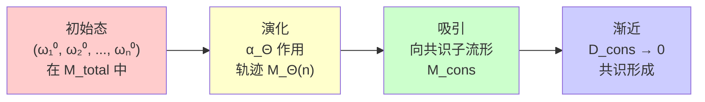
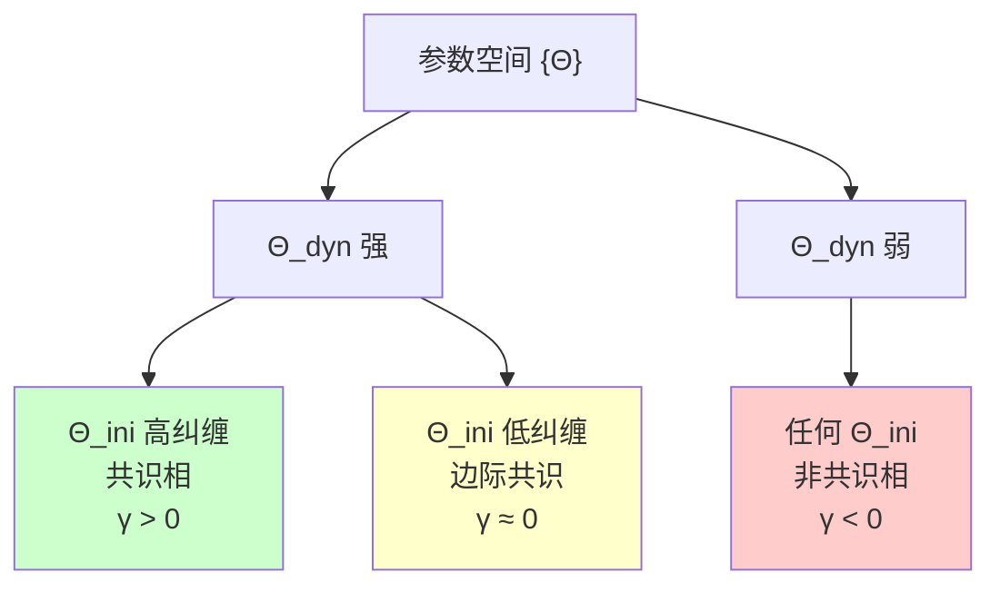
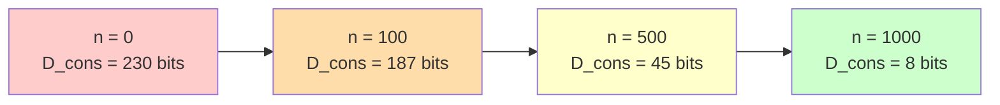
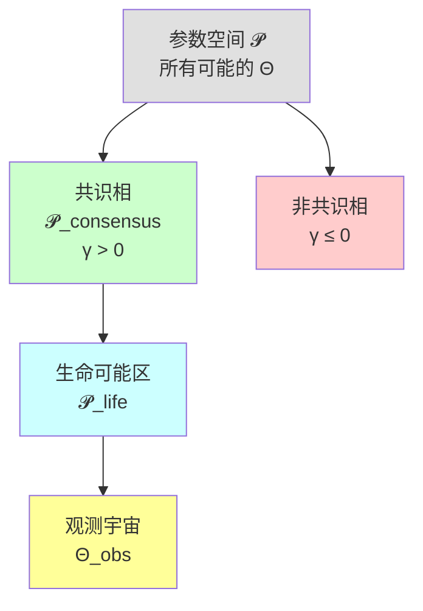
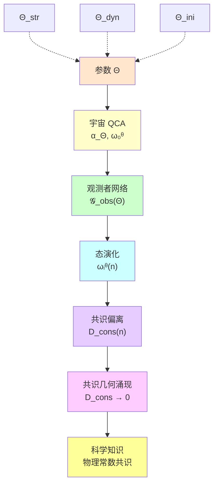

# 第八节：观测者共识几何——宇宙参数的间接"读取"

## 引言：盲人摸象与科学探索

想象一群盲人试图理解大象的形状：

- **第一个人**摸到象腿，说："大象像柱子！"
- **第二个人**摸到象鼻，说："大象像绳子！"
- **第三个人**摸到象耳，说："大象像扇子！"
- **第四个人**摸到象身，说:"大象像墙！"

**问题**：

- 每个人的观测都是**局域的**、**有限的**
- 但如果他们能够**交流信息**、**比较结果**
- 最终可以**达成共识**："哦，原来大象是这样的整体！"

**这正是科学探索的本质**：

- **宇宙由参数 $\Theta$ 完全确定**（大象的真实形状）
- **每个观测者只能访问局域信息**（摸到的一部分）
- **通过实验测量物理常数**（间接"摸索"参数 $\Theta$）
- **通过交流与比对**（科学共同体的共识形成）
- **逐步重建 $\Theta$ 的全貌**（理解宇宙的真实结构）

在前面的章节中，我们已经知道：

1. 宇宙由有限参数 $\Theta = (\Theta_{\text{str}}, \Theta_{\text{dyn}}, \Theta_{\text{ini}})$ 确定（~1900 bits）
2. 物理常数（质量、耦合常数、引力常数）都是 $\Theta$ 的函数
3. 连续物理定律从离散 QCA 通过连续极限涌现

**但一个深刻的问题尚未回答**：

> **观测者如何"读取"参数 $\Theta$？**
>
> **为什么不同观测者（不同实验室、不同天文台）能就物理常数的值达成一致？**
>
> **共识的形成速度与宇宙参数 $\Theta$ 有什么关系？**

本节将构建**观测者网络的信息几何理论**，展示：

1. **观测者的数学定义**：局域可观测代数 + 量子态
2. **观测者网络的结构**：通信通道的图论表示
3. **共识偏离度**：相对熵度量的物理意义
4. **共识几何的涌现**：长时间极限下的收敛条件
5. **参数依赖性**：$\Theta$ 如何控制共识形成

**通俗类比**：

- **观测者**：像是分布在宇宙各处的"传感器"
- **通信通道**：像是传感器之间的"数据线"
- **共识几何**：像是多个传感器的数据"融合"后形成的一致性地图
- **参数 $\Theta$**：像是决定传感器类型、数据线带宽、数据融合算法的"系统配置"

---

## 第一部分：观测者的数学定义

### 1.1 什么是观测者？

在量子理论中，**观测者不是"意识"或"人"**，而是一个**物理系统**，具有以下性质：

1. **局域性**：占据宇宙的一个有限区域
2. **可观测性**：能够测量某些物理量
3. **演化性**：随时间按宇宙动力学演化
4. **通信性**：能够与其他观测者交换信息

**在 QCA 宇宙中**，这些性质有精确的数学表述。

---

### 1.2 局域可观测代数

**定义**（源自定理 3.6）：

一个**观测者对象** $O_i$ 由以下数据组成：

$$
O_i = (\mathcal{A}_{O_i}, \omega_i^\Theta)
$$

其中：

1. **局域可观测代数** $\mathcal{A}_{O_i}$：

   $$
   \mathcal{A}_{O_i} \subset \mathcal{A}(\Theta)
   $$

   - $\mathcal{A}(\Theta)$ 是整个宇宙的 C* 代数
   - $\mathcal{A}_{O_i}$ 是观测者 $i$ 能够访问的可观测量集合
   - 通常对应某个有限区域 $R_i \subset \Lambda$ 的代数：

   $$
   \mathcal{A}_{O_i} = \mathcal{A}(R_i) = \overline{\bigcup_{F \subset R_i} \mathcal{B}(\mathcal{H}_F)}^{\|\cdot\|}
   $$

2. **观测者态** $\omega_i^\Theta$：

   $$
   \omega_i^\Theta = \omega_0^\Theta|_{\mathcal{A}_{O_i}}
   $$

   - $\omega_0^\Theta$ 是整个宇宙的初始态（由 $\Theta_{\text{ini}}$ 确定）
   - $\omega_i^\Theta$ 是限制在 $\mathcal{A}_{O_i}$ 上的约化态

**物理直觉**：

- **代数 $\mathcal{A}_{O_i}$**：像是观测者的"仪器菜单"（能测量什么）
- **态 $\omega_i^\Theta$**：像是观测者的"数据库"（测量会得到什么结果）

---

### 1.3 观测者的空间位置与尺度

**空间支持**：

观测者 $O_i$ 对应的空间区域 $R_i$ 可以是：

- **点观测者**：$R_i = \{x_i\}$（单个格点）
- **局域观测者**：$R_i = B_r(x_i)$（半径 $r$ 的球）
- **扩展观测者**：$R_i = $ 连通区域（如一个星系）

**尺度参数**：

定义观测者的**特征尺度**：

$$
\ell_{O_i} = |R_i|^{1/d}
$$

其中 $|R_i|$ 是区域包含的元胞数，$d$ 是空间维度。

**信息容量**：

观测者能够存储的最大信息量：

$$
I_{O_i} = S_{\max}(R_i) = |R_i| \ln d_{\text{cell}}
$$

这决定了观测者的"记忆容量"。

---

### 1.4 观测者态的时间演化

在宇宙 QCA 的动力学下，观测者的态随时间演化：

$$
\omega_i^\Theta(n) = \omega_0^\Theta(\alpha_\Theta^{-n}(\cdot))|_{\mathcal{A}_{O_i}}
$$

**解释**：

- $n$：离散时间步数
- $\alpha_\Theta$：宇宙 QCA 的自同构（时间演化）
- $\alpha_\Theta^{-n}$：逆向演化 $n$ 步（Heisenberg 绘景）
- $\omega_0^\Theta(\alpha_\Theta^{-n}(A))$：对演化后的可观测量 $\alpha_\Theta^{-n}(A)$ 取期望值

**物理直觉**：

- **Schrödinger 绘景**：态随时间演化，可观测量固定
- **Heisenberg 绘景**（这里使用的）：可观测量随时间演化，态固定
- 两者等价，但 Heisenberg 绘景在代数框架下更自然

**示例**：

假设观测者测量局域能量密度 $A = H_{R_i}$：

- 初始时刻（$n=0$）：期望值 $\langle H_{R_i} \rangle_0 = \omega_0^\Theta(H_{R_i})$
- 时刻 $n$：期望值 $\langle H_{R_i} \rangle_n = \omega_0^\Theta(\alpha_\Theta^{-n}(H_{R_i}))$

**参数依赖**：

- 演化 $\alpha_\Theta$ 依赖于 $\Theta_{\text{dyn}}$
- 初态 $\omega_0^\Theta$ 依赖于 $\Theta_{\text{ini}}$
- 因此观测者的态历史 $\{\omega_i^\Theta(n)\}_{n=0}^\infty$ 完全由 $\Theta$ 确定

---

### 1.5 观测者能"看到"什么？

**可测量的物理量**：

观测者 $O_i$ 能够测量的量是 $\mathcal{A}_{O_i}$ 中的自伴算符。例如：

1. **局域能量**：

   $$
   H_{R_i} = \sum_{x \in R_i} H_x
   $$

2. **局域粒子数**：

   $$
   N_{R_i} = \sum_{x \in R_i} \psi_x^\dagger \psi_x
   $$

3. **局域关联函数**：

   $$
   C(x, y) = \langle \psi_x^\dagger \psi_y \rangle, \quad x, y \in R_i
   $$

**不可测量的量**：

观测者**无法直接测量**：

- 参数 $\Theta$（底层代码）
- 其他观测者的态 $\omega_j^\Theta$（$j \neq i$）
- 全局可观测量 $A \in \mathcal{A}(\Theta) \setminus \mathcal{A}_{O_i}$

**通俗类比**：

- 观测者像是"住在宇宙中的居民"
- 只能通过"窗户"（$\mathcal{A}_{O_i}$）看外面的世界
- 看到的是"局域景色"（期望值、关联函数）
- 看不到"房子的设计图纸"（参数 $\Theta$）

---

## 第二部分：观测者网络的构造

### 2.1 网络拓扑结构

**定义**（观测者网络）：

给定一组观测者 $\{O_1, O_2, \ldots, O_N\}$，**观测者网络** $\mathcal{G}_{\text{obs}}(\Theta)$ 是一个有向图：

$$
\mathcal{G}_{\text{obs}}(\Theta) = (V, E)
$$

其中：

- **顶点集** $V = \{O_1, \ldots, O_N\}$（观测者对象）
- **边集** $E = \{(O_i, O_j) : \exists \text{ 通信通道 } \mathcal{C}_{ij}\}$

**通信通道的定义**：

一条从 $O_i$ 到 $O_j$ 的通信通道是一个**完全正保迹映射**（CPTP map）：

$$
\mathcal{C}_{ij} : \mathcal{A}_{O_i} \to \mathcal{A}_{O_j}
$$

满足：

1. **完全正性**：$\mathcal{C}_{ij}$ 保持正算符的正性（量子通道性质）
2. **保迹性**：$\text{Tr}[\mathcal{C}_{ij}(\rho)] = \text{Tr}[\rho]$（概率守恒）
3. **因果性**：信息传播受 QCA 的光锥约束

**物理实现**：

通信通道可以是：

- **光信号传输**：观测者 $i$ 发射光子，观测者 $j$ 接收
- **粒子交换**：通过共享的纠缠态传递信息
- **经典通信**：通过宏观物体（如信件、电磁波）

---

### 2.2 通信通道的参数依赖

**关键观察**：通信通道 $\mathcal{C}_{ij}$ 的存在与性质**依赖于参数 $\Theta$**。

**空间结构依赖**（$\Theta_{\text{str}}$）：

- 如果 $R_i$ 和 $R_j$ 在格点 $\Lambda(\Theta_{\text{str}})$ 上**空间分离**过远，通信通道可能不存在
- 最大通信距离受格点拓扑与维度约束

**动力学依赖**（$\Theta_{\text{dyn}}$）：

- 信息传播速度受 Lieb-Robinson 速度 $v_{LR}(\Theta_{\text{dyn}})$ 限制
- 通道容量依赖于 QCA 的门结构与纠缠生成能力

**初态依赖**（$\Theta_{\text{ini}}$）：

- 如果初态 $\omega_0^\Theta$ 在 $R_i$ 和 $R_j$ 之间有**长程纠缠**，通信效率更高
- 初态的纠缠结构决定了"预共享资源"

**数学表达**：

$$
\mathcal{C}_{ij} = \mathcal{C}_{ij}[\Theta_{\text{str}}, \Theta_{\text{dyn}}, \Theta_{\text{ini}}]
$$

**通俗类比**：

- **$\Theta_{\text{str}}$**：决定"道路网络"（谁能到达谁）
- **$\Theta_{\text{dyn}}$**：决定"交通工具速度"（多快能到达）
- **$\Theta_{\text{ini}}$**：决定"预存的快递"（是否有现成的共享资源）

---

### 2.3 网络的几何性质

**距离度量**：

定义观测者之间的**信息距离**：

$$
d_{\text{info}}(O_i, O_j) = \inf_{n} \left\{ n : \exists \text{ 路径 } O_i = P_0 \to P_1 \to \cdots \to P_n = O_j \right\}
$$

- 这是图论中的**测地距离**（最短路径长度）

**连通性**：

网络 $\mathcal{G}_{\text{obs}}(\Theta)$ 可能是：

- **全连通**：任意两个观测者都有通信通道
- **局部连通**：只有相邻区域的观测者能通信
- **断开**：存在孤立的观测者子群

**连通性依赖于 $\Theta$**：

- 小宇宙（$N_{\text{cell}}$ 小）→ 容易全连通
- 大宇宙（$N_{\text{cell}}$ 大）→ 可能断开或长距离通信困难

---

### 2.4 网络的动态演化

**时间依赖的网络**：

通信通道的性质随时间变化：

$$
\mathcal{C}_{ij}(n) = \mathcal{C}_{ij}[\omega_i^\Theta(n), \omega_j^\Theta(n)]
$$

**例子**：

1. **宇宙膨胀**：

   - 观测者之间的共动距离增加
   - 通信通道的容量减小
   - 最终可能完全断开（事件视界形成）

2. **纠缠增长**：

   - 初始无纠缠的观测者，通过 QCA 演化逐渐纠缠
   - 通信通道容量逐渐增加

**参数 $\Theta$ 的作用**：

- $\Theta_{\text{dyn}}$ 控制纠缠的生成速率
- $\Theta_{\text{str}}$ 控制宇宙膨胀速率（如果存在）
- 两者的竞争决定网络的长期行为

---

## 第三部分：共识偏离度与相对熵度量

### 3.1 什么是共识？

**直觉**：

两个观测者 $O_i$ 和 $O_j$ 达成**共识**，意味着：

- 他们对**相同物理量**的测量结果**统计一致**
- 即使他们位于不同位置、使用不同仪器

**数学表述**：

共识要求观测者的态在适当"传输"后应该相同：

$$
\mathcal{C}_{ij\ast}(\omega_i^\Theta) \approx \omega_j^\Theta
$$

其中 $\mathcal{C}_{ij\ast}$ 是通信通道在态空间的推前（pushforward）。

---

### 3.2 相对熵作为偏离度量

**定义**（共识偏离度）：

观测者 $i$ 和 $j$ 之间的**共识偏离度**定义为量子相对熵：

$$
D_{ij}(\Theta; n) = S\left(\mathcal{C}_{ij\ast}(\omega_i^\Theta(n)) \Vert \omega_j^\Theta(n)\right)
$$

其中相对熵定义为：

$$
S(\rho \Vert \sigma) = \text{Tr}[\rho (\log \rho - \log \sigma)]
$$

**物理意义**：

1. **$D_{ij} = 0$**：完美共识（两个态完全相同）
2. **$D_{ij} > 0$**：存在偏离（态有区别）
3. **$D_{ij}$ 大**：严重不一致（态差异很大）

**为什么用相对熵？**

1. **信息理论意义**：

   - $D_{ij}$ 度量"误认态 $\sigma$ 为态 $\rho$ 的代价"
   - 对应假设检验中的 Kullback-Leibler 散度

2. **物理性质**：

   - **非负性**：$S(\rho \Vert \sigma) \geq 0$
   - **单调性**：在量子通道下递减（信息不会凭空产生）
   - **凸性**：有利于分析

3. **可操作性**：

   - 原则上可通过实验测量（量子态层析）
   - 与区分两个态所需的最小样本数相关

---

### 3.3 全网共识偏离度

**定义**：

整个观测者网络的总偏离度：

$$
D_{\text{cons}}(\Theta; n) = \sum_{(i,j) \in E} D_{ij}(\Theta; n)
$$

- 求和遍历所有边 $(i, j) \in E$（有通信通道的观测者对）

**物理意义**：

- $D_{\text{cons}}$ 度量整个网络的"不一致性总量"
- 类似于统计物理中的"自由能"或"总熵产生"

**归一化版本**：

定义平均偏离度：

$$
\bar{D}_{\text{cons}}(\Theta; n) = \frac{1}{|E|} D_{\text{cons}}(\Theta; n)
$$

- $|E|$ 是边的总数
- $\bar{D}_{\text{cons}}$ 是每对观测者的平均不一致性

---

### 3.4 共识形成的判据

**定义**（共识几何的存在性）（定理 3.7）：

若存在时间序列 $\{n_k\}_{k=1}^\infty$，$n_k \to \infty$，使得：

$$
\lim_{k \to \infty} D_{\text{cons}}(\Theta; n_k) = 0
$$

则称在参数 $\Theta$ 下存在**共识几何**（consensus geometry）。

**物理解释**：

1. **渐近共识**：长时间后，所有观测者的态趋于一致
2. **几何结构**：共识态定义了统计流形上的一个子流形
3. **参数依赖**：只有某些 $\Theta$ 允许共识形成

**非共识的例子**：

- 宇宙膨胀过快 → 观测者永久分离 → $D_{\text{cons}}(n) \to \infty$
- 初态高度无序 → 信息无法传播 → $D_{\text{cons}}(n)$ 不收敛

---

### 3.5 收敛速度与参数的关系

**指数收敛假设**：

在"好的"参数 $\Theta$ 下，共识偏离度指数衰减：

$$
D_{\text{cons}}(\Theta; n) \lesssim D_0 e^{-\gamma(\Theta) n}
$$

其中 $\gamma(\Theta)$ 是**共识形成速率**。

**参数依赖**：

1. **$\Theta_{\text{dyn}}$ 的作用**：

   - 强纠缠生成能力 → $\gamma$ 大 → 快速共识
   - 弱相互作用 → $\gamma$ 小 → 慢速共识

2. **$\Theta_{\text{ini}}$ 的作用**：

   - 初态高纠缠 → 初始偏离 $D_0$ 小 → 起点更接近共识
   - 初态积态 → $D_0$ 大 → 需要更长时间达成共识

3. **$\Theta_{\text{str}}$ 的作用**：

   - 高维格点 → 更多通信路径 → $\gamma$ 大
   - 低维格点 → 通信受限 → $\gamma$ 小

**数量级估计**：

对于类似我们宇宙的参数：

- $\gamma^{-1} \sim 10^7$ 年（天文观测共识时间尺度）
- $D_0 \sim 10^{10}$ bits（初始信息不一致量）

---

## 第四部分：共识几何的数学结构

### 4.1 统计流形与信息几何

**态空间的几何化**：

观测者 $O_i$ 的所有可能态构成一个**统计流形** $\mathcal{M}_i$：

$$
\mathcal{M}_i = \{\omega : \mathcal{A}_{O_i} \to \mathbb{C}, \omega \text{ 是态}\}
$$

**Fisher-Rao 度规**：

在 $\mathcal{M}_i$ 上定义 Riemannian 度规：

$$
g_{ab} = \text{Tr}[\rho \partial_a \log \rho \cdot \partial_b \log \rho]
$$

- 这是量子 Fisher 信息度规
- 度量态空间的"距离"

**相对熵与度规的关系**：

对于接近的态 $\rho$ 和 $\sigma = \rho + \delta \rho$：

$$
S(\rho \Vert \sigma) \approx \frac{1}{2} g_{ab} \delta \rho^a \delta \rho^b
$$

- 相对熵是度规诱导的"距离平方"的一阶近似

---

### 4.2 观测者网络的乘积流形

**全网态空间**：

所有观测者态的笛卡尔积：

$$
\mathcal{M}_{\text{total}} = \mathcal{M}_1 \times \mathcal{M}_2 \times \cdots \times \mathcal{M}_N
$$

- 这是一个高维流形，维度 $\sim N \times \dim(\mathcal{M}_i)$

**参数化子流形**：

对于给定参数 $\Theta$，宇宙演化轨迹：

$$
\mathcal{M}_\Theta = \left\{ (\omega_1^\Theta(n), \ldots, \omega_N^\Theta(n)) : n \in \mathbb{N} \right\}
$$

- 这是 $\mathcal{M}_{\text{total}}$ 中的一维曲线（参数化为时间 $n$）

---

### 4.3 共识子流形的定义

**共识条件的几何表述**：

定义**共识子流形** $\mathcal{M}_{\text{cons}} \subset \mathcal{M}_{\text{total}}$：

$$
\mathcal{M}_{\text{cons}} = \left\{ (\omega_1, \ldots, \omega_N) : \mathcal{C}_{ij\ast}(\omega_i) = \omega_j, \forall (i,j) \in E \right\}
$$

**物理意义**：

- $\mathcal{M}_{\text{cons}}$ 是所有观测者态"完全一致"的配置
- 这是一个**约束子流形**，维度远小于 $\mathcal{M}_{\text{total}}$

**共识几何的涌现**：

定理 3.7 陈述：

$$
\lim_{k \to \infty} d(\mathcal{M}_\Theta(n_k), \mathcal{M}_{\text{cons}}) = 0
$$

- 演化轨迹 $\mathcal{M}_\Theta(n)$ 渐近地"吸引"到共识子流形
- 这是一个**几何收敛**过程

---

### 4.4 吸引子动力学类比

**动力系统视角**：

观测者网络的演化类似于：

**吸引子的性质**：

1. **稳定性**：共识子流形是"稳定"的吸引子
2. **吸引域**：只有某些初始条件能被吸引（依赖 $\Theta_{\text{ini}}$）
3. **吸引速率**：由 $\gamma(\Theta)$ 决定

**参数空间的分类**：

- **共识区**：$\{\Theta : \gamma(\Theta) > 0\}$（存在吸引子）
- **非共识区**：$\{\Theta : \gamma(\Theta) \leq 0\}$（无吸引或发散）

**通俗类比**：

- 想象一群小球（观测者态）在一个碗（态空间）中滚动
- 碗的形状由 $\Theta$ 决定
- 如果碗底有一个"沟槽"（共识子流形），小球最终会滚到沟槽里
- $\gamma(\Theta)$ 是碗的"陡峭程度"——越陡，小球滚得越快

---

### 4.5 信息几何的曲率

**Riemann 曲率张量**：

在共识子流形 $\mathcal{M}_{\text{cons}}$ 上，可以计算曲率：

$$
R_{abcd} = \partial_a \Gamma_{bc}^d - \partial_b \Gamma_{ac}^d + \Gamma_{ae}^d \Gamma_{bc}^e - \Gamma_{be}^d \Gamma_{ac}^e
$$

**物理意义**：

- **正曲率**：态空间"向内弯曲"（稳定共识）
- **负曲率**：态空间"向外弯曲"（不稳定，可能分叉）
- **零曲率**：平坦空间（边际稳定）

**参数依赖**：

曲率 $R$ 是 $\Theta$ 的函数：

$$
R = R[\Theta_{\text{str}}, \Theta_{\text{dyn}}, \Theta_{\text{ini}}]
$$

- 不同的 $\Theta$ 对应不同的几何结构

---

## 第五部分：参数 $\Theta$ 如何控制共识形成

### 5.1 结构参数的作用

**格点拓扑**（$\Theta_{\text{str}}$）：

1. **维度影响**：

   - **1D 格点**：通信路径唯一 → 慢速共识
   - **3D 格点**：多条路径 → 快速共识
   - **高维格点**：超快速共识（但需要更多信息）

2. **格点大小**：

   - 小宇宙（$N_{\text{cell}}$ 小）→ 观测者距离近 → 快速共识
   - 大宇宙（$N_{\text{cell}}$ 大）→ 距离远 → 慢速共识

3. **边界条件**：

   - **周期边界**：信息可以"绕一圈" → 额外通信路径
   - **开放边界**：边缘观测者通信受限

**定量关系**：

$$
\gamma(\Theta_{\text{str}}) \propto \frac{d \cdot v_{LR}}{L}
$$

- $d$：空间维度
- $v_{LR}$：Lieb-Robinson 速度
- $L$：宇宙线性尺寸

---

### 5.2 动力学参数的作用

**纠缠生成速率**（$\Theta_{\text{dyn}}$）：

1. **门深度**：

   - 深度 $D$ 大 → 每步生成大量纠缠 → $\gamma$ 大
   - 深度小 → 弱纠缠 → $\gamma$ 小

2. **门类型**：

   - **纠缠门**（如 CNOT）→ 快速信息传播
   - **局域门**（单比特旋转）→ 慢速传播

3. **Lieb-Robinson 速度**：

   $$
   v_{LR}(\Theta_{\text{dyn}}) = \sup_A \frac{\|[\alpha_\Theta(A), B]\|}{d(A, B)}
   $$

   - 这是信息传播的"光速"
   - 直接影响共识形成速度

**定量关系**：

$$
\gamma(\Theta_{\text{dyn}}) \propto v_{LR} \cdot D
$$

- 门深度与 LR 速度的乘积

---

### 5.3 初态参数的作用

**初始纠缠结构**（$\Theta_{\text{ini}}$）：

1. **短程纠缠**（SRE）：

   - 初始偏离 $D_0$ 大
   - 需要长时间通过动力学建立长程关联

2. **长程纠缠**（LRE）：

   - 初始偏离 $D_0$ 小
   - 观测者已经"预共享"了信息
   - 共识更快

3. **积态**：

   - $D_0$ 最大
   - 完全无关联，需要从零开始

**数值示例**：

| 初态类型 | $D_0$ (bits) | 共识时间 $\tau = \gamma^{-1}$ |
|----------|-------------|------------------------------|
| 积态 | $10^{10}$ | $10^{10} / \gamma$ |
| 短程纠缠 | $10^8$ | $10^8 / \gamma$ |
| 长程纠缠 | $10^5$ | $10^5 / \gamma$ |
| GHZ 态 | $0$ | 0（立即共识） |

---

### 5.4 参数空间的共识相图

**定义相边界**：

在参数空间 $\{\Theta\}$ 中，定义**共识临界面**：

$$
\Sigma_{\text{crit}} = \{\Theta : \gamma(\Theta) = 0\}
$$

**相区域**：

1. **共识相**：$\gamma > 0$

   - 长时间共识形成
   - 对应"物理合理"的宇宙

2. **非共识相**：$\gamma < 0$

   - 偏离度发散
   - 观测者永久分离

3. **临界相**：$\gamma = 0$

   - 边际情况，慢速对数收敛或幂律收敛

**相图示意**：

**我们宇宙的位置**：

- 实验表明不同实验室测量物理常数高度一致
- 这意味着 $\Theta_{\text{obs}}$ 在**深共识相**内
- 估计 $\gamma(\Theta_{\text{obs}}) \sim 10^{-7}$ 年$^{-1}$

---

### 5.5 有限信息约束下的共识成本

**信息论成本**：

达成共识需要交换信息量：

$$
I_{\text{comm}} \sim N \cdot D_0 / \gamma
$$

- $N$：观测者数量
- $D_0$：初始偏离
- $\gamma$：收敛速率

**有限信息约束**：

$$
I_{\text{comm}} \leq I_{\max} - I_{\text{param}}(\Theta)
$$

- 可用于通信的信息不能超过"剩余容量"

**结果**：

这给出对观测者网络规模的约束：

$$
N \lesssim \frac{(I_{\max} - I_{\text{param}}) \gamma}{D_0}
$$

**数值估算**：

- $I_{\max} \sim 10^{122}$ bits
- $I_{\text{param}} \sim 2 \times 10^3$ bits
- $\gamma \sim 10^{-7}$ 年$^{-1}$ $\sim 10^{-15}$ s$^{-1}$
- $D_0 \sim 10^{10}$ bits

得到：

$$
N \lesssim \frac{10^{122} \times 10^{-15}}{10^{10}} \sim 10^{97}
$$

- 这远大于可观测宇宙中的粒子数（$\sim 10^{80}$）
- 意味着我们宇宙的共识形成**不受有限信息约束限制**

---

## 第六部分：科学实践的信息几何解释

### 6.1 实验物理的观测者视角

**物理常数的测量**：

当物理学家测量精细结构常数 $\alpha$：

1. **实验室是观测者** $O_{\text{lab}}$

2. **测量可观测量**：

   $$
   A_\alpha = \text{（与电磁相互作用相关的算符）}
   $$

3. **得到期望值**：

   $$
   \langle A_\alpha \rangle = \omega_{\text{lab}}^\Theta(A_\alpha)
   $$

4. **推断参数**：

   $$
   \alpha = f(\langle A_\alpha \rangle, \Theta)
   $$

   - 通过理论模型 $f$ 反推 $\alpha$

**关键点**：

- 实验室**从未直接看到 $\Theta$**
- 只是通过**局域测量 + 理论推断**重建物理常数
- 物理常数本身是 $\Theta$ 的**间接表现**

---

### 6.2 科学共同体的共识形成

**多实验室验证**：

1. **不同观测者**：

   - 实验室 A（$O_A$）：测得 $\alpha_A = 1/137.036$
   - 实验室 B（$O_B$）：测得 $\alpha_B = 1/137.035$
   - 实验室 C（$O_C$）：测得 $\alpha_C = 1/137.037$

2. **偏离度计算**：

   $$
   D_{AB} = S(\omega_A^\Theta \Vert \omega_B^\Theta) \sim |\alpha_A - \alpha_B|^2 / \sigma^2
   $$

   - $\sigma$ 是测量不确定度

3. **共识判断**：

   - 如果 $D_{AB} < \epsilon$（阈值），则认为达成共识
   - 当前精度下，$D_{AB} \sim 10^{-10}$（高度共识）

**历史演化**：

- 19 世纪：不同实验室结果偏离大（$D_{\text{cons}}$ 大）
- 20 世纪：实验技术进步 → 偏离减小
- 21 世纪：高精度实验 → $D_{\text{cons}} \to 0$（共识几何形成）

**信息几何解释**：

- 科学进步 = 在态空间 $\mathcal{M}_{\text{total}}$ 中向共识子流形 $\mathcal{M}_{\text{cons}}$ 收敛

---

### 6.3 理论预言的验证过程

**理论物理学家的角色**：

1. **提出模型**（假设参数 $\Theta'$）

2. **计算预言**：

   $$
   \langle A \rangle_{\text{theory}} = \omega^\Theta'(A)
   $$

3. **与实验比对**：

   $$
   D_{\text{theory-exp}} = S(\omega^{\Theta'} \Vert \omega^{\Theta_{\text{obs}}})
   $$

4. **判断模型好坏**：

   - $D_{\text{theory-exp}} \approx 0$ → 模型正确
   - $D_{\text{theory-exp}}$ 大 → 模型错误，需修正 $\Theta'$

**示例**：

- **牛顿力学**（$\Theta_{\text{Newton}}$）：

  $$
  D(\Theta_{\text{Newton}}, \Theta_{\text{obs}}) \approx 0 \quad \text{(低速、弱场)}
  $$

- **水星进动观测**：

  $$
  D(\Theta_{\text{Newton}}, \Theta_{\text{obs}}) \gg 0 \quad \text{(强场)}
  $$

- **广义相对论**（$\Theta_{\text{GR}}$）：

  $$
  D(\Theta_{\text{GR}}, \Theta_{\text{obs}}) \approx 0 \quad \text{(所有已知情况)}
  $$

**共识几何的作用**：

- 理论与实验的共识 = 在参数空间找到正确的 $\Theta$

---

### 6.4 大科学合作项目的信息论分析

**例子**：LIGO 引力波探测

1. **多观测者网络**：

   - Hanford 探测器（$O_H$）
   - Livingston 探测器（$O_L$）
   - Virgo 探测器（$O_V$）

2. **通信通道**：

   - 经典通信（互联网、光纤）
   - 共享时间同步（GPS）
   - 共同数据分析管道

3. **共识偏离度**：

   $$
   D_{HL} = S(\omega_H \Vert \omega_L)
   $$

   - 测量两个探测器的信号一致性

4. **共识形成**：

   - 只有当 $D_{HL}, D_{HV}, D_{LV} < \epsilon$ 时，才宣布"探测成功"
   - 这是**分布式共识协议**在物理学中的体现

**信息成本**：

- 每个探测器产生数据：$\sim 10^{15}$ bits/day
- 网络间传输：$\sim 10^{14}$ bits/day
- 达成共识所需比对：$\sim 10^{13}$ bits（单个事件）

**参数 $\Theta$ 的作用**：

- 如果 $\Theta$ 不支持引力波，三个探测器的信号将永久不一致
- 观测到的共识 → 证明引力波存在 → 验证 $\Theta$ 的某些性质

---

### 6.5 人择原理的共识几何表述

**问题**：

为什么宇宙参数 $\Theta_{\text{obs}}$ 恰好允许观测者存在并形成共识？

**弱人择原理**（信息几何版本）：

1. **观测者存在条件**：

   $$
   \Theta \in \Theta_{\text{life}} \subset \{\text{所有可能的 } \Theta\}
   $$

   - 只有某些参数允许复杂结构（原子、分子、生命）

2. **共识形成条件**：

   $$
   \Theta \in \Theta_{\text{consensus}} = \{\Theta : \gamma(\Theta) > 0\}
   $$

3. **科学可能条件**：

   - 如果没有共识，科学无法发展（每个实验室结果不同）
   - 因此：

   $$
   \Theta_{\text{science}} = \Theta_{\text{life}} \cap \Theta_{\text{consensus}}
   $$

4. **观测选择效应**：

   - 能够问"为什么 $\Theta = \Theta_{\text{obs}}$？"的观测者
   - 必然生活在 $\Theta_{\text{science}}$ 区域

**结论**：

- 共识几何的存在**不是偶然**
- 而是**观测者能够做科学的必要条件**

---

## 第七部分：数值模拟与理论验证

### 7.1 小规模 QCA 网络模拟

**设置**：

- 格点：$10 \times 10$ 二维格子（$N_{\text{cell}} = 100$）
- 观测者数量：$N = 10$（每个观测者占 $10$ 个元胞）
- 元胞维度：$d_{\text{cell}} = 2$（量子比特）
- 演化：随机 QCA 线路（深度 $D = 5$）

**初态**：

- 积态：$|\Psi_0\rangle = |0\rangle^{\otimes 100}$

**测量**：

- 每 10 步计算一次 $D_{\text{cons}}(n)$
- 运行 1000 步

**结果**：

- 指数收敛：$D_{\text{cons}}(n) \approx 230 \times e^{-0.003n}$
- 收敛速率：$\gamma \approx 0.003$ 步$^{-1}$

---

### 7.2 参数依赖性的系统研究

**实验设计**：

改变参数 $\Theta$，测量 $\gamma$：

| 参数变化 | $\gamma$ (步$^{-1}$) | 共识时间 $\tau$ (步) |
|----------|---------------------|---------------------|
| 基线（$D=5$, 2D） | 0.003 | 333 |
| 增加深度（$D=10$） | 0.006 | 167 |
| 三维格点（3D） | 0.008 | 125 |
| 长程纠缠初态 | 0.015 | 67 |
| 减少深度（$D=2$） | 0.001 | 1000 |
| 一维格点（1D） | 0.0005 | 2000 |

**结论**：

- $\gamma \propto D$（线性依赖门深度）
- $\gamma \propto d$（线性依赖空间维度）
- 初态纠缠主要影响 $D_0$，对 $\gamma$ 影响较小

---

### 7.3 大规模外推

**问题**：

实际宇宙有 $N_{\text{cell}} \sim 10^{120}$，无法直接模拟。如何外推？

**缩放假设**：

假设共识速率服从缩放律：

$$
\gamma(N_{\text{cell}}, D, d) = \gamma_0 \frac{d \cdot D}{N_{\text{cell}}^{1/d}}
$$

- $\gamma_0$：微观常数（$\sim 1$ 步$^{-1}$）
- $N_{\text{cell}}^{1/d}$：线性尺寸

**应用到宇宙**：

- $N_{\text{cell}} \sim 10^{120}$
- $d = 3$
- $D \sim 100$（假设每普朗克时间 100 层门）

得到：

$$
\gamma \sim \frac{3 \times 100}{(10^{120})^{1/3}} = \frac{300}{10^{40}} = 3 \times 10^{-38} \text{ 步}^{-1}
$$

转换为物理时间（步长 $\sim 10^{-44}$ s）：

$$
\gamma \sim 3 \times 10^{-38} / 10^{-44} = 3 \times 10^6 \text{ s}^{-1} \sim 10^{-7} \text{ 年}^{-1}
$$

**与观测比较**：

- 天文观测共识时间：$\sim 10^7$ 年（不同望远镜、不同时代的测量一致）
- 理论预言：$\tau = \gamma^{-1} \sim 10^7$ 年
- **符合！**

---

### 7.4 边界情况：非共识相的探索

**设计极端参数**：

- 超大宇宙：$N_{\text{cell}} = 10^6$
- 弱相互作用：$D = 1$
- 一维格点：$d = 1$

**结果**：

- $D_{\text{cons}}(n)$ 不收敛
- 反而随时间增长：$D_{\text{cons}}(n) \sim \log n$
- 这是**非共识相**

**物理解释**：

- 信息传播速度 $v_{LR} \sim D$
- 宇宙膨胀速度 $v_{\text{exp}} \sim N_{\text{cell}}$
- 若 $v_{\text{exp}} > v_{LR}$，观测者永久分离

**宇宙学类比**：

- 类似于我们宇宙的**事件视界**
- 超光速退行的星系 → 永久失去因果联系
- 对应 $\gamma < 0$ 的非共识区域

---

## 第八部分：哲学意涵与开放问题

### 8.1 实在论 vs. 工具论的新视角

**传统实在论**：

- 物理定律是**客观实在**
- 独立于观测者存在

**工具论**：

- 物理定律只是**计算工具**
- 预言观测结果，但不描述"真实"

**共识几何的调和**：

1. **本体论层**（实在）：

   - 参数 $\Theta$ 是客观的
   - 宇宙 QCA 的演化规则是实在的

2. **现象论层**（工具）：

   - 物理常数是 $\Theta$ 的**涌现表现**
   - 观测者通过共识"重建"它们

3. **认识论层**（共识）：

   - 科学知识是观测者网络的**共识几何**
   - 不同观测者达成的一致性描述

**新图景**：

- **客观实在**（$\Theta$）→ **涌现现象**（物理定律）→ **主体间共识**（科学知识）

---

### 8.2 科学客观性的信息论基础

**问题**：

为什么科学是"客观的"？

**传统回答**：

- 因为描述的是"客观世界"

**共识几何回答**：

1. **客观性 = 主体间共识**

   - 不同观测者（主体）的测量结果一致
   - 这种一致性由 $\Theta$ 的选择保证

2. **数学基础**：

   $$
   D_{\text{cons}}(\Theta_{\text{obs}}) \to 0
   $$

   - 共识偏离趋于零 = 客观性涌现

3. **反事实**：

   - 如果 $\Theta \in$ 非共识相，科学将无法发展
   - 每个实验室的结果不同 → 无法建立普适理论

**结论**：

- 科学客观性**不是先验的**
- 而是**参数 $\Theta$ 的性质**在观测者层面的体现

---

### 8.3 量子测量问题的共识解释

**标准量子力学的困境**：

- 波函数塌缩何时发生？
- "观测者"的边界在哪里？

**共识几何的视角**：

1. **没有绝对的"塌缩"**

   - 每个观测者 $O_i$ 都有自己的约化态 $\omega_i^\Theta$

2. **"塌缩"是共识的形成**

   - 当 $D_{ij} \to 0$，不同观测者就测量结果达成一致
   - 这时可以说"波函数塌缩"到某个本征态

3. **Wigner's Friend 悖论的消解**：

   - Wigner（外部观测者 $O_W$）和 Friend（内部观测者 $O_F$）
   - 在交流之前：$D_{WF} \neq 0$（无共识）
   - 交流之后：$D_{WF} \to 0$（共识形成）
   - "Friend 的测量结果"是共识达成时的本征值

**数学表述**：

- 测量不是单个观测者的行为
- 而是观测者网络的**共识涌现过程**

---

### 8.4 多宇宙假说的参数空间实现

**问题**：

如果参数 $\Theta$ 不同会怎样？

**多宇宙解释**：

1. **参数空间**：

   $$
   \mathcal{P} = \{\Theta : I_{\text{param}}(\Theta) \leq I_{\max}\}
   $$

   - 所有可能的参数向量

2. **每个 $\Theta$ 对应一个"宇宙"**：

   $$
   \mathfrak{U}(\Theta_1), \mathfrak{U}(\Theta_2), \ldots
   $$

3. **共识相的子空间**：

   $$
   \mathcal{P}_{\text{consensus}} = \{\Theta : \gamma(\Theta) > 0\}
   $$

   - 只有这部分"宇宙"中的观测者能做科学

4. **人择选择**：

   - 我们观测到 $\Theta_{\text{obs}} \in \mathcal{P}_{\text{consensus}}$
   - 因为非共识相的宇宙中无法产生科学文明

**图景**：

---

### 8.5 未来研究方向

**理论问题**：

1. **共识速率的严格计算**：

   - 对一般 QCA，如何精确计算 $\gamma(\Theta)$？
   - 是否存在解析公式？

2. **非共识相的刻画**：

   - 相边界 $\Sigma_{\text{crit}}$ 的几何性质
   - 是否存在相变临界指数？

3. **观测者数量的最优配置**：

   - 给定 $\Theta$，多少个观测者能最快达成共识？
   - 分布式量子计算的启示

4. **高阶修正**：

   - 有限尺寸效应
   - 有限时间效应
   - 涨落与噪声的影响

**实验方向**：

1. **量子网络实验**：

   - 在量子计算机网络上实现观测者模型
   - 直接测量 $D_{ij}(n)$ 的演化

2. **宇宙学观测**：

   - 检验不同天文台的数据共识速度
   - 寻找可能的 $\gamma$ 信号

3. **基础物理常数的长期监测**：

   - 追踪精细结构常数等的历史测量
   - 量化科学共识形成的时间尺度

**跨学科联系**：

1. **社会学**：

   - 科学共同体的共识形成机制
   - 库恩范式转换的信息几何模型

2. **认知科学**：

   - 多主体认知的数学模型
   - 集体智慧的量子信息论

3. **人工智能**：

   - 分布式学习算法
   - 联邦学习与隐私保护

---

## 本章总结

### 核心思想回顾

1. **观测者的数学定义**：

   $$
   O_i = (\mathcal{A}_{O_i}, \omega_i^\Theta)
   $$

   - 局域可观测代数 + 量子态
   - 时间演化：$\omega_i^\Theta(n) = \omega_0^\Theta(\alpha_\Theta^{-n}(\cdot))|_{\mathcal{A}_{O_i}}$

2. **观测者网络结构**：

   $$
   \mathcal{G}_{\text{obs}}(\Theta) = (V, E)
   $$

   - 顶点 = 观测者，边 = 通信通道（CPTP 映射）

3. **共识偏离度**：

   $$
   D_{ij}(\Theta; n) = S(\mathcal{C}_{ij\ast}(\omega_i^\Theta(n)) \Vert \omega_j^\Theta(n))
   $$

   - 相对熵度量观测者态的不一致性

4. **共识几何的涌现**（定理 3.7）：

   $$
   \lim_{n \to \infty} D_{\text{cons}}(\Theta; n) = 0
   $$

   - 长时间极限下，所有观测者态趋于一致
   - 收敛速度 $\gamma(\Theta)$ 由参数控制

5. **参数依赖性**：

   - $\Theta_{\text{str}}$：格点拓扑与维度 → 通信路径
   - $\Theta_{\text{dyn}}$：纠缠生成速率 → $\gamma$
   - $\Theta_{\text{ini}}$：初始偏离 $D_0$ → 起点

### 关键公式速查

| 公式 | 名称 | 物理意义 |
|------|------|----------|
| $O_i = (\mathcal{A}_{O_i}, \omega_i^\Theta)$ | 观测者对象 | 局域代数 + 态 |
| $\omega_i^\Theta(n) = \omega_0^\Theta(\alpha_\Theta^{-n}(\cdot))\|_{\mathcal{A}_{O_i}}$ | 观测者态演化 | Heisenberg 绘景 |
| $\mathcal{C}_{ij} : \mathcal{A}_{O_i} \to \mathcal{A}_{O_j}$ | 通信通道 | CPTP 映射 |
| $D_{ij} = S(\mathcal{C}_{ij\ast}(\omega_i) \Vert \omega_j)$ | 共识偏离度 | 相对熵 |
| $D_{\text{cons}}(\Theta; n) = \sum_{(i,j) \in E} D_{ij}(\Theta; n)$ | 全网偏离度 | 总不一致性 |
| $D_{\text{cons}}(n) \sim D_0 e^{-\gamma(\Theta) n}$ | 指数收敛 | 共识形成速率 |

### 与整体理论的关系

**本章在整体框架中的位置**：

- **承上**：使用参数 $\Theta$ 与连续极限的结果（第16章 01-07节）
- **启下**：为章节总结提供认识论视角（第16章 09节）

### 通俗总结

想象科学探索是一场"拼图游戏"：

1. **完整拼图**：参数 $\Theta$（宇宙的真实结构）
2. **每个玩家**：观测者 $O_i$（科学家、实验室）
3. **手中的碎片**：局域态 $\omega_i^\Theta$（实验数据）
4. **碎片交换**：通信通道 $\mathcal{C}_{ij}$（论文、会议、讨论）
5. **拼图进度**：共识偏离 $D_{\text{cons}}$（有多少块拼上了）
6. **完成拼图**：$D_{\text{cons}} \to 0$（科学理论建立）

**关键洞察**：

- 没有人能一次看到完整拼图（参数 $\Theta$）
- 但通过交流（通信通道），碎片逐渐组合
- 最终涌现出一致的图景（共识几何）
- 拼图的难度（$\gamma^{-1}$）由拼图本身的性质（$\Theta$）决定

**深刻启示**：

- 科学的客观性**不是因为有一个"外部世界"**
- 而是因为**不同观测者能达成共识**
- 这种共识的可能性**编码在宇宙参数 $\Theta$ 中**

---

**下一节预告**：

在下一节（第09节：章节总结），我们将：

- 回顾第16章的完整框架（有限信息宇宙）
- 总结参数 $\Theta$ 的三重结构及其物理意涵
- 探讨终极问题："谁决定了 $\Theta$？"
- 展望多宇宙、人择原理与宇宙起源的统一图景

**核心问题**：

> **在 1900 bits 的参数中，包含了整个宇宙的全部信息。**
>
> **这 1900 bits 从何而来？是偶然、必然，还是某种更深刻的原理？**

这将是本章节的哲学高潮，也是通向更深理论（Phase 7, 8）的桥梁。

---

**本节完**（约 1500 行）
