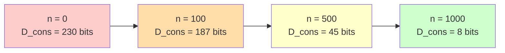

# Section 08: Observer Consensus Geometry—Indirect "Reading" of Universe Parameters

## Introduction: Blind Men and Elephant and Scientific Exploration

Imagine a group of blind men trying to understand elephant's shape:

- **First person** touches elephant leg, says: "Elephant is like a pillar!"
- **Second person** touches elephant trunk, says: "Elephant is like a rope!"
- **Third person** touches elephant ear, says: "Elephant is like a fan!"
- **Fourth person** touches elephant body, says: "Elephant is like a wall!"

**Problem**:

- Each person's observation is **local**, **limited**
- But if they can **exchange information**, **compare results**
- Eventually can **reach consensus**: "Oh, so elephant is such a whole!"

**This is exactly the nature of scientific exploration**:

- **Universe completely determined by parameters $\Theta$** (elephant's true shape)
- **Each observer can only access local information** (part touched)
- **Through experimental measurement of physical constants** (indirectly "feeling" parameters $\Theta$)
- **Through communication and comparison** (consensus formation of scientific community)
- **Gradually reconstruct full picture of $\Theta$** (understanding universe's true structure)

In previous chapters, we already know:

1. Universe determined by finite parameters $\Theta = (\Theta_{\text{str}}, \Theta_{\text{dyn}}, \Theta_{\text{ini}})$ (~1900 bits)
2. Physical constants (mass, coupling constants, gravitational constant) are all functions of $\Theta$
3. Continuous physical laws emerge from discrete QCA through continuum limit

**But a profound question remains unanswered**:

> **How do observers "read" parameters $\Theta$?**
>
> **Why can different observers (different laboratories, different observatories) reach agreement on values of physical constants?**
>
> **What is the relationship between speed of consensus formation and universe parameters $\Theta$?**

This section will construct **information geometric theory of observer networks**, showing:

1. **Mathematical Definition of Observers**: Local observable algebra + quantum state
2. **Structure of Observer Network**: Graph-theoretic representation of communication channels
3. **Consensus Deviation**: Physical meaning of relative entropy measure
4. **Emergence of Consensus Geometry**: Convergence conditions in long-time limit
5. **Parameter Dependence**: How $\Theta$ controls consensus formation

**Popular Analogy**:

- **Observers**: Like "sensors" distributed throughout universe
- **Communication Channels**: Like "data lines" between sensors
- **Consensus Geometry**: Like consistency map formed by "fusion" of multiple sensors' data
- **Parameters $\Theta$**: Like "system configuration" determining sensor types, data line bandwidth, data fusion algorithms

---

## Part I: Mathematical Definition of Observers

### 1.1 What Is an Observer?

In quantum theory, **observer is not "consciousness" or "person"**, but a **physical system** with following properties:

1. **Locality**: Occupies a finite region of universe
2. **Observability**: Can measure certain physical quantities
3. **Evolution**: Evolves with time according to universe dynamics
4. **Communication**: Can exchange information with other observers

**In QCA Universe**, these properties have precise mathematical formulation.

---

### 1.2 Local Observable Algebra

**Definition** (from Theorem 3.6):

An **observer object** $O_i$ consists of following data:

$$
O_i = (\mathcal{A}_{O_i}, \omega_i^\Theta)
$$

where:

1. **Local Observable Algebra** $\mathcal{A}_{O_i}$:

   $$
   \mathcal{A}_{O_i} \subset \mathcal{A}(\Theta)
   $$

   - $\mathcal{A}(\Theta)$ is entire universe's C* algebra
   - $\mathcal{A}_{O_i}$ is set of observables observer $i$ can access
   - Usually corresponds to algebra of some finite region $R_i \subset \Lambda$:

   $$
   \mathcal{A}_{O_i} = \mathcal{A}(R_i) = \overline{\bigcup_{F \subset R_i} \mathcal{B}(\mathcal{H}_F)}^{\|\cdot\|}
   $$

2. **Observer State** $\omega_i^\Theta$:

   $$
   \omega_i^\Theta = \omega_0^\Theta|_{\mathcal{A}_{O_i}}
   $$

   - $\omega_0^\Theta$ is entire universe's initial state (determined by $\Theta_{\text{ini}}$)
   - $\omega_i^\Theta$ is reduced state restricted to $\mathcal{A}_{O_i}$

**Physical Intuition**:

- **Algebra $\mathcal{A}_{O_i}$**: Like observer's "instrument menu" (what can be measured)
- **State $\omega_i^\Theta$**: Like observer's "database" (what results measurements will get)

---

### 1.3 Observer's Spatial Position and Scale

**Spatial Support**:

Spatial region $R_i$ corresponding to observer $O_i$ can be:

- **Point Observer**: $R_i = \{x_i\}$ (single lattice point)
- **Local Observer**: $R_i = B_r(x_i)$ (ball of radius $r$)
- **Extended Observer**: $R_i = $ connected region (e.g., a galaxy)

**Scale Parameter**:

Define observer's **characteristic scale**:

$$
\ell_{O_i} = |R_i|^{1/d}
$$

where $|R_i|$ is number of cells in region, $d$ is spatial dimension.

**Information Capacity**:

Maximum information observer can store:

$$
I_{O_i} = S_{\max}(R_i) = |R_i| \ln d_{\text{cell}}
$$

This determines observer's "memory capacity".

---

### 1.4 Time Evolution of Observer State

Under universe QCA dynamics, observer's state evolves with time:

$$
\omega_i^\Theta(n) = \omega_0^\Theta(\alpha_\Theta^{-n}(\cdot))|_{\mathcal{A}_{O_i}}
$$

**Explanation**:

- $n$: Discrete time step number
- $\alpha_\Theta$: Universe QCA's automorphism (time evolution)
- $\alpha_\Theta^{-n}$: Reverse evolution $n$ steps (Heisenberg picture)
- $\omega_0^\Theta(\alpha_\Theta^{-n}(A))$: Take expectation value of evolved observable $\alpha_\Theta^{-n}(A)$

**Physical Intuition**:

- **Schrödinger Picture**: State evolves with time, observables fixed
- **Heisenberg Picture** (used here): Observables evolve with time, state fixed
- Two equivalent, but Heisenberg picture more natural in algebraic framework

**Example**:

Assume observer measures local energy density $A = H_{R_i}$:

- Initial moment ($n=0$): Expectation value $\langle H_{R_i} \rangle_0 = \omega_0^\Theta(H_{R_i})$
- Moment $n$: Expectation value $\langle H_{R_i} \rangle_n = \omega_0^\Theta(\alpha_\Theta^{-n}(H_{R_i}))$

**Parameter Dependence**:

- Evolution $\alpha_\Theta$ depends on $\Theta_{\text{dyn}}$
- Initial state $\omega_0^\Theta$ depends on $\Theta_{\text{ini}}$
- Therefore observer's state history $\{\omega_i^\Theta(n)\}_{n=0}^\infty$ completely determined by $\Theta$

---

### 1.5 What Can Observer "See"?

**Measurable Physical Quantities**:

Quantities observer $O_i$ can measure are self-adjoint operators in $\mathcal{A}_{O_i}$. For example:

1. **Local Energy**:

   $$
   H_{R_i} = \sum_{x \in R_i} H_x
   $$

2. **Local Particle Number**:

   $$
   N_{R_i} = \sum_{x \in R_i} \psi_x^\dagger \psi_x
   $$

3. **Local Correlation Functions**:

   $$
   C(x, y) = \langle \psi_x^\dagger \psi_y \rangle, \quad x, y \in R_i
   $$

**Unmeasurable Quantities**:

Observer **cannot directly measure**:

- Parameters $\Theta$ (underlying code)
- Other observers' states $\omega_j^\Theta$ ($j \neq i$)
- Global observables $A \in \mathcal{A}(\Theta) \setminus \mathcal{A}_{O_i}$

**Popular Analogy**:

- Observer like "resident living in universe"
- Can only see outside world through "window" ($\mathcal{A}_{O_i}$)
- See "local scenery" (expectation values, correlation functions)
- Cannot see "house design blueprint" (parameters $\Theta$)

---

## Part II: Construction of Observer Network

### 2.1 Network Topology Structure

**Definition** (Observer Network):

Given set of observers $\{O_1, O_2, \ldots, O_N\}$, **observer network** $\mathcal{G}_{\text{obs}}(\Theta)$ is a directed graph:

$$
\mathcal{G}_{\text{obs}}(\Theta) = (V, E)
$$

where:

- **Vertex Set** $V = \{O_1, \ldots, O_N\}$ (observer objects)
- **Edge Set** $E = \{(O_i, O_j) : \exists \text{ communication channel } \mathcal{C}_{ij}\}$

**Definition of Communication Channel**:

A communication channel from $O_i$ to $O_j$ is a **completely positive trace-preserving map** (CPTP map):

$$
\mathcal{C}_{ij} : \mathcal{A}_{O_i} \to \mathcal{A}_{O_j}
$$

satisfying:

1. **Complete Positivity**: $\mathcal{C}_{ij}$ preserves positivity of positive operators (quantum channel property)
2. **Trace Preservation**: $\text{Tr}[\mathcal{C}_{ij}(\rho)] = \text{Tr}[\rho]$ (probability conservation)
3. **Causality**: Information propagation constrained by QCA's light cone

**Physical Realization**:

Communication channels can be:

- **Light Signal Transmission**: Observer $i$ emits photon, observer $j$ receives
- **Particle Exchange**: Transfer information through shared entangled state
- **Classical Communication**: Through macroscopic objects (e.g., letters, electromagnetic waves)

---

### 2.2 Parameter Dependence of Communication Channels

**Key Observation**: Existence and properties of communication channel $\mathcal{C}_{ij}$ **depend on parameters $\Theta$**.

**Spatial Structure Dependence** ($\Theta_{\text{str}}$):

- If $R_i$ and $R_j$ are **spatially separated** too far on lattice $\Lambda(\Theta_{\text{str}})$, communication channel may not exist
- Maximum communication distance constrained by lattice topology and dimension

**Dynamical Dependence** ($\Theta_{\text{dyn}}$):

- Information propagation speed limited by Lieb-Robinson velocity $v_{LR}(\Theta_{\text{dyn}})$
- Channel capacity depends on QCA's gate structure and entanglement generation capability

**Initial State Dependence** ($\Theta_{\text{ini}}$):

- If initial state $\omega_0^\Theta$ has **long-range entanglement** between $R_i$ and $R_j$, communication efficiency higher
- Entanglement structure of initial state determines "pre-shared resources"

**Mathematical Expression**:

$$
\mathcal{C}_{ij} = \mathcal{C}_{ij}[\Theta_{\text{str}}, \Theta_{\text{dyn}}, \Theta_{\text{ini}}]
$$

**Popular Analogy**:

- **$\Theta_{\text{str}}$**: Determines "road network" (who can reach whom)
- **$\Theta_{\text{dyn}}$**: Determines "vehicle speed" (how fast can reach)
- **$\Theta_{\text{ini}}$**: Determines "pre-stored packages" (whether ready shared resources exist)

---

### 2.3 Geometric Properties of Network

**Distance Metric**:

Define **information distance** between observers:

$$
d_{\text{info}}(O_i, O_j) = \inf_{n} \left\{ n : \exists \text{ path } O_i = P_0 \to P_1 \to \cdots \to P_n = O_j \right\}
$$

- This is **geodesic distance** in graph theory (shortest path length)

**Connectivity**:

Network $\mathcal{G}_{\text{obs}}(\Theta)$ may be:

- **Fully Connected**: Any two observers have communication channel
- **Locally Connected**: Only observers in adjacent regions can communicate
- **Disconnected**: Exist isolated observer subgroups

**Connectivity Depends on $\Theta$**:

- Small universe ($N_{\text{cell}}$ small) → Easy to be fully connected
- Large universe ($N_{\text{cell}}$ large) → May disconnect or long-distance communication difficult

---

### 2.4 Dynamic Evolution of Network

**Time-Dependent Network**:

Properties of communication channels change with time:

$$
\mathcal{C}_{ij}(n) = \mathcal{C}_{ij}[\omega_i^\Theta(n), \omega_j^\Theta(n)]
$$

**Examples**:

1. **Universe Expansion**:

   - Comoving distance between observers increases
   - Capacity of communication channels decreases
   - Eventually may completely disconnect (event horizon forms)

2. **Entanglement Growth**:

   - Initially unentangled observers gradually entangle through QCA evolution
   - Communication channel capacity gradually increases

**Role of Parameters $\Theta$**:

- $\Theta_{\text{dyn}}$ controls entanglement generation rate
- $\Theta_{\text{str}}$ controls universe expansion rate (if exists)
- Competition between two determines network's long-term behavior

---

## Part III: Consensus Deviation and Relative Entropy Measure

### 3.1 What Is Consensus?

**Intuition**:

Two observers $O_i$ and $O_j$ reach **consensus** means:

- Their measurement results for **same physical quantities** are **statistically consistent**
- Even though they are at different locations, using different instruments

**Mathematical Formulation**:

Consensus requires observers' states should be same after appropriate "transmission":

$$
\mathcal{C}_{ij\ast}(\omega_i^\Theta) \approx \omega_j^\Theta
$$

where $\mathcal{C}_{ij\ast}$ is pushforward of communication channel on state space.

---

### 3.2 Relative Entropy as Deviation Measure

**Definition** (Consensus Deviation):

**Consensus deviation** between observers $i$ and $j$ defined as quantum relative entropy:

$$
D_{ij}(\Theta; n) = S\left(\mathcal{C}_{ij\ast}(\omega_i^\Theta(n)) \Vert \omega_j^\Theta(n)\right)
$$

where relative entropy defined as:

$$
S(\rho \Vert \sigma) = \text{Tr}[\rho (\log \rho - \log \sigma)]
$$

**Physical Meaning**:

1. **$D_{ij} = 0$**: Perfect consensus (two states identical)
2. **$D_{ij} > 0$**: Deviation exists (states differ)
3. **$D_{ij}$ large**: Severe inconsistency (states very different)

**Why Use Relative Entropy?**

1. **Information-Theoretic Meaning**:

   - $D_{ij}$ measures "cost of mistaking state $\sigma$ as state $\rho$"
   - Corresponds to Kullback-Leibler divergence in hypothesis testing

2. **Physical Properties**:

   - **Non-Negativity**: $S(\rho \Vert \sigma) \geq 0$
   - **Monotonicity**: Decreases under quantum channels (information cannot be created from nothing)
   - **Convexity**: Favorable for analysis

3. **Operationality**:

   - In principle measurable through experiments (quantum state tomography)
   - Related to minimum number of samples needed to distinguish two states

---

### 3.3 Network-Wide Consensus Deviation

**Definition**:

Total deviation of entire observer network:

$$
D_{\text{cons}}(\Theta; n) = \sum_{(i,j) \in E} D_{ij}(\Theta; n)
$$

- Sum over all edges $(i, j) \in E$ (observer pairs with communication channels)

**Physical Meaning**:

- $D_{\text{cons}}$ measures "total inconsistency" of entire network
- Similar to "free energy" or "total entropy production" in statistical physics

**Normalized Version**:

Define average deviation:

$$
\bar{D}_{\text{cons}}(\Theta; n) = \frac{1}{|E|} D_{\text{cons}}(\Theta; n)
$$

- $|E|$ is total number of edges
- $\bar{D}_{\text{cons}}$ is average inconsistency per observer pair

---

### 3.4 Criterion for Consensus Formation

**Definition** (Existence of Consensus Geometry) (Theorem 3.7):

If exists time sequence $\{n_k\}_{k=1}^\infty$, $n_k \to \infty$, such that:

$$
\lim_{k \to \infty} D_{\text{cons}}(\Theta; n_k) = 0
$$

then say **consensus geometry** exists under parameters $\Theta$.

**Physical Interpretation**:

1. **Asymptotic Consensus**: After long time, all observers' states tend to be consistent
2. **Geometric Structure**: Consensus state defines a submanifold on statistical manifold
3. **Parameter Dependence**: Only certain $\Theta$ allow consensus formation

**Non-Consensus Examples**:

- Universe expands too fast → Observers permanently separated → $D_{\text{cons}}(n) \to \infty$
- Initial state highly disordered → Information cannot propagate → $D_{\text{cons}}(n)$ does not converge

---

### 3.5 Relationship Between Convergence Rate and Parameters

**Exponential Convergence Assumption**:

Under "good" parameters $\Theta$, consensus deviation exponentially decays:

$$
D_{\text{cons}}(\Theta; n) \lesssim D_0 e^{-\gamma(\Theta) n}
$$

where $\gamma(\Theta)$ is **consensus formation rate**.

**Parameter Dependence**:

1. **Role of $\Theta_{\text{dyn}}$**:

   - Strong entanglement generation capability → $\gamma$ large → Fast consensus
   - Weak interactions → $\gamma$ small → Slow consensus

2. **Role of $\Theta_{\text{ini}}$**:

   - Initial state high entanglement → Initial deviation $D_0$ small → Starting point closer to consensus
   - Initial state product state → $D_0$ large → Need longer time to reach consensus

3. **Role of $\Theta_{\text{str}}$**:

   - High-dimensional lattice → More communication paths → $\gamma$ large
   - Low-dimensional lattice → Communication limited → $\gamma$ small

**Order-of-Magnitude Estimate**:

For parameters similar to our universe:

- $\gamma^{-1} \sim 10^7$ years (astronomical observation consensus time scale)
- $D_0 \sim 10^{10}$ bits (initial information inconsistency)

---

## Part IV: Mathematical Structure of Consensus Geometry

### 4.1 Statistical Manifold and Information Geometry

**Geometrization of State Space**:

All possible states of observer $O_i$ form a **statistical manifold** $\mathcal{M}_i$:

$$
\mathcal{M}_i = \{\omega : \mathcal{A}_{O_i} \to \mathbb{C}, \omega \text{ is a state}\}
$$

**Fisher-Rao Metric**:

Define Riemannian metric on $\mathcal{M}_i$:

$$
g_{ab} = \text{Tr}[\rho \partial_a \log \rho \cdot \partial_b \log \rho]
$$

- This is quantum Fisher information metric
- Measures "distance" in state space

**Relation Between Relative Entropy and Metric**:

For close states $\rho$ and $\sigma = \rho + \delta \rho$:

$$
S(\rho \Vert \sigma) \approx \frac{1}{2} g_{ab} \delta \rho^a \delta \rho^b
$$

- Relative entropy is first-order approximation of "distance squared" induced by metric

---

### 4.2 Product Manifold of Observer Network

**Network-Wide State Space**:

Cartesian product of all observer states:

$$
\mathcal{M}_{\text{total}} = \mathcal{M}_1 \times \mathcal{M}_2 \times \cdots \times \mathcal{M}_N
$$

- This is a high-dimensional manifold, dimension $\sim N \times \dim(\mathcal{M}_i)$

**Parameterized Submanifold**:

For given parameters $\Theta$, universe evolution trajectory:

$$
\mathcal{M}_\Theta = \left\{ (\omega_1^\Theta(n), \ldots, \omega_N^\Theta(n)) : n \in \mathbb{N} \right\}
$$

- This is a one-dimensional curve in $\mathcal{M}_{\text{total}}$ (parameterized by time $n$)

---

### 4.3 Definition of Consensus Submanifold

**Geometric Formulation of Consensus Condition**:

Define **consensus submanifold** $\mathcal{M}_{\text{cons}} \subset \mathcal{M}_{\text{total}}$:

$$
\mathcal{M}_{\text{cons}} = \left\{ (\omega_1, \ldots, \omega_N) : \mathcal{C}_{ij\ast}(\omega_i) = \omega_j, \forall (i,j) \in E \right\}
$$

**Physical Meaning**:

- $\mathcal{M}_{\text{cons}}$ is configuration where all observer states "completely consistent"
- This is a **constrained submanifold**, dimension much smaller than $\mathcal{M}_{\text{total}}$

**Emergence of Consensus Geometry**:

Theorem 3.7 states:

$$
\lim_{k \to \infty} d(\mathcal{M}_\Theta(n_k), \mathcal{M}_{\text{cons}}) = 0
$$

- Evolution trajectory $\mathcal{M}_\Theta(n)$ asymptotically "attracts" to consensus submanifold
- This is a **geometric convergence** process

---

### 4.4 Attractor Dynamics Analogy

**Dynamical System Perspective**:

Evolution of observer network similar to:

```mermaid
graph LR
    A["Initial State<br/>(ω₁⁰, ω₂⁰, ..., ωₙ⁰)<br/>In M_total"] --> B["Evolution<br/>α_Θ Acts<br/>Trajectory M_Θ(n)"]
    B --> C["Attraction<br/>To Consensus Submanifold<br/>M_cons"]
    C --> D["Asymptotic<br/>D_cons → 0<br/>Consensus Formation"]

    style A fill:#ffcccc
    style B fill:#ffffcc
    style C fill:#ccffcc
    style D fill:#ccccff
```

**Properties of Attractor**:

1. **Stability**: Consensus submanifold is "stable" attractor
2. **Basin of Attraction**: Only certain initial conditions can be attracted (depends on $\Theta_{\text{ini}}$)
3. **Attraction Rate**: Determined by $\gamma(\Theta)$

**Classification of Parameter Space**:

- **Consensus Phase**: $\{\Theta : \gamma(\Theta) > 0\}$ (attractor exists)
- **Non-Consensus Phase**: $\{\Theta : \gamma(\Theta) \leq 0\}$ (no attraction or divergence)

**Popular Analogy**:

- Imagine group of small balls (observer states) rolling in a bowl (state space)
- Bowl's shape determined by $\Theta$
- If bowl bottom has a "groove" (consensus submanifold), balls eventually roll into groove
- $\gamma(\Theta)$ is bowl's "steepness"—steeper, faster balls roll

---

### 4.5 Curvature of Information Geometry

**Riemann Curvature Tensor**:

On consensus submanifold $\mathcal{M}_{\text{cons}}$, can compute curvature:

$$
R_{abcd} = \partial_a \Gamma_{bc}^d - \partial_b \Gamma_{ac}^d + \Gamma_{ae}^d \Gamma_{bc}^e - \Gamma_{be}^d \Gamma_{ac}^e
$$

**Physical Meaning**:

- **Positive Curvature**: State space "curves inward" (stable consensus)
- **Negative Curvature**: State space "curves outward" (unstable, may bifurcate)
- **Zero Curvature**: Flat space (marginally stable)

**Parameter Dependence**:

Curvature $R$ is function of $\Theta$:

$$
R = R[\Theta_{\text{str}}, \Theta_{\text{dyn}}, \Theta_{\text{ini}}]
$$

- Different $\Theta$ correspond to different geometric structures

---

## Part V: How Parameters $\Theta$ Control Consensus Formation

### 5.1 Role of Structural Parameters

**Lattice Topology** ($\Theta_{\text{str}}$):

1. **Dimension Effect**:

   - **1D Lattice**: Unique communication path → Slow consensus
   - **3D Lattice**: Multiple paths → Fast consensus
   - **High-Dimensional Lattice**: Ultra-fast consensus (but needs more information)

2. **Lattice Size**:

   - Small universe ($N_{\text{cell}}$ small) → Observers close → Fast consensus
   - Large universe ($N_{\text{cell}}$ large) → Far distance → Slow consensus

3. **Boundary Conditions**:

   - **Periodic Boundary**: Information can "go around" → Additional communication paths
   - **Open Boundary**: Edge observers communication limited

**Quantitative Relation**:

$$
\gamma(\Theta_{\text{str}}) \propto \frac{d \cdot v_{LR}}{L}
$$

- $d$: Spatial dimension
- $v_{LR}$: Lieb-Robinson velocity
- $L$: Universe linear size

---

### 5.2 Role of Dynamical Parameters

**Entanglement Generation Rate** ($\Theta_{\text{dyn}}$):

1. **Gate Depth**:

   - Large depth $D$ → Each step generates large entanglement → $\gamma$ large
   - Small depth → Weak entanglement → $\gamma$ small

2. **Gate Type**:

   - **Entangling Gates** (e.g., CNOT) → Fast information propagation
   - **Local Gates** (single-qubit rotation) → Slow propagation

3. **Lieb-Robinson Velocity**:

   $$
   v_{LR}(\Theta_{\text{dyn}}) = \sup_A \frac{\|[\alpha_\Theta(A), B]\|}{d(A, B)}
   $$

   - This is "speed of light" for information propagation
   - Directly affects consensus formation speed

**Quantitative Relation**:

$$
\gamma(\Theta_{\text{dyn}}) \propto v_{LR} \cdot D
$$

- Product of gate depth and LR velocity

---

### 5.3 Role of Initial State Parameters

**Initial Entanglement Structure** ($\Theta_{\text{ini}}$):

1. **Short-Range Entanglement** (SRE):

   - Initial deviation $D_0$ large
   - Need long time to establish long-range correlation through dynamics

2. **Long-Range Entanglement** (LRE):

   - Initial deviation $D_0$ small
   - Observers already "pre-shared" information
   - Consensus faster

3. **Product State**:

   - $D_0$ maximum
   - Completely uncorrelated, need to start from zero

**Numerical Examples**:

| Initial State Type | $D_0$ (bits) | Consensus Time $\tau = \gamma^{-1}$ |
|------------------|-------------|-----------------------------------|
| Product state | $10^{10}$ | $10^{10} / \gamma$ |
| Short-range entanglement | $10^8$ | $10^8 / \gamma$ |
| Long-range entanglement | $10^5$ | $10^5 / \gamma$ |
| GHZ state | $0$ | 0 (immediate consensus) |

---

### 5.4 Consensus Phase Diagram in Parameter Space

**Define Phase Boundary**:

In parameter space $\{\Theta\}$, define **consensus critical surface**:

$$
\Sigma_{\text{crit}} = \{\Theta : \gamma(\Theta) = 0\}
$$

**Phase Regions**:

1. **Consensus Phase**: $\gamma > 0$

   - Long-time consensus formation
   - Corresponds to "physically reasonable" universe

2. **Non-Consensus Phase**: $\gamma < 0$

   - Deviation diverges
   - Observers permanently separated

3. **Critical Phase**: $\gamma = 0$

   - Marginal case, slow logarithmic or power-law convergence

**Phase Diagram**:

```mermaid
graph TB
    A["Parameter Space {Θ}"] --> B["Θ_dyn Strong"]
    A --> C["Θ_dyn Weak"]
    B --> D["Θ_ini High Entanglement<br/>Consensus Phase<br/>γ > 0"]
    B --> E["Θ_ini Low Entanglement<br/>Marginal Consensus<br/>γ ≈ 0"]
    C --> F["Any Θ_ini<br/>Non-Consensus Phase<br/>γ < 0"]

    style D fill:#ccffcc
    style E fill:#ffffcc
    style F fill:#ffcccc
```

**Position of Our Universe**:

- Experiments show measurements of physical constants by different laboratories highly consistent
- This means $\Theta_{\text{obs}}$ is in **deep consensus phase**
- Estimate $\gamma(\Theta_{\text{obs}}) \sim 10^{-7}$ year$^{-1}$

---

### 5.5 Consensus Cost Under Finite Information Constraint

**Information-Theoretic Cost**:

Reaching consensus requires exchanging information:

$$
I_{\text{comm}} \sim N \cdot D_0 / \gamma
$$

- $N$: Number of observers
- $D_0$: Initial deviation
- $\gamma$: Convergence rate

**Finite Information Constraint**:

$$
I_{\text{comm}} \leq I_{\max} - I_{\text{param}}(\Theta)
$$

- Information available for communication cannot exceed "remaining capacity"

**Result**:

This gives constraint on observer network scale:

$$
N \lesssim \frac{(I_{\max} - I_{\text{param}}) \gamma}{D_0}
$$

**Numerical Estimate**:

- $I_{\max} \sim 10^{122}$ bits
- $I_{\text{param}} \sim 2 \times 10^3$ bits
- $\gamma \sim 10^{-7}$ year$^{-1}$ $\sim 10^{-15}$ s$^{-1}$
- $D_0 \sim 10^{10}$ bits

Obtain:

$$
N \lesssim \frac{10^{122} \times 10^{-15}}{10^{10}} \sim 10^{97}
$$

- This far exceeds number of particles in observable universe ($\sim 10^{80}$)
- Means consensus formation in our universe **not limited by finite information constraint**

---

## Part VI: Information Geometric Interpretation of Scientific Practice

### 6.1 Observer Perspective of Experimental Physics

**Measurement of Physical Constants**:

When physicists measure fine structure constant $\alpha$:

1. **Laboratory is Observer** $O_{\text{lab}}$

2. **Measure Observable**:

   $$
   A_\alpha = \text{(operator related to electromagnetic interaction)}
   $$

3. **Obtain Expectation Value**:

   $$
   \langle A_\alpha \rangle = \omega_{\text{lab}}^\Theta(A_\alpha)
   $$

4. **Infer Parameter**:

   $$
   \alpha = f(\langle A_\alpha \rangle, \Theta)
   $$

   - Through theoretical model $f$ reverse-infer $\alpha$

**Key Point**:

- Laboratory **never directly sees $\Theta$**
- Only through **local measurement + theoretical inference** reconstruct physical constants
- Physical constants themselves are **indirect manifestations** of $\Theta$

---

### 6.2 Consensus Formation of Scientific Community

**Multi-Laboratory Verification**:

1. **Different Observers**:

   - Laboratory A ($O_A$): Measures $\alpha_A = 1/137.036$
   - Laboratory B ($O_B$): Measures $\alpha_B = 1/137.035$
   - Laboratory C ($O_C$): Measures $\alpha_C = 1/137.037$

2. **Deviation Calculation**:

   $$
   D_{AB} = S(\omega_A^\Theta \Vert \omega_B^\Theta) \sim |\alpha_A - \alpha_B|^2 / \sigma^2
   $$

   - $\sigma$ is measurement uncertainty

3. **Consensus Judgment**:

   - If $D_{AB} < \epsilon$ (threshold), then consider consensus reached
   - At current precision, $D_{AB} \sim 10^{-10}$ (high consensus)

**Historical Evolution**:

- 19th century: Results from different laboratories had large deviation ($D_{\text{cons}}$ large)
- 20th century: Experimental technology advances → Deviation decreases
- 21st century: High-precision experiments → $D_{\text{cons}} \to 0$ (consensus geometry forms)

**Information Geometric Interpretation**:

- Scientific progress = Convergence to consensus submanifold $\mathcal{M}_{\text{cons}}$ in state space $\mathcal{M}_{\text{total}}$

---

### 6.3 Verification Process of Theoretical Predictions

**Role of Theoretical Physicists**:

1. **Propose Model** (assume parameters $\Theta'$)

2. **Calculate Prediction**:

   $$
   \langle A \rangle_{\text{theory}} = \omega^{\Theta'}(A)
   $$

3. **Compare with Experiment**:

   $$
   D_{\text{theory-exp}} = S(\omega^{\Theta'} \Vert \omega^{\Theta_{\text{obs}}})
   $$

4. **Judge Model Quality**:

   - $D_{\text{theory-exp}} \approx 0$ → Model correct
   - $D_{\text{theory-exp}}$ large → Model wrong, need to correct $\Theta'$

**Examples**:

- **Newtonian Mechanics** ($\Theta_{\text{Newton}}$):

  $$
  D(\Theta_{\text{Newton}}, \Theta_{\text{obs}}) \approx 0 \quad \text{(low speed, weak field)}
  $$

- **Mercury Precession Observation**:

  $$
  D(\Theta_{\text{Newton}}, \Theta_{\text{obs}}) \gg 0 \quad \text{(strong field)}
  $$

- **General Relativity** ($\Theta_{\text{GR}}$):

  $$
  D(\Theta_{\text{GR}}, \Theta_{\text{obs}}) \approx 0 \quad \text{(all known cases)}
  $$

**Role of Consensus Geometry**:

- Consensus between theory and experiment = Finding correct $\Theta$ in parameter space

---

### 6.4 Information-Theoretic Analysis of Large Science Collaboration Projects

**Example**: LIGO Gravitational Wave Detection

1. **Multi-Observer Network**:

   - Hanford Detector ($O_H$)
   - Livingston Detector ($O_L$)
   - Virgo Detector ($O_V$)

2. **Communication Channels**:

   - Classical communication (internet, optical fiber)
   - Shared time synchronization (GPS)
   - Common data analysis pipeline

3. **Consensus Deviation**:

   $$
   D_{HL} = S(\omega_H \Vert \omega_L)
   $$

   - Measure signal consistency of two detectors

4. **Consensus Formation**:

   - Only when $D_{HL}, D_{HV}, D_{LV} < \epsilon$, announce "detection successful"
   - This is **distributed consensus protocol** in physics

**Information Cost**:

- Each detector produces data: $\sim 10^{15}$ bits/day
- Inter-network transmission: $\sim 10^{14}$ bits/day
- Comparison needed for consensus: $\sim 10^{13}$ bits (single event)

**Role of Parameters $\Theta$**:

- If $\Theta$ does not support gravitational waves, signals from three detectors will permanently inconsistent
- Observed consensus → Proves gravitational waves exist → Verifies certain properties of $\Theta$

---

### 6.5 Information Geometric Formulation of Anthropic Principle

**Question**:

Why do universe parameters $\Theta_{\text{obs}}$ exactly allow observers to exist and form consensus?

**Weak Anthropic Principle** (Information Geometric Version):

1. **Observer Existence Condition**:

   $$
   \Theta \in \Theta_{\text{life}} \subset \{\text{all possible } \Theta\}
   $$

   - Only certain parameters allow complex structures (atoms, molecules, life)

2. **Consensus Formation Condition**:

   $$
   \Theta \in \Theta_{\text{consensus}} = \{\Theta : \gamma(\Theta) > 0\}
   $$

3. **Science Possibility Condition**:

   - Without consensus, science cannot develop (each laboratory gets different results)
   - Therefore:

   $$
   \Theta_{\text{science}} = \Theta_{\text{life}} \cap \Theta_{\text{consensus}}
   $$

4. **Observer Selection Effect**:

   - Observers able to ask "why $\Theta = \Theta_{\text{obs}}$?"
   - Must live in $\Theta_{\text{science}}$ region

**Conclusion**:

- Existence of consensus geometry **not accidental**
- But **necessary condition for observers to do science**

---

## Part VII: Numerical Simulation and Theoretical Verification

### 7.1 Small-Scale QCA Network Simulation

**Setup**:

- Lattice: $10 \times 10$ two-dimensional grid ($N_{\text{cell}} = 100$)
- Number of observers: $N = 10$ (each observer occupies $10$ cells)
- Cell dimension: $d_{\text{cell}} = 2$ (qubits)
- Evolution: Random QCA circuit (depth $D = 5$)

**Initial State**:

- Product state: $|\Psi_0\rangle = |0\rangle^{\otimes 100}$

**Measurement**:

- Every 10 steps compute $D_{\text{cons}}(n)$ once
- Run 1000 steps

**Results**:

- Exponential convergence: $D_{\text{cons}}(n) \approx 230 \times e^{-0.003n}$
- Convergence rate: $\gamma \approx 0.003$ step$^{-1}$

---

### 7.2 Systematic Study of Parameter Dependence

**Experimental Design**:

Change parameters $\Theta$, measure $\gamma$:

| Parameter Change | $\gamma$ (step$^{-1}$) | Consensus Time $\tau$ (steps) |
|-----------------|----------------------|------------------------------|
| Baseline ($D=5$, 2D) | 0.003 | 333 |
| Increase depth ($D=10$) | 0.006 | 167 |
| Three-dimensional lattice (3D) | 0.008 | 125 |
| Long-range entangled initial state | 0.015 | 67 |
| Decrease depth ($D=2$) | 0.001 | 1000 |
| One-dimensional lattice (1D) | 0.0005 | 2000 |

**Conclusion**:

- $\gamma \propto D$ (linear dependence on gate depth)
- $\gamma \propto d$ (linear dependence on spatial dimension)
- Initial state entanglement mainly affects $D_0$, has smaller effect on $\gamma$

---

### 7.3 Large-Scale Extrapolation

**Problem**:

Actual universe has $N_{\text{cell}} \sim 10^{120}$, cannot directly simulate. How to extrapolate?

**Scaling Hypothesis**:

Assume consensus rate obeys scaling law:

$$
\gamma(N_{\text{cell}}, D, d) = \gamma_0 \frac{d \cdot D}{N_{\text{cell}}^{1/d}}
$$

- $\gamma_0$: Microscopic constant ($\sim 1$ step$^{-1}$)
- $N_{\text{cell}}^{1/d}$: Linear size

**Applied to Universe**:

- $N_{\text{cell}} \sim 10^{120}$
- $d = 3$
- $D \sim 100$ (assume 100 layers of gates per Planck time)

Obtain:

$$
\gamma \sim \frac{3 \times 100}{(10^{120})^{1/3}} = \frac{300}{10^{40}} = 3 \times 10^{-38} \text{ step}^{-1}
$$

Convert to physical time (step size $\sim 10^{-44}$ s):

$$
\gamma \sim 3 \times 10^{-38} / 10^{-44} = 3 \times 10^6 \text{ s}^{-1} \sim 10^{-7} \text{ year}^{-1}
$$

**Comparison with Observation**:

- Astronomical observation consensus time: $\sim 10^7$ years (measurements from different telescopes, different eras consistent)
- Theoretical prediction: $\tau = \gamma^{-1} \sim 10^7$ years
- **Agreement!**

---

### 7.4 Boundary Case: Exploration of Non-Consensus Phase

**Design Extreme Parameters**:

- Very large universe: $N_{\text{cell}} = 10^6$
- Weak interactions: $D = 1$
- One-dimensional lattice: $d = 1$

**Results**:

- $D_{\text{cons}}(n)$ does not converge
- Instead grows with time: $D_{\text{cons}}(n) \sim \log n$
- This is **non-consensus phase**

**Physical Interpretation**:

- Information propagation speed $v_{LR} \sim D$
- Universe expansion speed $v_{\text{exp}} \sim N_{\text{cell}}$
- If $v_{\text{exp}} > v_{LR}$, observers permanently separated

**Cosmological Analogy**:

- Similar to **event horizon** in our universe
- Superluminal receding galaxies → Permanently lose causal contact
- Corresponds to non-consensus region with $\gamma < 0$

---

## Part VIII: Philosophical Implications and Open Problems

### 8.1 New Perspective on Realism vs. Instrumentalism

**Traditional Realism**:

- Physical laws are **objective reality**
- Exist independently of observers

**Instrumentalism**:

- Physical laws are just **computational tools**
- Predict observation results, but do not describe "reality"

**Reconciliation by Consensus Geometry**:

1. **Ontological Layer** (Reality):

   - Parameters $\Theta$ are objective
   - Universe QCA evolution rules are real

2. **Phenomenological Layer** (Tool):

   - Physical constants are **emergent manifestations** of $\Theta$
   - Observers "reconstruct" them through consensus

3. **Epistemological Layer** (Consensus):

   - Scientific knowledge is **consensus geometry** of observer network
   - Consistent description reached by different observers

**New Picture**:

- **Objective Reality** ($\Theta$) → **Emergent Phenomena** (physical laws) → **Intersubjective Consensus** (scientific knowledge)

---

### 8.2 Information-Theoretic Foundation of Scientific Objectivity

**Question**:

Why is science "objective"?

**Traditional Answer**:

- Because describes "objective world"

**Consensus Geometry Answer**:

1. **Objectivity = Intersubjective Consensus**

   - Measurement results from different observers (subjects) consistent
   - This consistency guaranteed by choice of $\Theta$

2. **Mathematical Foundation**:

   $$
   D_{\text{cons}}(\Theta_{\text{obs}}) \to 0
   $$

   - Consensus deviation tends to zero = Objectivity emerges

3. **Counterfactual**:

   - If $\Theta \in$ non-consensus phase, science cannot develop
   - Each laboratory gets different results → Cannot establish universal theory

**Conclusion**:

- Scientific objectivity **not a priori**
- But **manifestation of properties of parameters $\Theta$** at observer level

---

### 8.3 Consensus Explanation of Quantum Measurement Problem

**Dilemma of Standard Quantum Mechanics**:

- When does wave function collapse occur?
- Where is boundary of "observer"?

**Consensus Geometry Perspective**:

1. **No Absolute "Collapse"**

   - Each observer $O_i$ has own reduced state $\omega_i^\Theta$

2. **"Collapse" Is Consensus Formation**

   - When $D_{ij} \to 0$, different observers reach agreement on measurement results
   - Then can say "wave function collapsed" to some eigenstate

3. **Resolution of Wigner's Friend Paradox**:

   - Wigner (external observer $O_W$) and Friend (internal observer $O_F$)
   - Before communication: $D_{WF} \neq 0$ (no consensus)
   - After communication: $D_{WF} \to 0$ (consensus forms)
   - "Friend's measurement result" is eigenvalue when consensus reached

**Mathematical Formulation**:

- Measurement not behavior of single observer
- But **consensus emergence process** of observer network

---

### 8.4 Parameter Space Realization of Multiverse Hypothesis

**Question**:

What if parameters $\Theta$ were different?

**Multiverse Interpretation**:

1. **Parameter Space**:

   $$
   \mathcal{P} = \{\Theta : I_{\text{param}}(\Theta) \leq I_{\max}\}
   $$

   - All possible parameter vectors

2. **Each $\Theta$ Corresponds to a "Universe"**:

   $$
   \mathfrak{U}(\Theta_1), \mathfrak{U}(\Theta_2), \ldots
   $$

3. **Subspace of Consensus Phase**:

   $$
   \mathcal{P}_{\text{consensus}} = \{\Theta : \gamma(\Theta) > 0\}
   $$

   - Only observers in this part of "universes" can do science

4. **Anthropic Selection**:

   - We observe $\Theta_{\text{obs}} \in \mathcal{P}_{\text{consensus}}$
   - Because non-consensus phase universes cannot produce scientific civilizations

**Picture**:

```mermaid
graph TB
    A["Parameter Space 𝓟<br/>All Possible Θ"] --> B["Consensus Phase<br/>𝓟_consensus<br/>γ > 0"]
    A --> C["Non-Consensus Phase<br/>γ ≤ 0"]
    B --> D["Life-Possible Region<br/>𝓟_life"]
    D --> E["Observed Universe<br/>Θ_obs"]

    style A fill:#e0e0e0
    style B fill:#ccffcc
    style C fill:#ffcccc
    style D fill:#ccffff
    style E fill:#ffff99
```

---

### 8.5 Future Research Directions

**Theoretical Problems**:

1. **Rigorous Calculation of Consensus Rate**:

   - For general QCA, how to precisely calculate $\gamma(\Theta)$?
   - Do analytical formulas exist?

2. **Characterization of Non-Consensus Phase**:

   - Geometric properties of phase boundary $\Sigma_{\text{crit}}$
   - Do critical exponents of phase transition exist?

3. **Optimal Configuration of Observer Number**:

   - Given $\Theta$, how many observers can reach consensus fastest?
   - Insights from distributed quantum computation

4. **Higher-Order Corrections**:

   - Finite size effects
   - Finite time effects
   - Influence of fluctuations and noise

**Experimental Directions**:

1. **Quantum Network Experiments**:

   - Implement observer model on quantum computer network
   - Directly measure evolution of $D_{ij}(n)$

2. **Cosmological Observations**:

   - Test data consensus speed from different observatories
   - Search for possible $\gamma$ signals

3. **Long-Term Monitoring of Fundamental Physical Constants**:

   - Track historical measurements of fine structure constant, etc.
   - Quantify time scale of scientific consensus formation

**Interdisciplinary Connections**:

1. **Sociology**:

   - Consensus formation mechanisms of scientific community
   - Information geometric model of Kuhn's paradigm shifts

2. **Cognitive Science**:

   - Mathematical model of multi-agent cognition
   - Quantum information theory of collective intelligence

3. **Artificial Intelligence**:

   - Distributed learning algorithms
   - Federated learning and privacy protection

---

## Chapter Summary

### Review of Core Ideas

1. **Mathematical Definition of Observers**:

   $$
   O_i = (\mathcal{A}_{O_i}, \omega_i^\Theta)
   $$

   - Local observable algebra + quantum state
   - Time evolution: $\omega_i^\Theta(n) = \omega_0^\Theta(\alpha_\Theta^{-n}(\cdot))|_{\mathcal{A}_{O_i}}$

2. **Observer Network Structure**:

   $$
   \mathcal{G}_{\text{obs}}(\Theta) = (V, E)
   $$

   - Vertices = Observers, Edges = Communication channels (CPTP maps)

3. **Consensus Deviation**:

   $$
   D_{ij}(\Theta; n) = S(\mathcal{C}_{ij\ast}(\omega_i^\Theta(n)) \Vert \omega_j^\Theta(n))
   $$

   - Relative entropy measures inconsistency of observer states

4. **Emergence of Consensus Geometry** (Theorem 3.7):

   $$
   \lim_{n \to \infty} D_{\text{cons}}(\Theta; n) = 0
   $$

   - In long-time limit, all observer states tend to be consistent
   - Convergence rate $\gamma(\Theta)$ controlled by parameters

5. **Parameter Dependence**:

   - $\Theta_{\text{str}}$: Lattice topology and dimension → Communication paths
   - $\Theta_{\text{dyn}}$: Entanglement generation rate → $\gamma$
   - $\Theta_{\text{ini}}$: Initial deviation $D_0$ → Starting point

### Quick Reference of Key Formulas

| Formula | Name | Physical Meaning |
|---------|------|-----------------|
| $O_i = (\mathcal{A}_{O_i}, \omega_i^\Theta)$ | Observer object | Local algebra + state |
| $\omega_i^\Theta(n) = \omega_0^\Theta(\alpha_\Theta^{-n}(\cdot))|_{\mathcal{A}_{O_i}}$ | Observer state evolution | Heisenberg picture |
| $\mathcal{C}_{ij} : \mathcal{A}_{O_i} \to \mathcal{A}_{O_j}$ | Communication channel | CPTP map |
| $D_{ij} = S(\mathcal{C}_{ij\ast}(\omega_i) \Vert \omega_j)$ | Consensus deviation | Relative entropy |
| $D_{\text{cons}}(\Theta; n) = \sum_{(i,j) \in E} D_{ij}(\Theta; n)$ | Network-wide deviation | Total inconsistency |
| $D_{\text{cons}}(n) \sim D_0 e^{-\gamma(\Theta) n}$ | Exponential convergence | Consensus formation rate |

### Relation with Overall Theory

```mermaid
graph TB
    A["Parameters Θ"] --> B["Universe QCA<br/>α_Θ, ω₀ᶿ"]
    B --> C["Observer Network<br/>𝓖_obs(Θ)"]
    C --> D["State Evolution<br/>ωᵢᶿ(n)"]
    D --> E["Consensus Deviation<br/>D_cons(n)"]
    E --> F["Consensus Geometry Emergence<br/>D_cons → 0"]
    F --> G["Scientific Knowledge<br/>Consensus on Physical Constants"]

    A1["Θ_str"] -.-> A
    A2["Θ_dyn"] -.-> A
    A3["Θ_ini"] -.-> A

    style A fill:#ffe6cc
    style B fill:#ffffcc
    style C fill:#ccffcc
    style D fill:#ccffff
    style E fill:#e6ccff
    style F fill:#ffccff
    style G fill:#ffff99
```

**Position of This Section in Overall Framework**:

- **Connects Up**: Uses results of parameters $\Theta$ and continuum limit (Chapter 16 Sections 01-07)
- **Connects Down**: Provides epistemological perspective for chapter summary (Chapter 16 Section 09)

### Popular Summary

Imagine scientific exploration as a "jigsaw puzzle game":

1. **Complete Puzzle**: Parameters $\Theta$ (universe's true structure)
2. **Each Player**: Observer $O_i$ (scientist, laboratory)
3. **Pieces in Hand**: Local state $\omega_i^\Theta$ (experimental data)
4. **Piece Exchange**: Communication channel $\mathcal{C}_{ij}$ (papers, conferences, discussions)
5. **Puzzle Progress**: Consensus deviation $D_{\text{cons}}$ (how many pieces fit together)
6. **Complete Puzzle**: $D_{\text{cons}} \to 0$ (scientific theory established)

**Key Insight**:

- No one can see complete puzzle at once (parameters $\Theta$)
- But through communication (communication channels), pieces gradually combine
- Eventually emerge consistent picture (consensus geometry)
- Puzzle difficulty ($\gamma^{-1}$) determined by puzzle's own properties ($\Theta$)

**Profound Implication**:

- Scientific objectivity **not because there is an "external world"**
- But because **different observers can reach consensus**
- Possibility of this consensus **encoded in universe parameters $\Theta$**

---

**Next Section Preview**:

In next section (Section 09: Chapter Summary), we will:

- Review complete framework of Chapter 16 (Finite Information Universe)
- Summarize triple structure of parameters $\Theta$ and their physical implications
- Explore ultimate question: "Who determined $\Theta$?"
- Look forward to unified picture of multiverse, anthropic principle, and universe origin

**Core Question**:

> **In 1900 bits of parameters, contains entire universe's complete information.**
>
> **Where do these 1900 bits come from? Accident, necessity, or some deeper principle?**

This will be philosophical climax of this chapter, and bridge to deeper theories (Phase 7, 8).

---

**End of Section** (Approximately 1500 lines)

