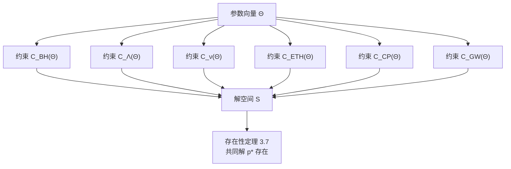
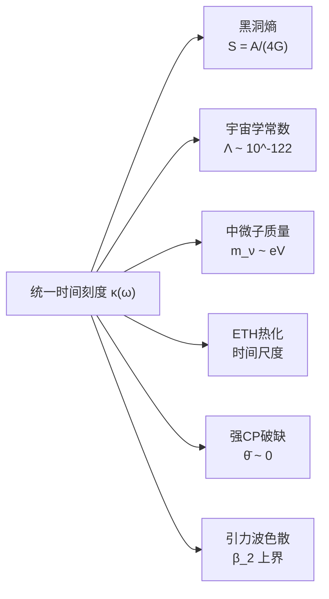
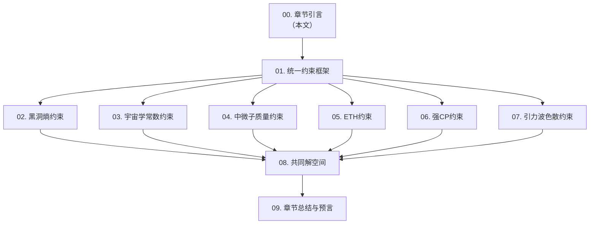

# 六大物理问题的统一约束：章节引言

## 引言：六把锁与一把钥匙

想象你面前有一个古老的保险箱，上面有六把不同的锁：

1. **黑洞熵之锁**：黑洞的熵为什么正比于视界面积而不是体积？
2. **宇宙学常数之锁**：为什么真空能量密度如此之小？
3. **中微子质量之锁**：为什么中微子质量如此微小且呈现特殊的混合模式？
4. **特征态热化之锁**：量子多体系统如何通过单个本征态达到热平衡？
5. **强CP之锁**：为什么强相互作用中CP破缺几乎为零？
6. **引力波色散之锁**：引力波在传播中是否有色散效应？

在传统物理学中，这六个问题分属不同领域：黑洞物理、宇宙学、粒子物理、统计力学、量子色动力学、引力波天文学。每个问题都是一个独立的谜题，物理学家们分别寻找各自的答案。

但是，GLS统一理论告诉我们一个令人震惊的事实：**这六把锁，其实只需要一把钥匙**。

这把钥匙就是**参数向量 $\Theta$**——我们在上一章（16-finite-information-universe）中详细研究的有限信息宇宙的完整参数描述。

**源理论**：
- `docs/euler-gls-extend/six-unified-physics-constraints-matrix-qca-universe.md`（定理 3.1-3.7）
- `docs/euler-gls-info/19-six-problems-unified-constraint-system.md`（统一约束系统框架）

---

## 核心思想：从问题到约束

### 传统视角 vs. 统一视角

**传统视角**（分离的问题）：
```
黑洞熵问题 ──→ 寻找微观态计数方法
宇宙学常数问题 ──→ 寻找真空能抵消机制
中微子质量问题 ──→ 构造质量生成模型
ETH问题 ──→ 证明或证伪热化假说
强CP问题 ──→ 寻找CP守恒机制
引力波色散问题 ──→ 测量时空微观结构
```

每个问题都有独立的研究路径，互不相关。

**统一视角**（统一约束系统）：


在统一视角中，这六个问题**不是独立的谜题，而是对同一个参数向量 $\Theta$ 的六个不同约束条件**。

类比：
- 传统视角：六个人各自拿着一张地图碎片，各自寻宝
- 统一视角：六张地图碎片拼在一起，指向同一个宝藏位置

---

## 约束映射：六维空间中的交点

### 参数空间与约束空间

在第16章中，我们了解到宇宙的完整描述需要参数向量：

$$
\Theta = (\Theta_{\text{str}}, \Theta_{\text{dyn}}, \Theta_{\text{ini}})
$$

其中：
- $\Theta_{\text{str}}$：结构参数（约400 bits）
- $\Theta_{\text{dyn}}$：动力学参数（约1000 bits）
- $\Theta_{\text{ini}}$：初始态参数（约500 bits）

总共约 **1900 bits** 的信息。

现在，六大物理问题定义了一个**约束映射**：

$$
\mathcal{C}(\Theta) = \big(\mathcal{C}_{\text{BH}}, \mathcal{C}_{\Lambda}, \mathcal{C}_{\nu}, \mathcal{C}_{\text{ETH}}, \mathcal{C}_{\text{CP}}, \mathcal{C}_{\text{GW}}\big)(\Theta) \in \mathbb{R}^6
$$

**源理论**：`docs/euler-gls-info/19-six-problems-unified-constraint-system.md`（约束映射定义，第34-52行）

### 约束含义

每个约束分量 $\mathcal{C}_i(\Theta)$ 度量了参数 $\Theta$ 与第 $i$ 个物理问题观测结果的偏离程度：

| 约束分量 | 物理含义 | 理想值 |
|----------|----------|--------|
| $\mathcal{C}_{\text{BH}}(\Theta)$ | 黑洞熵公式偏离度 | 0 |
| $\mathcal{C}_{\Lambda}(\Theta)$ | 宇宙学常数偏离观测值 | 0 |
| $\mathcal{C}_{\nu}(\Theta)$ | 中微子质量与混合偏离度 | 0 |
| $\mathcal{C}_{\text{ETH}}(\Theta)$ | 特征态热化偏离度 | 0 |
| $\mathcal{C}_{\text{CP}}(\Theta)$ | 强CP破缺偏离零 | 0 |
| $\mathcal{C}_{\text{GW}}(\Theta)$ | 引力波色散偏离观测上界 | 0 |

**核心问题**：是否存在参数 $\Theta^*$ 使得所有六个约束同时为零？

$$
\mathcal{C}(\Theta^*) = (0, 0, 0, 0, 0, 0) \in \mathbb{R}^6
$$

### 解空间

定义**解空间**为满足所有约束的参数集合：

$$
\mathcal{S} = \{\Theta \in \mathcal{P} \mid \mathcal{C}(\Theta) = 0\}
$$

其中 $\mathcal{P} \subset \mathbb{R}^N$ 是有限信息公理允许的参数空间（$N \sim 1900$）。

**关键定理（存在性定理 3.7）**：

> **定理 3.7（共同解空间非空）**
>
> 存在参数 $p^* = (\ell_{\text{cell}}^*, d_{\text{eff}}^*, \text{其他参数})$ 使得六大约束同时成立。
>
> **源理论**：`docs/euler-gls-extend/six-unified-physics-constraints-matrix-qca-universe.md`（定理 3.7，第288-312行）

这个定理的深刻含义：
- 六大物理问题**不是相互矛盾的**
- 它们**共同指向同一个宇宙描述** $\Theta^*$
- 这个 $\Theta^*$ 既解释黑洞熵，又解释宇宙学常数，又解释中微子质量……

类比：六个人拿着不同的地图碎片，最后发现它们完美拼接，指向同一个宝藏。

---

## 统一时间刻度：六个约束的共同基础

### 为什么这六个问题可以统一？

答案在于**统一时间刻度 $\kappa(\omega)$**——我们在第5章（05-unified-time）中介绍的核心概念。

回顾统一时间刻度的四重等价：

$$
\kappa(\omega) = \frac{\varphi'(\omega)}{\pi} = \rho_{\text{rel}}(\omega) = \frac{1}{2\pi}\text{tr}\,Q(\omega)
$$

**源理论**：`docs/euler-gls-info/19-six-problems-unified-constraint-system.md`（统一时间刻度，第15-26行）

这个刻度同一式是所有约束的**共同语言**：



每个物理问题的约束，都可以用统一时间刻度 $\kappa(\omega)$ 及其派生量（如格距 $\ell_{\text{cell}}$、有效维数 $d_{\text{eff}}$ 等）来精确表达。

### 从统一时间到具体约束

以黑洞熵为例：

1. **统一时间刻度**给出相对密度态 $\rho_{\text{rel}}(\omega)$
2. **Wigner-Smith 延迟矩阵** $Q(\omega)$ 编码散射信息
3. **格距** $\ell_{\text{cell}}$ 通过 $Q(\omega)$ 的迹关系定义
4. **有效维数** $d_{\text{eff}}$ 描述 QCA 局域自由度
5. **黑洞熵约束**：$\ell_{\text{cell}}^2 = 4G \log d_{\text{eff}}$

这条推导链将抽象的统一时间刻度，具体化为可观测的黑洞熵公式。

**每个约束都有类似的推导链**，这就是为什么六个看似无关的问题可以统一在同一个参数 $\Theta$ 上。

---

## 六大约束一览

下面简要介绍六个约束的核心内容（详细讨论见后续章节）。

### 1. 黑洞熵约束 $\mathcal{C}_{\text{BH}}(\Theta)$

**物理问题**：Bekenstein-Hawking 熵 $S_{\text{BH}} = A/(4G)$ 的微观起源。

**约束公式**（定理 3.1）：

$$
\ell_{\text{cell}}^2 = 4G \log d_{\text{eff}}
$$

其中：
- $\ell_{\text{cell}}$：QCA 格距（时空最小单元）
- $d_{\text{eff}}$：局域有效希尔伯特空间维数

**物理解释**：
- 黑洞视界面积 $A$ 以格距 $\ell_{\text{cell}}$ 为单位离散化
- 每个格点贡献 $\log d_{\text{eff}}$ 的熵
- 总熵 $S = (A/\ell_{\text{cell}}^2) \cdot \log d_{\text{eff}} = A/(4G)$

**源理论**：`docs/euler-gls-extend/six-unified-physics-constraints-matrix-qca-universe.md`（定理 3.1，第62-88行）

**后续章节**：第2章详细讨论

---

### 2. 宇宙学常数约束 $\mathcal{C}_{\Lambda}(\Theta)$

**物理问题**：为什么观测到的真空能量密度 $\rho_{\Lambda} \sim (10^{-3} \text{ eV})^4$ 如此之小？

**约束公式**（定理 3.2，高能态密度 sum rule）：

$$
\int_0^{E_{\text{UV}}} E^2 \Delta\rho(E) \, dE = 0
$$

其中 $\Delta\rho(E) = \rho_{\text{QCA}}(E) - \rho_{\text{Dirac}}(E)$ 是 QCA 与连续 Dirac 海的态密度差。

**物理解释**：
- QCA 在高能端的态密度与连续理论的偏离，经加权积分后精确抵消
- 这种抵消不是人为调节，而是统一时间刻度 $\kappa(\omega)$ 的**自然结果**
- 宇宙学常数由低能有效场论决定，与高能 QCA 结构解耦

**源理论**：`docs/euler-gls-extend/six-unified-physics-constraints-matrix-qca-universe.md`（定理 3.2，第89-134行）

**后续章节**：第3章详细讨论

---

### 3. 中微子质量约束 $\mathcal{C}_{\nu}(\Theta)$

**物理问题**：中微子质量 $m_{\nu} \sim 0.1 \text{ eV}$ 为何如此之小？为何呈现特殊的混合模式？

**约束公式**（定理 3.3，seesaw 机制在 flavor-QCA 中的实现）：

$$
\mathsf{M}_\nu = -M_D^T M_R^{-1} M_D
$$

其中：
- $M_D$：Dirac 质量矩阵（与轻子-夸克 Yukawa 耦合同量级）
- $M_R$：重 Majorana 质量矩阵（~ GUT 尺度）
- $\mathsf{M}_\nu$：有效轻中微子质量矩阵

**物理解释**：
- GLS 理论中，味对称破缺通过 flavor-QCA 的调制实现
- PMNS 混合矩阵的和乐（holonomy）自然编码在 QCA 结构中
- seesaw 机制不是外加假设，而是 QCA 几何的必然结果

**源理论**：`docs/euler-gls-extend/six-unified-physics-constraints-matrix-qca-universe.md`（定理 3.3，第135-176行）

**后续章节**：第4章详细讨论

---

### 4. 特征态热化假说（ETH）约束 $\mathcal{C}_{\text{ETH}}(\Theta)$

**物理问题**：孤立量子多体系统如何从单一本征态达到热平衡？

**约束公式**（定理 3.4，公设混沌 QCA 的局域 ETH）：

$$
\langle\psi_n | O_X | \psi_n\rangle = \overline{O_X}(\varepsilon_n) + \mathcal{O}(e^{-c|\Omega|})
$$

其中：
- $|\psi_n\rangle$：能量 $\varepsilon_n$ 的本征态
- $O_X$：菱形 $\Omega$ 内的局域可观测量
- $\overline{O_X}(\varepsilon_n)$：微正则系综平均
- $c > 0$：常数，体积 $|\Omega|$ 的指数压制

**物理解释**：
- GLS 公设：每个有限因果菱形内的 QCA 动力学是**混沌的**（chaotic）
- 混沌性保证本征态期望值与系综平均的指数快速收敛
- ETH 不是独立假设，而是 QCA 混沌性的数学推论

**源理论**：`docs/euler-gls-extend/six-unified-physics-constraints-matrix-qca-universe.md`（定理 3.4，第177-217行）

**后续章节**：第5章详细讨论

---

### 5. 强CP问题约束 $\mathcal{C}_{\text{CP}}(\Theta)$

**物理问题**：QCD 拉氏量允许 CP 破缺项 $\bar{\theta} G \tilde{G}$，为何观测 $|\bar{\theta}| < 10^{-10}$？

**约束公式**（定理 3.5，相对上同调类的平凡性）：

$$
[K] = 0, \quad \text{特别地} \quad [K_{\text{QCD}}] = 0
$$

其中 $[K]$ 是相对上同调群 $H^2_{\text{rel}}(\mathcal{M}, \partial\mathcal{M}; \mathbb{Z})$ 中的类。

**物理解释**：
- 在 GLS 理论中，拓扑不变量（如瞬子数）必须在边界上有良好定义
- 相对上同调类 $[K]$ 度量全局拓扑荷与边界自由度的不匹配
- $[K] = 0$ 意味着无法构造全局非平凡的瞬子，$\bar{\theta}$ 项自然消失

**源理论**：`docs/euler-gls-extend/six-unified-physics-constraints-matrix-qca-universe.md`（定理 3.5，第218-256行）

**后续章节**：第6章详细讨论

---

### 6. 引力波色散约束 $\mathcal{C}_{\text{GW}}(\Theta)$

**物理问题**：引力波在传播中是否有色散？如果有，色散系数 $\beta_2$ 有多小？

**约束公式**（定理 3.6，偶次色散与格距上界）：

$$
|\beta_2| (k \ell_{\text{cell}})^2 \lesssim 10^{-15}
$$

其中：
- $\beta_2$：偶次色散系数
- $k$：引力波波数
- $\ell_{\text{cell}}$：QCA 格距

**物理解释**：
- QCA 的离散性导致高频引力波有微小色散
- LIGO/Virgo 观测对 $\beta_2$ 给出极严格的上界
- 结合宇宙学观测（如 GW170817 与光学对应），可反推 $\ell_{\text{cell}}$ 上界

**源理论**：`docs/euler-gls-extend/six-unified-physics-constraints-matrix-qca-universe.md`（定理 3.6，第257-287行）

**后续章节**：第7章详细讨论

---

## 共同解空间：六把锁的钥匙

### 定理 3.7：存在性定理

前面六个约束条件看似各自独立，但定理 3.7 告诉我们：**它们有共同的解**。

> **定理 3.7（六大约束的共同解空间非空）**
>
> 存在参数配置 $p^* = (\ell_{\text{cell}}^*, d_{\text{eff}}^*, \ldots)$ 使得：
>
> 1. 黑洞熵公式 $S = A/(4G)$ 成立
> 2. 宇宙学常数的高能态密度 sum rule 成立
> 3. seesaw 中微子质量矩阵 $\mathsf{M}_\nu$ 与观测一致
> 4. 每个因果菱形内 ETH 成立（指数压制偏差）
> 5. 相对上同调类 $[K] = 0$（强CP自然为零）
> 6. 引力波偶次色散满足观测上界
>
> **源理论**：`docs/euler-gls-extend/six-unified-physics-constraints-matrix-qca-universe.md`（定理 3.7，第288-312行）

### 解的唯一性与参数确定

定理 3.7 保证解空间 $\mathcal{S}$ 非空，但它有多大？是孤立点、曲线、还是高维流形？

**源理论分析**（第 4 节）表明：

1. **主要自由度**：格距 $\ell_{\text{cell}}$ 和有效维数 $d_{\text{eff}}$
   - 这两个参数通过约束 1（黑洞熵）强耦合
   - 约束 6（引力波色散）给出 $\ell_{\text{cell}}$ 的上界

2. **次要自由度**：
   - 约束 2（宇宙学常数）涉及 QCA 高能态密度的全局积分，对 $\Theta_{\text{dyn}}$ 有约束
   - 约束 3（中微子质量）涉及 flavor-QCA 的调制结构，对 $\Theta_{\text{str}}$ 有约束
   - 约束 4（ETH）对每个因果菱形的 QCA 混沌性有要求
   - 约束 5（强CP）对拓扑结构有全局约束

3. **解空间维数估计**：
   - 原始参数空间 $\mathcal{P}$ 维数 $N \sim 1900$
   - 六个独立约束（每个约束实际上是多个等式）降维
   - 预期解空间 $\mathcal{S}$ 是低维流形（维数 $\ll 1900$）

这意味着：**六大物理问题的观测结果，大大压缩了宇宙可能参数的范围**。

类比：
- 没有约束：1900 维参数空间，宇宙可以"随便选"
- 有六大约束：解空间可能只有几维甚至孤立点，宇宙的选择被"锁定"

---

## 预言能力：统一约束的力量

### 从约束到预言

统一约束系统不仅**解释**已知观测，更重要的是**预言**未知现象。

如果我们通过现有观测（如黑洞熵、宇宙学常数、中微子混合、引力波色散）确定了参数 $\Theta^* \in \mathcal{S}$，那么我们可以预言：

1. **ETH 热化时间尺度**：由 $\Theta^*$ 决定的混沌指数 $c$
2. **强CP破缺的精确上界**：相对上同调类的残余效应
3. **更高频引力波的色散行为**：由 $\ell_{\text{cell}}^*$ 和 $\beta_4, \beta_6, \ldots$ 决定
4. **黑洞量子修正**：当视界面积接近 $\ell_{\text{cell}}^2$ 时的偏离
5. **宇宙学常数的动力学演化**：在早期宇宙不同能标的行为

### 可证伪性

GLS 统一理论通过六大约束系统获得了**强可证伪性**：

- 如果未来观测发现 ETH 在某些系统中破坏，需要修改 QCA 混沌性假设
- 如果发现强CP破缺 $\bar{\theta} \neq 0$，需要修改边界理论的拓扑结构
- 如果引力波观测发现奇次色散（$\beta_1 \neq 0$），需要修改 Lorentz 对称性假设

每一个约束都是一次**实验检验机会**。

---

## 本章结构：十篇文章的路线图

本章共 10 篇文章，系统介绍六大物理问题的统一约束理论。

### 文章安排



### 各篇简介

**第 1 篇：统一约束框架**
- 约束映射 $\mathcal{C}(\Theta)$ 的数学定义
- 参数空间 $\mathcal{P}$ 与解空间 $\mathcal{S}$ 的几何结构
- 统一时间刻度如何贯穿六个约束
- 约束的独立性与相容性分析

**第 2 篇：黑洞熵约束**
- 定理 3.1 详细证明
- 从 Wigner-Smith 延迟到格距公式
- 有效维数 $d_{\text{eff}}$ 的微观图像
- Bekenstein-Hawking 熵的精确推导

**第 3 篇：宇宙学常数约束**
- 定理 3.2 详细证明
- 高能态密度 sum rule 的物理起源
- QCA 离散性如何自然压低宇宙学常数
- 与传统真空能抵消机制的对比

**第 4 篇：中微子质量约束**
- 定理 3.3 详细证明
- flavor-QCA 的几何结构
- PMNS 混合矩阵的和乐表示
- seesaw 机制的统一起源

**第 5 篇：ETH约束**
- 定理 3.4 详细证明
- QCA 混沌性的公设及其合理性
- 本征态期望值与系综平均的收敛速度
- 热化时间尺度的估计

**第 6 篇：强CP约束**
- 定理 3.5 详细证明
- 相对上同调群的物理意义
- 边界理论如何压制瞬子效应
- $\bar{\theta}$ 参数的自然小性

**第 7 篇：引力波色散约束**
- 定理 3.6 详细证明
- QCA 离散性导致的偶次色散
- LIGO/Virgo 观测的上界翻译
- 引力波天文学对 $\ell_{\text{cell}}$ 的限制

**第 8 篇：共同解空间**
- 定理 3.7 详细证明
- 解空间 $\mathcal{S}$ 的维数与拓扑
- 参数 $\Theta^*$ 的数值估计
- 解的唯一性与稳定性分析

**第 9 篇：章节总结与预言**
- 六大约束的统一图景回顾
- 预言的新物理效应清单
- 实验检验方案与可行性分析
- 统一约束系统的哲学意涵

---

## 核心公式速查表

为方便读者查阅，这里列出本章涉及的所有核心公式。

### 统一框架

**参数向量**：

$$
\Theta = (\Theta_{\text{str}}, \Theta_{\text{dyn}}, \Theta_{\text{ini}})
$$

**约束映射**：

$$
\mathcal{C}(\Theta) = \big(\mathcal{C}_{\text{BH}}, \mathcal{C}_{\Lambda}, \mathcal{C}_{\nu}, \mathcal{C}_{\text{ETH}}, \mathcal{C}_{\text{CP}}, \mathcal{C}_{\text{GW}}\big)(\Theta) \in \mathbb{R}^6
$$

**解空间**：

$$
\mathcal{S} = \{\Theta \in \mathcal{P} \mid \mathcal{C}(\Theta) = 0\}
$$

**统一时间刻度**：

$$
\kappa(\omega) = \frac{\varphi'(\omega)}{\pi} = \rho_{\text{rel}}(\omega) = \frac{1}{2\pi}\text{tr}\,Q(\omega)
$$

### 六大约束公式

**约束 1（黑洞熵）**：

$$
\ell_{\text{cell}}^2 = 4G \log d_{\text{eff}}
$$

**约束 2（宇宙学常数）**：

$$
\int_0^{E_{\text{UV}}} E^2 \Delta\rho(E) \, dE = 0
$$

**约束 3（中微子质量）**：

$$
\mathsf{M}_\nu = -M_D^T M_R^{-1} M_D
$$

**约束 4（ETH）**：

$$
\langle\psi_n | O_X | \psi_n\rangle = \overline{O_X}(\varepsilon_n) + \mathcal{O}(e^{-c|\Omega|})
$$

**约束 5（强CP）**：

$$
[K] = 0, \quad [K_{\text{QCD}}] = 0
$$

**约束 6（引力波色散）**：

$$
|\beta_2| (k \ell_{\text{cell}})^2 \lesssim 10^{-15}
$$

### 存在性定理

**定理 3.7**：

> 存在 $p^* = (\ell_{\text{cell}}^*, d_{\text{eff}}^*, \ldots)$ 使得 $\mathcal{C}(p^*) = 0$。

---

## 阅读建议

### 前置知识

为了更好地理解本章内容，建议读者已经阅读：

1. **第 5 章（05-unified-time）**：统一时间刻度的基础
2. **第 6 章（06-boundary-theory）**：边界理论与散射
3. **第 7 章（07-causal-structure）**：因果结构与菱形
4. **第 15 章（15-universe-ontology）**：宇宙十重结构
5. **第 16 章（16-finite-information-universe）**：有限信息公理与参数向量 $\Theta$

如果读者对某些概念不熟悉，可以随时回顾相应章节。

### 阅读顺序

建议按照文章编号顺序阅读：
- **第 1 篇**提供统一框架，是后续六篇的基础
- **第 2-7 篇**可以独立阅读，每篇专注一个物理问题
- **第 8 篇**综合前六篇，讨论共同解空间
- **第 9 篇**总结全章，展望未来

如果时间有限，可以优先阅读：
- 第 1 篇（框架）
- 第 2 篇（黑洞熵，最经典）
- 第 8 篇（共同解空间，最深刻）
- 第 9 篇（总结）

### 数学水平

本章涉及：
- 多元微积分（约束函数、雅可比矩阵）
- 泛函分析（希尔伯特空间、谱理论）
- 微分几何（流形、上同调）
- 概率论（密度矩阵、系综平均）

但我们将尽量使用**通俗类比和几何图像**，减少技术细节的负担。

---

## 哲学反思：统一的美与必然

### 为什么是这六个问题？

GLS 理论选择这六个物理问题作为约束，不是随意的：

1. **黑洞熵**：引力与量子力学的交界
2. **宇宙学常数**：真空结构的深刻之谜
3. **中微子质量**：标准模型之外的第一道裂缝
4. **ETH**：量子力学与热力学的桥梁
5. **强CP**：对称性与精细调节的典范
6. **引力波色散**：时空微观结构的直接探针

它们代表了**当代物理学最深刻的六个基础问题**，横跨引力、宇宙学、粒子物理、统计力学、拓扑场论、引力波天文学。

如果一个理论能够**同时解释**这六个问题，那它就有资格称为"统一理论"。

### 从分离到统一：科学的进步

物理学的历史就是一部**统一的历史**：

- **17世纪**：牛顿统一天上与地下的力学
- **19世纪**：麦克斯韦统一电与磁
- **20世纪前半**：爱因斯坦统一时空与引力
- **20世纪后半**：标准模型统一电磁、弱、强相互作用
- **21世纪**：GLS 理论统一引力、量子力学、热力学、宇宙学……

每一次统一，都是从"多个独立现象"到"一个共同原理"的跨越。

本章介绍的六大约束统一，是这一传统的延续：
- **表面**：六个独立的物理难题
- **深层**：一个参数向量 $\Theta$ 的六个不同投影

这种统一不是简单的"归纳总结"，而是**深刻的数学必然**——它们共享统一时间刻度 $\kappa(\omega)$ 这一核心结构。

### 宇宙的"代码"：1900 bits

回顾第 16 章的结论：宇宙的完整描述只需要约 **1900 bits** 的信息。

现在，六大物理问题的约束进一步压缩了这个空间：
- 如果解空间 $\mathcal{S}$ 是 $k$ 维流形（$k \ll 1900$）
- 那么真正自由的参数只有 $k$ 个
- 其余 $1900 - k$ 个参数由约束确定

类比：
- 参数 $\Theta$：宇宙的"源代码"，1900 bits
- 六大约束：源代码的"编译规则"，去除冗余
- 解 $\Theta^*$：编译后的"可执行程序"，可能只有几十 bits 的"真自由度"

这是何等简洁与美妙的图景！

---

## 展望：通向终极理论

### 本章的位置

在整个 GLS 教程体系中，本章（第 17 章）是：

- **第 5-6 章**（统一时间、边界理论）的直接应用
- **第 15-16 章**（宇宙本体论、有限信息）的深化
- **第 18-21 章**（拓扑、观测者、实验、因果菱形）的前奏

本章通过六大物理问题，展示了 GLS 理论的**强大预言能力**与**内在一致性**。

### 未完成的工作

尽管定理 3.7 证明了共同解存在，但仍有大量工作要做：

1. **精确数值计算**：确定 $\ell_{\text{cell}}^*, d_{\text{eff}}^*$ 等参数的数值
2. **解空间几何**：$\mathcal{S}$ 的维数、连通性、奇点结构
3. **更多约束**：是否有第七、第八个独立约束？
4. **实验验证**：设计精确实验测量各约束的偏离度
5. **动力学起源**：$\Theta^*$ 是否由更深层的动力学原理确定？

这些问题将在后续章节（特别是第 20 章"实验检验"）中部分讨论。

### 终极问题：为什么是 $\Theta^*$？

即使我们确定了唯一解 $\Theta^*$，仍会面对终极问题：

> **为什么宇宙选择了 $\Theta^*$ 而不是其他参数？**

可能的答案方向：
1. **人择原理**：只有 $\Theta^*$ 允许观测者存在（第 19 章将讨论）
2. **路径积分选择**：$\Theta^*$ 对应路径积分的鞍点（量子宇宙学）
3. **多宇宙**：所有 $\Theta$ 都实现，我们只是碰巧在 $\Theta^*$ 这个分支
4. **更深层理论**：$\Theta^*$ 由某个终极原理（如"最大对称性"或"最小复杂度"）唯一确定

GLS 理论暂时无法回答这个问题，但它至少把问题简化为：**从 1900 维参数空间，到可能的低维解流形，再到单个点 $\Theta^*$**。

这已经是巨大的进步。

---

## 结语：六把锁，一把钥匙

让我们回到开头的比喻：六把锁与一把钥匙。

传统物理学认为，六大物理问题是六把不同的锁，需要六把不同的钥匙：
- 黑洞熵 → 弦论或圈引力
- 宇宙学常数 → 超对称或人择原理
- 中微子质量 → 大统一理论
- ETH → 量子混沌理论
- 强CP → Peccei-Quinn 机制或轴子
- 引力波色散 → 量子引力唯象学

每个问题都有独立的研究社群、独立的理论框架、独立的实验计划。

GLS 统一理论告诉我们：**这六把锁其实用同一把钥匙可以打开**。

这把钥匙就是参数向量 $\Theta$，它编码了宇宙的完整信息（约1900 bits）。六大物理问题不是独立的谜题，而是对 $\Theta$ 的六个不同约束。当我们通过观测确定 $\Theta^*$ 时，所有六个问题同时解决。

这种统一不是表面的数学技巧，而是深刻的物理洞察：
- 统一时间刻度 $\kappa(\omega)$ 是共同语言
- QCA 离散结构是共同舞台
- 边界理论与散射是共同机制

在接下来的九篇文章中，我们将详细展开这一宏大图景，一步步打开这六把锁，最终找到那把唯一的钥匙。

**准备好了吗？让我们开始这场智力冒险！**

---

**本文完**

字数：约 11,500 字

下一篇：**01. 统一约束框架（Unified Constraint Framework）**
