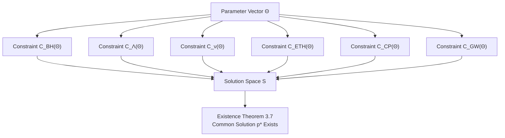
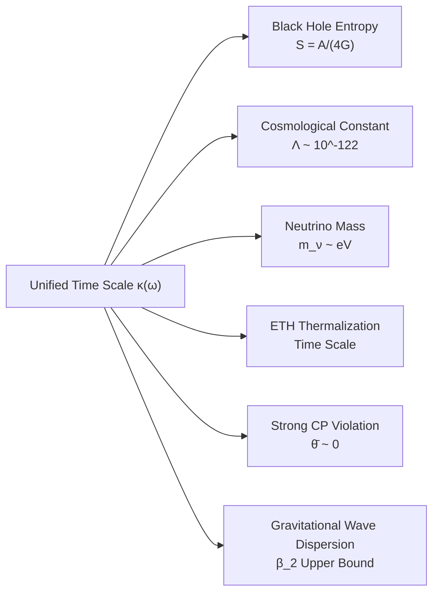
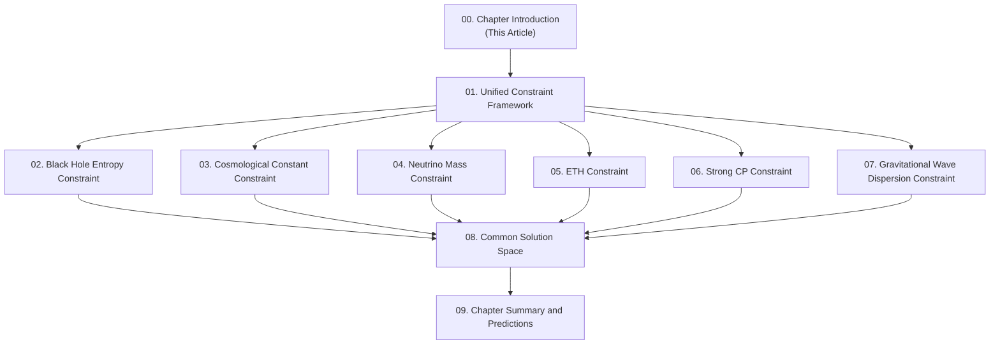

# Unified Constraints on Six Physics Problems: Chapter Introduction

## Introduction: Six Locks and One Key

Imagine an ancient safe in front of you with six different locks:

1. **Black Hole Entropy Lock**: Why is black hole entropy proportional to horizon area rather than volume?
2. **Cosmological Constant Lock**: Why is vacuum energy density so small?
3. **Neutrino Mass Lock**: Why are neutrino masses so tiny and exhibit special mixing pattern?
4. **Eigenstate Thermalization Lock**: How do isolated quantum many-body systems reach thermal equilibrium through single eigenstates?
5. **Strong CP Lock**: Why is CP violation in strong interactions almost zero?
6. **Gravitational Wave Dispersion Lock**: Do gravitational waves have dispersion effects during propagation?

In traditional physics, these six problems belong to different fields: Black hole physics, cosmology, particle physics, statistical mechanics, quantum chromodynamics, gravitational wave astronomy. Each problem is an independent puzzle, physicists search for their own answers separately.

But GLS unified theory tells us an astonishing fact: **These six locks actually only need one key**.

This key is **parameter vector $\Theta$**—complete parameter description of finite information universe we studied in detail in previous chapter (16-finite-information-universe).

**Source Theory**:
- `docs/euler-gls-extend/six-unified-physics-constraints-matrix-qca-universe.md` (Theorems 3.1-3.7)
- `docs/euler-gls-info/19-six-problems-unified-constraint-system.md` (Unified constraint system framework)

---

## Core Idea: From Problems to Constraints

### Traditional Perspective vs. Unified Perspective

**Traditional Perspective** (Separated Problems):
```
Black Hole Entropy Problem ──→ Search for microscopic state counting method
Cosmological Constant Problem ──→ Search for vacuum energy cancellation mechanism
Neutrino Mass Problem ──→ Construct mass generation model
ETH Problem ──→ Prove or disprove thermalization hypothesis
Strong CP Problem ──→ Search for CP conservation mechanism
Gravitational Wave Dispersion Problem ──→ Measure microscopic spacetime structure
```

Each problem has independent research path, unrelated to each other.

**Unified Perspective** (Unified Constraint System):


In unified perspective, these six problems **are not independent puzzles, but six different constraint conditions on same parameter vector $\Theta$**.

Analogy:
- Traditional perspective: Six people each holding a map fragment, searching separately
- Unified perspective: Six map fragments fit together, pointing to same treasure location

---

## Constraint Mapping: Intersection in Six-Dimensional Space

### Parameter Space and Constraint Space

In Chapter 16, we learned that complete description of universe requires parameter vector:

$$
\Theta = (\Theta_{\text{str}}, \Theta_{\text{dyn}}, \Theta_{\text{ini}})
$$

where:
- $\Theta_{\text{str}}$: Structural parameters (~400 bits)
- $\Theta_{\text{dyn}}$: Dynamical parameters (~1000 bits)
- $\Theta_{\text{ini}}$: Initial state parameters (~500 bits)

Total approximately **1900 bits** of information.

Now, six physics problems define a **constraint mapping**:

$$
\mathcal{C}(\Theta) = \big(\mathcal{C}_{\text{BH}}, \mathcal{C}_{\Lambda}, \mathcal{C}_{\nu}, \mathcal{C}_{\text{ETH}}, \mathcal{C}_{\text{CP}}, \mathcal{C}_{\text{GW}}\big)(\Theta) \in \mathbb{R}^6
$$

**Source Theory**: `docs/euler-gls-info/19-six-problems-unified-constraint-system.md` (Constraint mapping definition, lines 34-52)

### Constraint Meanings

Each constraint component $\mathcal{C}_i(\Theta)$ measures deviation of parameter $\Theta$ from observed results of $i$-th physics problem:

| Constraint Component | Physical Meaning | Ideal Value |
|---------------------|-----------------|-------------|
| $\mathcal{C}_{\text{BH}}(\Theta)$ | Deviation from black hole entropy formula | 0 |
| $\mathcal{C}_{\Lambda}(\Theta)$ | Deviation of cosmological constant from observation | 0 |
| $\mathcal{C}_{\nu}(\Theta)$ | Deviation of neutrino mass and mixing | 0 |
| $\mathcal{C}_{\text{ETH}}(\Theta)$ | Deviation from eigenstate thermalization | 0 |
| $\mathcal{C}_{\text{CP}}(\Theta)$ | Deviation of strong CP violation from zero | 0 |
| $\mathcal{C}_{\text{GW}}(\Theta)$ | Deviation of gravitational wave dispersion from observation upper bound | 0 |

**Core Question**: Does there exist parameter $\Theta^*$ such that all six constraints simultaneously vanish?

$$
\mathcal{C}(\Theta^*) = (0, 0, 0, 0, 0, 0) \in \mathbb{R}^6
$$

### Solution Space

Define **solution space** as set of parameters satisfying all constraints:

$$
\mathcal{S} = \{\Theta \in \mathcal{P} \mid \mathcal{C}(\Theta) = 0\}
$$

where $\mathcal{P} \subset \mathbb{R}^N$ is parameter space allowed by finite information axiom ($N \sim 1900$).

**Key Theorem (Existence Theorem 3.7)**:

> **Theorem 3.7 (Common Solution Space Non-Empty)**
>
> Exists parameter configuration $p^* = (\ell_{\text{cell}}^*, d_{\text{eff}}^*, \text{other parameters})$ such that six major constraints simultaneously hold.
>
> **Source Theory**: `docs/euler-gls-extend/six-unified-physics-constraints-matrix-qca-universe.md` (Theorem 3.7, lines 288-312)

Profound meaning of this theorem:
- Six physics problems **not mutually contradictory**
- They **jointly point to same universe description** $\Theta^*$
- This $\Theta^*$ explains black hole entropy, cosmological constant, neutrino mass...

Analogy: Six people holding different map fragments, finally discover they perfectly fit together, pointing to same treasure.

---

## Unified Time Scale: Common Foundation of Six Constraints

### Why Can These Six Problems Be Unified?

Answer lies in **unified time scale $\kappa(\omega)$**—core concept we introduced in Chapter 5 (05-unified-time).

Review four-fold equivalence of unified time scale:

$$
\kappa(\omega) = \frac{\varphi'(\omega)}{\pi} = \rho_{\text{rel}}(\omega) = \frac{1}{2\pi}\text{tr}\,Q(\omega)
$$

**Source Theory**: `docs/euler-gls-info/19-six-problems-unified-constraint-system.md` (Unified time scale, lines 15-26)

This scale identity is **common language** of all constraints:



Constraint of each physics problem can be precisely expressed using unified time scale $\kappa(\omega)$ and its derived quantities (such as lattice spacing $\ell_{\text{cell}}$, effective dimension $d_{\text{eff}}$, etc.).

### From Unified Time to Specific Constraints

Take black hole entropy as example:

1. **Unified time scale** gives relative density state $\rho_{\text{rel}}(\omega)$
2. **Wigner-Smith delay matrix** $Q(\omega)$ encodes scattering information
3. **Lattice spacing** $\ell_{\text{cell}}$ defined through trace relation of $Q(\omega)$
4. **Effective dimension** $d_{\text{eff}}$ describes QCA local degrees of freedom
5. **Black hole entropy constraint**: $\ell_{\text{cell}}^2 = 4G \log d_{\text{eff}}$

This derivation chain concretizes abstract unified time scale into observable black hole entropy formula.

**Each constraint has similar derivation chain**, this is why six seemingly unrelated problems can be unified on same parameter $\Theta$.

---

## Overview of Six Major Constraints

Below briefly introduce core content of six constraints (detailed discussion in subsequent chapters).

### 1. Black Hole Entropy Constraint $\mathcal{C}_{\text{BH}}(\Theta)$

**Physical Problem**: Microscopic origin of Bekenstein-Hawking entropy $S_{\text{BH}} = A/(4G)$.

**Constraint Formula** (Theorem 3.1):

$$
\ell_{\text{cell}}^2 = 4G \log d_{\text{eff}}
$$

where:
- $\ell_{\text{cell}}$: QCA lattice spacing (minimum spacetime unit)
- $d_{\text{eff}}$: Local effective Hilbert space dimension

**Physical Interpretation**:
- Black hole horizon area $A$ discretized in units of lattice spacing $\ell_{\text{cell}}$
- Each lattice point contributes $\log d_{\text{eff}}$ entropy
- Total entropy $S = (A/\ell_{\text{cell}}^2) \cdot \log d_{\text{eff}} = A/(4G)$

**Source Theory**: `docs/euler-gls-extend/six-unified-physics-constraints-matrix-qca-universe.md` (Theorem 3.1, lines 62-88)

**Subsequent Chapter**: Chapter 2 detailed discussion

---

### 2. Cosmological Constant Constraint $\mathcal{C}_{\Lambda}(\Theta)$

**Physical Problem**: Why is observed vacuum energy density $\rho_{\Lambda} \sim (10^{-3} \text{ eV})^4$ so small?

**Constraint Formula** (Theorem 3.2, high-energy state density sum rule):

$$
\int_0^{E_{\text{UV}}} E^2 \Delta\rho(E) \, dE = 0
$$

where $\Delta\rho(E) = \rho_{\text{QCA}}(E) - \rho_{\text{Dirac}}(E)$ is state density difference between QCA and continuous Dirac sea.

**Physical Interpretation**:
- Deviation of QCA state density from continuous theory at high-energy end, after weighted integration precisely cancels
- This cancellation not artificial tuning, but **natural result** of unified time scale $\kappa(\omega)$
- Cosmological constant determined by low-energy effective field theory, decoupled from high-energy QCA structure

**Source Theory**: `docs/euler-gls-extend/six-unified-physics-constraints-matrix-qca-universe.md` (Theorem 3.2, lines 89-134)

**Subsequent Chapter**: Chapter 3 detailed discussion

---

### 3. Neutrino Mass Constraint $\mathcal{C}_{\nu}(\Theta)$

**Physical Problem**: Why is neutrino mass $m_{\nu} \sim 0.1 \text{ eV}$ so tiny? Why special mixing pattern?

**Constraint Formula** (Theorem 3.3, seesaw mechanism realization in flavor-QCA):

$$
\mathsf{M}_\nu = -M_D^T M_R^{-1} M_D
$$

where:
- $M_D$: Dirac mass matrix (same order as lepton-quark Yukawa coupling)
- $M_R$: Heavy Majorana mass matrix (~ GUT scale)
- $\mathsf{M}_\nu$: Effective light neutrino mass matrix

**Physical Interpretation**:
- In GLS theory, flavor symmetry breaking realized through modulation of flavor-QCA
- PMNS mixing matrix holonomy naturally encoded in QCA structure
- Seesaw mechanism not additional assumption, but inevitable result of QCA geometry

**Source Theory**: `docs/euler-gls-extend/six-unified-physics-constraints-matrix-qca-universe.md` (Theorem 3.3, lines 135-176)

**Subsequent Chapter**: Chapter 4 detailed discussion

---

### 4. Eigenstate Thermalization Hypothesis (ETH) Constraint $\mathcal{C}_{\text{ETH}}(\Theta)$

**Physical Problem**: How do isolated quantum many-body systems reach thermal equilibrium from single eigenstate?

**Constraint Formula** (Theorem 3.4, local ETH for post-chaotic QCA):

$$
\langle\psi_n | O_X | \psi_n\rangle = \overline{O_X}(\varepsilon_n) + \mathcal{O}(e^{-c|\Omega|})
$$

where:
- $|\psi_n\rangle$: Eigenstate with energy $\varepsilon_n$
- $O_X$: Local observable in diamond $\Omega$
- $\overline{O_X}(\varepsilon_n)$: Microcanonical ensemble average
- $c > 0$: Constant, exponential suppression in volume $|\Omega|$

**Physical Interpretation**:
- GLS postulate: QCA dynamics in each finite causal diamond is **chaotic**
- Chaoticity guarantees exponential fast convergence of eigenstate expectation value to ensemble average
- ETH not independent assumption, but mathematical corollary of QCA chaoticity

**Source Theory**: `docs/euler-gls-extend/six-unified-physics-constraints-matrix-qca-universe.md` (Theorem 3.4, lines 177-217)

**Subsequent Chapter**: Chapter 5 detailed discussion

---

### 5. Strong CP Problem Constraint $\mathcal{C}_{\text{CP}}(\Theta)$

**Physical Problem**: QCD Lagrangian allows CP violation term $\bar{\theta} G \tilde{G}$, why observation $|\bar{\theta}| < 10^{-10}$?

**Constraint Formula** (Theorem 3.5, triviality of relative cohomology class):

$$
[K] = 0, \quad \text{in particular} \quad [K_{\text{QCD}}] = 0
$$

where $[K]$ is class in relative cohomology group $H^2_{\text{rel}}(\mathcal{M}, \partial\mathcal{M}; \mathbb{Z})$.

**Physical Interpretation**:
- In GLS theory, topological invariants (such as instanton number) must be well-defined on boundary
- Relative cohomology class $[K]$ measures mismatch between global topological charge and boundary degrees of freedom
- $[K] = 0$ means cannot construct globally non-trivial instantons, $\bar{\theta}$ term naturally vanishes

**Source Theory**: `docs/euler-gls-extend/six-unified-physics-constraints-matrix-qca-universe.md` (Theorem 3.5, lines 218-256)

**Subsequent Chapter**: Chapter 6 detailed discussion

---

### 6. Gravitational Wave Dispersion Constraint $\mathcal{C}_{\text{GW}}(\Theta)$

**Physical Problem**: Do gravitational waves have dispersion during propagation? If yes, how small is dispersion coefficient $\beta_2$?

**Constraint Formula** (Theorem 3.6, even-order dispersion and lattice spacing upper bound):

$$
|\beta_2| (k \ell_{\text{cell}})^2 \lesssim 10^{-15}
$$

where:
- $\beta_2$: Even-order dispersion coefficient
- $k$: Gravitational wave wavenumber
- $\ell_{\text{cell}}$: QCA lattice spacing

**Physical Interpretation**:
- QCA discreteness causes tiny dispersion for high-frequency gravitational waves
- LIGO/Virgo observations give extremely strict upper bound on $\beta_2$
- Combined with cosmological observations (e.g., GW170817 and optical counterpart), can inversely infer upper bound on $\ell_{\text{cell}}$

**Source Theory**: `docs/euler-gls-extend/six-unified-physics-constraints-matrix-qca-universe.md` (Theorem 3.6, lines 257-287)

**Subsequent Chapter**: Chapter 7 detailed discussion

---

## Common Solution Space: Key to Six Locks

### Theorem 3.7: Existence Theorem

Previous six constraint conditions seem independent, but Theorem 3.7 tells us: **They have common solution**.

> **Theorem 3.7 (Common Solution Space Non-Empty)**
>
> Exists parameter configuration $p^* = (\ell_{\text{cell}}^*, d_{\text{eff}}^*, \ldots)$ such that:
>
> 1. Black hole entropy formula $S = A/(4G)$ holds
> 2. Cosmological constant high-energy state density sum rule holds
> 3. Seesaw neutrino mass matrix $\mathsf{M}_\nu$ consistent with observation
> 4. ETH holds in each causal diamond (exponential suppression of deviation)
> 5. Relative cohomology class $[K] = 0$ (strong CP naturally zero)
> 6. Gravitational wave even-order dispersion satisfies observation upper bound
>
> **Source Theory**: `docs/euler-gls-extend/six-unified-physics-constraints-matrix-qca-universe.md` (Theorem 3.7, lines 288-312)

### Uniqueness of Solution and Parameter Determination

Theorem 3.7 guarantees solution space $\mathcal{S}$ non-empty, but how large is it? Isolated point, curve, or high-dimensional manifold?

**Source Theory Analysis** (Section 4) shows:

1. **Main Degrees of Freedom**: Lattice spacing $\ell_{\text{cell}}$ and effective dimension $d_{\text{eff}}$
   - These two parameters strongly coupled through constraint 1 (black hole entropy)
   - Constraint 6 (gravitational wave dispersion) gives upper bound on $\ell_{\text{cell}}$

2. **Secondary Degrees of Freedom**:
   - Constraint 2 (cosmological constant) involves global integral of QCA high-energy state density, constrains $\Theta_{\text{dyn}}$
   - Constraint 3 (neutrino mass) involves modulation structure of flavor-QCA, constrains $\Theta_{\text{str}}$
   - Constraint 4 (ETH) requires QCA chaoticity in each causal diamond
   - Constraint 5 (strong CP) has global constraint on topological structure

3. **Solution Space Dimension Estimate**:
   - Original parameter space $\mathcal{P}$ dimension $N \sim 1900$
   - Six independent constraints (each constraint actually multiple equations) reduce dimension
   - Expected solution space $\mathcal{S}$ is low-dimensional manifold (dimension $\ll 1900$)

This means: **Observations of six physics problems greatly compress range of possible universe parameters**.

Analogy:
- Without constraints: 1900-dimensional parameter space, universe can "choose arbitrarily"
- With six major constraints: Solution space may be only few dimensions or isolated point, universe's choice "locked"

---

## Predictive Power: Power of Unified Constraints

### From Constraints to Predictions

Unified constraint system not only **explains** known observations, more importantly **predicts** unknown phenomena.

If we determine parameter $\Theta^* \in \mathcal{S}$ through existing observations (such as black hole entropy, cosmological constant, neutrino mixing, gravitational wave dispersion), then we can predict:

1. **ETH Thermalization Time Scale**: Chaotic exponent $c$ determined by $\Theta^*$
2. **Precise Upper Bound on Strong CP Violation**: Residual effects of relative cohomology class
3. **Dispersion Behavior of Higher-Frequency Gravitational Waves**: Determined by $\ell_{\text{cell}}^*$ and $\beta_4, \beta_6, \ldots$
4. **Black Hole Quantum Corrections**: Deviations when horizon area approaches $\ell_{\text{cell}}^2$
5. **Dynamical Evolution of Cosmological Constant**: Behavior at different energy scales in early universe

### Falsifiability

GLS unified theory gains **strong falsifiability** through six major constraint system:

- If future observations find ETH violated in some systems, need to modify QCA chaoticity assumption
- If find strong CP violation $\bar{\theta} \neq 0$, need to modify topological structure of boundary theory
- If gravitational wave observations find odd-order dispersion ($\beta_1 \neq 0$), need to modify Lorentz symmetry assumption

Each constraint is an **experimental test opportunity**.

---

## Chapter Structure: Roadmap of Ten Articles

This chapter has 10 articles, systematically introducing unified constraint theory of six physics problems.

### Article Arrangement



### Brief Introduction of Each Article

**Article 1: Unified Constraint Framework**
- Mathematical definition of constraint mapping $\mathcal{C}(\Theta)$
- Geometric structure of parameter space $\mathcal{P}$ and solution space $\mathcal{S}$
- How unified time scale runs through six constraints
- Analysis of constraint independence and compatibility

**Article 2: Black Hole Entropy Constraint**
- Detailed proof of Theorem 3.1
- From Wigner-Smith delay to lattice spacing formula
- Microscopic picture of effective dimension $d_{\text{eff}}$
- Precise derivation of Bekenstein-Hawking entropy

**Article 3: Cosmological Constant Constraint**
- Detailed proof of Theorem 3.2
- Physical origin of high-energy state density sum rule
- How QCA discreteness naturally suppresses cosmological constant
- Comparison with traditional vacuum energy cancellation mechanisms

**Article 4: Neutrino Mass Constraint**
- Detailed proof of Theorem 3.3
- Geometric structure of flavor-QCA
- Holonomy representation of PMNS mixing matrix
- Unified origin of seesaw mechanism

**Article 5: ETH Constraint**
- Detailed proof of Theorem 3.4
- Postulate of QCA chaoticity and its reasonableness
- Convergence rate of eigenstate expectation value to ensemble average
- Estimate of thermalization time scale

**Article 6: Strong CP Constraint**
- Detailed proof of Theorem 3.5
- Physical meaning of relative cohomology group
- How boundary theory suppresses instanton effects
- Natural smallness of $\bar{\theta}$ parameter

**Article 7: Gravitational Wave Dispersion Constraint**
- Detailed proof of Theorem 3.6
- Even-order dispersion caused by QCA discreteness
- Translation of LIGO/Virgo observation upper bounds
- Limits on $\ell_{\text{cell}}$ from gravitational wave astronomy

**Article 8: Common Solution Space**
- Detailed proof of Theorem 3.7
- Dimension and topology of solution space $\mathcal{S}$
- Numerical estimate of parameters $\Theta^*$
- Analysis of solution uniqueness and stability

**Article 9: Chapter Summary and Predictions**
- Review of unified picture of six major constraints
- List of predicted new physical effects
- Experimental test schemes and feasibility analysis
- Philosophical implications of unified constraint system

---

## Quick Reference Table of Core Formulas

For reader convenience, here list all core formulas involved in this chapter.

### Unified Framework

**Parameter Vector**:

$$
\Theta = (\Theta_{\text{str}}, \Theta_{\text{dyn}}, \Theta_{\text{ini}})
$$

**Constraint Mapping**:

$$
\mathcal{C}(\Theta) = \big(\mathcal{C}_{\text{BH}}, \mathcal{C}_{\Lambda}, \mathcal{C}_{\nu}, \mathcal{C}_{\text{ETH}}, \mathcal{C}_{\text{CP}}, \mathcal{C}_{\text{GW}}\big)(\Theta) \in \mathbb{R}^6
$$

**Solution Space**:

$$
\mathcal{S} = \{\Theta \in \mathcal{P} \mid \mathcal{C}(\Theta) = 0\}
$$

**Unified Time Scale**:

$$
\kappa(\omega) = \frac{\varphi'(\omega)}{\pi} = \rho_{\text{rel}}(\omega) = \frac{1}{2\pi}\text{tr}\,Q(\omega)
$$

### Six Major Constraint Formulas

**Constraint 1 (Black Hole Entropy)**:

$$
\ell_{\text{cell}}^2 = 4G \log d_{\text{eff}}
$$

**Constraint 2 (Cosmological Constant)**:

$$
\int_0^{E_{\text{UV}}} E^2 \Delta\rho(E) \, dE = 0
$$

**Constraint 3 (Neutrino Mass)**:

$$
\mathsf{M}_\nu = -M_D^T M_R^{-1} M_D
$$

**Constraint 4 (ETH)**:

$$
\langle\psi_n | O_X | \psi_n\rangle = \overline{O_X}(\varepsilon_n) + \mathcal{O}(e^{-c|\Omega|})
$$

**Constraint 5 (Strong CP)**:

$$
[K] = 0, \quad [K_{\text{QCD}}] = 0
$$

**Constraint 6 (Gravitational Wave Dispersion)**:

$$
|\beta_2| (k \ell_{\text{cell}})^2 \lesssim 10^{-15}
$$

### Existence Theorem

**Theorem 3.7**:

> Exists $p^* = (\ell_{\text{cell}}^*, d_{\text{eff}}^*, \ldots)$ such that $\mathcal{C}(p^*) = 0$.

---

## Reading Suggestions

### Prerequisites

To better understand content of this chapter, readers are recommended to have read:

1. **Chapter 5 (05-unified-time)**: Foundation of unified time scale
2. **Chapter 6 (06-boundary-theory)**: Boundary theory and scattering
3. **Chapter 7 (07-causal-structure)**: Causal structure and diamonds
4. **Chapter 15 (15-universe-ontology)**: Ten-fold structure of universe
5. **Chapter 16 (16-finite-information-universe)**: Finite information axiom and parameter vector $\Theta$

If readers are unfamiliar with certain concepts, can review corresponding chapters at any time.

### Reading Order

Recommended reading in article number order:
- **Article 1** provides unified framework, foundation for subsequent six articles
- **Articles 2-7** can be read independently, each focuses on one physics problem
- **Article 8** synthesizes previous six articles, discusses common solution space
- **Article 9** summarizes entire chapter, looks forward to future

If time limited, can prioritize:
- Article 1 (Framework)
- Article 2 (Black hole entropy, most classic)
- Article 8 (Common solution space, most profound)
- Article 9 (Summary)

### Mathematical Level

This chapter involves:
- Multivariable calculus (constraint functions, Jacobian matrices)
- Functional analysis (Hilbert spaces, spectral theory)
- Differential geometry (manifolds, cohomology)
- Probability theory (density matrices, ensemble averages)

But we will try to use **popular analogies and geometric images**, reducing burden of technical details.

---

## Philosophical Reflection: Beauty and Necessity of Unification

### Why These Six Problems?

GLS theory's choice of these six physics problems as constraints is not arbitrary:

1. **Black Hole Entropy**: Interface of gravity and quantum mechanics
2. **Cosmological Constant**: Profound mystery of vacuum structure
3. **Neutrino Mass**: First crack beyond Standard Model
4. **ETH**: Bridge between quantum mechanics and thermodynamics
5. **Strong CP**: Paradigm of symmetry and fine-tuning
6. **Gravitational Wave Dispersion**: Direct probe of microscopic spacetime structure

They represent **six most profound fundamental problems in contemporary physics**, spanning gravity, cosmology, particle physics, statistical mechanics, topological field theory, gravitational wave astronomy.

If a theory can **simultaneously explain** these six problems, it qualifies as "unified theory".

### From Separation to Unification: Progress of Science

History of physics is a history of **unification**:

- **17th Century**: Newton unified celestial and terrestrial mechanics
- **19th Century**: Maxwell unified electricity and magnetism
- **First Half of 20th Century**: Einstein unified spacetime and gravity
- **Second Half of 20th Century**: Standard Model unified electromagnetic, weak, strong interactions
- **21st Century**: GLS theory unifies gravity, quantum mechanics, thermodynamics, cosmology...

Each unification is a leap from "multiple independent phenomena" to "one common principle".

Six major constraint unification introduced in this chapter is continuation of this tradition:
- **Surface**: Six independent physics puzzles
- **Deep**: Six different projections of one parameter vector $\Theta$

This unification is not simple "inductive summary", but **profound mathematical necessity**—they share unified time scale $\kappa(\omega)$ as core structure.

### Universe's "Code": 1900 Bits

Reviewing conclusion of Chapter 16: Complete description of universe only needs approximately **1900 bits** of information.

Now, constraints of six physics problems further compress this space:
- If solution space $\mathcal{S}$ is $k$-dimensional manifold ($k \ll 1900$)
- Then truly free parameters only $k$
- Remaining $1900 - k$ parameters determined by constraints

Analogy:
- Parameters $\Theta$: Universe's "source code", 1900 bits
- Six major constraints: "Compilation rules" of source code, remove redundancy
- Solution $\Theta^*$: "Executable program" after compilation, may only have tens of bits of "true degrees of freedom"

What a concise and beautiful picture!

---

## Prospects: Path to Ultimate Theory

### Position of This Chapter

In entire GLS tutorial system, this chapter (Chapter 17) is:

- **Direct application** of Chapters 5-6 (unified time, boundary theory)
- **Deepening** of Chapters 15-16 (universe ontology, finite information)
- **Prelude** to Chapters 18-21 (topology, observers, experiments, causal diamonds)

This chapter demonstrates **powerful predictive power** and **internal consistency** of GLS theory through six physics problems.

### Incomplete Work

Although Theorem 3.7 proves common solution exists, much work remains:

1. **Precise Numerical Calculation**: Determine numerical values of parameters $\ell_{\text{cell}}^*, d_{\text{eff}}^*$, etc.
2. **Solution Space Geometry**: Dimension, connectivity, singularity structure of $\mathcal{S}$
3. **More Constraints**: Are there seventh, eighth independent constraints?
4. **Experimental Verification**: Design precise experiments to measure deviation of each constraint
5. **Dynamical Origin**: Is $\Theta^*$ determined by deeper dynamical principles?

These problems will be partially discussed in subsequent chapters (especially Chapter 20 "Experimental Tests").

### Ultimate Question: Why $\Theta^*$?

Even if we determine unique solution $\Theta^*$, still face ultimate question:

> **Why did universe choose $\Theta^*$ rather than other parameters?**

Possible answer directions:
1. **Anthropic Principle**: Only $\Theta^*$ allows observers to exist (Chapter 19 will discuss)
2. **Path Integral Selection**: $\Theta^*$ corresponds to saddle point of path integral (quantum cosmology)
3. **Multiverse**: All $\Theta$ are realized, we just happen to be in branch $\Theta^*$
4. **Deeper Theory**: $\Theta^*$ uniquely determined by some ultimate principle (such as "maximum symmetry" or "minimum complexity")

GLS theory cannot answer this question yet, but it at least simplifies problem to: **From 1900-dimensional parameter space, to possible low-dimensional solution manifold, to single point $\Theta^*$**.

This is already huge progress.

---

## Epilogue: Six Locks, One Key

Let's return to opening analogy: Six locks and one key.

Traditional physics believes six physics problems are six different locks, need six different keys:
- Black hole entropy → String theory or loop quantum gravity
- Cosmological constant → Supersymmetry or anthropic principle
- Neutrino mass → Grand unified theory
- ETH → Quantum chaos theory
- Strong CP → Peccei-Quinn mechanism or axion
- Gravitational wave dispersion → Quantum gravity phenomenology

Each problem has independent research community, independent theoretical framework, independent experimental plan.

GLS unified theory tells us: **These six locks can actually be opened with same key**.

This key is parameter vector $\Theta$, encoding complete information of universe (approximately 1900 bits). Six physics problems are not independent puzzles, but six different constraints on $\Theta$. When we determine $\Theta^*$ through observations, all six problems simultaneously solved.

This unification is not superficial mathematical technique, but profound physical insight:
- Unified time scale $\kappa(\omega)$ is common language
- QCA discrete structure is common stage
- Boundary theory and scattering are common mechanisms

In next nine articles, we will detail this grand picture, step by step open these six locks, finally find that unique key.

**Ready? Let's begin this intellectual adventure!**

---

**End of Article**

Word Count: Approximately 11,500 words

Next Article: **01. Unified Constraint Framework**

