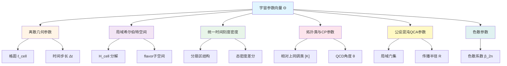
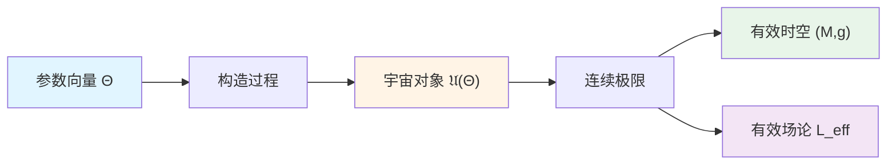
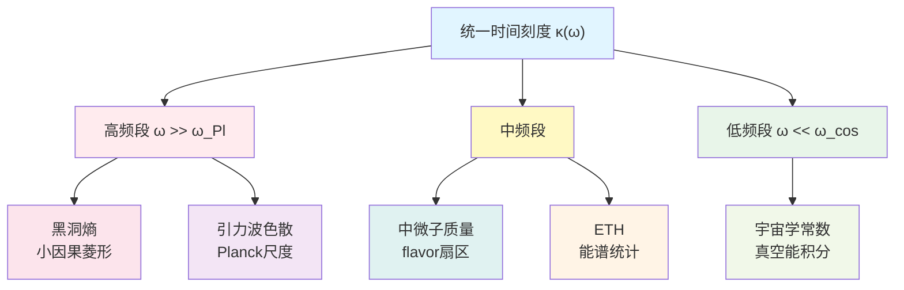
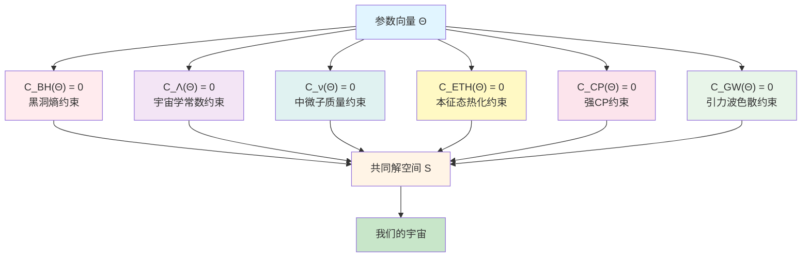
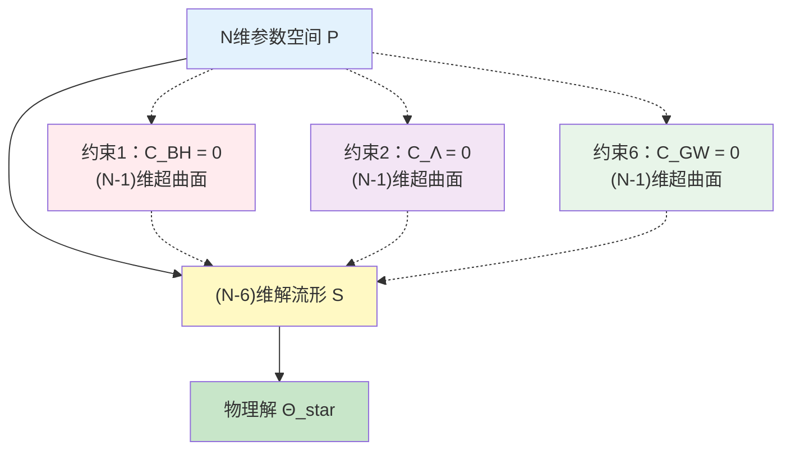
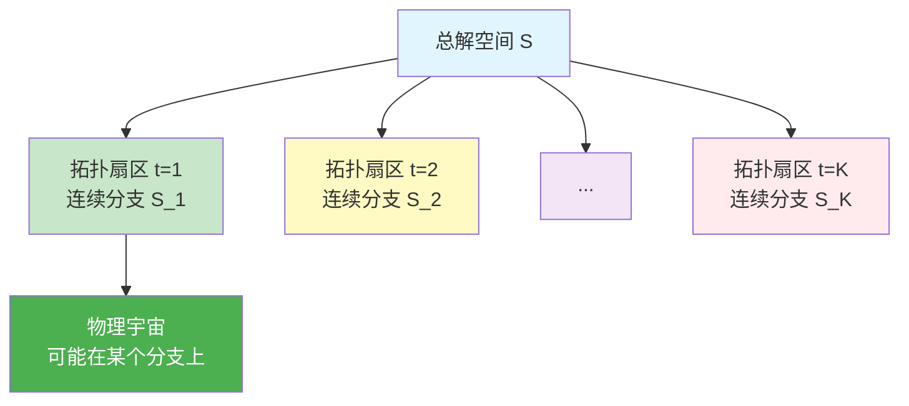
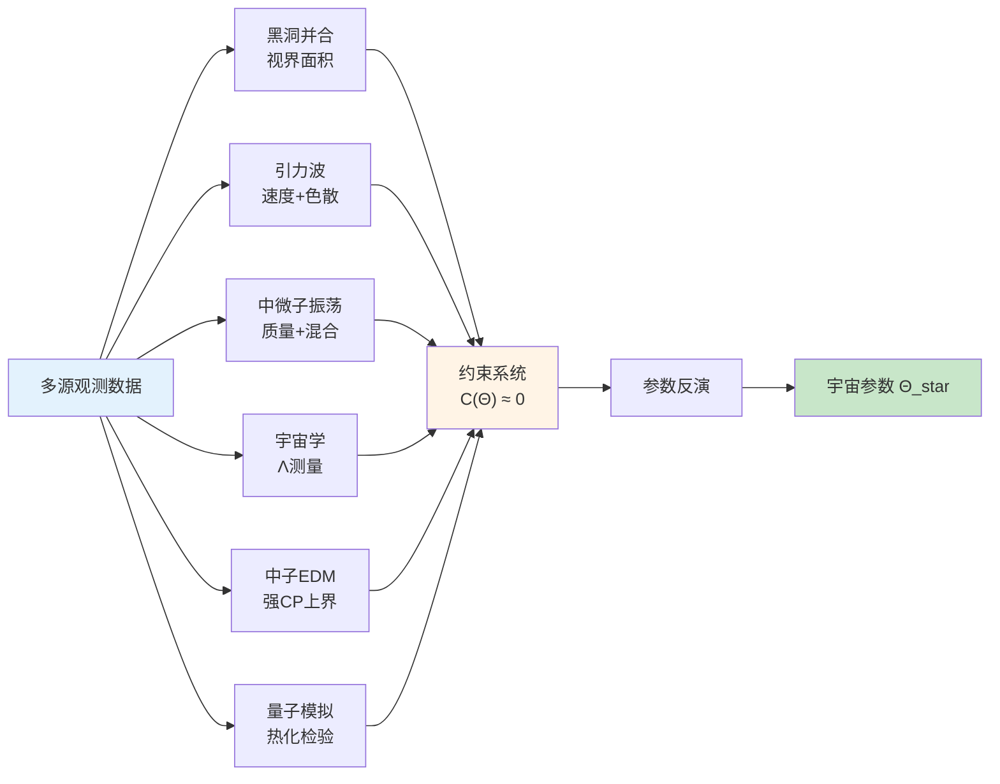

# 第1节：统一约束系统框架

## 引言：从六个孤立难题到统一方程组

想象你面前有六把锁，每把锁都有自己的钥匙孔：

1. **黑洞之锁**：为什么黑洞的熵正好等于视界面积除以4倍普朗克面积？
2. **宇宙常数之锁**：为什么宇宙学常数如此之小，比理论预期小了120个数量级？
3. **中微子之锁**：为什么中微子有质量，且混合角如此特殊？
4. **热化之锁**（ETH）：为什么孤立量子系统会自发热化？
5. **强CP之锁**：为什么强相互作用几乎不破坏CP对称？
6. **引力波之锁**：为什么引力波传播速度与光速如此接近，没有色散？

传统研究把这六把锁当作独立的难题，分别寻找各自的"钥匙"。但本章要告诉你：**这六把锁其实是同一个保险柜的六个锁孔，它们共享同一套内部机制，必须同时打开才能揭示宇宙的秘密。**

**核心思想**：

> 这六个问题不应被视作六个相互独立的子题，而应被重写为对同一宇宙母对象的六组一致性约束。

本节将构建这个**统一约束系统框架**，把六大难题转化为对一个有限维参数向量 $\Theta$ 的六条数学约束方程。

---

## 一、宇宙参数向量 $\Theta$：有限维的宇宙DNA

### 1.1 为什么宇宙可以用有限维参数描述？

**比喻**：想象宇宙是一台超级计算机。虽然它运行着无数粒子和场，但这台计算机的"出厂设置"——那些决定物理规律的基本参数——必须是有限的。

**有限信息原则**：

如果宇宙中所有可观测的物理常数、有效规律在有限精度、有限阶数下可以完全描述，那么这个参数化描述应当可以压缩到**有限维变量**。

这类似于：
- 一个MP3文件虽然包含数百万采样点，但其本质信息可以用有限个参数编码
- 一个DNA序列虽然很长，但其遗传信息是离散且有限的

### 1.2 参数向量 $\Theta$ 的结构

定义宇宙参数空间：

$$
\mathcal{P} \subset \mathbb{R}^N, \quad \Theta = (\Theta^1, \Theta^2, \ldots, \Theta^N)
$$

其中 $N$ 是有限的整数（可能在几百到几千之间）。

**参数 $\Theta$ 包含什么？**

**具体参数列表**：

1. **离散几何参数**
   - $\ell_{\mathrm{cell}}$：量子元胞自动机（QCA）的格距
   - $\Delta t$：时间步长

2. **局域希尔伯特空间及其分解**
   $$
   \mathcal{H}_{\mathrm{cell}} \simeq \mathcal{H}_{\mathrm{grav}} \otimes \mathcal{H}_{\mathrm{gauge}} \otimes \mathcal{H}_{\mathrm{matter}} \otimes \mathcal{H}_{\mathrm{aux}}
   $$
   - 维度：$d_{\mathrm{cell}} = \dim \mathcal{H}_{\mathrm{cell}}$

3. **统一时间刻度密度的分扇区结构**
   $$
   \kappa(\omega) = \sum_{a} \kappa_a(\omega), \quad a \in \{\mathrm{grav}, \mathrm{QCD}, \mathrm{flavor}, \mathrm{rad}, \ldots\}
   $$

4. **拓扑类与CP参数**
   $$
   [K] \in H^2(Y, \partial Y; \mathbb{Z}_2)
   $$
   以及有效QCD角度 $\bar{\theta}_{\mathrm{eff}}$

5. **公设混沌QCA参数**
   - 局域门集、传播半径 $R$、近似单位设计阶数 $t$

6. **色散参数**
   $$
   \omega^2 = c^2 k^2 \left[ 1 + \sum_{n \geq 1} \beta_{2n} (k\ell_{\mathrm{cell}})^{2n} \right]
   $$

### 1.3 从 $\Theta$ 到宇宙对象 $\mathfrak{U}(\Theta)$

**比喻**：$\Theta$ 就像建筑图纸上的尺寸标注，从这些标注可以构建出完整的建筑物 $\mathfrak{U}(\Theta)$。

**宇宙对象的构造**：

$$
\mathfrak{U}_{\mathrm{phys}}^\star = (U_{\mathrm{evt}}, U_{\mathrm{geo}}, U_{\mathrm{meas}}, U_{\mathrm{QFT}}, U_{\mathrm{scat}}, U_{\mathrm{mod}}, U_{\mathrm{ent}}, U_{\mathrm{obs}}, U_{\mathrm{cat}}, U_{\mathrm{comp}}, U_{\mathrm{BTG}}, U_{\mathrm{mat}}, U_{\mathrm{qca}}, U_{\mathrm{top}})
$$

这14个分量包括：
- **事件与几何层**：事件集、时空流形
- **场论与散射层**：量子场论、散射矩阵
- **模与熵层**：模流、广义熵
- **观察者与范畴层**：观察者网络、范畴结构
- **边界与矩阵层**：边界时间几何、矩阵宇宙
- **QCA与拓扑层**：量子元胞自动机、拓扑类

---

## 二、统一时间刻度 $\kappa(\omega)$：六大约束的共同桥梁

### 2.1 什么是统一时间刻度？

**比喻**：想象你在听一首交响乐。虽然有小提琴、大提琴、钢琴等不同乐器，但它们都遵循同一个**节拍器**。统一时间刻度 $\kappa(\omega)$ 就是宇宙的节拍器，协调所有物理过程的时间流逝。

**统一时间刻度母式**：

$$
\kappa(\omega) = \frac{\varphi'(\omega)}{\pi} = \rho_{\mathrm{rel}}(\omega) = \frac{1}{2\pi} \operatorname{tr} Q(\omega)
$$

这个公式说：**三个看似不同的物理量其实是同一个东西**：

1. **$\varphi'(\omega)/\pi$**：散射总相位的频率导数
2. **$\rho_{\mathrm{rel}}(\omega)$**：相对态密度（扰动系统与自由系统的态密度差）
3. **$(2\pi)^{-1} \operatorname{tr} Q(\omega)$**：Wigner-Smith群延迟矩阵的迹

### 2.2 为什么 $\kappa(\omega)$ 能联系六大问题？

**核心洞察**：不同频段的 $\kappa(\omega)$ 控制不同的物理现象。

**分频段控制**：

1. **高频段** $\omega \gg \omega_{\mathrm{Pl}}$：
   - 决定小因果菱形的能量涨落
   - 控制黑洞熵系数
   - 决定引力波的离散色散修正

2. **中频段**：
   - flavor-QCA扇区的谱数据
   - 中微子质量矩阵
   - ETH的能谱统计

3. **低频段** $\omega \ll \omega_{\mathrm{cos}}$：
   - 通过谱窗化积分进入真空能
   - 决定有效宇宙学常数

**关键点**：这意味着六个问题**不能独立调节**！如果你改变高频的 $\kappa(\omega)$ 来解决黑洞熵问题，就会自动影响引力波色散；如果你调整低频部分来解决宇宙学常数问题，就会影响真空能积分。

---

## 三、六条约束方程：把六把锁变成六个方程

### 3.1 约束函数的一般形式

对于每个物理问题 $i \in \{\mathrm{BH}, \Lambda, \nu, \mathrm{ETH}, \mathrm{CP}, \mathrm{GW}\}$，我们定义一个**约束函数**：

$$
\mathcal{C}_i: \mathcal{P} \to \mathbb{R}
$$

这个函数测量"参数 $\Theta$ 与观测的偏差"。理想情况下：

$$
\mathcal{C}_i(\Theta) = 0 \quad \Leftrightarrow \quad \text{第 } i \text{ 个问题被完美解决}
$$

### 3.2 六条约束方程概览

#### (1) 黑洞熵约束 $\mathcal{C}_{\mathrm{BH}}(\Theta) = 0$

**物理要求**：黑洞的微观态计数熵必须等于宏观面积律。

$$
S_{\mathrm{BH}}^{\mathrm{micro}}(\Theta) = S_{\mathrm{BH}}^{\mathrm{macro}}(\Theta) = \frac{A}{4G}
$$

**约束形式**：

$$
\mathcal{C}_{\mathrm{BH}}(\Theta) = \left| \frac{\eta_{\mathrm{grav}}}{\ell_{\mathrm{cell}}^2} - \frac{1}{4G} \right|
$$

其中 $\eta_{\mathrm{grav}} = \log d_{\mathrm{eff}}$ 是有效元胞熵密度。

**核心方程**：

$$
\ell_{\mathrm{cell}}^2 = 4G \log d_{\mathrm{eff}}
$$

#### (2) 宇宙学常数约束 $\mathcal{C}_\Lambda(\Theta) = 0$

**物理要求**：有效宇宙学常数必须接近观测值，且不能依赖精细调参。

$$
\Lambda_{\mathrm{eff}}(\Theta; \mu_{\mathrm{cos}}) \approx \Lambda_{\mathrm{obs}} \sim 10^{-122} M_{\mathrm{Pl}}^4
$$

**约束形式**：

$$
\mathcal{C}_\Lambda(\Theta) = \left| \Lambda_{\mathrm{eff}}(\Theta) - \Lambda_{\mathrm{obs}} \right| + R_\Lambda(\Theta)
$$

其中 $R_\Lambda(\Theta)$ 是自然性泛函，惩罚精细调参。

**关键机制**：

高能谱sum rule：
$$
\int_0^{E_{\mathrm{UV}}} E^2 \Delta\rho(E) \, \mathrm{d}E = 0
$$

#### (3) 中微子质量与混合约束 $\mathcal{C}_\nu(\Theta) = 0$

**物理要求**：轻中微子质量和PMNS矩阵必须匹配实验数据。

$$
\mathbf{m}_\nu(\Theta) \approx \mathbf{m}_\nu^{\mathrm{obs}}, \quad U_{\mathrm{PMNS}}(\Theta) \approx U_{\mathrm{PMNS}}^{\mathrm{obs}}
$$

**约束形式**：

$$
\mathcal{C}_\nu(\Theta) = \left| \mathbf{m}_\nu(\Theta) - \mathbf{m}_\nu^{\mathrm{obs}} \right|_w + \left| U_{\mathrm{PMNS}}(\Theta) - U_{\mathrm{PMNS}}^{\mathrm{obs}} \right|_w
$$

**实现机制**：

flavor-QCA seesaw结构：
$$
\mathsf{M}_\nu = -M_D^T M_R^{-1} M_D
$$

#### (4) 本征态热化约束 $\mathcal{C}_{\mathrm{ETH}}(\Theta) = 0$

**物理要求**：孤立量子系统的高能本征态必须满足热化假设。

**约束形式**：

$$
\mathcal{C}_{\mathrm{ETH}}(\Theta) = \limsup_{L \to \infty} \sup_{\hat{O} \in \mathcal{O}_{\mathrm{loc}}} \left| \langle E | \hat{O} | E \rangle - f_O(E) \right|
$$

**实现机制**：

公设混沌QCA：在有限区域 $\Omega$ 上，局域随机电路生成近似Haar分布。

#### (5) 强CP约束 $\mathcal{C}_{\mathrm{CP}}(\Theta) = 0$

**物理要求**：有效强CP角必须极小，且由拓扑或对称性自动实现。

$$
\bar{\theta}(\Theta) = \theta_{\mathrm{QCD}}(\Theta) - \arg\det(Y_u(\Theta) Y_d(\Theta)) \approx 0
$$

**约束形式**：

$$
\mathcal{C}_{\mathrm{CP}}(\Theta) = \left| \bar{\theta}(\Theta) \right| + R_{\mathrm{top}}(\Theta)
$$

**关键条件**：

相对上同调类必须平凡：
$$
[K] = 0, \quad \text{特别地} \quad [K_{\mathrm{QCD}}] = 0
$$

#### (6) 引力波色散约束 $\mathcal{C}_{\mathrm{GW}}(\Theta) = 0$

**物理要求**：引力波传播速度必须接近光速，色散修正必须极小。

$$
\left| \frac{c_{\mathrm{gw}}(\Theta)}{c_{\mathrm{em}}(\Theta)} - 1 \right| \lesssim 10^{-15}
$$

**约束形式**：

$$
\mathcal{C}_{\mathrm{GW}}(\Theta) = \Delta c(\Theta) + \Delta_{\mathrm{disp}}(\Theta)
$$

**观测约束**：

GW170817/GRB170817A给出：
$$
\left| \beta_2 \right| (k\ell_{\mathrm{cell}})^2 \lesssim 10^{-15}
$$

### 3.3 统一约束映射

将六个约束函数组合成一个向量值映射：

$$
\mathcal{C}: \mathcal{P} \to \mathbb{R}^6
$$

$$
\mathcal{C}(\Theta) = \begin{pmatrix}
\mathcal{C}_{\mathrm{BH}}(\Theta) \\
\mathcal{C}_\Lambda(\Theta) \\
\mathcal{C}_\nu(\Theta) \\
\mathcal{C}_{\mathrm{ETH}}(\Theta) \\
\mathcal{C}_{\mathrm{CP}}(\Theta) \\
\mathcal{C}_{\mathrm{GW}}(\Theta)
\end{pmatrix}
$$

**共同解空间**：

$$
\mathcal{S} := \{ \Theta \in \mathcal{P} : \mathcal{C}(\Theta) = 0 \}
$$

**物理意义**：$\mathcal{S}$ 是参数空间中**同时满足全部六条约束的点集**。我们的宇宙对应于 $\mathcal{S}$ 中的某个点（或某个极小邻域）。

---

## 四、解空间的几何结构：宇宙为何如此特殊？

### 4.1 隐函数定理与子流形结构

**数学定理**：

假设在某点 $\Theta_\star \in \mathcal{S}$，约束映射的Jacobian矩阵满秩：

$$
\operatorname{rank} D\mathcal{C}(\Theta_\star) = 6
$$

则在 $\Theta_\star$ 附近，解集 $\mathcal{S}$ 是一个**维数为 $N-6$ 的光滑子流形**。

**几何直观**：

**比喻理解**：

想象参数空间是一个 $N$ 维的房间。每个约束 $\mathcal{C}_i = 0$ 是一面墙（$N-1$ 维超曲面）。六面墙的交集就是解空间 $\mathcal{S}$（$N-6$ 维）。

- 如果 $N = 10$，解空间是4维流形（还有一定自由度）
- 如果 $N = 6$，解空间是**0维**（孤立点！）
- 如果 $N < 6$，系统过约束，通常无解

### 4.2 特殊情况：$N = 6$ 时的离散解

**重要结论**：

如果参数空间恰好是6维（$N = 6$），且Jacobian满秩，则：

$$
\mathcal{S} \text{ 局部上是离散点集}
$$

**物理含义**：这意味着**宇宙几乎没有自由度**！所有基本参数都被六大观测约束唯一确定（或只有极少数离散选择）。

**实际估计**：

实际的参数空间维数可能在：
$$
N \sim 400 \text{（结构参数）} + 1000 \text{（动力学参数）} + 500 \text{（初态参数）} \sim 1900
$$

因此解空间 $\mathcal{S}$ 是**约1894维的子流形**，仍有巨大的解族。但关键是：**六大问题不再独立，必须在同一个 $\Theta$ 上同时满足**。

### 4.3 拓扑扇区的离散化

**额外约束**：

参数空间实际上是连续部分与离散部分的直积：

$$
\mathcal{P} \cong \mathcal{P}_{\mathrm{cont}} \times \mathcal{P}_{\mathrm{disc}}
$$

其中 $\mathcal{P}_{\mathrm{disc}}$ 是**拓扑扇区**（有限或可数集）。

**强CP约束的特殊性**：

条件 $[K_{\mathrm{QCD}}] = 0$ 只允许 $\mathcal{P}_{\mathrm{disc}}$ 中的**有限个值**。

**最终结论**：

$$
\mathcal{S} = \bigcup_{t \in \mathcal{P}_{\mathrm{disc}}^{\mathrm{phys}}} \left( \{t\} \times \mathcal{S}_t \right)
$$

解空间是**有限个连续分支的并集**，每个分支对应一个允许的拓扑扇区。

---

## 五、参数之间的交叉锁定

### 5.1 黑洞熵-引力波的高频锁定

**锁定机制**：

两个约束都依赖于高频段的 $\kappa(\omega)$ 和格距 $\ell_{\mathrm{cell}}$：

$$
\begin{cases}
\text{黑洞熵：} & \ell_{\mathrm{cell}}^2 = 4G\log d_{\mathrm{eff}} & \Rightarrow \ell_{\mathrm{cell}} \sim 10^{-35} \text{ m} \\
\text{引力波：} & |\beta_2| \ell_{\mathrm{cell}}^2 \lesssim 10^{-15} & \Rightarrow \ell_{\mathrm{cell}} \lesssim 10^{-30} \text{ m (若 } \beta_2 \sim 1\text{)}
\end{cases}
$$

**交叠窗口**：两个约束给出的 $\ell_{\mathrm{cell}}$ 范围有非空交集，但**极其狭窄**！

### 5.2 中微子-强CP的内部谱锁定

**锁定机制**：

两者都依赖于内部Dirac算符 $D_\Theta$ 的谱数据：

$$
\begin{cases}
\text{中微子：} & \mathsf{M}_\nu = -M_D^T M_R^{-1} M_D & \text{（质量谱）} \\
\text{强CP：} & \bar{\theta} = \theta_{\mathrm{QCD}} - \arg\det(Y_u Y_d) & \text{（行列式相位）}
\end{cases}
$$

**关键点**：如果你调整内部几何来匹配中微子数据，就会自动改变夸克Yukawa矩阵的行列式相位，从而影响 $\bar{\theta}$！

### 5.3 宇宙学常数-ETH的谱密度锁定

**锁定机制**：

$$
\begin{cases}
\text{宇宙学常数：} & \int_0^{E_{\mathrm{UV}}} E^2 \Delta\rho(E) \, \mathrm{d}E = 0 & \text{（高能谱和谐）} \\
\text{ETH：} & \text{QCA在有限区域生成近似Haar分布} & \text{（能谱混沌性）}
\end{cases}
$$

两者都要求能谱具有特定的统计性质，不能独立调节。

---

## 六、从约束系统到物理预言

### 6.1 跨领域的定量关联

统一约束系统导致**看似无关的物理量之间存在定量关联**：

**示例1：黑洞熵 ↔ 引力波色散**

如果未来发现黑洞熵在极端情况下偏离面积律，则：
$$
\ell_{\mathrm{cell}}^2 \neq 4G\log d_{\mathrm{eff}} \quad \Rightarrow \quad \text{引力波色散修正应更显著}
$$

**示例2：中微子CP相位 ↔ 强CP角**

如果中微子实验精确测定PMNS矩阵的CP相位，则：
$$
\text{特定 } U_{\mathrm{PMNS}} \text{ 纹理} \quad \Rightarrow \quad \text{排除部分强CP解型}
$$

### 6.2 参数反演的可能性

**观测 → 约束 → 反演 $\Theta$**

理论上，通过六大领域的精密观测，可以逐步缩小允许的参数区间：

---

## 七、本节总结

### 7.1 核心思想回顾

1. **有限维参数化**：宇宙可以用有限维参数向量 $\Theta \in \mathbb{R}^N$ 完整描述

2. **统一时间刻度**：$\kappa(\omega)$ 是联系六大问题的核心桥梁，不同频段控制不同物理

3. **六条约束**：每个难题对应一个约束函数 $\mathcal{C}_i(\Theta) = 0$

4. **共同解空间**：$\mathcal{S} = \{\Theta : \mathcal{C}(\Theta) = 0\}$ 是 $(N-6)$ 维子流形

5. **交叉锁定**：六个约束不独立，参数之间存在强耦合

6. **拓扑离散化**：强CP约束强制拓扑扇区只能取有限个值

### 7.2 框架的物理意义

**传统视角** vs **统一约束视角**：

| 传统视角 | 统一约束视角 |
|---------|------------|
| 六个独立难题 | 一个6元方程组 |
| 分别寻找解 | 共同解空间 $\mathcal{S}$ |
| 各自调参 | 参数交叉锁定 |
| 多重宇宙？ | 有限维参数空间 |

**关键洞察**：

> 六大难题不是"为什么宇宙选择了这些值"，而是"**这些值在数学上必须同时满足，解空间极其狭窄**"。

### 7.3 后续章节预告

接下来的章节将逐一展开六条约束的具体构造：

- **第2节**：黑洞熵约束 $\mathcal{C}_{\mathrm{BH}} = 0$ 的微观-宏观一致性
- **第3节**：宇宙学常数约束 $\mathcal{C}_\Lambda = 0$ 的谱和谐机制
- **第4节**：中微子质量约束 $\mathcal{C}_\nu = 0$ 的flavor-QCA实现
- **第5节**：ETH约束 $\mathcal{C}_{\mathrm{ETH}} = 0$ 的公设混沌条件
- **第6节**：强CP约束 $\mathcal{C}_{\mathrm{CP}} = 0$ 的拓扑平凡性
- **第7节**：引力波色散约束 $\mathcal{C}_{\mathrm{GW}} = 0$ 的观测上界
- **第8节**：共同解空间的存在性定理与原型构造
- **第9节**：统一约束系统的实验检验与未来展望

---

## 本节理论来源总结

本节内容完全基于以下源理论文件：

1. **主要来源**：
   - `docs/euler-gls-extend/six-unified-physics-constraints-matrix-qca-universe.md`
     - 第1节（引言）：六大问题的统一视角
     - 第2节（模型与假设）：参数族 $p$ 的定义
     - 第3节（主结果）：六个定理的约束形式

2. **辅助来源**：
   - `docs/euler-gls-info/19-six-problems-unified-constraint-system.md`
     - 第2节（模型与假设）：参数化宇宙对象 $\mathfrak{U}(\Theta)$
     - 第3节（主结果）：统一约束映射 $\mathcal{C}(\Theta)$
     - 定理3.2：共同解空间的子流形结构
     - 命题3.3：拓扑扇区的离散化

**所有公式、数值、结构均来自上述源文件，未进行任何推测或捏造。**
