# Section 01: Unified Constraint System Framework

## Introduction: From Six Isolated Puzzles to Unified System of Equations

Imagine six locks in front of you, each with its own keyhole:

1. **Black Hole Lock**: Why is black hole entropy exactly equal to horizon area divided by 4 times Planck area?
2. **Cosmological Constant Lock**: Why is cosmological constant so small, 120 orders of magnitude smaller than theoretical expectation?
3. **Neutrino Lock**: Why do neutrinos have mass, and why such special mixing angles?
4. **Thermalization Lock** (ETH): Why do isolated quantum systems spontaneously thermalize?
5. **Strong CP Lock**: Why do strong interactions almost not violate CP symmetry?
6. **Gravitational Wave Lock**: Why is gravitational wave propagation speed so close to speed of light, with no dispersion?

Traditional research treats these six locks as independent puzzles, searching for their own "keys" separately. But this chapter tells you: **These six locks are actually six lock holes of same safe, sharing same internal mechanism, must be opened simultaneously to reveal universe's secrets**.

**Core Idea**:

> These six problems should not be viewed as six mutually independent sub-problems, but should be rewritten as six sets of consistency constraints on same universe parent object.

This section will construct this **unified constraint system framework**, transforming six major puzzles into six mathematical constraint equations on a finite-dimensional parameter vector $\Theta$.

---

## Part I: Universe Parameter Vector $\Theta$: Finite-Dimensional Universe DNA

### 1.1 Why Can Universe Be Described by Finite-Dimensional Parameters?

**Analogy**: Imagine universe is a supercomputer. Although it runs countless particles and fields, this computer's "factory settings"—those basic parameters determining physical laws—must be finite.

**Finite Information Principle**:

If all observable physical constants and effective laws in universe can be completely described at finite precision and finite order, then this parameterized description should be compressible to **finite-dimensional variables**.

This is similar to:
- An MP3 file contains millions of sample points, but its essential information can be encoded with finite parameters
- A DNA sequence is long, but its genetic information is discrete and finite

### 1.2 Structure of Parameter Vector $\Theta$

Define universe parameter space:

$$
\mathcal{P} \subset \mathbb{R}^N, \quad \Theta = (\Theta^1, \Theta^2, \ldots, \Theta^N)
$$

where $N$ is finite integer (possibly between hundreds and thousands).

**What Does Parameter $\Theta$ Contain?**

```mermaid
graph TB
    Theta["Universe Parameter Vector Θ"]

    Theta --> Discrete["Discrete Geometric Parameters"]
    Theta --> Hilbert["Local Hilbert Space"]
    Theta --> Kappa["Unified Time Scale Density"]
    Theta --> Topo["Topological Classes and CP Parameters"]
    Theta --> ETH["Post-Chaotic QCA Parameters"]
    Theta --> Disp["Dispersion Parameters"]

    Discrete --> Cell["Lattice Spacing ℓ_cell"]
    Discrete --> Time["Time Step Δt"]

    Hilbert --> Decomp["H_cell Decomposition"]
    Hilbert --> Flavor["Flavor Subspaces"]

    Kappa --> Sector["Sector Structure"]
    Kappa --> DOS["State Density Differences"]

    Topo --> K["Relative Cohomology Class [K]"]
    Topo --> Theta_QCD["QCD Angle θ"]

    ETH --> Gates["Local Gate Set"]
    ETH --> Radius["Propagation Radius R"]

    Disp --> Beta["Dispersion Coefficients β_2n"]

    style Theta fill:#e1f5ff
    style Discrete fill:#fff4e6
    style Hilbert fill:#f3e5f5
    style Kappa fill:#e8f5e9
    style Topo fill:#fce4ec
    style ETH fill:#fff9c4
    style Disp fill:#e0f2f1
```

**Specific Parameter List**:

1. **Discrete Geometric Parameters**
   - $\ell_{\mathrm{cell}}$: Lattice spacing of Quantum Cellular Automaton (QCA)
   - $\Delta t$: Time step

2. **Local Hilbert Space and Its Decomposition**
   $$
   \mathcal{H}_{\mathrm{cell}} \simeq \mathcal{H}_{\mathrm{grav}} \otimes \mathcal{H}_{\mathrm{gauge}} \otimes \mathcal{H}_{\mathrm{matter}} \otimes \mathcal{H}_{\mathrm{aux}}
   $$
   - Dimension: $d_{\mathrm{cell}} = \dim \mathcal{H}_{\mathrm{cell}}$

3. **Sector Structure of Unified Time Scale Density**
   $$
   \kappa(\omega) = \sum_{a} \kappa_a(\omega), \quad a \in \{\mathrm{grav}, \mathrm{QCD}, \mathrm{flavor}, \mathrm{rad}, \ldots\}
   $$

4. **Topological Classes and CP Parameters**
   $$
   [K] \in H^2(Y, \partial Y; \mathbb{Z}_2)
   $$
   and effective QCD angle $\bar{\theta}_{\mathrm{eff}}$

5. **Post-Chaotic QCA Parameters**
   - Local gate set, propagation radius $R$, approximate unit design order $t$

6. **Dispersion Parameters**
   $$
   \omega^2 = c^2 k^2 \left[ 1 + \sum_{n \geq 1} \beta_{2n} (k\ell_{\mathrm{cell}})^{2n} \right]
   $$

### 1.3 From $\Theta$ to Universe Object $\mathfrak{U}(\Theta)$

**Analogy**: $\Theta$ is like dimension annotations on architectural blueprint, from these annotations can construct complete building $\mathfrak{U}(\Theta)$.

**Construction of Universe Object**:

$$
\mathfrak{U}_{\mathrm{phys}}^\star = (U_{\mathrm{evt}}, U_{\mathrm{geo}}, U_{\mathrm{meas}}, U_{\mathrm{QFT}}, U_{\mathrm{scat}}, U_{\mathrm{mod}}, U_{\mathrm{ent}}, U_{\mathrm{obs}}, U_{\mathrm{cat}}, U_{\mathrm{comp}}, U_{\mathrm{BTG}}, U_{\mathrm{mat}}, U_{\mathrm{qca}}, U_{\mathrm{top}})
$$

These 14 components include:
- **Event and Geometry Layers**: Event set, spacetime manifold
- **Field Theory and Scattering Layers**: Quantum field theory, scattering matrix
- **Modular and Entropy Layers**: Modular flow, generalized entropy
- **Observer and Category Layers**: Observer network, category structure
- **Boundary and Matrix Layers**: Boundary time geometry, matrix universe
- **QCA and Topology Layers**: Quantum cellular automaton, topological classes

```mermaid
graph LR
    Theta["Parameter Vector Θ"] --> Build["Construction Process"]
    Build --> Universe["Universe Object 𝔘(Θ)"]
    Universe --> Continuous["Continuum Limit"]
    Continuous --> Effective["Effective Spacetime (M,g)"]
    Continuous --> QFT["Effective Field Theory L_eff"]

    style Theta fill:#e1f5ff
    style Universe fill:#fff4e6
    style Effective fill:#e8f5e9
    style QFT fill:#f3e5f5
```

---

## Part II: Unified Time Scale $\kappa(\omega)$: Common Bridge of Six Major Constraints

### 2.1 What Is Unified Time Scale?

**Analogy**: Imagine listening to a symphony. Although there are different instruments like violin, cello, piano, they all follow same **metronome**. Unified time scale $\kappa(\omega)$ is universe's metronome, coordinating time flow of all physical processes.

**Unified Time Scale Master Formula**:

$$
\kappa(\omega) = \frac{\varphi'(\omega)}{\pi} = \rho_{\mathrm{rel}}(\omega) = \frac{1}{2\pi} \operatorname{tr} Q(\omega)
$$

This formula says: **Three seemingly different physical quantities are actually same thing**:

1. **$\varphi'(\omega)/\pi$**: Frequency derivative of total scattering phase
2. **$\rho_{\mathrm{rel}}(\omega)$**: Relative state density (state density difference between perturbed system and free system)
3. **$(2\pi)^{-1} \operatorname{tr} Q(\omega)$**: Trace of Wigner-Smith group delay matrix

### 2.2 Why Can $\kappa(\omega)$ Connect Six Problems?

**Core Insight**: Different frequency bands of $\kappa(\omega)$ control different physical phenomena.

```mermaid
graph TB
    Kappa["Unified Time Scale κ(ω)"]

    Kappa --> HighFreq["High Frequency Band ω >> ω_Pl"]
    Kappa --> MidFreq["Mid Frequency Band"]
    Kappa --> LowFreq["Low Frequency Band ω << ω_cos"]

    HighFreq --> BH["Black Hole Entropy<br/>Small Causal Diamonds"]
    HighFreq --> GW["Gravitational Wave Dispersion<br/>Planck Scale"]

    MidFreq --> Neutrino["Neutrino Mass<br/>Flavor Sector"]
    MidFreq --> ETH["ETH<br/>Energy Spectrum Statistics"]

    LowFreq --> Lambda["Cosmological Constant<br/>Vacuum Energy Integral"]

    style Kappa fill:#e1f5ff
    style HighFreq fill:#ffebee
    style MidFreq fill:#fff9c4
    style LowFreq fill:#e8f5e9
    style BH fill:#fce4ec
    style GW fill:#f3e5f5
    style Neutrino fill:#e0f2f1
    style ETH fill:#fff4e6
    style Lambda fill:#f1f8e9
```

**Frequency Band Control**:

1. **High Frequency Band** $\omega \gg \omega_{\mathrm{Pl}}$:
   - Determines energy fluctuations of small causal diamonds
   - Controls black hole entropy coefficient
   - Determines discrete dispersion corrections of gravitational waves

2. **Mid Frequency Band**:
   - Spectral data of flavor-QCA sector
   - Neutrino mass matrix
   - Energy spectrum statistics of ETH

3. **Low Frequency Band** $\omega \ll \omega_{\mathrm{cos}}$:
   - Enters vacuum energy through spectral windowing integral
   - Determines effective cosmological constant

**Key Point**: This means six problems **cannot be independently adjusted**! If you change high-frequency $\kappa(\omega)$ to solve black hole entropy problem, automatically affects gravitational wave dispersion; if you adjust low-frequency part to solve cosmological constant problem, affects vacuum energy integral.

---

## Part III: Six Constraint Equations: Turning Six Locks into Six Equations

### 3.1 General Form of Constraint Functions

For each physics problem $i \in \{\mathrm{BH}, \Lambda, \nu, \mathrm{ETH}, \mathrm{CP}, \mathrm{GW}\}$, we define a **constraint function**:

$$
\mathcal{C}_i: \mathcal{P} \to \mathbb{R}
$$

This function measures "deviation of parameter $\Theta$ from observation". Ideally:

$$
\mathcal{C}_i(\Theta) = 0 \quad \Leftrightarrow \quad \text{Problem } i \text{ perfectly solved}
$$

### 3.2 Overview of Six Constraint Equations

```mermaid
graph TB
    Theta["Parameter Vector Θ"]

    Theta --> C1["C_BH(Θ) = 0<br/>Black Hole Entropy Constraint"]
    Theta --> C2["C_Λ(Θ) = 0<br/>Cosmological Constant Constraint"]
    Theta --> C3["C_ν(Θ) = 0<br/>Neutrino Mass Constraint"]
    Theta --> C4["C_ETH(Θ) = 0<br/>Eigenstate Thermalization Constraint"]
    Theta --> C5["C_CP(Θ) = 0<br/>Strong CP Constraint"]
    Theta --> C6["C_GW(Θ) = 0<br/>Gravitational Wave Dispersion Constraint"]

    C1 --> Solution["Common Solution Space S"]
    C2 --> Solution
    C3 --> Solution
    C4 --> Solution
    C5 --> Solution
    C6 --> Solution

    Solution --> Universe["Our Universe"]

    style Theta fill:#e1f5ff
    style C1 fill:#ffebee
    style C2 fill:#f3e5f5
    style C3 fill:#e0f2f1
    style C4 fill:#fff9c4
    style C5 fill:#fce4ec
    style C6 fill:#e8f5e9
    style Solution fill:#fff4e6
    style Universe fill:#c8e6c9
```

#### (1) Black Hole Entropy Constraint $\mathcal{C}_{\mathrm{BH}}(\Theta) = 0$

**Physical Requirement**: Microscopic state counting entropy of black hole must equal macroscopic area law.

$$
S_{\mathrm{BH}}^{\mathrm{micro}}(\Theta) = S_{\mathrm{BH}}^{\mathrm{macro}}(\Theta) = \frac{A}{4G}
$$

**Constraint Form**:

$$
\mathcal{C}_{\mathrm{BH}}(\Theta) = \left| \frac{\eta_{\mathrm{grav}}}{\ell_{\mathrm{cell}}^2} - \frac{1}{4G} \right|
$$

where $\eta_{\mathrm{grav}} = \log d_{\mathrm{eff}}$ is effective cell entropy density.

**Core Equation**:

$$
\ell_{\mathrm{cell}}^2 = 4G \log d_{\mathrm{eff}}
$$

#### (2) Cosmological Constant Constraint $\mathcal{C}_\Lambda(\Theta) = 0$

**Physical Requirement**: Effective cosmological constant must be close to observed value, and cannot depend on fine-tuning.

$$
\Lambda_{\mathrm{eff}}(\Theta; \mu_{\mathrm{cos}}) \approx \Lambda_{\mathrm{obs}} \sim 10^{-122} M_{\mathrm{Pl}}^4
$$

**Constraint Form**:

$$
\mathcal{C}_\Lambda(\Theta) = \left| \Lambda_{\mathrm{eff}}(\Theta) - \Lambda_{\mathrm{obs}} \right| + R_\Lambda(\Theta)
$$

where $R_\Lambda(\Theta)$ is naturalness functional, penalizing fine-tuning.

**Key Mechanism**:

High-energy spectrum sum rule:
$$
\int_0^{E_{\mathrm{UV}}} E^2 \Delta\rho(E) \, \mathrm{d}E = 0
$$

#### (3) Neutrino Mass and Mixing Constraint $\mathcal{C}_\nu(\Theta) = 0$

**Physical Requirement**: Light neutrino masses and PMNS matrix must match experimental data.

$$
\mathbf{m}_\nu(\Theta) \approx \mathbf{m}_\nu^{\mathrm{obs}}, \quad U_{\mathrm{PMNS}}(\Theta) \approx U_{\mathrm{PMNS}}^{\mathrm{obs}}
$$

**Constraint Form**:

$$
\mathcal{C}_\nu(\Theta) = \left| \mathbf{m}_\nu(\Theta) - \mathbf{m}_\nu^{\mathrm{obs}} \right|_w + \left| U_{\mathrm{PMNS}}(\Theta) - U_{\mathrm{PMNS}}^{\mathrm{obs}} \right|_w
$$

**Implementation Mechanism**:

flavor-QCA seesaw structure:
$$
\mathsf{M}_\nu = -M_D^T M_R^{-1} M_D
$$

#### (4) Eigenstate Thermalization Constraint $\mathcal{C}_{\mathrm{ETH}}(\Theta) = 0$

**Physical Requirement**: High-energy eigenstates of isolated quantum systems must satisfy thermalization hypothesis.

**Constraint Form**:

$$
\mathcal{C}_{\mathrm{ETH}}(\Theta) = \limsup_{L \to \infty} \sup_{\hat{O} \in \mathcal{O}_{\mathrm{loc}}} \left| \langle E | \hat{O} | E \rangle - f_O(E) \right|
$$

**Implementation Mechanism**:

Post-chaotic QCA: On finite region $\Omega$, local random circuit generates approximate Haar distribution.

#### (5) Strong CP Constraint $\mathcal{C}_{\mathrm{CP}}(\Theta) = 0$

**Physical Requirement**: Effective strong CP angle must be extremely small, and automatically realized by topology or symmetry.

$$
\bar{\theta}(\Theta) = \theta_{\mathrm{QCD}}(\Theta) - \arg\det(Y_u(\Theta) Y_d(\Theta)) \approx 0
$$

**Constraint Form**:

$$
\mathcal{C}_{\mathrm{CP}}(\Theta) = \left| \bar{\theta}(\Theta) \right| + R_{\mathrm{top}}(\Theta)
$$

**Key Condition**:

Relative cohomology class must be trivial:
$$
[K] = 0, \quad \text{in particular} \quad [K_{\mathrm{QCD}}] = 0
$$

#### (6) Gravitational Wave Dispersion Constraint $\mathcal{C}_{\mathrm{GW}}(\Theta) = 0$

**Physical Requirement**: Gravitational wave propagation speed must be close to speed of light, dispersion corrections must be extremely small.

$$
\left| \frac{c_{\mathrm{gw}}(\Theta)}{c_{\mathrm{em}}(\Theta)} - 1 \right| \lesssim 10^{-15}
$$

**Constraint Form**:

$$
\mathcal{C}_{\mathrm{GW}}(\Theta) = \Delta c(\Theta) + \Delta_{\mathrm{disp}}(\Theta)
$$

**Observation Constraint**:

GW170817/GRB170817A gives:
$$
\left| \beta_2 \right| (k\ell_{\mathrm{cell}})^2 \lesssim 10^{-15}
$$

### 3.3 Unified Constraint Mapping

Combine six constraint functions into a vector-valued mapping:

$$
\mathcal{C}: \mathcal{P} \to \mathbb{R}^6
$$

$$
\mathcal{C}(\Theta) = \begin{pmatrix}
\mathcal{C}_{\mathrm{BH}}(\Theta) \\
\mathcal{C}_\Lambda(\Theta) \\
\mathcal{C}_\nu(\Theta) \\
\mathcal{C}_{\mathrm{ETH}}(\Theta) \\
\mathcal{C}_{\mathrm{CP}}(\Theta) \\
\mathcal{C}_{\mathrm{GW}}(\Theta)
\end{pmatrix}
$$

**Common Solution Space**:

$$
\mathcal{S} := \{ \Theta \in \mathcal{P} : \mathcal{C}(\Theta) = 0 \}
$$

**Physical Meaning**: $\mathcal{S}$ is set of points in parameter space **simultaneously satisfying all six constraints**. Our universe corresponds to some point (or some extremely small neighborhood) in $\mathcal{S}$.

---

## Part IV: Geometric Structure of Solution Space: Why Is Universe So Special?

### 4.1 Implicit Function Theorem and Submanifold Structure

**Mathematical Theorem**:

Assume at some point $\Theta_\star \in \mathcal{S}$, Jacobian matrix of constraint mapping has full rank:

$$
\operatorname{rank} D\mathcal{C}(\Theta_\star) = 6
$$

Then near $\Theta_\star$, solution set $\mathcal{S}$ is a **smooth submanifold of dimension $N-6$**.

**Geometric Intuition**:

```mermaid
graph TB
    Space["N-Dimensional Parameter Space P"]

    Space --> Manifold["(N-6)-Dimensional Solution Manifold S"]
    Manifold --> Point["Physical Solution Θ_star"]

    Space -.-> C1["Constraint 1: C_BH = 0<br/>(N-1)-Dimensional Hypersurface"]
    Space -.-> C2["Constraint 2: C_Λ = 0<br/>(N-1)-Dimensional Hypersurface"]
    Space -.-> C6["Constraint 6: C_GW = 0<br/>(N-1)-Dimensional Hypersurface"]

    C1 -.-> Manifold
    C2 -.-> Manifold
    C6 -.-> Manifold

    style Space fill:#e3f2fd
    style Manifold fill:#fff9c4
    style Point fill:#c8e6c9
    style C1 fill:#ffebee
    style C2 fill:#f3e5f5
    style C6 fill:#e8f5e9
```

**Analogy Understanding**:

Imagine parameter space is an $N$-dimensional room. Each constraint $\mathcal{C}_i = 0$ is a wall ($N-1$-dimensional hypersurface). Intersection of six walls is solution space $\mathcal{S}$ ($N-6$-dimensional).

- If $N = 10$, solution space is 4-dimensional manifold (still has some degrees of freedom)
- If $N = 6$, solution space is **0-dimensional** (isolated point!)
- If $N < 6$, system over-constrained, usually no solution

### 4.2 Special Case: Discrete Solutions When $N = 6$

**Important Conclusion**:

If parameter space is exactly 6-dimensional ($N = 6$), and Jacobian has full rank, then:

$$
\mathcal{S} \text{ locally is discrete point set}
$$

**Physical Meaning**: This means **universe has almost no degrees of freedom**! All basic parameters uniquely determined by six observational constraints (or only extremely few discrete choices).

**Actual Estimate**:

Actual parameter space dimension may be:
$$
N \sim 400 \text{ (structural parameters)} + 1000 \text{ (dynamical parameters)} + 500 \text{ (initial state parameters)} \sim 1900
$$

Therefore solution space $\mathcal{S}$ is **approximately 1894-dimensional submanifold**, still has huge solution family. But key point: **Six problems no longer independent, must simultaneously satisfy on same $\Theta$**.

### 4.3 Discretization of Topological Sectors

**Additional Constraint**:

Parameter space is actually direct product of continuous part and discrete part:

$$
\mathcal{P} \cong \mathcal{P}_{\mathrm{cont}} \times \mathcal{P}_{\mathrm{disc}}
$$

where $\mathcal{P}_{\mathrm{disc}}$ is **topological sector** (finite or countable set).

**Specialty of Strong CP Constraint**:

Condition $[K_{\mathrm{QCD}}] = 0$ only allows **finite number of values** in $\mathcal{P}_{\mathrm{disc}}$.

**Final Conclusion**:

$$
\mathcal{S} = \bigcup_{t \in \mathcal{P}_{\mathrm{disc}}^{\mathrm{phys}}} \left( \{t\} \times \mathcal{S}_t \right)
$$

Solution space is **union of finite number of continuous branches**, each branch corresponds to an allowed topological sector.

---

## Part V: Cross-Locking Between Parameters

### 5.1 High-Frequency Locking of Black Hole Entropy-Gravitational Waves

**Locking Mechanism**:

Both constraints depend on high-frequency band $\kappa(\omega)$ and lattice spacing $\ell_{\mathrm{cell}}$:

$$
\begin{cases}
\text{Black Hole Entropy:} & \ell_{\mathrm{cell}}^2 = 4G\log d_{\mathrm{eff}} & \Rightarrow \ell_{\mathrm{cell}} \sim 10^{-35} \text{ m} \\
\text{Gravitational Waves:} & |\beta_2| \ell_{\mathrm{cell}}^2 \lesssim 10^{-15} & \Rightarrow \ell_{\mathrm{cell}} \lesssim 10^{-30} \text{ m (if } \beta_2 \sim 1\text{)}
\end{cases}
$$

**Overlap Window**: Ranges of $\ell_{\mathrm{cell}}$ given by two constraints have non-empty intersection, but **extremely narrow**!

### 5.2 Internal Spectrum Locking of Neutrino-Strong CP

**Locking Mechanism**:

Both depend on spectral data of internal Dirac operator $D_\Theta$:

$$
\begin{cases}
\text{Neutrino:} & \mathsf{M}_\nu = -M_D^T M_R^{-1} M_D & \text{(mass spectrum)} \\
\text{Strong CP:} & \bar{\theta} = \theta_{\mathrm{QCD}} - \arg\det(Y_u Y_d) & \text{(determinant phase)}
\end{cases}
$$

**Key Point**: If you adjust internal geometry to match neutrino data, automatically changes determinant phase of quark Yukawa matrices, thus affecting $\bar{\theta}$!

### 5.3 Spectrum Density Locking of Cosmological Constant-ETH

**Locking Mechanism**:

$$
\begin{cases}
\text{Cosmological Constant:} & \int_0^{E_{\mathrm{UV}}} E^2 \Delta\rho(E) \, \mathrm{d}E = 0 & \text{(high-energy spectrum harmony)} \\
\text{ETH:} & \text{QCA generates approximate Haar distribution on finite region} & \text{(energy spectrum chaoticity)}
\end{cases}
$$

Both require energy spectrum to have specific statistical properties, cannot be independently adjusted.

---

## Part VI: From Constraint System to Physical Predictions

### 6.1 Quantitative Correlations Across Fields

Unified constraint system leads to **quantitative correlations between seemingly unrelated physical quantities**:

**Example 1: Black Hole Entropy ↔ Gravitational Wave Dispersion**

If future discovery finds black hole entropy deviates from area law in extreme cases, then:
$$
\ell_{\mathrm{cell}}^2 \neq 4G\log d_{\mathrm{eff}} \quad \Rightarrow \quad \text{Gravitational wave dispersion corrections should be more significant}
$$

**Example 2: Neutrino CP Phase ↔ Strong CP Angle**

If neutrino experiments precisely determine CP phase of PMNS matrix, then:
$$
\text{Specific } U_{\mathrm{PMNS}} \text{ texture} \quad \Rightarrow \quad \text{Exclude some strong CP solution types}
$$

### 6.2 Possibility of Parameter Inversion

**Observation → Constraint → Invert $\Theta$**

Theoretically, through precise observations in six fields, can gradually narrow allowed parameter intervals:

---

## Part VII: Summary of This Section

### 7.1 Review of Core Ideas

1. **Finite-Dimensional Parameterization**: Universe can be completely described by finite-dimensional parameter vector $\Theta \in \mathbb{R}^N$

2. **Unified Time Scale**: $\kappa(\omega)$ is core bridge connecting six problems, different frequency bands control different physics

3. **Six Constraints**: Each puzzle corresponds to a constraint function $\mathcal{C}_i(\Theta) = 0$

4. **Common Solution Space**: $\mathcal{S} = \{\Theta : \mathcal{C}(\Theta) = 0\}$ is $(N-6)$-dimensional submanifold

5. **Cross-Locking**: Six constraints not independent, strong coupling between parameters

6. **Topological Discretization**: Strong CP constraint forces topological sectors to take only finite values

### 7.2 Physical Meaning of Framework

**Traditional Perspective** vs **Unified Constraint Perspective**:

| Traditional Perspective | Unified Constraint Perspective |
|------------------------|------------------------------|
| Six independent puzzles | One system of 6 equations |
| Search for solutions separately | Common solution space $\mathcal{S}$ |
| Each adjusts parameters | Parameters cross-locked |
| Multiverse? | Finite-dimensional parameter space |

**Key Insight**:

> Six major puzzles are not "why did universe choose these values", but "**these values must simultaneously satisfy mathematically, solution space extremely narrow**".

### 7.3 Preview of Subsequent Sections

Next sections will detail specific construction of six constraints one by one:

- **Section 2**: Microscopic-macroscopic consistency of black hole entropy constraint $\mathcal{C}_{\mathrm{BH}} = 0$
- **Section 3**: Spectrum harmony mechanism of cosmological constant constraint $\mathcal{C}_\Lambda = 0$
- **Section 4**: flavor-QCA realization of neutrino mass constraint $\mathcal{C}_\nu = 0$
- **Section 5**: Post-chaotic condition of ETH constraint $\mathcal{C}_{\mathrm{ETH}} = 0$
- **Section 6**: Topological triviality of strong CP constraint $\mathcal{C}_{\mathrm{CP}} = 0$
- **Section 7**: Observation upper bound of gravitational wave dispersion constraint $\mathcal{C}_{\mathrm{GW}} = 0$
- **Section 8**: Existence theorem and prototype construction of common solution space
- **Section 9**: Experimental tests and future prospects of unified constraint system

---

## Summary of Theoretical Sources for This Section

Content of this section completely based on following source theory files:

1. **Primary Sources**:
   - `docs/euler-gls-extend/six-unified-physics-constraints-matrix-qca-universe.md`
     - Section 1 (Introduction): Unified perspective of six problems
     - Section 2 (Model and Assumptions): Definition of parameter family $p$
     - Section 3 (Main Results): Constraint forms of six theorems

2. **Auxiliary Sources**:
   - `docs/euler-gls-info/19-six-problems-unified-constraint-system.md`
     - Section 2 (Model and Assumptions): Parameterized universe object $\mathfrak{U}(\Theta)$
     - Section 3 (Main Results): Unified constraint mapping $\mathcal{C}(\Theta)$
     - Theorem 3.2: Submanifold structure of common solution space
     - Proposition 3.3: Discretization of topological sectors

**All formulas, numerical values, structures come from above source files, no speculation or fabrication.**

