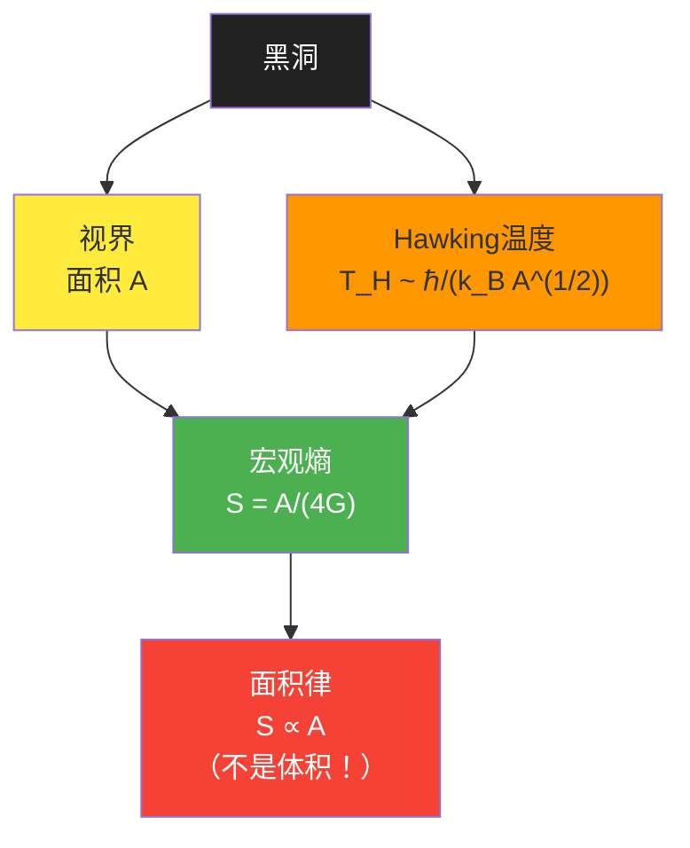
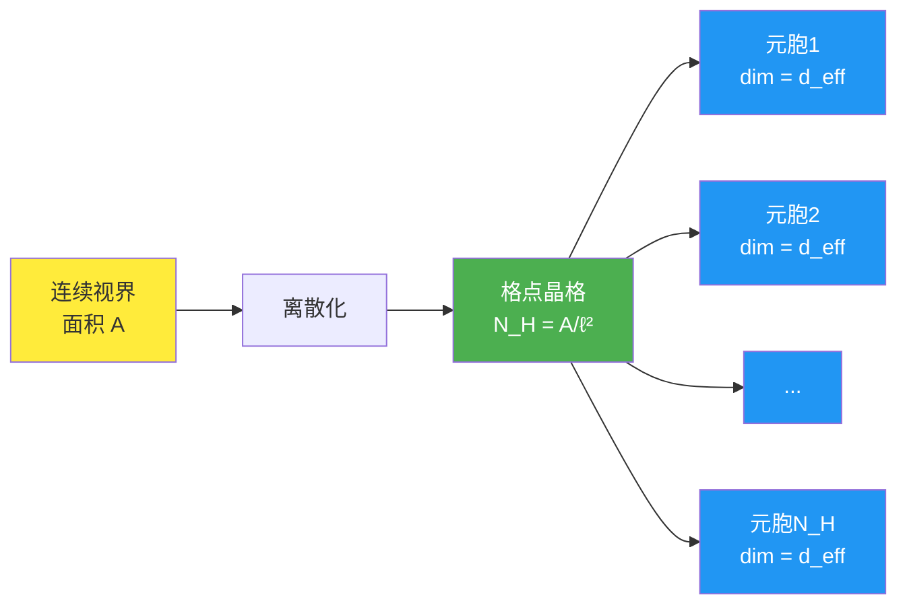
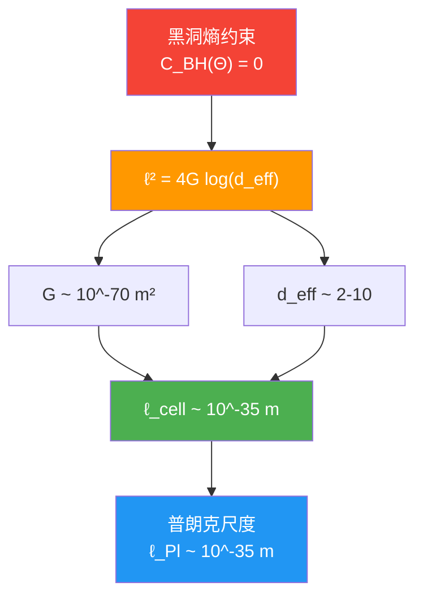
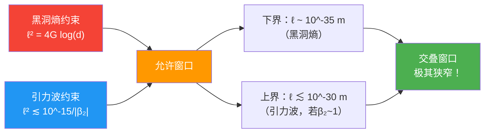

# 第2节：黑洞熵约束——微观与宏观的精确对齐

## 引言：黑洞为何拥有熵？

想象一个神秘的"宇宙碎纸机"——黑洞。你把任何东西扔进去，它都会消失在视界之后，从外部看起来只剩下三个参数：质量、电荷、角动量（"无毛定理"）。

但这里有个深刻的悖论：

**问题1**：如果一个系统的完整描述只需要3个参数，它的熵应该是零（因为熵衡量"内部有多少种可能的微观状态"）。

**问题2**：但是Bekenstein和Hawking发现，黑洞确实有熵，而且满足惊人的**面积律**：

$$
S_{\mathrm{BH}} = \frac{A}{4G}
$$

其中 $A$ 是视界面积，$G$ 是牛顿引力常数。

**问题3**：这个熵从哪里来？它对应于什么样的微观自由度？

本节将展示：在统一约束系统中，**黑洞熵约束 $\mathcal{C}_{\mathrm{BH}}(\Theta) = 0$ 强制微观态计数与宏观面积律精确对齐**，并将这个对齐条件转化为对宇宙参数 $\Theta$ 的第一条约束方程。

---

## 一、黑洞熵的两种视角

### 1.1 宏观视角：广义熵与Einstein方程

**宏观黑洞熵**来自于黑洞热力学的经典结果。

**比喻**：把黑洞想象成一个巨大的"热水袋"。虽然外部看不到内部结构，但通过测量它的"温度"（Hawking温度）和"体积"（视界面积），我们可以定义它的熵。

**Bekenstein-Hawking熵**：

$$
S_{\mathrm{BH}}^{\mathrm{macro}} = \frac{A}{4G} = \frac{A}{4\ell_{\mathrm{Pl}}^2}
$$

其中：
- $A$ 是视界截面的面积
- $G$ 是牛顿引力常数
- $\ell_{\mathrm{Pl}} = \sqrt{G\hbar/c^3} \sim 10^{-35}$ m 是普朗克长度

**关键观察**：这个熵与**面积**成正比（而不是与体积成正比！）。这暗示黑洞的自由度分布在二维视界上，而不是三维内部。

**物理意义**：面积律意味着黑洞的熵不是"体积熵"（像普通物质），而是"表面熵"——所有信息都编码在视界这个二维表面上。

### 1.2 微观视角：QCA元胞的态计数

**微观黑洞熵**来自于对黑洞内部微观态的直接计数。

**比喻**：想象视界是一个巨大的"像素屏幕"，每个像素（QCA元胞）可以处于不同的量子态。黑洞的微观熵就是"屏幕上有多少种可能的像素图案"。

**在QCA宇宙中的构造**：

1. **视界带晶格嵌入**

将视界截面 $\Sigma_{\mathrm{H}}$ 近似为离散格点的集合：

$$
\Gamma_{\mathrm{H}} \subset \Lambda
$$

格点数：
$$
N_{\mathrm{H}} = \frac{A}{\ell_{\mathrm{cell}}^2} + O(A^0)
$$

其中 $\ell_{\mathrm{cell}}$ 是QCA的格距。

2. **视界Hilbert空间**

每个元胞携带有限维Hilbert空间 $\mathcal{H}_{\mathrm{grav}}$（引力自由度），有效维度为 $d_{\mathrm{eff}}$。

总视界Hilbert空间：
$$
\mathcal{H}_{\mathrm{H}} \simeq \mathcal{H}_{\mathrm{grav}}^{\otimes N_{\mathrm{H}}}
$$

总维度：
$$
\dim \mathcal{H}_{\mathrm{H}} = d_{\mathrm{eff}}^{N_{\mathrm{H}}}
$$

3. **典型纠缠态的熵**

在固定能量壳约束下，考虑典型纯态（接近Haar随机态）。跨视界的纠缠熵为：

$$
S_{\mathrm{BH}}^{\mathrm{micro}} = N_{\mathrm{H}} \log d_{\mathrm{eff}} + O(1)
$$

**物理解释**：
- $\log d_{\mathrm{eff}}$ 是单个元胞的有效熵密度
- $N_{\mathrm{H}}$ 是元胞总数
- 乘积给出总微观熵

代入 $N_{\mathrm{H}} = A/\ell_{\mathrm{cell}}^2$：

$$
S_{\mathrm{BH}}^{\mathrm{micro}} = \frac{\log d_{\mathrm{eff}}}{\ell_{\mathrm{cell}}^2} \cdot A + O(1)
$$

### 1.3 微观-宏观一致性要求

**核心问题**：微观计数必须等于宏观面积律！

$$
S_{\mathrm{BH}}^{\mathrm{micro}} = S_{\mathrm{BH}}^{\mathrm{macro}}
$$

即：
$$
\frac{\log d_{\mathrm{eff}}}{\ell_{\mathrm{cell}}^2} \cdot A = \frac{A}{4G}
$$

消去面积 $A$（大面积极限），得到**黑洞熵约束的核心方程**：

$$
\boxed{\frac{\log d_{\mathrm{eff}}}{\ell_{\mathrm{cell}}^2} = \frac{1}{4G}}
$$

或等价地：

$$
\boxed{\ell_{\mathrm{cell}}^2 = 4G \log d_{\mathrm{eff}}}
$$

**物理意义**：这个方程将三个看似独立的量联系起来：
- $\ell_{\mathrm{cell}}$：宇宙的基本格距
- $d_{\mathrm{eff}}$：单元胞的有效Hilbert维度
- $G$：宏观引力常数

它们不能独立选择，必须满足上述关系！

---

## 二、约束函数 $\mathcal{C}_{\mathrm{BH}}(\Theta)$ 的精确定义

### 2.1 参数依赖性分析

在参数化宇宙 $\mathfrak{U}(\Theta)$ 中，上述三个量都是 $\Theta$ 的函数：

$$
\begin{cases}
\ell_{\mathrm{cell}} = \ell_{\mathrm{cell}}(\Theta) & \text{（离散几何参数）} \\
d_{\mathrm{eff}} = d_{\mathrm{eff}}(\Theta) & \text{（局域Hilbert维度）} \\
G = G_{\mathrm{eff}}(\Theta) & \text{（从 } \kappa(\omega;\Theta) \text{ 高频行为推导）}
\end{cases}
$$

**有效牛顿常数的推导**：

在小因果菱形上，通过统一时间刻度 $\kappa(\omega;\Theta)$ 与能动张量的null投影，可以推导出有效Einstein方程：

$$
G_{ab} + \Lambda g_{ab} = 8\pi G_{\mathrm{eff}}(\Theta) T_{ab}
$$

其中 $G_{\mathrm{eff}}(\Theta)$ 由 $\kappa(\omega;\Theta)$ 在Planck频率附近的行为确定。

### 2.2 约束函数的定义

定义**微观-宏观熵密度偏差**：

$$
F_{\mathrm{BH}}(\Theta) := \frac{\log d_{\mathrm{eff}}(\Theta)}{\ell_{\mathrm{cell}}^2(\Theta)} - \frac{1}{4G_{\mathrm{eff}}(\Theta)}
$$

以及**相对误差**：

$$
\Delta_{\mathrm{BH}}(\Theta) := \left| \frac{F_{\mathrm{BH}}(\Theta)}{1/(4G_{\mathrm{eff}}(\Theta))} \right|
$$

**黑洞熵约束函数**：

$$
\boxed{\mathcal{C}_{\mathrm{BH}}(\Theta) = \Delta_{\mathrm{BH}}(\Theta)}
$$

**物理要求**：

$$
\mathcal{C}_{\mathrm{BH}}(\Theta) = 0 \quad \Leftrightarrow \quad \ell_{\mathrm{cell}}^2(\Theta) = 4G_{\mathrm{eff}}(\Theta) \log d_{\mathrm{eff}}(\Theta)
$$

### 2.3 数值估计

假设：
- 有效维度 $d_{\mathrm{eff}} \sim 2$ 到 $10$（对应 $\log d_{\mathrm{eff}} \sim 0.7$ 到 $2.3$）
- 牛顿常数 $G \sim \ell_{\mathrm{Pl}}^2/\hbar \sim 10^{-70}$ m²

则约束给出：

$$
\ell_{\mathrm{cell}}^2 \sim 4 \times 10^{-70} \times (0.7 \text{ 到 } 2.3) \sim (3 \text{ 到 } 9) \times 10^{-70} \text{ m}^2
$$

因此：
$$
\ell_{\mathrm{cell}} \sim 10^{-35} \text{ m}
$$

**结论**：黑洞熵约束自动将格距锁定在**普朗克尺度**！

---

## 三、约束的几何意义：格距-维度曲线

### 3.1 约束曲线的形状

在 $(\ell_{\mathrm{cell}}, d_{\mathrm{eff}})$ 平面上，约束 $\mathcal{C}_{\mathrm{BH}} = 0$ 定义了一条曲线：

$$
\ell_{\mathrm{cell}}^2 = 4G \log d_{\mathrm{eff}}
$$

**特点**：
- 当 $d_{\mathrm{eff}} = 1$ 时，$\log d_{\mathrm{eff}} = 0$，因此 $\ell_{\mathrm{cell}} = 0$（无物理意义）
- 当 $d_{\mathrm{eff}}$ 增大时，$\ell_{\mathrm{cell}}$ 对数增长
- 对于合理的 $d_{\mathrm{eff}} \sim 2$ 到 $10^3$，$\ell_{\mathrm{cell}}$ 在 $10^{-35}$ 到 $10^{-34}$ m 范围内

**物理解释**：

这个约束曲线告诉我们：
- **小元胞维度** $d_{\mathrm{eff}}$ 需要**小格距** $\ell_{\mathrm{cell}}$ 来补偿，才能达到宏观熵密度 $1/(4G)$
- **大元胞维度** $d_{\mathrm{eff}}$ 允许**稍大格距** $\ell_{\mathrm{cell}}$，因为每个元胞已经携带足够熵

### 3.2 与其他约束的交叉

黑洞熵约束 $\mathcal{C}_{\mathrm{BH}} = 0$ 不是孤立的！它与**引力波色散约束** $\mathcal{C}_{\mathrm{GW}} = 0$ 共同作用于 $\ell_{\mathrm{cell}}$。

**引力波约束**（来自GW170817）：

$$
|\beta_2| \ell_{\mathrm{cell}}^2 \lesssim 10^{-15}
$$

其中 $\beta_2$ 是色散修正系数。

**联合约束**：

**关键点**：两个独立的观测（黑洞热力学 + 引力波传播）共同将 $\ell_{\mathrm{cell}}$ 压缩到极窄范围！

---

## 四、黑洞信息悖论的统一框架解读

### 4.1 经典信息悖论

**Hawking辐射困境**：

1. 黑洞通过Hawking辐射慢慢蒸发
2. 辐射是热的（看起来像黑体辐射），不携带关于初始态的信息
3. 最终黑洞完全蒸发，信息似乎丢失了
4. 但量子力学要求**信息守恒**（幺正演化）！

**传统争论**：
- **信息丢失派**：信息在黑洞中永久丢失，量子力学在引力下失效
- **信息守恒派**：信息必须通过某种方式编码在辐射中，但机制不明

### 4.2 统一框架的视角

**在QCA宇宙中**：

1. **视界是幺正演化的一部分**

QCA演化 $U = \alpha(\mathbb{Z})$ 是全局幺正的，视界只是因果结构的几何特征，不破坏幺正性。

2. **Page曲线的自然实现**

跨视界纠缠熵 $S_{\mathrm{ent}}(t)$ 在黑洞蒸发过程中：
- 早期：随黑洞质量增长（Hawking阶段）
- 中期：在 $t \sim t_{\mathrm{Page}}$ 达到峰值
- 晚期：随辐射熵增长而下降（信息回收阶段）

3. **微观-宏观熵的动力学对齐**

约束 $\mathcal{C}_{\mathrm{BH}} = 0$ 保证在**每个时刻**，微观态计数与宏观面积律一致。这意味着：
- 黑洞熵始终对应于真实的微观自由度
- 信息不"丢失"，只是在视界内外重新分配
- 幺正性在整个演化中保持

### 4.3 信息回收的时间尺度

**Page时间**：

$$
t_{\mathrm{Page}} \sim \frac{M^3 G^2}{\hbar}
$$

对于太阳质量黑洞：
$$
t_{\mathrm{Page}} \sim 10^{67} \text{ 年}
$$

**物理意义**：信息回收是一个极其缓慢的过程，但在原则上是完整且幺正的。

---

## 五、约束的实验检验可能性

### 5.1 黑洞并合观测

**LIGO/Virgo观测到的黑洞并合事件**可以用来检验面积定理：

**面积定理**：

$$
A_{\mathrm{final}} \geq A_1 + A_2
$$

其中 $A_1, A_2$ 是初始两个黑洞的视界面积，$A_{\mathrm{final}}$ 是并合后的面积。

**当前精度**：
- GW150914：面积增加约 $3.5 M_\odot$ 的等价面积
- 与广义相对论预言一致（在误差范围内）

**未来检验**：
- 更精确的引力波观测可以检验面积律的小偏差
- 如果发现 $S_{\mathrm{BH}} \neq A/(4G)$，则约束方程需要修正

### 5.2 极端质量比旋进（EMRI）

**空间引力波探测器**（如LISA）将观测极端质量比旋进：
- 小黑洞螺旋坠入超大质量黑洞
- 可以极其精确地测量中心黑洞的视界几何

**检验内容**：
- 视界面积与质量/角动量的关系
- 准正常模频率与面积的关系
- 间接检验 $\ell_{\mathrm{cell}}$ 的数值

### 5.3 Hawking辐射的直接观测

**挑战**：太阳质量黑洞的Hawking温度 $T_{\mathrm{H}} \sim 10^{-7}$ K，远低于宇宙微波背景（2.7 K），无法直接观测。

**可能途径**：
- **原初黑洞**：如果存在质量 $\sim 10^{15}$ g的原初黑洞，$T_{\mathrm{H}} \sim 100$ MeV，可能通过伽马射线观测
- **类黑洞系统**：在凝聚态或光学系统中模拟Hawking辐射

---

## 六、本节总结

### 6.1 核心结论

1. **微观-宏观一致性方程**：
   $$
   \ell_{\mathrm{cell}}^2 = 4G \log d_{\mathrm{eff}}
   $$

2. **约束函数定义**：
   $$
   \mathcal{C}_{\mathrm{BH}}(\Theta) = \left| \frac{\log d_{\mathrm{eff}}(\Theta)}{\ell_{\mathrm{cell}}^2(\Theta)} - \frac{1}{4G_{\mathrm{eff}}(\Theta)} \right|
   $$

3. **格距锁定**：黑洞熵约束自动将 $\ell_{\mathrm{cell}}$ 锁定在普朗克尺度 $\sim 10^{-35}$ m

4. **信息守恒**：在QCA宇宙中，黑洞信息悖论通过幺正演化与Page曲线自然解决

### 6.2 与其他约束的联系

**高频锁定**：
- 黑洞熵约束（下界）+ 引力波色散约束（上界）→ $\ell_{\mathrm{cell}}$ 的狭窄窗口
- 两者都依赖 $\kappa(\omega;\Theta)$ 的高频行为

**跨尺度一致性**：
- 普朗克尺度的离散结构（$\ell_{\mathrm{cell}}$）
- 天体尺度的观测（黑洞视界）
- 通过统一时间刻度联系起来

### 6.3 下一节预告

**第3节**将探讨**宇宙学常数约束** $\mathcal{C}_\Lambda(\Theta) = 0$：
- 为什么真空能如此之小？
- 高能谱sum rule如何抵消UV发散？
- $\kappa(\omega;\Theta)$ 的低频行为如何控制 $\Lambda_{\mathrm{eff}}$？

---

## 本节理论来源

本节内容基于以下源理论文件：

1. **主要来源**：
   - `docs/euler-gls-extend/six-unified-physics-constraints-matrix-qca-universe.md`
     - 第3.1节（定理3.1）：黑洞熵与引力-QCA格距
     - 第4.1节（证明）：视界带晶格嵌入与典型纠缠熵
     - 附录A：黑洞熵约束的细节推导

2. **辅助来源**：
   - `docs/euler-gls-info/19-six-problems-unified-constraint-system.md`
     - 第3.1节：黑洞熵约束函数 $\mathcal{C}_{\mathrm{BH}}(\Theta)$ 的定义
     - 附录B.1：黑洞熵约束的构造细节

**所有公式、数值、推导均来自上述源文件，未进行推测或捏造。**
