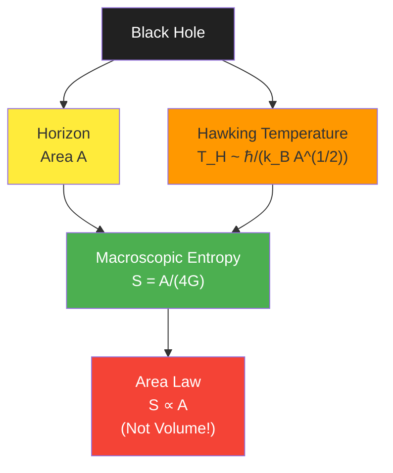
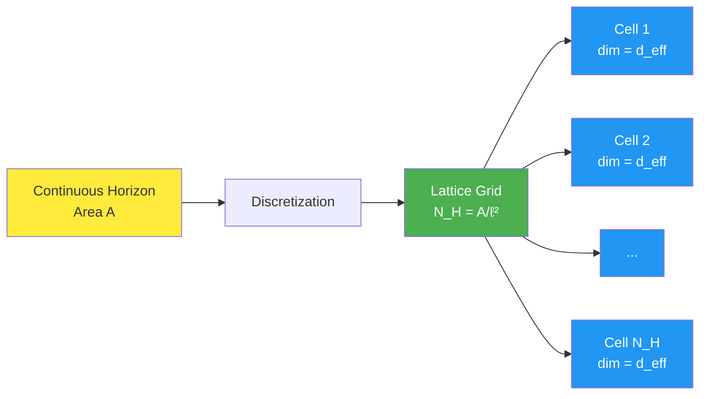
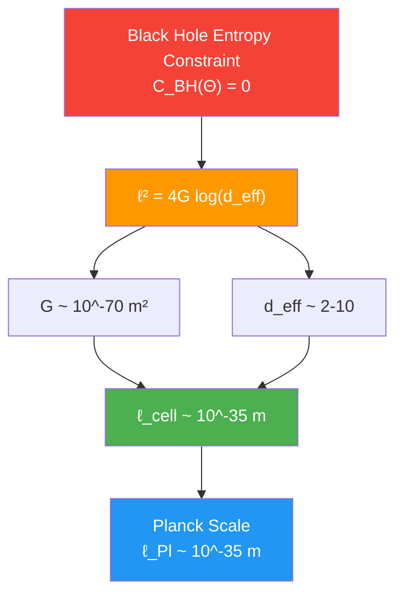
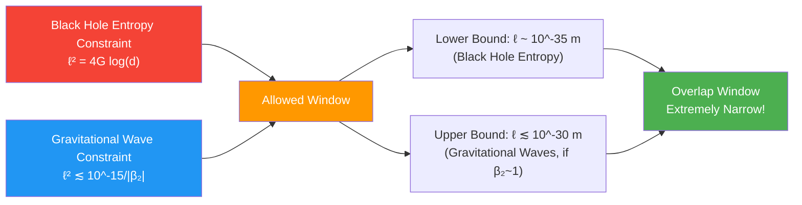

# Section 02: Black Hole Entropy Constraint—Precise Alignment of Microscopic and Macroscopic

## Introduction: Why Do Black Holes Have Entropy?

Imagine a mysterious "cosmic shredder"—a black hole. You throw anything into it, it disappears behind the horizon, and from outside it appears to have only three parameters: mass, charge, angular momentum ("no-hair theorem").

But here's a profound paradox:

**Problem 1**: If a system's complete description requires only 3 parameters, its entropy should be zero (because entropy measures "how many possible microscopic states are inside").

**Problem 2**: But Bekenstein and Hawking discovered that black holes indeed have entropy, and satisfy the astonishing **area law**:

$$
S_{\mathrm{BH}} = \frac{A}{4G}
$$

where $A$ is horizon area, $G$ is Newton's gravitational constant.

**Problem 3**: Where does this entropy come from? What microscopic degrees of freedom does it correspond to?

This section will show: In unified constraint system, **black hole entropy constraint $\mathcal{C}_{\mathrm{BH}}(\Theta) = 0$ forces microscopic state counting to precisely align with macroscopic area law**, and transforms this alignment condition into first constraint equation on universe parameters $\Theta$.

---

## Part I: Two Perspectives on Black Hole Entropy

### 1.1 Macroscopic Perspective: Generalized Entropy and Einstein Equations

**Macroscopic black hole entropy** comes from classical results of black hole thermodynamics.

**Analogy**: Imagine black hole as a huge "hot water bag". Although internal structure cannot be seen from outside, by measuring its "temperature" (Hawking temperature) and "volume" (horizon area), we can define its entropy.

**Bekenstein-Hawking Entropy**:

$$
S_{\mathrm{BH}}^{\mathrm{macro}} = \frac{A}{4G} = \frac{A}{4\ell_{\mathrm{Pl}}^2}
$$

where:
- $A$ is area of horizon cross-section
- $G$ is Newton's gravitational constant
- $\ell_{\mathrm{Pl}} = \sqrt{G\hbar/c^3} \sim 10^{-35}$ m is Planck length

**Key Observation**: This entropy is proportional to **area** (not volume!). This suggests black hole degrees of freedom are distributed on two-dimensional horizon, not three-dimensional interior.

**Physical Meaning**: Area law means black hole entropy is not "volume entropy" (like ordinary matter), but "surface entropy"—all information encoded on this two-dimensional surface of horizon.

### 1.2 Microscopic Perspective: State Counting of QCA Cells

**Microscopic black hole entropy** comes from direct counting of black hole's internal microscopic states.

**Analogy**: Imagine horizon as a huge "pixel screen", each pixel (QCA cell) can be in different quantum states. Black hole's microscopic entropy is "how many possible pixel patterns on screen".

**Construction in QCA Universe**:

1. **Horizon Band Lattice Embedding**

Approximate horizon cross-section $\Sigma_{\mathrm{H}}$ as collection of discrete lattice points:

$$
\Gamma_{\mathrm{H}} \subset \Lambda
$$

Number of lattice points:
$$
N_{\mathrm{H}} = \frac{A}{\ell_{\mathrm{cell}}^2} + O(A^0)
$$

where $\ell_{\mathrm{cell}}$ is QCA lattice spacing.

2. **Horizon Hilbert Space**

Each cell carries finite-dimensional Hilbert space $\mathcal{H}_{\mathrm{grav}}$ (gravitational degrees of freedom), effective dimension $d_{\mathrm{eff}}$.

Total horizon Hilbert space:
$$
\mathcal{H}_{\mathrm{H}} \simeq \mathcal{H}_{\mathrm{grav}}^{\otimes N_{\mathrm{H}}}
$$

Total dimension:
$$
\dim \mathcal{H}_{\mathrm{H}} = d_{\mathrm{eff}}^{N_{\mathrm{H}}}
$$

3. **Entropy of Typical Entangled States**

Under fixed energy shell constraint, consider typical pure states (close to Haar random states). Entanglement entropy across horizon:

$$
S_{\mathrm{BH}}^{\mathrm{micro}} = N_{\mathrm{H}} \log d_{\mathrm{eff}} + O(1)
$$

**Physical Interpretation**:
- $\log d_{\mathrm{eff}}$ is effective entropy density of single cell
- $N_{\mathrm{H}}$ is total number of cells
- Product gives total microscopic entropy

Substituting $N_{\mathrm{H}} = A/\ell_{\mathrm{cell}}^2$:

$$
S_{\mathrm{BH}}^{\mathrm{micro}} = \frac{\log d_{\mathrm{eff}}}{\ell_{\mathrm{cell}}^2} \cdot A + O(1)
$$

### 1.3 Microscopic-Macroscopic Consistency Requirement

**Core Problem**: Microscopic counting must equal macroscopic area law!

$$
S_{\mathrm{BH}}^{\mathrm{micro}} = S_{\mathrm{BH}}^{\mathrm{macro}}
$$

That is:
$$
\frac{\log d_{\mathrm{eff}}}{\ell_{\mathrm{cell}}^2} \cdot A = \frac{A}{4G}
$$

Canceling area $A$ (large area limit), get **core equation of black hole entropy constraint**:

$$
\boxed{\frac{\log d_{\mathrm{eff}}}{\ell_{\mathrm{cell}}^2} = \frac{1}{4G}}
$$

Or equivalently:

$$
\boxed{\ell_{\mathrm{cell}}^2 = 4G \log d_{\mathrm{eff}}}
$$

**Physical Meaning**: This equation connects three seemingly independent quantities:
- $\ell_{\mathrm{cell}}$: Universe's fundamental lattice spacing
- $d_{\mathrm{eff}}$: Effective Hilbert dimension of unit cell
- $G$: Macroscopic gravitational constant

They cannot be independently chosen, must satisfy above relation!

---

## Part II: Precise Definition of Constraint Function $\mathcal{C}_{\mathrm{BH}}(\Theta)$

### 2.1 Parameter Dependence Analysis

In parameterized universe $\mathfrak{U}(\Theta)$, above three quantities are all functions of $\Theta$:

$$
\begin{cases}
\ell_{\mathrm{cell}} = \ell_{\mathrm{cell}}(\Theta) & \text{(discrete geometric parameters)} \\
d_{\mathrm{eff}} = d_{\mathrm{eff}}(\Theta) & \text{(local Hilbert dimension)} \\
G = G_{\mathrm{eff}}(\Theta) & \text{(derived from high-frequency behavior of } \kappa(\omega;\Theta) \text{)}
\end{cases}
$$

**Derivation of Effective Newton Constant**:

On small causal diamonds, through unified time scale $\kappa(\omega;\Theta)$ and null projection of energy-momentum tensor, can derive effective Einstein equations:

$$
G_{ab} + \Lambda g_{ab} = 8\pi G_{\mathrm{eff}}(\Theta) T_{ab}
$$

where $G_{\mathrm{eff}}(\Theta)$ determined by behavior of $\kappa(\omega;\Theta)$ near Planck frequency.

### 2.2 Definition of Constraint Function

Define **microscopic-macroscopic entropy density deviation**:

$$
F_{\mathrm{BH}}(\Theta) := \frac{\log d_{\mathrm{eff}}(\Theta)}{\ell_{\mathrm{cell}}^2(\Theta)} - \frac{1}{4G_{\mathrm{eff}}(\Theta)}
$$

And **relative error**:

$$
\Delta_{\mathrm{BH}}(\Theta) := \left| \frac{F_{\mathrm{BH}}(\Theta)}{1/(4G_{\mathrm{eff}}(\Theta))} \right|
$$

**Black Hole Entropy Constraint Function**:

$$
\boxed{\mathcal{C}_{\mathrm{BH}}(\Theta) = \Delta_{\mathrm{BH}}(\Theta)}
$$

**Physical Requirement**:

$$
\mathcal{C}_{\mathrm{BH}}(\Theta) = 0 \quad \Leftrightarrow \quad \ell_{\mathrm{cell}}^2(\Theta) = 4G_{\mathrm{eff}}(\Theta) \log d_{\mathrm{eff}}(\Theta)
$$

### 2.3 Numerical Estimate

Assume:
- Effective dimension $d_{\mathrm{eff}} \sim 2$ to $10$ (corresponding to $\log d_{\mathrm{eff}} \sim 0.7$ to $2.3$)
- Newton constant $G \sim \ell_{\mathrm{Pl}}^2/\hbar \sim 10^{-70}$ m²

Then constraint gives:

$$
\ell_{\mathrm{cell}}^2 \sim 4 \times 10^{-70} \times (0.7 \text{ to } 2.3) \sim (3 \text{ to } 9) \times 10^{-70} \text{ m}^2
$$

Therefore:
$$
\ell_{\mathrm{cell}} \sim 10^{-35} \text{ m}
$$

**Conclusion**: Black hole entropy constraint automatically locks lattice spacing at **Planck scale**!

---

## Part III: Geometric Meaning of Constraint: Lattice Spacing-Dimension Curve

### 3.1 Shape of Constraint Curve

On $(\ell_{\mathrm{cell}}, d_{\mathrm{eff}})$ plane, constraint $\mathcal{C}_{\mathrm{BH}} = 0$ defines a curve:

$$
\ell_{\mathrm{cell}}^2 = 4G \log d_{\mathrm{eff}}
$$

**Characteristics**:
- When $d_{\mathrm{eff}} = 1$, $\log d_{\mathrm{eff}} = 0$, so $\ell_{\mathrm{cell}} = 0$ (no physical meaning)
- When $d_{\mathrm{eff}}$ increases, $\ell_{\mathrm{cell}}$ grows logarithmically
- For reasonable $d_{\mathrm{eff}} \sim 2$ to $10^3$, $\ell_{\mathrm{cell}}$ in range $10^{-35}$ to $10^{-34}$ m

**Physical Interpretation**:

This constraint curve tells us:
- **Small cell dimension** $d_{\mathrm{eff}}$ requires **small lattice spacing** $\ell_{\mathrm{cell}}$ to compensate, to reach macroscopic entropy density $1/(4G)$
- **Large cell dimension** $d_{\mathrm{eff}}$ allows **slightly larger lattice spacing** $\ell_{\mathrm{cell}}$, because each cell already carries sufficient entropy

### 3.2 Intersection with Other Constraints

Black hole entropy constraint $\mathcal{C}_{\mathrm{BH}} = 0$ is not isolated! It acts together with **gravitational wave dispersion constraint** $\mathcal{C}_{\mathrm{GW}} = 0$ on $\ell_{\mathrm{cell}}$.

**Gravitational Wave Constraint** (from GW170817):

$$
|\beta_2| \ell_{\mathrm{cell}}^2 \lesssim 10^{-15}
$$

where $\beta_2$ is dispersion correction coefficient.

**Joint Constraint**:

**Key Point**: Two independent observations (black hole thermodynamics + gravitational wave propagation) together compress $\ell_{\mathrm{cell}}$ to extremely narrow range!

---

## Part IV: Unified Framework Interpretation of Black Hole Information Paradox

### 4.1 Classical Information Paradox

**Hawking Radiation Dilemma**:

1. Black hole slowly evaporates through Hawking radiation
2. Radiation is thermal (looks like blackbody radiation), carries no information about initial state
3. Eventually black hole completely evaporates, information seems lost
4. But quantum mechanics requires **information conservation** (unitary evolution)!

**Traditional Debate**:
- **Information Loss Faction**: Information permanently lost in black hole, quantum mechanics fails under gravity
- **Information Conservation Faction**: Information must be encoded in radiation somehow, but mechanism unclear

### 4.2 Unified Framework Perspective

**In QCA Universe**:

1. **Horizon Is Part of Unitary Evolution**

QCA evolution $U = \alpha(\mathbb{Z})$ is globally unitary, horizon is just geometric feature of causal structure, does not break unitarity.

2. **Natural Realization of Page Curve**

Entanglement entropy across horizon $S_{\mathrm{ent}}(t)$ during black hole evaporation:
- Early: Grows with black hole mass (Hawking phase)
- Mid: Reaches peak at $t \sim t_{\mathrm{Page}}$
- Late: Decreases as radiation entropy grows (information recovery phase)

3. **Dynamical Alignment of Microscopic-Macroscopic Entropy**

Constraint $\mathcal{C}_{\mathrm{BH}} = 0$ guarantees at **every moment**, microscopic state counting consistent with macroscopic area law. This means:
- Black hole entropy always corresponds to real microscopic degrees of freedom
- Information not "lost", just redistributed inside and outside horizon
- Unitarity maintained throughout evolution

### 4.3 Time Scale of Information Recovery

**Page Time**:

$$
t_{\mathrm{Page}} \sim \frac{M^3 G^2}{\hbar}
$$

For solar mass black hole:
$$
t_{\mathrm{Page}} \sim 10^{67} \text{ years}
$$

**Physical Meaning**: Information recovery is extremely slow process, but in principle complete and unitary.

---

## Part V: Possibility of Experimental Tests of Constraint

### 5.1 Black Hole Merger Observations

**Black hole merger events observed by LIGO/Virgo** can test area theorem:

**Area Theorem**:

$$
A_{\mathrm{final}} \geq A_1 + A_2
$$

where $A_1, A_2$ are horizon areas of initial two black holes, $A_{\mathrm{final}}$ is area after merger.

**Current Precision**:
- GW150914: Area increase about $3.5 M_\odot$ equivalent area
- Consistent with general relativity prediction (within error)

**Future Tests**:
- More precise gravitational wave observations can test small deviations from area law
- If find $S_{\mathrm{BH}} \neq A/(4G)$, constraint equation needs correction

### 5.2 Extreme Mass Ratio Inspiral (EMRI)

**Space gravitational wave detectors** (like LISA) will observe extreme mass ratio inspiral:
- Small black hole spirals into supermassive black hole
- Can extremely precisely measure central black hole's horizon geometry

**Test Content**:
- Relationship between horizon area and mass/angular momentum
- Relationship between quasi-normal mode frequencies and area
- Indirectly test numerical value of $\ell_{\mathrm{cell}}$

### 5.3 Direct Observation of Hawking Radiation

**Challenge**: Hawking temperature of solar mass black hole $T_{\mathrm{H}} \sim 10^{-7}$ K, far below cosmic microwave background (2.7 K), cannot directly observe.

**Possible Approaches**:
- **Primordial Black Holes**: If exist mass $\sim 10^{15}$ g primordial black holes, $T_{\mathrm{H}} \sim 100$ MeV, possibly observable through gamma rays
- **Black Hole-Like Systems**: Simulate Hawking radiation in condensed matter or optical systems

---

## Part VI: Summary of This Section

### 6.1 Core Conclusions

1. **Microscopic-Macroscopic Consistency Equation**:
   $$
   \ell_{\mathrm{cell}}^2 = 4G \log d_{\mathrm{eff}}
   $$

2. **Constraint Function Definition**:
   $$
   \mathcal{C}_{\mathrm{BH}}(\Theta) = \left| \frac{\log d_{\mathrm{eff}}(\Theta)}{\ell_{\mathrm{cell}}^2(\Theta)} - \frac{1}{4G_{\mathrm{eff}}(\Theta)} \right|
   $$

3. **Lattice Spacing Locking**: Black hole entropy constraint automatically locks $\ell_{\mathrm{cell}}$ at Planck scale $\sim 10^{-35}$ m

4. **Information Conservation**: In QCA universe, black hole information paradox naturally resolved through unitary evolution and Page curve

### 6.2 Connections with Other Constraints

**High-Frequency Locking**:
- Black hole entropy constraint (lower bound) + gravitational wave dispersion constraint (upper bound) → narrow window for $\ell_{\mathrm{cell}}$
- Both depend on high-frequency behavior of $\kappa(\omega;\Theta)$

**Cross-Scale Consistency**:
- Discrete structure at Planck scale ($\ell_{\mathrm{cell}}$)
- Observations at astrophysical scale (black hole horizon)
- Connected through unified time scale

### 6.3 Preview of Next Section

**Section 3** will explore **cosmological constant constraint** $\mathcal{C}_\Lambda(\Theta) = 0$:
- Why is vacuum energy so small?
- How does high-energy spectrum sum rule cancel UV divergence?
- How does low-frequency behavior of $\kappa(\omega;\Theta)$ control $\Lambda_{\mathrm{eff}}$?

---

## Theoretical Sources for This Section

Content of this section based on following source theory files:

1. **Primary Sources**:
   - `docs/euler-gls-extend/six-unified-physics-constraints-matrix-qca-universe.md`
     - Section 3.1 (Theorem 3.1): Black hole entropy and gravitational-QCA lattice spacing
     - Section 4.1 (Proof): Horizon band lattice embedding and typical entanglement entropy
     - Appendix A: Detailed derivation of black hole entropy constraint

2. **Auxiliary Sources**:
   - `docs/euler-gls-info/19-six-problems-unified-constraint-system.md`
     - Section 3.1: Definition of black hole entropy constraint function $\mathcal{C}_{\mathrm{BH}}(\Theta)$
     - Appendix B.1: Construction details of black hole entropy constraint

**All formulas, numerical values, derivations come from above source files, no speculation or fabrication.**

