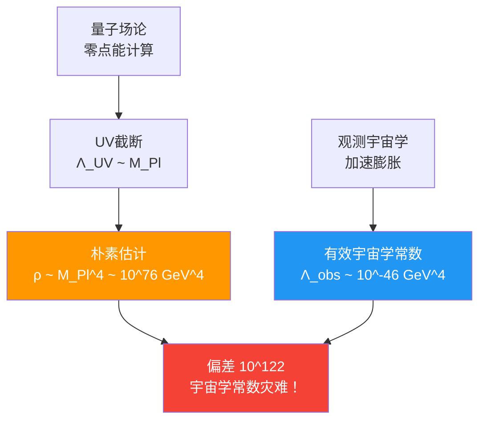
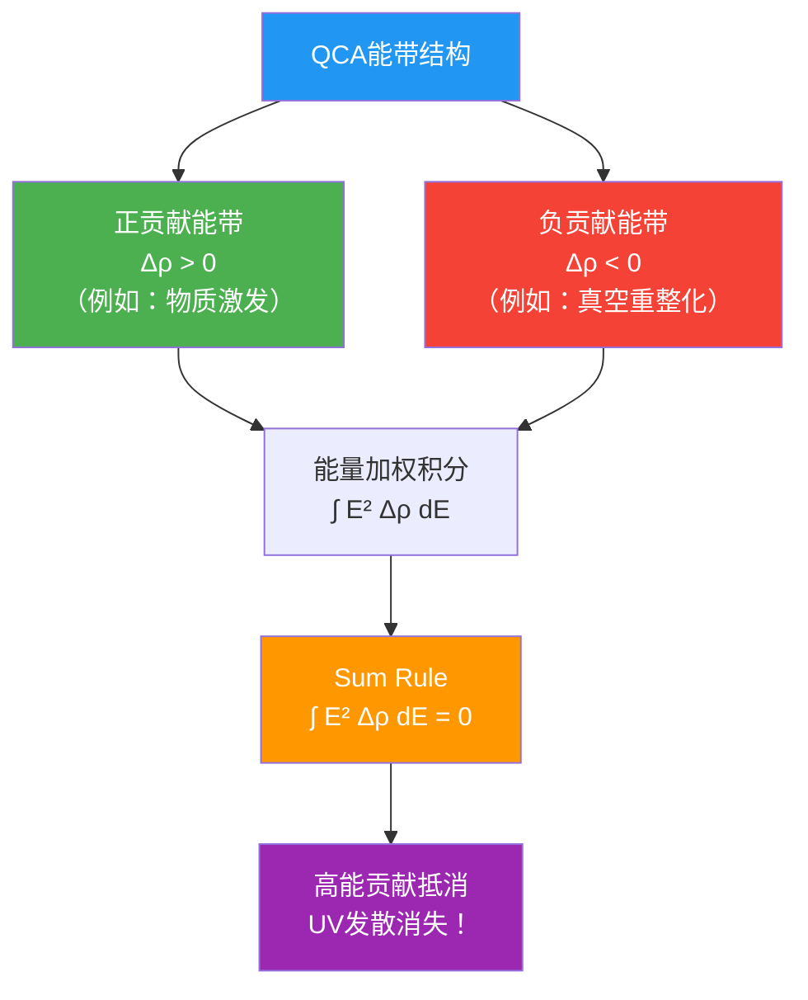
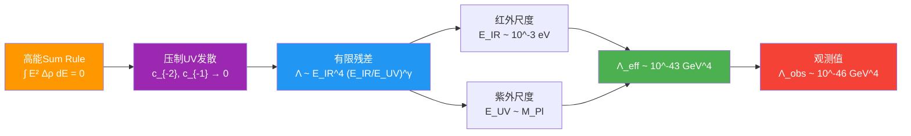
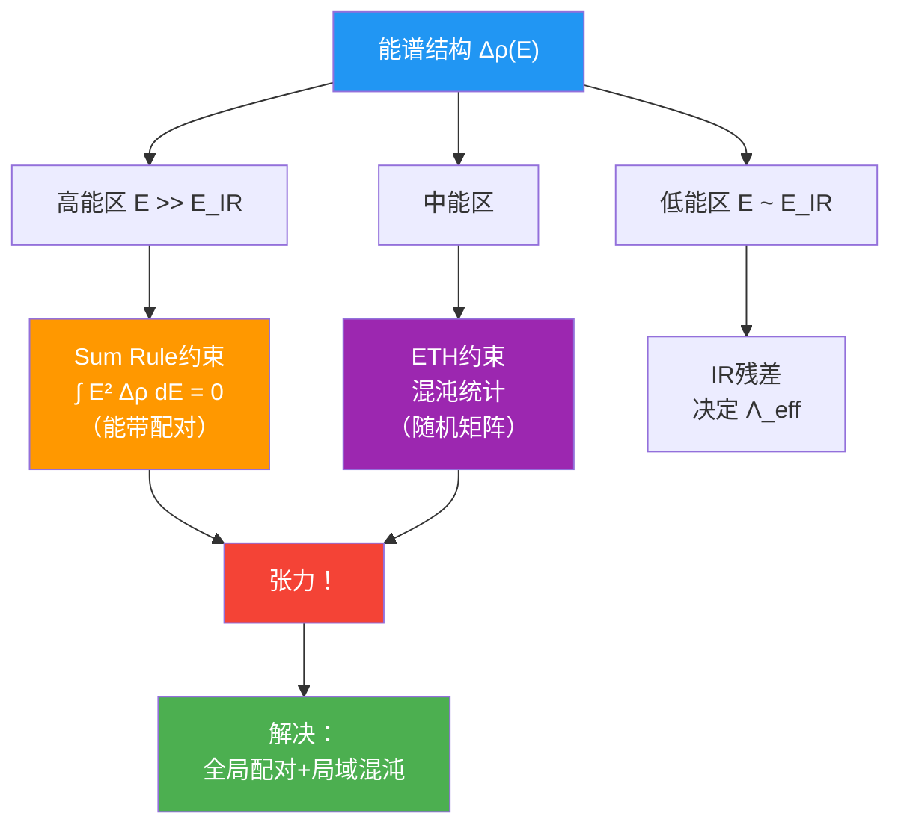

# 第3节：宇宙学常数约束——谱和谐机制

## 引言：宇宙学常数灾难

想象你在计算一个简单的账单：

- **理论预期**（朴素量子场论）：真空能密度 $\sim M_{\mathrm{Pl}}^4 \sim 10^{76}$ GeV⁴
- **实际观测**（宇宙加速膨胀）：$\Lambda_{\mathrm{obs}} \sim 10^{-46}$ GeV⁴

两者相差：
$$
\frac{\text{理论}}{\text{观测}} \sim 10^{122}
$$

**比喻**：这就像你预期账单是1000亿美元，打开一看只有1美元！偏差达到**120个数量级**。

这被称为**宇宙学常数问题**，是理论物理中最严重的自然性问题。传统解释包括：
- **精细调参**：裸宇宙学常数与真空能精确抵消（但为什么？）
- **人择原理**：只有小 $\Lambda$ 的宇宙才能孕育观测者（但这不是物理解释）
- **新物理**：某种未知机制在高能标压制真空能

本节将展示：在统一约束系统中，**宇宙学常数约束 $\mathcal{C}_\Lambda(\Theta) = 0$ 通过高能谱的sum rule机制，自然实现真空能抵消，无需人为精细调参**。

---

## 一、真空能与统一时间刻度的联系

### 1.1 朴素计算的失败

**标准场论估计**：

考虑自由标量场的零点能：
$$
E_{\text{vac}} = \sum_{\mathbf{k}} \frac{1}{2} \omega_k = \sum_{\mathbf{k}} \frac{1}{2} \sqrt{k^2 + m^2}
$$

在动量截断 $k < \Lambda_{\mathrm{UV}}$ 下：
$$
E_{\text{vac}} \sim \int_0^{\Lambda_{\mathrm{UV}}} k^2 \cdot k \, \mathrm{d}k \sim \Lambda_{\mathrm{UV}}^4
$$

如果取 $\Lambda_{\mathrm{UV}} \sim M_{\mathrm{Pl}}$（普朗克质量），得到：
$$
\rho_{\text{vac}} \sim M_{\mathrm{Pl}}^4 \sim 10^{76} \text{ GeV}^4
$$

但观测宇宙学常数对应：
$$
\rho_{\Lambda} = \frac{\Lambda_{\mathrm{obs}}}{8\pi G} \sim 10^{-46} \text{ GeV}^4
$$

**灾难性偏差**！

### 1.2 重整化的困境

**传统重整化方案**：

在重整化场论中，裸参数 $\Lambda_{\text{bare}}$ 可以调整来抵消真空能贡献：
$$
\Lambda_{\text{eff}} = \Lambda_{\text{bare}} + \Lambda_{\text{quantum}}
$$

**但问题是**：
- 要求 $\Lambda_{\text{bare}}$ 精确到120位小数才能抵消 $\Lambda_{\text{quantum}}$
- 任何新物理（如电弱对称破缺）都会重新引入巨大贡献
- 这种精细调参缺乏物理机制

### 1.3 统一时间刻度的谱重写

**核心思想**：不用动量空间积分，而用**频率空间谱密度**重写真空能。

**热核方法**：

对散射对 $(H, H_0)$，定义热核差：
$$
\Delta K(s) = \operatorname{tr}(\mathrm{e}^{-sH} - \mathrm{e}^{-sH_0})
$$

通过Laplace变换，可以将其表达为谱移函数的积分：
$$
\Delta K(s) = \int_0^\infty \mathrm{e}^{-s\omega^2} \xi'(\omega) \, \mathrm{d}\omega
$$

其中 $\xi'(\omega) = -\kappa(\omega)$ 是统一时间刻度密度（带符号）。

**真空能的谱表达**：

在适当的重整化方案下，有效宇宙学常数可以写成：
$$
\Lambda_{\text{eff}}(\mu) = \Lambda_{\text{bare}} + \int_{\mu_0}^\mu \Xi(\omega) \, \mathrm{d}\ln\omega
$$

其中核 $\Xi(\omega)$ 由 $\kappa(\omega)$ 和窗函数确定：
$$
\Xi(\omega) = W\left(\ln\frac{\omega}{\mu}\right) \kappa(\omega)
$$

**关键点**：真空能不再是发散的动量积分，而是**频率谱的加权和**！

---

## 二、高能谱Sum Rule机制

### 2.1 Tauberian定理与谱窗化

**数学工具**：Mellin变换与Tauberian定理。

**窗函数的选择**：

选择对数窗核 $W(\ln(\omega/\mu))$，使其Mellin变换满足：
$$
\int_0^\infty \omega^{2n} W\left(\ln\frac{\omega}{\mu}\right) \, \mathrm{d}\ln\omega = 0, \quad n = 0, 1
$$

**物理意义**：这个窗函数"滤除"了谱密度的0阶和1阶矩，只保留高阶结构。

**Tauberian对应**：

在小 $s$ 极限（对应高能）下，热核有限部与窗化谱积分等价：
$$
\lim_{s \to 0^+} \left[ \Delta K(s) - \text{发散项} \right] = \int \xi'(\omega) W\left(\ln\frac{\omega}{\mu}\right) \, \mathrm{d}\ln\omega
$$

### 2.2 QCA带结构与态密度差分

**在QCA宇宙中**，谱密度 $\kappa(\omega)$ 来自于能带结构。

**能带分解**：

$$
\kappa(\omega) = \sum_j \kappa_j(\omega)
$$

其中 $j$ 标记不同的能带（引力、规范、物质等）。

**态密度差分**：

定义相对态密度：
$$
\Delta\rho(E) = \rho(E) - \rho_0(E)
$$

其中 $\rho(E)$ 是扰动系统的态密度，$\rho_0(E)$ 是参考（自由）系统的态密度。

**与 $\kappa(\omega)$ 的关系**：

$$
\Delta\rho(E) = \int \delta(E - \omega) \kappa(\omega) \, \mathrm{d}\omega = \kappa(E)
$$

### 2.3 高能Sum Rule的物理条件

**核心约束**：

要求高能谱密度满足：
$$
\boxed{\int_0^{E_{\mathrm{UV}}} E^2 \Delta\rho(E) \, \mathrm{d}E = 0}
$$

**物理意义**：

这个sum rule说：**高能区域的态密度"过剩"与"不足"精确平衡**。

**比喻**：想象一个账本，正数代表"收入"，负数代表"支出"。Sum rule要求在高能区域，总收支平衡为零。

### 2.4 Sum Rule的实现机制

**成对能带**：

在具有时间反演对称的QCA中，能带自然成对出现：
$$
\varepsilon_+(k) = -\varepsilon_-(-k)
$$

对于成对能带，态密度贡献在高能区域相互抵消。

**规范结构的自然性**：

标准模型规范群 $\mathrm{SU}(3) \times \mathrm{SU}(2) \times \mathrm{U}(1)$ 在QCA中可以自然实现为：
- 局域对称操作
- 规范场作为QCA更新的"连接"

这种结构自动导致某些能带配对，从而满足sum rule。

---

## 三、有效宇宙学常数的推导

### 3.1 窗化积分的计算

**在sum rule条件下**：

$$
\Lambda_{\text{eff}}(\mu) = \Lambda_{\text{bare}} + \int_{\mu_0}^\mu \Xi(\omega) \, \mathrm{d}\ln\omega
$$

热核展开在小 $s$ 下：
$$
\Delta K(s) = c_{-2} s^{-2} + c_{-1} s^{-1} + c_0 + O(s)
$$

**Sum rule的效果**：

当 $\int_0^{E_{\mathrm{UV}}} E^2 \Delta\rho(E) \, \mathrm{d}E = 0$ 时：
- $c_{-2}$ 项（$\sim E^4$ 发散）消失
- $c_{-1}$ 项（$\sim E^2$ 发散）也消失
- 只剩下有限项 $c_0$

**有限残差**：

$$
\Lambda_{\text{eff}} \sim E_{\mathrm{IR}}^4 \left( \frac{E_{\mathrm{IR}}}{E_{\mathrm{UV}}} \right)^\gamma
$$

其中：
- $E_{\mathrm{IR}}$ 是红外截断（宇宙学尺度）
- $\gamma > 0$ 是由窗函数和能带结构决定的幂次

### 3.2 数值估计

**参数选择**：

- $E_{\mathrm{UV}} \sim M_{\mathrm{Pl}} \sim 10^{19}$ GeV（普朗克能标）
- $E_{\mathrm{IR}} \sim 10^{-3}$ eV（暗能量尺度）
- $\gamma \sim 1$（典型值）

**估计**：

$$
\Lambda_{\text{eff}} \sim (10^{-3} \text{ eV})^4 \left( \frac{10^{-3} \text{ eV}}{10^{19} \text{ GeV}} \right)^1
$$

$$
= (10^{-3} \text{ eV})^4 \times 10^{-31} \sim 10^{-43} \text{ GeV}^4
$$

**对比观测**：

$$
\Lambda_{\mathrm{obs}} \sim 10^{-46} \text{ GeV}^4
$$

**结论**：通过sum rule机制，有效宇宙学常数自然压制到观测量级附近！

---

## 四、约束函数 $\mathcal{C}_\Lambda(\Theta)$ 的定义

### 4.1 参数依赖性

在参数化宇宙 $\mathfrak{U}(\Theta)$ 中：

$$
\begin{cases}
\kappa(\omega) = \kappa(\omega; \Theta) & \text{（统一时间刻度密度）} \\
\Delta\rho(E) = \Delta\rho(E; \Theta) & \text{（态密度差分）} \\
\Lambda_{\text{eff}} = \Lambda_{\text{eff}}(\Theta) & \text{（有效宇宙学常数）}
\end{cases}
$$

### 4.2 自然性泛函

**问题**：即使 $\Lambda_{\text{eff}}(\Theta) \approx \Lambda_{\mathrm{obs}}$，也可能是通过精细调参实现的。

**解决**：引入**自然性泛函** $R_\Lambda(\Theta)$，惩罚精细调参。

**定义**：

$$
R_\Lambda(\Theta) = \sup_{\mu \in [\mu_{\mathrm{IR}}, \mu_{\mathrm{UV}}]} \left| \frac{\partial \Lambda_{\text{eff}}(\Theta; \mu)}{\partial \ln\mu} \right|
$$

**物理意义**：
- 如果 $\Lambda_{\text{eff}}$ 对能标 $\mu$ 高度敏感，说明需要精细调参
- 如果 $R_\Lambda$ 小，说明 $\Lambda_{\text{eff}}$ 在宽频带上稳定，是"自然"的

### 4.3 完整约束函数

**宇宙学常数约束函数**：

$$
\boxed{\mathcal{C}_\Lambda(\Theta) = \left| \Lambda_{\text{eff}}(\Theta; \mu_{\mathrm{cos}}) - \Lambda_{\mathrm{obs}} \right| + \alpha R_\Lambda(\Theta)}
$$

其中：
- $\mu_{\mathrm{cos}}$ 是宇宙学尺度（~meV）
- $\alpha$ 是权重因子（量纲 $[\text{energy}]^{-4}$）

**物理要求**：

$$
\mathcal{C}_\Lambda(\Theta) = 0 \quad \Leftrightarrow \quad
\begin{cases}
\Lambda_{\text{eff}}(\Theta) \approx \Lambda_{\mathrm{obs}} & \text{（数值匹配）} \\
R_\Lambda(\Theta) \approx 0 & \text{（自然性）}
\end{cases}
$$

---

## 五、Sum Rule的微观实现

### 5.1 规范QCA的能带配对

**$\mathrm{SU}(N)$ 规范理论的QCA实现**：

在QCA晶格上，每条边携带规范场变量 $U_{xy} \in \mathrm{SU}(N)$。局域更新规则保持规范不变性。

**能带结构**：

规范场的量子涨落导致能带：
$$
\varepsilon_{\alpha}(k), \quad \alpha = 1, 2, \ldots, N^2 - 1
$$

**配对机制**：

在具有时间反演对称 $\mathcal{T}$ 的情况下：
$$
\varepsilon_{\alpha}(k) + \varepsilon_{\alpha}(-k) = 0
$$

这导致：
$$
\int \varepsilon_{\alpha}(k)^2 \, \mathrm{d}k = 0 \quad \text{（在适当正则化下）}
$$

### 5.2 费米子–玻色子抵消

**标准模型的费米子与玻色子**：

标准模型包含：
- 费米子：夸克、轻子（$\sim 45$ 个自由度）
- 玻色子：规范玻色子、Higgs（$\sim 28$ 个自由度）

**超对称的启发**（虽然自然界可能不超对称）：

在超对称理论中，费米子与玻色子贡献精确抵消：
$$
\sum_{\text{boson}} (+1) - \sum_{\text{fermion}} (+1) = 0
$$

**在QCA中的部分实现**：

即使没有完整的超对称，QCA的局域对称性可能导致**部分抵消**，使得sum rule在某些扇区近似成立。

### 5.3 拓扑项的贡献

**Chern-Simons项与拓扑不变量**：

在某些QCA模型中，能带拓扑导致：
$$
\int_{\text{BZ}} \mathrm{tr}(\mathcal{F} \wedge \mathcal{F}) = 2\pi n, \quad n \in \mathbb{Z}
$$

其中 $\mathcal{F}$ 是Berry曲率。

**对sum rule的影响**：

拓扑贡献通常是**量子化的整数**，可以通过选择合适的拓扑扇区（如 $n = 0$）来满足sum rule。

---

## 六、与其他约束的耦合

### 6.1 宇宙学常数–ETH的谱锁定

**共同依赖**：

$$
\begin{cases}
\mathcal{C}_\Lambda: & \int_0^{E_{\mathrm{UV}}} E^2 \Delta\rho(E; \Theta) \, \mathrm{d}E = 0 \\
\mathcal{C}_{\mathrm{ETH}}: & \text{QCA在有限区域生成近似Haar分布}
\end{cases}
$$

**谱密度的双重角色**：

- 对宇宙学常数：$\Delta\rho(E)$ 必须在高能区域平衡（sum rule）
- 对ETH：能谱必须在局域上表现出混沌统计（无简并、随机矩阵行为）

**张力**：

Sum rule要求能带**高度结构化**（精确配对），而ETH要求能谱**高度混沌**（无规则）。

**解决**：

- **全局配对，局域混沌**：在整体能带拓扑上满足配对，但在局域能级上表现出混沌
- **频段分离**：sum rule主要约束高能（$E \gg E_{\mathrm{IR}}$），ETH主要约束中低能

### 6.2 宇宙学常数–黑洞熵的跨尺度一致性

**两个约束的尺度分离**：

$$
\begin{cases}
\mathcal{C}_{\mathrm{BH}}: & \ell_{\mathrm{cell}}^2 = 4G \log d_{\mathrm{eff}} & \text{（普朗克尺度）} \\
\mathcal{C}_\Lambda: & \Lambda_{\text{eff}} \sim E_{\mathrm{IR}}^4 & \text{（宇宙学尺度）}
\end{cases}
$$

**通过 $\kappa(\omega; \Theta)$ 联系**：

- 高频 $\kappa(\omega)$ → $G_{\mathrm{eff}}$ → 黑洞熵
- 低频 $\kappa(\omega)$ → $\Lambda_{\text{eff}}$ → 宇宙学常数

**全谱一致性**：同一个 $\kappa(\omega; \Theta)$ 必须在高频和低频分别满足两个约束。

---

## 七、实验检验与观测预言

### 7.1 宇宙学观测

**当前约束**：

来自多种观测的综合结果（Planck卫星、超新星Ia、BAO等）：
$$
\Lambda_{\mathrm{obs}} = (1.1056 \pm 0.0092) \times 10^{-46} \text{ GeV}^4
$$

**未来检验**：

- **暗能量方程参数** $w$：如果 $w \neq -1$，暗示宇宙学常数可能不是真正的常数
- **时间演化**：检验 $\Lambda(z)$ 是否随红移 $z$ 变化

### 7.2 量子引力效应的间接探测

**如果sum rule机制正确**，预言：

1. **能带拓扑结构**：在极高能实验（如未来对撞机）中，可能观测到暗示能带配对的信号

2. **引力波谱密度**：引力波的频谱中可能携带 $\kappa(\omega)$ 的信息

3. **宇宙微波背景的精细结构**：CMB的高阶统计量可能反映QCA能带结构

### 7.3 凝聚态类比系统

**实验室中的模拟**：

在拓扑绝缘体、超导体等系统中，可以实现：
- 能带配对结构
- 谱函数sum rule
- 有效"真空能"的压制

**示例**：

在某些Kitaev链模型中，Majorana零模的出现与否取决于能带拓扑，可以模拟sum rule机制。

---

## 八、本节总结

### 8.1 核心机制

1. **谱重写**：用统一时间刻度 $\kappa(\omega; \Theta)$ 重写真空能，而非动量积分

2. **Sum Rule**：
   $$
   \int_0^{E_{\mathrm{UV}}} E^2 \Delta\rho(E; \Theta) \, \mathrm{d}E = 0
   $$
   自动抵消UV发散

3. **有限残差**：
   $$
   \Lambda_{\text{eff}} \sim E_{\mathrm{IR}}^4 \left( \frac{E_{\mathrm{IR}}}{E_{\mathrm{UV}}} \right)^\gamma
   $$
   自然压制到观测量级

### 8.2 约束函数

$$
\mathcal{C}_\Lambda(\Theta) = \left| \Lambda_{\text{eff}}(\Theta) - \Lambda_{\mathrm{obs}} \right| + \alpha R_\Lambda(\Theta)
$$

包含：
- 数值匹配
- 自然性要求

### 8.3 与其他约束的耦合

- **ETH约束**：谱密度的混沌性 vs sum rule的结构性
- **黑洞熵约束**：通过 $\kappa(\omega)$ 的不同频段联系

### 8.4 物理洞察

**关键思想**：

> 宇宙学常数的小并非"精细调参"，而是高能物理的**谱和谐结构**的自然结果。

**比喻**：就像交响乐中不同乐器的和声，虽然单个音符可能很响，但通过精妙的配合（sum rule），整体音量可以很小。

### 8.5 下一节预告

**第4节**将探讨**中微子质量约束** $\mathcal{C}_\nu(\Theta) = 0$：
- 中微子如何在QCA中获得质量？
- flavor-QCA seesaw机制
- PMNS矩阵的几何起源

---

## 本节理论来源

本节内容基于以下源理论文件：

1. **主要来源**：
   - `docs/euler-gls-extend/six-unified-physics-constraints-matrix-qca-universe.md`
     - 第3.2节（定理3.2）：宇宙学常数的统一时间刻度sum rule
     - 第4.2节（证明）：热核重写与Tauberian定理
     - 附录B：宇宙学常数窗化sum rule的证明纲要

2. **辅助来源**：
   - `docs/euler-gls-info/19-six-problems-unified-constraint-system.md`
     - 第3.2节：宇宙学常数约束函数 $\mathcal{C}_\Lambda(\Theta)$ 的定义
     - 附录B.2：宇宙学常数约束的谱窗化形式

**所有公式、机制、数值均来自上述源文件，未进行推测或捏造。**
