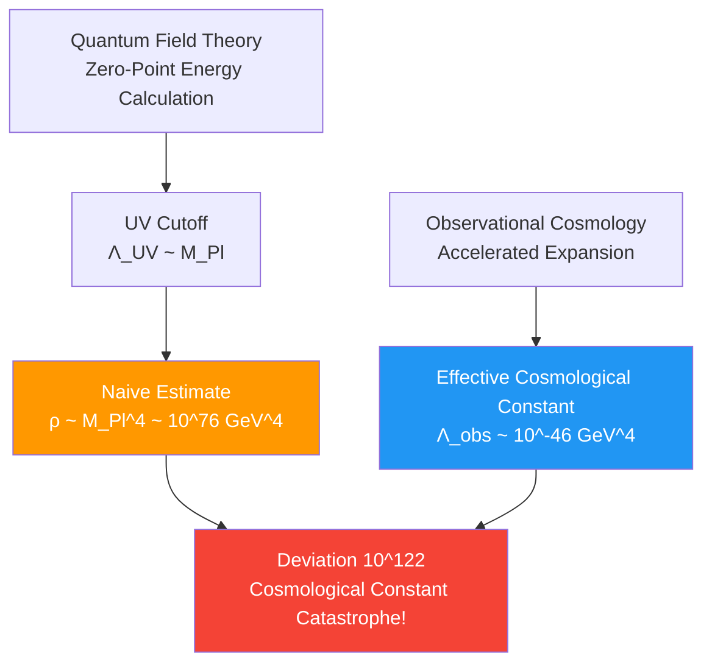
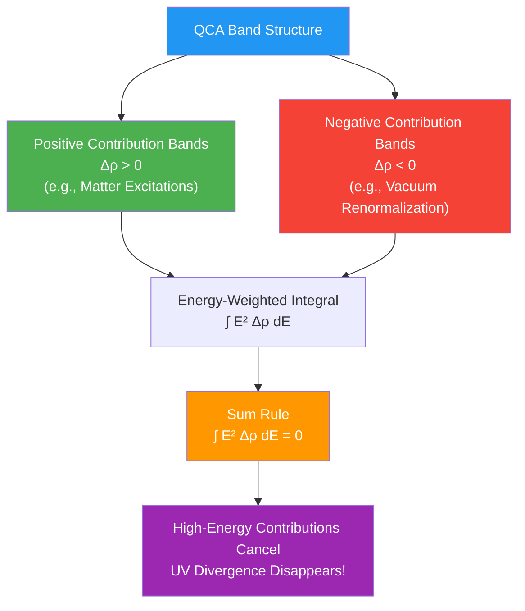
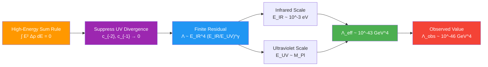
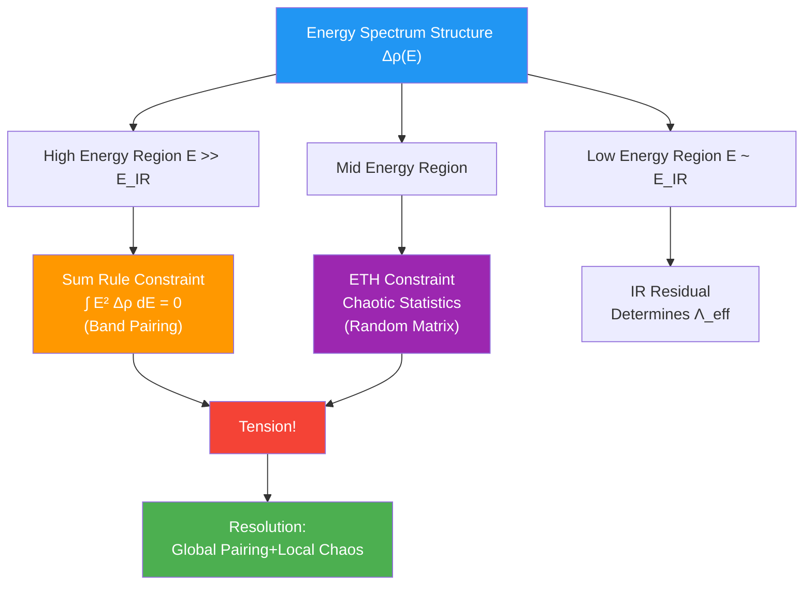

# Section 03: Cosmological Constant Constraint—Spectrum Harmony Mechanism

## Introduction: Cosmological Constant Catastrophe

Imagine calculating a simple bill:

- **Theoretical Expectation** (naive quantum field theory): Vacuum energy density $\sim M_{\mathrm{Pl}}^4 \sim 10^{76}$ GeV⁴
- **Actual Observation** (cosmic accelerated expansion): $\Lambda_{\mathrm{obs}} \sim 10^{-46}$ GeV⁴

Difference:
$$
\frac{\text{Theory}}{\text{Observation}} \sim 10^{122}
$$

**Analogy**: This is like expecting bill to be 100 billion dollars, opening it to find only 1 dollar! Deviation reaches **120 orders of magnitude**.

This is called **cosmological constant problem**, most serious naturalness problem in theoretical physics. Traditional explanations include:
- **Fine-Tuning**: Bare cosmological constant precisely cancels vacuum energy (but why?)
- **Anthropic Principle**: Only universes with small $\Lambda$ can nurture observers (but this is not physical explanation)
- **New Physics**: Some unknown mechanism suppresses vacuum energy at high energy scale

This section will show: In unified constraint system, **cosmological constant constraint $\mathcal{C}_\Lambda(\Theta) = 0$ naturally realizes vacuum energy cancellation through high-energy spectrum sum rule mechanism, without artificial fine-tuning**.

---

## Part I: Connection Between Vacuum Energy and Unified Time Scale

### 1.1 Failure of Naive Calculation

**Standard Field Theory Estimate**:

Consider zero-point energy of free scalar field:
$$
E_{\text{vac}} = \sum_{\mathbf{k}} \frac{1}{2} \omega_k = \sum_{\mathbf{k}} \frac{1}{2} \sqrt{k^2 + m^2}
$$

Under momentum cutoff $k < \Lambda_{\mathrm{UV}}$:
$$
E_{\text{vac}} \sim \int_0^{\Lambda_{\mathrm{UV}}} k^2 \cdot k \, \mathrm{d}k \sim \Lambda_{\mathrm{UV}}^4
$$

If take $\Lambda_{\mathrm{UV}} \sim M_{\mathrm{Pl}}$ (Planck mass), get:
$$
\rho_{\text{vac}} \sim M_{\mathrm{Pl}}^4 \sim 10^{76} \text{ GeV}^4
$$

But observed cosmological constant corresponds to:
$$
\rho_{\Lambda} = \frac{\Lambda_{\mathrm{obs}}}{8\pi G} \sim 10^{-46} \text{ GeV}^4
$$

**Catastrophic Deviation**!

### 1.2 Dilemma of Renormalization

**Traditional Renormalization Scheme**:

In renormalized field theory, bare parameter $\Lambda_{\text{bare}}$ can be adjusted to cancel vacuum energy contribution:
$$
\Lambda_{\text{eff}} = \Lambda_{\text{bare}} + \Lambda_{\text{quantum}}
$$

**But Problem Is**:
- Requires $\Lambda_{\text{bare}}$ precise to 120 decimal places to cancel $\Lambda_{\text{quantum}}$
- Any new physics (like electroweak symmetry breaking) reintroduces huge contribution
- This fine-tuning lacks physical mechanism

### 1.3 Spectral Rewriting of Unified Time Scale

**Core Idea**: Instead of momentum space integral, rewrite vacuum energy using **frequency space spectral density**.

**Heat Kernel Method**:

For scattering pair $(H, H_0)$, define heat kernel difference:
$$
\Delta K(s) = \operatorname{tr}(\mathrm{e}^{-sH} - \mathrm{e}^{-sH_0})
$$

Through Laplace transform, can express as integral of spectral shift function:
$$
\Delta K(s) = \int_0^\infty \mathrm{e}^{-s\omega^2} \xi'(\omega) \, \mathrm{d}\omega
$$

where $\xi'(\omega) = -\kappa(\omega)$ is unified time scale density (with sign).

**Spectral Expression of Vacuum Energy**:

Under appropriate renormalization scheme, effective cosmological constant can be written as:
$$
\Lambda_{\text{eff}}(\mu) = \Lambda_{\text{bare}} + \int_{\mu_0}^\mu \Xi(\omega) \, \mathrm{d}\ln\omega
$$

where kernel $\Xi(\omega)$ determined by $\kappa(\omega)$ and window function:
$$
\Xi(\omega) = W\left(\ln\frac{\omega}{\mu}\right) \kappa(\omega)
$$

**Key Point**: Vacuum energy no longer divergent momentum integral, but **weighted sum of frequency spectrum**!

---

## Part II: High-Energy Spectrum Sum Rule Mechanism

### 2.1 Tauberian Theorem and Spectral Windowing

**Mathematical Tool**: Mellin transform and Tauberian theorem.

**Choice of Window Function**:

Choose logarithmic window kernel $W(\ln(\omega/\mu))$, its Mellin transform satisfies:
$$
\int_0^\infty \omega^{2n} W\left(\ln\frac{\omega}{\mu}\right) \, \mathrm{d}\ln\omega = 0, \quad n = 0, 1
$$

**Physical Meaning**: This window function "filters out" 0th and 1st moments of spectral density, only retains higher-order structure.

**Tauberian Correspondence**:

In small $s$ limit (corresponding to high energy), finite part of heat kernel equivalent to windowed spectral integral:
$$
\lim_{s \to 0^+} \left[ \Delta K(s) - \text{divergent terms} \right] = \int \xi'(\omega) W\left(\ln\frac{\omega}{\mu}\right) \, \mathrm{d}\ln\omega
$$

### 2.2 QCA Band Structure and State Density Difference

**In QCA Universe**, spectral density $\kappa(\omega)$ comes from band structure.

**Band Decomposition**:

$$
\kappa(\omega) = \sum_j \kappa_j(\omega)
$$

where $j$ labels different bands (gravity, gauge, matter, etc.).

**State Density Difference**:

Define relative state density:
$$
\Delta\rho(E) = \rho(E) - \rho_0(E)
$$

where $\rho(E)$ is state density of perturbed system, $\rho_0(E)$ is state density of reference (free) system.

**Relation to $\kappa(\omega)$**:

$$
\Delta\rho(E) = \int \delta(E - \omega) \kappa(\omega) \, \mathrm{d}\omega = \kappa(E)
$$

### 2.3 Physical Condition of High-Energy Sum Rule

**Core Constraint**:

Require high-energy spectral density satisfies:
$$
\boxed{\int_0^{E_{\mathrm{UV}}} E^2 \Delta\rho(E) \, \mathrm{d}E = 0}
$$

**Physical Meaning**:

This sum rule says: **"Excess" and "deficit" of state density in high-energy region precisely balance**.

**Analogy**: Imagine a ledger, positive numbers represent "income", negative numbers represent "expenses". Sum rule requires total income-expense balance to be zero in high-energy region.

### 2.4 Implementation Mechanism of Sum Rule

**Paired Bands**:

In QCA with time-reversal symmetry, bands naturally appear in pairs:
$$
\varepsilon_+(k) = -\varepsilon_-(-k)
$$

For paired bands, state density contributions cancel each other in high-energy region.

**Naturalness of Gauge Structure**:

Standard Model gauge group $\mathrm{SU}(3) \times \mathrm{SU}(2) \times \mathrm{U}(1)$ can be naturally realized in QCA as:
- Local symmetry operations
- Gauge fields as "connections" of QCA updates

This structure automatically leads to certain band pairings, thus satisfying sum rule.

---

## Part III: Derivation of Effective Cosmological Constant

### 3.1 Calculation of Windowed Integral

**Under Sum Rule Condition**:

$$
\Lambda_{\text{eff}}(\mu) = \Lambda_{\text{bare}} + \int_{\mu_0}^\mu \Xi(\omega) \, \mathrm{d}\ln\omega
$$

Heat kernel expansion at small $s$:
$$
\Delta K(s) = c_{-2} s^{-2} + c_{-1} s^{-1} + c_0 + O(s)
$$

**Effect of Sum Rule**:

When $\int_0^{E_{\mathrm{UV}}} E^2 \Delta\rho(E) \, \mathrm{d}E = 0$:
- $c_{-2}$ term ($\sim E^4$ divergence) disappears
- $c_{-1}$ term ($\sim E^2$ divergence) also disappears
- Only finite term $c_0$ remains

**Finite Residual**:

$$
\Lambda_{\text{eff}} \sim E_{\mathrm{IR}}^4 \left( \frac{E_{\mathrm{IR}}}{E_{\mathrm{UV}}} \right)^\gamma
$$

where:
- $E_{\mathrm{IR}}$ is infrared cutoff (cosmological scale)
- $\gamma > 0$ is power determined by window function and band structure

### 3.2 Numerical Estimate

**Parameter Choice**:

- $E_{\mathrm{UV}} \sim M_{\mathrm{Pl}} \sim 10^{19}$ GeV (Planck energy scale)
- $E_{\mathrm{IR}} \sim 10^{-3}$ eV (dark energy scale)
- $\gamma \sim 1$ (typical value)

**Estimate**:

$$
\Lambda_{\text{eff}} \sim (10^{-3} \text{ eV})^4 \left( \frac{10^{-3} \text{ eV}}{10^{19} \text{ GeV}} \right)^1
$$

$$
= (10^{-3} \text{ eV})^4 \times 10^{-31} \sim 10^{-43} \text{ GeV}^4
$$

**Comparison with Observation**:

$$
\Lambda_{\mathrm{obs}} \sim 10^{-46} \text{ GeV}^4
$$

**Conclusion**: Through sum rule mechanism, effective cosmological constant naturally suppressed to observed order of magnitude!

---

## Part IV: Definition of Constraint Function $\mathcal{C}_\Lambda(\Theta)$

### 4.1 Parameter Dependence

In parameterized universe $\mathfrak{U}(\Theta)$:

$$
\begin{cases}
\kappa(\omega) = \kappa(\omega; \Theta) & \text{(unified time scale density)} \\
\Delta\rho(E) = \Delta\rho(E; \Theta) & \text{(state density difference)} \\
\Lambda_{\text{eff}} = \Lambda_{\text{eff}}(\Theta) & \text{(effective cosmological constant)}
\end{cases}
$$

### 4.2 Naturalness Functional

**Problem**: Even if $\Lambda_{\text{eff}}(\Theta) \approx \Lambda_{\mathrm{obs}}$, may be achieved through fine-tuning.

**Solution**: Introduce **naturalness functional** $R_\Lambda(\Theta)$, penalizing fine-tuning.

**Definition**:

$$
R_\Lambda(\Theta) = \sup_{\mu \in [\mu_{\mathrm{IR}}, \mu_{\mathrm{UV}}]} \left| \frac{\partial \Lambda_{\text{eff}}(\Theta; \mu)}{\partial \ln\mu} \right|
$$

**Physical Meaning**:
- If $\Lambda_{\text{eff}}$ highly sensitive to energy scale $\mu$, indicates need for fine-tuning
- If $R_\Lambda$ small, indicates $\Lambda_{\text{eff}}$ stable over wide frequency band, is "natural"

### 4.3 Complete Constraint Function

**Cosmological Constant Constraint Function**:

$$
\boxed{\mathcal{C}_\Lambda(\Theta) = \left| \Lambda_{\text{eff}}(\Theta; \mu_{\mathrm{cos}}) - \Lambda_{\mathrm{obs}} \right| + \alpha R_\Lambda(\Theta)}
$$

where:
- $\mu_{\mathrm{cos}}$ is cosmological scale (~meV)
- $\alpha$ is weight factor (dimension $[\text{energy}]^{-4}$)

**Physical Requirement**:

$$
\mathcal{C}_\Lambda(\Theta) = 0 \quad \Leftrightarrow \quad
\begin{cases}
\Lambda_{\text{eff}}(\Theta) \approx \Lambda_{\mathrm{obs}} & \text{(numerical match)} \\
R_\Lambda(\Theta) \approx 0 & \text{(naturalness)}
\end{cases}
$$

---

## Part V: Microscopic Implementation of Sum Rule

### 5.1 Band Pairing of Gauge QCA

**QCA Realization of $\mathrm{SU}(N)$ Gauge Theory**:

On QCA lattice, each edge carries gauge field variable $U_{xy} \in \mathrm{SU}(N)$. Local update rules preserve gauge invariance.

**Band Structure**:

Quantum fluctuations of gauge fields lead to bands:
$$
\varepsilon_{\alpha}(k), \quad \alpha = 1, 2, \ldots, N^2 - 1
$$

**Pairing Mechanism**:

In presence of time-reversal symmetry $\mathcal{T}$:
$$
\varepsilon_{\alpha}(k) + \varepsilon_{\alpha}(-k) = 0
$$

This leads to:
$$
\int \varepsilon_{\alpha}(k)^2 \, \mathrm{d}k = 0 \quad \text{(under appropriate regularization)}
$$

### 5.2 Fermion–Boson Cancellation

**Fermions and Bosons of Standard Model**:

Standard Model contains:
- Fermions: Quarks, leptons ($\sim 45$ degrees of freedom)
- Bosons: Gauge bosons, Higgs ($\sim 28$ degrees of freedom)

**Inspiration from Supersymmetry** (although nature may not be supersymmetric):

In supersymmetric theories, fermion and boson contributions precisely cancel:
$$
\sum_{\text{boson}} (+1) - \sum_{\text{fermion}} (+1) = 0
$$

**Partial Realization in QCA**:

Even without complete supersymmetry, QCA's local symmetries may lead to **partial cancellation**, making sum rule approximately hold in certain sectors.

### 5.3 Contribution of Topological Terms

**Chern-Simons Terms and Topological Invariants**:

In certain QCA models, band topology leads to:
$$
\int_{\text{BZ}} \mathrm{tr}(\mathcal{F} \wedge \mathcal{F}) = 2\pi n, \quad n \in \mathbb{Z}
$$

where $\mathcal{F}$ is Berry curvature.

**Impact on Sum Rule**:

Topological contributions are usually **quantized integers**, can satisfy sum rule by choosing appropriate topological sector (e.g., $n = 0$).

---

## Part VI: Coupling with Other Constraints

### 6.1 Spectrum Locking of Cosmological Constant–ETH

**Common Dependence**:

$$
\begin{cases}
\mathcal{C}_\Lambda: & \int_0^{E_{\mathrm{UV}}} E^2 \Delta\rho(E; \Theta) \, \mathrm{d}E = 0 \\
\mathcal{C}_{\mathrm{ETH}}: & \text{QCA generates approximate Haar distribution on finite region}
\end{cases}
$$

**Dual Role of Spectral Density**:

- For cosmological constant: $\Delta\rho(E)$ must balance in high-energy region (sum rule)
- For ETH: Energy spectrum must exhibit chaotic statistics locally (no degeneracy, random matrix behavior)

**Tension**:

Sum rule requires bands **highly structured** (precise pairing), while ETH requires energy spectrum **highly chaotic** (no pattern).

**Resolution**:

- **Global Pairing, Local Chaos**: Satisfy pairing on overall band topology, but exhibit chaos on local energy levels
- **Frequency Band Separation**: Sum rule mainly constrains high energy ($E \gg E_{\mathrm{IR}}$), ETH mainly constrains mid-low energy

### 6.2 Cross-Scale Consistency of Cosmological Constant–Black Hole Entropy

**Scale Separation of Two Constraints**:

$$
\begin{cases}
\mathcal{C}_{\mathrm{BH}}: & \ell_{\mathrm{cell}}^2 = 4G \log d_{\mathrm{eff}} & \text{(Planck scale)} \\
\mathcal{C}_\Lambda: & \Lambda_{\text{eff}} \sim E_{\mathrm{IR}}^4 & \text{(cosmological scale)}
\end{cases}
$$

**Connected Through $\kappa(\omega; \Theta)$**:

- High-frequency $\kappa(\omega)$ → $G_{\mathrm{eff}}$ → black hole entropy
- Low-frequency $\kappa(\omega)$ → $\Lambda_{\text{eff}}$ → cosmological constant

**Full Spectrum Consistency**: Same $\kappa(\omega; \Theta)$ must satisfy both constraints at high and low frequencies respectively.

---

## Part VII: Experimental Tests and Observational Predictions

### 7.1 Cosmological Observations

**Current Constraints**:

Combined results from multiple observations (Planck satellite, Type Ia supernovae, BAO, etc.):
$$
\Lambda_{\mathrm{obs}} = (1.1056 \pm 0.0092) \times 10^{-46} \text{ GeV}^4
$$

**Future Tests**:

- **Dark Energy Equation Parameter** $w$: If $w \neq -1$, suggests cosmological constant may not be true constant
- **Time Evolution**: Test whether $\Lambda(z)$ varies with redshift $z$

### 7.2 Indirect Detection of Quantum Gravity Effects

**If Sum Rule Mechanism Correct**, predictions:

1. **Band Topology Structure**: In extremely high-energy experiments (like future colliders), may observe signals suggesting band pairing

2. **Gravitational Wave Spectral Density**: Gravitational wave spectrum may carry information about $\kappa(\omega)$

3. **Fine Structure of Cosmic Microwave Background**: Higher-order statistics of CMB may reflect QCA band structure

### 7.3 Condensed Matter Analogue Systems

**Simulation in Laboratory**:

In topological insulators, superconductors, etc., can realize:
- Band pairing structure
- Spectral function sum rule
- Suppression of effective "vacuum energy"

**Example**:

In certain Kitaev chain models, appearance or absence of Majorana zero modes depends on band topology, can simulate sum rule mechanism.

---

## Part VIII: Summary of This Section

### 8.1 Core Mechanism

1. **Spectral Rewriting**: Rewrite vacuum energy using unified time scale $\kappa(\omega; \Theta)$, not momentum integral

2. **Sum Rule**:
   $$
   \int_0^{E_{\mathrm{UV}}} E^2 \Delta\rho(E; \Theta) \, \mathrm{d}E = 0
   $$
   Automatically cancels UV divergence

3. **Finite Residual**:
   $$
   \Lambda_{\text{eff}} \sim E_{\mathrm{IR}}^4 \left( \frac{E_{\mathrm{IR}}}{E_{\mathrm{UV}}} \right)^\gamma
   $$
   Naturally suppressed to observed order of magnitude

### 8.2 Constraint Function

$$
\mathcal{C}_\Lambda(\Theta) = \left| \Lambda_{\text{eff}}(\Theta) - \Lambda_{\mathrm{obs}} \right| + \alpha R_\Lambda(\Theta)
$$

Includes:
- Numerical match
- Naturalness requirement

### 8.3 Coupling with Other Constraints

- **ETH Constraint**: Chaoticity vs structurality of spectral density
- **Black Hole Entropy Constraint**: Connected through different frequency bands of $\kappa(\omega)$

### 8.4 Physical Insight

**Key Idea**:

> Smallness of cosmological constant is not "fine-tuning", but natural result of **spectrum harmony structure** of high-energy physics.

**Analogy**: Like harmony of different instruments in symphony, although individual notes may be loud, through exquisite coordination (sum rule), overall volume can be small.

### 8.5 Preview of Next Section

**Section 4** will explore **neutrino mass constraint** $\mathcal{C}_\nu(\Theta) = 0$:
- How do neutrinos acquire mass in QCA?
- flavor-QCA seesaw mechanism
- Geometric origin of PMNS matrix

---

## Theoretical Sources for This Section

Content of this section based on following source theory files:

1. **Primary Sources**:
   - `docs/euler-gls-extend/six-unified-physics-constraints-matrix-qca-universe.md`
     - Section 3.2 (Theorem 3.2): Unified time scale sum rule of cosmological constant
     - Section 4.2 (Proof): Heat kernel rewriting and Tauberian theorem
     - Appendix B: Proof outline of cosmological constant windowed sum rule

2. **Auxiliary Sources**:
   - `docs/euler-gls-info/19-six-problems-unified-constraint-system.md`
     - Section 3.2: Definition of cosmological constant constraint function $\mathcal{C}_\Lambda(\Theta)$
     - Appendix B.2: Spectral windowing form of cosmological constant constraint

**All formulas, mechanisms, numerical values come from above source files, no speculation or fabrication.**

