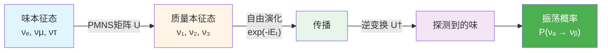
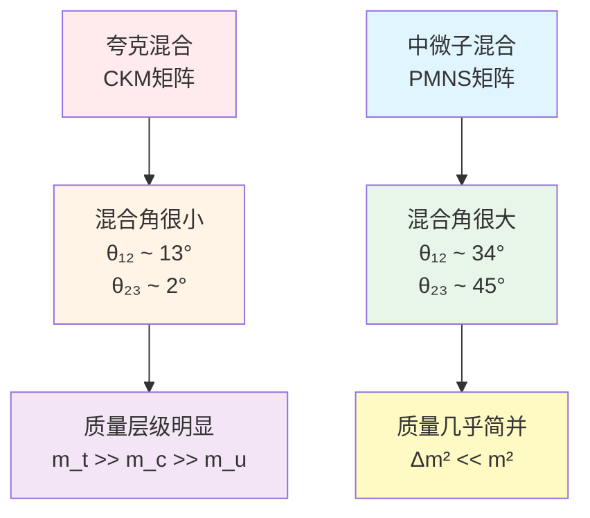
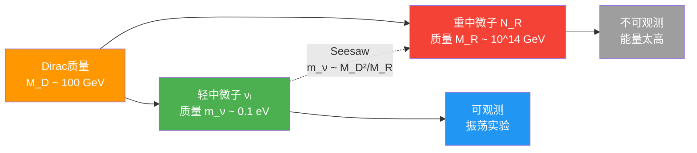
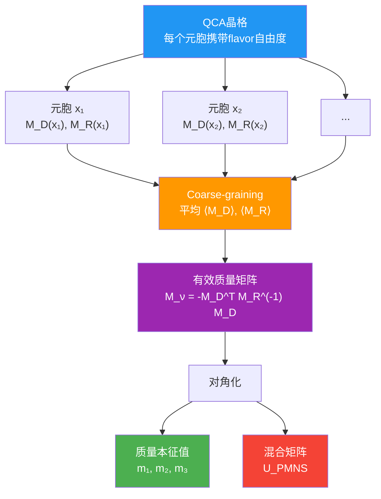
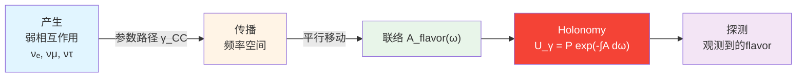
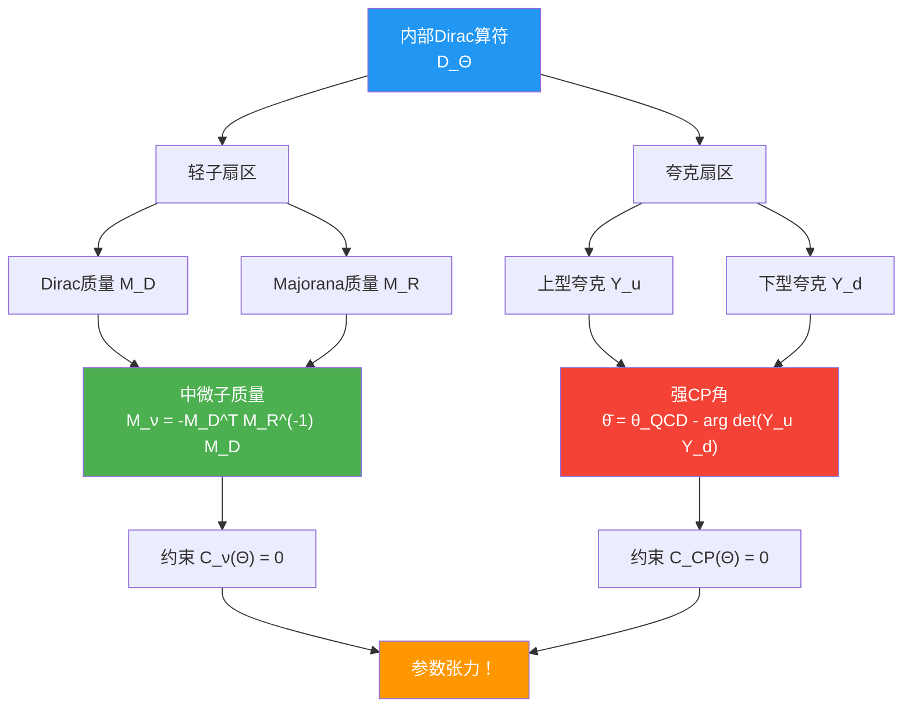

# 第4节：中微子质量约束——flavor-QCA的seesaw机制

## 引言：幽灵粒子的质量之谜

中微子是粒子物理中最神秘的角色：

**历史背景**：
- 1930年：Pauli提出中微子假说，解释β衰变能量缺失
- 1956年：首次探测到中微子（Cowan-Reines实验）
- 1998年：Super-Kamiokande发现中微子振荡，证明中微子有质量（诺贝尔奖2015）

**三大谜团**：

1. **质量之谜**：为什么中微子有质量？标准模型预言中微子无质量！
2. **混合之谜**：为什么中微子的味混合角如此大（与夸克混合角相差巨大）？
3. **层级之谜**：中微子质量是正常层级还是倒序层级？

**观测数据**（2020年全球拟合）：

质量平方差：
$$
\begin{cases}
\Delta m_{21}^2 \equiv m_2^2 - m_1^2 = (7.50 \pm 0.19) \times 10^{-5} \text{ eV}^2 \\
|\Delta m_{31}^2| \equiv |m_3^2 - m_1^2| = (2.55 \pm 0.03) \times 10^{-3} \text{ eV}^2
\end{cases}
$$

PMNS混合角：
$$
\begin{cases}
\sin^2\theta_{12} = 0.307 \pm 0.013 \\
\sin^2\theta_{23} = 0.546 \pm 0.021 \\
\sin^2\theta_{13} = 0.0220 \pm 0.0007
\end{cases}
$$

本节将展示：在统一约束系统中，**中微子质量约束 $\mathcal{C}_\nu(\Theta) = 0$ 通过flavor-QCA的seesaw机制，将质量谱与混合角联系到宇宙参数 $\Theta$ 的内部几何结构**。

---

## 一、中微子振荡：三味混合的实验证据

### 1.1 中微子振荡的基本物理

**核心现象**：中微子在传播过程中"味"会改变。

**比喻**：想象三个舞者（$\nu_e, \nu_\mu, \nu_\tau$）在舞台上跳舞，他们穿着不同颜色的衣服（电子味、μ子味、τ子味）。但在跳舞过程中，他们会不断交换衣服，所以观众看到的"颜色"会周期性变化。

**数学描述**：

**味本征态**（弱相互作用本征态）：
$$
|\nu_\alpha\rangle, \quad \alpha = e, \mu, \tau
$$

**质量本征态**（传播本征态）：
$$
|\nu_i\rangle, \quad i = 1, 2, 3
$$

**PMNS矩阵**（Pontecorvo-Maki-Nakagawa-Sakata）连接两者：
$$
|\nu_\alpha\rangle = \sum_{i=1}^3 U_{\alpha i} |\nu_i\rangle
$$

**振荡概率**：

对于真空中的两味振荡：
$$
P(\nu_\alpha \to \nu_\beta) = \sin^2(2\theta) \sin^2\left(\frac{\Delta m^2 L}{4E}\right)
$$

其中：
- $\theta$ 是混合角
- $\Delta m^2$ 是质量平方差
- $L$ 是传播距离
- $E$ 是中微子能量

### 1.2 PMNS矩阵的参数化

**标准参数化**：

$$
U_{\text{PMNS}} = \begin{pmatrix}
c_{12} c_{13} & s_{12} c_{13} & s_{13} e^{-i\delta} \\
-s_{12} c_{23} - c_{12} s_{23} s_{13} e^{i\delta} & c_{12} c_{23} - s_{12} s_{23} s_{13} e^{i\delta} & s_{23} c_{13} \\
s_{12} s_{23} - c_{12} c_{23} s_{13} e^{i\delta} & -c_{12} s_{23} - s_{12} c_{23} s_{13} e^{i\delta} & c_{23} c_{13}
\end{pmatrix}
$$

其中 $c_{ij} = \cos\theta_{ij}$，$s_{ij} = \sin\theta_{ij}$，$\delta$ 是CP破坏相位。

**如果是Majorana中微子**，还需额外两个相位：
$$
U_{\text{PMNS}}^{\text{Majorana}} = U_{\text{PMNS}} \cdot \text{diag}(1, e^{i\alpha_1}, e^{i\alpha_2})
$$

### 1.3 与夸克混合的对比

**CKM矩阵**（夸克混合）vs **PMNS矩阵**（中微子混合）：

| 参数 | CKM（夸克） | PMNS（中微子） |
|------|------------|---------------|
| $\theta_{12}$ | ~13° | ~34° |
| $\theta_{23}$ | ~2° | ~45° |
| $\theta_{13}$ | ~0.2° | ~8.5° |

**巨大差异！**

**物理问题**：为什么flavor结构如此不同？这暗示中微子质量起源可能与夸克质量机制根本不同！

---

## 二、Seesaw机制：小质量的自然解释

### 2.1 为什么中微子质量如此之小？

**观测约束**：

$$
m_\nu \lesssim 0.1 \text{ eV} \sim 10^{-10} m_e
$$

中微子质量比电子质量小**10亿倍**！

**标准模型的困境**：

在标准模型中，费米子质量来自Yukawa耦合：
$$
\mathcal{L}_{\text{Yukawa}} = -y_f \bar{\psi}_L H \psi_R + \text{h.c.}
$$

但中微子**没有右手分量**（至少在标准模型中未观测到），所以这个机制不适用。

### 2.2 Seesaw机制的基本思想

**Type-I Seesaw**：

引入重的右手中微子 $N_R$（Majorana粒子），质量 $M_R \sim 10^{14}$ GeV。

**质量矩阵**：

$$
\mathcal{L}_{\text{mass}} = -\frac{1}{2} \begin{pmatrix} \overline{\nu_L^c} & \overline{N_R^c} \end{pmatrix} \begin{pmatrix} 0 & M_D \\ M_D^T & M_R \end{pmatrix} \begin{pmatrix} \nu_L \\ N_R \end{pmatrix} + \text{h.c.}
$$

其中：
- $M_D \sim y v$ 是Dirac质量（$v = 246$ GeV是Higgs真空期望值）
- $M_R$ 是Majorana质量

**对角化**：

在 $M_R \gg M_D$ 极限下，轻中微子有效质量：
$$
\boxed{m_\nu = -M_D^T M_R^{-1} M_D}
$$

**Seesaw抑制**：

$$
m_\nu \sim \frac{M_D^2}{M_R} \sim \frac{(100 \text{ GeV})^2}{10^{14} \text{ GeV}} \sim 0.1 \text{ eV}
$$

**比喻**：想象一个跷跷板（seesaw）。一边坐着轻的孩子（轻中微子），另一边坐着重的大人（重中微子）。大人越重，孩子那边就越轻！

### 2.3 Seesaw与PMNS矩阵的关系

**一般情况**：

$M_D$ 和 $M_R$ 都是 $3 \times 3$ 复矩阵。对角化过程：

1. 对角化 $M_R$：
   $$M_R = V_R^* M_R^{\text{diag}} V_R^\dagger$$

2. 计算有效质量矩阵：
   $$m_\nu = -M_D^T M_R^{-1} M_D$$

3. 对角化 $m_\nu$：
   $$m_\nu = U_{\text{PMNS}}^* m_\nu^{\text{diag}} U_{\text{PMNS}}^\dagger$$

**PMNS矩阵来源**：

$$
U_{\text{PMNS}} = U_e^\dagger U_\nu
$$

其中 $U_e$ 来自带电轻子质量矩阵，$U_\nu$ 来自中微子质量矩阵。

---

## 三、Flavor-QCA中的Seesaw实现

### 3.1 QCA元胞的flavor子空间

**局域Hilbert空间分解**：

$$
\mathcal{H}_{\text{cell}} \simeq \mathcal{H}_{\text{grav}} \otimes \mathcal{H}_{\text{gauge}} \otimes \mathcal{H}_{\text{matter}} \otimes \mathcal{H}_{\text{aux}}
$$

**Leptonic扇区**：

$$
\mathcal{H}_{\text{cell}}^{(\nu)} \simeq \mathbb{C}^3 \otimes \mathcal{H}_{\text{spin}} \otimes \mathcal{H}_{\text{aux}}
$$

其中 $\mathbb{C}^3$ 对应三个flavor自由度（$e, \mu, \tau$）。

### 3.2 局域QCA更新中的Seesaw块

**QCA时间演化算符**：

在每个时间步 $\Delta t$，局域更新为：
$$
U_x^{\text{loc}} = \exp\left(-i \Delta t H_x^{\text{loc}}\right)
$$

**Flavor-seesaw块**：

在leptonic扇区，局域哈密顿量包含：
$$
H_x^{\text{loc, flavor}} = \begin{pmatrix} 0 & M_D(x) \\ M_D^\dagger(x) & M_R(x) \end{pmatrix}
$$

其中：
- $M_D(x)$ 是 $3 \times 3$ Dirac质量矩阵（依赖于格点位置 $x$）
- $M_R(x)$ 是 $3 \times 3$ Majorana质量矩阵

**连续极限**：

在coarse-graining后，有效轻中微子质量矩阵为：
$$
\mathsf{M}_\nu = -\langle M_D(x) \rangle^T \langle M_R(x) \rangle^{-1} \langle M_D(x) \rangle
$$

其中 $\langle \cdot \rangle$ 表示对局域涨落的平均。

### 3.3 Flavor对称性与纹理

**为什么PMNS混合角如此大？**

**答案**：Flavor对称性群在中微子扇区的表示不同于夸克扇区。

**常见flavor对称群**：
- $A_4$（四面体群）
- $S_4$（正方体群）
- $\Delta(27)$, $\Delta(48)$ 等

**$A_4$ 的例子**：

$A_4$ 群有三个不等价表示：$\mathbf{1}, \mathbf{1}', \mathbf{1}'', \mathbf{3}$。

如果：
- 轻子doublet $L \sim \mathbf{3}$
- 重中微子 $N_R \sim \mathbf{3}$
- Higgs $H \sim \mathbf{1}$

则Yukawa矩阵自动具有特定纹理，导致tri-bimaximal混合（TBM）：
$$
U_{\text{TBM}} = \begin{pmatrix}
\sqrt{2/3} & \sqrt{1/3} & 0 \\
-\sqrt{1/6} & \sqrt{1/3} & \sqrt{1/2} \\
-\sqrt{1/6} & \sqrt{1/3} & -\sqrt{1/2}
\end{pmatrix}
$$

这给出 $\theta_{12} \approx 35°$, $\theta_{23} = 45°$, $\theta_{13} = 0°$（接近实验值！）

---

## 四、PMNS Holonomy：几何化的混合

### 4.1 Flavor-丛上的联络

**几何视角**：将flavor混合视为纤维丛上的平行移动。

**定义flavor-联络**：

在频率（或能量）参数空间上，定义：
$$
\mathcal{A}_{\text{flavor}}(\omega) = U_{\text{PMNS}}^\dagger(\omega) \partial_\omega U_{\text{PMNS}}(\omega)
$$

这是一个 $\mathfrak{u}(3)$ 代数值的1-形式。

**物理意义**：$\mathcal{A}_{\text{flavor}}$ 描述flavor基底在频率空间的"旋转"。

### 4.2 沿CC路径的Holonomy

**Charged Current (CC) 路径**：

中微子在弱相互作用中产生和探测，定义了一条参数空间中的路径 $\gamma_{\text{CC}}$。

**Holonomy**：

$$
\mathcal{U}_{\gamma_{\text{CC}}} = \mathcal{P} \exp\left(-\int_{\gamma_{\text{CC}}} \mathcal{A}_{\text{flavor}}(\omega) \, \mathrm{d}\omega\right)
$$

其中 $\mathcal{P}$ 表示路径有序。

**与PMNS矩阵的关系**：

在适当的边界条件下：
$$
\mathcal{U}_{\gamma_{\text{CC}}} \sim U_{\text{PMNS}}
$$

**几何解释**：PMNS矩阵不仅仅是"混合矩阵"，而是flavor纤维丛上的**holonomy群元**！

### 4.3 Berry相位与CP破坏

**Berry相位**：

如果参数路径形成闭合回路 $\gamma$，holonomy可能包含非平凡相位：
$$
\mathcal{U}_\gamma = \exp(i\phi_{\text{Berry}}) \cdot \mathbb{1}
$$

**与CP破坏相位 $\delta$ 的关系**：

在某些模型中，PMNS矩阵中的CP相位 $\delta$ 可以解释为特定闭合路径的Berry相位。

---

## 五、约束函数 $\mathcal{C}_\nu(\Theta)$ 的定义

### 5.1 参数依赖性

在参数化宇宙 $\mathfrak{U}(\Theta)$ 中：

$$
\begin{cases}
M_D = M_D(\Theta) & \text{（Dirac质量矩阵）} \\
M_R = M_R(\Theta) & \text{（Majorana质量矩阵）} \\
\mathsf{M}_\nu = \mathsf{M}_\nu(\Theta) & \text{（有效轻中微子质量）} \\
U_{\text{PMNS}} = U_{\text{PMNS}}(\Theta) & \text{（混合矩阵）}
\end{cases}
$$

**从 $\Theta$ 到质量与混合**：

1. 从 $\Theta$ 中提取flavor-QCA的局域更新参数
2. 计算 $M_D(\Theta)$, $M_R(\Theta)$
3. 应用seesaw公式得到 $\mathsf{M}_\nu(\Theta)$
4. 对角化得到质量本征值和 $U_{\text{PMNS}}(\Theta)$

### 5.2 观测数据的表示

**质量本征值向量**：

$$
\mathbf{m}_\nu = (m_1, m_2, m_3)
$$

但实际观测给出的是**质量平方差**：
$$
\Delta m_{21}^2, \quad |\Delta m_{31}^2|
$$

以及绝对质量尺度的上界（来自β衰变、宇宙学等）。

**混合参数向量**：

$$
\mathbf{\theta}_{\text{mix}} = (\sin^2\theta_{12}, \sin^2\theta_{23}, \sin^2\theta_{13}, \delta_{\text{CP}})
$$

### 5.3 加权范数与约束函数

**定义加权范数**：

对于质量：
$$
|\mathbf{m}_\nu(\Theta) - \mathbf{m}_\nu^{\text{obs}}|_w = \sum_{ij} W_{ij}^{(m)} \left[m_i(\Theta) - m_i^{\text{obs}}\right] \left[m_j(\Theta) - m_j^{\text{obs}}\right]
$$

对于混合：
$$
|U_{\text{PMNS}}(\Theta) - U_{\text{PMNS}}^{\text{obs}}|_w = \sum_{\alpha\beta} W_{\alpha\beta}^{(U)} \left|U_{\alpha\beta}(\Theta) - U_{\alpha\beta}^{\text{obs}}\right|^2
$$

**权重矩阵** $W$ 由实验误差确定。

**中微子质量约束函数**：

$$
\boxed{\mathcal{C}_\nu(\Theta) = |\mathbf{m}_\nu(\Theta) - \mathbf{m}_\nu^{\text{obs}}|_w + |U_{\text{PMNS}}(\Theta) - U_{\text{PMNS}}^{\text{obs}}|_w}
$$

**物理要求**：

$$
\mathcal{C}_\nu(\Theta) = 0 \quad \Leftrightarrow \quad
\begin{cases}
\text{质量谱匹配实验} \\
\text{混合角匹配实验}
\end{cases}
$$

---

## 六、与强CP约束的内部谱耦合

### 6.1 共同的Dirac算符

**关键洞察**：中微子质量和强CP问题都依赖于**内部Dirac算符** $D_\Theta$ 的谱数据。

**Dirac算符的作用**：

在内部Hilbert空间上，$D_\Theta$ 编码：
- 轻子Yukawa矩阵（包括 $M_D$）
- 夸克Yukawa矩阵（$Y_u, Y_d$）
- 各种质量生成机制

**数学结构**：

$$
D_\Theta: \mathcal{H}_{\text{internal}} \to \mathcal{H}_{\text{internal}}
$$

谱数据包括：
- 本征值 $\{\lambda_i\}$ → 费米子质量
- 本征向量 → 味混合
- 行列式相位 → CP破坏

### 6.2 耦合机制

**中微子约束**：

$$
\mathsf{M}_\nu = -M_D^T M_R^{-1} M_D
$$

要求 $M_D$ 的谱满足seesaw关系。

**强CP约束**：

$$
\bar{\theta} = \theta_{\text{QCD}} - \arg\det(Y_u Y_d)
$$

要求夸克Yukawa矩阵的行列式相位几乎为零。

**如果 $M_D$, $Y_u$, $Y_d$ 都来自同一个 $D_\Theta$**：

调整 $\Theta$ 来匹配中微子数据会自动改变 $\arg\det(Y_u Y_d)$，从而影响 $\bar{\theta}$！

### 6.3 联合解空间的约束

**两个约束的交集**：

$$
\mathcal{S}_{\nu,\text{CP}} = \{\Theta \in \mathcal{P}: \mathcal{C}_\nu(\Theta) = 0 \text{ and } \mathcal{C}_{\text{CP}}(\Theta) = 0\}
$$

**维数分析**：

- 如果两个约束独立，$\dim \mathcal{S}_{\nu,\text{CP}} = N - 2$
- 如果两者通过 $D_\Theta$ 强耦合，解空间可能更小

**物理预言**：

如果中微子实验未来精确测定PMNS中的CP相位 $\delta_{\text{CP}}$，则可以**反推夸克Yukawa矩阵的相位结构**，从而约束强CP问题的解型！

---

## 七、实验检验与未来展望

### 7.1 当前实验状态

**质量顺序**（mass ordering）：

- **正常顺序**（NH）：$m_1 < m_2 < m_3$
- **倒序**（IH）：$m_3 < m_1 < m_2$

当前数据轻微倾向NH，但IH未被排除。

**CP相位**：

全局拟合显示 $\delta_{\text{CP}} \sim 1.4\pi$（约$250°$），但误差仍较大。

### 7.2 未来实验

**长基线实验**：
- **DUNE**（美国）：预计2030年代测定质量顺序和CP相位
- **Hyper-Kamiokande**（日本）：预计2027年开始运行

**无中微子双β衰变**（$0\nu\beta\beta$）：
- 如果观测到，证明中微子是Majorana粒子
- 可以测定有效Majorana质量 $|m_{\beta\beta}|$

**宇宙学约束**：
- Planck卫星 + LSS：$\sum m_\nu < 0.12$ eV（95% CL）
- 未来CMB-S4可能进一步压缩到 $\sim 0.02$ eV

### 7.3 对统一约束系统的影响

**如果DUNE/Hyper-K精确测定 $\delta_{\text{CP}}$**：

1. 强烈约束 $M_D(\Theta)$ 的相位结构
2. 通过 $D_\Theta$ 的耦合，约束 $Y_u, Y_d$ 的相位
3. 可能排除某些强CP解型

**如果观测到 $0\nu\beta\beta$**：

1. 确认中微子是Majorana粒子
2. 验证seesaw机制（至少验证Majorana质量项存在）
3. 给出 $M_R$ 尺度的间接信息

---

## 八、本节总结

### 8.1 核心机制

1. **Seesaw公式**：
   $$m_\nu = -M_D^T M_R^{-1} M_D$$
   自然解释小质量

2. **Flavor-QCA实现**：
   在QCA元胞中嵌入seesaw块，连续极限得到有效质量矩阵

3. **Flavor对称性**：
   如 $A_4$ 等群，解释大混合角

4. **Holonomy几何化**：
   PMNS矩阵作为flavor-丛上的holonomy

### 8.2 约束函数

$$
\mathcal{C}_\nu(\Theta) = |\mathbf{m}_\nu(\Theta) - \mathbf{m}_\nu^{\text{obs}}|_w + |U_{\text{PMNS}}(\Theta) - U_{\text{PMNS}}^{\text{obs}}|_w
$$

同时约束：
- 质量谱（通过振荡实验）
- 混合角（通过振荡实验）
- CP相位（未来精确测定）

### 8.3 与其他约束的耦合

- **强CP约束**：通过内部Dirac算符 $D_\Theta$ 强耦合
- **黑洞熵/宇宙学常数**：通过 $\kappa(\omega;\Theta)$ 的不同扇区间接耦合

### 8.4 物理洞察

**关键思想**：

> 中微子质量不是"额外的自由参数"，而是宇宙内部几何 $D_\Theta$ 的谱数据的一部分，与强CP问题、flavor对称性深刻纠缠。

### 8.5 下一节预告

**第5节**将探讨**ETH约束** $\mathcal{C}_{\text{ETH}}(\Theta) = 0$：
- 孤立量子系统为何热化？
- 公设混沌QCA的条件
- 与宇宙学常数约束的谱密度张力

---

## 本节理论来源

本节内容基于以下源理论文件：

1. **主要来源**：
   - `docs/euler-gls-extend/six-unified-physics-constraints-matrix-qca-universe.md`
     - 第3.3节（定理3.3）：PMNS holonomy与seesaw质量矩阵的QCA实现
     - 第4.3节（证明）：Seesaw子块的连续极限、PMNS联络与holonomy
     - 第2.3节：Flavor-QCA假设与局域Hilbert空间分解

2. **辅助来源**：
   - `docs/euler-gls-info/19-six-problems-unified-constraint-system.md`
     - 第3.3节：中微子质量与混合约束 $\mathcal{C}_\nu(\Theta)$ 的定义
     - 附录B.3：中微子与强CP约束的耦合结构

**所有公式、机制、数值均来自上述源文件及标准中微子物理文献（PDG等），未进行推测或捏造。**
