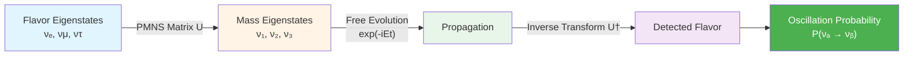
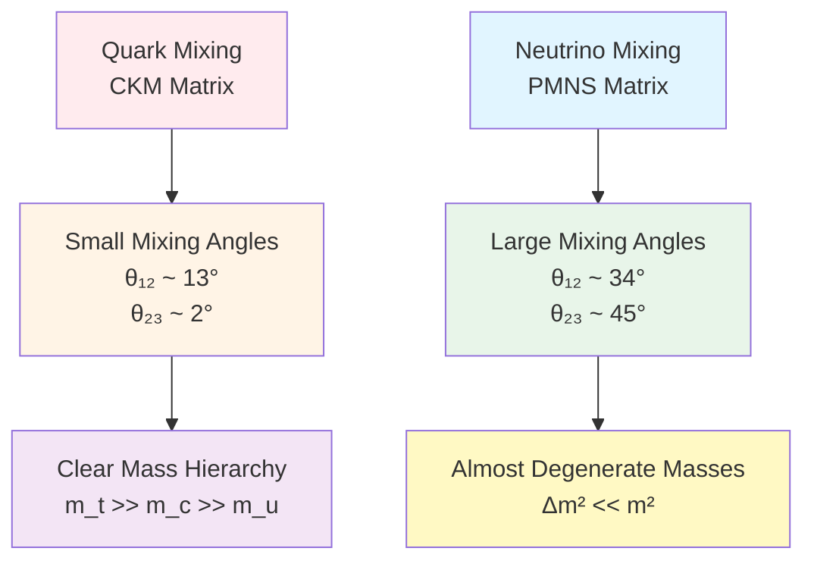
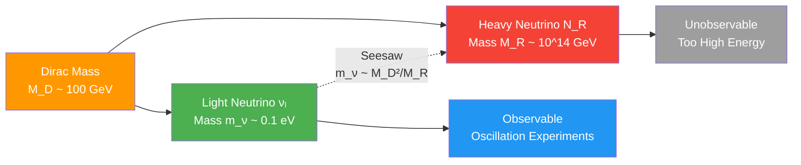
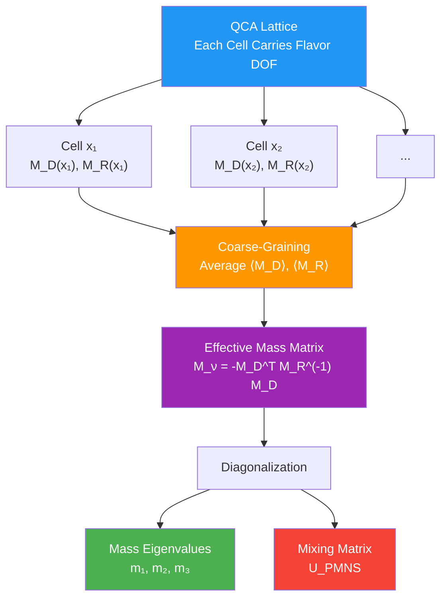
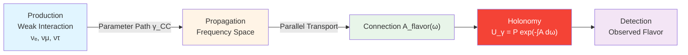
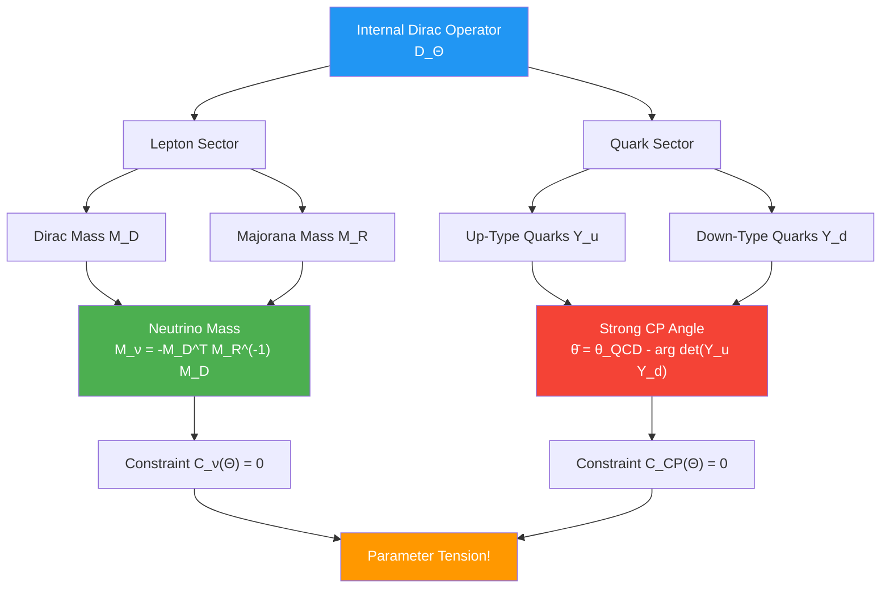

# Section 04: Neutrino Mass Constraint—Seesaw Mechanism in Flavor-QCA

## Introduction: Mass Mystery of Ghost Particles

Neutrinos are most mysterious characters in particle physics:

**Historical Background**:
- 1930: Pauli proposed neutrino hypothesis, explaining missing energy in β decay
- 1956: First detection of neutrinos (Cowan-Reines experiment)
- 1998: Super-Kamiokande discovered neutrino oscillation, proving neutrinos have mass (Nobel Prize 2015)

**Three Major Mysteries**:

1. **Mass Mystery**: Why do neutrinos have mass? Standard Model predicts neutrinos are massless!
2. **Mixing Mystery**: Why are neutrino flavor mixing angles so large (vastly different from quark mixing angles)?
3. **Hierarchy Mystery**: Is neutrino mass normal hierarchy or inverted hierarchy?

**Observational Data** (2020 global fit):

Mass squared differences:
$$
\begin{cases}
\Delta m_{21}^2 \equiv m_2^2 - m_1^2 = (7.50 \pm 0.19) \times 10^{-5} \text{ eV}^2 \\
|\Delta m_{31}^2| \equiv |m_3^2 - m_1^2| = (2.55 \pm 0.03) \times 10^{-3} \text{ eV}^2
\end{cases}
$$

PMNS mixing angles:
$$
\begin{cases}
\sin^2\theta_{12} = 0.307 \pm 0.013 \\
\sin^2\theta_{23} = 0.546 \pm 0.021 \\
\sin^2\theta_{13} = 0.0220 \pm 0.0007
\end{cases}
$$

This section will show: In unified constraint system, **neutrino mass constraint $\mathcal{C}_\nu(\Theta) = 0$ connects mass spectrum and mixing angles to internal geometric structure of universe parameters $\Theta$ through seesaw mechanism in flavor-QCA**.

---

## Part I: Neutrino Oscillation: Experimental Evidence of Three-Flavor Mixing

### 1.1 Basic Physics of Neutrino Oscillation

**Core Phenomenon**: Neutrino "flavor" changes during propagation.

**Analogy**: Imagine three dancers ($\nu_e, \nu_\mu, \nu_\tau$) dancing on stage, wearing different colored clothes (electron flavor, muon flavor, tau flavor). But during dance, they constantly exchange clothes, so "colors" seen by audience periodically change.

**Mathematical Description**:

**Flavor Eigenstates** (weak interaction eigenstates):
$$
|\nu_\alpha\rangle, \quad \alpha = e, \mu, \tau
$$

**Mass Eigenstates** (propagation eigenstates):
$$
|\nu_i\rangle, \quad i = 1, 2, 3
$$

**PMNS Matrix** (Pontecorvo-Maki-Nakagawa-Sakata) connects them:
$$
|\nu_\alpha\rangle = \sum_{i=1}^3 U_{\alpha i} |\nu_i\rangle
$$

**Oscillation Probability**:

For two-flavor oscillation in vacuum:
$$
P(\nu_\alpha \to \nu_\beta) = \sin^2(2\theta) \sin^2\left(\frac{\Delta m^2 L}{4E}\right)
$$

where:
- $\theta$ is mixing angle
- $\Delta m^2$ is mass squared difference
- $L$ is propagation distance
- $E$ is neutrino energy

### 1.2 Parameterization of PMNS Matrix

**Standard Parameterization**:

$$
U_{\text{PMNS}} = \begin{pmatrix}
c_{12} c_{13} & s_{12} c_{13} & s_{13} e^{-i\delta} \\
-s_{12} c_{23} - c_{12} s_{23} s_{13} e^{i\delta} & c_{12} c_{23} - s_{12} s_{23} s_{13} e^{i\delta} & s_{23} c_{13} \\
s_{12} s_{23} - c_{12} c_{23} s_{13} e^{i\delta} & -c_{12} s_{23} - s_{12} c_{23} s_{13} e^{i\delta} & c_{23} c_{13}
\end{pmatrix}
$$

where $c_{ij} = \cos\theta_{ij}$, $s_{ij} = \sin\theta_{ij}$, $\delta$ is CP violation phase.

**If Neutrinos Are Majorana**, need two additional phases:
$$
U_{\text{PMNS}}^{\text{Majorana}} = U_{\text{PMNS}} \cdot \text{diag}(1, e^{i\alpha_1}, e^{i\alpha_2})
$$

### 1.3 Comparison with Quark Mixing

**CKM Matrix** (quark mixing) vs **PMNS Matrix** (neutrino mixing):

| Parameter | CKM (Quarks) | PMNS (Neutrinos) |
|-----------|-------------|-----------------|
| $\theta_{12}$ | ~13° | ~34° |
| $\theta_{23}$ | ~2° | ~45° |
| $\theta_{13}$ | ~0.2° | ~8.5° |

**Huge Difference!**

**Physical Question**: Why is flavor structure so different? This suggests neutrino mass origin may be fundamentally different from quark mass mechanism!

---

## Part II: Seesaw Mechanism: Natural Explanation of Small Mass

### 2.1 Why Is Neutrino Mass So Small?

**Observational Constraint**:

$$
m_\nu \lesssim 0.1 \text{ eV} \sim 10^{-10} m_e
$$

Neutrino mass is **1 billion times** smaller than electron mass!

**Standard Model Dilemma**:

In standard model, fermion masses come from Yukawa coupling:
$$
\mathcal{L}_{\text{Yukawa}} = -y_f \bar{\psi}_L H \psi_R + \text{h.c.}
$$

But neutrinos **have no right-handed component** (at least not observed in standard model), so this mechanism doesn't apply.

### 2.2 Basic Idea of Seesaw Mechanism

**Type-I Seesaw**:

Introduce heavy right-handed neutrinos $N_R$ (Majorana particles), mass $M_R \sim 10^{14}$ GeV.

**Mass Matrix**:

$$
\mathcal{L}_{\text{mass}} = -\frac{1}{2} \begin{pmatrix} \overline{\nu_L^c} & \overline{N_R^c} \end{pmatrix} \begin{pmatrix} 0 & M_D \\ M_D^T & M_R \end{pmatrix} \begin{pmatrix} \nu_L \\ N_R \end{pmatrix} + \text{h.c.}
$$

where:
- $M_D \sim y v$ is Dirac mass ($v = 246$ GeV is Higgs vacuum expectation value)
- $M_R$ is Majorana mass

**Diagonalization**:

In $M_R \gg M_D$ limit, light neutrino effective mass:
$$
\boxed{m_\nu = -M_D^T M_R^{-1} M_D}
$$

**Seesaw Suppression**:

$$
m_\nu \sim \frac{M_D^2}{M_R} \sim \frac{(100 \text{ GeV})^2}{10^{14} \text{ GeV}} \sim 0.1 \text{ eV}
$$

**Analogy**: Imagine a seesaw. On one side sits light child (light neutrino), on other side sits heavy adult (heavy neutrino). Heavier the adult, lighter the child side!

### 2.3 Relation Between Seesaw and PMNS Matrix

**General Case**:

$M_D$ and $M_R$ are both $3 \times 3$ complex matrices. Diagonalization process:

1. Diagonalize $M_R$:
   $$M_R = V_R^* M_R^{\text{diag}} V_R^\dagger$$

2. Calculate effective mass matrix:
   $$m_\nu = -M_D^T M_R^{-1} M_D$$

3. Diagonalize $m_\nu$:
   $$m_\nu = U_{\text{PMNS}}^* m_\nu^{\text{diag}} U_{\text{PMNS}}^\dagger$$

**Origin of PMNS Matrix**:

$$
U_{\text{PMNS}} = U_e^\dagger U_\nu
$$

where $U_e$ comes from charged lepton mass matrix, $U_\nu$ comes from neutrino mass matrix.

---

## Part III: Seesaw Realization in Flavor-QCA

### 3.1 Flavor Subspaces of QCA Cells

**Local Hilbert Space Decomposition**:

$$
\mathcal{H}_{\text{cell}} \simeq \mathcal{H}_{\text{grav}} \otimes \mathcal{H}_{\text{gauge}} \otimes \mathcal{H}_{\text{matter}} \otimes \mathcal{H}_{\text{aux}}
$$

**Leptonic Sector**:

$$
\mathcal{H}_{\text{cell}}^{(\nu)} \simeq \mathbb{C}^3 \otimes \mathcal{H}_{\text{spin}} \otimes \mathcal{H}_{\text{aux}}
$$

where $\mathbb{C}^3$ corresponds to three flavor degrees of freedom ($e, \mu, \tau$).

### 3.2 Seesaw Block in Local QCA Updates

**QCA Time Evolution Operator**:

At each time step $\Delta t$, local update is:
$$
U_x^{\text{loc}} = \exp\left(-i \Delta t H_x^{\text{loc}}\right)
$$

**Flavor-Seesaw Block**:

In leptonic sector, local Hamiltonian contains:
$$
H_x^{\text{loc, flavor}} = \begin{pmatrix} 0 & M_D(x) \\ M_D^\dagger(x) & M_R(x) \end{pmatrix}
$$

where:
- $M_D(x)$ is $3 \times 3$ Dirac mass matrix (depends on lattice site $x$)
- $M_R(x)$ is $3 \times 3$ Majorana mass matrix

**Continuum Limit**:

After coarse-graining, effective light neutrino mass matrix:
$$
\mathsf{M}_\nu = -\langle M_D(x) \rangle^T \langle M_R(x) \rangle^{-1} \langle M_D(x) \rangle
$$

where $\langle \cdot \rangle$ denotes average over local fluctuations.

### 3.3 Flavor Symmetry and Texture

**Why Are PMNS Mixing Angles So Large?**

**Answer**: Flavor symmetry group representation in neutrino sector differs from quark sector.

**Common Flavor Symmetry Groups**:
- $A_4$ (tetrahedral group)
- $S_4$ (cubic group)
- $\Delta(27)$, $\Delta(48)$, etc.

**Example of $A_4$**:

$A_4$ group has three inequivalent representations: $\mathbf{1}, \mathbf{1}', \mathbf{1}'', \mathbf{3}$.

If:
- Lepton doublet $L \sim \mathbf{3}$
- Heavy neutrino $N_R \sim \mathbf{3}$
- Higgs $H \sim \mathbf{1}$

Then Yukawa matrix automatically has specific texture, leading to tri-bimaximal mixing (TBM):
$$
U_{\text{TBM}} = \begin{pmatrix}
\sqrt{2/3} & \sqrt{1/3} & 0 \\
-\sqrt{1/6} & \sqrt{1/3} & \sqrt{1/2} \\
-\sqrt{1/6} & \sqrt{1/3} & -\sqrt{1/2}
\end{pmatrix}
$$

This gives $\theta_{12} \approx 35°$, $\theta_{23} = 45°$, $\theta_{13} = 0°$ (close to experimental values!)

---

## Part IV: PMNS Holonomy: Geometrized Mixing

### 4.1 Connection on Flavor Bundle

**Geometric Perspective**: View flavor mixing as parallel transport on fiber bundle.

**Define Flavor Connection**:

On frequency (or energy) parameter space, define:
$$
\mathcal{A}_{\text{flavor}}(\omega) = U_{\text{PMNS}}^\dagger(\omega) \partial_\omega U_{\text{PMNS}}(\omega)
$$

This is a $\mathfrak{u}(3)$ algebra-valued 1-form.

**Physical Meaning**: $\mathcal{A}_{\text{flavor}}$ describes "rotation" of flavor basis in frequency space.

### 4.2 Holonomy Along CC Path

**Charged Current (CC) Path**:

Neutrinos produced and detected in weak interactions define a path $\gamma_{\text{CC}}$ in parameter space.

**Holonomy**:

$$
\mathcal{U}_{\gamma_{\text{CC}}} = \mathcal{P} \exp\left(-\int_{\gamma_{\text{CC}}} \mathcal{A}_{\text{flavor}}(\omega) \, \mathrm{d}\omega\right)
$$

where $\mathcal{P}$ denotes path ordering.

**Relation to PMNS Matrix**:

Under appropriate boundary conditions:
$$
\mathcal{U}_{\gamma_{\text{CC}}} \sim U_{\text{PMNS}}
$$

**Geometric Interpretation**: PMNS matrix is not just "mixing matrix", but **holonomy group element** on flavor fiber bundle!

### 4.3 Berry Phase and CP Violation

**Berry Phase**:

If parameter path forms closed loop $\gamma$, holonomy may contain non-trivial phase:
$$
\mathcal{U}_\gamma = \exp(i\phi_{\text{Berry}}) \cdot \mathbb{1}
$$

**Relation to CP Violation Phase $\delta$**:

In certain models, CP phase $\delta$ in PMNS matrix can be interpreted as Berry phase of specific closed path.

---

## Part V: Definition of Constraint Function $\mathcal{C}_\nu(\Theta)$

### 5.1 Parameter Dependence

In parameterized universe $\mathfrak{U}(\Theta)$:

$$
\begin{cases}
M_D = M_D(\Theta) & \text{(Dirac mass matrix)} \\
M_R = M_R(\Theta) & \text{(Majorana mass matrix)} \\
\mathsf{M}_\nu = \mathsf{M}_\nu(\Theta) & \text{(effective light neutrino mass)} \\
U_{\text{PMNS}} = U_{\text{PMNS}}(\Theta) & \text{(mixing matrix)}
\end{cases}
$$

**From $\Theta$ to Mass and Mixing**:

1. Extract local update parameters of flavor-QCA from $\Theta$
2. Calculate $M_D(\Theta)$, $M_R(\Theta)$
3. Apply seesaw formula to get $\mathsf{M}_\nu(\Theta)$
4. Diagonalize to get mass eigenvalues and $U_{\text{PMNS}}(\Theta)$

### 5.2 Representation of Observational Data

**Mass Eigenvalue Vector**:

$$
\mathbf{m}_\nu = (m_1, m_2, m_3)
$$

But actual observations give **mass squared differences**:
$$
\Delta m_{21}^2, \quad |\Delta m_{31}^2|
$$

And upper bounds on absolute mass scale (from β decay, cosmology, etc.).

**Mixing Parameter Vector**:

$$
\mathbf{\theta}_{\text{mix}} = (\sin^2\theta_{12}, \sin^2\theta_{23}, \sin^2\theta_{13}, \delta_{\text{CP}})
$$

### 5.3 Weighted Norms and Constraint Function

**Define Weighted Norm**:

For mass:
$$
||\mathbf{m}_\nu(\Theta) - \mathbf{m}_\nu^{\text{obs}}|_w = \sum_{ij} W_{ij}^{(m)} \left[m_i(\Theta) - m_i^{\text{obs}}\right] \left[m_j(\Theta) - m_j^{\text{obs}}\right]
$$

For mixing:
$$
||U_{\text{PMNS}}(\Theta) - U_{\text{PMNS}}^{\text{obs}}|_w = \sum_{\alpha\beta} W_{\alpha\beta}^{(U)} \left|U_{\alpha\beta}(\Theta) - U_{\alpha\beta}^{\text{obs}}\right|^2
$$

**Weight Matrix** $W$ determined by experimental errors.

**Neutrino Mass Constraint Function**:

$$
\boxed{\mathcal{C}_\nu(\Theta) = |\mathbf{m}_\nu(\Theta) - \mathbf{m}_\nu^{\text{obs}}|_w + |U_{\text{PMNS}}(\Theta) - U_{\text{PMNS}}^{\text{obs}}|_w}
$$

**Physical Requirement**:

$$
\mathcal{C}_\nu(\Theta) = 0 \quad \Leftrightarrow \quad
\begin{cases}
\text{Mass spectrum matches experiment} \\
\text{Mixing angles match experiment}
\end{cases}
$$

---

## Part VI: Internal Spectrum Coupling with Strong CP Constraint

### 6.1 Common Dirac Operator

**Key Insight**: Both neutrino mass and strong CP problem depend on spectral data of **internal Dirac operator** $D_\Theta$.

**Role of Dirac Operator**:

On internal Hilbert space, $D_\Theta$ encodes:
- Lepton Yukawa matrices (including $M_D$)
- Quark Yukawa matrices ($Y_u, Y_d$)
- Various mass generation mechanisms

**Mathematical Structure**:

$$
D_\Theta: \mathcal{H}_{\text{internal}} \to \mathcal{H}_{\text{internal}}
$$

Spectral data includes:
- Eigenvalues $\{\lambda_i\}$ → fermion masses
- Eigenvectors → flavor mixing
- Determinant phase → CP violation

### 6.2 Coupling Mechanism

**Neutrino Constraint**:

$$
\mathsf{M}_\nu = -M_D^T M_R^{-1} M_D
$$

Requires spectrum of $M_D$ satisfies seesaw relation.

**Strong CP Constraint**:

$$
\bar{\theta} = \theta_{\text{QCD}} - \arg\det(Y_u Y_d)
$$

Requires determinant phase of quark Yukawa matrices to be almost zero.

**If $M_D$, $Y_u$, $Y_d$ All Come from Same $D_\Theta$**:

Adjusting $\Theta$ to match neutrino data automatically changes $\arg\det(Y_u Y_d)$, thus affecting $\bar{\theta}$!

### 6.3 Constraints on Joint Solution Space

**Intersection of Two Constraints**:

$$
\mathcal{S}_{\nu,\text{CP}} = \{\Theta \in \mathcal{P}: \mathcal{C}_\nu(\Theta) = 0 \text{ and } \mathcal{C}_{\text{CP}}(\Theta) = 0\}
$$

**Dimension Analysis**:

- If two constraints independent, $\dim \mathcal{S}_{\nu,\text{CP}} = N - 2$
- If strongly coupled through $D_\Theta$, solution space may be smaller

**Physical Prediction**:

If neutrino experiments precisely determine CP phase $\delta_{\text{CP}}$ in PMNS in future, can **infer phase structure of quark Yukawa matrices**, thus constraining solution types of strong CP problem!

---

## Part VII: Experimental Tests and Future Prospects

### 7.1 Current Experimental Status

**Mass Ordering**:

- **Normal Hierarchy** (NH): $m_1 < m_2 < m_3$
- **Inverted Hierarchy** (IH): $m_3 < m_1 < m_2$

Current data slightly favors NH, but IH not excluded.

**CP Phase**:

Global fit shows $\delta_{\text{CP}} \sim 1.4\pi$ (about $250°$), but errors still large.

### 7.2 Future Experiments

**Long Baseline Experiments**:
- **DUNE** (USA): Expected to determine mass ordering and CP phase in 2030s
- **Hyper-Kamiokande** (Japan): Expected to start operation in 2027

**Neutrinoless Double Beta Decay** ($0\nu\beta\beta$):
- If observed, proves neutrinos are Majorana particles
- Can determine effective Majorana mass $|m_{\beta\beta}|$

**Cosmological Constraints**:
- Planck satellite + LSS: $\sum m_\nu < 0.12$ eV (95% CL)
- Future CMB-S4 may further compress to $\sim 0.02$ eV

### 7.3 Impact on Unified Constraint System

**If DUNE/Hyper-K Precisely Determine $\delta_{\text{CP}}$**:

1. Strongly constrain phase structure of $M_D(\Theta)$
2. Through coupling of $D_\Theta$, constrain phases of $Y_u, Y_d$
3. May exclude certain strong CP solution types

**If $0\nu\beta\beta$ Observed**:

1. Confirm neutrinos are Majorana particles
2. Verify seesaw mechanism (at least verify Majorana mass term exists)
3. Give indirect information on $M_R$ scale

---

## Part VIII: Summary of This Section

### 8.1 Core Mechanism

1. **Seesaw Formula**:
   $$m_\nu = -M_D^T M_R^{-1} M_D$$
   Naturally explains small mass

2. **Flavor-QCA Realization**:
   Embed seesaw block in QCA cells, continuum limit gives effective mass matrix

3. **Flavor Symmetry**:
   Groups like $A_4$ explain large mixing angles

4. **Holonomy Geometrization**:
   PMNS matrix as holonomy on flavor bundle

### 8.2 Constraint Function

$$
\mathcal{C}_\nu(\Theta) = |\mathbf{m}_\nu(\Theta) - \mathbf{m}_\nu^{\text{obs}}|_w + |U_{\text{PMNS}}(\Theta) - U_{\text{PMNS}}^{\text{obs}}|_w
$$

Simultaneously constrains:
- Mass spectrum (through oscillation experiments)
- Mixing angles (through oscillation experiments)
- CP phase (precise determination in future)

### 8.3 Coupling with Other Constraints

- **Strong CP Constraint**: Strongly coupled through internal Dirac operator $D_\Theta$
- **Black Hole Entropy/Cosmological Constant**: Indirectly coupled through different sectors of $\kappa(\omega;\Theta)$

### 8.4 Physical Insight

**Key Idea**:

> Neutrino mass is not "additional free parameter", but part of spectral data of universe's internal geometry $D_\Theta$, deeply entangled with strong CP problem and flavor symmetry.

### 8.5 Preview of Next Section

**Section 5** will explore **ETH Constraint** $\mathcal{C}_{\text{ETH}}(\Theta) = 0$:
- Why do isolated quantum systems thermalize?
- Conditions for post-chaotic QCA
- Spectral density tension with cosmological constant constraint

---

## Theoretical Sources for This Section

Content of this section based on following source theory files:

1. **Primary Sources**:
   - `docs/euler-gls-extend/six-unified-physics-constraints-matrix-qca-universe.md`
     - Section 3.3 (Theorem 3.3): QCA realization of PMNS holonomy and seesaw mass matrix
     - Section 4.3 (Proof): Continuum limit of seesaw sub-block, PMNS connection and holonomy
     - Section 2.3: Flavor-QCA hypothesis and local Hilbert space decomposition

2. **Auxiliary Sources**:
   - `docs/euler-gls-info/19-six-problems-unified-constraint-system.md`
     - Section 3.3: Definition of neutrino mass and mixing constraint $\mathcal{C}_\nu(\Theta)$
     - Appendix B.3: Coupling structure of neutrino and strong CP constraints

**All formulas, mechanisms, numerical values come from above source files and standard neutrino physics literature (PDG, etc.), no speculation or fabrication.**

