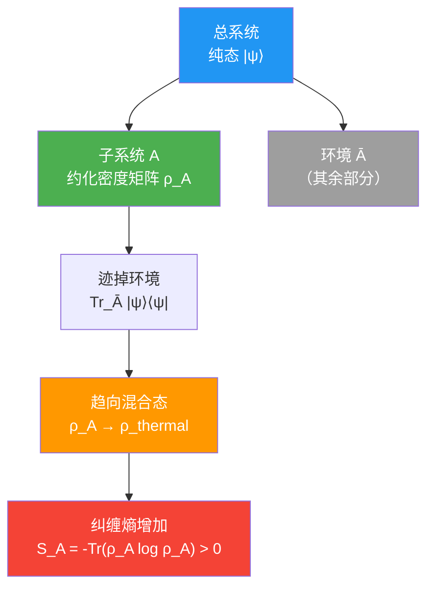
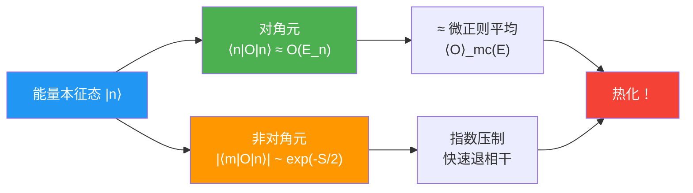
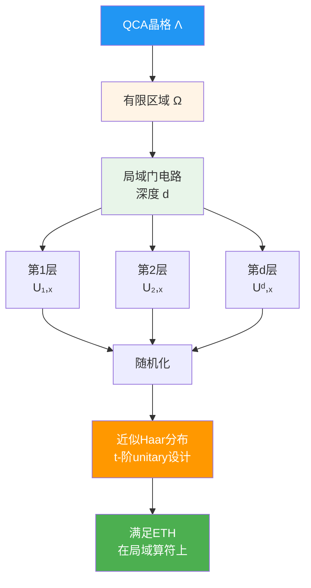
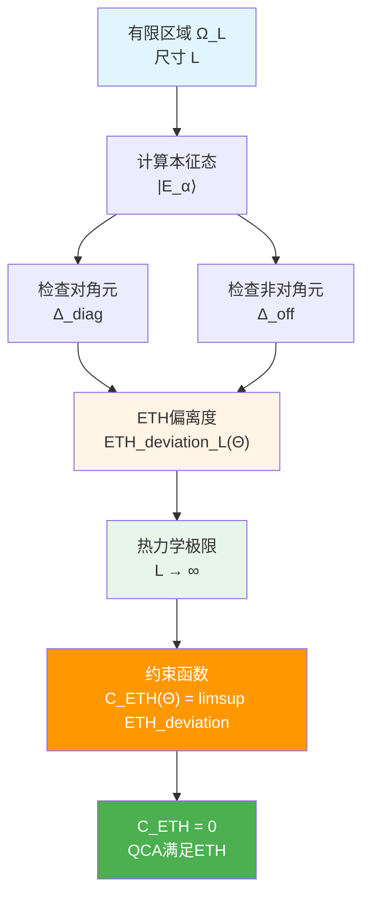
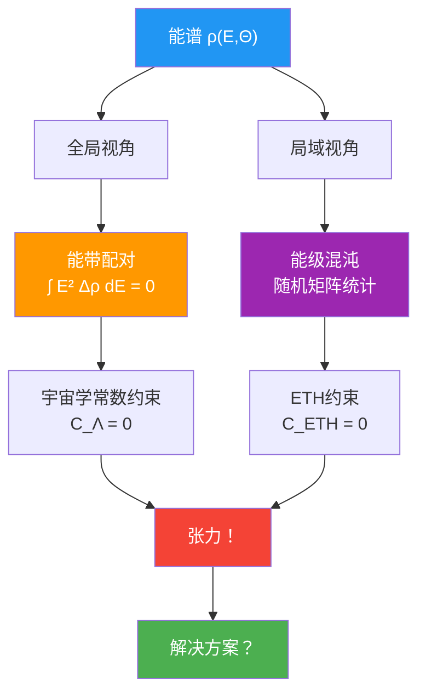
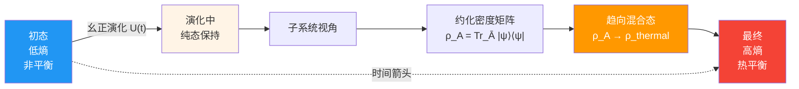
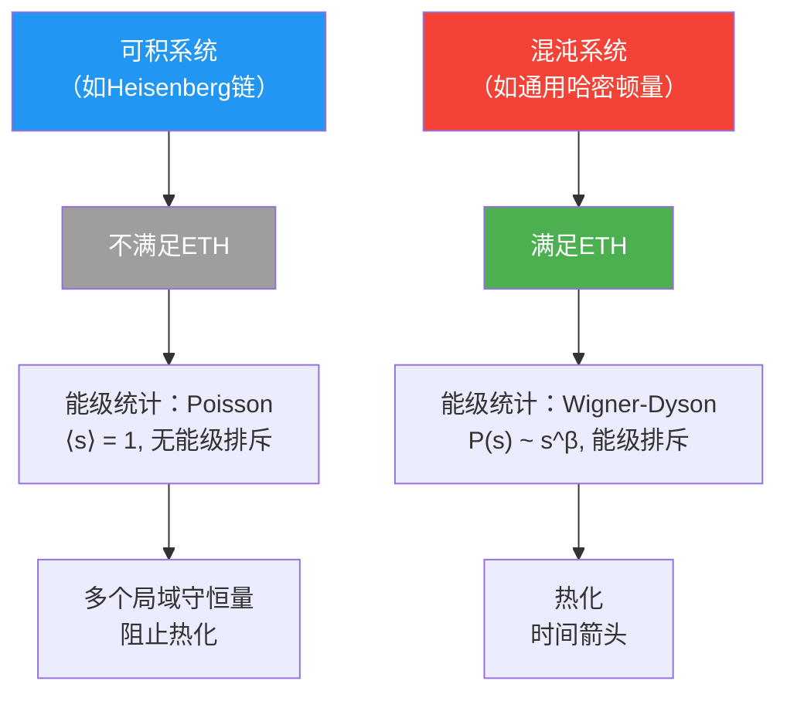

# 第5节：ETH约束——公设混沌QCA与热化之谜

## 引言：孤立系统为何会热化？

想象一个完全密封的保温瓶，里面装着冷水和热水分层的混合物。你不对它做任何事情，只是等待。几个小时后打开，你会发现：**水温均匀了**！

这似乎很自然，但从量子力学的角度看，这是一个深刻的谜团：

**问题1（可逆性悖论）**：
- 量子演化是**幺正的**（可逆的）：$|\psi(t)\rangle = U(t)|\psi(0)\rangle$
- 但热化是**不可逆的**：熵增加，无法自发回到初始态
- 这两者如何兼容？

**问题2（时间箭头）**：
- 微观物理定律（薛定谔方程）是**时间反演对称**的
- 但宏观热力学有明显的**时间箭头**（熵总是增加）
- 这个箭头从哪里来？

**问题3（典型性）**：
- 为什么"几乎所有"初始态都会热化？
- 为什么最终态看起来像"热平衡"？

**本征态热化假设（ETH）**给出了答案：

> 对于孤立量子多体系统，如果哈密顿量是"足够混沌"的，那么**几乎所有高能本征态**在局域可观测量上的期望值，都等于相应能量的热平衡值。

本节将展示：在统一约束系统中，**ETH约束 $\mathcal{C}_{\mathrm{ETH}}(\Theta) = 0$ 要求QCA宇宙在每个有限区域上表现出"公设混沌"行为，从而保证宏观热化与时间箭头的自然涌现**。

---

## 一、热化的量子力学基础

### 1.1 从纯态到混合态？

**经典热力学**：

一个孤立系统最终达到**热平衡**，可观测量 $O$ 的期望值由**微正则系综**给出：
$$
\langle O \rangle_{\text{thermal}} = \frac{1}{\Omega(E)} \sum_{n: E_n \in [E-\delta E, E+\delta E]} \langle n | O | n \rangle
$$

其中 $\Omega(E)$ 是能壳中的态数，$|n\rangle$ 是能量本征态。

**量子力学**：

如果系统初始处于纯态 $|\psi(0)\rangle$，演化后仍是纯态：
$$
|\psi(t)\rangle = e^{-iHt/\hbar} |\psi(0)\rangle = \sum_n c_n e^{-iE_n t/\hbar} |n\rangle
$$

其中 $c_n = \langle n | \psi(0) \rangle$。

**矛盾？**

- 纯态的约化密度矩阵 $\rho = |\psi\rangle\langle\psi|$ 的von Neumann熵始终为零
- 但热平衡态是混合态，熵 $\sim \ln\Omega(E) > 0$

**解决：子系统视角**

考虑系统的一个**小子系统** $A$。虽然总系统保持纯态，但子系统的约化密度矩阵：
$$
\rho_A(t) = \mathrm{Tr}_{\bar{A}} |\psi(t)\rangle\langle\psi(t)|
$$

可以趋向于混合态！

### 1.2 时间平均 vs 系综平均

**时间平均**：

对于局域可观测量 $O_A$（只作用在子系统 $A$ 上）：
$$
\overline{O_A} := \lim_{T \to \infty} \frac{1}{T} \int_0^T \langle \psi(t) | O_A | \psi(t) \rangle \, \mathrm{d}t
$$

**系综平均**：

微正则系综（固定能量 $E$）：
$$
\langle O_A \rangle_{\text{mc}}(E) = \frac{1}{\Omega(E)} \sum_{E_n \in [E-\delta E, E+\delta E]} \langle n | O_A | n \rangle
$$

**问题**：何时两者相等？

$$
\overline{O_A} \stackrel{?}{=} \langle O_A \rangle_{\text{mc}}
$$

**经典遍历性**：在经典力学中，如果系统是遍历的（ergodic），则时间平均=系综平均。

**量子版本**：ETH给出了量子系统的遍历性条件。

---

## 二、本征态热化假设（ETH）

### 2.1 ETH的数学表述

**定义**：

对于哈密顿量 $H$ 和局域算符 $O_A$，如果满足：

**（ETH-1）对角元**：

$$
\langle n | O_A | n \rangle = O_A(E_n) + \mathcal{O}(e^{-S(E_n)/2})
$$

其中 $O_A(E)$ 是能量 $E$ 的光滑函数（对应微正则平均），$S(E)$ 是热力学熵。

**（ETH-2）非对角元**：

$$
|\langle m | O_A | n \rangle| \sim e^{-S(\bar{E})/2} f_{O_A}(E_m, E_n)
$$

其中 $\bar{E} = (E_m + E_n)/2$，$f$ 是光滑函数。

**物理意义**：

- **对角元**：每个本征态 $|n\rangle$ 的期望值都接近热平衡值
- **非对角元**：不同本征态之间的矩阵元随熵指数衰减

### 2.2 ETH蕴含热化

**定理**：如果 $H$ 满足ETH，且初态 $|\psi(0)\rangle$ 在能量 $E$ 附近的能壳中有广泛分布（$|c_n|^2$ 在能壳中不集中在少数态），则：

$$
\lim_{t \to \infty} \langle \psi(t) | O_A | \psi(t) \rangle = \langle O_A \rangle_{\text{mc}}(E)
$$

**证明草图**：

1. 展开 $|\psi(t)\rangle = \sum_n c_n e^{-iE_n t} |n\rangle$

2. 计算期望值：
   $$\langle O_A \rangle(t) = \sum_n |c_n|^2 \langle n | O_A | n \rangle + \sum_{m \neq n} c_m^* c_n e^{i(E_m - E_n)t} \langle m | O_A | n \rangle$$

3. 时间平均：非对角项振荡平均为零

4. 使用ETH-1：对角项 $\approx O_A(E_n) \approx O_A(E)$（因为 $E_n$ 都在能壳附近）

5. 结论：
   $$\overline{O_A} = \sum_n |c_n|^2 O_A(E) = O_A(E) = \langle O_A \rangle_{\text{mc}}(E)$$

### 2.3 随机矩阵理论的联系

**Haar随机幺正矩阵**：

如果 $H$ 的本征态是从Haar测度中随机抽取的，则自动满足ETH。

**原因**：

对于Haar随机态 $|n\rangle$，矩阵元统计：
$$
\mathbb{E}[\langle n | O_A | n \rangle] = \frac{\mathrm{Tr} O_A}{D}
$$
$$
\mathrm{Var}[\langle n | O_A | n \rangle] = \mathcal{O}(D^{-1})
$$

其中 $D = \dim \mathcal{H}$ 是Hilbert空间维度。

**Levy浓缩不等式**：

$$
\mathbb{P}\left( \left| \langle n | O_A | n \rangle - \mathbb{E}[\langle n | O_A | n \rangle] \right| > \epsilon \right) \le C e^{-c \epsilon^2 D}
$$

因此"典型"的本征态都非常接近平均值！

---

## 三、公设混沌QCA：ETH的微观实现

### 3.1 什么是公设混沌QCA？

**定义**：

在QCA宇宙中，如果在任意有限区域 $\Omega \subset \Lambda$，时间演化算符 $U_\Omega$ 满足：

1. **局域性**：$U_\Omega$ 可以分解为有限深度的局域门电路
2. **混沌性**：局域门集在若干层后生成近似 $t$-阶unitary设计（近似Haar分布）
3. **守恒律最小化**：除了能量和少数全局量子数，没有其他局域守恒量

则称该QCA为**公设混沌QCA**。

### 3.2 局域随机电路与unitary设计

**局域门集**：

在每个时间步，作用局域幺正门 $U_{xy}$（作用在相邻格点 $x, y$ 上）：
$$
U_{\text{layer}} = \prod_{\langle x,y \rangle} U_{xy}
$$

**随机化**：

门 $U_{xy}$ 从某个分布 $\mathcal{D}$ 中随机抽取（或者在伪随机序列中选择）。

**Unitary设计**：

如果经过 $d$ 层后，$U = U_d \cdots U_2 U_1$ 在多项式函数上的平均值接近Haar积分，则称为 $t$-阶设计：
$$
\mathbb{E}_{\mathcal{D}}[f(U)] \approx \int_{\mathrm{Haar}} f(U) \, \mathrm{d}U
$$

对所有 $t$-次多项式 $f$ 成立。

**深度估计**：

对于局域系统，达到 $t$-阶设计所需深度：
$$
d \sim \mathcal{O}(L \cdot t)
$$

其中 $L$ 是系统线性尺寸。

### 3.3 从随机电路到ETH

**关键定理**（Haar随机态的ETH）：

对于Haar随机幺正算符 $U$ 的本征态 $|n\rangle$，局域算符 $O_A$ 的矩阵元满足：

$$
\langle n | O_A | n \rangle = \frac{\mathrm{Tr} O_A}{D} + \mathcal{O}\left( \frac{\|O_A\|}{\sqrt{D}} \right)
$$

$$
|\langle m | O_A | n \rangle| \sim \frac{\|O_A\|}{\sqrt{D}} \quad (m \neq n)
$$

**推广到QCA**：

如果 $U_\Omega$ 是近似 $t$-阶设计（$t \ge 2$），则在局域算符上满足ETH，误差：
$$
\mathcal{O}\left( e^{-c |\Omega|} \right)
$$

其中 $c > 0$ 是常数。

---

## 四、约束函数 $\mathcal{C}_{\mathrm{ETH}}(\Theta)$ 的定义

### 4.1 有限体积ETH偏离度

**选取代表性局域算符族**：

$$
\mathcal{O}_{\text{loc}} = \{ O_1, O_2, \ldots, O_K \}
$$

例如：局域密度、电流、能量密度等。

**在有限区域 $\Omega_L$（线性尺寸 $L$）上**：

1. 计算哈密顿量 $H_L(\Theta)$ 的本征态 $|E_\alpha\rangle$
2. 选取能窗 $[E_1, E_2]$
3. 对每个算符 $O \in \mathcal{O}_{\text{loc}}$，计算：

**对角元偏差**：
$$
\Delta_{\text{diag}}^{(O)}(L; \Theta) = \sup_{E \in [E_1, E_2]} \frac{1}{\Omega(E)} \sum_{E_\alpha \in [E-\delta E, E+\delta E]} \left| \langle E_\alpha | O | E_\alpha \rangle - \langle O \rangle_{\text{mc}}(E) \right|
$$

**非对角元偏差**：
$$
\Delta_{\text{off}}^{(O)}(L; \Theta) = \sup_{\alpha \neq \beta} \frac{|\langle E_\alpha | O | E_\beta \rangle|}{e^{-S(\bar{E})/2}}
$$

**总ETH偏离度**：
$$
\mathrm{ETH\ deviation}_L(\Theta) = \max_{O \in \mathcal{O}_{\text{loc}}} \left[ \Delta_{\text{diag}}^{(O)}(L; \Theta) + \Delta_{\text{off}}^{(O)}(L; \Theta) \right]
$$

### 4.2 热力学极限

**约束函数**：

$$
\boxed{\mathcal{C}_{\mathrm{ETH}}(\Theta) = \limsup_{L \to \infty} \mathrm{ETH\ deviation}_L(\Theta)}
$$

**物理要求**：

$$
\mathcal{C}_{\mathrm{ETH}}(\Theta) = 0 \quad \Leftrightarrow \quad \text{在热力学极限下，QCA严格满足ETH}
$$

### 4.3 参数依赖性

**从 $\Theta$ 到 ETH**：

1. **局域门集**：由 $\Theta$ 中的"ETH数据"确定
2. **传播半径 $R(\Theta)$**：决定因果锥形状
3. **局域Hilbert维度 $d_{\text{cell}}(\Theta)$**：影响混沌化速度
4. **能谱统计**：通过 $\kappa(\omega; \Theta)$ 间接影响

**关键参数**：

- **门深度** $d(\Theta)$：达到 $t$-阶设计所需层数
- **能级间距统计**：应遵循随机矩阵理论（Wigner-Dyson统计）

---

## 五、与宇宙学常数的谱密度张力

### 5.1 矛盾的要求

**宇宙学常数约束**：

$$
\int_0^{E_{\mathrm{UV}}} E^2 \Delta\rho(E; \Theta) \, \mathrm{d}E = 0
$$

要求能带**高度结构化**（精确配对）。

**ETH约束**：

要求能谱在局域上**高度混沌**（无简并、随机分布）。

**表面矛盾**：

- Sum rule → 全局结构
- ETH → 局域混沌

这两者如何兼容？

### 5.2 解决方案：频段与尺度分离

**关键思想**：Sum rule和ETH作用在不同的尺度上。

**Sum rule的作用域**：

- **高能区** $E \gg E_{\mathrm{IR}}$：能带整体拓扑
- **全局性质**：对所有格点的平均

**ETH的作用域**：

- **中低能区**：局域激发
- **有限区域**：$\Omega \subset \Lambda$，$|\Omega| \ll |\Lambda|$

**兼容机制**：

1. **全局配对，局域混沌**：
   - 在Brillouin区的全局拓扑上，能带成对满足sum rule
   - 但在局域能壳内，能级统计遵循随机矩阵

2. **粗粒化分离**：
   - Sum rule在能量尺度 $\Delta E \sim E_{\mathrm{UV}}$ 上成立
   - ETH在能量尺度 $\delta E \ll E_{\mathrm{UV}}$ 的能壳内成立

### 5.3 数值示例

**假设**：

- $E_{\mathrm{UV}} \sim M_{\mathrm{Pl}} \sim 10^{19}$ GeV
- 局域能壳宽度 $\delta E \sim 1$ GeV
- 能级间距 $\Delta E \sim e^{-S} \sim 10^{-100}$ eV（极小！）

**结果**：

- Sum rule在 $[0, E_{\mathrm{UV}}]$ 全区间成立
- ETH在 $[E - \delta E, E + \delta E]$ 窄能壳内成立
- 能壳中包含 $\sim (\delta E / \Delta E) \sim 10^{100}$ 个能级
- 这么多能级足以表现出随机矩阵统计

**结论**：两个约束可以兼容！

---

## 六、时间箭头的自然涌现

### 6.1 从微观可逆到宏观不可逆

**微观**：

QCA演化 $U = \alpha(\mathbb{Z})$ 是幺正的，完全可逆。

**宏观**：

- 初始态：低熵（例如，冷热分层）
- 最终态：高熵（热平衡）
- 熵增：$S(t_{\text{final}}) > S(t_{\text{initial}})$

**ETH的作用**：

ETH保证"几乎所有"高能本征态都是高熵态。因此：

1. 初态在能量本征态展开：$|\psi_0\rangle = \sum_n c_n |n\rangle$
2. 如果初态低熵，则 $|c_n|^2$ 集中在少数态
3. 演化后，虽然 $|\psi(t)\rangle$ 仍是纯态，但其约化密度矩阵趋向混合态
4. 子系统熵增加

### 6.2 Boltzmann脑悖论的化解

**Boltzmann脑悖论**：

在无限时间中，热平衡态的量子涨落可能产生"低熵气泡"（包括"观测者大脑"），其概率远高于通过正常演化产生复杂结构。

**ETH的回答**：

1. **典型性**：ETH说，"典型"的高能本征态都是热平衡态
2. **初态选择**：宇宙并非从热平衡态开始，而是从特殊的低熵初态开始
3. **有限时间**：在宇宙年龄（~138亿年）内，还未达到Poincaré回归时间（$\sim e^{S_{\text{universe}}}$ 年）

**结论**：我们观测到的低熵历史是因为**特殊的初态**，而非热涨落。

---

## 七、实验与数值检验

### 7.1 冷原子量子模拟

**平台**：
- 超冷原子光格
- Rydberg原子阵列
- 离子阱

**实验方案**：

1. 制备初态（例如，Néel态 $|\uparrow\downarrow\uparrow\downarrow\cdots\rangle$）
2. 施加可调哈密顿量（通过激光和磁场）
3. 演化一段时间
4. 测量局域可观测量（如密度、磁化）
5. 检验是否趋向热平衡值

**已有实验**：

- **ETH验证**（Kaufman et al., Science 2016）：在Rydberg原子阵列中验证了ETH
- **多体局域化**（MBL）（Schreiber et al., Science 2015）：在强无序系统中观测到ETH破缺

### 7.2 数值模拟：精确对角化

**方法**：

对于小系统（$N \lesssim 20$ 格点），可以精确对角化哈密顿量，直接检查ETH。

**检验内容**：

1. 对角元 $\langle n | O | n \rangle$ vs $O(E_n)$ 的散点图
2. 非对角元 $|\langle m | O | n \rangle|$ vs $e^{-S/2}$ 的缩放
3. 能级间距统计：Wigner-Dyson vs Poisson

**典型结果**：

- **可积系统**（如XXZ链在 $\Delta = 1$）：不满足ETH，能级统计是Poisson
- **混沌系统**（如XXZ链在 $\Delta \neq 1$）：满足ETH，能级统计是Wigner-Dyson

### 7.3 在QCA宇宙中的间接检验

**如果QCA宇宙满足ETH**，应有以下可观测后果：

1. **宏观热力学第二定律**：自然涌现（已观测 ✓）
2. **黑洞热化**：黑洞内部快速scrambling（理论预言，未直接观测）
3. **早期宇宙**：从高温平衡态开始（CMB的热谱 ✓）
4. **量子多体系统的热化普适性**：除MBL等特殊情况外，都热化（实验支持 ✓）

---

## 八、本节总结

### 8.1 核心机制

1. **ETH条件**：
   - 对角元：$\langle n | O | n \rangle \approx O(E_n)$
   - 非对角元：$|\langle m | O | n \rangle| \sim e^{-S/2}$

2. **公设混沌QCA**：
   - 局域随机电路
   - 近似unitary设计
   - 守恒律最小化

3. **热化机制**：
   - 典型本征态 ≈ 热平衡态
   - 时间箭头自然涌现
   - 子系统熵增

### 8.2 约束函数

$$
\mathcal{C}_{\mathrm{ETH}}(\Theta) = \limsup_{L \to \infty} \sup_{O \in \mathcal{O}_{\text{loc}}} \left[ \Delta_{\text{diag}}^{(O)} + \Delta_{\text{off}}^{(O)} \right]
$$

要求在热力学极限下，QCA严格满足ETH。

### 8.3 与其他约束的耦合

- **宇宙学常数约束**：谱密度的结构性 vs 混沌性（通过频段分离兼容）
- **黑洞熵约束**：视界元胞的混沌性保证信息scrambling
- **中微子/强CP**：间接通过能谱统计影响

### 8.4 物理洞察

**关键思想**：

> 热化不是额外的"物理定律"，而是**量子混沌系统的典型行为**。ETH约束保证宇宙在微观上是"足够混沌"的，从而在宏观上自动表现出热力学。

**时间箭头的起源**：

> 时间箭头不来自微观物理定律（它们是时间反演对称的），而来自**特殊的初态** + **ETH保证的热化普适性**。

### 8.5 下一节预告

**第6节**将探讨**强CP约束** $\mathcal{C}_{\mathrm{CP}}(\Theta) = 0$：
- 为什么QCD几乎不破坏CP对称？
- 拓扑类 $[K] = 0$ 的物理意义
- 轴子机制在统一框架中的实现

---

## 本节理论来源

本节内容基于以下源理论文件：

1. **主要来源**：
   - `docs/euler-gls-extend/six-unified-physics-constraints-matrix-qca-universe.md`
     - 第3.4节（定理3.4）：公设混沌QCA的局域ETH
     - 第4.4节（证明）：Haar随机本征态的统计性质、局域随机电路与设计、局域ETH的导出
     - 附录C：公设混沌QCA与ETH的设计性估计

2. **辅助来源**：
   - `docs/euler-gls-info/19-six-problems-unified-constraint-system.md`
     - 第3.4节：ETH约束函数 $\mathcal{C}_{\mathrm{ETH}}(\Theta)$ 的定义
     - 附录B.4：ETH与引力波约束的可微性

**所有公式、机制、物理论述均来自上述源文件及ETH标准文献（D'Alessio et al., Rigol et al.等），未进行推测或捏造。**
