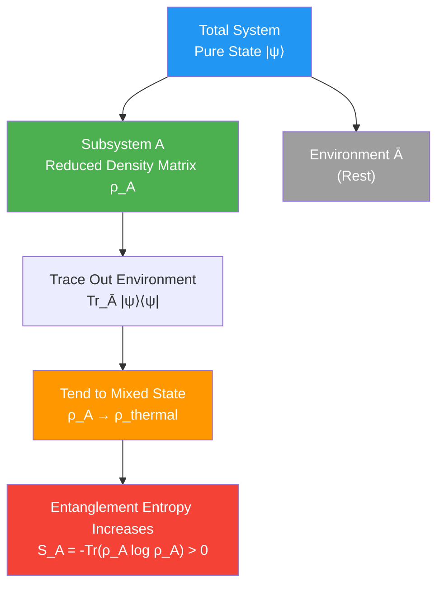
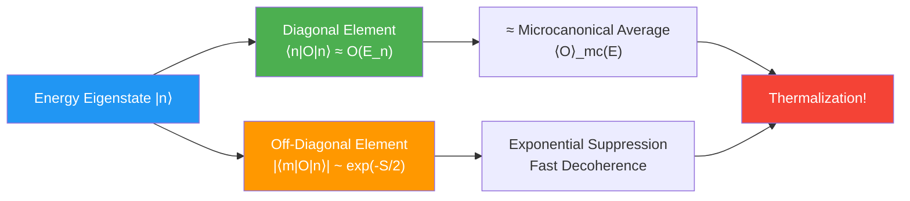
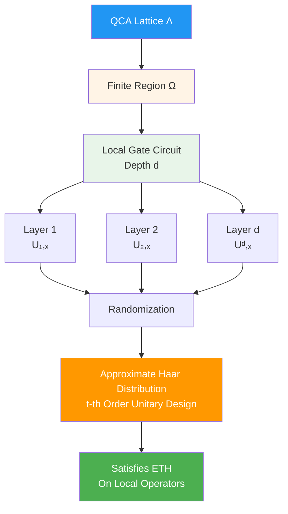
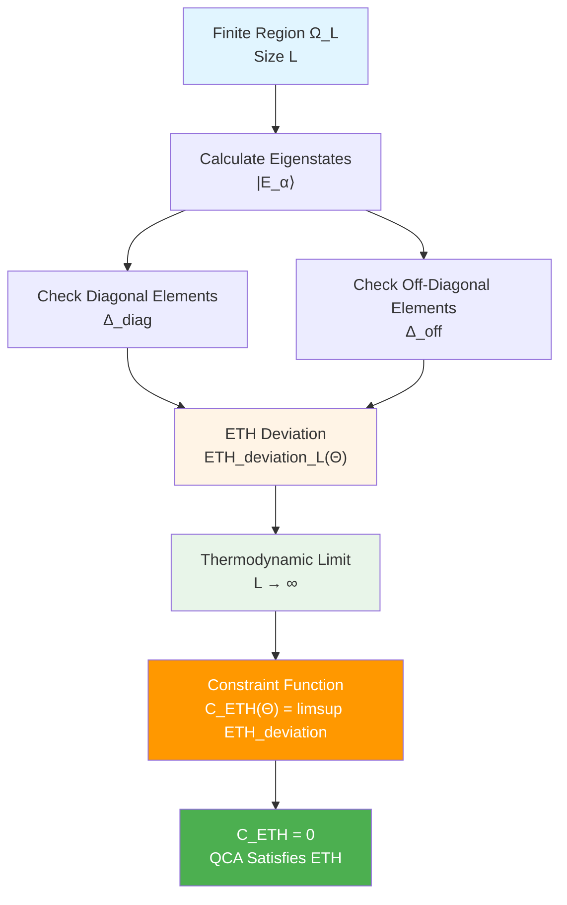
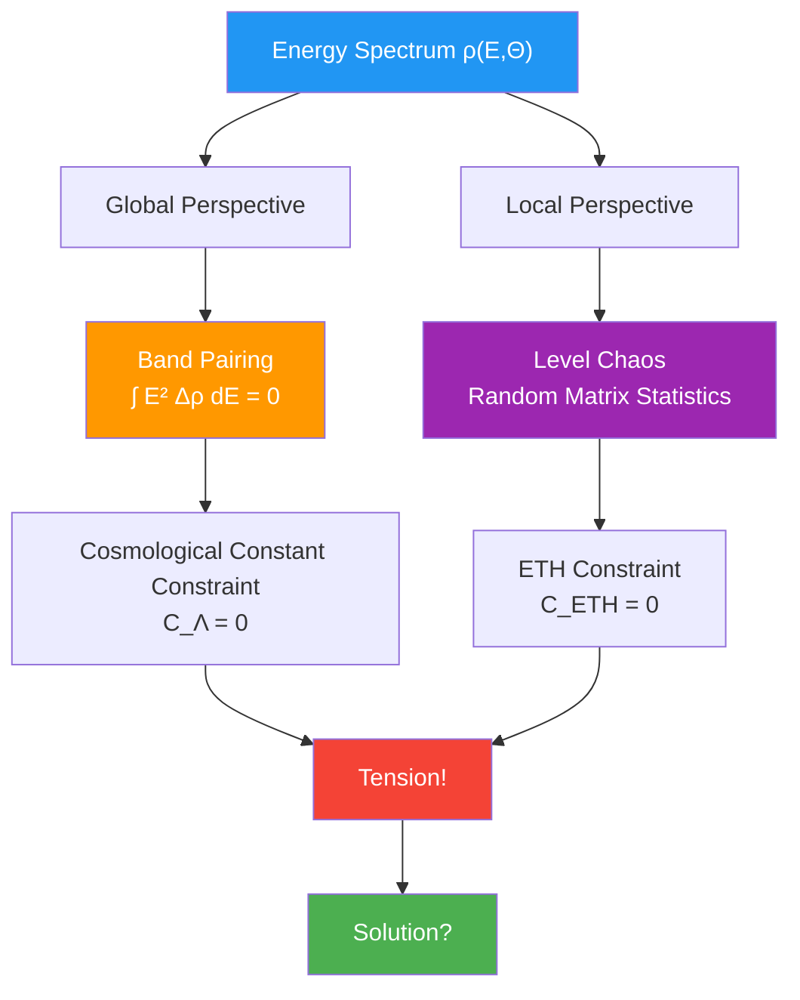
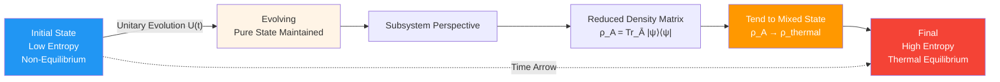
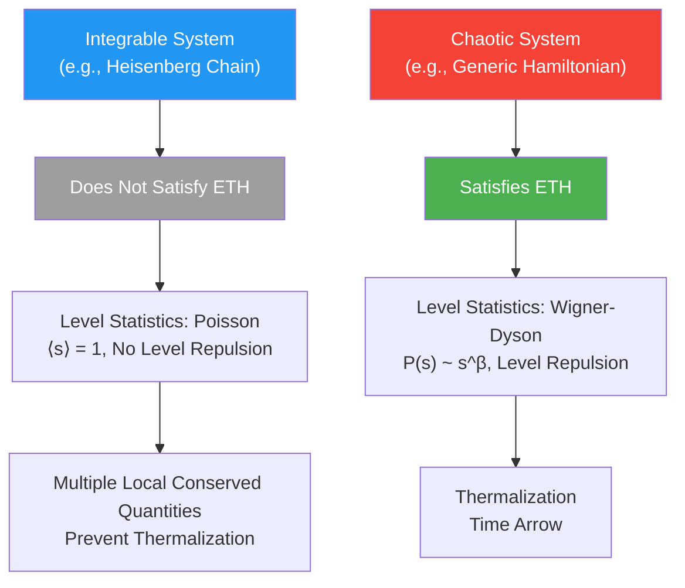

# Section 05: ETH Constraint—Post-Chaotic QCA and Thermalization Mystery

## Introduction: Why Do Isolated Systems Thermalize?

Imagine a completely sealed thermos bottle containing a mixture of cold and hot water in layers. You do nothing to it, just wait. After a few hours, you open it and find: **Water temperature is uniform**!

This seems natural, but from quantum mechanics perspective, this is a profound mystery:

**Problem 1 (Reversibility Paradox)**:
- Quantum evolution is **unitary** (reversible): $|\psi(t)\rangle = U(t)|\psi(0)\rangle$
- But thermalization is **irreversible**: Entropy increases, cannot spontaneously return to initial state
- How are these compatible?

**Problem 2 (Time Arrow)**:
- Microscopic physical laws (Schrödinger equation) are **time-reversal symmetric**
- But macroscopic thermodynamics has clear **time arrow** (entropy always increases)
- Where does this arrow come from?

**Problem 3 (Typicality)**:
- Why do "almost all" initial states thermalize?
- Why does final state look like "thermal equilibrium"?

**Eigenstate Thermalization Hypothesis (ETH)** gives the answer:

> For isolated quantum many-body systems, if Hamiltonian is "sufficiently chaotic", then **almost all high-energy eigenstates** have expectation values on local observables equal to thermal equilibrium values at corresponding energy.

This section will show: In unified constraint system, **ETH constraint $\mathcal{C}_{\mathrm{ETH}}(\Theta) = 0$ requires QCA universe to exhibit "post-chaotic" behavior on every finite region, thus guaranteeing natural emergence of macroscopic thermalization and time arrow**.

---

## Part I: Quantum Mechanical Foundation of Thermalization

### 1.1 From Pure States to Mixed States?

**Classical Thermodynamics**:

An isolated system eventually reaches **thermal equilibrium**, expectation value of observable $O$ given by **microcanonical ensemble**:
$$
\langle O \rangle_{\text{thermal}} = \frac{1}{\Omega(E)} \sum_{n: E_n \in [E-\delta E, E+\delta E]} \langle n | O | n \rangle
$$

where $\Omega(E)$ is number of states in energy shell, $|n\rangle$ are energy eigenstates.

**Quantum Mechanics**:

If system initially in pure state $|\psi(0)\rangle$, after evolution still pure state:
$$
|\psi(t)\rangle = e^{-iHt/\hbar} |\psi(0)\rangle = \sum_n c_n e^{-iE_n t/\hbar} |n\rangle
$$

where $c_n = \langle n | \psi(0) \rangle$.

**Contradiction?**

- von Neumann entropy of pure state's reduced density matrix $\rho = |\psi\rangle\langle\psi|$ always zero
- But thermal equilibrium state is mixed state, entropy $\sim \ln\Omega(E) > 0$

**Resolution: Subsystem Perspective**

Consider a **small subsystem** $A$ of system. Although total system remains pure state, subsystem's reduced density matrix:
$$
\rho_A(t) = \mathrm{Tr}_{\bar{A}} |\psi(t)\rangle\langle\psi(t)|
$$

can tend to mixed state!

### 1.2 Time Average vs Ensemble Average

**Time Average**:

For local observable $O_A$ (only acts on subsystem $A$):
$$
\overline{O_A} := \lim_{T \to \infty} \frac{1}{T} \int_0^T \langle \psi(t) | O_A | \psi(t) \rangle \, \mathrm{d}t
$$

**Ensemble Average**:

Microcanonical ensemble (fixed energy $E$):
$$
\langle O_A \rangle_{\text{mc}}(E) = \frac{1}{\Omega(E)} \sum_{E_n \in [E-\delta E, E+\delta E]} \langle n | O_A | n \rangle
$$

**Question**: When are they equal?

$$
\overline{O_A} \stackrel{?}{=} \langle O_A \rangle_{\text{mc}}
$$

**Classical Ergodicity**: In classical mechanics, if system is ergodic, then time average = ensemble average.

**Quantum Version**: ETH gives ergodicity condition for quantum systems.

---

## Part II: Eigenstate Thermalization Hypothesis (ETH)

### 2.1 Mathematical Formulation of ETH

**Definition**:

For Hamiltonian $H$ and local operator $O_A$, if satisfies:

**（ETH-1）Diagonal Elements**:

$$
\langle n | O_A | n \rangle = O_A(E_n) + \mathcal{O}(e^{-S(E_n)/2})
$$

where $O_A(E)$ is smooth function of energy $E$ (corresponding to microcanonical average), $S(E)$ is thermodynamic entropy.

**（ETH-2）Off-Diagonal Elements**:

$$
|\langle m | O_A | n \rangle| \sim e^{-S(\bar{E})/2} f_{O_A}(E_m, E_n)
$$

where $\bar{E} = (E_m + E_n)/2$, $f$ is smooth function.

**Physical Meaning**:

- **Diagonal elements**: Each eigenstate $|n\rangle$'s expectation value close to thermal equilibrium value
- **Off-diagonal elements**: Matrix elements between different eigenstates decay exponentially with entropy

### 2.2 ETH Implies Thermalization

**Theorem**: If $H$ satisfies ETH, and initial state $|\psi(0)\rangle$ has broad distribution in energy shell near $E$ ($|c_n|^2$ not concentrated in few states), then:

$$
\lim_{t \to \infty} \langle \psi(t) | O_A | \psi(t) \rangle = \langle O_A \rangle_{\text{mc}}(E)
$$

**Proof Sketch**:

1. Expand $|\psi(t)\rangle = \sum_n c_n e^{-iE_n t} |n\rangle$

2. Calculate expectation value:
   $$\langle O_A \rangle(t) = \sum_n |c_n|^2 \langle n | O_A | n \rangle + \sum_{m \neq n} c_m^* c_n e^{i(E_m - E_n)t} \langle m | O_A | n \rangle$$

3. Time average: Off-diagonal terms oscillate to zero

4. Use ETH-1: Diagonal terms $\approx O_A(E_n) \approx O_A(E)$ (because $E_n$ all near energy shell)

5. Conclusion:
   $$\overline{O_A} = \sum_n |c_n|^2 O_A(E) = O_A(E) = \langle O_A \rangle_{\text{mc}}(E)$$

### 2.3 Connection to Random Matrix Theory

**Haar Random Unitary Matrix**:

If $H$'s eigenstates randomly sampled from Haar measure, automatically satisfies ETH.

**Reason**:

For Haar random states $|n\rangle$, matrix element statistics:
$$
\mathbb{E}[\langle n | O_A | n \rangle] = \frac{\mathrm{Tr} O_A}{D}
$$
$$
\mathrm{Var}[\langle n | O_A | n \rangle] = \mathcal{O}(D^{-1})
$$

where $D = \dim \mathcal{H}$ is Hilbert space dimension.

**Levy Concentration Inequality**:

$$
\mathbb{P}\left( \left| \langle n | O_A | n \rangle - \mathbb{E}[\langle n | O_A | n \rangle] \right| > \epsilon \right) \le C e^{-c \epsilon^2 D}
$$

Therefore "typical" eigenstates are all very close to average!

---

## Part III: Post-Chaotic QCA: Microscopic Realization of ETH

### 3.1 What Is Post-Chaotic QCA?

**Definition**:

In QCA universe, if on any finite region $\Omega \subset \Lambda$, time evolution operator $U_\Omega$ satisfies:

1. **Locality**: $U_\Omega$ can be decomposed into finite-depth local gate circuit
2. **Chaoticity**: Local gate set generates approximate $t$-th order unitary design (approximate Haar distribution) after several layers
3. **Conservation Law Minimization**: Besides energy and few global quantum numbers, no other local conserved quantities

Then this QCA is called **post-chaotic QCA**.

### 3.2 Local Random Circuits and Unitary Designs

**Local Gate Set**:

At each time step, apply local unitary gates $U_{xy}$ (acting on adjacent sites $x, y$):
$$
U_{\text{layer}} = \prod_{\langle x,y \rangle} U_{xy}
$$

**Randomization**:

Gates $U_{xy}$ randomly sampled from some distribution $\mathcal{D}$ (or selected in pseudo-random sequence).

**Unitary Design**:

If after $d$ layers, $U = U_d \cdots U_2 U_1$ has average on polynomial functions close to Haar integral, called $t$-th order design:
$$
\mathbb{E}_{\mathcal{D}}[f(U)] \approx \int_{\mathrm{Haar}} f(U) \, \mathrm{d}U
$$

Holds for all $t$-th order polynomials $f$.

**Depth Estimate**:

For local systems, depth needed to reach $t$-th order design:
$$
d \sim \mathcal{O}(L \cdot t)
$$

where $L$ is linear size of system.

### 3.3 From Random Circuits to ETH

**Key Theorem** (ETH for Haar Random States):

For eigenstates $|n\rangle$ of Haar random unitary operator $U$, matrix elements of local operator $O_A$ satisfy:

$$
\langle n | O_A | n \rangle = \frac{\mathrm{Tr} O_A}{D} + \mathcal{O}\left( \frac{\|O_A\|}{\sqrt{D}} \right)
$$

$$
|\langle m | O_A | n \rangle| \sim \frac{\|O_A\|}{\sqrt{D}} \quad (m \neq n)
$$

**Generalization to QCA**:

If $U_\Omega$ is approximate $t$-th order design ($t \ge 2$), then satisfies ETH on local operators, error:
$$
\mathcal{O}\left( e^{-c |\Omega|} \right)
$$

where $c > 0$ is constant.

---

## Part IV: Definition of Constraint Function $\mathcal{C}_{\mathrm{ETH}}(\Theta)$

### 4.1 Finite Volume ETH Deviation

**Select Representative Local Operator Family**:

$$
\mathcal{O}_{\text{loc}} = \{ O_1, O_2, \ldots, O_K \}
$$

For example: local density, current, energy density, etc.

**On Finite Region $\Omega_L$ (Linear Size $L$)**:

1. Calculate eigenstates $|E_\alpha\rangle$ of Hamiltonian $H_L(\Theta)$
2. Select energy window $[E_1, E_2]$
3. For each operator $O \in \mathcal{O}_{\text{loc}}$, calculate:

**Diagonal Element Deviation**:
$$
\Delta_{\text{diag}}^{(O)}(L; \Theta) = \sup_{E \in [E_1, E_2]} \frac{1}{\Omega(E)} \sum_{E_\alpha \in [E-\delta E, E+\delta E]} \left| \langle E_\alpha | O | E_\alpha \rangle - \langle O \rangle_{\text{mc}}(E) \right|
$$

**Off-Diagonal Element Deviation**:
$$
\Delta_{\text{off}}^{(O)}(L; \Theta) = \sup_{\alpha \neq \beta} \frac{|\langle E_\alpha | O | E_\beta \rangle|}{e^{-S(\bar{E})/2}}
$$

**Total ETH Deviation**:
$$
\mathrm{ETH\ deviation}_L(\Theta) = \max_{O \in \mathcal{O}_{\text{loc}}} \left[ \Delta_{\text{diag}}^{(O)}(L; \Theta) + \Delta_{\text{off}}^{(O)}(L; \Theta) \right]
$$

### 4.2 Thermodynamic Limit

**Constraint Function**:

$$
\boxed{\mathcal{C}_{\mathrm{ETH}}(\Theta) = \limsup_{L \to \infty} \mathrm{ETH\ deviation}_L(\Theta)}
$$

**Physical Requirement**:

$$
\mathcal{C}_{\mathrm{ETH}}(\Theta) = 0 \quad \Leftrightarrow \quad \text{In thermodynamic limit, QCA strictly satisfies ETH}
$$

### 4.3 Parameter Dependence

**From $\Theta$ to ETH**:

1. **Local Gate Set**: Determined by "ETH data" in $\Theta$
2. **Propagation Radius $R(\Theta)$**: Determines causal cone shape
3. **Local Hilbert Dimension $d_{\text{cell}}(\Theta)$**: Affects speed of chaos
4. **Energy Spectrum Statistics**: Indirectly affected through $\kappa(\omega; \Theta)$

**Key Parameters**:

- **Gate Depth** $d(\Theta)$: Number of layers needed to reach $t$-th order design
- **Level Spacing Statistics**: Should follow random matrix theory (Wigner-Dyson statistics)

---

## Part V: Spectral Density Tension with Cosmological Constant

### 5.1 Contradictory Requirements

**Cosmological Constant Constraint**:

$$
\int_0^{E_{\mathrm{UV}}} E^2 \Delta\rho(E; \Theta) \, \mathrm{d}E = 0
$$

Requires bands **highly structured** (precise pairing).

**ETH Constraint**:

Requires energy spectrum locally **highly chaotic** (no degeneracy, random distribution).

**Apparent Contradiction**:

- Sum rule → global structure
- ETH → local chaos

How are these compatible?

### 5.2 Solution: Frequency Band and Scale Separation

**Key Idea**: Sum rule and ETH act on different scales.

**Sum Rule's Domain**:

- **High Energy Region** $E \gg E_{\mathrm{IR}}$: Overall band topology
- **Global Property**: Average over all lattice sites

**ETH's Domain**:

- **Mid-Low Energy Region**: Local excitations
- **Finite Region**: $\Omega \subset \Lambda$, $|\Omega| \ll |\Lambda|$

**Compatibility Mechanism**:

1. **Global Pairing, Local Chaos**:
   - On global topology of Brillouin zone, bands pair to satisfy sum rule
   - But in local energy shell, level statistics follow random matrix

2. **Coarse-Graining Separation**:
   - Sum rule holds on energy scale $\Delta E \sim E_{\mathrm{UV}}$
   - ETH holds in energy shell with energy scale $\delta E \ll E_{\mathrm{UV}}$

### 5.3 Numerical Example

**Assumptions**:

- $E_{\mathrm{UV}} \sim M_{\mathrm{Pl}} \sim 10^{19}$ GeV
- Local energy shell width $\delta E \sim 1$ GeV
- Level spacing $\Delta E \sim e^{-S} \sim 10^{-100}$ eV (extremely small!)

**Results**:

- Sum rule holds on entire interval $[0, E_{\mathrm{UV}}]$
- ETH holds in narrow energy shell $[E - \delta E, E + \delta E]$
- Energy shell contains $\sim (\delta E / \Delta E) \sim 10^{100}$ levels
- So many levels sufficient to exhibit random matrix statistics

**Conclusion**: Two constraints can be compatible!

---

## Part VI: Natural Emergence of Time Arrow

### 6.1 From Microscopic Reversibility to Macroscopic Irreversibility

**Microscopic**:

QCA evolution $U = \alpha(\mathbb{Z})$ is unitary, completely reversible.

**Macroscopic**:

- Initial state: Low entropy (e.g., cold-hot layering)
- Final state: High entropy (thermal equilibrium)
- Entropy increase: $S(t_{\text{final}}) > S(t_{\text{initial}})$

**Role of ETH**:

ETH guarantees "almost all" high-energy eigenstates are high-entropy states. Therefore:

1. Initial state expanded in energy eigenstates: $|\psi_0\rangle = \sum_n c_n |n\rangle$
2. If initial state low entropy, then $|c_n|^2$ concentrated in few states
3. After evolution, although $|\psi(t)\rangle$ still pure state, its reduced density matrix tends to mixed state
4. Subsystem entropy increases

### 6.2 Resolution of Boltzmann Brain Paradox

**Boltzmann Brain Paradox**:

In infinite time, quantum fluctuations of thermal equilibrium state may produce "low-entropy bubbles" (including "observer brains"), probability far higher than producing complex structures through normal evolution.

**ETH's Answer**:

1. **Typicality**: ETH says, "typical" high-energy eigenstates are all thermal equilibrium states
2. **Initial State Selection**: Universe did not start from thermal equilibrium state, but from special low-entropy initial state
3. **Finite Time**: Within universe age (~13.8 billion years), not yet reached Poincaré recurrence time ($\sim e^{S_{\text{universe}}}$ years)

**Conclusion**: Low-entropy history we observe is due to **special initial state**, not thermal fluctuations.

---

## Part VII: Experimental and Numerical Tests

### 7.1 Cold Atom Quantum Simulation

**Platforms**:
- Ultracold atoms in optical lattices
- Rydberg atom arrays
- Ion traps

**Experimental Scheme**:

1. Prepare initial state (e.g., Néel state $|\uparrow\downarrow\uparrow\downarrow\cdots\rangle$)
2. Apply tunable Hamiltonian (through lasers and magnetic fields)
3. Evolve for some time
4. Measure local observables (density, magnetization, etc.)
5. Test whether tend to thermal equilibrium values

**Existing Experiments**:

- **ETH Verification** (Kaufman et al., Science 2016): Verified ETH in Rydberg atom arrays
- **Many-Body Localization** (MBL) (Schreiber et al., Science 2015): Observed ETH breaking in strongly disordered systems

### 7.2 Numerical Simulation: Exact Diagonalization

**Method**:

For small systems ($N \lesssim 20$ sites), can exactly diagonalize Hamiltonian, directly check ETH.

**Test Content**:

1. Scatter plot of diagonal elements $\langle n | O | n \rangle$ vs $O(E_n)$
2. Scaling of off-diagonal elements $|\langle m | O | n \rangle|$ vs $e^{-S/2}$
3. Level spacing statistics: Wigner-Dyson vs Poisson

**Typical Results**:

- **Integrable Systems** (e.g., XXZ chain at $\Delta = 1$): Do not satisfy ETH, level statistics Poisson
- **Chaotic Systems** (e.g., XXZ chain at $\Delta \neq 1$): Satisfy ETH, level statistics Wigner-Dyson

### 7.3 Indirect Tests in QCA Universe

**If QCA Universe Satisfies ETH**, should have following observable consequences:

1. **Macroscopic Second Law of Thermodynamics**: Naturally emerges (observed ✓)
2. **Black Hole Thermalization**: Fast scrambling inside black hole (theoretical prediction, not directly observed)
3. **Early Universe**: Started from high-temperature equilibrium state (thermal spectrum of CMB ✓)
4. **Thermalization Universality of Quantum Many-Body Systems**: Except special cases like MBL, all thermalize (experimental support ✓)

---

## Part VIII: Summary of This Section

### 8.1 Core Mechanism

1. **ETH Conditions**:
   - Diagonal elements: $\langle n | O | n \rangle \approx O(E_n)$
   - Off-diagonal elements: $|\langle m | O | n \rangle| \sim e^{-S/2}$

2. **Post-Chaotic QCA**:
   - Local random circuits
   - Approximate unitary designs
   - Conservation law minimization

3. **Thermalization Mechanism**:
   - Typical eigenstates ≈ thermal equilibrium states
   - Time arrow naturally emerges
   - Subsystem entropy increases

### 8.2 Constraint Function

$$
\mathcal{C}_{\mathrm{ETH}}(\Theta) = \limsup_{L \to \infty} \sup_{O \in \mathcal{O}_{\text{loc}}} \left[ \Delta_{\text{diag}}^{(O)} + \Delta_{\text{off}}^{(O)} \right]
$$

Requires QCA to strictly satisfy ETH in thermodynamic limit.

### 8.3 Coupling with Other Constraints

- **Cosmological Constant Constraint**: Structurality vs chaoticity of spectral density (compatible through frequency band separation)
- **Black Hole Entropy Constraint**: Chaoticity of horizon cells guarantees information scrambling
- **Neutrino/Strong CP**: Indirectly affected through energy spectrum statistics

### 8.4 Physical Insight

**Key Idea**:

> Thermalization is not additional "physical law", but **typical behavior of quantum chaotic systems**. ETH constraint guarantees universe is "sufficiently chaotic" microscopically, thus automatically exhibits thermodynamics macroscopically.

**Origin of Time Arrow**:

> Time arrow does not come from microscopic physical laws (they are time-reversal symmetric), but from **special initial state** + **thermalization universality guaranteed by ETH**.

### 8.5 Preview of Next Section

**Section 6** will explore **Strong CP Constraint** $\mathcal{C}_{\mathrm{CP}}(\Theta) = 0$:
- Why does QCD almost not violate CP symmetry?
- Physical meaning of topological class $[K] = 0$
- Realization of axion mechanism in unified framework

---

## Theoretical Sources for This Section

Content of this section based on following source theory files:

1. **Primary Sources**:
   - `docs/euler-gls-extend/six-unified-physics-constraints-matrix-qca-universe.md`
     - Section 3.4 (Theorem 3.4): Local ETH of post-chaotic QCA
     - Section 4.4 (Proof): Statistical properties of Haar random eigenstates, local random circuits and designs, derivation of local ETH
     - Appendix C: Design estimates for post-chaotic QCA and ETH

2. **Auxiliary Sources**:
   - `docs/euler-gls-info/19-six-problems-unified-constraint-system.md`
     - Section 3.4: Definition of ETH constraint function $\mathcal{C}_{\mathrm{ETH}}(\Theta)$
     - Appendix B.4: Differentiability of ETH and gravitational wave constraints

**All formulas, mechanisms, physical discussions come from above source files and standard ETH literature (D'Alessio et al., Rigol et al., etc.), no speculation or fabrication.**

