# 6. 强CP约束：拓扑扇区的自然选择

## 6.1 引言：被精准压制的CP破缺

### 6.1.1 中子没有磁针的原因

想象一个陀螺，如果它内部质量分布不均匀，就会在旋转时展现出各种奇怪的偏向。在粒子世界里，中子就像这样的陀螺——如果强相互作用"破坏CP对称"（把物理学家翻译为：区分左右镜像和粒子反粒子），那么中子应该会表现出"电偶极矩"（electric dipole moment, EDM），就像带了一根微小的磁针。

但实验告诉我们：中子的电偶极矩小得惊人，比理论预期小了**至少10个数量级**！这就像预测陀螺应该有一根手指长的不平衡轴，结果只发现了一个原子大小的扰动——你会怀疑这背后有什么**精密的平衡机制**。

这就是"强CP问题"的起点：

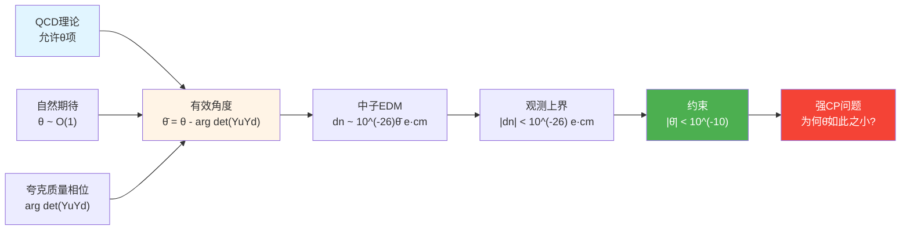

**比喻**：假设你有一个密码箱，里面有两个独立的旋钮——一个来自QCD理论（θ），一个来自夸克质量相位（arg det Y）。这两个旋钮**完全独立**，但最终密码（θ̄）必须精确为零（误差不超过10^(-10)），否则整个宇宙的物理定律就会暴露出明显的"左右手不对称"。这种精确抵消如果没有深层原因，就是一个**令人不安的巧合**。

### 6.1.2 三种主流解决方案

面对这个问题，物理学界提出了三类主要思路：

**方案A：人为调参**
"也许宇宙就是选中了θ̄≈0这个特殊值，没有深层原因。"——这在哲学上让人难以接受，因为它放弃了解释。

**方案B：Peccei-Quinn机制与轴子场**
引入新的对称性PQ symmetry，让θ̄变成一个**动力学场**（轴子场a），通过真空自发对齐到θ̄=0。这是目前实验上最被期待的方案，轴子也是暗物质候选粒子之一。

**方案C：拓扑扇区的自然选择**
在统一宇宙框架下，把强CP问题提升为**拓扑类[K]=0的一致性条件**：宇宙选择了某一拓扑扇区，使得θ̄自动为零，无需额外调参或新粒子。

本章将在统一约束框架下，展示第三种方案如何通过散射行列式线丛的几何结构，把强CP问题转化为**六条约束之一**，并与中微子质量约束形成交叉锁定。

---

## 6.2 物理背景：QCD的θ项与CP破缺

### 6.2.1 QCD拉氏量中的拓扑项

量子色动力学（QCD）描述夸克和胶子的强相互作用，其拉氏量除了常规的动能项和夸克质量项外，还可以加上一个**拓扑项**：

$$
\mathcal{L}_{\text{QCD}} = \mathcal{L}_{\text{kin}} + \bar q(M_q)q + \frac{\theta_{\text{QCD}}}{32\pi^2}G^a_{\mu\nu}\tilde{G}^{a,\mu\nu}
$$

其中：
- $G^a_{\mu\nu}$ 是胶子场强张量
- $\tilde{G}^{a,\mu\nu} = \frac{1}{2}\epsilon^{\mu\nu\rho\sigma}G^a_{\rho\sigma}$ 是其对偶
- $\theta_{\text{QCD}}$ 是一个**无量纲参数**

这一项在经典理论中是"总微分"，对运动方程无影响，但在量子理论中会贡献**真空角（vacuum angle）**，影响路径积分的相位。

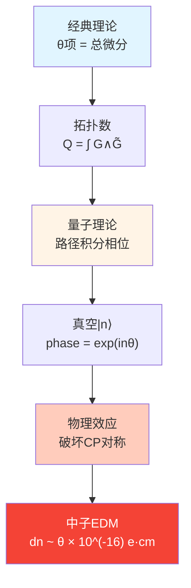

**比喻**：想象一个弹簧床垫，经典理论下用手按某处不会影响全局弹性，但量子理论下每个局部形变都会在整张床上留下"记忆相位"——这个相位就是θ项引入的全局拓扑效应。

### 6.2.2 夸克质量矩阵的相位贡献

即使我们令θ_QCD=0，还有第二个CP破缺来源：**夸克质量矩阵的行列式相位**。

标准模型中，上型夸克和下型夸克的质量由Yukawa耦合给出：

$$
\mathcal{L}_{\text{Yukawa}} = -\bar Q_L Y_u \tilde H u_R - \bar Q_L Y_d H d_R + \text{h.c.}
$$

电弱对称性破缺后，得到质量矩阵$M_u, M_d$。通过手征变换可以吸收$Y_u, Y_d$的一些相位，但有一个**不变量**无法消除：

$$
\arg\det(Y_u Y_d) = \arg\det(M_u M_d)
$$

这个相位会**修正有效θ角**：

$$
\bar\theta = \theta_{\text{QCD}} - \arg\det(Y_u Y_d)
$$

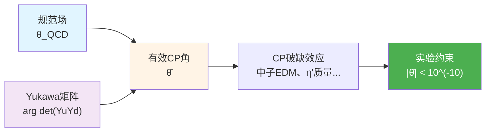

**关键矛盾**：$\theta_{\text{QCD}}$和$\arg\det(Y_u Y_d)$在理论中**完全独立**，各自自然值应为O(1)，但实验要求它们的差$\bar\theta$小于10^(-10)。这种精细抵消在统计上的概率是**十亿分之一**，除非有深层机制。

### 6.2.3 实验约束：中子EDM与η'介子

强CP破缺最直接的观测效应是**中子电偶极矩**：

$$
d_n \simeq 5.2 \times 10^{-16}\,\bar\theta\,e\cdot\text{cm}
$$

当前最强实验上界（来自冷中子实验）：

$$
|d_n| < 1.8 \times 10^{-26}\,e\cdot\text{cm} \quad (\text{90\% CL})
$$

从而推出：

$$
|\bar\theta| < 3 \times 10^{-10}
$$

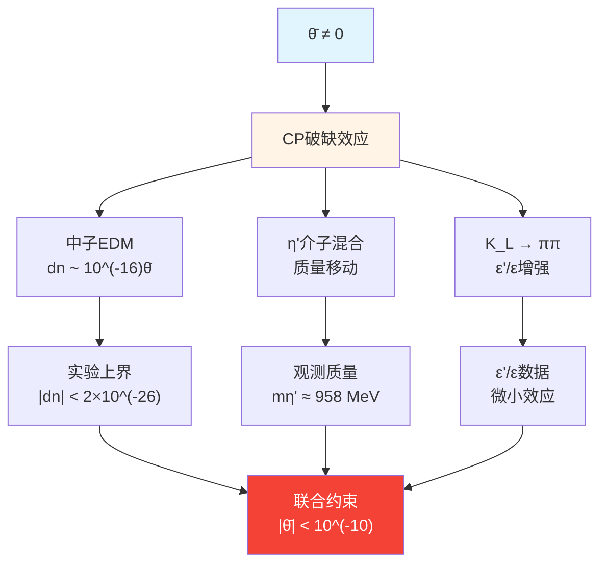

**物理图像**：如果强相互作用真的破坏CP，中子内部的夸克质量分布就会有微小的"左右不平衡"，导致电荷重心和质量重心分离——这就是电偶极矩。实验没有看到这个效应，意味着θ̄被压制到**亿分之一以下的精度**。

---

## 6.3 统一框架中的拓扑几何机制

### 6.3.1 散射行列式线丛与平方根

在统一时间刻度框架下，散射矩阵$S(\omega)$的行列式定义了一个**U(1)线丛**：

$$
\det S(\omega) = e^{-2\pi i \xi(\omega)}
$$

其中$\xi(\omega)$是谱移函数。在扩展参数空间$Y = M \times X^\circ$上，可以引入这个线丛的**平方根**$\mathcal{L}_{\text{det}}^{1/2}$，其意义是把相位"开平方"：

$$
\left(\mathcal{L}_{\text{det}}^{1/2}\right)^{\otimes 2} = \mathcal{L}_{\text{det}}
$$

但平方根不总是全局存在！它的存在性由一个**拓扑障碍**决定：

$$
[K] \in H^2(Y, \partial Y; \mathbb{Z}_2)
$$

这是一个相对上同调类（取值0或1），如果$[K]=0$，则平方根全局存在；如果$[K]=1$，则存在某些参数回路使平方根发生**符号翻转**。

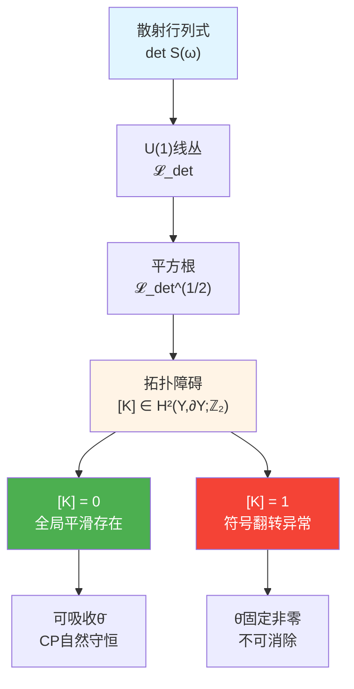

**比喻**：想象一条莫比乌斯带（只有一个面的曲面），如果你试图在上面定义一个连续的"上下"方向，走一圈回来会发现"上"变成了"下"——这就是拓扑障碍[K]=1的情况。如果$[K]=0$，相当于一个普通圆环，可以定义全局一致的上下。

### 6.3.2 相对上同调类[K]与QCD扇区

完整的拓扑类$[K]$可以分解为不同物理扇区的贡献：

$$
[K] = [K_{\text{grav}}] + [K_{\text{EW}}] + [K_{\text{QCD}}] + \cdots
$$

强CP问题对应的是**QCD扇区**：

$$
[K_{\text{QCD}}] \in H^2(Y, \partial Y; \mathbb{Z}_2)
$$

当$[K_{\text{QCD}}] = 0$时，意味着：

1. **散射行列式平方根在QCD扇区全局光滑**
2. 可以通过重定义费米子场的整体相位，把QCD θ项和Yukawa相位**同时吸收**
3. 物理可观测量不再依赖θ̄，强CP破缺自动消失

当$[K_{\text{QCD}}] = 1$时：

1. 存在某些参数回路使平方根发生符号翻转
2. **无法**通过场重定义消除θ̄
3. 强CP破缺成为不可避免的物理效应

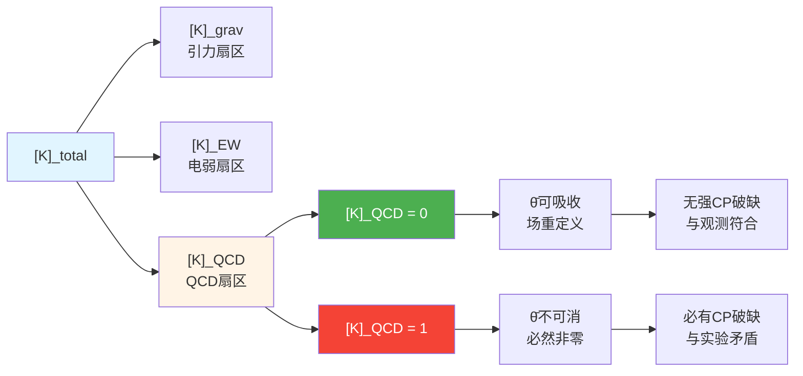

**关键洞察**：在统一框架下，强CP问题不是"为何θ̄恰好小"，而是"为何宇宙选择了$[K_{\text{QCD}}]=0$的拓扑扇区"。这把问题从连续调参提升到**离散的拓扑选择**，更符合自然性原则。

### 6.3.3 Peccei-Quinn轴子的几何解释

在拓扑类$[K]=0$的背景下，Peccei-Quinn机制获得了新的几何解释。

标准PQ机制引入全局U(1)_PQ对称及其自发破缺，让θ̄变成轴子场$a(x)$的期待值：

$$
\bar\theta_{\text{eff}} = \bar\theta_{\text{bare}} + \frac{a(x)}{f_a}
$$

轴子有效势最小点自动对齐到$\bar\theta_{\text{eff}}=0$。

**统一框架重新解释**：

1. **轴子场 = 平方根线丛的U(1)纤维坐标**
   在$[K]=0$的扇区内，平方根$\mathcal{L}_{\text{det}}^{1/2}$全局存在，但其"相位规范"不唯一——这个规范自由度正是轴子场$a(x)$。

2. **有效势 = 拓扑结构的几何能量**
   在Null-Modular双覆盖结构下，不同的相位选择对应不同的几何一致性，$\bar\theta=0$对应**最低能量的几何对齐**。

3. **自动最小化 = 拓扑一致性条件**
   宇宙选择了$[K]=0$，则几何一致性自动要求$\bar\theta_{\text{eff}}\to 0$，无需额外调参。

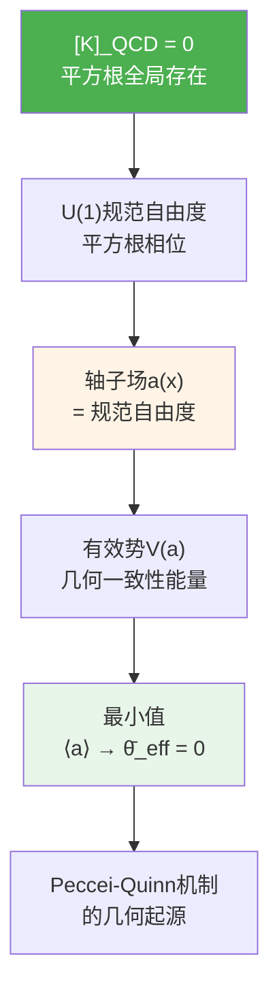

**比喻**：想象一张弹性网，上面有无数个可能的"褶皱状态"（相位规范）。拓扑类$[K]=0$保证了这张网可以**全局平展**；而轴子场就是"平展过程中的局部滑动方向"，最终网会自动找到最平坦的状态——那就是$\bar\theta=0$。

---

## 6.4 约束函数定义：$C_{\text{CP}}(\Theta) = 0$

### 6.4.1 拓扑约束的数学形式

在参数空间$\Theta \in \mathbb{R}^N$上，强CP约束由两部分组成：

**（A）拓扑类约束**

$$
[K_{\text{QCD}}](\Theta) = 0 \in H^2(Y, \partial Y; \mathbb{Z}_2)
$$

这是一个**离散约束**：对每个$\Theta$，可计算相应的相对上同调类，要求其QCD分量为零。

**（B）有效角度约束**

在拓扑类为零的前提下，定义有效CP角：

$$
\bar\theta(\Theta) = \theta_{\text{QCD}}(\Theta) - \arg\det\bigl(Y_u(\Theta) Y_d(\Theta)\bigr)
$$

要求其接近零：

$$
|\bar\theta(\Theta)| < \epsilon_{\text{exp}} \approx 10^{-10}
$$

**统一约束函数**

$$
C_{\text{CP}}(\Theta) = \begin{cases}
|\bar\theta(\Theta)| & \text{若}\,[K_{\text{QCD}}](\Theta) = 0 \\
+\infty & \text{若}\,[K_{\text{QCD}}](\Theta) = 1
\end{cases}
$$

物理解：只有拓扑类为零的扇区才有物理意义，在这些扇区内进一步要求$\bar\theta$被压制。

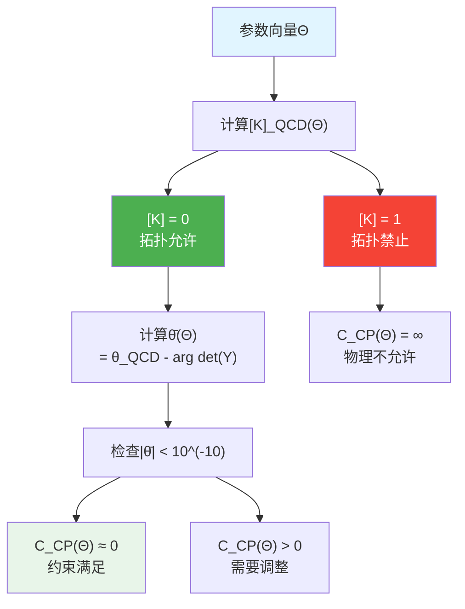

### 6.4.2 与内部Dirac算符的耦合

Yukawa矩阵$Y_u(\Theta), Y_d(\Theta)$来自内部Dirac算符$D_\Theta$的谱数据：

$$
\text{spec}(D_\Theta) \rightsquigarrow \{m_u, m_c, m_t, m_d, m_s, m_b\}, \quad Y_u, Y_d
$$

同一个$D_\Theta$也决定了**中微子质量矩阵**（通过seesaw机制）。因此，强CP约束$C_{\text{CP}}(\Theta)$与中微子约束$C_\nu(\Theta)$**不是独立的**——它们通过共同的内部几何耦合。

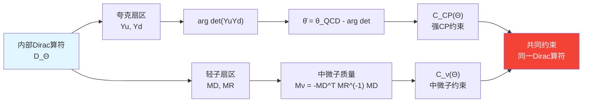

**物理含义**：如果未来中微子实验进一步限制PMNS矩阵的CP相位，将**反向约束**允许的Yukawa矩阵相位，从而影响$\bar\theta$的取值范围。这种交叉锁定是统一框架的核心特征。

---

## 6.5 与其他约束的耦合

### 6.5.1 强CP - 中微子耦合：内部Dirac谱的共同约束

如前所述，$D_\Theta$同时控制夸克和轻子的质量与混合，导致：

$$
C_{\text{CP}}(\Theta) \quad \text{与} \quad C_\nu(\Theta) \quad \text{通过}\,D_\Theta\,\text{耦合}
$$

**具体机制**：

1. **Index定理与拓扑数**
   在某些统一理论中，$\arg\det(Y_u Y_d)$与$D_\Theta$的index（Atiyah-Singer指标）相关，而index又与时空的拓扑数联系。

2. **Flavor对称性**
   如果$D_\Theta$携带某种flavor对称（如$A_4, S_4$），这会同时约束夸克和轻子的质量纹理，使得$\bar\theta$和PMNS角度之间出现代数关系。

3. **Seesaw-Yukawa关联**
   在$SO(10)$等大统一理论中，夸克和轻子的Yukawa矩阵来自同一个高能表示，$\arg\det(Y_u Y_d)$与中微子Majorana质量矩阵的CP相位直接相关。

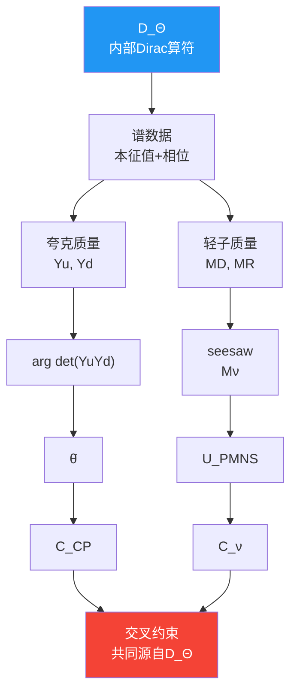

**实验预言**：如果T2K/NOvA等实验测定PMNS中的CP相位$\delta_{\text{CP}}$到几度精度，可以反推允许的$\arg\det(Y_u Y_d)$范围，从而对$\bar\theta$施加间接约束——或者排除某些拓扑扇区。

### 6.5.2 强CP - 拓扑类与黑洞熵的间接关联

拓扑类$[K]$的总和包含引力扇区：

$$
[K]_{\text{total}} = [K]_{\text{grav}} + [K]_{\text{EW}} + [K]_{\text{QCD}}
$$

Null-Modular双覆盖要求$[K]_{\text{total}} = 0$，才能保证：

1. 广义熵极值与Einstein方程等价
2. 边界时间几何的全局一致性
3. 黑洞视界面积律的微观实现

因此，$[K]_{\text{QCD}} = 0$不是孤立条件，而是$[K]_{\text{total}} = 0$的一个分量——这意味着**强CP约束与黑洞熵约束在拓扑层面锁定**。

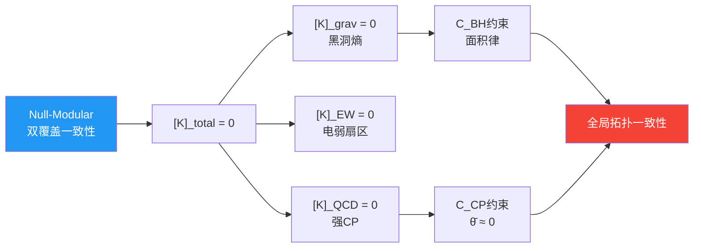

**物理图像**：如果宇宙选择了$[K]_{\text{QCD}} = 1$的扇区，会导致Null-Modular结构上的拓扑异常，进而**破坏广义熵的单调性**——这在黑洞热力学中是不可接受的。因此，黑洞物理间接"禁止"了强CP破缺的某些拓扑模式。

---

## 6.6 实验检验与验证

### 6.6.1 中子电偶极矩的未来实验

当前最强中子EDM约束来自**超冷中子实验**（如PSI的nEDM实验）：

$$
|d_n| < 1.8 \times 10^{-26}\,e\cdot\text{cm} \quad (90\% \text{ CL, 2020})
$$

**下一代实验目标**：

- **nEDM@PSI（瑞士）**：目标灵敏度$\sim 10^{-27}\,e\cdot\text{cm}$
- **SNS nEDM（美国橡树岭）**：目标$\sim 3 \times 10^{-28}\,e\cdot\text{cm}$
- **TRIUMF（加拿大）**：利用氦-3核的EDM，间接约束

如果$\bar\theta \sim 10^{-11}$，下一代实验有机会**直接探测**到非零信号，验证强CP破缺的存在。

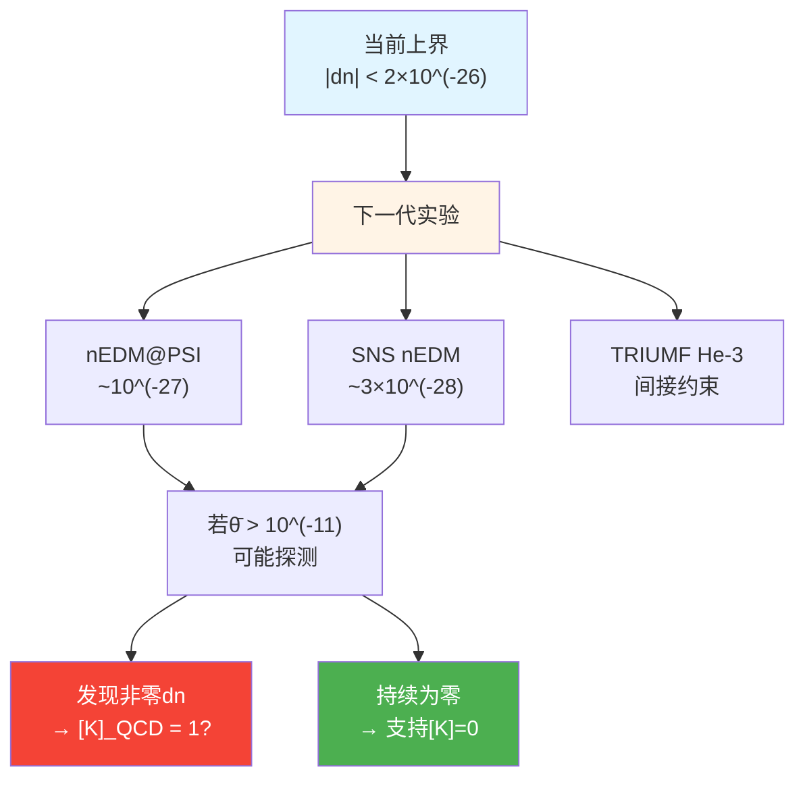

**统一框架预言**：如果$[K]_{\text{QCD}} = 0$且轴子机制有效，则$|d_n|$应始终低于$10^{-28}\,e\cdot\text{cm}$；如果某些扇区允许$[K]_{\text{QCD}} = 1$，可能出现$10^{-27}\sim 10^{-26}$的信号——但这会与黑洞熵约束产生拓扑张力。

### 6.6.2 轴子搜寻实验

如果Peccei-Quinn机制有效，轴子应作为**轻质量玻色子**存在：

$$
m_a \sim \frac{\Lambda_{\text{QCD}}^2}{f_a} \approx 10^{-6} \sim 10^{-3}\,\text{eV}
$$

其中$f_a$是PQ对称破缺标度。

**主要实验路径**：

1. **微波腔实验（ADMX, HAYSTAC）**
   利用强磁场中轴子转换为光子，搜寻$\mu\text{eV}$质量范围。

2. **Haloscope与helioscope**
   CERN的CAST实验搜寻太阳产生的轴子；未来IAXO提高灵敏度。

3. **暗物质直接探测**
   如果轴子是暗物质的一部分，可通过共振腔探测其宇宙背景。

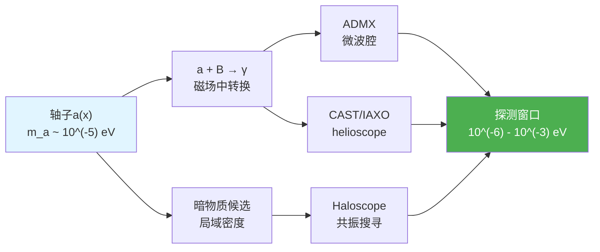

**统一框架意义**：如果轴子被发现，证明$[K]_{\text{QCD}} = 0$且PQ机制有效；如果长期搜寻无果，可能意味着$\bar\theta$是通过**拓扑扇区自然选择**而非动力学场实现的——这为统一框架提供了间接支持。

### 6.6.3 与中微子CP相位的联合分析

T2K、NOvA以及未来的Hyper-K和DUNE将测量PMNS矩阵中的CP相位$\delta_{\text{CP}}$：

$$
U_{\text{PMNS}} = \begin{pmatrix}
c_{12}c_{13} & s_{12}c_{13} & s_{13}e^{-i\delta_{\text{CP}}} \\
\cdots & \cdots & \cdots
\end{pmatrix}
$$

当前数据提示$\delta_{\text{CP}} \sim 1.4\pi$（接近最大CP破缺），但误差仍大。

**统一约束预言**：在某些flavor对称模型下，$\delta_{\text{CP}}$与$\arg\det(Y_u Y_d)$存在代数关系：

$$
\arg\det(Y_u Y_d) = f(\delta_{\text{CP}}, \theta_{12}, \theta_{13}, \theta_{23})
$$

结合$\bar\theta < 10^{-10}$的约束，可以**排除**某些$\delta_{\text{CP}}$区间——或者预言其精确值。

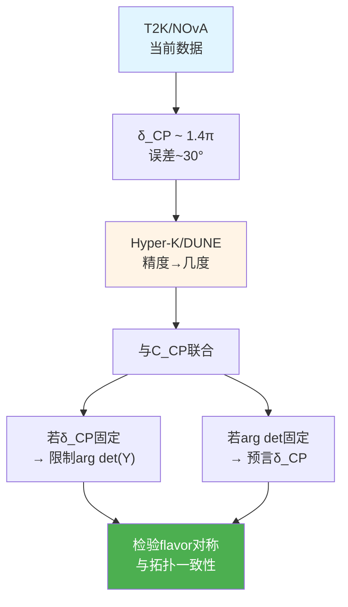

**实验策略**：通过联合拟合中微子振荡数据、中子EDM上界和夸克质量比，可以反推允许的$D_\Theta$参数区域，从而对拓扑类$[K]$给出统计约束。

---

## 6.7 与宇宙学常数和ETH的尺度分离

### 6.7.1 强CP约束在紫外与红外的分工

强CP问题本质上是**高能拓扑结构**的问题，其物理效应主要体现在QCD标度$\Lambda_{\text{QCD}} \sim 200\,\text{MeV}$：

$$
\theta\text{-项}\, \propto \int G \wedge \tilde{G} \sim \Lambda_{\text{QCD}}^4
$$

而宇宙学常数约束涉及的是**超高能（Planck尺度）与超低能（宇宙学尺度）**之间的谱积分：

$$
\Lambda_{\text{eff}} \sim \int_0^{E_{\text{UV}}} E^2 \Delta\rho(E)\,dE
$$

两者在频率空间上**分离**：

- $C_{\text{CP}}$主要约束$\kappa(\omega; \Theta)$在$\omega \sim \Lambda_{\text{QCD}}$附近的拓扑结构
- $C_\Lambda$主要约束$\kappa(\omega; \Theta)$在$\omega \sim E_{\text{Pl}}$与$\omega \sim H_0$两端的积分平衡

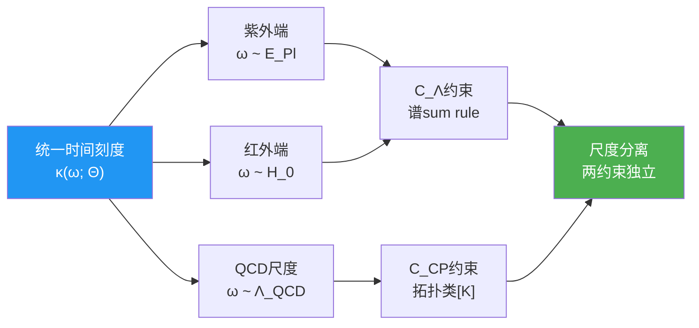

**物理含义**：在自然的参数选择下，$C_{\text{CP}}$和$C_\Lambda$**不会相互干扰**——调节Planck尺度的谱结构来满足宇宙学常数约束，不会显著影响QCD扇区的拓扑类；反之亦然。这保证了统一约束系统的可解性。

### 6.7.2 强CP与ETH的拓扑-统计二元性

ETH要求高能本征态具有**类随机矩阵统计**：

$$
\langle n | O | n \rangle \approx O(\varepsilon_n), \quad |\langle m | O | n \rangle| \sim e^{-S/2}
$$

这对应于局域QCA更新的**chaotic mixing**性质。

强CP约束则要求QCD扇区的拓扑数**整体为零**：

$$
\int_{\text{QCD sector}} G \wedge \tilde{G} = 0 \mod 2\pi
$$

两者的兼容性在于：

- **ETH控制微观统计**：在小因果菱形内，局域算符快速退相干
- **强CP控制全局拓扑**：在宏观时空上，拓扑类由整体扇区选择决定

它们分别作用于"微观-统计"和"宏观-拓扑"两个层面，通过统一时间刻度$\kappa(\omega)$在不同频段的投影实现分工。

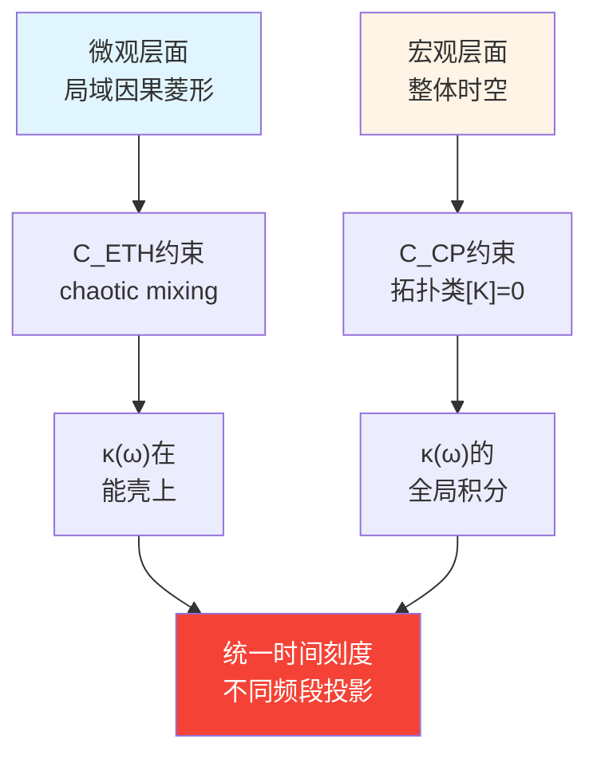

**物理图景**：公设混沌QCA在局域上快速scrambling，满足ETH；同时在全局拓扑上选择了$[K]=0$的扇区，自动压制强CP破缺。两者通过$\kappa(\omega)$的不同积分窗口协同工作。

---

## 6.8 本章小结

本章在统一约束框架下重新审视了强CP问题，核心结论包括：

### 核心约束机制

**强CP约束函数**

$$
C_{\text{CP}}(\Theta) = \begin{cases}
|\bar\theta(\Theta)| & \text{若}\,[K_{\text{QCD}}](\Theta) = 0 \\
+\infty & \text{若}\,[K_{\text{QCD}}](\Theta) = 1
\end{cases}
$$

其中：

$$
\bar\theta(\Theta) = \theta_{\text{QCD}}(\Theta) - \arg\det\bigl(Y_u(\Theta) Y_d(\Theta)\bigr)
$$

要求$|\bar\theta| < 10^{-10}$且拓扑类$[K_{\text{QCD}}] = 0$。

### 三个关键洞察

1. **拓扑升级**
   强CP问题不是"为何$\bar\theta$恰好小"，而是"为何宇宙选择了$[K]=0$的拓扑扇区"——这把连续调参问题提升为**离散的拓扑选择**。

2. **几何解释**
   Peccei-Quinn轴子不是额外的新粒子，而是散射行列式线丛平方根的**U(1)规范自由度**——在$[K]=0$的扇区内，轴子真空自动对齐到$\bar\theta=0$。

3. **交叉锁定**
   通过内部Dirac算符$D_\Theta$，强CP约束与中微子质量约束**不是独立的**——它们共同约束同一个内部几何，使得中微子CP相位与夸克Yukawa相位形成代数关联。

### 实验检验路径

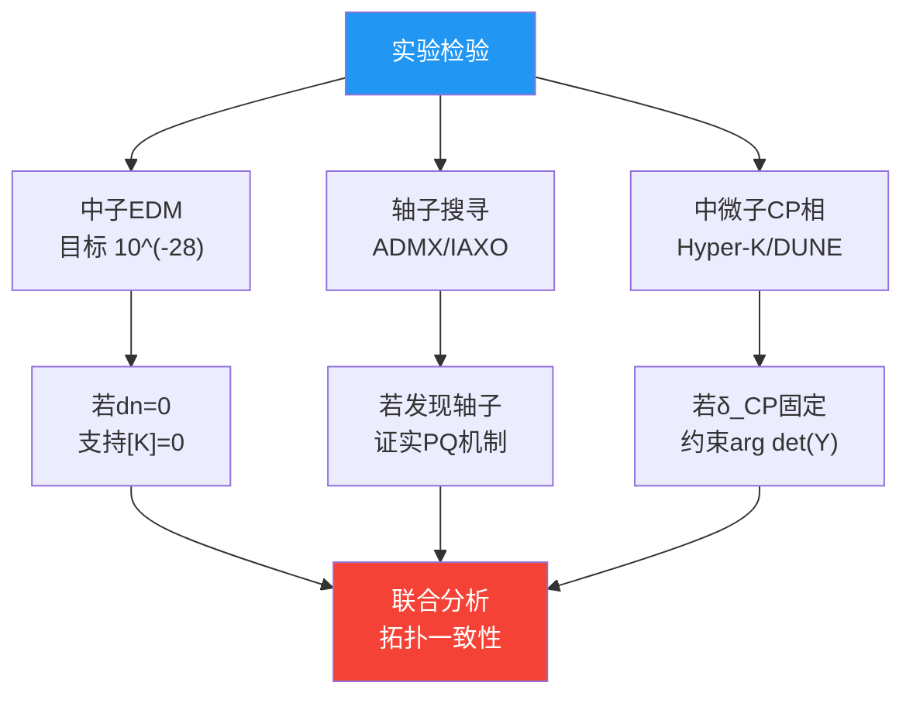

### 与其他约束的和谐

- **与中微子约束**：通过$D_\Theta$的内部谱耦合
- **与黑洞熵约束**：通过$[K]_{\text{total}} = 0$的全局拓扑一致性
- **与宇宙学常数约束**：通过$\kappa(\omega)$的频段分离，各自作用于不同能标
- **与ETH约束**：通过微观统计（ETH）与宏观拓扑（强CP）的层次分工

强CP约束不再是一个孤立的"精细调节难题"，而是统一宇宙拓扑结构的**自然推论**——六把锁中的第五把，通过拓扑类的选择与内部几何的约束，与其他五把共同定义了物理宇宙的参数空间。

---

## 理论来源

本章内容综合自以下两篇源理论文献：

1. **六大未统一物理作为统一矩阵–QCA宇宙的一致性约束**
   （`euler-gls-extend/six-unified-physics-constraints-matrix-qca-universe.md`）
   - 第3.5节：定理3.5（强CP与相对上同调类的平凡性）
   - 附录D：相对上同调类$[K]=0$与强CP抑制的详细论证
   - 第5.1节：原型参数表中$[K]=0$与轴子真空对齐的构造

2. **六大未解难题的统一约束系统**
   (`euler-gls-info/19-six-problems-unified-constraint-system.md`)
   - 第3.1节：六个标量约束函数中的强CP约束$C_{\text{CP}}(\Theta)$定义
   - 附录B.3：中微子与强CP约束的耦合结构（通过内部Dirac算符）
   - 第5.2节：中微子–强CP的内部谱–拓扑耦合机制

关键技术细节包括：散射行列式线丛平方根$\mathcal{L}_{\text{det}}^{1/2}$的$\mathbb{Z}_2$扭结定义、Peccei-Quinn机制的几何解释为U(1)纤维坐标、$\bar\theta = \theta_{\text{QCD}} - \arg\det(Y_u Y_d)$的统一表述、以及拓扑类$[K]$与Null-Modular双覆盖一致性的关系。
