# Section 06: Strong CP Constraint—Natural Selection of Topological Sectors

## 6.1 Introduction: Precisely Suppressed CP Violation

### 6.1.1 Why Neutrons Have No Magnetic Needle

Imagine a spinning top. If its internal mass distribution is uneven, it will exhibit various strange biases during rotation. In particle world, neutron is like such a top—if strong interactions "violate CP symmetry" (translated for physicists: distinguish left-right mirror and particle-antiparticle), then neutron should exhibit "electric dipole moment" (EDM), like carrying a tiny magnetic needle.

But experiments tell us: Neutron's electric dipole moment is astonishingly small, **at least 10 orders of magnitude** smaller than theoretical expectation! This is like predicting top should have an imbalance axis as long as a finger, but only finding an atomic-sized perturbation—you would suspect there is some **precise balancing mechanism** behind this.

This is the starting point of "strong CP problem":

```mermaid
graph LR
    QCD["QCD Theory<br/>Allows θ Term"]
    Natural["Natural Expectation<br/>θ ~ O(1)"]
    Yukawa["Quark Mass Phase<br/>arg det(YuYd)"]

    QCD --> Theta["Effective Angle<br/>θ̄ = θ - arg det(YuYd)"]
    Natural --> Theta
    Yukawa --> Theta

    Theta --> EDM["Neutron EDM<br/>dn ~ 10^(-26)θ̄ e·cm"]

    EDM --> Obs["Observation Upper Bound<br/>|dn| < 10^(-26) e·cm"]
    Obs --> Constraint["Constraint<br/>|θ̄| < 10^(-10)"]

    Constraint --> Problem["Strong CP Problem<br/>Why Is θ̄ So Small?"]

    style QCD fill:#e1f5ff
    style Theta fill:#fff4e6
    style Problem fill:#f44336,color:#fff
    style Constraint fill:#4caf50,color:#fff
```

**Analogy**: Suppose you have a combination lock with two independent knobs—one from QCD theory ($\theta$), one from quark mass phase (arg det Y). These two knobs are **completely independent**, but final combination ($\bar\theta$) must be precisely zero (error no more than $10^{-10}$), otherwise universe's physical laws would expose obvious "left-right asymmetry". This precise cancellation without deep reason is an **unsettling coincidence**.

### 6.1.2 Three Main Solution Approaches

Facing this problem, physics community proposed three main approaches:

**Approach A: Artificial Fine-Tuning**
"Maybe universe just chose special value $\bar\theta \approx 0$, no deep reason."—This is philosophically unacceptable, because it abandons explanation.

**Approach B: Peccei-Quinn Mechanism and Axion Field**
Introduce new symmetry PQ symmetry, make $\bar\theta$ a **dynamical field** (axion field $a$), spontaneously align to $\bar\theta=0$ through vacuum. This is currently most experimentally anticipated approach, axion is also dark matter candidate.

**Approach C: Natural Selection of Topological Sectors**
In unified universe framework, elevate strong CP problem to **topological class $[K]=0$ consistency condition**: Universe chose certain topological sector, making $\bar\theta$ automatically zero, no need for additional tuning or new particles.

This chapter will show in unified constraint framework how third approach transforms strong CP problem into **one of six constraints** through geometric structure of scattering determinant line bundle, and forms cross-locking with neutrino mass constraint.

---

## 6.2 Physical Background: QCD θ Term and CP Violation

### 6.2.1 Topological Term in QCD Lagrangian

Quantum Chromodynamics (QCD) describes strong interactions of quarks and gluons. Besides conventional kinetic terms and quark mass terms, its Lagrangian can add a **topological term**:

$$
\mathcal{L}_{\text{QCD}} = \mathcal{L}_{\text{kin}} + \bar q(M_q)q + \frac{\theta_{\text{QCD}}}{32\pi^2}G^a_{\mu\nu}\tilde{G}^{a,\mu\nu}
$$

where:
- $G^a_{\mu\nu}$ is gluon field strength tensor
- $\tilde{G}^{a,\mu\nu} = \frac{1}{2}\epsilon^{\mu\nu\rho\sigma}G^a_{\rho\sigma}$ is its dual
- $\theta_{\text{QCD}}$ is a **dimensionless parameter**

This term is "total derivative" in classical theory, has no effect on equations of motion, but in quantum theory contributes **vacuum angle**, affecting phase of path integral.

```mermaid
graph TB
    Classical["Classical Theory<br/>θ Term = Total Derivative"]
    Quantum["Quantum Theory<br/>Path Integral Phase"]

    Classical --> Topological["Topological Number<br/>Q = ∫ G∧G̃"]
    Topological --> Quantum

    Quantum --> Phase["Vacuum |n⟩<br/>phase = exp(inθ)"]

    Phase --> Physical["Physical Effect<br/>Violates CP Symmetry"]

    Physical --> nEDM["Neutron EDM<br/>dn ~ θ × 10^(-16) e·cm"]

    style Classical fill:#e1f5ff
    style Quantum fill:#fff4e6
    style Physical fill:#ffccbc
    style nEDM fill:#f44336,color:#fff
```

**Analogy**: Imagine a spring mattress, in classical theory pressing somewhere doesn't affect global elasticity, but in quantum theory each local deformation leaves "memory phase" on entire bed—this phase is global topological effect introduced by θ term.

### 6.2.2 Phase Contribution of Quark Mass Matrix

Even if we set $\theta_{\text{QCD}}=0$, there is second source of CP violation: **determinant phase of quark mass matrices**.

In standard model, up-type and down-type quark masses given by Yukawa couplings:

$$
\mathcal{L}_{\text{Yukawa}} = -\bar Q_L Y_u \tilde H u_R - \bar Q_L Y_d H d_R + \text{h.c.}
$$

After electroweak symmetry breaking, get mass matrices $M_u, M_d$. Through chiral transformation can absorb some phases of $Y_u, Y_d$, but there is an **invariant** that cannot be eliminated:

$$
\arg\det(Y_u Y_d) = \arg\det(M_u M_d)
$$

This phase **corrects effective θ angle**:

$$
\bar\theta = \theta_{\text{QCD}} - \arg\det(Y_u Y_d)
$$

```mermaid
graph LR
    Gauge["Gauge Field<br/>θ_QCD"]
    Yukawa["Yukawa Matrices<br/>arg det(YuYd)"]

    Gauge --> Theta["Effective CP Angle<br/>θ̄"]
    Yukawa --> Theta

    Theta --> CP["CP Violation Effects<br/>Neutron EDM, η' Mass..."]

    CP --> Exp["Experimental Constraint<br/>|θ̄| < 10^(-10)"]

    style Gauge fill:#e1f5ff
    style Yukawa fill:#f3e5f5
    style Theta fill:#fff4e6
    style Exp fill:#4caf50,color:#fff
```

**Key Contradiction**: $\theta_{\text{QCD}}$ and $\arg\det(Y_u Y_d)$ are **completely independent** in theory, each natural value should be O(1), but experiment requires their difference $\bar\theta$ less than $10^{-10}$. Probability of such fine cancellation statistically is **one in a billion**, unless there is deep mechanism.

### 6.2.3 Experimental Constraints: Neutron EDM and η' Meson

Most direct observable effect of strong CP violation is **neutron electric dipole moment**:

$$
d_n \simeq 5.2 \times 10^{-16}\,\bar\theta\,e\cdot\text{cm}
$$

Current strongest experimental upper bound (from cold neutron experiments):

$$
|d_n| < 1.8 \times 10^{-26}\,e\cdot\text{cm} \quad (\text{90\% CL})
$$

Thus derive:

$$
|\bar\theta| < 3 \times 10^{-10}
$$

**Physical Picture**: If strong interactions really violate CP, quark mass distribution inside neutron would have tiny "left-right imbalance", causing charge center and mass center separation—this is electric dipole moment. Experiment doesn't see this effect, meaning $\bar\theta$ suppressed to **precision below one in a hundred million**.

---

## 6.3 Topological Geometric Mechanism in Unified Framework

### 6.3.1 Scattering Determinant Line Bundle and Square Root

In unified time scale framework, determinant of scattering matrix $S(\omega)$ defines a **U(1) line bundle**:

$$
\det S(\omega) = e^{-2\pi i \xi(\omega)}
$$

where $\xi(\omega)$ is spectral shift function. On extended parameter space $Y = M \times X^\circ$, can introduce **square root** $\mathcal{L}_{\text{det}}^{1/2}$ of this line bundle, meaning "taking square root" of phase:

$$
\left(\mathcal{L}_{\text{det}}^{1/2}\right)^{\otimes 2} = \mathcal{L}_{\text{det}}
$$

But square root doesn't always exist globally! Its existence determined by a **topological obstruction**:

$$
[K] \in H^2(Y, \partial Y; \mathbb{Z}_2)
$$

This is a relative cohomology class (takes value 0 or 1). If $[K]=0$, square root exists globally; if $[K]=1$, there exist certain parameter loops causing square root to undergo **sign flip**.

```mermaid
graph TB
    Det["Scattering Determinant<br/>det S(ω)"]

    Det --> Line["U(1) Line Bundle<br/>𝓛_det"]

    Line --> Root["Square Root<br/>𝓛_det^(1/2)"]

    Root --> Obstruction["Topological Obstruction<br/>[K] ∈ H²(Y,∂Y;ℤ₂)"]

    Obstruction --> K0["[K] = 0<br/>Globally Smooth Existence"]
    Obstruction --> K1["[K] = 1<br/>Sign Flip Anomaly"]

    K0 --> Theta0["Can Absorb θ̄<br/>CP Naturally Conserved"]
    K1 --> ThetaFixed["θ̄ Fixed Non-Zero<br/>Cannot Eliminate"]

    style Det fill:#e1f5ff
    style Obstruction fill:#fff4e6
    style K0 fill:#4caf50,color:#fff
    style K1 fill:#f44336,color:#fff
```

**Analogy**: Imagine a Möbius strip (surface with only one side). If you try to define continuous "up-down" direction on it, after going around once you find "up" became "down"—this is topological obstruction $[K]=1$ case. If $[K]=0$, equivalent to ordinary torus, can define globally consistent up-down.

### 6.3.2 Relative Cohomology Class $[K]$ and QCD Sector

Complete topological class $[K]$ can be decomposed into contributions from different physical sectors:

$$
[K] = [K_{\text{grav}}] + [K_{\text{EW}}] + [K_{\text{QCD}}] + \cdots
$$

Strong CP problem corresponds to **QCD sector**:

$$
[K_{\text{QCD}}] \in H^2(Y, \partial Y; \mathbb{Z}_2)
$$

When $[K_{\text{QCD}}] = 0$, means:

1. **Scattering determinant square root globally smooth in QCD sector**
2. Can simultaneously absorb QCD θ term and Yukawa phase by redefining overall phase of fermion fields
3. Physical observables no longer depend on $\bar\theta$, strong CP violation automatically disappears

When $[K_{\text{QCD}}] = 1$:

1. There exist certain parameter loops causing square root sign flip
2. **Cannot** eliminate $\bar\theta$ through field redefinition
3. Strong CP violation becomes unavoidable physical effect

**Key Insight**: In unified framework, strong CP problem is not "why $\bar\theta$ happens to be small", but "why universe chose topological sector with $[K_{\text{QCD}}]=0$". This elevates problem from continuous tuning to **discrete topological selection**, more consistent with naturalness principle.

### 6.3.3 Geometric Interpretation of Peccei-Quinn Axion

In context of topological class $[K]=0$, Peccei-Quinn mechanism gains new geometric interpretation.

Standard PQ mechanism introduces global U(1)$_{\text{PQ}}$ symmetry and its spontaneous breaking, making $\bar\theta$ expectation value of axion field $a(x)$:

$$
\bar\theta_{\text{eff}} = \bar\theta_{\text{bare}} + \frac{a(x)}{f_a}
$$

Axion effective potential minimum automatically aligns to $\bar\theta_{\text{eff}}=0$.

**Unified Framework Reinterpretation**:

1. **Axion Field = U(1) Fiber Coordinate of Square Root Line Bundle**
   In sector with $[K]=0$, square root $\mathcal{L}_{\text{det}}^{1/2}$ exists globally, but its "phase gauge" not unique—this gauge freedom is exactly axion field $a(x)$.

2. **Effective Potential = Geometric Energy of Topological Structure**
   Under Null-Modular double cover structure, different phase choices correspond to different geometric consistencies, $\bar\theta=0$ corresponds to **lowest energy geometric alignment**.

3. **Automatic Minimization = Topological Consistency Condition**
   Universe chose $[K]=0$, then geometric consistency automatically requires $\bar\theta_{\text{eff}}\to 0$, no need for additional tuning.

```mermaid
graph TB
    K0["[K]_QCD = 0<br/>Square Root Globally Exists"]

    K0 --> Gauge["U(1) Gauge Freedom<br/>Square Root Phase"]

    Gauge --> Axion["Axion Field a(x)<br/>= Gauge Freedom"]

    Axion --> Potential["Effective Potential V(a)<br/>Geometric Consistency Energy"]

    Potential --> Minimum["Minimum<br/>⟨a⟩ → θ̄_eff = 0"]

    Minimum --> PQ["Geometric Origin<br/>of Peccei-Quinn Mechanism"]

    style K0 fill:#4caf50,color:#fff
    style Axion fill:#fff4e6
    style Minimum fill:#e8f5e9
```

**Analogy**: Imagine an elastic net with countless possible "wrinkle states" (phase gauges). Topological class $[K]=0$ guarantees this net can be **globally flat**; axion field is "local sliding direction during flattening process", net automatically finds flattest state—that is $\bar\theta=0$.

---

## 6.4 Constraint Function Definition: $C_{\text{CP}}(\Theta) = 0$

### 6.4.1 Mathematical Form of Topological Constraint

On parameter space $\Theta \in \mathbb{R}^N$, strong CP constraint consists of two parts:

**（A）Topological Class Constraint**

$$
[K_{\text{QCD}}](\Theta) = 0 \in H^2(Y, \partial Y; \mathbb{Z}_2)
$$

This is a **discrete constraint**: For each $\Theta$, can compute corresponding relative cohomology class, require its QCD component be zero.

**（B）Effective Angle Constraint**

Under premise of topological class zero, define effective CP angle:

$$
\bar\theta(\Theta) = \theta_{\text{QCD}}(\Theta) - \arg\det\bigl(Y_u(\Theta) Y_d(\Theta)\bigr)
$$

Require it be close to zero:

$$
|\bar\theta(\Theta)| < \epsilon_{\text{exp}} \approx 10^{-10}
$$

**Unified Constraint Function**

$$
C_{\text{CP}}(\Theta) = \begin{cases}
|\bar\theta(\Theta)| & \text{if }[K_{\text{QCD}}](\Theta) = 0 \\
+\infty & \text{if }[K_{\text{QCD}}](\Theta) = 1
\end{cases}
$$

Physical meaning: Only sectors with topological class zero have physical meaning, further require $\bar\theta$ suppressed in these sectors.

```mermaid
graph TB
    Theta["Parameter Vector Θ"]

    Theta --> TopCheck["Compute [K]_QCD(Θ)"]

    TopCheck --> K0["[K] = 0<br/>Topologically Allowed"]
    TopCheck --> K1["[K] = 1<br/>Topologically Forbidden"]

    K0 --> ThetaBar["Compute θ̄(Θ)<br/>= θ_QCD - arg det(Y)"]

    ThetaBar --> Check["Check |θ̄| < 10^(-10)"]

    Check --> Pass["C_CP(Θ) ≈ 0<br/>Constraint Satisfied"]
    Check --> Fail["C_CP(Θ) > 0<br/>Needs Adjustment"]

    K1 --> Reject["C_CP(Θ) = ∞<br/>Physically Forbidden"]

    style Theta fill:#e1f5ff
    style K0 fill:#4caf50,color:#fff
    style K1 fill:#f44336,color:#fff
    style Pass fill:#e8f5e9
```

### 6.4.2 Coupling with Internal Dirac Operator

Yukawa matrices $Y_u(\Theta), Y_d(\Theta)$ come from spectral data of internal Dirac operator $D_\Theta$:

$$
\text{spec}(D_\Theta) \rightsquigarrow \{m_u, m_c, m_t, m_d, m_s, m_b\}, \quad Y_u, Y_d
$$

Same $D_\Theta$ also determines **neutrino mass matrix** (through seesaw mechanism). Therefore, strong CP constraint $C_{\text{CP}}(\Theta)$ and neutrino constraint $C_\nu(\Theta)$ are **not independent**—they couple through common internal geometry.

```mermaid
graph LR
    D["Internal Dirac Operator<br/>D_Θ"]

    D --> Quark["Quark Sector<br/>Yu, Yd"]
    D --> Lepton["Lepton Sector<br/>MD, MR"]

    Quark --> ArgDet["arg det(YuYd)"]
    Lepton --> Neutrino["Neutrino Mass<br/>Mν = -MD^T MR^(-1) MD"]

    ArgDet --> ThetaBar["θ̄ = θ_QCD - arg det"]

    ThetaBar --> CCP["C_CP(Θ)<br/>Strong CP Constraint"]
    Neutrino --> CNu["C_ν(Θ)<br/>Neutrino Constraint"]

    CCP --> Joint["Common Constraint<br/>Same Dirac Operator"]
    CNu --> Joint

    style D fill:#e1f5ff
    style Joint fill:#f44336,color:#fff
```

**Physical Meaning**: If future neutrino experiments further constrain CP phase of PMNS matrix, will **reverse constrain** allowed phases of Yukawa matrices, thus affecting range of $\bar\theta$ values. This cross-locking is core feature of unified framework.

---

## 6.5 Coupling with Other Constraints

### 6.5.1 Strong CP–Neutrino Coupling: Common Constraint on Internal Dirac Spectrum

As mentioned, $D_\Theta$ simultaneously controls masses and mixing of quarks and leptons, leading to:

$$
C_{\text{CP}}(\Theta) \quad \text{and} \quad C_\nu(\Theta) \quad \text{coupled through }D_\Theta
$$

**Specific Mechanism**:

1. **Index Theorem and Topological Number**
   In certain unified theories, $\arg\det(Y_u Y_d)$ related to index of $D_\Theta$ (Atiyah-Singer index), and index also connected to topological number of spacetime.

2. **Flavor Symmetry**
   If $D_\Theta$ carries some flavor symmetry (like $A_4, S_4$), this simultaneously constrains mass textures of quarks and leptons, making algebraic relations appear between $\bar\theta$ and PMNS angles.

3. **Seesaw-Yukawa Correlation**
   In grand unified theories like $SO(10)$, Yukawa matrices of quarks and leptons come from same high-energy representation, $\arg\det(Y_u Y_d)$ directly related to CP phase of neutrino Majorana mass matrix.

```mermaid
graph TB
    DTheta["D_Θ<br/>Internal Dirac Operator"]

    DTheta --> Spec["Spectral Data<br/>Eigenvalues+Phases"]

    Spec --> Quark["Quark Masses<br/>Yu, Yd"]
    Spec --> Lepton["Lepton Masses<br/>MD, MR"]

    Quark --> ArgDet["arg det(YuYd)"]
    Lepton --> Seesaw["Seesaw<br/>Mν"]

    ArgDet --> ThetaBar["θ̄"]
    Seesaw --> PMNS["U_PMNS"]

    ThetaBar --> CCP["C_CP"]
    PMNS --> CNu["C_ν"]

    CCP --> Joint["Cross Constraints<br/>Common Origin from D_Θ"]
    CNu --> Joint

    style DTheta fill:#2196f3,color:#fff
    style Joint fill:#f44336,color:#fff
```

**Experimental Prediction**: If T2K/NOvA experiments determine CP phase $\delta_{\text{CP}}$ in PMNS to few degrees precision, can reverse infer allowed range of $\arg\det(Y_u Y_d)$, thus impose indirect constraint on $\bar\theta$—or exclude certain topological sectors.

### 6.5.2 Indirect Association Between Strong CP–Topological Class and Black Hole Entropy

Total topological class $[K]$ includes gravity sector:

$$
[K]_{\text{total}} = [K]_{\text{grav}} + [K]_{\text{EW}} + [K]_{\text{QCD}}
$$

Null-Modular double cover requires $[K]_{\text{total}} = 0$ to guarantee:

1. Equivalence of generalized entropy extremum and Einstein equations
2. Global consistency of boundary time geometry
3. Microscopic realization of black hole horizon area law

Therefore, $[K]_{\text{QCD}} = 0$ is not isolated condition, but a component of $[K]_{\text{total}} = 0$—this means **strong CP constraint and black hole entropy constraint locked at topological level**.

```mermaid
graph LR
    Null["Null-Modular<br/>Double Cover Consistency"]

    Null --> KTotal["[K]_total = 0"]

    KTotal --> KGrav["[K]_grav = 0<br/>Black Hole Entropy"]
    KTotal --> KEW["[K]_EW = 0<br/>Electroweak Sector"]
    KTotal --> KQCD["[K]_QCD = 0<br/>Strong CP"]

    KGrav --> CBH["C_BH Constraint<br/>Area Law"]
    KQCD --> CCP["C_CP Constraint<br/>θ̄ ≈ 0"]

    CBH --> Global["Global Topological Consistency"]
    CCP --> Global

    style Null fill:#2196f3,color:#fff
    style Global fill:#f44336,color:#fff
```

**Physical Picture**: If universe chose sector with $[K]_{\text{QCD}} = 1$, would cause topological anomaly on Null-Modular structure, further **destroy monotonicity of generalized entropy**—this is unacceptable in black hole thermodynamics. Therefore, black hole physics indirectly "forbids" certain topological patterns of strong CP violation.

---

## 6.6 Experimental Tests and Verification

### 6.6.1 Future Experiments on Neutron Electric Dipole Moment

Current strongest neutron EDM constraint from **ultracold neutron experiments** (like PSI's nEDM experiment):

$$
|d_n| < 1.8 \times 10^{-26}\,e\cdot\text{cm} \quad (90\% \text{ CL, 2020})
$$

**Next Generation Experimental Targets**:

- **nEDM@PSI (Switzerland)**: Target sensitivity $\sim 10^{-27}\,e\cdot\text{cm}$
- **SNS nEDM (Oak Ridge, USA)**: Target $\sim 3 \times 10^{-28}\,e\cdot\text{cm}$
- **TRIUMF (Canada)**: Using helium-3 nucleus EDM, indirect constraint

If $\bar\theta \sim 10^{-11}$, next generation experiments have chance to **directly detect** non-zero signal, verify existence of strong CP violation.

```mermaid
graph TB
    Current["Current Upper Bound<br/>|dn| < 2×10^(-26)"]

    Current --> NextGen["Next Generation Experiments"]

    NextGen --> PSI["nEDM@PSI<br/>~10^(-27)"]
    NextGen --> SNS["SNS nEDM<br/>~3×10^(-28)"]
    NextGen --> TRIUMF["TRIUMF He-3<br/>Indirect Constraint"]

    PSI --> Detect["If θ̄ > 10^(-11)<br/>Possible Detection"]
    SNS --> Detect

    Detect --> Scenario1["Discover Non-Zero dn<br/>→ [K]_QCD = 1?"]
    Detect --> Scenario2["Remain Zero<br/>→ Support [K]=0"]

    style Current fill:#e1f5ff
    style NextGen fill:#fff4e6
    style Scenario1 fill:#f44336,color:#fff
    style Scenario2 fill:#4caf50,color:#fff
```

**Unified Framework Prediction**: If $[K]_{\text{QCD}} = 0$ and axion mechanism effective, then $|d_n|$ should always be below $10^{-28}\,e\cdot\text{cm}$; if certain sectors allow $[K]_{\text{QCD}} = 1$, may appear $10^{-27}\sim 10^{-26}$ signal—but this would create topological tension with black hole entropy constraint.

### 6.6.2 Axion Search Experiments

If Peccei-Quinn mechanism effective, axion should exist as **light mass boson**:

$$
m_a \sim \frac{\Lambda_{\text{QCD}}^2}{f_a} \approx 10^{-6} \sim 10^{-3}\,\text{eV}
$$

where $f_a$ is PQ symmetry breaking scale.

**Main Experimental Paths**:

1. **Microwave Cavity Experiments (ADMX, HAYSTAC)**
   Using axion conversion to photon in strong magnetic field, search $\mu\text{eV}$ mass range.

2. **Haloscope and Helioscope**
   CERN's CAST experiment searches for axions produced by sun; future IAXO improves sensitivity.

3. **Dark Matter Direct Detection**
   If axion is part of dark matter, can detect its cosmic background through resonant cavities.

**Unified Framework Significance**: If axion discovered, proves $[K]_{\text{QCD}} = 0$ and PQ mechanism effective; if long-term search finds nothing, may mean $\bar\theta$ realized through **natural selection of topological sectors** rather than dynamical field—this provides indirect support for unified framework.

### 6.6.3 Joint Analysis with Neutrino CP Phase

T2K, NOvA and future Hyper-K and DUNE will measure CP phase $\delta_{\text{CP}}$ in PMNS matrix:

$$
U_{\text{PMNS}} = \begin{pmatrix}
c_{12}c_{13} & s_{12}c_{13} & s_{13}e^{-i\delta_{\text{CP}}} \\
\cdots & \cdots & \cdots
\end{pmatrix}
$$

Current data suggests $\delta_{\text{CP}} \sim 1.4\pi$ (close to maximum CP violation), but errors still large.

**Unified Constraint Prediction**: Under certain flavor symmetry models, algebraic relation exists between $\delta_{\text{CP}}$ and $\arg\det(Y_u Y_d)$:

$$
\arg\det(Y_u Y_d) = f(\delta_{\text{CP}}, \theta_{12}, \theta_{13}, \theta_{23})
$$

Combined with constraint $\bar\theta < 10^{-10}$, can **exclude** certain $\delta_{\text{CP}}$ intervals—or predict its precise value.

```mermaid
graph TB
    T2K["T2K/NOvA<br/>Current Data"]

    T2K --> DeltaCP["δ_CP ~ 1.4π<br/>Error ~30°"]

    DeltaCP --> Future["Hyper-K/DUNE<br/>Precision → Few Degrees"]

    Future --> Constraint["Joint with C_CP"]

    Constraint --> Scenario1["If δ_CP Fixed<br/>→ Constrain arg det(Y)"]
    Constraint --> Scenario2["If arg det Fixed<br/>→ Predict δ_CP"]

    Scenario1 --> Test["Test Flavor Symmetry<br/>and Topological Consistency"]
    Scenario2 --> Test

    style T2K fill:#e1f5ff
    style Future fill:#fff4e6
    style Test fill:#4caf50,color:#fff
```

**Experimental Strategy**: Through joint fitting of neutrino oscillation data, neutron EDM upper bounds and quark mass ratios, can reverse infer allowed parameter regions of $D_\Theta$, thus give statistical constraints on topological class $[K]$.

---

## 6.7 Scale Separation with Cosmological Constant and ETH

### 6.7.1 Division of Labor of Strong CP Constraint in Ultraviolet and Infrared

Strong CP problem is essentially problem of **high-energy topological structure**, its physical effects mainly manifest at QCD scale $\Lambda_{\text{QCD}} \sim 200\,\text{MeV}$:

$$
\theta\text{-term}\, \propto \int G \wedge \tilde{G} \sim \Lambda_{\text{QCD}}^4
$$

While cosmological constant constraint involves spectral integral between **ultra-high energy (Planck scale) and ultra-low energy (cosmological scale)**:

$$
\Lambda_{\text{eff}} \sim \int_0^{E_{\text{UV}}} E^2 \Delta\rho(E)\,dE
$$

Two are **separated** in frequency space:

- $C_{\text{CP}}$ mainly constrains topological structure of $\kappa(\omega; \Theta)$ near $\omega \sim \Lambda_{\text{QCD}}$
- $C_\Lambda$ mainly constrains integral balance of $\kappa(\omega; \Theta)$ at two ends $\omega \sim E_{\text{Pl}}$ and $\omega \sim H_0$

```mermaid
graph LR
    Kappa["Unified Time Scale<br/>κ(ω; Θ)"]

    Kappa --> UV["Ultraviolet End<br/>ω ~ E_Pl"]
    Kappa --> QCD["QCD Scale<br/>ω ~ Λ_QCD"]
    Kappa --> IR["Infrared End<br/>ω ~ H_0"]

    UV --> Lambda["C_Λ Constraint<br/>Spectral Sum Rule"]
    QCD --> CP["C_CP Constraint<br/>Topological Class [K]"]
    IR --> Lambda

    Lambda --> Joint["Scale Separation<br/>Two Constraints Independent"]
    CP --> Joint

    style Kappa fill:#2196f3,color:#fff
    style Joint fill:#4caf50,color:#fff
```

**Physical Meaning**: Under natural parameter choices, $C_{\text{CP}}$ and $C_\Lambda$ **do not interfere**—adjusting spectral structure at Planck scale to satisfy cosmological constant constraint doesn't significantly affect topological class of QCD sector; vice versa. This guarantees solvability of unified constraint system.

### 6.7.2 Topological–Statistical Duality of Strong CP and ETH

ETH requires high-energy eigenstates have **random matrix-like statistics**:

$$
\langle n | O | n \rangle \approx O(\varepsilon_n), \quad |\langle m | O | n \rangle| \sim e^{-S/2}
$$

This corresponds to **chaotic mixing** property of local QCA updates.

Strong CP constraint requires topological number of QCD sector **globally zero**:

$$
\int_{\text{QCD sector}} G \wedge \tilde{G} = 0 \mod 2\pi
$$

Compatibility lies in:

- **ETH Controls Microscopic Statistics**: Within small causal diamonds, local operators quickly decohere
- **Strong CP Controls Global Topology**: On macroscopic spacetime, topological class determined by overall sector selection

They act on "microscopic-statistical" and "macroscopic-topological" two levels respectively, achieve division of labor through projections of unified time scale $\kappa(\omega)$ at different frequency bands.

**Physical Picture**: Post-chaotic QCA quickly scrambles locally, satisfies ETH; simultaneously chooses sector with $[K]=0$ globally, automatically suppresses strong CP violation. Two work together through different integration windows of $\kappa(\omega)$.

---

## 6.8 Chapter Summary

This chapter re-examines strong CP problem in unified constraint framework, core conclusions include:

### Core Constraint Mechanism

**Strong CP Constraint Function**

$$
C_{\text{CP}}(\Theta) = \begin{cases}
|\bar\theta(\Theta)| & \text{if }[K_{\text{QCD}}](\Theta) = 0 \\
+\infty & \text{if }[K_{\text{QCD}}](\Theta) = 1
\end{cases}
$$

where:

$$
\bar\theta(\Theta) = \theta_{\text{QCD}}(\Theta) - \arg\det\bigl(Y_u(\Theta) Y_d(\Theta)\bigr)
$$

Requires $|\bar\theta| < 10^{-10}$ and topological class $[K_{\text{QCD}}] = 0$.

### Three Key Insights

1. **Topological Upgrade**
   Strong CP problem is not "why $\bar\theta$ happens to be small", but "why universe chose topological sector with $[K]=0$"—this elevates continuous tuning problem to **discrete topological selection**.

2. **Geometric Interpretation**
   Peccei-Quinn axion is not additional new particle, but **U(1) gauge freedom** of scattering determinant line bundle square root—in sector with $[K]=0$, axion vacuum automatically aligns to $\bar\theta=0$.

3. **Cross-Locking**
   Through internal Dirac operator $D_\Theta$, strong CP constraint and neutrino mass constraint are **not independent**—they jointly constrain same internal geometry, making neutrino CP phase and quark Yukawa phase form algebraic relations.

### Experimental Test Paths

### Harmony with Other Constraints

- **With Neutrino Constraint**: Coupled through internal spectrum of $D_\Theta$
- **With Black Hole Entropy Constraint**: Through global topological consistency of $[K]_{\text{total}} = 0$
- **With Cosmological Constant Constraint**: Through frequency band separation of $\kappa(\omega)$, each acts on different energy scales
- **With ETH Constraint**: Through hierarchical division of microscopic statistics (ETH) and macroscopic topology (strong CP)

Strong CP constraint is no longer isolated "fine-tuning puzzle", but **natural corollary** of unified universe topological structure—fifth of six locks, through selection of topological classes and constraints of internal geometry, together with other five defines parameter space of physical universe.

---

## Theoretical Sources

This chapter synthesizes content from following two source theory documents:

1. **Six Ununified Physics as Consistency Constraints of Unified Matrix–QCA Universe**
   (`euler-gls-extend/six-unified-physics-constraints-matrix-qca-universe.md`)
   - Section 3.5: Theorem 3.5 (Strong CP and Triviality of Relative Cohomology Class)
   - Appendix D: Detailed argumentation of relative cohomology class $[K]=0$ and strong CP suppression
   - Section 5.1: Construction of $[K]=0$ and axion vacuum alignment in prototype parameter table

2. **Unified Constraint System of Six Unsolved Problems**
   (`euler-gls-info/19-six-problems-unified-constraint-system.md`)
   - Section 3.1: Definition of strong CP constraint $C_{\text{CP}}(\Theta)$ among six scalar constraint functions
   - Appendix B.3: Coupling structure of neutrino and strong CP constraints (through internal Dirac operator)
   - Section 5.2: Internal spectrum–topology coupling mechanism of neutrino–strong CP

Key technical details include: $\mathbb{Z}_2$ twist definition of scattering determinant line bundle square root $\mathcal{L}_{\text{det}}^{1/2}$, geometric interpretation of Peccei-Quinn mechanism as U(1) fiber coordinate, unified formulation of $\bar\theta = \theta_{\text{QCD}} - \arg\det(Y_u Y_d)$, and relation between topological class $[K]$ and Null-Modular double cover consistency.

