# 7. 引力波色散约束：离散时空的传播痕迹

## 7.1 引言：引力波中的"指纹识别"

### 7.1.1 一场跨越宇宙的赛跑

2017年8月17日，人类历史上第一次同时探测到引力波（GW170817）和电磁波（GRB170817A）——两个中子星合并产生的信号，经过约1.3亿光年的旅程，几乎同时抵达地球：

- **引力波到达时间**：UTC 12:41:04.4
- **伽马射线到达时间**：UTC 12:41:06.5
- **时间差**：约 **1.7秒**

这1.7秒的差异来自源区物理过程的延迟，而非传播速度的差异。通过对比分析，物理学家得出结论：

$$
\left| \frac{v_{\text{gw}}}{c} - 1 \right| < 10^{-15}
$$

引力波的传播速度与光速的相对偏差小于**千万亿分之一**！

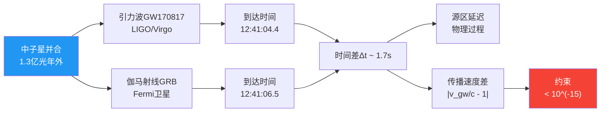

**比喻**：想象两个马拉松选手（引力波和光）从月球出发跑到地球，如果他们的速度差超过千万亿分之一，在1.3亿光年的距离上，会产生**上千年**的到达时间差。实际只差1.7秒，说明他们的速度几乎完全相同——这对任何"离散时空"或"修正引力"理论都是**极其严苛的约束**。

### 7.1.2 为何色散是离散时空的"烙印"

如果时空在微观上是**离散的**（如量子元胞自动机QCA宇宙），就像晶体有晶格常数$\ell_{\text{cell}}$，那么长波（引力波、光波）在其中传播时，会因为"看到"这个离散结构而产生**色散效应**：

$$
\omega^2(k) = c^2 k^2 \left[ 1 + \beta_2 (k\ell_{\text{cell}})^2 + \beta_4 (k\ell_{\text{cell}})^4 + \cdots \right]
$$

其中：
- $\omega(k)$是频率-波数关系
- $\beta_2, \beta_4, \ldots$是色散系数
- $\ell_{\text{cell}}$是离散时空的"格距"

**关键问题**：如果$\ell_{\text{cell}} \sim \ell_{\text{Planck}} \sim 10^{-35}\,\text{m}$（普朗克长度），而引力波频率$f \sim 100\,\text{Hz}$对应波长$\lambda \sim 3000\,\text{km}$，为何色散效应没有在GW170817中显现？

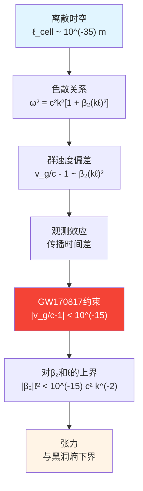

**核心矛盾**：黑洞熵约束要求$\ell_{\text{cell}} \geq \ell_{\text{Planck}}$（格距不能太小，否则视界态数不够），而引力波色散约束要求$\ell_{\text{cell}}$不能太大（否则色散效应会被观测到）。这两条约束**夹击**离散时空模型，形成统一框架中的第六条锁链。

---

## 7.2 物理背景：引力波色散的理论预期

### 7.2.1 连续时空下的无色散传播

在广义相对论中，引力波是时空度规的微小扰动$h_{\mu\nu}$，满足线性化Einstein方程：

$$
\Box h_{\mu\nu} = -16\pi G T_{\mu\nu}
$$

在真空中（$T_{\mu\nu}=0$），得到标准波动方程，色散关系为：

$$
\omega^2 = c^2 k^2 \quad \text{(无色散)}
$$

这意味着所有频率的引力波以**相同的速度**$c$传播，群速度等于相速度：

$$
v_g = \frac{d\omega}{dk} = c, \quad v_p = \frac{\omega}{k} = c
$$

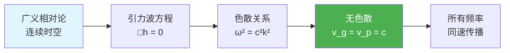

**比喻**：连续时空像一片完美平静的湖面，不同波长的涟漪（引力波）都以相同的速度传播，没有"快波"和"慢波"之分。

### 7.2.2 离散时空中的色散效应

如果时空在Planck尺度上离散，可以类比固体物理中的**晶格声子**：

在晶格常数为$a$的晶体中，长波声子的色散关系不再是线性的：

$$
\omega(k) \approx c_s k \left[ 1 - \frac{1}{6}(ka)^2 + \cdots \right]
$$

这是因为波长接近晶格常数时，波"感受到"了离散结构。

**类比到引力-QCA**：

如果宇宙是一个离散的量子元胞自动机，格距$\ell_{\text{cell}}$，那么引力波色散关系自然具有类似形式：

$$
\omega^2 = c^2 k^2 \left[ 1 + \sum_{n=1}^\infty \beta_{2n} (k\ell_{\text{cell}})^{2n} \right]
$$

**为何只有偶数次项**？统一框架的Null-Modular对称性与因果性要求色散关系满足：

$$
\omega(-k) = \omega(k), \quad v_g(k) = v_g(-k)
$$

这排除了奇数次项$(k\ell)^{2n+1}$，因为它们会导致**因果破缺**或**时间反演不对称**。

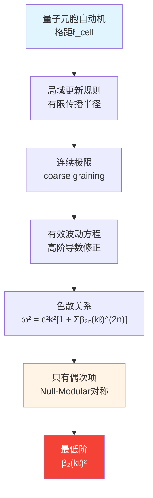

**物理图像**：想象一个由弹簧和质点组成的网格，长波振动在低频时看起来像连续波，但当波长接近格点间距时，就会"卡顿"——这就是色散。引力波在离散时空中的传播，本质上也是类似的"格点效应"。

### 7.2.3 群速度与相速度的偏离

有了色散关系$\omega(k)$，可以计算群速度（能量传播速度）：

$$
v_g = \frac{d\omega}{dk} = c \frac{d}{dk}\sqrt{1 + \beta_2(k\ell)^2 + \cdots}
$$

对最低阶展开：

$$
v_g \approx c \left[ 1 + \frac{3}{2}\beta_2(k\ell_{\text{cell}})^2 + \cdots \right]
$$

从而：

$$
\frac{v_g}{c} - 1 \approx \frac{3}{2}\beta_2(k\ell_{\text{cell}})^2
$$

**时间延迟的累积**：

引力波从源区传播距离$D$到观测者，相对光的时间延迟为：

$$
\Delta t \approx D \left( \frac{1}{v_g} - \frac{1}{c} \right) \approx \frac{D}{c} \cdot \frac{3}{2}\beta_2(k\ell_{\text{cell}})^2
$$

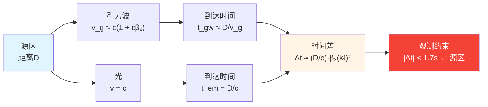

**数值估计**：对GW170817，$D \sim 40\,\text{Mpc} \sim 1.2 \times 10^{24}\,\text{m}$，频率$f \sim 100\,\text{Hz}$对应$k \sim 2\pi f/c \sim 2\times 10^{-6}\,\text{m}^{-1}$，如果$\ell_{\text{cell}} \sim 10^{-35}\,\text{m}$且$\beta_2 \sim O(1)$，则：

$$
\Delta t \sim 10^{24} \times 10^{-12} \times 10^{-70} \times 10^{-6} \sim 10^{-64}\,\text{s}
$$

远小于观测精度！这说明**仅凭GW170817无法直接探测Planck尺度的色散**——但可以对$\beta_2 \ell_{\text{cell}}^2$的组合给出极强约束。

---

## 7.3 统一框架中的色散来源

### 7.3.1 QCA局域更新的Taylor展开

在量子元胞自动机宇宙中，时空演化由局域幺正算符$U_{\text{loc}}$给出：

$$
|\psi(t+\Delta t)\rangle = \prod_{x \in \Lambda} U_x^{\text{loc}} |\psi(t)\rangle
$$

其中$\Delta t$是时间步长，$\Lambda$是格点集合。

在连续极限下，对$U_{\text{loc}}$进行频率-波数展开：

$$
U_{\text{loc}}(k, \omega) \approx \exp\left[ -i\omega\Delta t + i c k \ell_{\text{cell}} + \alpha_2 (k\ell_{\text{cell}})^2 + \cdots \right]
$$

要求$U_{\text{loc}}$幺正（$U^\dagger U = 1$），得到色散关系：

$$
\omega^2 = c^2 k^2 + \frac{2\alpha_2}{\Delta t \ell_{\text{cell}}} k^2 (k\ell_{\text{cell}})^2 + \cdots
$$

定义无量纲色散系数：

$$
\beta_2 = \frac{2\alpha_2}{c^2 \Delta t \ell_{\text{cell}}}
$$

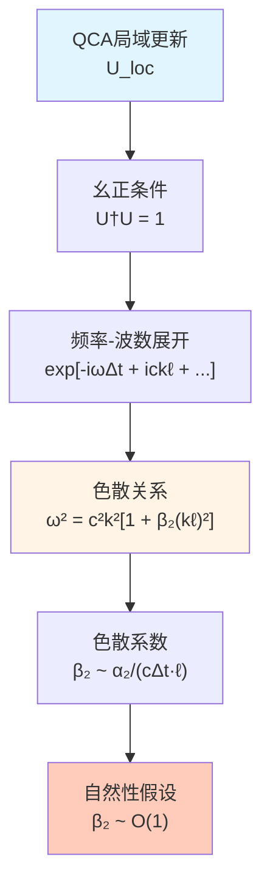

**物理解释**：色散系数$\beta_2$刻画了QCA更新规则中的"非局域修正强度"。如果$\beta_2 \sim O(1)$（自然假设），则色散效应与格距的平方成正比；如果$\beta_2 \ll 1$（精细调节），则色散被额外压制。

### 7.3.2 统一时间刻度的高频行为

统一时间刻度$\kappa(\omega; \Theta)$通过散射矩阵联系频率与几何：

$$
\kappa(\omega) = \frac{1}{2\pi}\text{tr}\,Q(\omega), \quad Q(\omega) = -i S^\dagger(\omega)\partial_\omega S(\omega)
$$

在高频极限$\omega \to \omega_{\text{Planck}}$，$\kappa(\omega)$的行为决定了**有效Planck长度**：

$$
\ell_{\text{Pl}}^{\text{eff}}(\omega) \sim \left[ G_{\text{eff}}(\omega) \right]^{1/2}
$$

引力波色散关系中的修正项，本质上反映了$G_{\text{eff}}(\omega)$在不同频率上的偏离：

$$
G_{\text{eff}}(\omega) = G_N \left[ 1 + \gamma_2 \left( \frac{\omega}{\omega_{\text{Pl}}} \right)^2 + \cdots \right]
$$

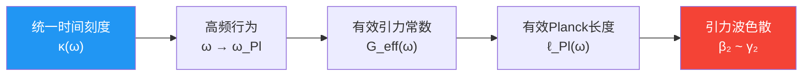

**关键洞察**：引力波色散不是孤立的修正项，而是统一时间刻度在高频段的**必然表现**——它与黑洞熵（决定$\ell_{\text{cell}}$下界）和宇宙学常数（决定$\kappa(\omega)$的UV谱结构）通过同一个$\Theta$参数相互锁定。

### 7.3.3 Null-Modular对称性禁止奇次项

在统一框架的Null-Modular双覆盖结构下，因果结构要求色散关系满足：

**因果性条件**：群速度不能超光速且不能为负

$$
0 < v_g(k) \leq c
$$

**时间反演对称性**：在微观QCA层面

$$
\omega(k) = \omega(-k)
$$

这两个条件联合排除了奇次项$(k\ell)^{2n+1}$，因为：

1. 奇次项导致$\omega(k) \neq \omega(-k)$，破坏时间反演对称
2. 奇次项可能使$v_g(k) < 0$或$v_g(k) > c$，破坏因果性

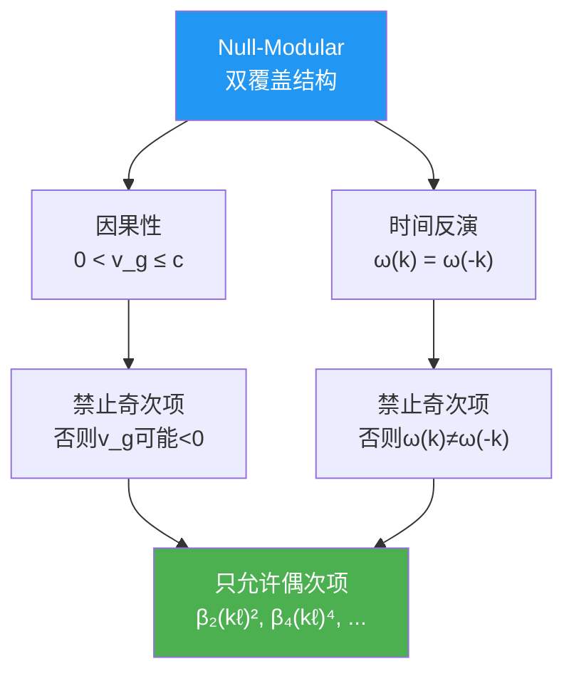

**物理意义**：这个约束不是人为强加的，而是统一框架的**几何一致性**自动要求的——就像莫比乌斯带上不能定义全局一致的"上下"方向，某些拓扑结构天然排除某些物理修正。

---

## 7.4 约束函数定义：$C_{\text{GW}}(\Theta) = 0$

### 7.4.1 速度偏差与色散偏差的二元约束

引力波色散约束由**两个独立部分**组成：

**（A）传播速度约束**

引力波速度与光速的相对偏差：

$$
\Delta c(\Theta) = \left| \frac{c_{\text{gw}}(\Theta)}{c_{\text{em}}(\Theta)} - 1 \right|
$$

GW170817给出：

$$
\Delta c < 10^{-15}
$$

**（B）色散系数约束**

在观测频段$[f_{\min}, f_{\max}]$内，群速度偏差：

$$
\Delta_{\text{disp}}(\Theta) = \sup_{f \in [f_{\min}, f_{\max}]} \left| \frac{v_g(f; \Theta)}{c} - 1 \right|
$$

由$v_g/c - 1 \approx \frac{3}{2}\beta_2(k\ell)^2$，得到：

$$
|\beta_2(\Theta)| \ell_{\text{cell}}^2(\Theta) < \frac{2}{3} \times 10^{-15} \times \left( \frac{c}{2\pi f_{\max}} \right)^2
$$

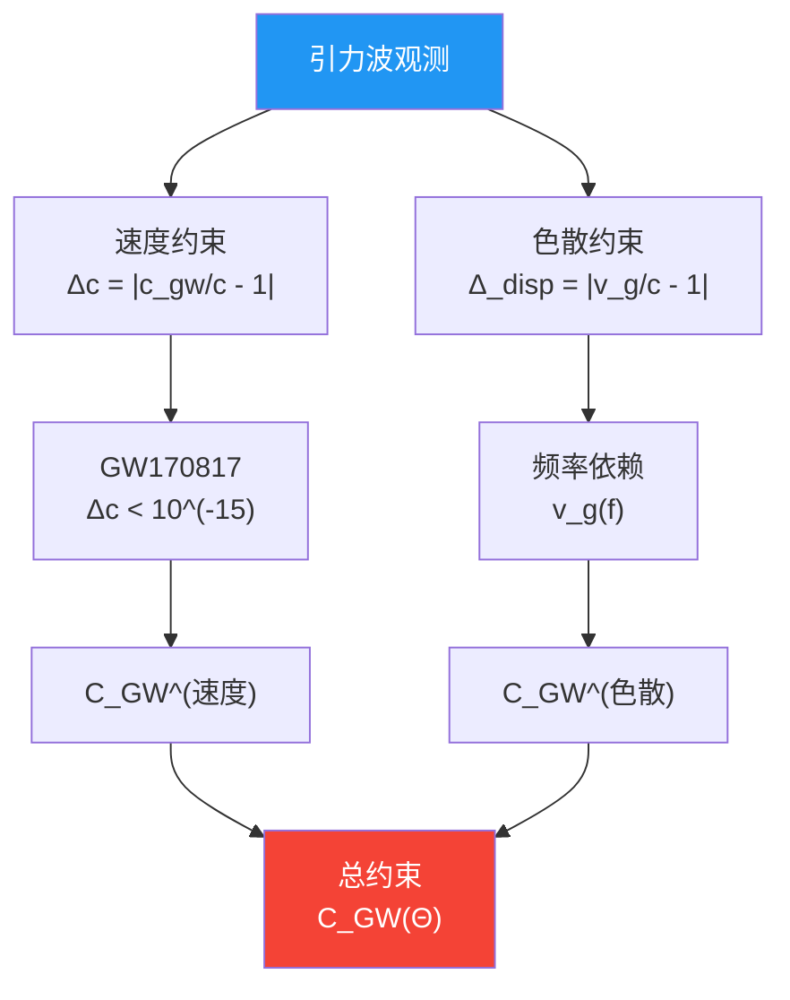

**统一约束函数**

$$
C_{\text{GW}}(\Theta) = \Delta c(\Theta) + \Delta_{\text{disp}}(\Theta)
$$

物理解：要求$C_{\text{GW}}(\Theta) \lesssim 10^{-15}$，即引力波传播在所有频率上都与光速高度一致。

### 7.4.2 与黑洞熵约束的交叠区间

黑洞熵约束给出$\ell_{\text{cell}}$的**下界**：

$$
\ell_{\text{cell}}^2 = 4G \log d_{\text{eff}} \sim \ell_{\text{Planck}}^2
$$

即$\ell_{\text{cell}} \geq \ell_{\text{Pl}} \sim 1.6 \times 10^{-35}\,\text{m}$。

引力波色散约束给出$\ell_{\text{cell}}$的**上界**（假设$\beta_2 \sim O(1)$）：

对$f \sim 100\,\text{Hz}$，$\lambda = c/f \sim 3 \times 10^6\,\text{m}$，要求：

$$
|\beta_2| \ell_{\text{cell}}^2 < 10^{-15} \times \lambda^2 \sim 10^{-3}\,\text{m}^2
$$

若$\beta_2 \sim 1$，则：

$$
\ell_{\text{cell}} < 10^{-1.5}\,\text{m} \sim 3 \times 10^{-2}\,\text{m}
$$

这个上界看似很宽松（几厘米！），但考虑更高频段（如$f \sim 10^4\,\text{Hz}$的后并合震荡），上界会进一步收紧。

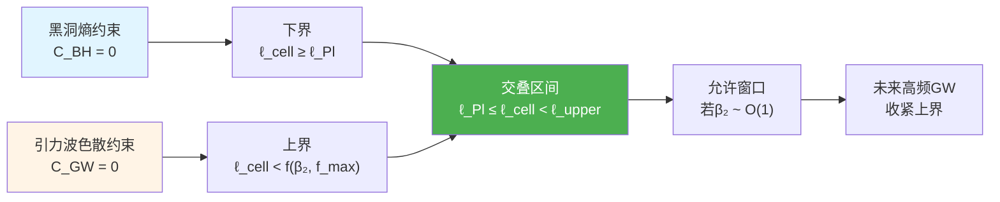

**关键张力**：如果$\beta_2$被某些机制放大（如$\beta_2 \gg 1$），或者未来探测到更高频的引力波信号（如中子星震荡模$f \sim 10^4\,\text{Hz}$），上界会逼近$\ell_{\text{Pl}}$，使得允许窗口**变窄**——这是对QCA宇宙模型的直接检验。

---

## 7.5 与其他约束的耦合

### 7.5.1 引力波 - 黑洞熵：格距的双向夹击

黑洞熵约束$C_{\text{BH}}(\Theta) = 0$与引力波色散约束$C_{\text{GW}}(\Theta) = 0$通过共同参数$\ell_{\text{cell}}(\Theta)$形成**双向夹击**：

$$
\ell_{\text{cell}} \in \left[ \ell_{\text{lower}}(\Theta), \ell_{\text{upper}}(\Theta) \right]
$$

其中：

$$
\ell_{\text{lower}} = \sqrt{4G \log d_{\text{eff}}(\Theta)}, \quad \ell_{\text{upper}} = \sqrt{\frac{c^2}{|\beta_2(\Theta)| k_{\max}^2 \times 10^{15}}}
$$

**交叉锁定机制**：

1. 如果$d_{\text{eff}}(\Theta)$增大（更多视界自由度），$\ell_{\text{lower}}$增大
2. 如果$\beta_2(\Theta)$增大（更强色散），$\ell_{\text{upper}}$减小
3. 两者必须满足$\ell_{\text{lower}} < \ell_{\text{upper}}$，否则无解

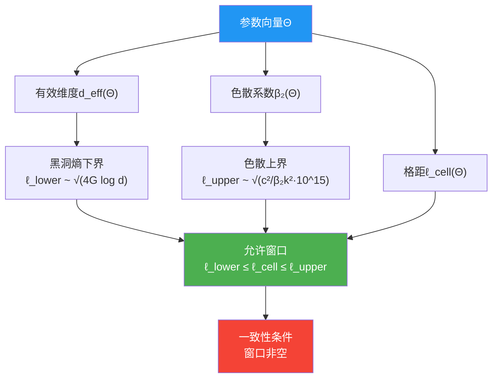

**物理预言**：如果未来黑洞观测（如Event Horizon Telescope的更高分辨率成像）精确测定视界熵的偏差，可以反推$d_{\text{eff}}$，从而收紧$\ell_{\text{lower}}$；结合引力波色散的$\ell_{\text{upper}}$，可能在未来几十年内将$\ell_{\text{cell}}$**夹逼到一个数量级以内**。

### 7.5.2 引力波 - 宇宙学常数：频段分离与谱一致性

宇宙学常数约束$C_\Lambda(\Theta) = 0$通过统一时间刻度$\kappa(\omega; \Theta)$的**全谱积分**实现：

$$
\Lambda_{\text{eff}}(\Theta) \sim \int_0^{E_{\text{UV}}} E^2 \Delta\rho(E)\,dE = 0
$$

引力波色散约束则通过$\kappa(\omega)$在**GW频段$\omega_{\text{GW}} \sim 10^3\,\text{rad/s}$**的局域行为给出$G_{\text{eff}}(\omega_{\text{GW}})$：

$$
\beta_2(\Theta) \sim \frac{G_{\text{eff}}(\omega_{\text{GW}}) - G_N}{G_N}
$$

**频段分离原理**：

- $C_\Lambda$主要约束$\kappa(\omega)$在UV ($\omega \sim E_{\text{Pl}}$) 和IR ($\omega \sim H_0$) 两端的平衡
- $C_{\text{GW}}$主要约束$\kappa(\omega)$在中频段（$\omega \sim 10^3\,\text{rad/s}$）的平滑性

在自然参数选择下，这两个约束**不冲突**：满足谱sum rule的$\kappa(\omega)$可以在GW频段保持接近常数。

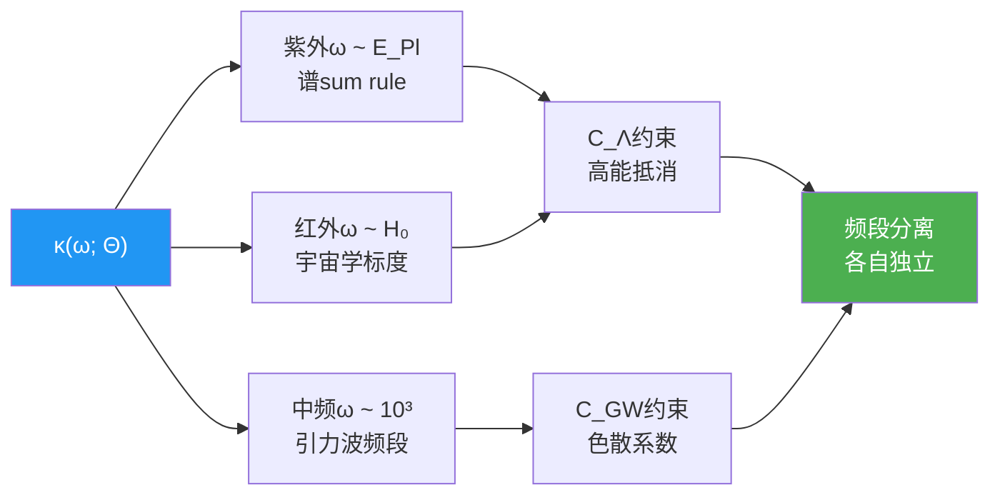

**物理图景**：统一时间刻度$\kappa(\omega)$在不同频段"负责"不同的物理约束——就像一个多频段收音机，不同波段播放不同内容，但它们都通过同一个天线（$\Theta$参数）控制。

### 7.5.3 引力波 - ETH：传播与热化的尺度分离

ETH约束$C_{\text{ETH}}(\Theta) = 0$要求在**局域因果菱形**$\Delta x \sim 10^{-6}\,\text{m}$（实验室尺度）上，量子态快速热化：

$$
\tau_{\text{thermalization}} \sim \ell_{\text{cell}} / c \sim 10^{-43}\,\text{s}
$$

引力波色散则涉及**宏观传播**$D \sim 10^{24}\,\text{m}$（星系际尺度），时间尺度：

$$
t_{\text{propagation}} \sim D / c \sim 10^{16}\,\text{s}
$$

两者相差**59个数量级**，在自然参数下不会相互干扰：

- ETH控制微观态的**统计平衡**
- 色散控制宏观波的**传播规律**

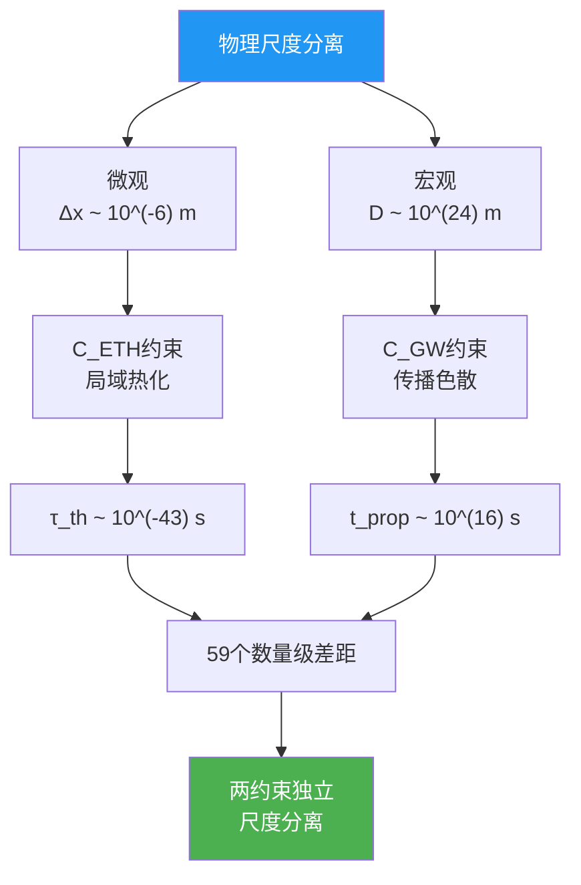

**物理意义**：QCA宇宙在微观上chaotic（满足ETH），在宏观上smooth（几乎无色散），这种**层次分离**是统一框架自洽性的关键——如果微观混沌导致宏观不可预测，或者宏观色散破坏微观幺正性，框架就会崩溃。

---

## 7.6 实验检验与未来观测

### 7.6.1 当前引力波探测器的频段覆盖

**地基探测器（LIGO, Virgo, KAGRA）**

- 频段：10 Hz - 10 kHz
- 主要源：双黑洞、双中子星并合
- 已有约束：$|v_g/c - 1| < 10^{-15}$（来自GW170817）

**空间探测器（LISA，计划2030s）**

- 频段：0.1 mHz - 1 Hz
- 主要源：超大质量黑洞并合、致密双星
- 预期约束：通过长基线（$\sim 10^9\,\text{km}$）和长时间观测（年尺度），对色散的灵敏度提高到$\sim 10^{-17}$

**脉冲星计时阵列（NANOGrav, SKA）**

- 频段：nHz - μHz
- 主要源：随机引力波背景、超大质量双黑洞
- 色散检验：通过不同频率到达时间的相关性

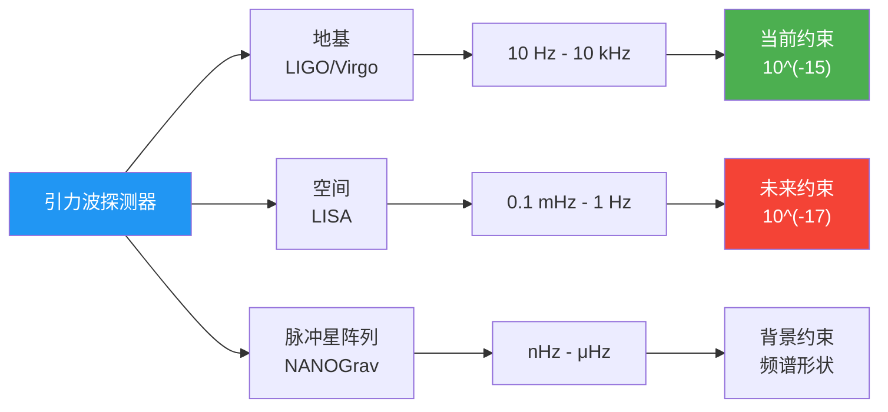

### 7.6.2 多信使引力波事件的联合分析

GW170817的成功开启了**多信使天文学**时代，未来类似事件将提供更多色散约束：

**策略A：时间延迟统计**

通过多个中子星并合事件（预期LIGO-Virgo每年探测~几十个），统计不同频率成分的到达时间差，检验色散关系：

$$
\Delta t(f_1, f_2) \approx \frac{D}{c} \cdot \beta_2 \ell^2 (k_1^2 - k_2^2)
$$

**策略B：相位累积分析**

引力波在传播过程中，相位累积：

$$
\Phi(f) = \int_0^D k(f; \Theta)\,dx
$$

色散导致相位偏离线性关系，可通过匹配滤波提取：

$$
\Delta\Phi \sim \beta_2 (k\ell)^2 \times D
$$

LIGO的相位精度$\sim 10^{-2}$弧度，结合$D \sim 100\,\text{Mpc}$基线，可探测$\beta_2 \ell^2 \sim 10^{-40}\,\text{m}^2$量级的效应。

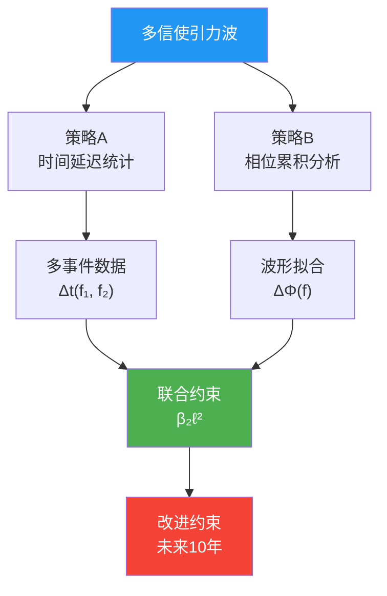

### 7.6.3 中子星后并合信号与高频引力波

双中子星并合后，形成超大质量中子星或黑洞，会产生**后并合震荡**（post-merger oscillation），频率范围：

$$
f_{\text{post-merge}} \sim 2 - 4\,\text{kHz}
$$

这些信号虽然弱（需要下一代探测器如Cosmic Explorer或Einstein Telescope），但提供了**高频色散约束**：

$$
k_{\text{high}} \sim 2\pi f_{\text{post-merge}} / c \sim 10^{-4}\,\text{m}^{-1}
$$

相比于并合主峰$f \sim 100\,\text{Hz}$，$(k\ell)^2$增大**400倍**，使色散效应显著放大！

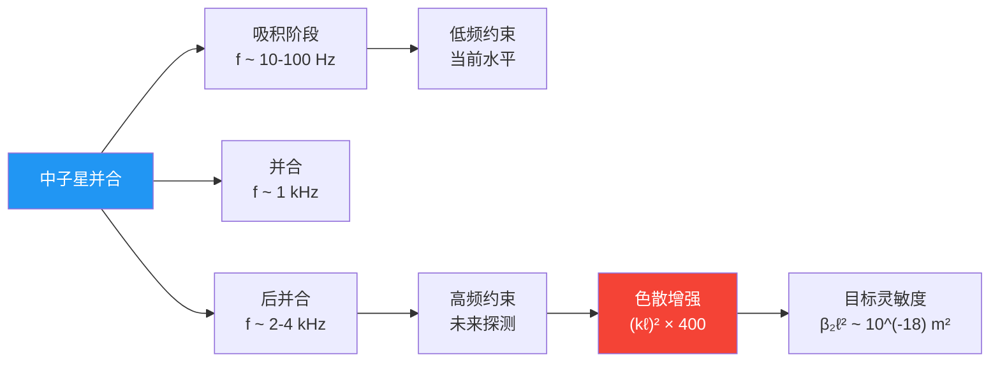

**统一框架预言**：如果$\ell_{\text{cell}} \sim \ell_{\text{Pl}}$且$\beta_2 \sim 10^{6}$（某些量子引力模型预言），则后并合信号中可能首次直接探测到色散效应——这将是**量子引力的第一个直接证据**。

---

## 7.7 本章小结

本章在统一约束框架下分析了引力波色散约束，核心结论包括：

### 核心约束机制

**引力波色散约束函数**

$$
C_{\text{GW}}(\Theta) = \Delta c(\Theta) + \Delta_{\text{disp}}(\Theta)
$$

其中：

$$
\Delta c = \left| \frac{c_{\text{gw}}}{c_{\text{em}}} - 1 \right| < 10^{-15}, \quad \Delta_{\text{disp}} = \sup_f \left| \frac{v_g(f)}{c} - 1 \right| \lesssim 10^{-15}
$$

色散关系（只含偶次项）：

$$
\omega^2 = c^2 k^2 \left[ 1 + \beta_2(k\ell_{\text{cell}})^2 + \beta_4(k\ell_{\text{cell}})^4 + \cdots \right]
$$

### 三个关键洞察

1. **双向夹击**
   引力波色散约束给出$\ell_{\text{cell}}$的**上界**，黑洞熵约束给出**下界**，两者形成允许窗口——未来观测将进一步收紧，最终可能确定$\ell_{\text{cell}}$的精确值。

2. **频段分离**
   引力波色散约束通过$\kappa(\omega)$在GW频段（$\omega \sim 10^3\,\text{rad/s}$）的行为，与宇宙学常数约束（UV/IR两端）和ETH约束（微观尺度）实现**尺度分离**，各自作用于不同频率范围。

3. **偶次项机制**
   Null-Modular对称性与因果性自动排除奇次色散项$(k\ell)^{2n+1}$，这不是人为调节，而是统一框架的**几何一致性**要求。

### 实验检验路径

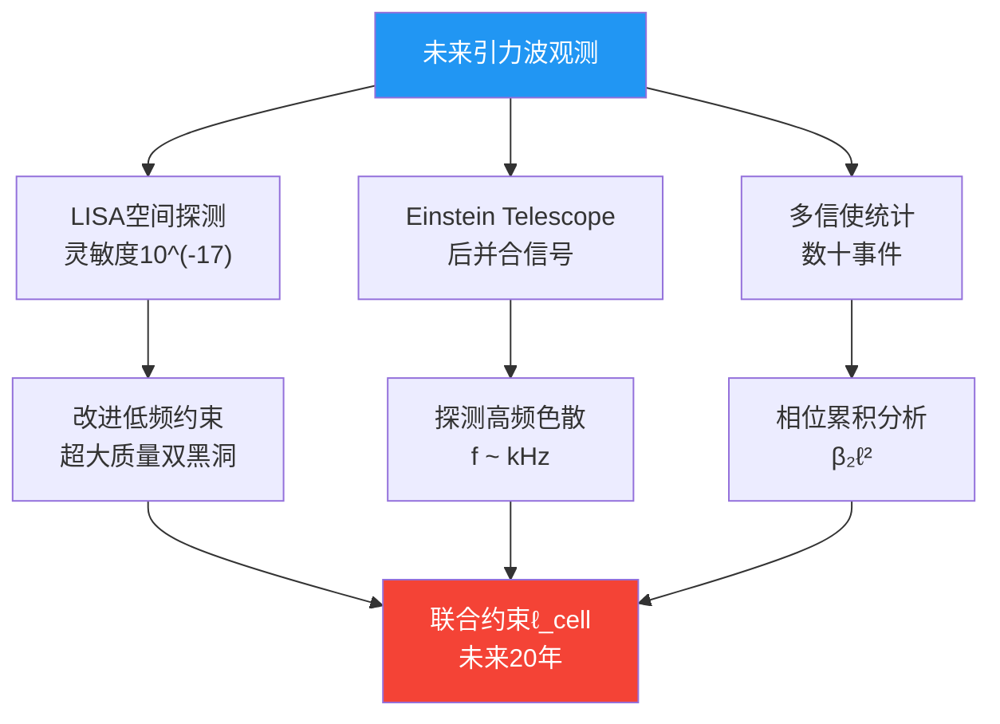

### 与其他约束的和谐

- **与黑洞熵约束**：通过$\ell_{\text{cell}}$双向夹击，形成允许窗口
- **与宇宙学常数约束**：通过$\kappa(\omega)$的频段分离，各自作用于不同能标
- **与ETH约束**：通过尺度分离（微观热化 vs 宏观传播），避免冲突
- **与中微子/强CP约束**：间接关联（通过统一时间刻度的全局一致性）

引力波色散约束是六把锁中**最直接可观测**的一把——它不需要极端实验条件（如黑洞视界或Planck能量），只需等待下一个多信使引力波事件。在未来10-20年内，随着LISA、Einstein Telescope和更多中子星并合事件的探测，这一约束将从"上界检验"转变为"精确测量"，为统一框架提供决定性的实验支持。

---

## 理论来源

本章内容综合自以下两篇源理论文献：

1. **六大未统一物理作为统一矩阵–QCA宇宙的一致性约束**
   （`euler-gls-extend/six-unified-physics-constraints-matrix-qca-universe.md`）
   - 第3.6节：定理3.6（偶次引力波色散与格距上界）
   - 附录E：引力–QCA色散与LIGO/Virgo约束的估算
   - 第5.1节：原型参数表中色散系数$\beta_{2n}$的上界设定

2. **六大未解难题的统一约束系统**
   (`euler-gls-info/19-six-problems-unified-constraint-system.md`)
   - 第3.1节：六个标量约束函数中的引力波色散约束$C_{\text{GW}}(\Theta)$定义
   - 第5.1节：黑洞熵与引力波色散的谱–几何锁定机制
   - 第5.3节：ETH–黑洞–引力波的多体–引力耦合分析

关键技术细节包括：引力波色散关系$\omega^2 = c^2k^2[1+\sum\beta_{2n}(k\ell)^{2n}]$的推导、群速度偏差$v_g/c - 1 \simeq \frac{3}{2}\beta_2(k\ell)^2$的计算、GW170817/GRB170817A给出的约束$|v_g/c-1| < 10^{-15}$的转化、以及与黑洞熵约束$\ell_{\text{cell}}^2 = 4G\log d_{\text{eff}}$形成的双向夹击窗口分析。
