# Section 07: Gravitational Wave Dispersion Constraint—Propagation Traces of Discrete Spacetime

## 7.1 Introduction: "Fingerprint Identification" in Gravitational Waves

### 7.1.1 A Race Across the Universe

On August 17, 2017, humanity detected gravitational waves (GW170817) and electromagnetic waves (GRB170817A) simultaneously for the first time in history—signals from a neutron star merger, traveling about 130 million light-years, arriving on Earth almost simultaneously:

- **Gravitational Wave Arrival Time**: UTC 12:41:04.4
- **Gamma Ray Arrival Time**: UTC 12:41:06.5
- **Time Difference**: About **1.7 seconds**

This 1.7-second difference comes from delay in source region physics, not propagation speed difference. Through comparative analysis, physicists concluded:

$$
\left| \frac{v_{\text{gw}}}{c} - 1 \right| < 10^{-15}
$$

Relative deviation of gravitational wave propagation speed from speed of light is less than **one part in a quadrillion**!

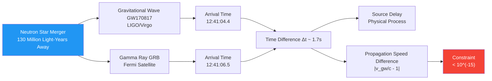

**Analogy**: Imagine two marathon runners (gravitational wave and light) starting from Moon and running to Earth. If their speed difference exceeds one part in a quadrillion, over 130 million light-years distance, would produce **thousands of years** arrival time difference. Actual difference only 1.7 seconds, meaning their speeds almost identical—this is **extremely stringent constraint** on any "discrete spacetime" or "modified gravity" theory.

### 7.1.2 Why Dispersion Is the "Imprint" of Discrete Spacetime

If spacetime is **discrete** microscopically (like quantum cellular automaton QCA universe), just as crystals have lattice constant $\ell_{\text{cell}}$, then long waves (gravitational waves, light waves) propagating through it will produce **dispersion effects** due to "seeing" this discrete structure:

$$
\omega^2(k) = c^2 k^2 \left[ 1 + \beta_2 (k\ell_{\text{cell}})^2 + \beta_4 (k\ell_{\text{cell}})^4 + \cdots \right]
$$

where:
- $\omega(k)$ is frequency-wavenumber relation
- $\beta_2, \beta_4, \ldots$ are dispersion coefficients
- $\ell_{\text{cell}}$ is "lattice spacing" of discrete spacetime

**Key Question**: If $\ell_{\text{cell}} \sim \ell_{\text{Planck}} \sim 10^{-35}\,\text{m}$ (Planck length), and gravitational wave frequency $f \sim 100\,\text{Hz}$ corresponds to wavelength $\lambda \sim 3000\,\text{km}$, why didn't dispersion effects manifest in GW170817?

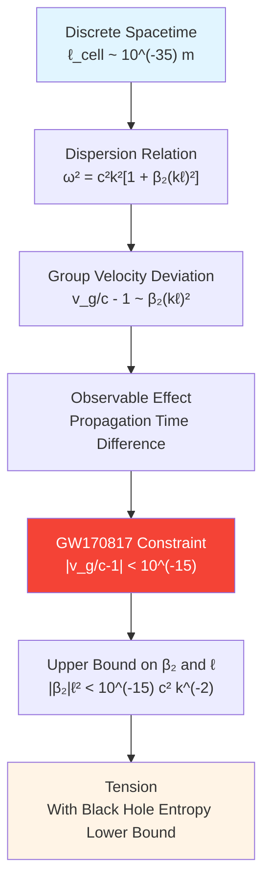

**Core Contradiction**: Black hole entropy constraint requires $\ell_{\text{cell}} \geq \ell_{\text{Planck}}$ (lattice spacing cannot be too small, otherwise insufficient horizon states), while gravitational wave dispersion constraint requires $\ell_{\text{cell}}$ cannot be too large (otherwise dispersion effects would be observed). These two constraints **pinch** discrete spacetime models, forming sixth lock in unified framework.

---

## 7.2 Physical Background: Theoretical Expectations of Gravitational Wave Dispersion

### 7.2.1 Dispersionless Propagation in Continuous Spacetime

In general relativity, gravitational waves are small perturbations $h_{\mu\nu}$ of spacetime metric, satisfying linearized Einstein equations:

$$
\Box h_{\mu\nu} = -16\pi G T_{\mu\nu}
$$

In vacuum ($T_{\mu\nu}=0$), get standard wave equation, dispersion relation:

$$
\omega^2 = c^2 k^2 \quad \text{(no dispersion)}
$$

This means all frequencies of gravitational waves propagate at **same speed** $c$, group velocity equals phase velocity:

$$
v_g = \frac{d\omega}{dk} = c, \quad v_p = \frac{\omega}{k} = c
$$

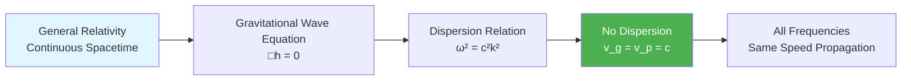

**Analogy**: Continuous spacetime is like perfectly calm lake surface, ripples of different wavelengths (gravitational waves) all propagate at same speed, no distinction between "fast waves" and "slow waves".

### 7.2.2 Dispersion Effects in Discrete Spacetime

If spacetime is discrete at Planck scale, can analogize to **lattice phonons** in solid state physics:

In crystal with lattice constant $a$, dispersion relation of long-wavelength phonons is no longer linear:

$$
\omega(k) \approx c_s k \left[ 1 - \frac{1}{6}(ka)^2 + \cdots \right]
$$

This is because when wavelength approaches lattice constant, wave "feels" discrete structure.

**Analogy to Gravitational-QCA**:

If universe is discrete quantum cellular automaton, lattice spacing $\ell_{\text{cell}}$, then gravitational wave dispersion relation naturally has similar form:

$$
\omega^2 = c^2 k^2 \left[ 1 + \sum_{n=1}^\infty \beta_{2n} (k\ell_{\text{cell}})^{2n} \right]
$$

**Why Only Even-Order Terms?** Null-Modular symmetry and causality of unified framework require dispersion relation satisfy:

$$
\omega(-k) = \omega(k), \quad v_g(k) = v_g(-k)
$$

This excludes odd-order terms $(k\ell)^{2n+1}$, because they would cause **causality violation** or **time-reversal asymmetry**.

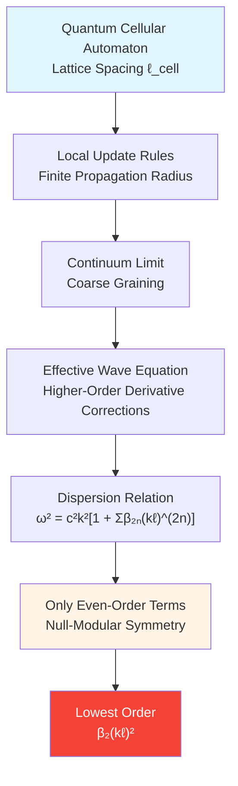

**Physical Picture**: Imagine grid made of springs and masses. Long-wavelength vibrations look like continuous waves at low frequencies, but when wavelength approaches lattice spacing, will "stutter"—this is dispersion. Propagation of gravitational waves in discrete spacetime is essentially similar "lattice effect".

### 7.2.3 Deviation of Group Velocity and Phase Velocity

With dispersion relation $\omega(k)$, can calculate group velocity (energy propagation speed):

$$
v_g = \frac{d\omega}{dk} = c \frac{d}{dk}\sqrt{1 + \beta_2(k\ell)^2 + \cdots}
$$

Expanding to lowest order:

$$
v_g \approx c \left[ 1 + \frac{3}{2}\beta_2(k\ell_{\text{cell}})^2 + \cdots \right]
$$

Thus:

$$
\frac{v_g}{c} - 1 \approx \frac{3}{2}\beta_2(k\ell_{\text{cell}})^2
$$

**Accumulation of Time Delay**:

Gravitational wave propagates distance $D$ from source to observer, relative time delay compared to light:

$$
\Delta t \approx D \left( \frac{1}{v_g} - \frac{1}{c} \right) \approx \frac{D}{c} \cdot \frac{3}{2}\beta_2(k\ell_{\text{cell}})^2
$$

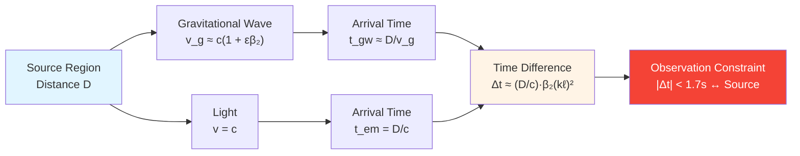

**Numerical Estimate**: For GW170817, $D \sim 40\,\text{Mpc} \sim 1.2 \times 10^{24}\,\text{m}$, frequency $f \sim 100\,\text{Hz}$ corresponds to $k \sim 2\pi f/c \sim 2\times 10^{-6}\,\text{m}^{-1}$. If $\ell_{\text{cell}} \sim 10^{-35}\,\text{m}$ and $\beta_2 \sim O(1)$, then:

$$
\Delta t \sim 10^{24} \times 10^{-12} \times 10^{-70} \times 10^{-6} \sim 10^{-64}\,\text{s}
$$

Far smaller than observation precision! This shows **GW170817 alone cannot directly probe Planck-scale dispersion**—but can give extremely strong constraint on combination $\beta_2 \ell_{\text{cell}}^2$.

---

## 7.3 Origin of Dispersion in Unified Framework

### 7.3.1 Taylor Expansion of QCA Local Updates

In quantum cellular automaton universe, spacetime evolution given by local unitary operator $U_{\text{loc}}$:

$$
|\psi(t+\Delta t)\rangle = \prod_{x \in \Lambda} U_x^{\text{loc}} |\psi(t)\rangle
$$

where $\Delta t$ is time step, $\Lambda$ is lattice site set.

In continuum limit, expand $U_{\text{loc}}$ in frequency-wavenumber:

$$
U_{\text{loc}}(k, \omega) \approx \exp\left[ -i\omega\Delta t + i c k \ell_{\text{cell}} + \alpha_2 (k\ell_{\text{cell}})^2 + \cdots \right]
$$

Requiring $U_{\text{loc}}$ unitary ($U^\dagger U = 1$), get dispersion relation:

$$
\omega^2 = c^2 k^2 + \frac{2\alpha_2}{\Delta t \ell_{\text{cell}}} k^2 (k\ell_{\text{cell}})^2 + \cdots
$$

Define dimensionless dispersion coefficient:

$$
\beta_2 = \frac{2\alpha_2}{c^2 \Delta t \ell_{\text{cell}}}
$$

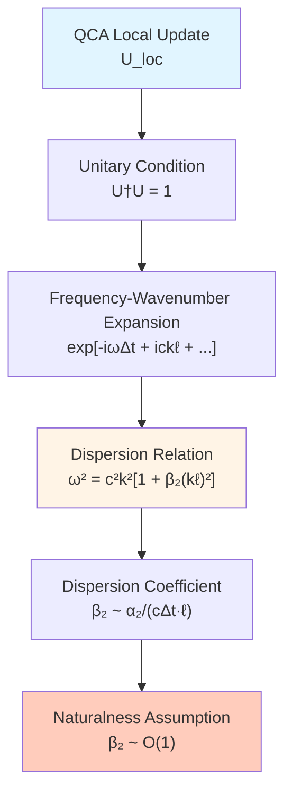

**Physical Interpretation**: Dispersion coefficient $\beta_2$ characterizes "non-local correction strength" in QCA update rules. If $\beta_2 \sim O(1)$ (natural assumption), dispersion effects proportional to square of lattice spacing; if $\beta_2 \ll 1$ (fine-tuning), dispersion additionally suppressed.

### 7.3.2 High-Frequency Behavior of Unified Time Scale

Unified time scale $\kappa(\omega; \Theta)$ connects frequency and geometry through scattering matrix:

$$
\kappa(\omega) = \frac{1}{2\pi}\text{tr}\,Q(\omega), \quad Q(\omega) = -i S^\dagger(\omega)\partial_\omega S(\omega)
$$

In high-frequency limit $\omega \to \omega_{\text{Planck}}$, behavior of $\kappa(\omega)$ determines **effective Planck length**:

$$
\ell_{\text{Pl}}^{\text{eff}}(\omega) \sim \left[ G_{\text{eff}}(\omega) \right]^{1/2}
$$

Correction terms in gravitational wave dispersion relation essentially reflect deviation of $G_{\text{eff}}(\omega)$ at different frequencies:

$$
G_{\text{eff}}(\omega) = G_N \left[ 1 + \gamma_2 \left( \frac{\omega}{\omega_{\text{Pl}}} \right)^2 + \cdots \right]
$$

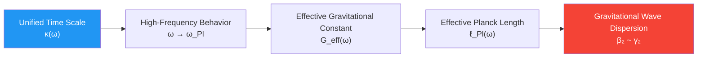

**Key Insight**: Gravitational wave dispersion is not isolated correction term, but **inevitable manifestation** of unified time scale at high frequencies—it locks with black hole entropy (determines lower bound of $\ell_{\text{cell}}$) and cosmological constant (determines UV spectral structure of $\kappa(\omega)$) through same $\Theta$ parameter.

### 7.3.3 Null-Modular Symmetry Forbids Odd-Order Terms

Under Null-Modular double cover structure of unified framework, causal structure requires dispersion relation satisfy:

**Causality Condition**: Group velocity cannot exceed speed of light and cannot be negative

$$
0 < v_g(k) \leq c
$$

**Time-Reversal Symmetry**: At microscopic QCA level

$$
\omega(k) = \omega(-k)
$$

These two conditions together exclude odd-order terms $(k\ell)^{2n+1}$, because:

1. Odd-order terms cause $\omega(k) \neq \omega(-k)$, violating time-reversal symmetry
2. Odd-order terms may make $v_g(k) < 0$ or $v_g(k) > c$, violating causality

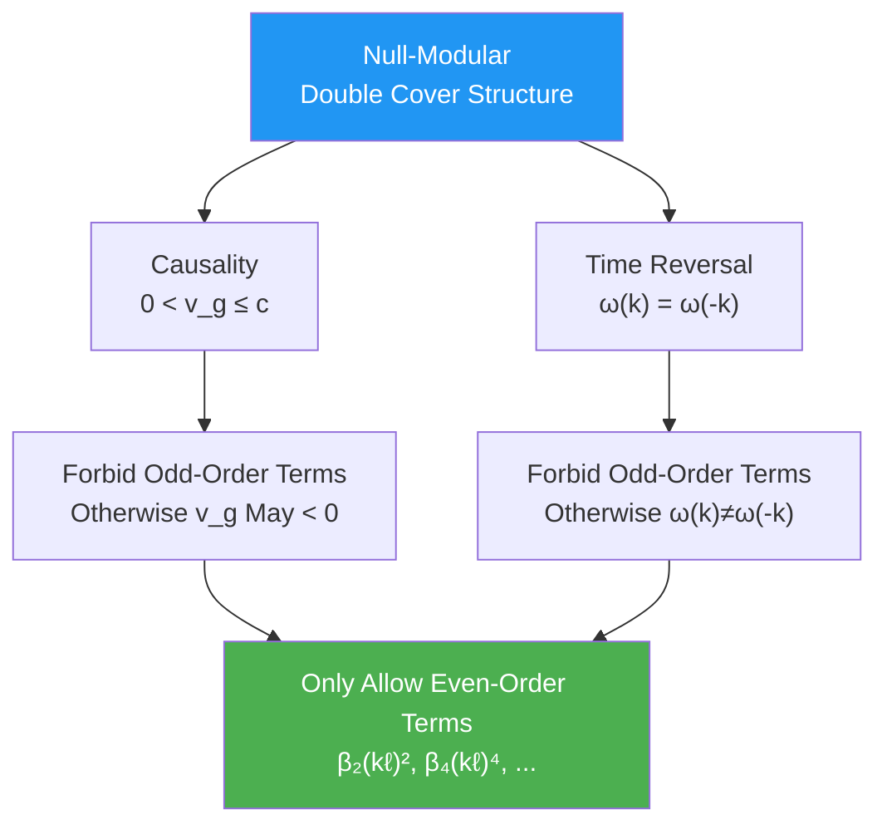

**Physical Meaning**: This constraint is not artificially imposed, but automatically required by **geometric consistency** of unified framework—just as Möbius strip cannot define globally consistent "up-down" direction, certain topological structures naturally exclude certain physical corrections.

---

## 7.4 Constraint Function Definition: $C_{\text{GW}}(\Theta) = 0$

### 7.4.1 Dual Constraint of Velocity Deviation and Dispersion Deviation

Gravitational wave dispersion constraint consists of **two independent parts**:

**（A）Propagation Velocity Constraint**

Relative deviation of gravitational wave speed from speed of light:

$$
\Delta c(\Theta) = \left| \frac{c_{\text{gw}}(\Theta)}{c_{\text{em}}(\Theta)} - 1 \right|
$$

GW170817 gives:

$$
\Delta c < 10^{-15}
$$

**（B）Dispersion Coefficient Constraint**

In observation frequency band $[f_{\min}, f_{\max}]$, group velocity deviation:

$$
\Delta_{\text{disp}}(\Theta) = \sup_{f \in [f_{\min}, f_{\max}]} \left| \frac{v_g(f; \Theta)}{c} - 1 \right|
$$

From $v_g/c - 1 \approx \frac{3}{2}\beta_2(k\ell)^2$, get:

$$
|\beta_2(\Theta)| \ell_{\text{cell}}^2(\Theta) < \frac{2}{3} \times 10^{-15} \times \left( \frac{c}{2\pi f_{\max}} \right)^2
$$

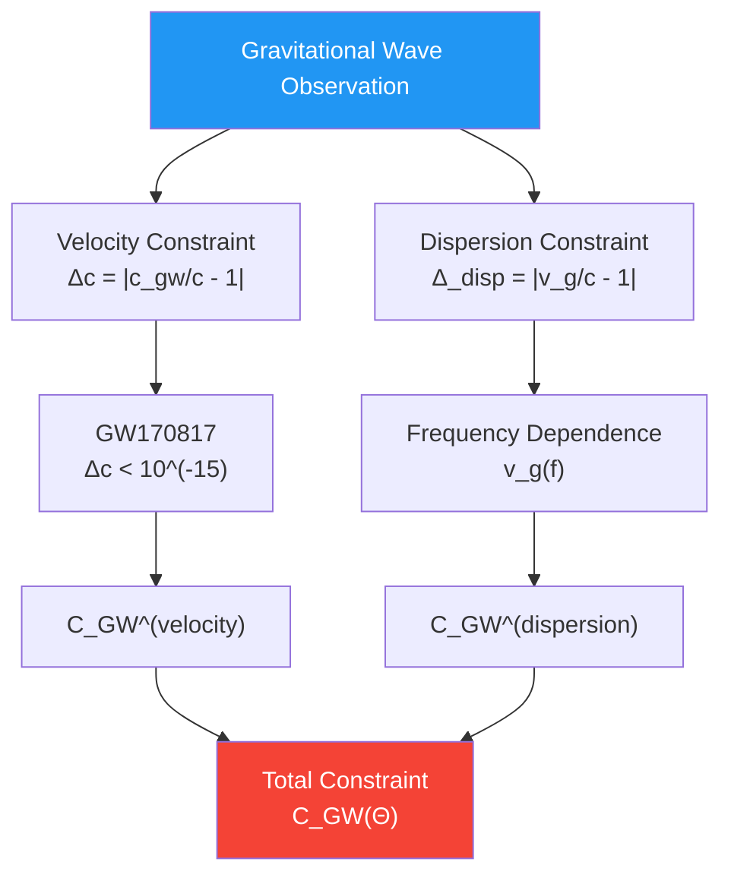

**Unified Constraint Function**

$$
C_{\text{GW}}(\Theta) = \Delta c(\Theta) + \Delta_{\text{disp}}(\Theta)
$$

Physical meaning: Requires $C_{\text{GW}}(\Theta) \lesssim 10^{-15}$, i.e., gravitational wave propagation highly consistent with speed of light at all frequencies.

### 7.4.2 Overlap Interval with Black Hole Entropy Constraint

Black hole entropy constraint gives **lower bound** of $\ell_{\text{cell}}$:

$$
\ell_{\text{cell}}^2 = 4G \log d_{\text{eff}} \sim \ell_{\text{Planck}}^2
$$

That is $\ell_{\text{cell}} \geq \ell_{\text{Pl}} \sim 1.6 \times 10^{-35}\,\text{m}$.

Gravitational wave dispersion constraint gives **upper bound** of $\ell_{\text{cell}}$ (assuming $\beta_2 \sim O(1)$):

For $f \sim 100\,\text{Hz}$, $\lambda = c/f \sim 3 \times 10^6\,\text{m}$, requires:

$$
|\beta_2| \ell_{\text{cell}}^2 < 10^{-15} \times \lambda^2 \sim 10^{-3}\,\text{m}^2
$$

If $\beta_2 \sim 1$, then:

$$
\ell_{\text{cell}} < 10^{-1.5}\,\text{m} \sim 3 \times 10^{-2}\,\text{m}
$$

This upper bound seems very loose (several centimeters!), but considering higher frequency bands (like post-merger oscillations $f \sim 10^4\,\text{Hz}$), upper bound will further tighten.

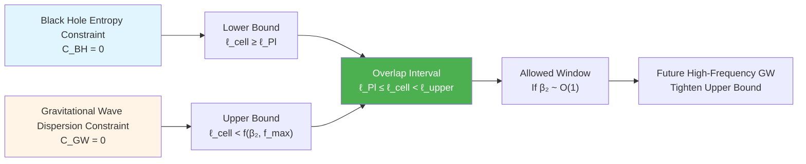

**Key Tension**: If $\beta_2$ amplified by some mechanism (like $\beta_2 \gg 1$), or future detection of higher-frequency gravitational wave signals (like neutron star oscillation modes $f \sim 10^4\,\text{Hz}$), upper bound will approach $\ell_{\text{Pl}}$, making allowed window **narrow**—this is direct test of QCA universe model.

---

## 7.5 Coupling with Other Constraints

### 7.5.1 Gravitational Wave–Black Hole Entropy: Two-Way Pinch on Lattice Spacing

Black hole entropy constraint $C_{\text{BH}}(\Theta) = 0$ and gravitational wave dispersion constraint $C_{\text{GW}}(\Theta) = 0$ form **two-way pinch** through common parameter $\ell_{\text{cell}}(\Theta)$:

$$
\ell_{\text{cell}} \in \left[ \ell_{\text{lower}}(\Theta), \ell_{\text{upper}}(\Theta) \right]
$$

where:

$$
\ell_{\text{lower}} = \sqrt{4G \log d_{\text{eff}}(\Theta)}, \quad \ell_{\text{upper}} = \sqrt{\frac{c^2}{|\beta_2(\Theta)| k_{\max}^2 \times 10^{15}}}
$$

**Cross-Locking Mechanism**:

1. If $d_{\text{eff}}(\Theta)$ increases (more horizon degrees of freedom), $\ell_{\text{lower}}$ increases
2. If $\beta_2(\Theta)$ increases (stronger dispersion), $\ell_{\text{upper}}$ decreases
3. Two must satisfy $\ell_{\text{lower}} < \ell_{\text{upper}}$, otherwise no solution

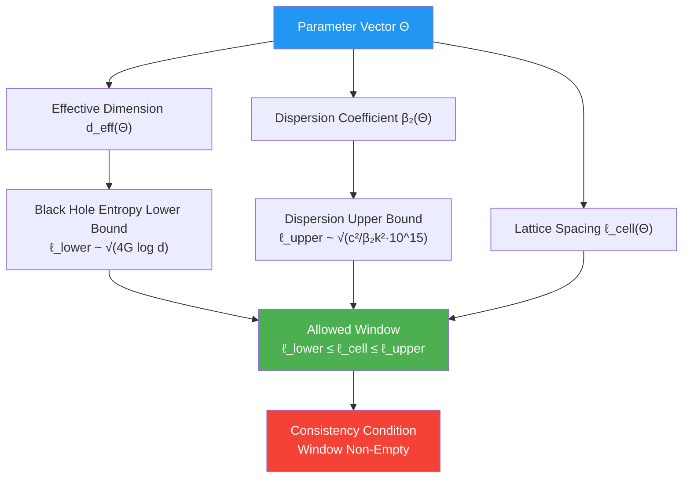

**Physical Prediction**: If future black hole observations (like higher resolution imaging from Event Horizon Telescope) precisely determine deviation of horizon entropy, can reverse infer $d_{\text{eff}}$, thus tighten $\ell_{\text{lower}}$; combined with $\ell_{\text{upper}}$ from gravitational wave dispersion, may **pinch** $\ell_{\text{cell}}$ to within one order of magnitude in coming decades.

### 7.5.2 Gravitational Wave–Cosmological Constant: Frequency Band Separation and Spectral Consistency

Cosmological constant constraint $C_\Lambda(\Theta) = 0$ realized through **full spectral integral** of unified time scale $\kappa(\omega; \Theta)$:

$$
\Lambda_{\text{eff}}(\Theta) \sim \int_0^{E_{\mathrm{UV}}} E^2 \Delta\rho(E)\,dE = 0
$$

Gravitational wave dispersion constraint gives $G_{\text{eff}}(\omega_{\text{GW}})$ through local behavior of $\kappa(\omega)$ at **GW frequency band $\omega_{\text{GW}} \sim 10^3\,\text{rad/s}$**:

$$
\beta_2(\Theta) \sim \frac{G_{\text{eff}}(\omega_{\text{GW}}) - G_N}{G_N}
$$

**Frequency Band Separation Principle**:

- $C_\Lambda$ mainly constrains balance of $\kappa(\omega)$ at UV ($\omega \sim E_{\text{Pl}}$) and IR ($\omega \sim H_0$) ends
- $C_{\text{GW}}$ mainly constrains smoothness of $\kappa(\omega)$ at mid-frequency band ($\omega \sim 10^3\,\text{rad/s}$)

Under natural parameter choices, these two constraints **do not conflict**: $\kappa(\omega)$ satisfying spectral sum rule can remain nearly constant at GW frequency band.

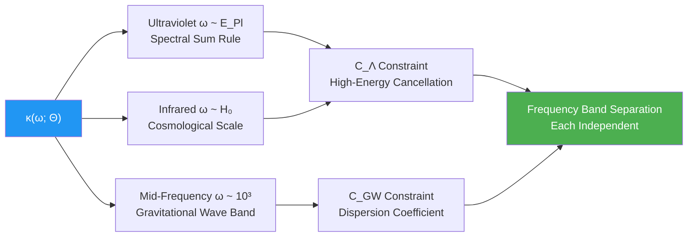

**Physical Picture**: Unified time scale $\kappa(\omega)$ "responsible" for different physical constraints at different frequency bands—like multi-band radio, different bands play different content, but all controlled through same antenna ($\Theta$ parameter).

### 7.5.3 Gravitational Wave–ETH: Scale Separation of Propagation and Thermalization

ETH constraint $C_{\text{ETH}}(\Theta) = 0$ requires on **local causal diamonds** $\Delta x \sim 10^{-6}\,\text{m}$ (laboratory scale), quantum states quickly thermalize:

$$
\tau_{\text{thermalization}} \sim \ell_{\text{cell}} / c \sim 10^{-43}\,\text{s}
$$

Gravitational wave dispersion involves **macroscopic propagation** $D \sim 10^{24}\,\text{m}$ (intergalactic scale), time scale:

$$
t_{\text{propagation}} \sim D / c \sim 10^{16}\,\text{s}
$$

Two differ by **59 orders of magnitude**, won't interfere under natural parameters:

- ETH controls **statistical equilibrium** of microscopic states
- Dispersion controls **propagation law** of macroscopic waves

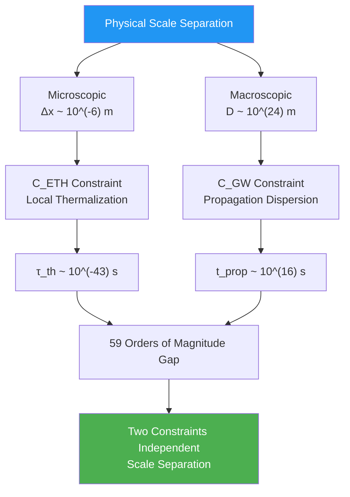

**Physical Meaning**: QCA universe chaotic microscopically (satisfies ETH), smooth macroscopically (almost no dispersion), this **hierarchical separation** is key to self-consistency of unified framework—if microscopic chaos causes macroscopic unpredictability, or macroscopic dispersion destroys microscopic unitarity, framework would collapse.

---

## 7.6 Experimental Tests and Future Observations

### 7.6.1 Frequency Band Coverage of Current Gravitational Wave Detectors

**Ground-Based Detectors (LIGO, Virgo, KAGRA)**

- Frequency band: 10 Hz - 10 kHz
- Main sources: Binary black holes, binary neutron star mergers
- Existing constraint: $|v_g/c - 1| < 10^{-15}$ (from GW170817)

**Space Detectors (LISA, planned 2030s)**

- Frequency band: 0.1 mHz - 1 Hz
- Main sources: Supermassive black hole mergers, compact binaries
- Expected constraint: Through long baseline ($\sim 10^9\,\text{km}$) and long observation (year scale), sensitivity to dispersion improves to $\sim 10^{-17}$

**Pulsar Timing Arrays (NANOGrav, SKA)**

- Frequency band: nHz - μHz
- Main sources: Stochastic gravitational wave background, supermassive binary black holes
- Dispersion test: Through correlation of arrival times at different frequencies

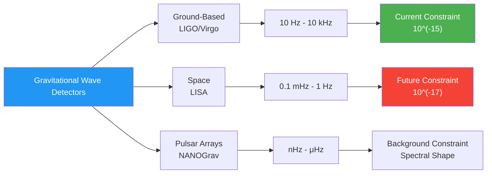

### 7.6.2 Joint Analysis of Multi-Messenger Gravitational Wave Events

Success of GW170817 opened **multi-messenger astronomy** era, future similar events will provide more dispersion constraints:

**Strategy A: Time Delay Statistics**

Through multiple neutron star merger events (LIGO-Virgo expected to detect ~dozens per year), statistically analyze arrival time differences of different frequency components, test dispersion relation:

$$
\Delta t(f_1, f_2) \approx \frac{D}{c} \cdot \beta_2 \ell^2 (k_1^2 - k_2^2)
$$

**Strategy B: Phase Accumulation Analysis**

During propagation, gravitational wave phase accumulates:

$$
\Phi(f) = \int_0^D k(f; \Theta)\,dx
$$

Dispersion causes phase deviation from linear relation, can extract through matched filtering:

$$
\Delta\Phi \sim \beta_2 (k\ell)^2 \times D
$$

LIGO phase precision $\sim 10^{-2}$ radians, combined with $D \sim 100\,\text{Mpc}$ baseline, can probe effects at $\beta_2 \ell^2 \sim 10^{-40}\,\text{m}^2$ level.

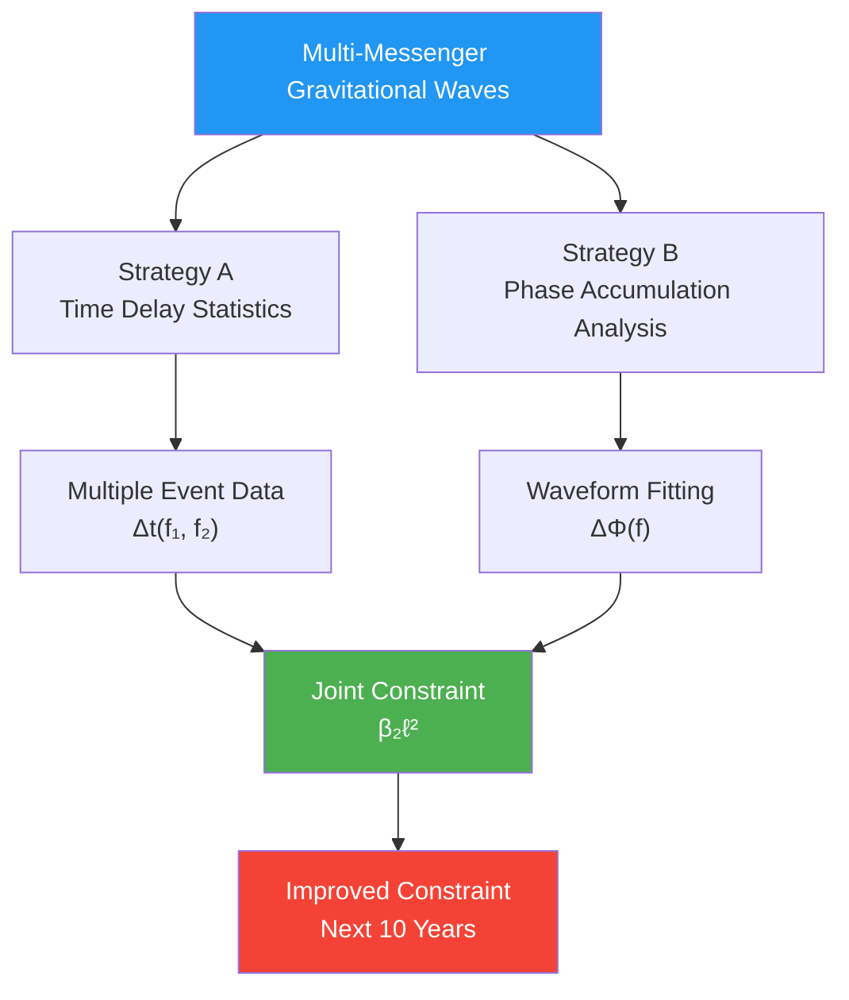

### 7.6.3 Post-Merger Signals and High-Frequency Gravitational Waves

After binary neutron star merger, forms supermassive neutron star or black hole, produces **post-merger oscillations**, frequency range:

$$
f_{\text{post-merge}} \sim 2 - 4\,\text{kHz}
$$

These signals are weak (require next-generation detectors like Cosmic Explorer or Einstein Telescope), but provide **high-frequency dispersion constraints**:

$$
k_{\text{high}} \sim 2\pi f_{\text{post-merge}} / c \sim 10^{-4}\,\text{m}^{-1}
$$

Compared to merger main peak $f \sim 100\,\text{Hz}$, $(k\ell)^2$ increases **400 times**, significantly amplifying dispersion effects!

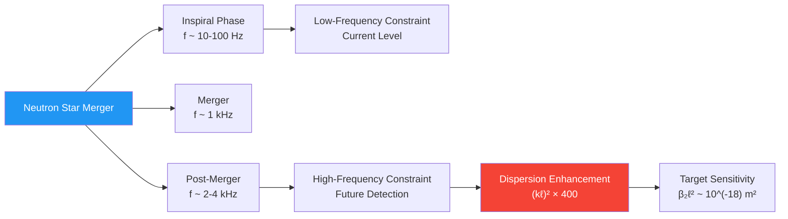

**Unified Framework Prediction**: If $\ell_{\text{cell}} \sim \ell_{\text{Pl}}$ and $\beta_2 \sim 10^{6}$ (some quantum gravity models predict), then post-merger signals may first directly detect dispersion effects—this would be **first direct evidence of quantum gravity**.

---

## 7.7 Chapter Summary

This chapter analyzes gravitational wave dispersion constraint in unified constraint framework, core conclusions include:

### Core Constraint Mechanism

**Gravitational Wave Dispersion Constraint Function**

$$
C_{\text{GW}}(\Theta) = \Delta c(\Theta) + \Delta_{\text{disp}}(\Theta)
$$

where:

$$
\Delta c = \left| \frac{c_{\text{gw}}}{c_{\text{em}}} - 1 \right| < 10^{-15}, \quad \Delta_{\text{disp}} = \sup_f \left| \frac{v_g(f)}{c} - 1 \right| \lesssim 10^{-15}
$$

Dispersion relation (only even-order terms):

$$
\omega^2 = c^2 k^2 \left[ 1 + \beta_2(k\ell_{\text{cell}})^2 + \beta_4(k\ell_{\text{cell}})^4 + \cdots \right]
$$

### Three Key Insights

1. **Two-Way Pinch**
   Gravitational wave dispersion constraint gives **upper bound** of $\ell_{\text{cell}}$, black hole entropy constraint gives **lower bound**, two form allowed window—future observations will further tighten, may eventually determine precise value of $\ell_{\text{cell}}$.

2. **Frequency Band Separation**
   Gravitational wave dispersion constraint through behavior of $\kappa(\omega)$ at GW frequency band ($\omega \sim 10^3\,\text{rad/s}$), achieves **scale separation** with cosmological constant constraint (UV/IR ends) and ETH constraint (microscopic scale), each acts on different frequency ranges.

3. **Even-Order Term Mechanism**
   Null-Modular symmetry and causality automatically exclude odd-order dispersion terms $(k\ell)^{2n+1}$, this is not artificial tuning, but **geometric consistency** requirement of unified framework.

### Experimental Test Paths

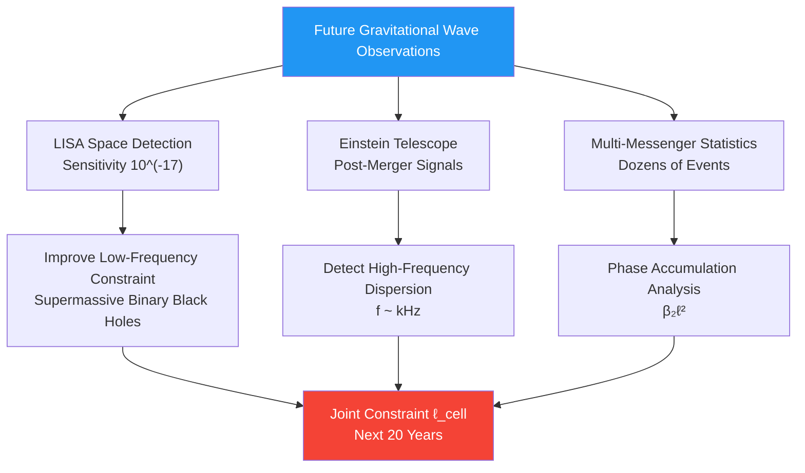

### Harmony with Other Constraints

- **With Black Hole Entropy Constraint**: Two-way pinch on $\ell_{\text{cell}}$, forming allowed window
- **With Cosmological Constant Constraint**: Through frequency band separation of $\kappa(\omega)$, each acts on different energy scales
- **With ETH Constraint**: Through scale separation (microscopic thermalization vs macroscopic propagation), avoiding conflict
- **With Neutrino/Strong CP Constraints**: Indirect association (through global consistency of unified time scale)

Gravitational wave dispersion constraint is **most directly observable** of six locks—it doesn't require extreme experimental conditions (like black hole horizons or Planck energy), just wait for next multi-messenger gravitational wave event. In next 10-20 years, with LISA, Einstein Telescope and more neutron star merger event detections, this constraint will transform from "upper bound test" to "precise measurement", providing decisive experimental support for unified framework.

---

## Theoretical Sources

This chapter synthesizes content from following two source theory documents:

1. **Six Ununified Physics as Consistency Constraints of Unified Matrix–QCA Universe**
   (`euler-gls-extend/six-unified-physics-constraints-matrix-qca-universe.md`)
   - Section 3.6: Theorem 3.6 (Even-Order Gravitational Wave Dispersion and Lattice Spacing Upper Bound)
   - Appendix E: Estimation of Gravitational–QCA Dispersion and LIGO/Virgo Constraints
   - Section 5.1: Upper bound setting of dispersion coefficients $\beta_{2n}$ in prototype parameter table

2. **Unified Constraint System of Six Unsolved Problems**
   (`euler-gls-info/19-six-problems-unified-constraint-system.md`)
   - Section 3.1: Definition of gravitational wave dispersion constraint $C_{\text{GW}}(\Theta)$ among six scalar constraint functions
   - Section 5.1: Spectral–geometric locking mechanism of black hole entropy and gravitational wave dispersion
   - Section 5.3: Many-body–gravitational coupling analysis of ETH–black hole–gravitational wave

Key technical details include: derivation of gravitational wave dispersion relation $\omega^2 = c^2k^2[1+\sum\beta_{2n}(k\ell)^{2n}]$, calculation of group velocity deviation $v_g/c - 1 \simeq \frac{3}{2}\beta_2(k\ell)^2$, conversion of constraint $|v_g/c-1| < 10^{-15}$ from GW170817/GRB170817A, and analysis of two-way pinch window formed with black hole entropy constraint $\ell_{\text{cell}}^2 = 4G\log d_{\text{eff}}$.

