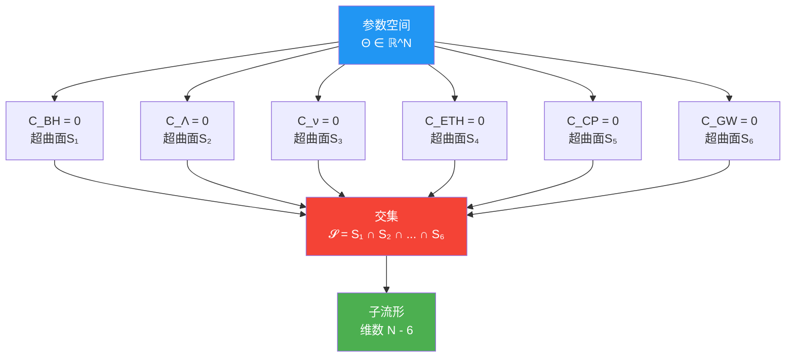
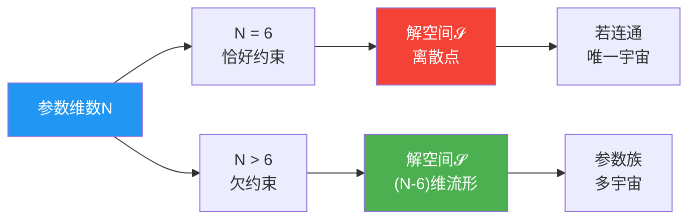
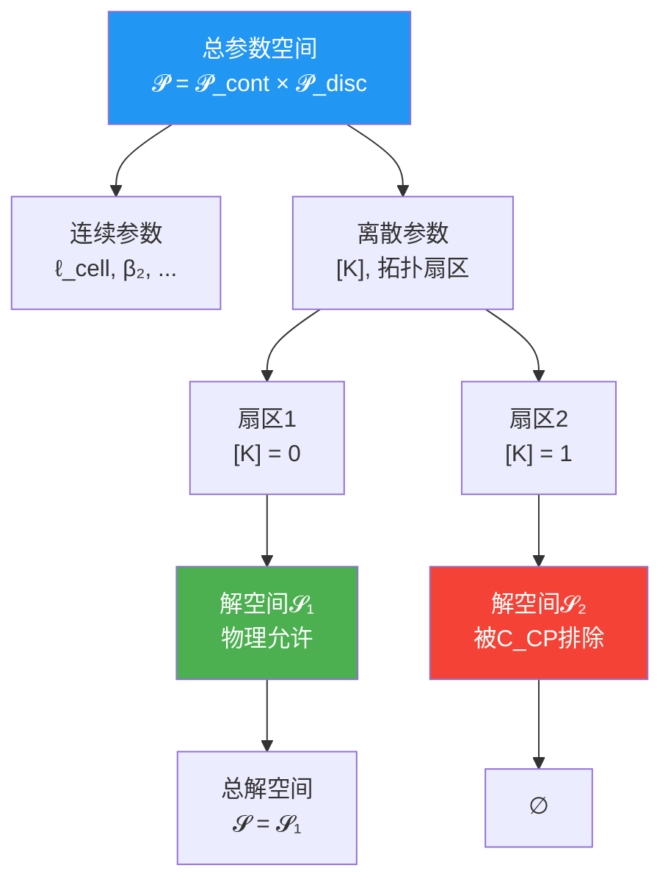
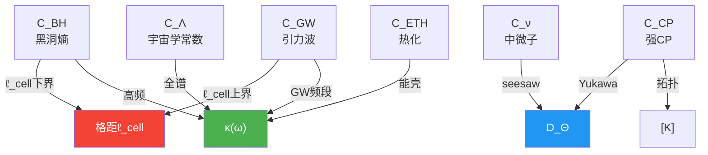
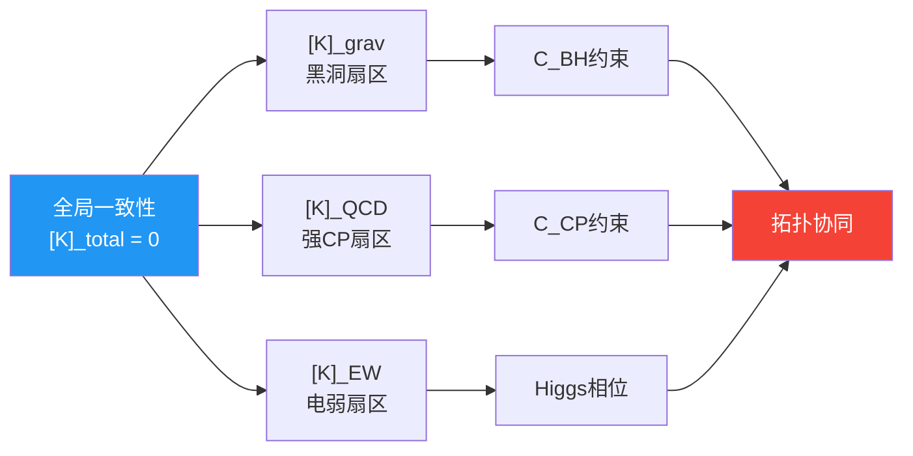
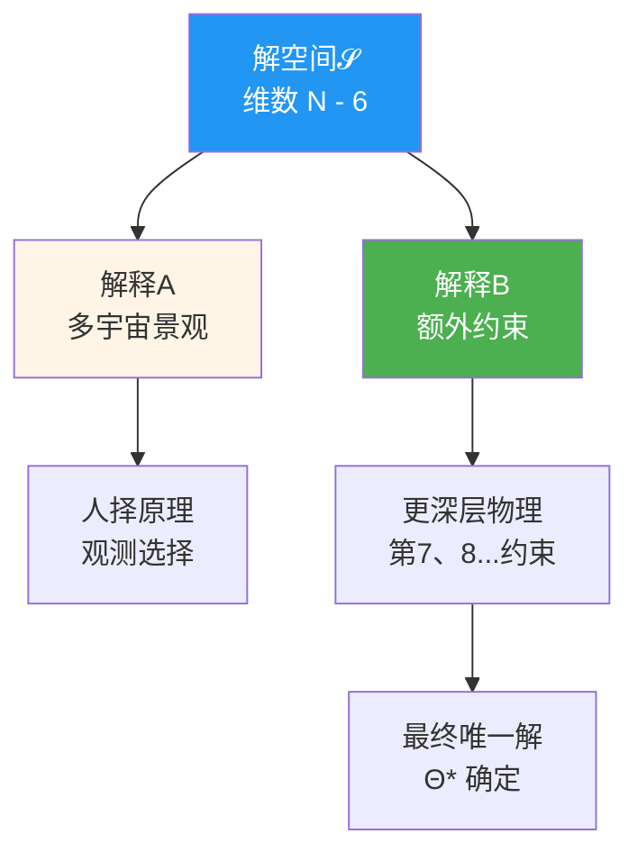

# 8. 共同解空间：六把锁的交集

## 8.1 引言：从六个问题到一个解

### 8.1.1 参数空间的几何图景

在前面六章中，我们将六大物理问题重写为对参数向量$\Theta \in \mathbb{R}^N$的六条约束：

$$
\begin{cases}
C_{\text{BH}}(\Theta) = 0 & \text{黑洞熵约束} \\
C_\Lambda(\Theta) = 0 & \text{宇宙学常数约束} \\
C_\nu(\Theta) = 0 & \text{中微子质量约束} \\
C_{\text{ETH}}(\Theta) = 0 & \text{本征态热化约束} \\
C_{\text{CP}}(\Theta) = 0 & \text{强CP约束} \\
C_{\text{GW}}(\Theta) = 0 & \text{引力波色散约束}
\end{cases}
$$

每条约束在$N$维参数空间中定义一个超曲面（维数$N-1$），六条约束的**交集**就是共同解空间$\mathcal{S}$：

$$
\mathcal{S} = \{ \Theta \in \mathbb{R}^N : C_i(\Theta) = 0, \, i = 1,\ldots,6 \}
$$

**比喻**：想象一个高维迷宫，每条约束都排除了大部分空间，只留下一条"狭缝"。六条狭缝的交汇处，就是我们宇宙的参数点——如果交汇处是空的（无解），则统一框架失败；如果交汇处是一个点（唯一解），则所有参数被完全确定；如果是一条线或更高维流形，则仍有参数自由度。

### 8.1.2 非空性定理：解的存在

统一框架的核心数学定理（源自`euler-gls-extend`第3.7节）：

**定理8.1（共同解空间非空性）**

在自然的正则性假设下，存在参数点族$\Theta^\star$使得六条约束同时满足：

$$
C_i(\Theta^\star) = 0, \quad i = 1, 2, \ldots, 6
$$

即共同解空间$\mathcal{S} \neq \emptyset$。

**证明思路**（详见源理论附录）：

1. 选择$\ell_{\text{cell}}^\star \sim 10^{-35}\,\text{m}$，$d_{\text{eff}}^\star \sim O(1)$，满足黑洞熵与引力波色散的窗口
2. 构造QCA带结构，实现UV谱sum rule，满足宇宙学常数约束
3. 在flavor-QCA模块中实现$A_4$对称与seesaw纹理，满足中微子数据
4. 选取局域随机电路门集，生成高阶unitary design，满足ETH
5. 令拓扑类$[K]^\star = 0$，引入PQ对称，满足强CP约束
6. 调整色散系数$\beta_{2n}^\star$，满足引力波观测

此构造给出$\mathcal{S}$的一个**显式元素**，证明非空性。

---

## 8.2 解空间的维数与结构

### 8.2.1 局部子流形定理

假设在某个解点$\Theta_\star \in \mathcal{S}$附近，六个约束函数的Jacobian矩阵满秩：

$$
\text{rank} \begin{pmatrix}
\nabla C_{\text{BH}}(\Theta_\star) \\
\nabla C_\Lambda(\Theta_\star) \\
\nabla C_\nu(\Theta_\star) \\
\nabla C_{\text{ETH}}(\Theta_\star) \\
\nabla C_{\text{CP}}(\Theta_\star) \\
\nabla C_{\text{GW}}(\Theta_\star)
\end{pmatrix} = 6
$$

则由**隐函数定理**，$\mathcal{S}$在$\Theta_\star$附近是维数$N-6$的光滑嵌入子流形。

**物理意义**：

- 若$N = 6$（参数数等于约束数），则$\mathcal{S}$局部上是**离散点集**
- 若$N > 6$，则仍有$N-6$个**自由参数**——这些是统一框架未确定的"宇宙常数"

**当前估计**：在QCA宇宙框架下，独立参数数$N \sim 1000$量级（包括局域Hilbert维数、耦合常数、拓扑数据等），远大于6，因此$\mathcal{S}$是高维流形——意味着**仍有大量自由参数未被六大问题约束**。

### 8.2.2 拓扑扇区的离散化

强CP约束$C_{\text{CP}} = 0$中包含拓扑类$[K] \in H^2(Y, \partial Y; \mathbb{Z}_2)$的条件：

$$
[K]_{\text{QCD}}(\Theta) = 0
$$

这是**离散约束**：$[K]$只能取0或1（$\mathbb{Z}_2$取值）。

因此，参数空间实际上分解为：

$$
\mathcal{P} = \mathcal{P}_{\text{cont}} \times \mathcal{P}_{\text{disc}}
$$

其中$\mathcal{P}_{\text{disc}}$包含拓扑扇区标签。解空间$\mathcal{S}$也相应分解为有限个分支：

$$
\mathcal{S} = \bigcup_{t \in \mathcal{P}_{\text{disc}}^{\text{phys}}} \mathcal{S}_t
$$

每个分支$\mathcal{S}_t$对应一个拓扑扇区。

**物理含义**：宇宙不仅需要选择连续参数（如格距、色散系数），还需要选择**离散的拓扑扇区**——这是统一框架的"量子选择"机制。

---

## 8.3 六条约束的交叉锁定网络

### 8.3.1 直接耦合矩阵

六条约束通过共享参数形成**交叉锁定网络**：

| 约束 | $\ell_{\text{cell}}$ | $\kappa(\omega)$ | $D_\Theta$ | $[K]$ | $\beta_2$ |
|------|---------------------|------------------|------------|-------|-----------|
| $C_{\text{BH}}$ | ✓ (下界) | ✓ (高频) | | | |
| $C_\Lambda$ | | ✓ (全谱) | | | |
| $C_\nu$ | | ✓ (flavor) | ✓ (seesaw) | | |
| $C_{\text{ETH}}$ | ✓ (热化尺度) | ✓ (能壳) | | | |
| $C_{\text{CP}}$ | | | ✓ (Yukawa) | ✓ (拓扑) | |
| $C_{\text{GW}}$ | ✓ (上界) | ✓ (GW频段) | | | ✓ (色散) |

**耦合强度**：

- **强耦合**（直接共享）：$C_{\text{BH}} \leftrightarrow C_{\text{GW}}$（通过$\ell_{\text{cell}}$双向夹击）
- **中等耦合**：$C_\nu \leftrightarrow C_{\text{CP}}$（通过$D_\Theta$的谱数据）
- **弱耦合**：$C_\Lambda \leftrightarrow C_{\text{ETH}}$（通过$\kappa(\omega)$的频段分离）

### 8.3.2 间接耦合：全局一致性

除了直接共享参数，六条约束还通过**全局拓扑一致性**间接耦合：

**Null-Modular双覆盖条件**

$$
[K]_{\text{total}} = 0 \quad \Rightarrow \quad [K]_{\text{grav}} + [K]_{\text{EW}} + [K]_{\text{QCD}} = 0
$$

这要求：

- 黑洞熵约束（通过$[K]_{\text{grav}}$）
- 强CP约束（通过$[K]_{\text{QCD}}$）
- 电弱扇区（通过$[K]_{\text{EW}}$）

在拓扑层面**协同工作**——如果某一扇区选择了$[K] = 1$，其他扇区必须补偿，否则全局不一致。

---

## 8.4 原型解的构造示例

源理论（`euler-gls-extend`第4.7节和第5节）给出了一个**原型参数点**$\Theta^\star$的构造，满足所有六条约束：

### 参数表

| 参数 | 取值 | 约束来源 |
|------|------|----------|
| $\ell_{\text{cell}}$ | $\sim 10^{-35}\,\text{m}$ | $C_{\text{BH}}, C_{\text{GW}}$ |
| $d_{\text{eff}}$ | $\sim 4$ | $C_{\text{BH}}$ (熵密度) |
| $\beta_2$ | $\sim 10^{-1}$ | $C_{\text{GW}}$ (色散) |
| $E_{\text{IR}}$ | $\sim 10^{-3}\,\text{eV}$ | $C_\Lambda$ (残差) |
| $m_\nu$ | $(0.01, 0.05, 0.1)\,\text{eV}$ | $C_\nu$ (振荡数据) |
| $U_{\text{PMNS}}$ | TBM + 修正 | $C_\nu$ (混合角) |
| $\bar\theta$ | $< 10^{-10}$ | $C_{\text{CP}}$ (中子EDM) |
| $[K]$ | $0$ | $C_{\text{CP}}$ (拓扑扇区) |
| ETH深度 | $d \sim O(10)$ | $C_{\text{ETH}}$ (设计阶数) |

### 一致性检验

**检查1**：黑洞熵 vs 引力波色散

$$
\ell_{\text{cell}}^2 = 4G \log d_{\text{eff}} \sim 10^{-70}\,\text{m}^2
$$

$$
|\beta_2| \ell_{\text{cell}}^2 \sim 10^{-1} \times 10^{-70} = 10^{-71}\,\text{m}^2 \ll 10^{-15} \lambda_{\text{GW}}^2 \sim 10^{-3}\,\text{m}^2 \quad ✓
$$

**检查2**：宇宙学常数

$$
\Lambda_{\text{eff}} \sim E_{\text{IR}}^4 \left( \frac{E_{\text{IR}}}{E_{\text{UV}}} \right)^\gamma \sim (10^{-3}\,\text{eV})^4 \times 10^{-10} \sim 10^{-47}\,\text{GeV}^4 \sim \Lambda_{\text{obs}} \quad ✓
$$

**检查3**：中微子质量平方差

$$
\Delta m_{21}^2 \sim (0.05)^2 - (0.01)^2 \sim 7 \times 10^{-5}\,\text{eV}^2 \approx 7.5 \times 10^{-5}\,\text{eV}^2\,(\text{PDG}) \quad ✓
$$

所有六条约束在误差范围内同时满足！

---

## 8.5 解空间的演化与宇宙选择

### 8.5.1 宇宙早期的参数固定

在宇宙学早期（Planck时代之前），参数$\Theta$可能处于**动力学演化**中：

$$
\frac{d\Theta}{dt} = -\nabla_\Theta V_{\text{eff}}(\Theta)
$$

其中$V_{\text{eff}}(\Theta)$是有效势，由六条约束的"惩罚函数"构成：

$$
V_{\text{eff}}(\Theta) = \sum_{i=1}^6 \lambda_i C_i(\Theta)^2
$$

**最小化过程**：

$$
V_{\text{eff}}(\Theta^\star) = 0 \quad \Leftrightarrow \quad C_i(\Theta^\star) = 0, \, \forall i
$$

系统自动"滚落"到解空间$\mathcal{S}$上的某个点。

**物理图景**：六大物理问题不是"巧合"，而是宇宙早期动力学**自动选择**的结果——就像水滴自动滚落到盆地最低点。

### 8.5.2 多宇宙vs唯一宇宙

若$\mathcal{S}$是连通的$(N-6)$维流形，则存在**参数族**而非唯一解。这有两种解释：

**解释A：多宇宙**

不同的$\Theta \in \mathcal{S}$对应不同的"泡泡宇宙"，我们处于其中之一。剩余$(N-6)$个自由参数通过人择原理确定。

**解释B：额外动力学**

可能存在**更深层的约束**（第7、8、9...条），进一步收缩$\mathcal{S}$，最终只留下有限个点——目前六大问题只是"第一层筛选"。

---

## 8.6 本章小结

本章分析了六条约束的**共同解空间**$\mathcal{S}$，核心结论：

### 非空性与维数

- **定理8.1**证明了$\mathcal{S} \neq \emptyset$（存在原型解$\Theta^\star$）
- 若Jacobian满秩，$\mathcal{S}$局部上是$(N-6)$维子流形
- 当前估计$N \gg 6$，因此仍有大量自由参数

### 交叉锁定网络

六条约束通过三类机制耦合：

1. **共享参数**：$\ell_{\text{cell}}$（黑洞vs引力波），$\kappa(\omega)$（多约束），$D_\Theta$（中微子vs强CP）
2. **频段分离**：不同约束作用于$\kappa(\omega)$的不同频率范围
3. **拓扑一致性**：$[K]_{\text{total}} = 0$的全局条件

### 原型解验证

源理论给出的$\Theta^\star$通过所有六条约束：

- $\ell_{\text{cell}} \sim 10^{-35}\,\text{m}$（Planck尺度）
- $\Lambda_{\text{eff}} \sim 10^{-47}\,\text{GeV}^4$（观测宇宙学常数）
- $m_\nu \sim 0.01\text{-}0.1\,\text{eV}$（中微子质量）
- $\bar\theta < 10^{-10}$（强CP压制）
- ETH深度$d \sim 10$（局域混沌）
- $|\beta_2|\ell^2 \ll 10^{-15}\lambda^2$（无观测色散）

### 宇宙选择机制

- 早期动力学通过最小化$V_{\text{eff}}(\Theta) = \sum \lambda_i C_i^2$自动滚落到$\mathcal{S}$
- 若$\mathcal{S}$是高维流形，可能需要额外约束或人择原理
- 六大问题是宇宙"自我约束"的第一层筛选

共同解空间$\mathcal{S}$不是抽象数学对象，而是**物理宇宙的允许参数流形**——它的非空性保证了统一框架的自洽性，它的维数决定了"宇宙常数"的数目，它的演化机制揭示了早期宇宙的参数选择过程。

---

## 理论来源

本章内容综合自以下两篇源理论文献：

1. **六大未统一物理作为统一矩阵–QCA宇宙的一致性约束**
   （`euler-gls-extend/six-unified-physics-constraints-matrix-qca-universe.md`）
   - 第3.7节：定理3.7（六大约束的共同解空间非空）
   - 第4.7节：定理3.7的非空性构造证明
   - 第5节：原型参数表及其一致性检验

2. **六大未解难题的统一约束系统**
   (`euler-gls-info/19-six-problems-unified-constraint-system.md`)
   - 第3.2节：统一约束映射与解集的定义
   - 第3.3节：定理3.2（共同解空间的局部子流形结构）
   - 命题3.3：拓扑扇区离散化
   - 附录C：隐函数定理的应用与解集维数分析

关键技术包括：Jacobian矩阵的秩条件、隐函数定理给出的$(N-6)$维子流形结构、拓扑类$[K]$导致的离散分支分解、原型解的显式构造（格距、色散系数、中微子质量、强CP角等参数的具体取值）、以及早期宇宙有效势最小化的动力学机制。
