# Section 08: Common Solution Space: Intersection of Six Locks

## 8.1 Introduction: From Six Problems to One Solution

### 8.1.1 Geometric Picture of Parameter Space

In previous six sections, we rewrote six major physics problems as six constraints on parameter vector $\Theta \in \mathbb{R}^N$:

$$
\begin{cases}
C_{\text{BH}}(\Theta) = 0 & \text{Black hole entropy constraint} \\
C_\Lambda(\Theta) = 0 & \text{Cosmological constant constraint} \\
C_\nu(\Theta) = 0 & \text{Neutrino mass constraint} \\
C_{\text{ETH}}(\Theta) = 0 & \text{Eigenstate thermalization constraint} \\
C_{\text{CP}}(\Theta) = 0 & \text{Strong CP constraint} \\
C_{\text{GW}}(\Theta) = 0 & \text{Gravitational wave dispersion constraint}
\end{cases}
$$

Each constraint defines a hypersurface (dimension $N-1$) in $N$-dimensional parameter space. **Intersection** of six constraints is common solution space $\mathcal{S}$:

$$
\mathcal{S} = \{ \Theta \in \mathbb{R}^N : C_i(\Theta) = 0, \, i = 1,\ldots,6 \}
$$

```mermaid
graph TB
    ParamSpace["Parameter Space<br/>Θ ∈ ℝ^N"]

    ParamSpace --> C1["C_BH = 0<br/>Hypersurface S₁"]
    ParamSpace --> C2["C_Λ = 0<br/>Hypersurface S₂"]
    ParamSpace --> C3["C_ν = 0<br/>Hypersurface S₃"]
    ParamSpace --> C4["C_ETH = 0<br/>Hypersurface S₄"]
    ParamSpace --> C5["C_CP = 0<br/>Hypersurface S₅"]
    ParamSpace --> C6["C_GW = 0<br/>Hypersurface S₆"]

    C1 --> Intersection["Intersection<br/>𝓢 = S₁ ∩ S₂ ∩ ... ∩ S₆"]
    C2 --> Intersection
    C3 --> Intersection
    C4 --> Intersection
    C5 --> Intersection
    C6 --> Intersection

    Intersection --> Manifold["Submanifold<br/>Dimension N - 6"]

    style ParamSpace fill:#2196f3,color:#fff
    style Intersection fill:#f44336,color:#fff
    style Manifold fill:#4caf50,color:#fff
```

**Analogy**: Imagine a high-dimensional maze, each constraint excludes most space, leaving only a "narrow slit". Intersection of six slits is parameter point of our universe—if intersection is empty (no solution), unified framework fails; if intersection is a point (unique solution), all parameters completely determined; if it's a line or higher-dimensional manifold, still have parameter degrees of freedom.

### 8.1.2 Non-Emptiness Theorem: Existence of Solutions

Core mathematical theorem of unified framework (from `euler-gls-extend` Section 3.7):

**Theorem 8.1 (Non-Emptiness of Common Solution Space)**

Under natural regularity assumptions, there exists parameter point family $\Theta^\star$ such that all six constraints simultaneously satisfied:

$$
C_i(\Theta^\star) = 0, \quad i = 1, 2, \ldots, 6
$$

That is, common solution space $\mathcal{S} \neq \emptyset$.

**Proof Sketch** (see source theory appendix for details):

1. Choose $\ell_{\text{cell}}^\star \sim 10^{-35}\,\text{m}$, $d_{\text{eff}}^\star \sim O(1)$, satisfying window of black hole entropy and gravitational wave dispersion
2. Construct QCA band structure, realize UV spectral sum rule, satisfy cosmological constant constraint
3. In flavor-QCA module, realize $A_4$ symmetry and seesaw texture, satisfy neutrino data
4. Select local random circuit gate set, generate high-order unitary design, satisfy ETH
5. Set topological class $[K]^\star = 0$, introduce PQ symmetry, satisfy strong CP constraint
6. Adjust dispersion coefficients $\beta_{2n}^\star$, satisfy gravitational wave observations

This construction gives an **explicit element** of $\mathcal{S}$, proving non-emptiness.

---

## 8.2 Dimension and Structure of Solution Space

### 8.2.1 Local Submanifold Theorem

Assume near some solution point $\Theta_\star \in \mathcal{S}$, Jacobian matrix of six constraint functions has full rank:

$$
\text{rank} \begin{pmatrix}
\nabla C_{\text{BH}}(\Theta_\star) \\
\nabla C_\Lambda(\Theta_\star) \\
\nabla C_\nu(\Theta_\star) \\
\nabla C_{\text{ETH}}(\Theta_\star) \\
\nabla C_{\text{CP}}(\Theta_\star) \\
\nabla C_{\text{GW}}(\Theta_\star)
\end{pmatrix} = 6
$$

Then by **implicit function theorem**, $\mathcal{S}$ near $\Theta_\star$ is smooth embedded submanifold of dimension $N-6$.

**Physical Meaning**:

- If $N = 6$ (number of parameters equals number of constraints), then $\mathcal{S}$ locally is **discrete point set**
- If $N > 6$, then still have $N-6$ **free parameters**—these are "cosmological constants" not determined by unified framework

```mermaid
graph LR
    N["Parameter Dimension N"]

    N --> Case1["N = 6<br/>Exactly Constrained"]
    N --> Case2["N > 6<br/>Under-Constrained"]

    Case1 --> Discrete["Solution Space 𝓢<br/>Discrete Points"]
    Case2 --> Manifold["Solution Space 𝓢<br/>(N-6)-Dimensional Manifold"]

    Discrete --> Unique["If Connected<br/>Unique Universe"]
    Manifold --> Family["Parameter Family<br/>Multiverse"]

    style N fill:#2196f3,color:#fff
    style Discrete fill:#f44336,color:#fff
    style Manifold fill:#4caf50,color:#fff
```

**Current Estimate**: Under QCA universe framework, number of independent parameters $N \sim 1000$ order (including local Hilbert dimension, coupling constants, topological data, etc.), far greater than 6, therefore $\mathcal{S}$ is high-dimensional manifold—meaning **still have many free parameters not constrained by six major problems**.

### 8.2.2 Discretization of Topological Sectors

Strong CP constraint $C_{\text{CP}} = 0$ contains condition on topological class $[K] \in H^2(Y, \partial Y; \mathbb{Z}_2)$:

$$
[K]_{\text{QCD}}(\Theta) = 0
$$

This is **discrete constraint**: $[K]$ can only take 0 or 1 ($\mathbb{Z}_2$ values).

Therefore, parameter space actually decomposes as:

$$
\mathcal{P} = \mathcal{P}_{\text{cont}} \times \mathcal{P}_{\text{disc}}
$$

where $\mathcal{P}_{\text{disc}}$ contains topological sector labels. Solution space $\mathcal{S}$ also decomposes into finite branches:

$$
\mathcal{S} = \bigcup_{t \in \mathcal{P}_{\text{disc}}^{\text{phys}}} \mathcal{S}_t
$$

Each branch $\mathcal{S}_t$ corresponds to a topological sector.

```mermaid
graph TB
    Total["Total Parameter Space<br/>𝓟 = 𝓟_cont × 𝓟_disc"]

    Total --> Cont["Continuous Parameters<br/>ℓ_cell, β₂, ..."]
    Total --> Disc["Discrete Parameters<br/>[K], Topological Sectors"]

    Disc --> Branch1["Sector 1<br/>[K] = 0"]
    Disc --> Branch2["Sector 2<br/>[K] = 1"]

    Branch1 --> S1["Solution Space 𝓢₁<br/>Physically Allowed"]
    Branch2 --> S2["Solution Space 𝓢₂<br/>Excluded by C_CP"]

    S1 --> Union["Total Solution Space<br/>𝓢 = 𝓢₁"]
    S2 --> Excluded["∅"]

    style Total fill:#2196f3,color:#fff
    style S1 fill:#4caf50,color:#fff
    style S2 fill:#f44336,color:#fff
```

**Physical Meaning**: Universe not only needs to choose continuous parameters (like lattice spacing, dispersion coefficients), but also needs to choose **discrete topological sector**—this is "quantum selection" mechanism of unified framework.

---

## 8.3 Cross-Locking Network of Six Constraints

### 8.3.1 Direct Coupling Matrix

Six constraints form **cross-locking network** through shared parameters:

| Constraint | $\ell_{\text{cell}}$ | $\kappa(\omega)$ | $D_\Theta$ | $[K]$ | $\beta_2$ |
|------------|---------------------|------------------|------------|-------|-----------|
| $C_{\text{BH}}$ | ✓ (lower bound) | ✓ (high frequency) | | | |
| $C_\Lambda$ | | ✓ (full spectrum) | | | |
| $C_\nu$ | | ✓ (flavor) | ✓ (seesaw) | | |
| $C_{\text{ETH}}$ | ✓ (thermalization scale) | ✓ (energy shell) | | | |
| $C_{\text{CP}}$ | | | ✓ (Yukawa) | ✓ (topology) | |
| $C_{\text{GW}}$ | ✓ (upper bound) | ✓ (GW band) | | | ✓ (dispersion) |

**Coupling Strength**:

- **Strong Coupling** (direct sharing): $C_{\text{BH}} \leftrightarrow C_{\text{GW}}$ (two-way pinch through $\ell_{\text{cell}}$)
- **Medium Coupling**: $C_\nu \leftrightarrow C_{\text{CP}}$ (through spectral data of $D_\Theta$)
- **Weak Coupling**: $C_\Lambda \leftrightarrow C_{\text{ETH}}$ (through frequency band separation of $\kappa(\omega)$)

### 8.3.2 Indirect Coupling: Global Consistency

Besides direct parameter sharing, six constraints also indirectly couple through **global topological consistency**:

**Null-Modular Double Cover Condition**

$$
[K]_{\text{total}} = 0 \quad \Rightarrow \quad [K]_{\text{grav}} + [K]_{\text{EW}} + [K]_{\text{QCD}} = 0
$$

This requires:

- Black hole entropy constraint (through $[K]_{\text{grav}}$)
- Strong CP constraint (through $[K]_{\text{QCD}}$)
- Electroweak sector (through $[K]_{\text{EW}}$)

**Work together** at topological level—if one sector chooses $[K] = 1$, other sectors must compensate, otherwise global inconsistency.

---

## 8.4 Construction Example of Prototype Solution

Source theory (`euler-gls-extend` Section 4.7 and Section 5) gives construction of a **prototype parameter point** $\Theta^\star$ satisfying all six constraints:

### Parameter Table

| Parameter | Value | Constraint Source |
|-----------|-------|-------------------|
| $\ell_{\text{cell}}$ | $\sim 10^{-35}\,\text{m}$ | $C_{\text{BH}}, C_{\text{GW}}$ |
| $d_{\text{eff}}$ | $\sim 4$ | $C_{\text{BH}}$ (entropy density) |
| $\beta_2$ | $\sim 10^{-1}$ | $C_{\text{GW}}$ (dispersion) |
| $E_{\text{IR}}$ | $\sim 10^{-3}\,\text{eV}$ | $C_\Lambda$ (residual) |
| $m_\nu$ | $(0.01, 0.05, 0.1)\,\text{eV}$ | $C_\nu$ (oscillation data) |
| $U_{\text{PMNS}}$ | TBM + corrections | $C_\nu$ (mixing angles) |
| $\bar\theta$ | $< 10^{-10}$ | $C_{\text{CP}}$ (neutron EDM) |
| $[K]$ | $0$ | $C_{\text{CP}}$ (topological sector) |
| ETH depth | $d \sim O(10)$ | $C_{\text{ETH}}$ (design order) |

### Consistency Checks

**Check 1**: Black hole entropy vs gravitational wave dispersion

$$
\ell_{\text{cell}}^2 = 4G \log d_{\text{eff}} \sim 10^{-70}\,\text{m}^2
$$

$$
|\beta_2| \ell_{\text{cell}}^2 \sim 10^{-1} \times 10^{-70} = 10^{-71}\,\text{m}^2 \ll 10^{-15} \lambda_{\text{GW}}^2 \sim 10^{-3}\,\text{m}^2 \quad ✓
$$

**Check 2**: Cosmological constant

$$
\Lambda_{\text{eff}} \sim E_{\text{IR}}^4 \left( \frac{E_{\text{IR}}}{E_{\text{UV}}} \right)^\gamma \sim (10^{-3}\,\text{eV})^4 \times 10^{-10} \sim 10^{-47}\,\text{GeV}^4 \sim \Lambda_{\text{obs}} \quad ✓
$$

**Check 3**: Neutrino mass squared differences

$$
\Delta m_{21}^2 \sim (0.05)^2 - (0.01)^2 \sim 7 \times 10^{-5}\,\text{eV}^2 \approx 7.5 \times 10^{-5}\,\text{eV}^2\,(\text{PDG}) \quad ✓
$$

All six constraints simultaneously satisfied within error!

---

## 8.5 Evolution of Solution Space and Universe Selection

### 8.5.1 Parameter Fixation in Early Universe

In cosmological early times (before Planck era), parameters $\Theta$ may be in **dynamical evolution**:

$$
\frac{d\Theta}{dt} = -\nabla_\Theta V_{\text{eff}}(\Theta)
$$

where $V_{\text{eff}}(\Theta)$ is effective potential, constructed from "penalty functions" of six constraints:

$$
V_{\text{eff}}(\Theta) = \sum_{i=1}^6 \lambda_i C_i(\Theta)^2
$$

**Minimization Process**:

$$
V_{\text{eff}}(\Theta^\star) = 0 \quad \Leftrightarrow \quad C_i(\Theta^\star) = 0, \, \forall i
$$

System automatically "rolls down" to some point on solution space $\mathcal{S}$.

**Physical Picture**: Six major physics problems are not "coincidences", but result of early universe dynamics **automatically selecting**—like water droplet automatically rolling to lowest point of basin.

### 8.5.2 Multiverse vs Unique Universe

If $\mathcal{S}$ is connected $(N-6)$-dimensional manifold, then exists **parameter family** rather than unique solution. This has two interpretations:

**Interpretation A: Multiverse**

Different $\Theta \in \mathcal{S}$ correspond to different "bubble universes", we are in one of them. Remaining $(N-6)$ free parameters determined through anthropic principle.

**Interpretation B: Additional Dynamics**

May exist **deeper constraints** (7th, 8th, 9th...), further contracting $\mathcal{S}$, eventually leaving only finite points—current six problems are just "first layer screening".

```mermaid
graph TB
    S["Solution Space 𝓢<br/>Dimension N - 6"]

    S --> Multi["Interpretation A<br/>Multiverse Landscape"]
    S --> Unique["Interpretation B<br/>Additional Constraints"]

    Multi --> Anthropic["Anthropic Principle<br/>Observational Selection"]
    Unique --> Deeper["Deeper Physics<br/>7th, 8th... Constraints"]

    Deeper --> Final["Final Unique Solution<br/>Θ* Determined"]

    style S fill:#2196f3,color:#fff
    style Multi fill:#fff4e6
    style Unique fill:#4caf50,color:#fff
```

---

## 8.6 Chapter Summary

This chapter analyzes **common solution space** $\mathcal{S}$ of six constraints, core conclusions:

### Non-Emptiness and Dimension

- **Theorem 8.1** proves $\mathcal{S} \neq \emptyset$ (exists prototype solution $\Theta^\star$)
- If Jacobian has full rank, $\mathcal{S}$ locally is $(N-6)$-dimensional submanifold
- Current estimate $N \gg 6$, therefore still have many free parameters

### Cross-Locking Network

Six constraints couple through three mechanisms:

1. **Shared Parameters**: $\ell_{\text{cell}}$ (black hole vs gravitational wave), $\kappa(\omega)$ (multiple constraints), $D_\Theta$ (neutrino vs strong CP)
2. **Frequency Band Separation**: Different constraints act on different frequency ranges of $\kappa(\omega)$
3. **Topological Consistency**: Global condition $[K]_{\text{total}} = 0$

### Prototype Solution Verification

$\Theta^\star$ given by source theory passes all six constraints:

- $\ell_{\text{cell}} \sim 10^{-35}\,\text{m}$ (Planck scale)
- $\Lambda_{\text{eff}} \sim 10^{-47}\,\text{GeV}^4$ (observed cosmological constant)
- $m_\nu \sim 0.01\text{-}0.1\,\text{eV}$ (neutrino masses)
- $\bar\theta < 10^{-10}$ (strong CP suppression)
- ETH depth $d \sim 10$ (local chaos)
- $|\beta_2|\ell^2 \ll 10^{-15}\lambda^2$ (no observed dispersion)

### Universe Selection Mechanism

- Early dynamics automatically rolls down to $\mathcal{S}$ through minimizing $V_{\text{eff}}(\Theta) = \sum \lambda_i C_i^2$
- If $\mathcal{S}$ is high-dimensional manifold, may need additional constraints or anthropic principle
- Six major problems are first layer screening of universe "self-constraining"

Common solution space $\mathcal{S}$ is not abstract mathematical object, but **allowed parameter manifold of physical universe**—its non-emptiness guarantees self-consistency of unified framework, its dimension determines number of "cosmological constants", its evolution mechanism reveals parameter selection process of early universe.

---

## Theoretical Sources

This chapter synthesizes content from following two source theory documents:

1. **Six Ununified Physics as Consistency Constraints of Unified Matrix–QCA Universe**
   (`euler-gls-extend/six-unified-physics-constraints-matrix-qca-universe.md`)
   - Section 3.7: Theorem 3.7 (Non-emptiness of common solution space of six major constraints)
   - Section 4.7: Non-emptiness construction proof of Theorem 3.7
   - Section 5: Prototype parameter table and its consistency checks

2. **Unified Constraint System of Six Unsolved Problems**
   (`euler-gls-info/19-six-problems-unified-constraint-system.md`)
   - Section 3.2: Definition of unified constraint mapping and solution set
   - Section 3.3: Theorem 3.2 (Local submanifold structure of common solution space)
   - Proposition 3.3: Discretization of topological sectors
   - Appendix C: Application of implicit function theorem and solution set dimension analysis

Key techniques include: Rank condition of Jacobian matrix, $(N-6)$-dimensional submanifold structure given by implicit function theorem, discrete branch decomposition caused by topological class $[K]$, explicit construction of prototype solution (specific values of parameters like lattice spacing, dispersion coefficients, neutrino masses, strong CP angle, etc.), and dynamical mechanism of effective potential minimization in early universe.

