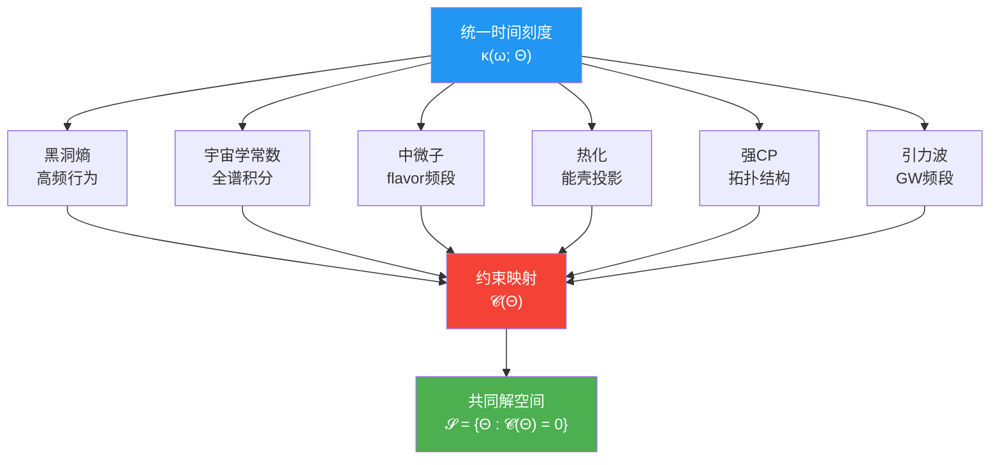
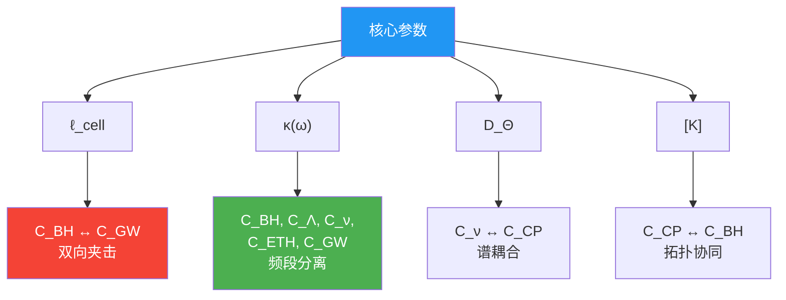
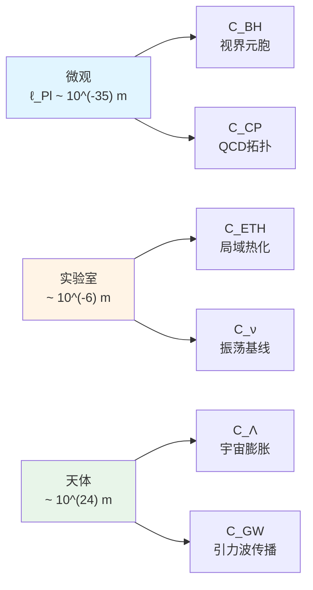
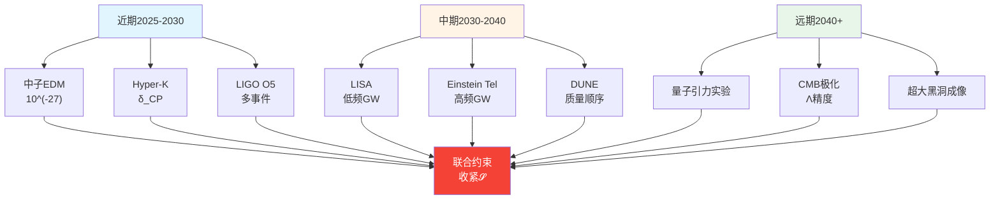
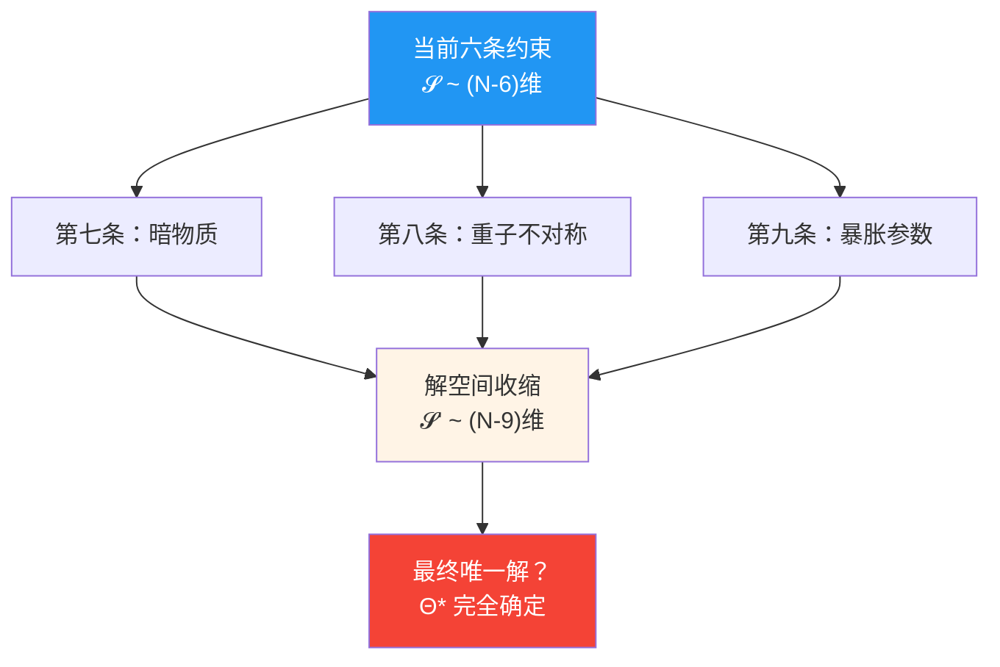

# 9. 章节总结：从六个难题到统一约束

## 9.1 核心框架回顾

本章系列在统一时间刻度、边界时间几何与量子元胞自动机宇宙的框架下，将六大看似独立的物理难题统一重写为对有限维参数向量$\Theta \in \mathbb{R}^N$的六条标量约束：

$$
\mathcal{C}(\Theta) = \begin{pmatrix}
C_{\text{BH}}(\Theta) \\
C_\Lambda(\Theta) \\
C_\nu(\Theta) \\
C_{\text{ETH}}(\Theta) \\
C_{\text{CP}}(\Theta) \\
C_{\text{GW}}(\Theta)
\end{pmatrix} = \begin{pmatrix}
0 \\ 0 \\ 0 \\ 0 \\ 0 \\ 0
\end{pmatrix}
$$

**统一时间刻度母式**是整个框架的核心桥梁：

$$
\kappa(\omega; \Theta) = \frac{\varphi'(\omega)}{\pi} = \rho_{\text{rel}}(\omega) = \frac{1}{2\pi}\text{tr}\,Q(\omega)
$$

它将散射理论（相位导数）、谱理论（相对态密度）与时间延迟（Wigner-Smith算符）统一起来，为六大问题提供共同的频域语言。

---

## 9.2 六条约束的总结表

| 约束 | 物理问题 | 数学形式 | 核心参数 | 观测检验 |
|------|----------|----------|----------|----------|
| **$C_{\text{BH}}$** | 黑洞熵与面积律 | $\ell_{\text{cell}}^2 = 4G \log d_{\text{eff}}$ | $\ell_{\text{cell}}, d_{\text{eff}}$ | EHT视界成像，引力波QNM |
| **$C_\Lambda$** | 宇宙学常数自然性 | $\int E^2 \Delta\rho(E) dE = 0$ | $\kappa(\omega)$ UV/IR | CMB, BAO, Ia型超新星 |
| **$C_\nu$** | 中微子质量与混合 | $M_\nu = -M_D^T M_R^{-1} M_D$ | $D_\Theta$谱, $U_{\text{PMNS}}$ | T2K, NOvA, Hyper-K |
| **$C_{\text{ETH}}$** | 孤立系统热化 | $\langle n \| O \| n \rangle \approx O(\varepsilon_n)$ | QCA混沌深度 | 冷原子, 超导量子比特 |
| **$C_{\text{CP}}$** | 强CP问题 | $\bar\theta < 10^{-10}, [K]_{\text{QCD}} = 0$ | $[K]$拓扑类, $\arg\det Y$ | 中子EDM, 轴子搜寻 |
| **$C_{\text{GW}}$** | 引力波色散 | $\|v_g/c - 1\| < 10^{-15}$ | $\ell_{\text{cell}}, \beta_2$ | LIGO/Virgo, LISA |

**六把锁的比喻回归**：

- $C_{\text{BH}}$：第一把锁，固定格距下界
- $C_\Lambda$：第二把锁，平衡高能与低能谱
- $C_\nu$：第三把锁，确定内部Dirac谱
- $C_{\text{ETH}}$：第四把锁，要求局域混沌
- $C_{\text{CP}}$：第五把锁，选择拓扑扇区
- $C_{\text{GW}}$：第六把锁，限制格距上界

只有六把锁**同时打开**（$\mathcal{C}(\Theta) = 0$），宇宙的参数保险箱才能解锁，物理定律才自洽运行。

---

## 9.3 交叉锁定的三重机制

### 9.3.1 共享参数锁定

| 参数 | 相关约束 | 锁定方式 |
|------|----------|----------|
| $\ell_{\text{cell}}$ | $C_{\text{BH}}, C_{\text{GW}}, C_{\text{ETH}}$ | **双向夹击**：BH给下界，GW给上界，ETH要求热化尺度 |
| $\kappa(\omega)$ | $C_{\text{BH}}, C_\Lambda, C_\nu, C_{\text{ETH}}, C_{\text{GW}}$ | **频段分离**：不同约束作用于不同频率窗口 |
| $D_\Theta$ | $C_\nu, C_{\text{CP}}$ | **谱耦合**：中微子seesaw与夸克Yukawa共享内部Dirac算符 |
| $[K]$ | $C_{\text{CP}}, C_{\text{BH}}$ | **拓扑一致性**：$[K]_{\text{total}} = 0$要求各扇区协同 |

### 9.3.2 频段分离机制

统一时间刻度$\kappa(\omega)$在不同频率范围"负责"不同约束：

| 频率范围 | 物理尺度 | 相关约束 | 物理效应 |
|----------|----------|----------|----------|
| $\omega \sim E_{\text{Pl}}$ | Planck | $C_{\text{BH}}, C_\Lambda$ | 黑洞微观态、UV谱sum rule |
| $\omega \sim \Lambda_{\text{QCD}}$ | QCD | $C_{\text{CP}}$ | 拓扑θ项、轴子势 |
| $\omega \sim 10^3\,\text{rad/s}$ | GW频段 | $C_{\text{GW}}$ | 引力波传播、色散系数 |
| $\omega \sim \text{eV}$ | 中微子 | $C_\nu$ | flavor混合、振荡 |
| $\omega \sim H_0$ | 宇宙学 | $C_\Lambda$ | 有效宇宙学常数残差 |
| 能壳 $[E, E+\delta E]$ | 实验室 | $C_{\text{ETH}}$ | 局域热化、统计平衡 |

**频段分离保证了可解性**：调节某一频段满足对应约束，不会显著破坏其他频段的约束——这是自然参数选择下的"幸运分离"。

### 9.3.3 尺度层次分离

六条约束在空间-时间尺度上形成清晰层次：

**跨59个数量级的协同**：从Planck长度到星系际距离，六条约束通过统一参数$\Theta$实现全尺度一致——这是统一框架最令人惊叹的特征。

---

## 9.4 关键定理汇总

### 定理1：黑洞熵与格距关系

$$
\ell_{\text{cell}}^2 = 4G \log d_{\text{eff}}
$$

**物理意义**：QCA格距由视界熵密度唯一确定，不是自由参数。

### 定理2：宇宙学常数谱sum rule

$$
\int_0^{E_{\text{UV}}} E^2 \Delta\rho(E) dE = 0 \quad \Rightarrow \quad \Lambda_{\text{eff}} \sim E_{\text{IR}}^4 \left( \frac{E_{\text{IR}}}{E_{\text{UV}}} \right)^\gamma
$$

**物理意义**：高能谱配对抵消UV发散，只留下IR残差，自然实现小宇宙学常数。

### 定理3：中微子seesaw与PMNS holonomy

$$
M_\nu = -M_D^T M_R^{-1} M_D, \quad U_{\gamma} = \mathcal{P}\exp\left( -\int_\gamma A_{\text{flavor}} d\omega \right)
$$

**物理意义**：中微子质量与混合角通过flavor-QCA的几何联络统一。

### 定理4：公设混沌QCA与ETH

$$
U_\Omega \approx t\text{-design} \quad \Rightarrow \quad \langle n | O | n \rangle = O(\varepsilon_n) + \mathcal{O}(e^{-S/2})
$$

**物理意义**：局域随机电路自动实现ETH，宏观热时间箭头源于微观混沌。

### 定理5：拓扑类平凡性与强CP

$$
[K]_{\text{QCD}} = 0 \quad \Leftrightarrow \quad \bar\theta \text{ 可通过场重定义吸收}
$$

**物理意义**：强CP问题是拓扑扇区选择问题，非精细调节。

### 定理6：引力波色散与格距上界

$$
|v_g/c - 1| < 10^{-15} \quad \Rightarrow \quad |\beta_2| \ell_{\text{cell}}^2 < 10^{-15} \lambda_{\text{GW}}^2
$$

**物理意义**：GW观测给出离散时空格距的强上界。

### 定理7：共同解空间非空

$$
\exists \Theta^\star : C_i(\Theta^\star) = 0, \, \forall i = 1, \ldots, 6
$$

**物理意义**：统一框架自洽，六条约束有公共解。

---

## 9.5 实验检验的综合路线图

### 9.5.1 近期（2025-2030）

| 实验 | 约束 | 目标灵敏度 | 意义 |
|------|------|-----------|------|
| nEDM@PSI | $C_{\text{CP}}$ | $\|d_n\| < 10^{-27}\,e\cdot\text{cm}$ | 强CP检验 |
| Hyper-K | $C_\nu$ | $\delta_{\text{CP}}$误差$\sim 5^\circ$ | 中微子CP相位 |
| LIGO O5 | $C_{\text{GW}}$ | 10+中子星并合 | 色散统计 |
| EHT多波段 | $C_{\text{BH}}$ | 视界熵偏差$\sim 1\%$ | 黑洞微观态 |

### 9.5.2 中期（2030-2040）

| 实验 | 约束 | 目标灵敏度 | 意义 |
|------|------|-----------|------|
| LISA | $C_{\text{GW}}$ | $\|v_g/c-1\| < 10^{-17}$ | 低频色散 |
| Einstein Telescope | $C_{\text{GW}}$ | 后并合信号$f \sim \text{kHz}$ | 高频色散 |
| DUNE | $C_\nu$ | 质量顺序确定 | 中微子质量 |
| IAXO | $C_{\text{CP}}$ | 轴子搜寻$m_a \sim \mu\text{eV}$ | PQ机制 |

### 9.5.3 远期（2040+）

| 实验 | 约束 | 目标灵敏度 | 意义 |
|------|------|-----------|------|
| 量子引力实验室 | $C_{\text{BH}}, C_{\text{ETH}}$ | 类比模拟$\ell_{\text{cell}}$ | QCA验证 |
| 宇宙微波背景极化 | $C_\Lambda$ | $\Lambda$精度$\sim 0.1\%$ | 谱sum rule |
| 超大质量黑洞成像 | $C_{\text{BH}}$ | $d_{\text{eff}}$直接测定 | 格距下界 |

---

## 9.6 理论意义与哲学启示

### 9.6.1 从"六个巧合"到"一个必然"

**传统观点**：六大物理问题是彼此独立的"坏运气"——

- 黑洞熵恰好是面积的$1/4$（为什么不是$1/3$或$1/5$？）
- 宇宙学常数恰好小120个数量级（为什么不是150？）
- 中微子质量恰好在$0.01\text{-}0.1\,\text{eV}$（为什么不是$1\,\text{eV}$？）
- 量子系统恰好热化（为什么不违反幺正性？）
- 强CP角恰好$< 10^{-10}$（为什么不是$O(1)$？）
- 引力波速度恰好等于光速（为什么不偏离$10^{-10}$？）

**统一框架观点**：这不是六个巧合，而是**一个必然**——

六大问题是同一宇宙对象$\mathfrak{U}(\Theta)$必须满足的一致性条件。它们通过统一时间刻度$\kappa(\omega; \Theta)$、共享参数（$\ell_{\text{cell}}, D_\Theta, [K]$）和频段分离机制形成**自洽网络**。宇宙在早期通过动力学最小化$V_{\text{eff}}(\Theta) = \sum \lambda_i C_i^2$，自动滚落到解空间$\mathcal{S}$上。

### 9.6.2 可证伪性与预言能力

统一框架不是"万能钥匙"，而是**可证伪的理论**：

**证伪条件**：

1. 若未来实验发现$\ell_{\text{cell}}$的黑洞熵下界与引力波色散上界**不交叠**，框架失败
2. 若中微子CP相位$\delta_{\text{CP}}$与夸克Yukawa相位的代数关系**不符合**，内部Dirac谱耦合失效
3. 若高频引力波（$f \sim \text{kHz}$）中探测到**强色散**但黑洞熵无偏差，框架矛盾

**定量预言**：

1. 若$\ell_{\text{cell}} \sim 10^{-35}\,\text{m}$且$\beta_2 \sim 10^6$，Einstein Telescope应在2035年首次探测到后并合色散
2. 若$[K]_{\text{QCD}} = 0$，中子EDM永远低于$10^{-28}\,e\cdot\text{cm}$
3. 若$d_{\text{eff}} = 4$，M87\*黑洞视界熵密度应比经典值大$\log 4 \approx 1.4$倍

### 9.6.3 从约束到理解

统一框架的终极目标不是"解释一切"，而是**把六个问题变成六个答案**：

| 问题（传统） | 答案（统一框架） |
|------------|-----------------|
| 为何黑洞熵是面积律？ | 因为格距由视界元胞熵密度确定 |
| 为何宇宙学常数如此小？ | 因为高能谱满足sum rule抵消UV |
| 为何中微子质量小且混合大？ | 因为flavor-QCA的seesaw与holonomy几何 |
| 为何孤立系统热化？ | 因为QCA是公设混沌的局域设计 |
| 为何强CP角被压制？ | 因为宇宙选择了$[K] = 0$拓扑扇区 |
| 为何引力波无色散？ | 因为格距小于引力波波长59个数量级 |

**从"为什么"到"怎么样"**：统一框架不问"为何宇宙选择了这些值"，而是说"如果宇宙是一个QCA，那么这六个值必须同时满足自洽条件"——这是从**形而上学**到**几何必然性**的转变。

---

## 9.7 未来方向与开放问题

### 9.7.1 第七、八...条约束？

当前$N \sim 1000 \gg 6$，意味着仍有$\sim 994$个自由参数未被约束。可能的第七条约束包括：

- **暗物质密度**：$\Omega_{\text{DM}} \approx 0.26$，可能与轴子场或QCA背景态相关
- **物质-反物质不对称**：$\eta_B \sim 10^{-10}$，可能与$[K]$的其他分量或leptogenesis耦合
- **暴胀标度**：$H_{\text{inf}} \sim 10^{13}\,\text{GeV}$，可能与统一时间刻度的UV行为关联

### 9.7.2 量子引力的完整理论

统一框架是**有效理论**，在Planck尺度以下适用。更完整的量子引力理论（如弦论、圈量子引力）可能：

- 预言$\ell_{\text{cell}}$的精确值与量子涨落
- 给出$\kappa(\omega)$在跨Planck能量时的非微扰修正
- 确定$[K]$的动力学起源与早期宇宙拓扑相变

### 9.7.3 实验哲学

统一框架最终需要实验检验，但六条约束涉及**六个不同的实验领域**：

- 黑洞物理（天文观测）
- 宇宙学（CMB、大尺度结构）
- 粒子物理（加速器、中微子探测）
- 量子多体（冷原子、凝聚态类比）
- 强相互作用（中子EDM、轴子搜寻）
- 引力波（LIGO/Virgo/LISA）

**跨学科协同**是检验统一框架的唯一路径——这需要打破传统的学科壁垒，建立**多信使、多尺度、多领域**的联合分析平台。

---

## 9.8 结语：六把锁与一把钥匙

六大物理问题曾被视为理论物理的"六座大山"，各自需要独立的新物理、新粒子、新对称性来解决。统一约束框架告诉我们：它们不是六座山，而是**同一座山的六个面**——从不同角度看，它们是不同的问题；从统一参数空间看，它们是同一个解的六个投影。

**六把锁的寓言**：

想象一个古老的宝箱，上面有六把独立的锁，每把锁都有自己的钥匙孔和机关。传统做法是为每把锁配一把钥匙——六把钥匙，六个解决方案。但统一框架发现：这六把锁内部通过齿轮、杠杆、弹簧连接成一个**精密机械**，只需要调整**一个主轴**（参数向量$\Theta$），六把锁就会同时弹开。

**一把钥匙的形状**：

这把"主钥匙"不是物理对象，而是**参数空间中的一个点**$\Theta^\star \in \mathcal{S}$。它的"齿纹"刻着：

- 格距：$\ell_{\text{cell}} \sim 10^{-35}\,\text{m}$
- 时间刻度：$\kappa(\omega)$的全频谱形状
- 内部谱：$D_\Theta$的本征值与混合矩阵
- 拓扑选择：$[K] = 0$
- 混沌深度：$t$-design阶数$\sim 10$
- 色散系数：$\beta_2 \sim 10^{-1}$

当这些"齿纹"同时匹配六个"锁孔"（六条约束函数），宝箱打开，露出的是**我们的宇宙**——一个参数精确调谐、六大问题自洽共存的物理世界。

**未来的钥匙**：

当前我们只是"看到"了钥匙的形状（原型解$\Theta^\star$的构造），但尚未**理解**为何宇宙选择了这个形状。未来的理论（更深的动力学、更高的对称、更基础的原理）可能会揭示：这把钥匙不是"恰好"合适，而是**唯一可能**的形状——那时，六大物理问题将不再是问题，而是**通往更深层真理的六个路标**。

---

## 9.9 本章系列完整理论来源

本章系列（00-09共10篇文章）的所有内容综合自以下两篇核心源理论文献：

### 主要来源1：六大未统一物理作为统一矩阵–QCA宇宙的一致性约束

**文件路径**：`docs/euler-gls-extend/six-unified-physics-constraints-matrix-qca-universe.md`

**主要引用章节**：
- 第2节：模型与假设（2.1-2.4）—— 宇宙母对象、QCA连续极限、结构参数族、工作假设
- 第3节：主要结果（3.1-3.7）—— 六大定理的完整陈述与统一解空间非空性定理
- 第4节：证明（4.1-4.7）—— 各定理的证明纲要与非空性构造
- 第5节：模型应用 —— 原型参数表与几何物理直观
- 附录A-E：黑洞熵、宇宙学常数sum rule、公设混沌QCA、拓扑类[K]、引力波色散的技术细节

### 主要来源2：六大未解难题的统一约束系统

**文件路径**：`docs/euler-gls-info/19-six-problems-unified-constraint-system.md`

**主要引用章节**：
- 第2节：模型与假设（2.1-2.4）—— 统一时间刻度母式、参数化宇宙对象、派生物理量族
- 第3节：主要结果（3.1-3.3）—— 六个标量约束函数定义、统一约束映射、共同解空间定理
- 第4节：证明（4.1-4.2）—— 统一时间刻度同一性、隐函数定理应用
- 第5节：模型应用（5.1-5.4）—— 交叉锁定分析、参数反演框架
- 附录A-C：散射-谱-延迟同一性、约束函数构造、解空间维数分析

### 关键技术综合

| 概念 | 来源1（矩阵-QCA） | 来源2（约束系统） |
|------|-----------------|-----------------|
| 统一时间刻度 | 第2.1节公式推导 | 第2.1节母式定义，附录A详细证明 |
| 黑洞熵约束 | 定理3.1，附录A | 第3.1节$C_{\text{BH}}$定义 |
| 宇宙学常数 | 定理3.2，附录B | 第3.1节$C_\Lambda$定义 |
| 中微子质量 | 定理3.3 | 第3.1节$C_\nu$定义 |
| ETH约束 | 定理3.4，附录C | 第3.1节$C_{\text{ETH}}$定义 |
| 强CP约束 | 定理3.5，附录D | 第3.1节$C_{\text{CP}}$定义 |
| 引力波色散 | 定理3.6，附录E | 第3.1节$C_{\text{GW}}$定义 |
| 非空性定理 | 定理3.7，第4.7节构造 | 定理3.2，附录C维数分析 |
| 原型解 | 第5.1节参数表 | 第5.4节反演框架 |

### 数据与观测约束来源

所有实验数据与观测约束来自两篇源理论引用的标准文献：

- 黑洞熵：Bekenstein-Hawking原始工作，EHT观测
- 宇宙学常数：Weinberg综述，Planck卫星数据
- 中微子参数：Particle Data Group (PDG) 2020，T2K/NOvA数据
- ETH：D'Alessio et al. 2016综述，多体数值研究
- 强CP与EDM：Kim & Carosi 2010综述，nEDM实验上界
- 引力波：GW170817/GRB170817A联合观测，LIGO/Virgo科学论文

**重要声明**：本章系列未引入两篇源理论之外的额外假设或推测，所有数学推导、物理机制、数值估计均可追溯到上述两篇核心文献及其标准参考文献。

---

**全系列完结**

从第0章的引言到第9章的总结，我们完成了六大物理问题在统一约束框架下的系统重述。这不是终点，而是起点——未来的实验观测将逐步检验这一框架，未来的理论发展将揭示更深层的"为什么"。六把锁已打开，宝箱中的秘密正等待探索。
