# Section 09: Chapter Summary: From Six Puzzles to Unified Constraints

## 9.1 Review of Core Framework

This chapter series, under framework of unified time scale, boundary time geometry, and quantum cellular automaton universe, unified six seemingly independent physics puzzles into six scalar constraints on finite-dimensional parameter vector $\Theta \in \mathbb{R}^N$:

$$
\mathcal{C}(\Theta) = \begin{pmatrix}
C_{\text{BH}}(\Theta) \\
C_\Lambda(\Theta) \\
C_\nu(\Theta) \\
C_{\text{ETH}}(\Theta) \\
C_{\text{CP}}(\Theta) \\
C_{\text{GW}}(\Theta)
\end{pmatrix} = \begin{pmatrix}
0 \\ 0 \\ 0 \\ 0 \\ 0 \\ 0
\end{pmatrix}
$$

**Unified Time Scale Master Formula** is core bridge of entire framework:

$$
\kappa(\omega; \Theta) = \frac{\varphi'(\omega)}{\pi} = \rho_{\text{rel}}(\omega) = \frac{1}{2\pi}\text{tr}\,Q(\omega)
$$

It unifies scattering theory (phase derivative), spectral theory (relative state density), and time delay (Wigner-Smith operator), providing common frequency-domain language for six major problems.

---

## 9.2 Summary Table of Six Constraints

| Constraint | Physics Problem | Mathematical Form | Core Parameters | Observational Tests |
|------------|----------------|-------------------|-----------------|---------------------|
| **$C_{\text{BH}}$** | Black hole entropy and area law | $\ell_{\text{cell}}^2 = 4G \log d_{\text{eff}}$ | $\ell_{\text{cell}}, d_{\text{eff}}$ | EHT horizon imaging, gravitational wave QNM |
| **$C_\Lambda$** | Cosmological constant naturalness | $\int E^2 \Delta\rho(E) dE = 0$ | $\kappa(\omega)$ UV/IR | CMB, BAO, Type Ia supernovae |
| **$C_\nu$** | Neutrino mass and mixing | $M_\nu = -M_D^T M_R^{-1} M_D$ | $D_\Theta$ spectrum, $U_{\text{PMNS}}$ | T2K, NOvA, Hyper-K |
| **$C_{\text{ETH}}$** | Isolated system thermalization | $\langle n \| O \| n \rangle \approx O(\varepsilon_n)$ | QCA chaos depth | Cold atoms, superconducting qubits |
| **$C_{\text{CP}}$** | Strong CP problem | $\bar\theta < 10^{-10}, [K]_{\text{QCD}} = 0$ | $[K]$ topological class, $\arg\det Y$ | Neutron EDM, axion search |
| **$C_{\text{GW}}$** | Gravitational wave dispersion | $\|v_g/c - 1\| < 10^{-15}$ | $\ell_{\text{cell}}, \beta_2$ | LIGO/Virgo, LISA |

**Return to Six Locks Analogy**:

- $C_{\text{BH}}$: First lock, fixes lattice spacing lower bound
- $C_\Lambda$: Second lock, balances high-energy and low-energy spectra
- $C_\nu$: Third lock, determines internal Dirac spectrum
- $C_{\text{ETH}}$: Fourth lock, requires local chaos
- $C_{\text{CP}}$: Fifth lock, selects topological sector
- $C_{\text{GW}}$: Sixth lock, limits lattice spacing upper bound

Only when six locks **simultaneously open** ($\mathcal{C}(\Theta) = 0$), can universe's parameter safe unlock, physical laws run self-consistently.

---

## 9.3 Triple Mechanism of Cross-Locking

### 9.3.1 Shared Parameter Locking

| Parameter | Related Constraints | Locking Method |
|-----------|---------------------|----------------|
| $\ell_{\text{cell}}$ | $C_{\text{BH}}, C_{\text{GW}}, C_{\text{ETH}}$ | **Two-Way Pinch**: BH gives lower bound, GW gives upper bound, ETH requires thermalization scale |
| $\kappa(\omega)$ | $C_{\text{BH}}, C_\Lambda, C_\nu, C_{\text{ETH}}, C_{\text{GW}}$ | **Frequency Band Separation**: Different constraints act on different frequency windows |
| $D_\Theta$ | $C_\nu, C_{\text{CP}}$ | **Spectral Coupling**: Neutrino seesaw and quark Yukawa share internal Dirac operator |
| $[K]$ | $C_{\text{CP}}, C_{\text{BH}}$ | **Topological Consistency**: $[K]_{\text{total}} = 0$ requires sectors coordinate |

### 9.3.2 Frequency Band Separation Mechanism

Unified time scale $\kappa(\omega)$ "responsible" for different constraints at different frequency ranges:

| Frequency Range | Physical Scale | Related Constraint | Physical Effect |
|----------------|----------------|-------------------|-----------------|
| $\omega \sim E_{\text{Pl}}$ | Planck | $C_{\text{BH}}, C_\Lambda$ | Black hole microscopic states, UV spectral sum rule |
| $\omega \sim \Lambda_{\text{QCD}}$ | QCD | $C_{\text{CP}}$ | Topological θ term, axion potential |
| $\omega \sim 10^3\,\text{rad/s}$ | GW band | $C_{\text{GW}}$ | Gravitational wave propagation, dispersion coefficient |
| $\omega \sim \text{eV}$ | Neutrino | $C_\nu$ | Flavor mixing, oscillation |
| $\omega \sim H_0$ | Cosmological | $C_\Lambda$ | Effective cosmological constant residual |
| Energy shell $[E, E+\delta E]$ | Laboratory | $C_{\text{ETH}}$ | Local thermalization, statistical equilibrium |

**Frequency band separation guarantees solvability**: Adjusting one frequency band to satisfy corresponding constraint doesn't significantly break constraints at other bands—this is "fortunate separation" under natural parameter choices.

### 9.3.3 Scale Hierarchy Separation

Six constraints form clear hierarchy in space-time scales:

```mermaid
graph LR
    Micro["Microscopic<br/>ℓ_Pl ~ 10^(-35) m"]
    Lab["Laboratory<br/>~ 10^(-6) m"]
    Astro["Astrophysical<br/>~ 10^(24) m"]

    Micro --> BH["C_BH<br/>Horizon Cells"]
    Micro --> CP["C_CP<br/>QCD Topology"]

    Lab --> ETH["C_ETH<br/>Local Thermalization"]
    Lab --> Nu["C_ν<br/>Oscillation Baseline"]

    Astro --> Lambda["C_Λ<br/>Cosmic Expansion"]
    Astro --> GW["C_GW<br/>Gravitational Wave Propagation"]

    style Micro fill:#e1f5ff
    style Lab fill:#fff4e6
    style Astro fill:#e8f5e9
```

**Coordination Across 59 Orders of Magnitude**: From Planck length to intergalactic distances, six constraints achieve full-scale consistency through unified parameter $\Theta$—this is most astonishing feature of unified framework.

---

## 9.4 Summary of Key Theorems

### Theorem 1: Black Hole Entropy and Lattice Spacing Relation

$$
\ell_{\text{cell}}^2 = 4G \log d_{\text{eff}}
$$

**Physical Meaning**: QCA lattice spacing uniquely determined by horizon entropy density, not free parameter.

### Theorem 2: Cosmological Constant Spectral Sum Rule

$$
\int_0^{E_{\text{UV}}} E^2 \Delta\rho(E) dE = 0 \quad \Rightarrow \quad \Lambda_{\text{eff}} \sim E_{\text{IR}}^4 \left( \frac{E_{\text{IR}}}{E_{\text{UV}}} \right)^\gamma
$$

**Physical Meaning**: High-energy spectral pairing cancels UV divergence, only leaves IR residual, naturally realizes small cosmological constant.

### Theorem 3: Neutrino Seesaw and PMNS Holonomy

$$
M_\nu = -M_D^T M_R^{-1} M_D, \quad U_{\gamma} = \mathcal{P}\exp\left( -\int_\gamma A_{\text{flavor}} d\omega \right)
$$

**Physical Meaning**: Neutrino masses and mixing angles unified through geometric connection of flavor-QCA.

### Theorem 4: Post-Chaotic QCA and ETH

$$
U_\Omega \approx t\text{-design} \quad \Rightarrow \quad \langle n | O | n \rangle = O(\varepsilon_n) + \mathcal{O}(e^{-S/2})
$$

**Physical Meaning**: Local random circuits automatically realize ETH, macroscopic thermal time arrow originates from microscopic chaos.

### Theorem 5: Topological Class Triviality and Strong CP

$$
[K]_{\text{QCD}} = 0 \quad \Leftrightarrow \quad \bar\theta \text{ can be absorbed through field redefinition}
$$

**Physical Meaning**: Strong CP problem is topological sector selection problem, not fine-tuning.

### Theorem 6: Gravitational Wave Dispersion and Lattice Spacing Upper Bound

$$
|v_g/c - 1| < 10^{-15} \quad \Rightarrow \quad |\beta_2| \ell_{\text{cell}}^2 < 10^{-15} \lambda_{\text{GW}}^2
$$

**Physical Meaning**: GW observations give strong upper bound on discrete spacetime lattice spacing.

### Theorem 7: Non-Emptiness of Common Solution Space

$$
\exists \Theta^\star : C_i(\Theta^\star) = 0, \, \forall i = 1, \ldots, 6
$$

**Physical Meaning**: Unified framework self-consistent, six constraints have common solution.

---

## 9.5 Comprehensive Roadmap for Experimental Tests

### 9.5.1 Near Term (2025-2030)

| Experiment | Constraint | Target Sensitivity | Significance |
|------------|-----------|-------------------|--------------|
| nEDM@PSI | $C_{\text{CP}}$ | $|d_n| < 10^{-27}\,e\cdot\text{cm}$ | Strong CP test |
| Hyper-K | $C_\nu$ | $\delta_{\text{CP}}$ error $\sim 5^\circ$ | Neutrino CP phase |
| LIGO O5 | $C_{\text{GW}}$ | 10+ neutron star mergers | Dispersion statistics |
| EHT multi-band | $C_{\text{BH}}$ | Horizon entropy deviation $\sim 1\%$ | Black hole microscopic states |

### 9.5.2 Medium Term (2030-2040)

| Experiment | Constraint | Target Sensitivity | Significance |
|------------|-----------|-------------------|--------------|
| LISA | $C_{\text{GW}}$ | $|v_g/c-1| < 10^{-17}$ | Low-frequency dispersion |
| Einstein Telescope | $C_{\text{GW}}$ | Post-merger signals $f \sim \text{kHz}$ | High-frequency dispersion |
| DUNE | $C_\nu$ | Mass ordering determination | Neutrino masses |
| IAXO | $C_{\text{CP}}$ | Axion search $m_a \sim \mu\text{eV}$ | PQ mechanism |

### 9.5.3 Long Term (2040+)

| Experiment | Constraint | Target Sensitivity | Significance |
|------------|-----------|-------------------|--------------|
| Quantum gravity laboratory | $C_{\text{BH}}, C_{\text{ETH}}$ | Analogue simulation of $\ell_{\text{cell}}$ | QCA verification |
| CMB polarization | $C_\Lambda$ | $\Lambda$ precision $\sim 0.1\%$ | Spectral sum rule |
| Supermassive black hole imaging | $C_{\text{BH}}$ | Direct determination of $d_{\text{eff}}$ | Lattice spacing lower bound |

---

## 9.6 Theoretical Significance and Philosophical Implications

### 9.6.1 From "Six Coincidences" to "One Necessity"

**Traditional View**: Six major physics problems are mutually independent "bad luck"—

- Black hole entropy happens to be $1/4$ of area (why not $1/3$ or $1/5$?)
- Cosmological constant happens to be 120 orders of magnitude small (why not 150?)
- Neutrino masses happen to be $0.01\text{-}0.1\,\text{eV}$ (why not $1\,\text{eV}$?)
- Quantum systems happen to thermalize (why not violate unitarity?)
- Strong CP angle happens to be $< 10^{-10}$ (why not $O(1)$?)
- Gravitational wave speed happens to equal speed of light (why not deviate by $10^{-10}$?)

**Unified Framework View**: This is not six coincidences, but **one necessity**—

Six major problems are consistency conditions that same universe object $\mathfrak{U}(\Theta)$ must satisfy. They form **self-consistent network** through unified time scale $\kappa(\omega; \Theta)$, shared parameters ($\ell_{\text{cell}}, D_\Theta, [K]$), and frequency band separation mechanism. Universe in early times automatically rolls down to solution space $\mathcal{S}$ through dynamics minimizing $V_{\text{eff}}(\Theta) = \sum \lambda_i C_i^2$.

### 9.6.2 Falsifiability and Predictive Power

Unified framework is not "master key", but **falsifiable theory**:

**Falsification Conditions**:

1. If future experiments find lower bound of $\ell_{\text{cell}}$ from black hole entropy and upper bound from gravitational wave dispersion **do not overlap**, framework fails
2. If algebraic relation between neutrino CP phase $\delta_{\text{CP}}$ and quark Yukawa phases **does not match**, internal Dirac spectrum coupling fails
3. If high-frequency gravitational waves ($f \sim \text{kHz}$) detect **strong dispersion** but black hole entropy has no deviation, framework contradicts

**Quantitative Predictions**:

1. If $\ell_{\text{cell}} \sim 10^{-35}\,\text{m}$ and $\beta_2 \sim 10^6$, Einstein Telescope should first detect post-merger dispersion in 2035
2. If $[K]_{\text{QCD}} = 0$, neutron EDM will always be below $10^{-28}\,e\cdot\text{cm}$
3. If $d_{\text{eff}} = 4$, M87\* black hole horizon entropy density should be $\log 4 \approx 1.4$ times larger than classical value

### 9.6.3 From Constraints to Understanding

Ultimate goal of unified framework is not "explain everything", but **turn six problems into six answers**:

| Question (Traditional) | Answer (Unified Framework) |
|----------------------|---------------------------|
| Why is black hole entropy area law? | Because lattice spacing determined by horizon cell entropy density |
| Why is cosmological constant so small? | Because high-energy spectrum satisfies sum rule canceling UV |
| Why are neutrino masses small and mixing large? | Because flavor-QCA seesaw and holonomy geometry |
| Why do isolated systems thermalize? | Because QCA is post-chaotic local design |
| Why is strong CP angle suppressed? | Because universe chose $[K] = 0$ topological sector |
| Why no gravitational wave dispersion? | Because lattice spacing smaller than gravitational wave wavelength by 59 orders of magnitude |

**From "Why" to "How"**: Unified framework doesn't ask "why did universe choose these values", but says "if universe is a QCA, then these six values must simultaneously satisfy self-consistency conditions"—this is transformation from **metaphysics** to **geometric necessity**.

---

## 9.7 Future Directions and Open Problems

### 9.7.1 Seventh, Eighth... Constraints?

Currently $N \sim 1000 \gg 6$, meaning still have $\sim 994$ free parameters unconstrained. Possible seventh constraints include:

- **Dark Matter Density**: $\Omega_{\text{DM}} \approx 0.26$, may relate to axion field or QCA background states
- **Matter-Antimatter Asymmetry**: $\eta_B \sim 10^{-10}$, may couple with other components of $[K]$ or leptogenesis
- **Inflation Scale**: $H_{\text{inf}} \sim 10^{13}\,\text{GeV}$, may relate to UV behavior of unified time scale

```mermaid
graph TB
    Current["Current Six Constraints<br/>𝓢 ~ (N-6)-Dimensional"]

    Current --> C7["Seventh: Dark Matter"]
    Current --> C8["Eighth: Baryon Asymmetry"]
    Current --> C9["Ninth: Inflation Parameters"]

    C7 --> Shrink["Solution Space Contracts<br/>𝓢' ~ (N-9)-Dimensional"]
    C8 --> Shrink
    C9 --> Shrink

    Shrink --> Final["Final Unique Solution?<br/>Θ* Completely Determined"]

    style Current fill:#2196f3,color:#fff
    style Shrink fill:#fff4e6
    style Final fill:#f44336,color:#fff
```

### 9.7.2 Complete Theory of Quantum Gravity

Unified framework is **effective theory**, applicable below Planck scale. More complete quantum gravity theories (like string theory, loop quantum gravity) may:

- Predict precise value of $\ell_{\text{cell}}$ and quantum fluctuations
- Give non-perturbative corrections to $\kappa(\omega)$ at trans-Planck energies
- Determine dynamical origin of $[K]$ and early universe topological phase transitions

### 9.7.3 Experimental Philosophy

Unified framework ultimately needs experimental tests, but six constraints involve **six different experimental fields**:

- Black hole physics (astronomical observations)
- Cosmology (CMB, large-scale structure)
- Particle physics (accelerators, neutrino detection)
- Quantum many-body (cold atoms, condensed matter analogues)
- Strong interactions (neutron EDM, axion search)
- Gravitational waves (LIGO/Virgo/LISA)

**Interdisciplinary Coordination** is only path to test unified framework—this requires breaking traditional disciplinary barriers, establishing **multi-messenger, multi-scale, multi-field** joint analysis platform.

---

## 9.8 Conclusion: Six Locks and One Key

Six major physics problems were once seen as "six mountains" of theoretical physics, each requiring independent new physics, new particles, new symmetries to solve. Unified constraint framework tells us: They are not six mountains, but **six faces of same mountain**—from different angles, they are different problems; from unified parameter space, they are six projections of same solution.

**Fable of Six Locks**:

Imagine an ancient treasure chest with six independent locks, each with its own keyhole and mechanism. Traditional approach is to match one key to each lock—six keys, six solutions. But unified framework discovers: These six locks internally connected through gears, levers, springs into a **precision mechanism**, only need to adjust **one main shaft** (parameter vector $\Theta$), six locks simultaneously spring open.

**Shape of One Key**:

This "master key" is not physical object, but **a point in parameter space** $\Theta^\star \in \mathcal{S}$. Its "teeth" are engraved with:

- Lattice spacing: $\ell_{\text{cell}} \sim 10^{-35}\,\text{m}$
- Time scale: Full spectral shape of $\kappa(\omega)$
- Internal spectrum: Eigenvalues and mixing matrices of $D_\Theta$
- Topological selection: $[K] = 0$
- Chaos depth: $t$-design order $\sim 10$
- Dispersion coefficient: $\beta_2 \sim 10^{-1}$

When these "teeth" simultaneously match six "keyholes" (six constraint functions), chest opens, revealing **our universe**—a physical world with precisely tuned parameters, six major problems self-consistently coexisting.

**Future Key**:

Currently we only "see" shape of key (construction of prototype solution $\Theta^\star$), but haven't **understood** why universe chose this shape. Future theories (deeper dynamics, higher symmetries, more fundamental principles) may reveal: This key is not "happens to fit", but **only possible** shape—then, six major physics problems will no longer be problems, but **six signposts toward deeper truth**.

---

## 9.9 Complete Theoretical Sources for This Chapter Series

All content of this chapter series (10 articles, 00-09) synthesizes from following two core source theory documents:

### Primary Source 1: Six Ununified Physics as Consistency Constraints of Unified Matrix–QCA Universe

**File Path**: `docs/euler-gls-extend/six-unified-physics-constraints-matrix-qca-universe.md`

**Main Cited Sections**:
- Section 2: Model and Assumptions (2.1-2.4)—Universe parent object, QCA continuum limit, structural parameter family, working assumptions
- Section 3: Main Results (3.1-3.7)—Complete statements of six theorems and non-emptiness theorem of unified solution space
- Section 4: Proofs (4.1-4.7)—Proof outlines of each theorem and non-emptiness construction
- Section 5: Model Applications—Prototype parameter table and geometric-physical intuition
- Appendices A-E: Technical details of black hole entropy, cosmological constant sum rule, post-chaotic QCA, topological class $[K]$, gravitational wave dispersion

### Primary Source 2: Unified Constraint System of Six Unsolved Problems

**File Path**: `docs/euler-gls-info/19-six-problems-unified-constraint-system.md`

**Main Cited Sections**:
- Section 2: Model and Assumptions (2.1-2.4)—Unified time scale master formula, parameterized universe object, derived physical quantity families
- Section 3: Main Results (3.1-3.3)—Definitions of six scalar constraint functions, unified constraint mapping, common solution space theorem
- Section 4: Proofs (4.1-4.2)—Unified time scale identity, application of implicit function theorem
- Section 5: Model Applications (5.1-5.4)—Cross-locking analysis, parameter inversion framework
- Appendices A-C: Scattering-spectrum-delay identity, constraint function construction, solution space dimension analysis

### Comprehensive Key Techniques

| Concept | Source 1 (Matrix-QCA) | Source 2 (Constraint System) |
|---------|----------------------|----------------------------|
| Unified time scale | Section 2.1 formula derivation | Section 2.1 master formula definition, Appendix A detailed proof |
| Black hole entropy constraint | Theorem 3.1, Appendix A | Section 3.1 $C_{\text{BH}}$ definition |
| Cosmological constant | Theorem 3.2, Appendix B | Section 3.1 $C_\Lambda$ definition |
| Neutrino mass | Theorem 3.3 | Section 3.1 $C_\nu$ definition |
| ETH constraint | Theorem 3.4, Appendix C | Section 3.1 $C_{\text{ETH}}$ definition |
| Strong CP constraint | Theorem 3.5, Appendix D | Section 3.1 $C_{\text{CP}}$ definition |
| Gravitational wave dispersion | Theorem 3.6, Appendix E | Section 3.1 $C_{\text{GW}}$ definition |
| Non-emptiness theorem | Theorem 3.7, Section 4.7 construction | Theorem 3.2, Appendix C dimension analysis |
| Prototype solution | Section 5.1 parameter table | Section 5.4 inversion framework |

### Data and Observational Constraint Sources

All experimental data and observational constraints from standard literature cited by two source theories:

- Black hole entropy: Bekenstein-Hawking original work, EHT observations
- Cosmological constant: Weinberg review, Planck satellite data
- Neutrino parameters: Particle Data Group (PDG) 2020, T2K/NOvA data
- ETH: D'Alessio et al. 2016 review, many-body numerical studies
- Strong CP and EDM: Kim & Carosi 2010 review, nEDM experimental upper bounds
- Gravitational waves: GW170817/GRB170817A joint observations, LIGO/Virgo scientific papers

**Important Statement**: This chapter series introduces no additional assumptions or speculations beyond two source theories. All mathematical derivations, physical mechanisms, numerical estimates can be traced back to above two core documents and their standard references.

---

**Complete Series Finished**

From Section 0 introduction to Section 9 summary, we completed systematic restatement of six major physics problems under unified constraint framework. This is not end, but beginning—future experimental observations will gradually test this framework, future theoretical developments will reveal deeper "why". Six locks are opened, secrets in treasure chest await exploration.

