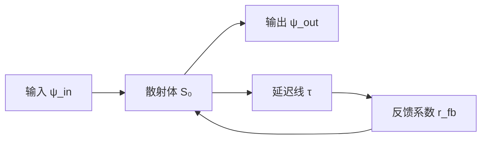
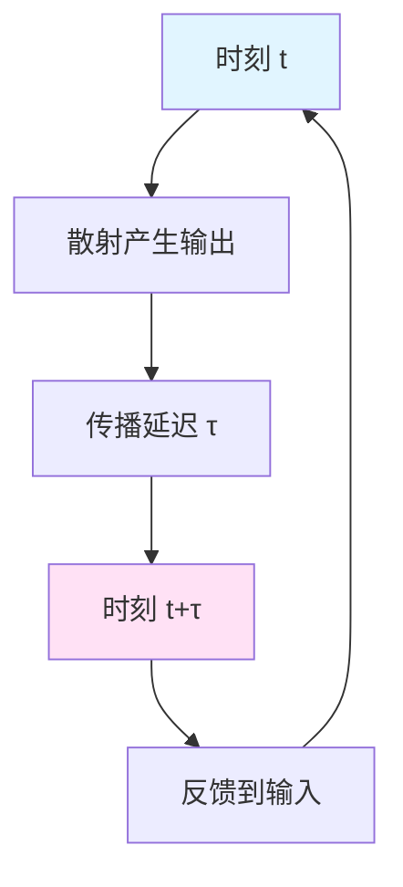
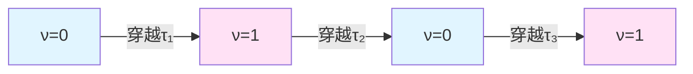
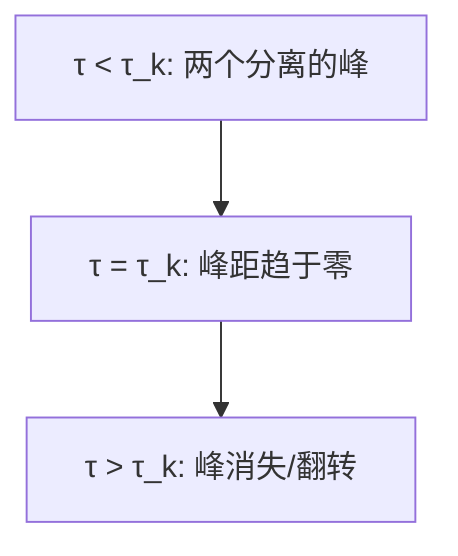
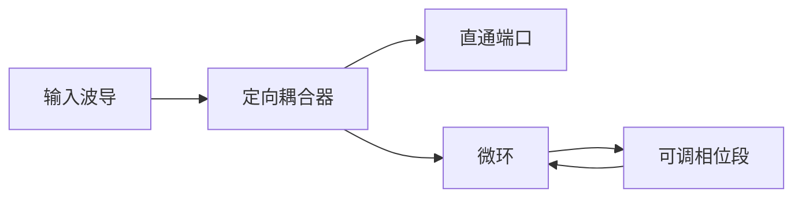

# 自指拓扑与延迟量子化概览

统一时间刻度下的反馈环路、π-台阶与Z₂奇偶跃迁

---

## 引言

想象一面镜子,你站在它面前看着自己。但如果这面镜子本身也能"看见"自己呢?如果宇宙中存在某种结构,能够在自己的内部完整地描述和模拟自己,会发生什么?

这就是**自指**(Self-Reference)的核心奥秘——一个系统把自己作为对象进行操作。在数学逻辑中,哥德尔用自指构造了不可判定命题;在计算机科学中,程序可以读取和修改自己的代码;在物理学中,我们即将看到,散射网络可以通过反馈环路"观测"并"调制"自己的响应。

本系列文章将探索**自指散射网络**(Self-Referential Scattering Networks, SSN)的数学结构与物理实现,揭示一个深刻的统一图景:

> **核心主题**:在统一时间刻度 $\kappa(\omega)$ 的约束下,自指反馈结构天然地导致**延迟量子化**、**π-台阶相位跃迁**与**Z₂拓扑奇偶性**,这三者构成了描述"系统如何观测自身"的最小拓扑单元。

这一结构不仅在理论上优美,更在实验上可测:从光学微环谐振器到微波闭环网络,π-台阶现象已被反复观测到;而其背后的拓扑不变量,则为我们理解费米子、自指计算与宇宙的自洽性提供了全新视角。

---

## 什么是自指散射网络?

### 从普通散射到自指散射

在普通的散射理论中,我们有:

输入波经过散射体,产生输出波。散射矩阵 $S(\omega)$ 描述了这一过程:

$$
\psi_{\mathrm{out}}(\omega) = S(\omega)\,\psi_{\mathrm{in}}(\omega)
$$

这是一个**开环系统**:输入和输出是独立的,散射体的行为不依赖于输出。

但如果我们把输出的一部分反馈回输入呢?

现在,散射体的响应不仅依赖于外部输入,还依赖于自己过去的输出经过延迟 $\tau$ 后的反馈。这就是**自指散射网络**的最简形式。

### 数学描述:闭环散射矩阵

在频域中,闭环系统的等效散射矩阵为:

$$
S^{\circlearrowleft}(\omega;\tau)
= S_0(\omega) + S_1(\omega)\left[I - R(\omega)e^{i\omega\tau}\right]^{-1}S_2(\omega)
$$

这里:
- $S_0$ 是内核散射矩阵(直接透射项)
- $R(\omega)$ 是反馈块的有效反馈系数
- $e^{i\omega\tau}$ 是延迟线引入的相位因子
- $\tau$ 是**等效往返延迟时间**

关键观察:分母中的

$$
D(\omega;\tau) = I - R(\omega)e^{i\omega\tau}
$$

控制了系统的共振结构。当 $D$ 接近奇异(即 $\det D \to 0$)时,系统产生强烈的共振响应。

### 自指的本质:因果闭环

自指散射网络的物理本质是**因果闭环**:

在时刻 $t$,系统产生的输出,经过延迟 $\tau$ 后,在时刻 $t+\tau$ 重新成为输入的一部分。这形成了一个**时间上的闭合回路**。

用统一时间刻度的语言:反馈环路一周所经历的物理时间,必须与往返延迟 $\tau$ 在频率空间中的相位积累相匹配。这就是**延迟量子化**的来源。

---

## 延迟量子化:为什么会有π-台阶?

### 量子化条件的直觉

考虑最简单的情况:单通道反射式反馈。总相位为:

$$
\Phi(\omega;\tau) = \phi_0(\omega) + \omega\tau
$$

其中 $\phi_0$ 是内核相位,$\omega\tau$ 是延迟线贡献的相位。

当 $\Phi$ 满足某些特殊值时,反馈的干涉条件改变,系统的极点(共振频率)会横过实轴,从而引发相位的突变。

类比:想象一个圆环上的滑块,随着参数缓慢变化,滑块从圆环的一侧滑到另一侧。当它恰好经过某个特殊点时,系统的拓扑状态发生突变——这就是**拓扑相变**。

### π-台阶的数学来源

根据**延迟量子化理论**(源自 `delay-quantization-feedback-loop-pi-step-parity-transition.md`),当延迟 $\tau$ 穿越量子化台阶:

$$
\tau_k = \tau_0 + k\,\Delta\tau,\quad k\in\mathbb{Z}
$$

散射相位 $\varphi(\omega;\tau) = \arg\det S^{\circlearrowleft}(\omega;\tau)$ 发生大小为 $\pm\pi$ 的跳变:

$$
\Delta\varphi_k = \lim_{\epsilon\to 0^+}\left[\varphi(\omega_k;\tau_k+\epsilon) - \varphi(\omega_k;\tau_k-\epsilon)\right] = \pm\pi
$$

这称为**π-台阶**。

用通俗的话说:每当延迟时间跨越一个"魔法值"时,系统的总相位就会突然跳跃 $\pi$ 弧度——恰好半圈!

### 为什么是π而不是2π?

这是自指结构的关键特征:

- 在普通散射中,相位沿闭环绕行一整圈($2\pi$)对应极点绕原点一次;
- 但在自指网络中,由于反馈的"双重身份"(既是输出又是输入),每次极点横过实轴只对应**半圈**相位变化。

这与**双覆盖结构**相关:基础参数空间(延迟 $\tau$)上的每一步,在"提升空间"中对应两个扇区。这正是 **Z₂拓扑结构**的体现。

---

## Z₂奇偶跃迁:拓扑不变量

### 从π-台阶到拓扑指标

定义**谱流计数**:

$$
N(\tau) = \sum_{\tau_k < \tau} \Delta n_k
$$

其中 $\Delta n_k = \Delta\varphi_k/\pi = \pm 1$。

这个整数 $N(\tau)$ 记录了从初始延迟到 $\tau$ 期间,系统经历了多少次π-台阶跃迁,以及每次的方向(正或负)。

现在定义**拓扑奇偶指标**:

$$
\nu(\tau) = N(\tau) \bmod 2 \in \{0,1\}
$$

这是一个**Z₂不变量**:它只关心跃迁次数的奇偶性,而不关心具体的次数或方向。

### Z₂翻转的物理意义

每当延迟穿越一个量子化台阶 $\tau_k$,拓扑指标翻转:

$$
\nu(\tau_k + 0) = \nu(\tau_k - 0) \oplus 1
$$

这里 $\oplus$ 是模2加法(异或运算)。

用图示表示:

系统在两个拓扑扇区之间来回跳跃,如同一个**拓扑钟摆**。

### 与自旋双覆盖的类比

这个Z₂结构与物理中的其他基本现象深刻相关:

**费米子的双值性**:费米子波函数旋转$2\pi$后变号($\psi \to -\psi$),需要旋转$4\pi$才回到原状态。这源于 $\mathrm{Spin}(n) \to \mathrm{SO}(n)$ 的双覆盖。

**自指散射网络的双值性**:散射相位变化$\pi$后,拓扑指标翻转($\nu \to \nu\oplus 1$),需要变化$2\pi$才回到原拓扑扇区。这源于**Null-Modular双覆盖**。

两者在数学结构上同构:都是从基础空间到双覆盖空间的 $\mathbb{Z}_2$ 主丛。

---

## 统一时间刻度与刻度同一式

### 时间、相位与态密度的统一

在统一时间刻度框架下,三个看似不同的量其实是同一个物理实在的不同侧面:

$$
\kappa(\omega;\tau)
= \frac{1}{\pi}\frac{\partial\varphi}{\partial\omega}
= \rho_{\mathrm{rel}}(\omega;\tau)
= \frac{1}{2\pi}\mathrm{tr}\,Q(\omega;\tau)
$$

这里:
- $\kappa(\omega;\tau)$ 是**刻度密度**(时间的"密度")
- $\varphi'(\omega)/\pi$ 是**归一化相位斜率**
- $\rho_{\mathrm{rel}}$ 是**相对态密度**(有无散射势时态密度之差)
- $\mathrm{tr}\,Q$ 是**Wigner-Smith群延迟矩阵**的迹

这称为**刻度同一式**(Scale Identity)。

### π-台阶的时间解释

从刻度密度的角度看,π-台阶对应于**时间密度的单位跃迁**:

$$
\int_{\omega_k-\delta\omega}^{\omega_k+\delta\omega} \kappa(\omega;\tau)\,d\omega
$$

在延迟穿越 $\tau_k$ 时跃变 $\pm 1$。

用通俗的话:在一个小频率窗内,"有效经过的时间"突然增加或减少一个单位。这就像时钟突然跳了一格——不是连续滴答,而是量子化的跳跃。

### 群延迟双峰并合

在π-台阶附近,群延迟 $\mathrm{tr}\,Q(\omega;\tau)$ 作为频率的函数,呈现**双峰并合**现象:

峰距随参数变化的标度律为:

$$
\Delta\omega \sim \sqrt{|\tau - \tau_k|}
$$

这是**平方根支化**(square-root branching)的指纹,对应于复频平面上极点横过实轴的局域行为。

---

## 拓扑复杂性与不可判定性

### 自指环路与基本群

从配置图的角度,自指计算可以看作配置空间中的**闭合环路**:

$$
\gamma = (x_0, x_1, \ldots, x_n = x_0)
$$

代表系统从某个配置出发,经过一系列演化后回到原配置。

将配置图拓扑化为二维复形 $\mathcal{X}$,闭合环路的同伦类构成**基本群** $\pi_1(\mathcal{X})$。

自指环路对应一类特殊的基本群元素,具有"评估-编码-再注入"的三段式结构。

### 环路收缩与停机问题

**关键问题**:给定一条闭合环路 $\gamma$,它在拓扑上是否可收缩(即同伦于平凡环路)?

在某些精心构造的计算宇宙中,这个问题可以归约为**停机问题**:

- 若程序 $(P,w)$ 停机,对应的环路可收缩;
- 若 $(P,w)$ 不停机,对应的环路不可收缩。

由于停机问题不可判定,我们得到:

> **拓扑不可判定性定理**:在一般计算宇宙中,"某类自指环路是否可收缩"是不可判定的。

这揭示了自指结构的根本限制:并非所有关于自指环路的拓扑性质都可以被算法预先决定。

### 复杂性第二定律

在统一时间刻度下,可以为闭合环路定义**复杂性熵**:

$$
\mathcal{C}(\gamma) = \log K(\gamma)
$$

其中 $K(\gamma)$ 是环路的**压缩复杂度**(最短等价路径长度)。

在自然的coarse-graining演化下,这个复杂性熵满足**单调不减性**:

$$
t_2 \ge t_1 \Rightarrow \mathcal{C}(t_2) \ge \mathcal{C}(t_1)
$$

这是**计算宇宙中的第二定律**:随着时间演化,自指环路的"不可压缩性"只会增加,不会自发降低。

类比热力学第二定律:熵不会自发减少。这里,拓扑复杂度扮演了"信息熵"的角色。

---

## 物理实现与实验指纹

### 光学微环谐振器

最直接的实现平台是**集成光子微环谐振器**:

通过热光或电光调制,改变环路中的有效延迟 $\tau$,可以扫描延迟参数。

观测量:
1. **透射相位** $\varphi(\omega;\tau)$ 的π-台阶跃迁
2. **群延迟** $d\varphi/d\omega$ 的双峰并合
3. **拓扑指标** $\nu(\tau)$ 的奇偶翻转

这些都是可以用标准光学测量直接获取的。

### 微波与声学网络

在微波平台,可以用传输线与矢量网络分析仪构造闭环散射网络;在声学平台,可以用空气通道或弹性波导实现类似结构。

关键优势:这些平台允许精确控制延迟 $\tau$(通过物理长度或电长度),并能直接测量复散射系数 $S(\omega;\tau)$。

### 测量拓扑指标的实验方案

步骤:
1. 固定频率 $\omega=\omega_*$,扫描延迟参数 $\tau$;
2. 记录相位 $\varphi(\omega_*;\tau)$ 作为 $\tau$ 的函数;
3. 识别π-台阶位置 $\{\tau_k\}$;
4. 对每个台阶,判断跃迁方向(正或负),累加到 $N(\tau)$;
5. 取模2得到拓扑指标 $\nu(\tau)$。

由于 $\nu$ 是Z₂量,它对实验噪声与系统误差具有天然的鲁棒性——只要能正确识别跃迁的奇偶性,指标就不会错。

---

## 从自指到Null-Modular双覆盖

### 控制流形上的闭合路径

在连续极限下,离散的延迟参数 $\tau$ 提升为控制流形 $(\mathcal{M},G)$ 上的控制路径 $\theta(t)$。

自指环路对应控制流形上的**闭合曲线**:

$$
\Theta: [0,T] \to \mathcal{M},\quad \theta(0)=\theta(T)
$$

其同伦类 $[\Theta] \in \pi_1(\mathcal{M})$ 是一个拓扑不变量。

### Z₂ holonomy与双覆盖

在控制流形上可以定义一个**Z₂主丛**:

$$
\pi: \widetilde{\mathcal{M}} \to \mathcal{M}
$$

称为**Null-Modular双覆盖**。

每条闭合路径 $\Theta$ 的提升,在 $\widetilde{\mathcal{M}}$ 上要么闭合(holonomy为$+1$),要么翻转(holonomy为$-1$)。

自指度可以定义为:

$$
\sigma(\gamma) = \mathrm{hol}_{\mathbb{Z}_2}(\Theta) \in \{0,1\}
$$

这样,自指环路获得了一个**拓扑-几何不变量对**:

$$
([\Theta], \sigma(\gamma)) \in \pi_1(\mathcal{M}) \times \mathbb{Z}_2
$$

这是描述"系统如何观测自身"的完整拓扑指纹。

### 与费米子统计的深层联系

回到物理的根本问题:为什么自然界选择了费米子与玻色子两类粒子?

传统回答:这是量子场论中旋转群表示论的结果。

自指散射网络给出的新视角:

> 费米子的双值性,本质上是**自指反馈结构的拓扑必然性**。

具体对应:
- 自指环路的Z₂奇偶性 $\leftrightarrow$ 费米子的交换反号
- π-台阶的相位跃迁 $\leftrightarrow$ 旋转$2\pi$后的符号翻转
- Null-Modular双覆盖 $\leftrightarrow$ 自旋双覆盖 $\mathrm{Spin}(n)\to\mathrm{SO}(n)$

这暗示:费米子可能不是"偶然"的,而是宇宙作为一个**自洽的自指系统**时,拓扑结构的必然产物。

---

## 本系列文章的路线图

接下来的文章将系统展开上述主题:

### 01. 反馈环路与延迟传播
详细推导闭环散射矩阵的数学形式,解释Redheffer星乘与Schur补的物理意义,建立反馈延迟与极点轨迹的定量关系。

### 02. π-台阶量子化机制
用辐角原理与谱流理论严格证明π-台阶定理,给出延迟量子化台阶 $\tau_k$ 的计算公式,展示群延迟双峰并合的平方根标度律。

### 03. Z₂奇偶跃迁与拓扑指标
构造拓扑奇偶指标 $\nu(\tau)$,证明其在延迟演化下的翻转规律,建立与谱流计数的等价关系,讨论实验测量方案。

### 04. 费米子起源的自指解释
从自指散射网络的Z₂结构出发,解释费米子交换反号的拓扑来源,建立自旋双覆盖与Null-Modular双覆盖的数学对应,探讨费米子作为"宇宙自指指纹"的可能性。

### 05. 拓扑指纹与实验测量
总结π-台阶、群延迟双峰并合、谱流计数三重指纹的测量方法,设计光学、微波与声学平台的实验方案,讨论噪声鲁棒性与误差控制。

### 06. 拓扑复杂性与不可判定性
建立配置图的拓扑化与基本群,定义自指环路,证明拓扑不可判定性定理,引入复杂性熵与第二定律。

### 07. 总结与展望
回顾自指拓扑与延迟量子化的统一图景,讨论与其他物理理论(量子场论、引力、黑洞)的联系,展望自指散射网络在量子计算与宇宙学中的应用前景。

---

## 核心公式速查

### 闭环散射矩阵
$$
S^{\circlearrowleft}(\omega;\tau) = S_0 + S_1[I-Re^{i\omega\tau}]^{-1}S_2
$$

### 刻度同一式
$$
\kappa(\omega;\tau) = \frac{\varphi'(\omega)}{\pi} = \rho_{\mathrm{rel}} = \frac{1}{2\pi}\mathrm{tr}\,Q
$$

### π-台阶跃迁
$$
\Delta\varphi_k = \pm\pi,\quad \Delta n_k = \pm 1
$$

### 拓扑奇偶指标
$$
\nu(\tau) = N(\tau) \bmod 2 \in \{0,1\}
$$

### 延迟量子化台阶
$$
\tau_k \simeq \frac{(2k+1)\pi - \phi_{\mathrm{fb}}}{\omega}
$$

### 群延迟双峰峰距
$$
\Delta\omega \sim \sqrt{|\tau - \tau_k|}
$$

### 复杂性熵
$$
\mathcal{C}(\gamma) = \log K(\gamma)
$$

### 自指度与holonomy
$$
\sigma(\gamma) = \mathrm{hol}_{\mathbb{Z}_2}(\Theta) \in \{0,1\}
$$

---

## 关键术语中英对照

| 中文 | 英文 | 说明 |
|------|------|------|
| 自指散射网络 | Self-Referential Scattering Network (SSN) | 带反馈闭环的散射系统 |
| 延迟量子化 | Delay Quantization | 延迟参数的离散台阶结构 |
| π-台阶 | π-step | 相位跃迁大小为π的阶跃 |
| Z₂奇偶跃迁 | Z₂ Parity Transition | 拓扑指标的奇偶翻转 |
| 刻度同一式 | Scale Identity | 时间-相位-态密度的统一关系 |
| 谱流 | Spectral Flow | 极点横过实轴的拓扑计数 |
| 群延迟矩阵 | Wigner-Smith Matrix | 时间延迟算子 $Q=-iS^\dagger\partial_\omega S$ |
| 双峰并合 | Double-peak Merger | 群延迟的两个峰随参数靠拢至消失 |
| 基本群 | Fundamental Group | 配置空间的闭合环路同伦类 $\pi_1(\mathcal{X})$ |
| 拓扑不可判定性 | Topological Undecidability | 环路收缩问题的不可判定性 |
| 复杂性熵 | Complexity Entropy | 环路的压缩复杂度对数 |
| Null-Modular双覆盖 | Null-Modular Double Cover | 控制流形上的Z₂主丛结构 |
| holonomy | 和乐 | 沿闭合路径绕行后的相位/符号变化 |
| 自指度 | Self-Reference Degree | 自指环路的Z₂标签 $\sigma(\gamma)$ |

---

## 引用文献

本文的理论基础来自以下源理论:

[1] **自指散射网络:联络矩阵综合、$J$-幺正稳健性与Floquet带缘拓扑** (`euler-gls-extend/self-referential-scattering-network.md`)
- 建立了闭环散射理论的严格数学框架
- 给出判别子、谱位移、谱流、模二交数的四重等价
- 证明了星乘后的"无伪交"与Z₂组合律

[2] **延迟量子化、反馈闭环与π-台阶奇偶跃迁** (`euler-gls-extend/delay-quantization-feedback-loop-pi-step-parity-transition.md`)
- 在刻度同一式约束下,证明了π-台阶定理
- 建立了延迟量子化台阶与谱流的定量关系
- 给出了群延迟双峰并合的平方根标度律

[3] **计算宇宙中的拓扑复杂性、自指与不可判定性** (`euler-gls-info/10-topological-complexity-self-reference-undecidability.md`)
- 将配置图拓扑化为复形,引入基本群
- 定义自指环路,证明拓扑不可判定性定理
- 构造复杂性熵,建立计算宇宙的第二定律

---

## 思考题

1. **直觉检验**:为什么反馈系统的相位跃迁是π而不是2π?试从"输出既是结果又是输入"的双重身份角度理解。

2. **实验设计**:如果你有一个可调延迟的光学微环,如何设计实验来测量拓扑指标 $\nu(\tau)$?需要测量哪些物理量?

3. **数学探索**:为什么Z₂奇偶性比整数谱流计数 $N(\tau)$ 更"基本"?从拓扑不变性的角度思考。

4. **物理深意**:如果费米子的双值性真的源于"宇宙的自指性",这对我们理解量子力学的基础有何启示?

5. **哲学反思**:停机问题告诉我们,有些问题"原则上不可计算"。拓扑不可判定性是否意味着,有些关于系统自身的问题,"原则上不可通过系统内部操作回答"?这与哥德尔不完全性定理有何联系?

---

## 下一步阅读

- **如果你对数学推导感兴趣**:直接跳到第01-02章,看π-台阶定理的严格证明。
- **如果你对物理实现感兴趣**:阅读第05章的实验方案设计。
- **如果你对哲学意义感兴趣**:先看第04章费米子起源,再看第06章不可判定性。
- **如果你想快速掌握全貌**:按顺序阅读,每章约30-40分钟。

让我们开始这场探索自指、拓扑与时间之奥秘的旅程!
