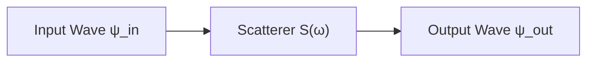
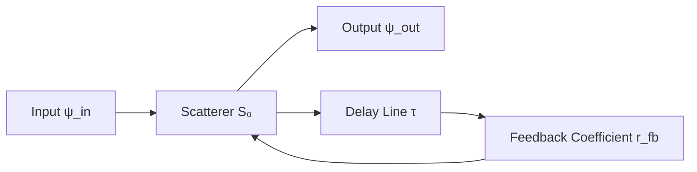
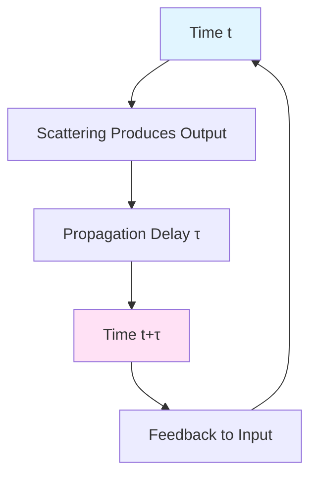
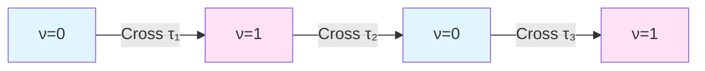
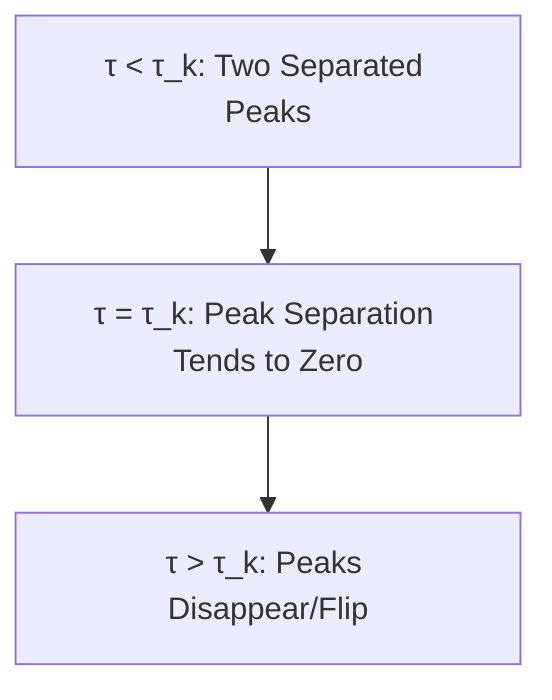
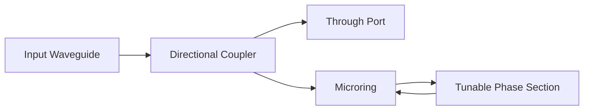

# Self-Reference Topology and Delay Quantization Overview

Feedback Loops, π-Steps, and Z₂ Parity Transitions Under Unified Time Scale

---

## Introduction

Imagine a mirror, you stand in front of it looking at yourself. But what if this mirror itself could also "see" itself? What happens if universe contains some structure that can completely describe and simulate itself within its own interior?

This is core mystery of **Self-Reference**—a system operating on itself as object. In mathematical logic, Gödel used self-reference to construct undecidable propositions; in computer science, programs can read and modify their own code; in physics, we will see that scattering networks can "observe" and "modulate" their own responses through feedback loops.

This article series will explore mathematical structure and physical realization of **Self-Referential Scattering Networks** (SSN), revealing a profound unified picture:

> **Core Theme**: Under constraint of unified time scale $\kappa(\omega)$, self-referential feedback structures naturally lead to **delay quantization**, **π-step phase transitions**, and **Z₂ topological parity**, these three constitute minimal topological unit describing "how system observes itself".

This structure is not only theoretically elegant, but also experimentally measurable: from optical microring resonators to microwave closed-loop networks, π-step phenomena have been repeatedly observed; and underlying topological invariants provide new perspectives for understanding fermions, self-referential computation, and self-consistency of universe.

---

## What Is Self-Referential Scattering Network?

### From Ordinary Scattering to Self-Referential Scattering

In ordinary scattering theory, we have:

Input wave passes through scatterer, produces output wave. Scattering matrix $S(\omega)$ describes this process:

$$
\psi_{\mathrm{out}}(\omega) = S(\omega)\,\psi_{\mathrm{in}}(\omega)
$$

This is an **open-loop system**: input and output are independent, scatterer's behavior doesn't depend on output.

But what if we feed part of output back to input?

Now, scatterer's response depends not only on external input, but also on its own past output after delay $\tau$. This is simplest form of **self-referential scattering network**.

### Mathematical Description: Closed-Loop Scattering Matrix

In frequency domain, equivalent scattering matrix of closed-loop system is:

$$
S^{\circlearrowleft}(\omega;\tau)
= S_0(\omega) + S_1(\omega)\left[I - R(\omega)e^{i\omega\tau}\right]^{-1}S_2(\omega)
$$

Here:
- $S_0$ is kernel scattering matrix (direct transmission term)
- $R(\omega)$ is effective feedback coefficient of feedback block
- $e^{i\omega\tau}$ is phase factor introduced by delay line
- $\tau$ is **equivalent round-trip delay time**

Key observation: Denominator

$$
D(\omega;\tau) = I - R(\omega)e^{i\omega\tau}
$$

controls resonance structure of system. When $D$ approaches singularity (i.e., $\det D \to 0$), system produces strong resonant response.

### Essence of Self-Reference: Causal Closed Loop

Physical essence of self-referential scattering network is **causal closed loop**:

At time $t$, system produces output, after delay $\tau$, at time $t+\tau$ becomes part of input again. This forms a **closed loop in time**.

In language of unified time scale: Physical time experienced by feedback loop in one cycle must match phase accumulation of round-trip delay $\tau$ in frequency space. This is origin of **delay quantization**.

---

## Delay Quantization: Why π-Steps?

### Intuition of Quantization Condition

Consider simplest case: single-channel reflective feedback. Total phase is:

$$
\Phi(\omega;\tau) = \phi_0(\omega) + \omega\tau
$$

where $\phi_0$ is kernel phase, $\omega\tau$ is phase contribution from delay line.

When $\Phi$ satisfies certain special values, interference condition of feedback changes, system's poles (resonance frequencies) cross real axis, triggering phase jump.

Analogy: Imagine a slider on a ring, as parameters slowly change, slider slides from one side of ring to other. When it exactly passes a special point, system's topological state jumps—this is **topological phase transition**.

### Mathematical Origin of π-Steps

According to **delay quantization theory** (from `delay-quantization-feedback-loop-pi-step-parity-transition.md`), when delay $\tau$ crosses quantization step:

$$
\tau_k = \tau_0 + k\,\Delta\tau,\quad k\in\mathbb{Z}
$$

scattering phase $\varphi(\omega;\tau) = \arg\det S^{\circlearrowleft}(\omega;\tau)$ undergoes jump of magnitude $\pm\pi$:

$$
\Delta\varphi_k = \lim_{\epsilon\to 0^+}\left[\varphi(\omega_k;\tau_k+\epsilon) - \varphi(\omega_k;\tau_k-\epsilon)\right] = \pm\pi
$$

This is called **π-step**.

In plain words: Whenever delay time crosses a "magic value", system's total phase suddenly jumps $\pi$ radians—exactly half a circle!

### Why π Instead of 2π?

This is key feature of self-referential structure:

- In ordinary scattering, phase going around closed loop once ($2\pi$) corresponds to pole circling origin once;
- But in self-referential networks, due to feedback's "dual identity" (both output and input), each pole crossing real axis only corresponds to **half-circle** phase change.

This relates to **double cover structure**: Each step on base parameter space (delay $\tau$) corresponds to two sectors in "lifted space". This is exactly manifestation of **Z₂ topological structure**.

---

## Z₂ Parity Transition: Topological Invariant

### From π-Steps to Topological Index

Define **spectral flow count**:

$$
N(\tau) = \sum_{\tau_k < \tau} \Delta n_k
$$

where $\Delta n_k = \Delta\varphi_k/\pi = \pm 1$.

This integer $N(\tau)$ records how many π-step transitions system has undergone from initial delay to $\tau$, and direction of each (positive or negative).

Now define **topological parity index**:

$$
\nu(\tau) = N(\tau) \bmod 2 \in \{0,1\}
$$

This is a **Z₂ invariant**: It only cares about parity of transition count, not specific count or direction.

### Physical Meaning of Z₂ Flip

Whenever delay crosses a quantization step $\tau_k$, topological index flips:

$$
\nu(\tau_k + 0) = \nu(\tau_k - 0) \oplus 1
$$

Here $\oplus$ is modulo 2 addition (XOR operation).

Illustrated:

System jumps back and forth between two topological sectors, like a **topological pendulum**.

### Analogy with Spin Double Cover

This Z₂ structure is deeply related to other fundamental phenomena in physics:

**Fermion Double-Valuedness**: Fermion wavefunction changes sign after $2\pi$ rotation ($\psi \to -\psi$), needs $4\pi$ rotation to return to original state. This originates from double cover $\mathrm{Spin}(n) \to \mathrm{SO}(n)$.

**Self-Referential Scattering Network Double-Valuedness**: After scattering phase changes $\pi$, topological index flips ($\nu \to \nu\oplus 1$), needs $2\pi$ change to return to original topological sector. This originates from **Null-Modular double cover**.

Both are isomorphic in mathematical structure: both are $\mathbb{Z}_2$ principal bundles from base space to double cover space.

---

## Unified Time Scale and Scale Identity

### Unification of Time, Phase, and State Density

Under unified time scale framework, three seemingly different quantities are actually different aspects of same physical reality:

$$
\kappa(\omega;\tau)
= \frac{1}{\pi}\frac{\partial\varphi}{\partial\omega}
= \rho_{\mathrm{rel}}(\omega;\tau)
= \frac{1}{2\pi}\mathrm{tr}\,Q(\omega;\tau)
$$

Here:
- $\kappa(\omega;\tau)$ is **scale density** ("density" of time)
- $\varphi'(\omega)/\pi$ is **normalized phase slope**
- $\rho_{\mathrm{rel}}$ is **relative state density** (difference between state densities with and without scattering potential)
- $\mathrm{tr}\,Q$ is trace of **Wigner-Smith group delay matrix**

This is called **Scale Identity**.

### Time Interpretation of π-Steps

From perspective of scale density, π-step corresponds to **unit jump of time density**:

$$
\int_{\omega_k-\delta\omega}^{\omega_k+\delta\omega} \kappa(\omega;\tau)\,d\omega
$$

jumps $\pm 1$ when delay crosses $\tau_k$.

In plain words: Within a small frequency window, "effectively elapsed time" suddenly increases or decreases by one unit. This is like clock suddenly jumping one tick—not continuous ticking, but quantized jump.

### Group Delay Double-Peak Merger

Near π-step, group delay $\mathrm{tr}\,Q(\omega;\tau)$ as function of frequency exhibits **double-peak merger** phenomenon:

Scaling law of peak separation with parameter change:

$$
\Delta\omega \sim \sqrt{|\tau - \tau_k|}
$$

This is fingerprint of **square-root branching**, corresponding to local behavior of pole crossing real axis in complex frequency plane.

---

## Topological Complexity and Undecidability

### Self-Referential Loops and Fundamental Group

From perspective of configuration graph, self-referential computation can be seen as **closed loops** in configuration space:

$$
\gamma = (x_0, x_1, \ldots, x_n = x_0)
$$

represents system starting from some configuration, after series of evolutions returning to original configuration.

Topologizing configuration graph as two-dimensional complex $\mathcal{X}$, homotopy classes of closed loops form **fundamental group** $\pi_1(\mathcal{X})$.

Self-referential loops correspond to special class of fundamental group elements, having three-stage structure of "evaluate-encode-reinject".

### Loop Contraction and Halting Problem

**Key Question**: Given a closed loop $\gamma$, is it topologically contractible (i.e., homotopic to trivial loop)?

In certain carefully constructed computational universes, this problem can be reduced to **halting problem**:

- If program $(P,w)$ halts, corresponding loop is contractible;
- If $(P,w)$ doesn't halt, corresponding loop is not contractible.

Since halting problem is undecidable, we get:

> **Topological Undecidability Theorem**: In general computational universes, "whether certain self-referential loops are contractible" is undecidable.

This reveals fundamental limitation of self-referential structures: Not all topological properties of self-referential loops can be algorithmically predetermined.

### Second Law of Complexity

Under unified time scale, can define **complexity entropy** for closed loops:

$$
\mathcal{C}(\gamma) = \log K(\gamma)
$$

where $K(\gamma)$ is **compression complexity** of loop (shortest equivalent path length).

Under natural coarse-graining evolution, this complexity entropy satisfies **monotonic non-decrease**:

$$
t_2 \ge t_1 \Rightarrow \mathcal{C}(t_2) \ge \mathcal{C}(t_1)
$$

This is **second law in computational universe**: As time evolves, "incompressibility" of self-referential loops only increases, never spontaneously decreases.

Analogy to second law of thermodynamics: Entropy doesn't spontaneously decrease. Here, topological complexity plays role of "information entropy".

---

## Physical Realization and Experimental Fingerprints

### Optical Microring Resonators

Most direct implementation platform is **integrated photonic microring resonator**:

Through thermo-optic or electro-optic modulation, changing effective delay $\tau$ in loop, can scan delay parameter.

Observables:
1. **Transmission phase** $\varphi(\omega;\tau)$ π-step transitions
2. **Group delay** $d\varphi/d\omega$ double-peak merger
3. **Topological index** $\nu(\tau)$ parity flips

All these can be directly obtained through standard optical measurements.

### Microwave and Acoustic Networks

On microwave platform, can use transmission lines and vector network analyzer to construct closed-loop scattering networks; on acoustic platform, can use air channels or elastic waveguides to realize similar structures.

Key advantage: These platforms allow precise control of delay $\tau$ (through physical length or electrical length), and can directly measure complex scattering coefficient $S(\omega;\tau)$.

### Experimental Scheme for Measuring Topological Index

Steps:
1. Fix frequency $\omega=\omega_*$, scan delay parameter $\tau$;
2. Record phase $\varphi(\omega_*;\tau)$ as function of $\tau$;
3. Identify π-step positions $\{\tau_k\}$;
4. For each step, determine transition direction (positive or negative), accumulate to $N(\tau)$;
5. Take modulo 2 to get topological index $\nu(\tau)$.

Since $\nu$ is Z₂ quantity, it has natural robustness to experimental noise and systematic errors—as long as parity of transitions can be correctly identified, index won't be wrong.

---

## From Self-Reference to Null-Modular Double Cover

### Closed Paths on Control Manifold

In continuum limit, discrete delay parameter $\tau$ lifts to control path $\theta(t)$ on control manifold $(\mathcal{M},G)$.

Self-referential loops correspond to **closed curves** on control manifold:

$$
\Theta: [0,T] \to \mathcal{M},\quad \theta(0)=\theta(T)
$$

Its homotopy class $[\Theta] \in \pi_1(\mathcal{M})$ is a topological invariant.

### Z₂ Holonomy and Double Cover

On control manifold can define a **Z₂ principal bundle**:

$$
\pi: \widetilde{\mathcal{M}} \to \mathcal{M}
$$

called **Null-Modular double cover**.

Lift of each closed path $\Theta$, on $\widetilde{\mathcal{M}}$ either closes (holonomy $+1$) or flips (holonomy $-1$).

Self-reference degree can be defined as:

$$
\sigma(\gamma) = \mathrm{hol}_{\mathbb{Z}_2}(\Theta) \in \{0,1\}
$$

Thus, self-referential loops obtain a **topological-geometric invariant pair**:

$$
([\Theta], \sigma(\gamma)) \in \pi_1(\mathcal{M}) \times \mathbb{Z}_2
$$

This is complete topological fingerprint describing "how system observes itself".

### Deep Connection with Fermion Statistics

Returning to fundamental physics question: Why did nature choose two types of particles, fermions and bosons?

Traditional answer: This is result of rotation group representation theory in quantum field theory.

New perspective from self-referential scattering networks:

> Fermion double-valuedness is essentially **topological necessity of self-referential feedback structures**.

Specific correspondence:
- Z₂ parity of self-referential loops $\leftrightarrow$ exchange sign change of fermions
- π-step phase transitions $\leftrightarrow$ sign flip after $2\pi$ rotation
- Null-Modular double cover $\leftrightarrow$ spin double cover $\mathrm{Spin}(n)\to\mathrm{SO}(n)$

This suggests: Fermions may not be "accidental", but inevitable product of topological structure when universe is a **self-consistent self-referential system**.

---

## Roadmap for This Article Series

Following articles will systematically develop above themes:

### 01. Feedback Loops and Delay Propagation
Detailed derivation of mathematical form of closed-loop scattering matrix, explanation of physical meaning of Redheffer star product and Schur complement, establishment of quantitative relationship between feedback delay and pole trajectories.

### 02. π-Step Quantization Mechanism
Strictly prove π-step theorem using argument principle and spectral flow theory, give calculation formula for delay quantization steps $\tau_k$, demonstrate square-root scaling law of group delay double-peak merger.

### 03. Z₂ Parity Transition and Topological Index
Construct topological parity index $\nu(\tau)$, prove its flip law under delay evolution, establish equivalence with spectral flow count, discuss experimental measurement schemes.

### 04. Self-Referential Explanation of Fermion Origin
Starting from Z₂ structure of self-referential scattering networks, explain topological origin of fermion exchange sign change, establish mathematical correspondence between spin double cover and Null-Modular double cover, explore possibility of fermions as "universe's self-referential fingerprint".

### 05. Topological Fingerprints and Experimental Measurement
Summarize measurement methods of triple fingerprints: π-steps, group delay double-peak merger, spectral flow count, design experimental schemes for optical, microwave, and acoustic platforms, discuss noise robustness and error control.

### 06. Topological Complexity and Undecidability
Establish topologization of configuration graphs and fundamental group, define self-referential loops, prove topological undecidability theorem, introduce complexity entropy and second law.

### 07. Summary and Prospects
Review unified picture of self-referential topology and delay quantization, discuss connections with other physical theories (quantum field theory, gravity, black holes), prospect applications of self-referential scattering networks in quantum computation and cosmology.

---

## Quick Reference of Core Formulas

### Closed-Loop Scattering Matrix
$$
S^{\circlearrowleft}(\omega;\tau) = S_0 + S_1[I-Re^{i\omega\tau}]^{-1}S_2
$$

### Scale Identity
$$
\kappa(\omega;\tau) = \frac{\varphi'(\omega)}{\pi} = \rho_{\mathrm{rel}} = \frac{1}{2\pi}\mathrm{tr}\,Q
$$

### π-Step Transition
$$
\Delta\varphi_k = \pm\pi,\quad \Delta n_k = \pm 1
$$

### Topological Parity Index
$$
\nu(\tau) = N(\tau) \bmod 2 \in \{0,1\}
$$

### Delay Quantization Step
$$
\tau_k \simeq \frac{(2k+1)\pi - \phi_{\mathrm{fb}}}{\omega}
$$

### Group Delay Double-Peak Separation
$$
\Delta\omega \sim \sqrt{|\tau - \tau_k|}
$$

### Complexity Entropy
$$
\mathcal{C}(\gamma) = \log K(\gamma)
$$

### Self-Reference Degree and Holonomy
$$
\sigma(\gamma) = \mathrm{hol}_{\mathbb{Z}_2}(\Theta) \in \{0,1\}
$$

---

## Key Terms Chinese-English Glossary

| Chinese | English | Description |
|---------|---------|-------------|
| 自指散射网络 | Self-Referential Scattering Network (SSN) | Scattering system with feedback closed loop |
| 延迟量子化 | Delay Quantization | Discrete step structure of delay parameter |
| π-台阶 | π-step | Phase transition step of magnitude π |
| Z₂奇偶跃迁 | Z₂ Parity Transition | Parity flip of topological index |
| 刻度同一式 | Scale Identity | Unified relation of time-phase-state density |
| 谱流 | Spectral Flow | Topological count of poles crossing real axis |
| 群延迟矩阵 | Wigner-Smith Matrix | Time delay operator $Q=-iS^\dagger\partial_\omega S$ |
| 双峰并合 | Double-Peak Merger | Two peaks of group delay converging to disappearance with parameter |
| 基本群 | Fundamental Group | Homotopy classes of closed loops in configuration space $\pi_1(\mathcal{X})$ |
| 拓扑不可判定性 | Topological Undecidability | Undecidability of loop contraction problem |
| 复杂性熵 | Complexity Entropy | Logarithm of compression complexity of loop |
| Null-Modular双覆盖 | Null-Modular Double Cover | Z₂ principal bundle structure on control manifold |
| holonomy | Holonomy | Phase/sign change after traversing closed path |
| 自指度 | Self-Reference Degree | Z₂ label of self-referential loop $\sigma(\gamma)$ |

---

## References

Theoretical foundation of this article comes from following source theories:

[1] **Self-Referential Scattering Networks: Connection Matrix Synthesis, $J$-Unitary Robustness, and Floquet Band Edge Topology** (`euler-gls-extend/self-referential-scattering-network.md`)
- Established rigorous mathematical framework of closed-loop scattering theory
- Gave quadruple equivalence of discriminant, spectral shift, spectral flow, modulo 2 intersection number
- Proved "no pseudo-intersection" after star product and Z₂ composition law

[2] **Delay Quantization, Feedback Closed Loops, and π-Step Parity Transitions** (`euler-gls-extend/delay-quantization-feedback-loop-pi-step-parity-transition.md`)
- Under constraint of scale identity, proved π-step theorem
- Established quantitative relationship between delay quantization steps and spectral flow
- Gave square-root scaling law of group delay double-peak merger

[3] **Topological Complexity, Self-Reference, and Undecidability in Computational Universe** (`euler-gls-info/10-topological-complexity-self-reference-undecidability.md`)
- Topologized configuration graphs as complexes, introduced fundamental group
- Defined self-referential loops, proved topological undecidability theorem
- Constructed complexity entropy, established second law of computational universe

---

## Thought Questions

1. **Intuition Check**: Why is phase transition of feedback system π instead of 2π? Try understanding from perspective of "output is both result and input" dual identity.

2. **Experimental Design**: If you have a tunable delay optical microring, how to design experiment to measure topological index $\nu(\tau)$? What physical quantities need to be measured?

3. **Mathematical Exploration**: Why is Z₂ parity more "fundamental" than integer spectral flow count $N(\tau)$? Think from perspective of topological invariance.

4. **Physical Depth**: If fermion double-valuedness really originates from "universe's self-referentiality", what implications does this have for our understanding of foundations of quantum mechanics?

5. **Philosophical Reflection**: Halting problem tells us some problems are "in principle uncomputable". Does topological undecidability mean some questions about system itself are "in principle unanswerable through internal operations of system"? How does this relate to Gödel's incompleteness theorem?

---

## Next Steps for Reading

- **If interested in mathematical derivations**: Jump directly to Sections 01-02, see strict proof of π-step theorem.
- **If interested in physical realization**: Read Section 05 experimental scheme design.
- **If interested in philosophical significance**: First read Section 04 fermion origin, then Section 06 undecidability.
- **If want to quickly grasp full picture**: Read in order, each section about 30-40 minutes.

Let us begin this journey exploring mysteries of self-reference, topology, and time!

