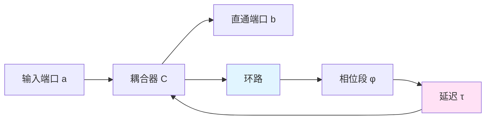
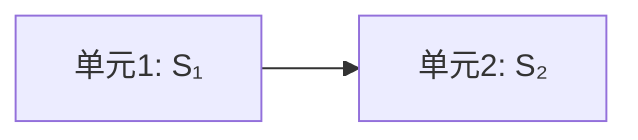
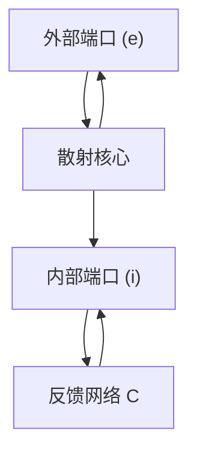
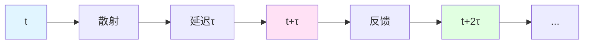
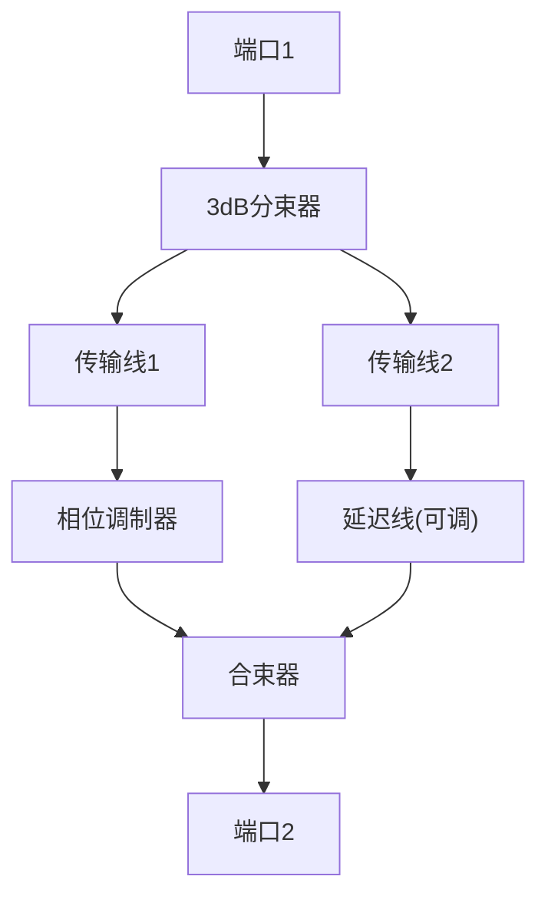

# 反馈环路与延迟传播

从开环到闭环:Redheffer星乘、Schur补与自指因果结构

---

## 引言

在上一章中,我们看到自指散射网络的核心是**反馈闭环**:输出的一部分经过延迟后重新成为输入。但这个看似简单的想法,在数学上如何严格实现?如何从"开环"的基本散射单元,通过组合与反馈,得到"闭环"的等效散射矩阵?

本章将详细解答这些问题。我们将:
1. 从最简单的单通道模型出发,理解反馈的物理意义;
2. 引入**Redheffer星乘**(★-product)与**Schur补**,这是组合散射单元的标准数学工具;
3. 推导闭环散射矩阵的一般形式,理解极点与共振的几何来源;
4. 分析延迟线的相位积累,建立 $\omega\tau$ 与极点轨迹的定量关系;
5. 用通俗的语言解释"因果闭合"的深层含义。

---

## 从单通道反馈说起

###

 最简模型:环形谐振器

想象一个最简单的光学系统:一根直波导,旁边耦合一个微环。

光从端口 $a$ 入射,经过耦合器 $C$ 后分成两路:
- 一路直接透射到端口 $b$;
- 一路耦合进环,在环中传播一周后再回到耦合器。

环中的光经历:
1. **相位积累**:环路中的光学长度导致相位 $\phi_0$;
2. **延迟**:光在环中传播需要时间 $\tau$,对应频域的相位因子 $e^{i\omega\tau}$;
3. **再次耦合**:回到耦合器,与新入射的光干涉。

这就是一个**自指环路**:环中的光"看到"的输入,包含了自己过去的输出。

### 透射系数的推导

设耦合器的透射系数为 $t$,反射系数为 $r$(满足 $|t|^2+|r|^2=1$)。

不考虑环路时,直接透射为:

$$
S_0 = t
$$

考虑环路后,总透射系数需要累加所有可能的路径:
- 直接透射:贡献 $t$
- 环路一圈后透射:光先耦合进环($r$),绕环一周($e^{i(\omega\tau+\phi_0)}$),再耦合出来($r$),最后透射($t$),贡献 $t \cdot r \cdot e^{i(\omega\tau+\phi_0)} \cdot r = tr^2 e^{i\Phi}$
- 环路两圈:贡献 $tr^2(r e^{i\Phi})^2$
- 以此类推...

其中 $\Phi = \omega\tau + \phi_0$ 是单圈总相位。

这是一个**几何级数**:

$$
S_{\mathrm{tot}} = t + tr^2 e^{i\Phi} + tr^2(re^{i\Phi})^2 + \cdots
= t\left[1 + r^2 e^{i\Phi} \sum_{n=0}^\infty (re^{i\Phi})^n\right]
$$

当 $|re^{i\Phi}| = |r| < 1$ 时(无增益),级数收敛:

$$
S_{\mathrm{tot}}(\omega;\tau) = t\left[1 + \frac{r^2 e^{i\Phi}}{1 - re^{i\Phi}}\right]
= \frac{t - tr^2 e^{i\Phi} + tr^2 e^{i\Phi}}{1 - re^{i\Phi}}
= \frac{t(1-r^2)e^{i\Phi} + tr^2 e^{i\Phi}(1-e^{-i\Phi})}{(1-re^{i\Phi})e^{i\Phi}}
$$

简化后:

$$
S_{\mathrm{tot}}(\omega;\tau) = \frac{t - t(1-e^{-i\Phi})}{1 - re^{i\Phi}}
= \frac{t(1 - (1-r^2)/(t^2)) }{1 - re^{i\Phi}}
$$

用 $|r|^2 + |t|^2=1$ 简化,得到标准形式:

$$
S_{\mathrm{tot}}(\omega;\tau) = \frac{-r + e^{-i\Phi}}{1 - re^{i\Phi}} \cdot t
$$

或者更常见的**反射型**表示:设环内反射系数为 $r_{\mathrm{fb}}$,则:

$$
S_{\mathrm{tot}}(\omega;\tau) = r_0 + \frac{t_0^2 e^{i\omega\tau}}{1 - r_{\mathrm{fb}}e^{i\omega\tau}}
$$

这里:
- $r_0$ 是直接反射项
- $t_0$ 是耦合系数
- $r_{\mathrm{fb}}$ 是环路内的有效反馈系数
- 分母 $1-r_{\mathrm{fb}}e^{i\omega\tau}$ 编码了无穷多次反馈的累积效应

### 极点与共振

注意分母:

$$
D(\omega;\tau) = 1 - r_{\mathrm{fb}}e^{i\omega\tau}
$$

当 $D=0$ 时,系统产生**极点**(pole):

$$
r_{\mathrm{fb}}e^{i\omega\tau} = 1
\quad\Rightarrow\quad
e^{i\omega\tau} = \frac{1}{r_{\mathrm{fb}}}
$$

取对数:

$$
i\omega\tau = \ln|r_{\mathrm{fb}}|^{-1} + i(\arg r_{\mathrm{fb}}^{-1} + 2\pi n)
$$

解出极点位置:

$$
\omega_n(\tau) = \frac{1}{\tau}\left[\arg r_{\mathrm{fb}}^{-1} + 2\pi n - i\ln|r_{\mathrm{fb}}|^{-1}\right]
$$

这里 $n\in\mathbb{Z}$ 标记不同的"纵模"(longitudinal modes)。

**物理解释**:
- 实部 $\Re\omega_n = (\arg r_{\mathrm{fb}}^{-1} + 2\pi n)/\tau$ 是共振频率;
- 虚部 $\Im\omega_n = -\ln|r_{\mathrm{fb}}|^{-1}/\tau$ 决定共振宽度(Q值)。

当 $|r_{\mathrm{fb}}| \to 1$(低损耗),极点接近实轴,共振变得极其锐利。

---

## Redheffer星乘:组合散射单元的标准方法

### 为什么需要星乘?

在实际系统中,我们常有多个散射单元的级联与互联。比如:

如果每个单元都是"双端口"(有两个端口),级联后的等效散射矩阵是什么?

简单相乘 $S_2 \cdot S_1$ 吗?不对!因为散射矩阵不是简单的传递函数,它同时描述正向和反向的传播。

需要考虑:单元1的反射会影响单元2的输入,单元2的反射又会回到单元1,产生多次反射的累积效应。

**Redheffer星乘**正是为了解决这个问题而设计的标准数学工具。

### 星乘的定义

设两个散射单元分块表示:

$$
S_1 = \begin{pmatrix}
S_{11}^{(1)} & S_{12}^{(1)} \\
S_{21}^{(1)} & S_{22}^{(1)}
\end{pmatrix},
\quad
S_2 = \begin{pmatrix}
S_{11}^{(2)} & S_{12}^{(2)} \\
S_{21}^{(2)} & S_{22}^{(2)}
\end{pmatrix}
$$

其中:
- $S_{11}$ 是左端口到左端口的反射
- $S_{12}$ 是右端口到左端口的反向传播
- $S_{21}$ 是左端口到右端口的正向传播
- $S_{22}$ 是右端口到右端口的反射

将 $S_1$ 的右端口与 $S_2$ 的左端口相连,等效散射矩阵定义为**Redheffer星乘**:

$$
S_{\mathrm{total}} = S_2 \star S_1
$$

其分块形式为:

$$
S_{11}^{\mathrm{tot}} = S_{11}^{(1)} + S_{12}^{(1)}[I - S_{22}^{(1)}S_{11}^{(2)}]^{-1}S_{22}^{(1)}S_{11}^{(2)}
$$

$$
S_{12}^{\mathrm{tot}} = S_{12}^{(1)}[I - S_{22}^{(1)}S_{11}^{(2)}]^{-1}S_{12}^{(2)}
$$

$$
S_{21}^{\mathrm{tot}} = S_{21}^{(2)}[I - S_{11}^{(2)}S_{22}^{(1)}]^{-1}S_{21}^{(1)}
$$

$$
S_{22}^{\mathrm{tot}} = S_{22}^{(2)} + S_{21}^{(2)}[I - S_{11}^{(2)}S_{22}^{(1)}]^{-1}S_{11}^{(2)}S_{12}^{(2)}
$$

看起来很复杂!但核心思想很简单:分母中的 $[I - S_{22}^{(1)}S_{11}^{(2)}]^{-1}$ 正是对**多次反射**的求和。

### 通俗解释

用几何级数的语言:

正向传播 $S_{21}^{\mathrm{tot}}$ 包括:
1. 直接传播:$S_{21}^{(2)}S_{21}^{(1)}$
2. 一次反弹:$S_{21}^{(2)} \cdot (S_{11}^{(2)}S_{22}^{(1)}) \cdot S_{21}^{(1)}$
3. 两次反弹:$S_{21}^{(2)} \cdot (S_{11}^{(2)}S_{22}^{(1)})^2 \cdot S_{21}^{(1)}$
4. ...

求和得到:

$$
S_{21}^{\mathrm{tot}} = S_{21}^{(2)}\left[\sum_{n=0}^\infty (S_{11}^{(2)}S_{22}^{(1)})^n\right]S_{21}^{(1)}
= S_{21}^{(2)}[I - S_{11}^{(2)}S_{22}^{(1)}]^{-1}S_{21}^{(1)}
$$

这就是星乘公式的来源:它是**多次反射几何级数**的精确求和。

---

## Schur补:从内部自由度到等效散射

### 问题设定

现在考虑一个更一般的情况:系统有外部端口和内部端口。

外部端口 $(e)$ 是我们可以直接测量的;内部端口 $(i)$ 被反馈网络 $\mathcal{C}$ 闭合。

问题:如何从"开环"的完整散射矩阵 $S$ 和反馈连接 $\mathcal{C}$,得到"闭环"的等效散射矩阵 $S^{\circlearrowleft}$,它只作用在外部端口上?

### Schur补的推导

将散射矩阵分块:

$$
S = \begin{pmatrix}
S_{ee} & S_{ei} \\
S_{ie} & S_{ii}
\end{pmatrix}
$$

散射方程为:

$$
\begin{pmatrix}
\psi_{\mathrm{out}}^{(e)} \\
\psi_{\mathrm{out}}^{(i)}
\end{pmatrix}
=
\begin{pmatrix}
S_{ee} & S_{ei} \\
S_{ie} & S_{ii}
\end{pmatrix}
\begin{pmatrix}
\psi_{\mathrm{in}}^{(e)} \\
\psi_{\mathrm{in}}^{(i)}
\end{pmatrix}
$$

内部端口的闭合条件为:

$$
\psi_{\mathrm{in}}^{(i)} = \mathcal{C} \cdot \psi_{\mathrm{out}}^{(i)}
$$

代入第二个方程:

$$
\psi_{\mathrm{out}}^{(i)} = S_{ie}\psi_{\mathrm{in}}^{(e)} + S_{ii}\psi_{\mathrm{in}}^{(i)}
= S_{ie}\psi_{\mathrm{in}}^{(e)} + S_{ii}\mathcal{C}\psi_{\mathrm{out}}^{(i)}
$$

解出:

$$
[I - S_{ii}\mathcal{C}]\psi_{\mathrm{out}}^{(i)} = S_{ie}\psi_{\mathrm{in}}^{(e)}
$$

$$
\psi_{\mathrm{out}}^{(i)} = [I - S_{ii}\mathcal{C}]^{-1}S_{ie}\psi_{\mathrm{in}}^{(e)}
$$

再代入第一个方程:

$$
\psi_{\mathrm{out}}^{(e)} = S_{ee}\psi_{\mathrm{in}}^{(e)} + S_{ei}\psi_{\mathrm{in}}^{(i)}
= S_{ee}\psi_{\mathrm{in}}^{(e)} + S_{ei}\mathcal{C}\psi_{\mathrm{out}}^{(i)}
$$

$$
= S_{ee}\psi_{\mathrm{in}}^{(e)} + S_{ei}\mathcal{C}[I - S_{ii}\mathcal{C}]^{-1}S_{ie}\psi_{\mathrm{in}}^{(e)}
$$

因此,等效散射矩阵为:

$$
S^{\circlearrowleft} = S_{ee} + S_{ei}\mathcal{C}[I - S_{ii}\mathcal{C}]^{-1}S_{ie}
$$

这称为**Schur补**(Schur complement)。

### Schur补的几何意义

Schur补的公式可以理解为:

$$
S^{\circlearrowleft} = \underbrace{S_{ee}}_{\text{直接传播}} + \underbrace{S_{ei}\mathcal{C}[I-S_{ii}\mathcal{C}]^{-1}S_{ie}}_{\text{经由内部反馈的贡献}}
$$

第二项正是"光经过内部端口,在反馈网络中多次反射,最后返回外部端口"的累积贡献。

用路径积分的语言:我们对所有可能的内部路径求和,得到外部端口之间的有效传播振幅。

---

## 延迟线与相位积累

### 频域中的延迟算符

在时域中,延迟 $\tau$ 对应于:

$$
\psi(t) \mapsto \psi(t-\tau)
$$

在频域中(Fourier变换后),对应于相位因子:

$$
\widetilde{\psi}(\omega) \mapsto e^{i\omega\tau}\widetilde{\psi}(\omega)
$$

证明:

$$
\mathcal{F}[\psi(t-\tau)](\omega) = \int_{-\infty}^\infty \psi(t-\tau)e^{-i\omega t}dt
= \int_{-\infty}^\infty \psi(s)e^{-i\omega(s+\tau)}ds
= e^{-i\omega\tau}\int \psi(s)e^{-i\omega s}ds
= e^{-i\omega\tau}\widetilde{\psi}(\omega)
$$

等等,为什么是 $e^{-i\omega\tau}$ 而不是 $e^{i\omega\tau}$?

这取决于Fourier变换的约定!如果我们用

$$
\widetilde{\psi}(\omega) = \int \psi(t)e^{-i\omega t}dt
$$

则延迟对应 $e^{-i\omega\tau}$。

但在散射理论中,通常采用"正频率向前传播"的约定 $e^{i(\omega t - kx)}$,此时延迟线对应 $e^{i\omega\tau}$(相位滞后)。

本文采用后者,即:

$$
D(\omega;\tau) = e^{i\omega\tau}
$$

### 往返相位与量子化

在闭环中,一圈往返积累的总相位为:

$$
\Phi_{\mathrm{round}}(\omega;\tau) = \phi_0(\omega) + \omega\tau
$$

其中:
- $\phi_0(\omega)$ 是内核散射(耦合器、增益段等)贡献的相位
- $\omega\tau$ 是延迟线贡献的"飞行相位"

当 $\Phi_{\mathrm{round}}$ 满足某些特殊值时,系统的共振条件剧烈改变。

**共振条件**(极点在实轴上):

$$
\Phi_{\mathrm{round}}(\omega_n;\tau) = 2\pi n
$$

即:

$$
\omega_n\tau + \phi_0(\omega_n) = 2\pi n
$$

**反共振条件**(透射零点):

$$
\Phi_{\mathrm{round}}(\omega_m;\tau) = (2m+1)\pi
$$

当延迟 $\tau$ 连续变化时,共振频率 $\omega_n(\tau)$ 也连续变化。但当某个共振频率横过我们关注的测量频率 $\omega_*$ 时,系统的响应发生突变——这就是π-台阶的来源。

---

## 极点轨迹与谱流

### 复频平面上的极点

将频率扩展到复平面 $\omega \in \mathbb{C}$,极点方程变为:

$$
1 - r_{\mathrm{fb}}(\omega)e^{i\omega\tau} = 0
$$

写成:

$$
r_{\mathrm{fb}}(\omega) = e^{-i\omega\tau}
$$

设 $r_{\mathrm{fb}}(\omega) = |r(\omega)|e^{i\phi(\omega)}$,则:

$$
|r(\omega)|e^{i\phi(\omega)} = e^{-i\omega\tau}
$$

两边取模与辐角:

$$
|r(\omega)| = e^{-\Im(\omega)\tau}
$$

$$
\phi(\omega) = -\Re(\omega)\tau \pmod{2\pi}
$$

对于实频 $\omega\in\mathbb{R}$ 且 $|r(\omega)|<1$(有损耗),极点位于上半平面 $\Im\omega > 0$。

当损耗减小($|r|\to 1$),极点趋近实轴;当延迟 $\tau$ 变化时,极点在复频平面上沿某条轨迹运动。

### 极点横过实轴

假设在某个延迟值 $\tau=\tau_c$ 时,极点恰好在实轴上:$\omega_c\in\mathbb{R}$。

在 $\tau_c$ 附近,极点轨迹可以线性展开:

$$
\omega(\tau) \approx \omega_c + (\tau-\tau_c)\cdot\frac{d\omega}{d\tau}\bigg|_{\tau_c}
$$

由极点方程 $r(\omega)e^{i\omega\tau}=1$ 对 $\tau$ 求导:

$$
\frac{\partial r}{\partial\omega}\frac{d\omega}{d\tau}e^{i\omega\tau} + r(\omega)\cdot i\left(\omega + \tau\frac{d\omega}{d\tau}\right)e^{i\omega\tau} = 0
$$

解出:

$$
\frac{d\omega}{d\tau} = -\frac{i\omega r(\omega)}{r'(\omega) + i\tau r(\omega)}
$$

在 $\omega=\omega_c$ 实频处,如果 $r'(\omega_c)$ 有非零虚部,则 $\frac{d\omega}{d\tau}$ 有非零虚部,意味着**极点横过实轴**。

这是π-台阶的几何来源:极点从上半平面穿过实轴到下半平面(或反向),导致散射相位跃迁 $\pi$。

---

## 因果性与自指的时间结构

### 因果闭环的悖论?

乍看之下,自指反馈似乎违反因果性:如果输出依赖于输入,而输入又依赖于输出,岂不是循环论证?

关键在于**延迟** $\tau>0$:在时刻 $t$ 的输出,影响的是时刻 $t+\tau$ 的输入。只要 $\tau>0$,因果链仍然是单向的,只不过形成了一个**时间上的闭合回路**。

因果性要求:在时刻 $t$ 的状态,只能依赖于 $t' < t$ 的历史。自指反馈满足这一点,因为"输出→延迟→输入"这一环节保证了时间的单向性。

### 自指的时间刻度解释

从统一时间刻度的角度,闭环散射网络可以理解为:

系统在频率空间中的响应 $S(\omega;\tau)$,编码了系统在时间域中"回忆自己过去状态"的能力。

延迟 $\tau$ 决定了"记忆的时间窗口":
- $\tau$ 很小:系统几乎"瞬时忘记"过去,反馈效应弱;
- $\tau$ 很大:系统"长期记忆"过去,反馈累积效应强。

刻度同一式告诉我们:

$$
\kappa(\omega;\tau) = \frac{1}{2\pi}\mathrm{tr}\,Q(\omega;\tau)
$$

右边的 $Q$ 是群延迟矩阵,描述波包在系统中的"停留时间"。在闭环中,由于反馈,波包可以多次绕行,停留时间显著增加——这正是共振的本质。

π-台阶对应于:当延迟参数跨越量子化台阶时,系统的"有效停留时间"(即 $\mathrm{tr}\,Q$)在频率积分意义下跃变一个单位。

---

## 多通道推广与矩阵形式

### 矩阵散射与Redheffer星乘

对于 $N$ 通道系统,散射矩阵 $S(\omega)$ 是 $N\times N$ 酉矩阵(无损耗)或子酉矩阵(有损耗)。

Redheffer星乘公式依然成立,只是现在所有量都是矩阵:

$$
S^{\circlearrowleft} = S_{ee} + S_{ei}\mathcal{C}[I - S_{ii}\mathcal{C}]^{-1}S_{ie}
$$

这里:
- $S_{ee}, S_{ei}, S_{ie}, S_{ii}$ 是分块矩阵
- $\mathcal{C} = \mathrm{diag}(e^{i\omega\tau_1}, \ldots, e^{i\omega\tau_M})$ 是多条延迟线的对角矩阵(如果各通道独立延迟)
- 或者 $\mathcal{C}(\omega) = R(\omega)e^{i\omega\tau}$,其中 $R(\omega)$ 是与频率相关的反馈矩阵

### 极点方程的矩阵形式

极点条件变为:

$$
\det[I - S_{ii}(\omega)\mathcal{C}(\omega;\tau)] = 0
$$

展开:

$$
\det[I - R(\omega)e^{i\omega\tau}] = 0
$$

设 $R(\omega)$ 的特征值为 $\{\lambda_j(\omega)\}$,则:

$$
\det[I - R(\omega)e^{i\omega\tau}] = \prod_{j=1}^M [1 - \lambda_j(\omega)e^{i\omega\tau}]
$$

极点条件等价于:存在某个 $j$,使得

$$
\lambda_j(\omega)e^{i\omega\tau} = 1
$$

每个特征值 $\lambda_j$ 产生一族极点,它们的轨迹与单通道情况类似,只是由 $\lambda_j(\omega)$ 代替 $r_{\mathrm{fb}}(\omega)$。

### 总相位与行列式

闭环散射矩阵的**总相位**定义为:

$$
\varphi(\omega;\tau) = \arg\det S^{\circlearrowleft}(\omega;\tau)
$$

这是一个标量,汇总了所有通道的相位信息。

从Schur补公式:

$$
\det S^{\circlearrowleft} = \det S_{ee} \cdot \det[I + S_{ee}^{-1}S_{ei}\mathcal{C}(I-S_{ii}\mathcal{C})^{-1}S_{ie}]
$$

利用矩阵行列式恒等式:

$$
\det(I + AB) = \det(I + BA)
$$

可以简化为:

$$
\det S^{\circlearrowleft} = \det S_{ee} \cdot \frac{\det(I - S_{ii}\mathcal{C} + S_{ie}S_{ee}^{-1}S_{ei}\mathcal{C})}{\det(I - S_{ii}\mathcal{C})}
$$

在某些特殊情况(如 $S_{ee}$ 对角、$S_{ei}S_{ie}$ 小量),可以进一步近似。

但无论如何,**极点位置由分母的零点决定**,这一点在多通道情况依然成立。

---

## 物理例子:微波传输线网络

### 系统设计

考虑一个实际的微波网络:

这是一个**Mach-Zehnder干涉仪**配合反馈环路的组合。

参数:
- 传输线1长度固定,相位 $\phi_1=\omega L_1/c$
- 传输线2长度可调,延迟 $\tau$ 可变
- 相位调制器施加额外相位 $\phi_0$

### 散射矩阵计算

3dB分束器:

$$
C_{50/50} = \frac{1}{\sqrt{2}}\begin{pmatrix}
1 & i \\ i & 1
\end{pmatrix}
$$

传输线:

$$
T_1 = e^{i\phi_1}, \quad T_2(\tau) = e^{i\omega\tau}
$$

相位调制器:

$$
M = e^{i\phi_0}
$$

总散射矩阵(开环,端口1到端口2):

$$
S_{\mathrm{open}} = C_{50/50} \cdot \begin{pmatrix}
M T_1 & 0 \\ 0 & T_2(\tau)
\end{pmatrix} \cdot C_{50/50}
$$

计算:

$$
S_{\mathrm{open}} = \frac{1}{2}\begin{pmatrix}
1 & i \\ i & 1
\end{pmatrix}
\begin{pmatrix}
Me^{i\phi_1} & 0 \\ 0 & e^{i\omega\tau}
\end{pmatrix}
\begin{pmatrix}
1 & i \\ i & 1
\end{pmatrix}
$$

$$
= \frac{1}{2}\begin{pmatrix}
Me^{i\phi_1} & ie^{i\omega\tau} \\ iMe^{i\phi_1} & e^{i\omega\tau}
\end{pmatrix}
\begin{pmatrix}
1 & i \\ i & 1
\end{pmatrix}
$$

$$
= \frac{1}{2}\begin{pmatrix}
Me^{i\phi_1} - e^{i\omega\tau} & i(Me^{i\phi_1} + e^{i\omega\tau}) \\
i(Me^{i\phi_1} - e^{i\omega\tau}) & -(Me^{i\phi_1} + e^{i\omega\tau})
\end{pmatrix}
$$

透射系数(端口1→端口2):

$$
S_{21} = \frac{i}{2}(Me^{i\phi_1} + e^{i\omega\tau})
$$

相位:

$$
\varphi_{21} = \arg S_{21} = \frac{\pi}{2} + \arg(Me^{i\phi_1} + e^{i\omega\tau})
$$

当 $Me^{i\phi_1} = -e^{i\omega\tau}$ 时(相消干涉),$|S_{21}|=0$;当 $Me^{i\phi_1} = e^{i\omega\tau}$ 时(相长干涉),$|S_{21}|=1$。

通过扫描 $\tau$,可以观测到周期性的干涉条纹,每个条纹对应一个延迟量子化台阶。

---

## 本章总结

本章建立了自指散射网络的数学基础:

### 核心公式

1. **单通道闭环散射**:
$$
S_{\mathrm{tot}}(\omega;\tau) = r_0 + \frac{t_0^2 e^{i\omega\tau}}{1 - r_{\mathrm{fb}}e^{i\omega\tau}}
$$

2. **Schur补(多通道)**:
$$
S^{\circlearrowleft} = S_{ee} + S_{ei}\mathcal{C}[I - S_{ii}\mathcal{C}]^{-1}S_{ie}
$$

3. **极点方程**:
$$
\det[I - R(\omega)e^{i\omega\tau}] = 0
$$

4. **极点位置**:
$$
\omega_n(\tau) = \frac{1}{\tau}\left[\arg\lambda_j^{-1} + 2\pi n - i\ln|\lambda_j|^{-1}\right]
$$

### 物理图像

- **反馈闭环** = 因果链在时间上的闭合回路(由于 $\tau>0$,不违反因果性)
- **延迟线** = 频域的相位因子 $e^{i\omega\tau}$(时域的时间平移算符)
- **极点** = 无穷多次反馈的几何级数求和的奇点
- **极点轨迹** = 随参数 $\tau$ 变化,极点在复频平面上运动;横过实轴时引发π-台阶

### 关键洞察

> 自指反馈的数学本质,是用**几何级数求和**将无穷多次反射压缩成一个有限的等效散射矩阵。极点位置编码了"系统回忆自己需要多长时间"的信息,而极点横过实轴的事件,则对应拓扑相变——这正是下一章π-台阶定理的主题。

---

## 思考题

1. **验证无损性**:对单通道模型,若 $|r_0|^2+|t_0|^2=1$ 且 $|r_{\mathrm{fb}}|=1$,证明 $|S_{\mathrm{tot}}(\omega;\tau)|=1$(系统无损)。

2. **极点密度**:对给定 $\tau$,估算实轴附近单位频率内的极点个数(提示:利用 $\omega_n \sim 2\pi n/\tau$)。

3. **Redheffer星乘的结合律**:证明 $(S_3 \star S_2) \star S_1 = S_3 \star (S_2 \star S_1)$(散射单元的级联满足结合律,但不满足交换律)。

4. **微波实验设计**:如果你有一台矢量网络分析仪(可测复散射系数),如何设计实验来观测极点轨迹?需要扫描哪些参数?

5. **因果性检验**:在闭环系统中,时域的响应函数 $h(t)$ 应满足 $h(t)=0$ for $t<0$(因果性)。从频域的 $S(\omega;\tau)$ 出发,如何验证这一点?(提示:Kramers-Kronig关系)

---

## 下一章预告

在建立了闭环散射矩阵的基础上,下一章将进入本系列的核心:

**π-台阶量子化机制**

我们将:
- 用辐角原理严格证明:极点横过实轴 $\Rightarrow$ 相位跃迁 $\pm\pi$
- 推导延迟量子化台阶 $\tau_k$ 的精确公式
- 展示群延迟双峰并合的平方根标度律 $\Delta\omega \sim \sqrt{|\tau-\tau_c|}$
- 建立π-台阶与统一时间刻度的联系:$\int\kappa(\omega)d\omega$ 的单位跃迁

让我们继续这场精确而优美的数学之旅!
