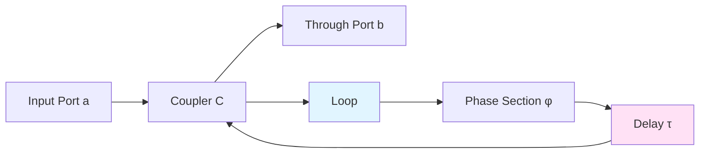
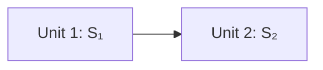
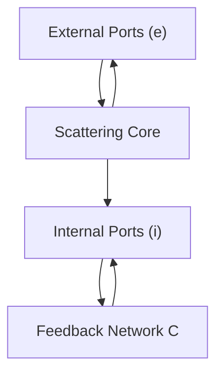
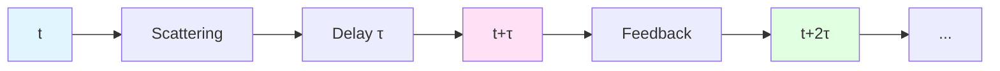
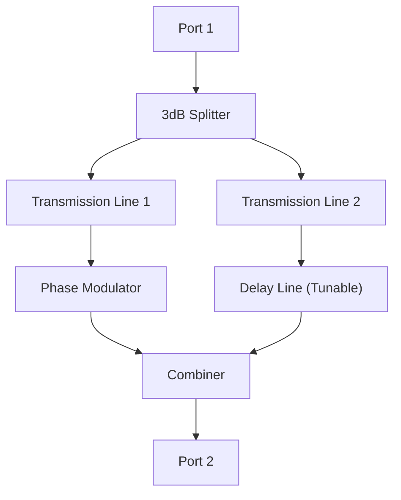

# Feedback Loops and Delay Propagation

From Open Loop to Closed Loop: Redheffer Star Product, Schur Complement, and Self-Referential Causal Structure

---

## Introduction

In previous chapter, we saw core of self-referential scattering networks is **feedback closed loop**: Part of output after delay becomes input again. But how is this seemingly simple idea rigorously realized mathematically? How to obtain "closed-loop" equivalent scattering matrix from "open-loop" basic scattering units through combination and feedback?

This chapter will answer these questions in detail. We will:
1. Start from simplest single-channel model, understand physical meaning of feedback;
2. Introduce **Redheffer star product** (★-product) and **Schur complement**, standard mathematical tools for combining scattering units;
3. Derive general form of closed-loop scattering matrix, understand geometric origin of poles and resonances;
4. Analyze phase accumulation of delay lines, establish quantitative relationship between $\omega\tau$ and pole trajectories;
5. Explain deep meaning of "causal closure" in plain language.

---

## Starting from Single-Channel Feedback

### Simplest Model: Ring Resonator

Imagine simplest optical system: A straight waveguide, with a microring coupled beside it.

Light incident from port $a$, after passing through coupler $C$, splits into two paths:
- One directly transmits to port $b$;
- One couples into ring, propagates around ring once then returns to coupler.

Light in ring experiences:
1. **Phase Accumulation**: Optical length in loop causes phase $\phi_0$;
2. **Delay**: Light propagation in ring takes time $\tau$, corresponding to phase factor $e^{i\omega\tau}$ in frequency domain;
3. **Re-coupling**: Returns to coupler, interferes with newly incident light.

This is a **self-referential loop**: Light in ring "sees" input that includes its own past output.

### Derivation of Transmission Coefficient

Let transmission coefficient of coupler be $t$, reflection coefficient be $r$ (satisfying $|t|^2+|r|^2=1$).

Without considering loop, direct transmission is:

$$
S_0 = t
$$

Considering loop, total transmission coefficient needs to sum all possible paths:
- Direct transmission: contribution $t$
- Transmission after one loop: Light first couples into ring ($r$), goes around ring once ($e^{i(\omega\tau+\phi_0)}$), couples out ($r$), finally transmits ($t$), contribution $t \cdot r \cdot e^{i(\omega\tau+\phi_0)} \cdot r = tr^2 e^{i\Phi}$
- Two loops: contribution $tr^2(r e^{i\Phi})^2$
- And so on...

where $\Phi = \omega\tau + \phi_0$ is total phase for one round.

This is a **geometric series**:

$$
S_{\mathrm{tot}} = t + tr^2 e^{i\Phi} + tr^2(re^{i\Phi})^2 + \cdots
= t\left[1 + r^2 e^{i\Phi} \sum_{n=0}^\infty (re^{i\Phi})^n\right]
$$

When $|re^{i\Phi}| = |r| < 1$ (no gain), series converges:

$$
S_{\mathrm{tot}}(\omega;\tau) = t\left[1 + \frac{r^2 e^{i\Phi}}{1 - re^{i\Phi}}\right]
= \frac{t - tr^2 e^{i\Phi} + tr^2 e^{i\Phi}}{1 - re^{i\Phi}}
= \frac{t(1-r^2)e^{i\Phi} + tr^2 e^{i\Phi}(1-e^{-i\Phi})}{(1-re^{i\Phi})e^{i\Phi}}
$$

After simplification:

$$
S_{\mathrm{tot}}(\omega;\tau) = \frac{t - t(1-e^{-i\Phi})}{1 - re^{i\Phi}}
= \frac{t(1 - (1-r^2)/(t^2)) }{1 - re^{i\Phi}}
$$

Using $|r|^2 + |t|^2=1$ to simplify, get standard form:

$$
S_{\mathrm{tot}}(\omega;\tau) = \frac{-r + e^{-i\Phi}}{1 - re^{i\Phi}} \cdot t
$$

Or more common **reflection-type** representation: Let reflection coefficient inside ring be $r_{\mathrm{fb}}$, then:

$$
S_{\mathrm{tot}}(\omega;\tau) = r_0 + \frac{t_0^2 e^{i\omega\tau}}{1 - r_{\mathrm{fb}}e^{i\omega\tau}}
$$

Here:
- $r_0$ is direct reflection term
- $t_0$ is coupling coefficient
- $r_{\mathrm{fb}}$ is effective feedback coefficient inside loop
- Denominator $1-r_{\mathrm{fb}}e^{i\omega\tau}$ encodes cumulative effect of infinite feedbacks

### Poles and Resonances

Note denominator:

$$
D(\omega;\tau) = 1 - r_{\mathrm{fb}}e^{i\omega\tau}
$$

When $D=0$, system produces **pole**:

$$
r_{\mathrm{fb}}e^{i\omega\tau} = 1
\quad\Rightarrow\quad
e^{i\omega\tau} = \frac{1}{r_{\mathrm{fb}}}
$$

Taking logarithm:

$$
i\omega\tau = \ln|r_{\mathrm{fb}}|^{-1} + i(\arg r_{\mathrm{fb}}^{-1} + 2\pi n)
$$

Solving for pole position:

$$
\omega_n(\tau) = \frac{1}{\tau}\left[\arg r_{\mathrm{fb}}^{-1} + 2\pi n - i\ln|r_{\mathrm{fb}}|^{-1}\right]
$$

Here $n\in\mathbb{Z}$ labels different "longitudinal modes".

**Physical Interpretation**:
- Real part $\Re\omega_n = (\arg r_{\mathrm{fb}}^{-1} + 2\pi n)/\tau$ is resonance frequency;
- Imaginary part $\Im\omega_n = -\ln|r_{\mathrm{fb}}|^{-1}/\tau$ determines resonance width (Q factor).

When $|r_{\mathrm{fb}}| \to 1$ (low loss), poles approach real axis, resonance becomes extremely sharp.

---

## Redheffer Star Product: Standard Method for Combining Scattering Units

### Why Star Product?

In practical systems, we often have cascading and interconnection of multiple scattering units. For example:

If each unit is "two-port" (has two ports), what is equivalent scattering matrix after cascading?

Simple multiplication $S_2 \cdot S_1$? Wrong! Because scattering matrix is not simple transfer function, it simultaneously describes forward and backward propagation.

Need to consider: Reflection from unit 1 affects input to unit 2, reflection from unit 2 returns to unit 1, producing cumulative effect of multiple reflections.

**Redheffer star product** is exactly standard mathematical tool designed to solve this problem.

### Definition of Star Product

Let two scattering units in block form:

$$
S_1 = \begin{pmatrix}
S_{11}^{(1)} & S_{12}^{(1)} \\
S_{21}^{(1)} & S_{22}^{(1)}
\end{pmatrix},
\quad
S_2 = \begin{pmatrix}
S_{11}^{(2)} & S_{12}^{(2)} \\
S_{21}^{(2)} & S_{22}^{(2)}
\end{pmatrix}
$$

where:
- $S_{11}$ is reflection from left port to left port
- $S_{12}$ is backward propagation from right port to left port
- $S_{21}$ is forward propagation from left port to right port
- $S_{22}$ is reflection from right port to right port

Connecting right port of $S_1$ to left port of $S_2$, equivalent scattering matrix is defined as **Redheffer star product**:

$$
S_{\mathrm{total}} = S_2 \star S_1
$$

Its block form is:

$$
S_{11}^{\mathrm{tot}} = S_{11}^{(1)} + S_{12}^{(1)}[I - S_{22}^{(1)}S_{11}^{(2)}]^{-1}S_{22}^{(1)}S_{11}^{(2)}
$$

$$
S_{12}^{\mathrm{tot}} = S_{12}^{(1)}[I - S_{22}^{(1)}S_{11}^{(2)}]^{-1}S_{12}^{(2)}
$$

$$
S_{21}^{\mathrm{tot}} = S_{21}^{(2)}[I - S_{11}^{(2)}S_{22}^{(1)}]^{-1}S_{21}^{(1)}
$$

$$
S_{22}^{\mathrm{tot}} = S_{22}^{(2)} + S_{21}^{(2)}[I - S_{11}^{(2)}S_{22}^{(1)}]^{-1}S_{11}^{(2)}S_{12}^{(2)}
$$

Looks complicated! But core idea is simple: Denominator $[I - S_{22}^{(1)}S_{11}^{(2)}]^{-1}$ is exactly sum over **multiple reflections**.

### Plain Explanation

In language of geometric series:

Forward propagation $S_{21}^{\mathrm{tot}}$ includes:
1. Direct propagation: $S_{21}^{(2)}S_{21}^{(1)}$
2. One bounce: $S_{21}^{(2)} \cdot (S_{11}^{(2)}S_{22}^{(1)}) \cdot S_{21}^{(1)}$
3. Two bounces: $S_{21}^{(2)} \cdot (S_{11}^{(2)}S_{22}^{(1)})^2 \cdot S_{21}^{(1)}$
4. ...

Summing gives:

$$
S_{21}^{\mathrm{tot}} = S_{21}^{(2)}\left[\sum_{n=0}^\infty (S_{11}^{(2)}S_{22}^{(1)})^n\right]S_{21}^{(1)}
= S_{21}^{(2)}[I - S_{11}^{(2)}S_{22}^{(1)}]^{-1}S_{21}^{(1)}
$$

This is origin of star product formula: It is exact sum of **geometric series of multiple reflections**.

---

## Schur Complement: From Internal Degrees of Freedom to Equivalent Scattering

### Problem Setup

Now consider more general case: System has external ports and internal ports.

External ports $(e)$ are what we can directly measure; internal ports $(i)$ are closed by feedback network $\mathcal{C}$.

Question: How to obtain "closed-loop" equivalent scattering matrix $S^{\circlearrowleft}$ acting only on external ports, from "open-loop" complete scattering matrix $S$ and feedback connection $\mathcal{C}$?

### Derivation of Schur Complement

Partition scattering matrix:

$$
S = \begin{pmatrix}
S_{ee} & S_{ei} \\
S_{ie} & S_{ii}
\end{pmatrix}
$$

Scattering equations:

$$
\begin{pmatrix}
\psi_{\mathrm{out}}^{(e)} \\
\psi_{\mathrm{out}}^{(i)}
\end{pmatrix}
=
\begin{pmatrix}
S_{ee} & S_{ei} \\
S_{ie} & S_{ii}
\end{pmatrix}
\begin{pmatrix}
\psi_{\mathrm{in}}^{(e)} \\
\psi_{\mathrm{in}}^{(i)}
\end{pmatrix}
$$

Closure condition for internal ports:

$$
\psi_{\mathrm{in}}^{(i)} = \mathcal{C} \cdot \psi_{\mathrm{out}}^{(i)}
$$

Substituting into second equation:

$$
\psi_{\mathrm{out}}^{(i)} = S_{ie}\psi_{\mathrm{in}}^{(e)} + S_{ii}\psi_{\mathrm{in}}^{(i)}
= S_{ie}\psi_{\mathrm{in}}^{(e)} + S_{ii}\mathcal{C}\psi_{\mathrm{out}}^{(i)}
$$

Solving:

$$
[I - S_{ii}\mathcal{C}]\psi_{\mathrm{out}}^{(i)} = S_{ie}\psi_{\mathrm{in}}^{(e)}
$$

$$
\psi_{\mathrm{out}}^{(i)} = [I - S_{ii}\mathcal{C}]^{-1}S_{ie}\psi_{\mathrm{in}}^{(e)}
$$

Substituting into first equation:

$$
\psi_{\mathrm{out}}^{(e)} = S_{ee}\psi_{\mathrm{in}}^{(e)} + S_{ei}\psi_{\mathrm{in}}^{(i)}
= S_{ee}\psi_{\mathrm{in}}^{(e)} + S_{ei}\mathcal{C}\psi_{\mathrm{out}}^{(i)}
$$

$$
= S_{ee}\psi_{\mathrm{in}}^{(e)} + S_{ei}\mathcal{C}[I - S_{ii}\mathcal{C}]^{-1}S_{ie}\psi_{\mathrm{in}}^{(e)}
$$

Therefore, equivalent scattering matrix is:

$$
S^{\circlearrowleft} = S_{ee} + S_{ei}\mathcal{C}[I - S_{ii}\mathcal{C}]^{-1}S_{ie}
$$

This is called **Schur complement**.

### Geometric Meaning of Schur Complement

Schur complement formula can be understood as:

$$
S^{\circlearrowleft} = \underbrace{S_{ee}}_{\text{direct propagation}} + \underbrace{S_{ei}\mathcal{C}[I-S_{ii}\mathcal{C}]^{-1}S_{ie}}_{\text{contribution via internal feedback}}
$$

Second term is exactly cumulative contribution of "light passing through internal ports, reflecting multiple times in feedback network, finally returning to external ports".

In language of path integrals: We sum over all possible internal paths, obtaining effective propagation amplitude between external ports.

---

## Delay Lines and Phase Accumulation

### Delay Operator in Frequency Domain

In time domain, delay $\tau$ corresponds to:

$$
\psi(t) \mapsto \psi(t-\tau)
$$

In frequency domain (after Fourier transform), corresponds to phase factor:

$$
\widetilde{\psi}(\omega) \mapsto e^{i\omega\tau}\widetilde{\psi}(\omega)
$$

Proof:

$$
\mathcal{F}[\psi(t-\tau)](\omega) = \int_{-\infty}^\infty \psi(t-\tau)e^{-i\omega t}dt
= \int_{-\infty}^\infty \psi(s)e^{-i\omega(s+\tau)}ds
= e^{-i\omega\tau}\int \psi(s)e^{-i\omega s}ds
= e^{-i\omega\tau}\widetilde{\psi}(\omega)
$$

Wait, why $e^{-i\omega\tau}$ instead of $e^{i\omega\tau}$?

This depends on Fourier transform convention! If we use

$$
\widetilde{\psi}(\omega) = \int \psi(t)e^{-i\omega t}dt
$$

then delay corresponds to $e^{-i\omega\tau}$.

But in scattering theory, usually adopt convention "positive frequency forward propagation" $e^{i(\omega t - kx)}$, then delay line corresponds to $e^{i\omega\tau}$ (phase lag).

This article adopts latter, i.e.:

$$
D(\omega;\tau) = e^{i\omega\tau}
$$

### Round-Trip Phase and Quantization

In closed loop, total phase accumulated in one round trip:

$$
\Phi_{\mathrm{round}}(\omega;\tau) = \phi_0(\omega) + \omega\tau
$$

where:
- $\phi_0(\omega)$ is phase contributed by kernel scattering (coupler, gain section, etc.)
- $\omega\tau$ is "flight phase" contributed by delay line

When $\Phi_{\mathrm{round}}$ satisfies certain special values, resonance conditions of system drastically change.

**Resonance Condition** (pole on real axis):

$$
\Phi_{\mathrm{round}}(\omega_n;\tau) = 2\pi n
$$

That is:

$$
\omega_n\tau + \phi_0(\omega_n) = 2\pi n
$$

**Anti-Resonance Condition** (transmission zero):

$$
\Phi_{\mathrm{round}}(\omega_m;\tau) = (2m+1)\pi
$$

When delay $\tau$ continuously changes, resonance frequencies $\omega_n(\tau)$ also continuously change. But when some resonance frequency crosses measurement frequency $\omega_*$ we care about, system response jumps—this is origin of π-step.

---

## Pole Trajectories and Spectral Flow

### Poles in Complex Frequency Plane

Extending frequency to complex plane $\omega \in \mathbb{C}$, pole equation becomes:

$$
1 - r_{\mathrm{fb}}(\omega)e^{i\omega\tau} = 0
$$

Writing as:

$$
r_{\mathrm{fb}}(\omega) = e^{-i\omega\tau}
$$

Let $r_{\mathrm{fb}}(\omega) = |r(\omega)|e^{i\phi(\omega)}$, then:

$$
|r(\omega)|e^{i\phi(\omega)} = e^{-i\omega\tau}
$$

Taking modulus and argument on both sides:

$$
|r(\omega)| = e^{-\Im(\omega)\tau}
$$

$$
\phi(\omega) = -\Re(\omega)\tau \pmod{2\pi}
$$

For real frequency $\omega\in\mathbb{R}$ and $|r(\omega)|<1$ (with loss), poles located in upper half-plane $\Im\omega > 0$.

When loss decreases ($|r|\to 1$), poles approach real axis; when delay $\tau$ changes, poles move along some trajectory in complex frequency plane.

### Pole Crossing Real Axis

Assume at some delay value $\tau=\tau_c$, pole exactly on real axis: $\omega_c\in\mathbb{R}$.

Near $\tau_c$, pole trajectory can be linearly expanded:

$$
\omega(\tau) \approx \omega_c + (\tau-\tau_c)\cdot\frac{d\omega}{d\tau}\bigg|_{\tau_c}
$$

Differentiating pole equation $r(\omega)e^{i\omega\tau}=1$ with respect to $\tau$:

$$
\frac{\partial r}{\partial\omega}\frac{d\omega}{d\tau}e^{i\omega\tau} + r(\omega)\cdot i\left(\omega + \tau\frac{d\omega}{d\tau}\right)e^{i\omega\tau} = 0
$$

Solving:

$$
\frac{d\omega}{d\tau} = -\frac{i\omega r(\omega)}{r'(\omega) + i\tau r(\omega)}
$$

At $\omega=\omega_c$ real frequency, if $r'(\omega_c)$ has non-zero imaginary part, then $\frac{d\omega}{d\tau}$ has non-zero imaginary part, meaning **pole crosses real axis**.

This is geometric origin of π-step: Pole crosses from upper half-plane through real axis to lower half-plane (or reverse), causing scattering phase jump $\pi$.

---

## Causality and Temporal Structure of Self-Reference

### Paradox of Causal Closed Loop?

At first glance, self-referential feedback seems to violate causality: If output depends on input, and input depends on output, isn't this circular reasoning?

Key is **delay** $\tau>0$: Output at time $t$ affects input at time $t+\tau$. As long as $\tau>0$, causal chain remains unidirectional, just forms a **closed loop in time**.

Causality requires: State at time $t$ can only depend on history $t' < t$. Self-referential feedback satisfies this, because "output→delay→input" link guarantees unidirectionality of time.

### Time Scale Interpretation of Self-Reference

From perspective of unified time scale, closed-loop scattering network can be understood as:

System's response in frequency space $S(\omega;\tau)$ encodes system's ability to "remember its own past states" in time domain.

Delay $\tau$ determines "memory time window":
- $\tau$ small: System almost "instantly forgets" past, feedback effect weak;
- $\tau$ large: System "long-term remembers" past, feedback cumulative effect strong.

Scale identity tells us:

$$
\kappa(\omega;\tau) = \frac{1}{2\pi}\mathrm{tr}\,Q(\omega;\tau)
$$

Right side $Q$ is group delay matrix, describing "dwell time" of wave packet in system. In closed loop, due to feedback, wave packet can circulate multiple times, dwell time significantly increases—this is essence of resonance.

π-step corresponds to: When delay parameter crosses quantization step, system's "effective dwell time" (i.e., $\mathrm{tr}\,Q$) jumps one unit in sense of frequency integral.

---

## Multi-Channel Generalization and Matrix Form

### Matrix Scattering and Redheffer Star Product

For $N$-channel system, scattering matrix $S(\omega)$ is $N\times N$ unitary matrix (lossless) or sub-unitary matrix (with loss).

Redheffer star product formula still holds, just now all quantities are matrices:

$$
S^{\circlearrowleft} = S_{ee} + S_{ei}\mathcal{C}[I - S_{ii}\mathcal{C}]^{-1}S_{ie}
$$

Here:
- $S_{ee}, S_{ei}, S_{ie}, S_{ii}$ are block matrices
- $\mathcal{C} = \mathrm{diag}(e^{i\omega\tau_1}, \ldots, e^{i\omega\tau_M})$ is diagonal matrix of multiple delay lines (if channels independently delayed)
- Or $\mathcal{C}(\omega) = R(\omega)e^{i\omega\tau}$, where $R(\omega)$ is frequency-dependent feedback matrix

### Matrix Form of Pole Equation

Pole condition becomes:

$$
\det[I - S_{ii}(\omega)\mathcal{C}(\omega;\tau)] = 0
$$

Expanding:

$$
\det[I - R(\omega)e^{i\omega\tau}] = 0
$$

Let eigenvalues of $R(\omega)$ be $\{\lambda_j(\omega)\}$, then:

$$
\det[I - R(\omega)e^{i\omega\tau}] = \prod_{j=1}^M [1 - \lambda_j(\omega)e^{i\omega\tau}]
$$

Pole condition equivalent to: There exists some $j$ such that

$$
\lambda_j(\omega)e^{i\omega\tau} = 1
$$

Each eigenvalue $\lambda_j$ produces a family of poles, their trajectories similar to single-channel case, just replaced $r_{\mathrm{fb}}(\omega)$ by $\lambda_j(\omega)$.

### Total Phase and Determinant

**Total phase** of closed-loop scattering matrix defined as:

$$
\varphi(\omega;\tau) = \arg\det S^{\circlearrowleft}(\omega;\tau)
$$

This is a scalar, summarizing phase information of all channels.

From Schur complement formula:

$$
\det S^{\circlearrowleft} = \det S_{ee} \cdot \det[I + S_{ee}^{-1}S_{ei}\mathcal{C}(I-S_{ii}\mathcal{C})^{-1}S_{ie}]
$$

Using matrix determinant identity:

$$
\det(I + AB) = \det(I + BA)
$$

Can simplify to:

$$
\det S^{\circlearrowleft} = \det S_{ee} \cdot \frac{\det(I - S_{ii}\mathcal{C} + S_{ie}S_{ee}^{-1}S_{ei}\mathcal{C})}{\det(I - S_{ii}\mathcal{C})}
$$

In certain special cases (like $S_{ee}$ diagonal, $S_{ei}S_{ie}$ small), can further approximate.

But regardless, **pole positions determined by zeros of denominator**, this still holds in multi-channel case.

---

## Physical Example: Microwave Transmission Line Network

### System Design

Consider a practical microwave network:

This is combination of **Mach-Zehnder interferometer** with feedback loop.

Parameters:
- Transmission line 1 length fixed, phase $\phi_1=\omega L_1/c$
- Transmission line 2 length tunable, delay $\tau$ variable
- Phase modulator applies additional phase $\phi_0$

### Scattering Matrix Calculation

3dB splitter:

$$
C_{50/50} = \frac{1}{\sqrt{2}}\begin{pmatrix}
1 & i \\ i & 1
\end{pmatrix}
$$

Transmission lines:

$$
T_1 = e^{i\phi_1}, \quad T_2(\tau) = e^{i\omega\tau}
$$

Phase modulator:

$$
M = e^{i\phi_0}
$$

Total scattering matrix (open loop, port 1 to port 2):

$$
S_{\mathrm{open}} = C_{50/50} \cdot \begin{pmatrix}
M T_1 & 0 \\ 0 & T_2(\tau)
\end{pmatrix} \cdot C_{50/50}
$$

Calculating:

$$
S_{\mathrm{open}} = \frac{1}{2}\begin{pmatrix}
1 & i \\ i & 1
\end{pmatrix}
\begin{pmatrix}
Me^{i\phi_1} & 0 \\ 0 & e^{i\omega\tau}
\end{pmatrix}
\begin{pmatrix}
1 & i \\ i & 1
\end{pmatrix}
$$

$$
= \frac{1}{2}\begin{pmatrix}
Me^{i\phi_1} & ie^{i\omega\tau} \\ iMe^{i\phi_1} & e^{i\omega\tau}
\end{pmatrix}
\begin{pmatrix}
1 & i \\ i & 1
\end{pmatrix}
$$

$$
= \frac{1}{2}\begin{pmatrix}
Me^{i\phi_1} - e^{i\omega\tau} & i(Me^{i\phi_1} + e^{i\omega\tau}) \\
i(Me^{i\phi_1} - e^{i\omega\tau}) & -(Me^{i\phi_1} + e^{i\omega\tau})
\end{pmatrix}
$$

Transmission coefficient (port 1→port 2):

$$
S_{21} = \frac{i}{2}(Me^{i\phi_1} + e^{i\omega\tau})
$$

Phase:

$$
\varphi_{21} = \arg S_{21} = \frac{\pi}{2} + \arg(Me^{i\phi_1} + e^{i\omega\tau})
$$

When $Me^{i\phi_1} = -e^{i\omega\tau}$ (destructive interference), $|S_{21}|=0$; when $Me^{i\phi_1} = e^{i\omega\tau}$ (constructive interference), $|S_{21}|=1$.

By scanning $\tau$, can observe periodic interference fringes, each fringe corresponds to a delay quantization step.

---

## Chapter Summary

This chapter established mathematical foundation of self-referential scattering networks:

### Core Formulas

1. **Single-Channel Closed-Loop Scattering**:
$$
S_{\mathrm{tot}}(\omega;\tau) = r_0 + \frac{t_0^2 e^{i\omega\tau}}{1 - r_{\mathrm{fb}}e^{i\omega\tau}}
$$

2. **Schur Complement (Multi-Channel)**:
$$
S^{\circlearrowleft} = S_{ee} + S_{ei}\mathcal{C}[I - S_{ii}\mathcal{C}]^{-1}S_{ie}
$$

3. **Pole Equation**:
$$
\det[I - R(\omega)e^{i\omega\tau}] = 0
$$

4. **Pole Position**:
$$
\omega_n(\tau) = \frac{1}{\tau}\left[\arg\lambda_j^{-1} + 2\pi n - i\ln|\lambda_j|^{-1}\right]
$$

### Physical Picture

- **Feedback Closed Loop** = Causal chain forming closed loop in time (due to $\tau>0$, doesn't violate causality)
- **Delay Line** = Phase factor $e^{i\omega\tau}$ in frequency domain (time translation operator in time domain)
- **Pole** = Singularity of geometric series sum of infinite feedbacks
- **Pole Trajectory** = As parameter $\tau$ changes, poles move in complex frequency plane; crossing real axis triggers π-step

### Key Insight

> Mathematical essence of self-referential feedback is using **geometric series summation** to compress infinite reflections into a finite equivalent scattering matrix. Pole positions encode information about "how long system needs to remember itself", and events of poles crossing real axis correspond to topological phase transitions—this is exactly theme of next chapter's π-step theorem.

---

## Thought Questions

1. **Verify Losslessness**: For single-channel model, if $|r_0|^2+|t_0|^2=1$ and $|r_{\mathrm{fb}}|=1$, prove $|S_{\mathrm{tot}}(\omega;\tau)|=1$ (system lossless).

2. **Pole Density**: For given $\tau$, estimate number of poles per unit frequency near real axis (hint: use $\omega_n \sim 2\pi n/\tau$).

3. **Associativity of Redheffer Star Product**: Prove $(S_3 \star S_2) \star S_1 = S_3 \star (S_2 \star S_1)$ (cascading of scattering units satisfies associativity, but not commutativity).

4. **Microwave Experiment Design**: If you have a vector network analyzer (can measure complex scattering coefficients), how to design experiment to observe pole trajectories? What parameters need to scan?

5. **Causality Check**: In closed-loop system, time-domain response function $h(t)$ should satisfy $h(t)=0$ for $t<0$ (causality). Starting from frequency-domain $S(\omega;\tau)$, how to verify this? (Hint: Kramers-Kronig relations)

---

## Preview of Next Chapter

Having established closed-loop scattering matrix foundation, next chapter enters core of this series:

**π-Step Quantization Mechanism**

We will:
- Strictly prove using argument principle: Pole crossing real axis $\Rightarrow$ phase transition $\pm\pi$
- Derive exact formula for delay quantization steps $\tau_k$
- Demonstrate square-root scaling law of group delay double-peak merger $\Delta\omega \sim \sqrt{|\tau-\tau_c|}$
- Establish connection between π-step and unified time scale: Unit jump of $\int\kappa(\omega)d\omega$

Let us continue this precise and elegant mathematical journey!

