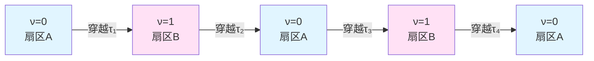
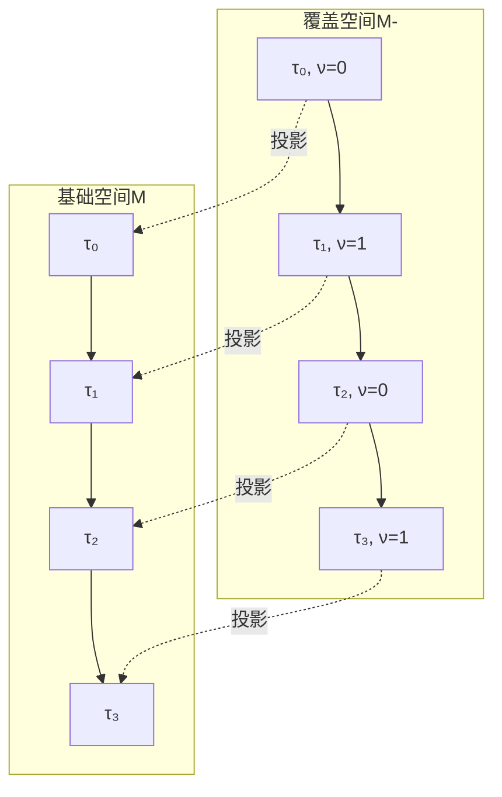
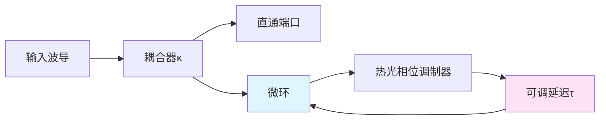

# Z₂奇偶跃迁与拓扑指标

从整数谱流到双值拓扑不变量

---

## 引言

在前两章中,我们证明了π-台阶的存在性:每当延迟参数穿越量子化台阶,散射相位跃迁 $\pm\pi$。但如果系统连续穿越多个台阶,相位会如何累积?是否存在比总相位更"基本"的拓扑量?

本章将引入**Z₂拓扑指标** $\nu(\tau) \in \{0,1\}$,它只记录台阶跃迁的**奇偶性**,而忽略具体的次数与方向。我们将看到,这个看似简化的指标,实际上揭示了自指结构最深层的拓扑本质。

---

## 从整数谱流到Z₂约化

### 谱流计数的定义

回顾:当延迟 $\tau$ 从某个参考值 $\tau_0$ 增加到 $\tau$,可能穿越多个量子化台阶 $\{\tau_k\}$。

定义**谱流计数**:

$$
N(\tau) = \sum_{k: \tau_0 < \tau_k < \tau} \Delta n_k
$$

其中 $\Delta n_k = \Delta\varphi_k/\pi = \pm 1$ 是第 $k$ 个台阶的跃迁方向。

这是一个**整数拓扑不变量**,记录了"净台阶数":
- 正向跃迁($+\pi$)贡献 $+1$
- 反向跃迁($-\pi$)贡献 $-1$

### Z₂约化的动机

虽然 $N(\tau)$ 是完整的拓扑信息,但在许多物理情形下,只有其**奇偶性**是可观测的或本质的。

**定义 (Z₂拓扑指标)**

$$
\nu(\tau) = N(\tau) \bmod 2 \in \{0,1\}
$$

即:
- $\nu = 0$:经历了偶数次台阶(包括0次)
- $\nu = 1$:经历了奇数次台阶

这是一个**Z₂不变量**,表示系统处于两个"拓扑扇区"之一。

### 为什么奇偶性更基本?

从数学角度:
- 整数群 $\mathbb{Z}$ 是无限的,需要"记住"所有历史
- Z₂群 $\{0,1\}$ 只有两个元素,只需"记住"奇偶性

从物理角度:
- 许多系统的相位定义只能模 $2\pi$(例如量子力学波函数)
- 但某些系统的"符号"或"奇偶性"是物理可观测的(例如费米子交换)

**核心洞察**:

> Z₂奇偶性是"能在模 $2\pi$ 的相位空间中仍然良定义"的最精细拓扑不变量。

---

## Z₂翻转规律与演化方程

### 跃迁规则

每当 $\tau$ 穿越一个台阶 $\tau_k$,拓扑指标翻转:

$$
\nu(\tau_k + 0^+) = \nu(\tau_k - 0^-) \oplus 1
$$

这里 $\oplus$ 是**模2加法**(异或运算):
- $0 \oplus 1 = 1$
- $1 \oplus 1 = 0$

用图示表示:

系统在两个拓扑扇区之间来回跳跃,如同一个**拓扑双稳态系统**。

### 离散演化方程

如果台阶位置是等间隔的:$\tau_k = \tau_0 + k\Delta\tau$,则 $\nu(\tau)$ 作为 $\tau$ 的函数呈现周期性方波:

$$
\nu(\tau) = \begin{cases}
0, & \tau \in [2n\Delta\tau, (2n+1)\Delta\tau) \\
1, & \tau \in [(2n+1)\Delta\tau, (2n+2)\Delta\tau)
\end{cases}
$$

这是一个**Z₂值的台阶函数**,周期为 $2\Delta\tau$。

### 与调制时钟的类比

想象一个特殊的"拓扑时钟",只有两个刻度:0和1。每次滴答,指针从0翻到1,或从1翻到0。

这个时钟不记录"总共滴答了多少次"(那需要无限精度),只记录"当前是奇数还是偶数次"。

自指散射网络的 $\nu(\tau)$ 正是这样一个**拓扑时钟的指针**。

---

## 双覆盖空间与提升路径

### 基础空间与覆盖空间

在拓扑学中,**覆盖空间**是一种将"基础空间"的每个点"分裂"为多个点的构造。

对于Z₂情形,最重要的是**双覆盖**:

**基础空间** $M$:延迟参数 $\tau$ 的一维轴
**覆盖空间** $\widetilde{M}$:每个 $\tau$ 分裂为两个点 $(\tau,0)$ 和 $(\tau,1)$,标记不同的拓扑扇区

### 提升路径与holonomy

在基础空间 $M$ 中,从 $\tau_a$ 到 $\tau_b$ 的路径,可以**提升**到覆盖空间 $\widetilde{M}$:

- 如果路径穿越偶数个台阶,提升后起点和终点在同一扇区(闭合)
- 如果路径穿越奇数个台阶,提升后起点和终点在不同扇区(翻转)

这种"提升路径是否闭合"的性质,称为**holonomy**(和乐)。

对Z₂双覆盖,holonomy只有两个值:
- $\mathrm{hol} = +1$:提升路径闭合
- $\mathrm{hol} = -1$:提升路径翻转

而:

$$
\mathrm{hol}(\tau_a \to \tau_b) = (-1)^{\nu(\tau_b) - \nu(\tau_a)} = (-1)^{\Delta\nu}
$$

### 主丛的观点

更抽象地,覆盖空间可以理解为一个**Z₂主丛**:

$$
\pi: \widetilde{M} \to M
$$

纤维(fiber)是Z₂群 $\{+1, -1\}$。

沿基础空间中的闭合路径,纤维的"旋转"(实际上是翻转)由holonomy刻画。

自指散射网络的 $\nu(\tau)$ 正是这个Z₂主丛的**平行移动**的指标。

---

## 自指度:环路的内禀拓扑标签

### 闭合环路的分类

在参数空间中,考虑闭合路径 $\gamma: [0,T] \to M$,满足 $\gamma(0) = \gamma(T) = \tau_0$。

这样的环路可以按两种方式分类:

**整数分类**:环路穿越的净台阶数 $N(\gamma) \in \mathbb{Z}$

**Z₂分类**:环路的奇偶性 $\sigma(\gamma) = N(\gamma) \bmod 2 \in \{0,1\}$

### 自指度的定义

对自指散射网络,定义**自指度**:

$$
\sigma(\gamma) = \nu(\tau_{\mathrm{final}}) - \nu(\tau_{\mathrm{initial}}) \bmod 2
$$

对于闭合环路($\tau_{\mathrm{final}} = \tau_{\mathrm{initial}}$),这等价于:

$$
\sigma(\gamma) = \text{(环路内台阶数)} \bmod 2
$$

**物理意义**:
- $\sigma = 0$:系统"完整地回到自己"(偶数次翻转,净效应为恒等)
- $\sigma = 1$:系统"以翻转的方式回到自己"(奇数次翻转,净效应为符号翻转)

这与费米子的双值性有深刻联系(下一章详述)。

### 环路的同伦类

在拓扑学中,两条环路如果可以连续形变为彼此,称为**同伦等价**。

对参数空间 $M$,所有基于点 $\tau_0$ 的闭合环路的同伦类,构成**基本群** $\pi_1(M, \tau_0)$。

在简单情形(如 $M = \mathbb{R}$ 或 $M = S^1$),基本群是平凡的或循环群。但自指度 $\sigma$ 为这些环路赋予了一个**额外的Z₂标签**:

$$
[\gamma] \in \pi_1(M) \quad\Rightarrow\quad ([\gamma], \sigma(\gamma)) \in \pi_1(M) \times \mathbb{Z}_2
$$

这是一个**增强的拓扑不变量**,完整刻画了自指环路的拓扑类型。

---

## 与Levinson定理的联系

### 经典Levinson定理

在量子散射理论中,**Levinson定理**建立了散射相移与束缚态个数的关系:

$$
\delta(E=\infty) - \delta(E=0) = \pi \cdot N_{\text{bound}}
$$

其中 $\delta(E)$ 是能量 $E$ 处的相移,$N_{\text{bound}}$ 是势场支持的束缚态个数。

### 延迟驱动的"拓扑Levinson定理"

在自指散射网络中,延迟 $\tau$ 扮演了"参数化能量"的角色。我们可以建立类似的关系:

$$
\varphi(\tau=\infty) - \varphi(\tau=0) = \pi \cdot N_{\text{crossings}}
$$

其中 $N_{\text{crossings}}$ 是极点横过实轴的总次数(有符号)。

更精确地,对于周期性台阶 $\{\tau_k\}$:

$$
N(\tau) = \frac{1}{\pi}[\varphi(\tau) - \varphi(\tau_0)]
$$

这是**谱流与相位的拓扑配对**。

### Z₂版本:奇偶Levinson定理

取模2:

$$
\nu(\tau) = N(\tau) \bmod 2 = \frac{1}{\pi}[\varphi(\tau) - \varphi(\tau_0)] \bmod 2
$$

这可以改写为:

$$
\nu(\tau) = \begin{cases}
0, & \varphi(\tau) - \varphi(\tau_0) \in 2\pi\mathbb{Z} \\
1, & \varphi(\tau) - \varphi(\tau_0) \in \pi + 2\pi\mathbb{Z}
\end{cases}
$$

即:**拓扑指标只依赖于相位差是否为 $\pi$ 的奇数倍**。

这是Levinson定理的Z₂约化版本,适用于自指网络的双覆盖结构。

---

## 实验测量与指标重构

### 测量协议

要实验确定Z₂指标 $\nu(\tau)$,可以采用以下协议:

**步骤1:相位扫描**
- 固定频率 $\omega = \omega_*$
- 扫描延迟参数 $\tau \in [\tau_{\min}, \tau_{\max}]$
- 测量散射相位 $\varphi(\omega_*; \tau)$

**步骤2:台阶识别**
- 对相位数据进行展开(unwrapping),去除 $2\pi$ 周期性
- 在 $\varphi(\tau)$ 曲线上识别大小为 $\pm\pi$ 的跳变
- 记录台阶位置 $\{\tau_k\}$ 和跳变方向 $\{\Delta n_k\}$

**步骤3:指标计算**
- 从初始值 $\nu(\tau_{\min}) = 0$ 出发
- 逐个台阶累加:$\nu(\tau_{k+1}) = \nu(\tau_k) \oplus 1$
- 得到完整的 $\nu(\tau)$ 曲线

**步骤4:鲁棒性检验**
- 由于 $\nu \in \{0,1\}$ 只有两个值,对噪声天然鲁棒
- 即使个别台阶位置有误差,只要正确判断"奇偶性",指标就正确
- 可以通过多次测量取"多数投票"

### 频率窗积分方法

另一种更鲁棒的方法是利用刻度同一式:

$$
I(\tau) = \int_{\omega_1}^{\omega_2} \kappa(\omega;\tau) d\omega
= \frac{1}{\pi}[\varphi(\omega_2;\tau) - \varphi(\omega_1;\tau)]
$$

当 $\tau$ 穿越台阶时,$I(\tau)$ 跃变 $\pm 1$。

定义累积指标:

$$
\nu(\tau) = \left[\sum_{k} \Delta I_k\right] \bmod 2
$$

这避免了精确定位台阶位置,只需判断频率窗积分的奇偶跃迁。

### 群延迟指纹

还可以利用群延迟双峰并合作为"软指标":

- 在扇区A($\nu=0$):群延迟单峰,峰值较小
- 临近台阶:双峰出现并靠拢
- 穿越台阶进入扇区B($\nu=1$):峰翻转或消失
- 下一个台阶:重复上述过程,回到扇区A

通过识别双峰并合的周期性,可以重构 $\nu(\tau)$ 而无需直接测量相位。

---

## 与基本群的关系

### 配置空间的拓扑化

从计算宇宙的角度,自指散射网络对应于配置图中的闭合环路。

将配置图拓扑化为二维复形 $\mathcal{X}$,闭合环路的同伦类构成基本群 $\pi_1(\mathcal{X})$。

每条环路 $\gamma \in \pi_1(\mathcal{X})$ 对应一个延迟演化路径,其自指度 $\sigma(\gamma)$ 是一个拓扑不变量。

### 同伦等价与指标不变性

**引理**:如果两条环路 $\gamma_1$ 和 $\gamma_2$ 同伦等价(可以连续形变为彼此),则它们的自指度相同:

$$
[\gamma_1] = [\gamma_2] \quad\Rightarrow\quad \sigma(\gamma_1) = \sigma(\gamma_2)
$$

**证明**:同伦形变对应于参数空间中路径的连续变化。只要形变过程中不穿越新的台阶,自指度保持不变。而在参数空间的连通分支内,台阶集合是离散的,连续形变不会"意外穿越"台阶。

因此,$\sigma: \pi_1(\mathcal{X}) \to \mathbb{Z}_2$ 是一个**群同态**。

### Z₂上同调与陈类

从更高级的拓扑视角,$\sigma$ 定义了参数空间 $M$ 上的一个**Z₂上同调类**:

$$
[\sigma] \in H^1(M; \mathbb{Z}_2)
$$

这是一个一维的Z₂陈类,刻画了双覆盖丛的非平凡性。

对于简单的参数空间(如 $M = S^1$),有 $H^1(S^1; \mathbb{Z}_2) = \mathbb{Z}_2$,恰好对应两种可能的双覆盖:
- 平凡覆盖:$S^1 \times \{0,1\}$(两个不连通的圆)
- 非平凡覆盖:Möbius带(拓扑上不可定向)

自指散射网络的Z₂指标正是在判断"系统活在哪一种覆盖上"。

---

## 物理实例:光学微环的拓扑扇区

### 实验设置

考虑一个集成光子微环谐振器,通过热光调制改变有效往返延迟 $\tau$。

参数:
- 耦合系数 $\kappa = 0.3$
- 环路长度 $L = 100\,\mu\mathrm{m}$
- 测量波长 $\lambda = 1550\,\mathrm{nm}$

### 台阶间距预测

自由谱程:

$$
\mathrm{FSR} = \frac{c}{n_{\text{eff}} L} \approx 600\,\mathrm{GHz}
$$

对应的延迟量子化间距:

$$
\Delta\tau = \frac{2\pi}{\omega} = \frac{\lambda}{c} \approx 5.2\,\mathrm{fs}
$$

通过改变相位调制器的电压,可以精确扫描 $\tau$ 并观测π-台阶。

### 拓扑扇区的观测

**扇区A** ($\nu = 0$):
- 透射谱呈现单共振峰
- 相位缓慢变化
- 群延迟适中

**临近台阶**:
- 透射谱双峰出现
- 相位陡峭上升
- 群延迟双峰靠拢

**扇区B** ($\nu = 1$):
- 透射谱峰位移
- 相位跃迁 $\pi$
- 群延迟单峰恢复(但峰值不同)

通过实时监测透射谱与相位,可以明确识别系统当前处于哪个拓扑扇区。

---

## 本章总结

### 核心概念

**Z₂拓扑指标**:
$$
\nu(\tau) = N(\tau) \bmod 2 \in \{0,1\}
$$
只记录台阶跃迁的奇偶性,是比整数谱流更"基本"的拓扑不变量。

**翻转规律**:
$$
\nu(\tau_k + 0) = \nu(\tau_k - 0) \oplus 1
$$
每穿越一个台阶,指标在0和1之间翻转。

**双覆盖结构**:参数空间 $M$ 提升为双覆盖 $\widetilde{M}$,每个点分裂为两个拓扑扇区。

**自指度**:闭合环路的Z₂标签 $\sigma(\gamma)$,刻画环路"以何种方式回到自己"。

**奇偶Levinson定理**:
$$
\nu(\tau) = \frac{1}{\pi}[\varphi(\tau) - \varphi_0] \bmod 2
$$
拓扑指标由相位差的奇偶性决定。

### 物理图像

> Z₂拓扑指标是自指系统的"内禀奇偶性":它不记录"走了多少步",只记录"走了奇数步还是偶数步"。这种极简的二元分类,恰恰揭示了最深层的拓扑结构。

### 为什么Z₂如此重要?

1. **数学上**:Z₂是最小的非平凡群,是拓扑分类的"原子单元"
2. **物理上**:许多基本现象(费米子交换、时间反演、宇称)都是Z₂对称性
3. **实验上**:二元指标对噪声鲁棒,易于测量和验证
4. **哲学上**:Z₂刻画了"同一性的两种方式":完全回到自己 vs 以翻转的方式回到自己

这正是下一章的主题:费米子作为"宇宙的自指指纹"!

---

## 思考题

1. **群结构**:Z₂群有多少个子群?多少个商群?这与拓扑指标的"不可再约化性"有何关系?

2. **覆盖度**:是否存在"Z₃覆盖"或"Z_n覆盖"的自指网络?它们对应什么物理现象?

3. **陈数推广**:在二维参数空间 $(\tau_1, \tau_2)$ 上,Z₂指标是否推广为某种"二维陈数"?

4. **实验设计**:如果你的相位测量只有 $\pi/10$ 的精度,能否仍然可靠地重构 $\nu(\tau)$?(提示:利用多次测量的统计)

5. **量子纠缠类比**:双覆盖空间中的"两个扇区"是否类似于量子比特的 $|0\rangle$ 和 $|1\rangle$?拓扑指标的翻转是否是某种"拓扑量子门"?

---

## 下一章预告

Z₂拓扑指标不仅是数学优美的结构,更与物理世界的基本粒子有深刻联系:

**费米子起源的自指解释**

我们将:
- 建立自指散射网络的Z₂ ↔ 费米子交换统计的精确对应
- 解释为何"旋转$2\pi$后符号翻转"与"π-台阶跃迁"本质同构
- 探讨自旋双覆盖 $\mathrm{Spin}(n) \to \mathrm{SO}(n)$ 与Null-Modular双覆盖的关系
- 提出大胆假说:费米子可能是宇宙作为自指系统的拓扑必然产物

让我们进入这场联通拓扑、统计与宇宙基本结构的深刻探索!
