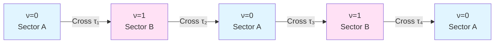
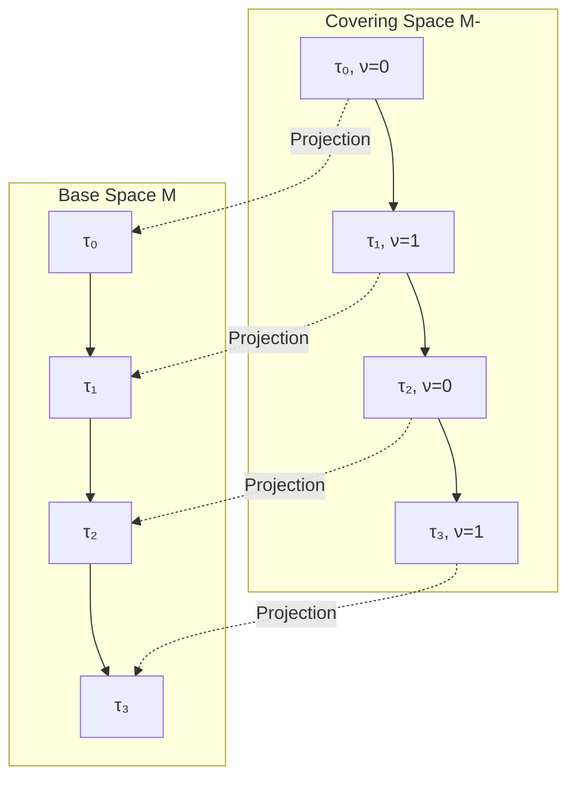
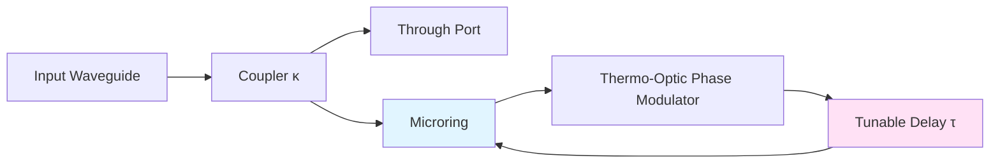

# Z₂ Parity Transition and Topological Index

From Integer Spectral Flow to Two-Valued Topological Invariant

---

## Introduction

In previous two chapters, we proved existence of π-steps: Each time delay parameter crosses quantization step, scattering phase transitions $\pm\pi$. But if system continuously crosses multiple steps, how does phase accumulate? Does there exist topological quantity more "fundamental" than total phase?

This chapter introduces **Z₂ topological index** $\nu(\tau) \in \{0,1\}$, which only records **parity** of step transitions, ignoring specific count and direction. We will see this seemingly simplified index actually reveals deepest topological essence of self-referential structure.

---

## From Integer Spectral Flow to Z₂ Reduction

### Definition of Spectral Flow Counting

Recall: When delay $\tau$ increases from some reference value $\tau_0$ to $\tau$, may cross multiple quantization steps $\{\tau_k\}$.

Define **spectral flow count**:

$$
N(\tau) = \sum_{k: \tau_0 < \tau_k < \tau} \Delta n_k
$$

where $\Delta n_k = \Delta\varphi_k/\pi = \pm 1$ is transition direction of $k$-th step.

This is an **integer topological invariant**, recording "net number of steps":
- Forward transition ($+\pi$) contributes $+1$
- Backward transition ($-\pi$) contributes $-1$

### Motivation for Z₂ Reduction

Although $N(\tau)$ contains complete topological information, in many physical situations, only its **parity** is observable or essential.

**Definition (Z₂ Topological Index)**

$$
\nu(\tau) = N(\tau) \bmod 2 \in \{0,1\}
$$

That is:
- $\nu = 0$: Experienced even number of steps (including 0)
- $\nu = 1$: Experienced odd number of steps

This is a **Z₂ invariant**, indicating system is in one of two "topological sectors".

### Why is Parity More Fundamental?

From mathematical perspective:
- Integer group $\mathbb{Z}$ is infinite, needs to "remember" all history
- Z₂ group $\{0,1\}$ has only two elements, only needs to "remember" parity

From physical perspective:
- Phase definitions of many systems only modulo $2\pi$ (e.g., quantum mechanical wave functions)
- But "sign" or "parity" of certain systems is physically observable (e.g., fermion exchange)

**Core Insight**:

> Z₂ parity is finest topological invariant that "can still be well-defined in phase space modulo $2\pi$".

---

## Z₂ Flipping Rule and Evolution Equation

### Transition Rule

Each time $\tau$ crosses a step $\tau_k$, topological index flips:

$$
\nu(\tau_k + 0^+) = \nu(\tau_k - 0^-) \oplus 1
$$

Here $\oplus$ is **modulo 2 addition** (XOR operation):
- $0 \oplus 1 = 1$
- $1 \oplus 1 = 0$

Represented diagrammatically:

System jumps back and forth between two topological sectors, like a **topological bistable system**.

### Discrete Evolution Equation

If step positions are equally spaced: $\tau_k = \tau_0 + k\Delta\tau$, then $\nu(\tau)$ as function of $\tau$ presents periodic square wave:

$$
\nu(\tau) = \begin{cases}
0, & \tau \in [2n\Delta\tau, (2n+1)\Delta\tau) \\
1, & \tau \in [(2n+1)\Delta\tau, (2n+2)\Delta\tau)
\end{cases}
$$

This is a **Z₂-valued step function**, period $2\Delta\tau$.

### Analogy with Modulated Clock

Imagine a special "topological clock" with only two marks: 0 and 1. Each tick, pointer flips from 0 to 1, or from 1 to 0.

This clock doesn't record "how many ticks total" (that requires infinite precision), only records "current is odd or even number of ticks".

Self-referential scattering network's $\nu(\tau)$ is exactly such a **pointer of topological clock**.

---

## Double Cover Space and Lifted Paths

### Base Space and Covering Space

In topology, **covering space** is construction that "splits" each point of "base space" into multiple points.

For Z₂ case, most important is **double cover**:

**Base Space** $M$: One-dimensional axis of delay parameter $\tau$
**Covering Space** $\widetilde{M}$: Each $\tau$ splits into two points $(\tau,0)$ and $(\tau,1)$, labeling different topological sectors

### Lifted Paths and Holonomy

In base space $M$, path from $\tau_a$ to $\tau_b$ can be **lifted** to covering space $\widetilde{M}$:

- If path crosses even number of steps, lifted path's start and end in same sector (closed)
- If path crosses odd number of steps, lifted path's start and end in different sectors (flipped)

This property of "whether lifted path closes" is called **holonomy**.

For Z₂ double cover, holonomy only has two values:
- $\mathrm{hol} = +1$: Lifted path closes
- $\mathrm{hol} = -1$: Lifted path flips

And:

$$
\mathrm{hol}(\tau_a \to \tau_b) = (-1)^{\nu(\tau_b) - \nu(\tau_a)} = (-1)^{\Delta\nu}
$$

### Principal Bundle Perspective

More abstractly, covering space can be understood as a **Z₂ principal bundle**:

$$
\pi: \widetilde{M} \to M
$$

Fiber is Z₂ group $\{+1, -1\}$.

Along closed path in base space, "rotation" (actually flip) of fiber characterized by holonomy.

Self-referential scattering network's $\nu(\tau)$ is exactly index of **parallel transport** of this Z₂ principal bundle.

---

## Self-Reference Degree: Intrinsic Topological Label of Loops

### Classification of Closed Loops

In parameter space, consider closed path $\gamma: [0,T] \to M$, satisfying $\gamma(0) = \gamma(T) = \tau_0$.

Such loops can be classified in two ways:

**Integer Classification**: Net number of steps loop crosses $N(\gamma) \in \mathbb{Z}$

**Z₂ Classification**: Parity of loop $\sigma(\gamma) = N(\gamma) \bmod 2 \in \{0,1\}$

### Definition of Self-Reference Degree

For self-referential scattering network, define **self-reference degree**:

$$
\sigma(\gamma) = \nu(\tau_{\mathrm{final}}) - \nu(\tau_{\mathrm{initial}}) \bmod 2
$$

For closed loops ($\tau_{\mathrm{final}} = \tau_{\mathrm{initial}}$), this is equivalent to:

$$
\sigma(\gamma) = \text{(number of steps inside loop)} \bmod 2
$$

**Physical Meaning**:
- $\sigma = 0$: System "completely returns to itself" (even number of flips, net effect identity)
- $\sigma = 1$: System "returns to itself in flipped way" (odd number of flips, net effect sign flip)

This has deep connection with fermion double-valuedness (detailed in next chapter).

### Homotopy Classes of Loops

In topology, two loops that can be continuously deformed into each other are called **homotopy equivalent**.

For parameter space $M$, homotopy classes of all closed loops based at point $\tau_0$ constitute **fundamental group** $\pi_1(M, \tau_0)$.

In simple cases (like $M = \mathbb{R}$ or $M = S^1$), fundamental group is trivial or cyclic. But self-reference degree $\sigma$ assigns these loops an **additional Z₂ label**:

$$
[\gamma] \in \pi_1(M) \quad\Rightarrow\quad ([\gamma], \sigma(\gamma)) \in \pi_1(M) \times \mathbb{Z}_2
$$

This is an **enhanced topological invariant**, completely characterizing topological type of self-referential loops.

---

## Connection with Levinson Theorem

### Classical Levinson Theorem

In quantum scattering theory, **Levinson theorem** establishes relationship between scattering phase shift and number of bound states:

$$
\delta(E=\infty) - \delta(E=0) = \pi \cdot N_{\text{bound}}
$$

where $\delta(E)$ is phase shift at energy $E$, $N_{\text{bound}}$ is number of bound states supported by potential.

### Delay-Driven "Topological Levinson Theorem"

In self-referential scattering network, delay $\tau$ plays role of "parameterized energy". We can establish similar relationship:

$$
\varphi(\tau=\infty) - \varphi(\tau=0) = \pi \cdot N_{\text{crossings}}
$$

where $N_{\text{crossings}}$ is total number of times poles cross real axis (signed).

More precisely, for periodic steps $\{\tau_k\}$:

$$
N(\tau) = \frac{1}{\pi}[\varphi(\tau) - \varphi(\tau_0)]
$$

This is **topological pairing of spectral flow and phase**.

### Z₂ Version: Parity Levinson Theorem

Taking modulo 2:

$$
\nu(\tau) = N(\tau) \bmod 2 = \frac{1}{\pi}[\varphi(\tau) - \varphi(\tau_0)] \bmod 2
$$

This can be rewritten as:

$$
\nu(\tau) = \begin{cases}
0, & \varphi(\tau) - \varphi(\tau_0) \in 2\pi\mathbb{Z} \\
1, & \varphi(\tau) - \varphi(\tau_0) \in \pi + 2\pi\mathbb{Z}
\end{cases}
$$

That is: **Topological index only depends on whether phase difference is odd multiple of $\pi$**.

This is Z₂ reduction version of Levinson theorem, applicable to double cover structure of self-referential network.

---

## Experimental Measurement and Index Reconstruction

### Measurement Protocol

To experimentally determine Z₂ index $\nu(\tau)$, can adopt following protocol:

**Step 1: Phase Scan**
- Fix frequency $\omega = \omega_*$
- Scan delay parameter $\tau \in [\tau_{\min}, \tau_{\max}]$
- Measure scattering phase $\varphi(\omega_*; \tau)$

**Step 2: Step Identification**
- Unwrap phase data, remove $2\pi$ periodicity
- Identify jumps of magnitude $\pm\pi$ on $\varphi(\tau)$ curve
- Record step positions $\{\tau_k\}$ and jump directions $\{\Delta n_k\}$

**Step 3: Index Calculation**
- Start from initial value $\nu(\tau_{\min}) = 0$
- Accumulate step by step: $\nu(\tau_{k+1}) = \nu(\tau_k) \oplus 1$
- Obtain complete $\nu(\tau)$ curve

**Step 4: Robustness Check**
- Since $\nu \in \{0,1\}$ only has two values, naturally robust to noise
- Even if individual step positions have errors, as long as correctly judge "parity", index is correct
- Can use "majority voting" from multiple measurements

### Frequency Window Integral Method

Another more robust method uses scale identity:

$$
I(\tau) = \int_{\omega_1}^{\omega_2} \kappa(\omega;\tau) d\omega
= \frac{1}{\pi}[\varphi(\omega_2;\tau) - \varphi(\omega_1;\tau)]
$$

When $\tau$ crosses step, $I(\tau)$ jumps $\pm 1$.

Define cumulative index:

$$
\nu(\tau) = \left[\sum_{k} \Delta I_k\right] \bmod 2
$$

This avoids precisely locating step positions, only need to judge parity transitions of frequency window integral.

### Group Delay Fingerprint

Can also use group delay double-peak merger as "soft index":

- In Sector A ($\nu=0$): Group delay single peak, smaller peak value
- Approaching step: Double peaks appear and converge
- Crossing step into Sector B ($\nu=1$): Peak flips or disappears
- Next step: Repeat above process, return to Sector A

By identifying periodicity of double-peak merger, can reconstruct $\nu(\tau)$ without directly measuring phase.

---

## Relationship with Fundamental Group

### Topologization of Configuration Space

From perspective of computational universe, self-referential scattering network corresponds to closed loops in configuration graph.

Topologize configuration graph as two-dimensional complex $\mathcal{X}$, homotopy classes of closed loops constitute fundamental group $\pi_1(\mathcal{X})$.

Each loop $\gamma \in \pi_1(\mathcal{X})$ corresponds to a delay evolution path, its self-reference degree $\sigma(\gamma)$ is a topological invariant.

### Homotopy Equivalence and Index Invariance

**Lemma**: If two loops $\gamma_1$ and $\gamma_2$ are homotopy equivalent (can be continuously deformed into each other), then their self-reference degrees are same:

$$
[\gamma_1] = [\gamma_2] \quad\Rightarrow\quad \sigma(\gamma_1) = \sigma(\gamma_2)
$$

**Proof**: Homotopy deformation corresponds to continuous change of paths in parameter space. As long as deformation process doesn't cross new steps, self-reference degree remains unchanged. And in connected component of parameter space, step set is discrete, continuous deformation won't "accidentally cross" steps.

Therefore, $\sigma: \pi_1(\mathcal{X}) \to \mathbb{Z}_2$ is a **group homomorphism**.

### Z₂ Cohomology and Chern Class

From more advanced topological perspective, $\sigma$ defines a **Z₂ cohomology class** on parameter space $M$:

$$
[\sigma] \in H^1(M; \mathbb{Z}_2)
$$

This is a one-dimensional Z₂ Chern class, characterizing non-triviality of double cover bundle.

For simple parameter spaces (like $M = S^1$), have $H^1(S^1; \mathbb{Z}_2) = \mathbb{Z}_2$, exactly corresponding to two possible double covers:
- Trivial cover: $S^1 \times \{0,1\}$ (two disconnected circles)
- Non-trivial cover: Möbius strip (topologically non-orientable)

Z₂ index of self-referential scattering network is exactly judging "which cover does system live on".

---

## Physical Example: Topological Sectors of Optical Microring

### Experimental Setup

Consider an integrated photonic microring resonator, changing effective round-trip delay $\tau$ via thermo-optic modulation.

Parameters:
- Coupling coefficient $\kappa = 0.3$
- Loop length $L = 100\,\mu\mathrm{m}$
- Measurement wavelength $\lambda = 1550\,\mathrm{nm}$

### Step Spacing Prediction

Free Spectral Range:

$$
\mathrm{FSR} = \frac{c}{n_{\text{eff}} L} \approx 600\,\mathrm{GHz}
$$

Corresponding delay quantization spacing:

$$
\Delta\tau = \frac{2\pi}{\omega} = \frac{\lambda}{c} \approx 5.2\,\mathrm{fs}
$$

By changing voltage of phase modulator, can precisely scan $\tau$ and observe π-steps.

### Observation of Topological Sectors

**Sector A** ($\nu = 0$):
- Transmission spectrum shows single resonance peak
- Phase slowly changes
- Moderate group delay

**Approaching Step**:
- Transmission spectrum double peaks appear
- Phase steeply rises
- Group delay double peaks converge

**Sector B** ($\nu = 1$):
- Transmission spectrum peak shifts
- Phase transition $\pi$
- Group delay single peak recovers (but different peak value)

By real-time monitoring transmission spectrum and phase, can clearly identify which topological sector system currently in.

---

## Chapter Summary

### Core Concepts

**Z₂ Topological Index**:
$$
\nu(\tau) = N(\tau) \bmod 2 \in \{0,1\}
$$
Only records parity of step transitions, is more "fundamental" topological invariant than integer spectral flow.

**Flipping Rule**:
$$
\nu(\tau_k + 0) = \nu(\tau_k - 0) \oplus 1
$$
Each crossing of step, index flips between 0 and 1.

**Double Cover Structure**: Parameter space $M$ lifted to double cover $\widetilde{M}$, each point splits into two topological sectors.

**Self-Reference Degree**: Z₂ label $\sigma(\gamma)$ of closed loops, characterizing "in what way loop returns to itself".

**Parity Levinson Theorem**:
$$
\nu(\tau) = \frac{1}{\pi}[\varphi(\tau) - \varphi_0] \bmod 2
$$
Topological index determined by parity of phase difference.

### Physical Picture

> Z₂ topological index is "intrinsic parity" of self-referential system: It doesn't record "how many steps taken", only records "odd or even number of steps". This extremely simple binary classification precisely reveals deepest topological structure.

### Why is Z₂ So Important?

1. **Mathematically**: Z₂ is smallest non-trivial group, is "atomic unit" of topological classification
2. **Physically**: Many fundamental phenomena (fermion exchange, time reversal, parity) are Z₂ symmetries
3. **Experimentally**: Binary index robust to noise, easy to measure and verify
4. **Philosophically**: Z₂ characterizes "two ways of identity": Completely return to self vs return to self in flipped way

This is exactly theme of next chapter: Fermions as "self-referential fingerprint of universe"!

---

## Thought Questions

1. **Group Structure**: How many subgroups does Z₂ group have? How many quotient groups? What is relationship with "irreducibility" of topological index?

2. **Covering Degree**: Do there exist self-referential networks with "Z₃ cover" or "Z_n cover"? What physical phenomena do they correspond to?

3. **Chern Number Generalization**: On two-dimensional parameter space $(\tau_1, \tau_2)$, does Z₂ index generalize to some kind of "two-dimensional Chern number"?

4. **Experimental Design**: If your phase measurement only has $\pi/10$ precision, can you still reliably reconstruct $\nu(\tau)$? (Hint: Use statistics of multiple measurements)

5. **Quantum Entanglement Analogy**: Are "two sectors" in double cover space similar to qubit's $|0\rangle$ and $|1\rangle$? Is flipping of topological index some kind of "topological quantum gate"?

---

## Preview of Next Chapter

Z₂ topological index is not only mathematically elegant structure, but also has deep connection with fundamental particles of physical world:

**Self-Referential Explanation of Fermion Origin**

We will:
- Establish precise correspondence between Z₂ of self-referential scattering network ↔ fermion exchange statistics
- Explain why "sign flip after $2\pi$ rotation" and "π-step transition" are essentially isomorphic
- Explore relationship between spin double cover $\mathrm{Spin}(n) \to \mathrm{SO}(n)$ and Null-Modular double cover
- Propose bold hypothesis: Fermions may be topologically inevitable product of universe as self-referential system

Let us enter this profound exploration connecting topology, statistics, and fundamental structure of universe!

