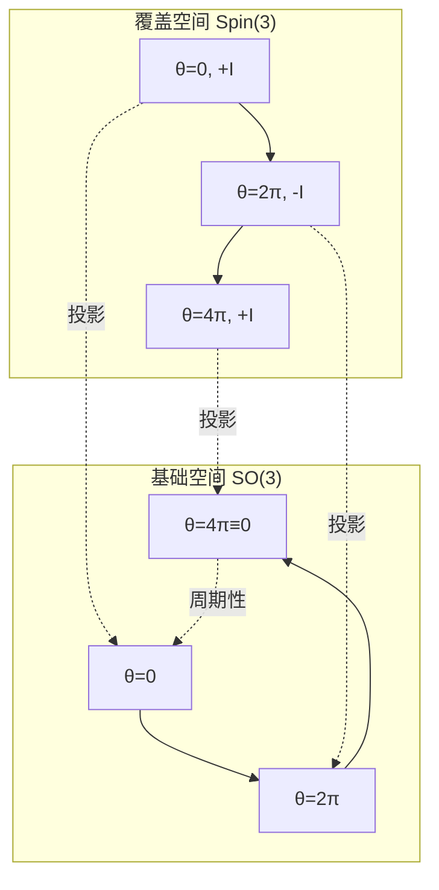
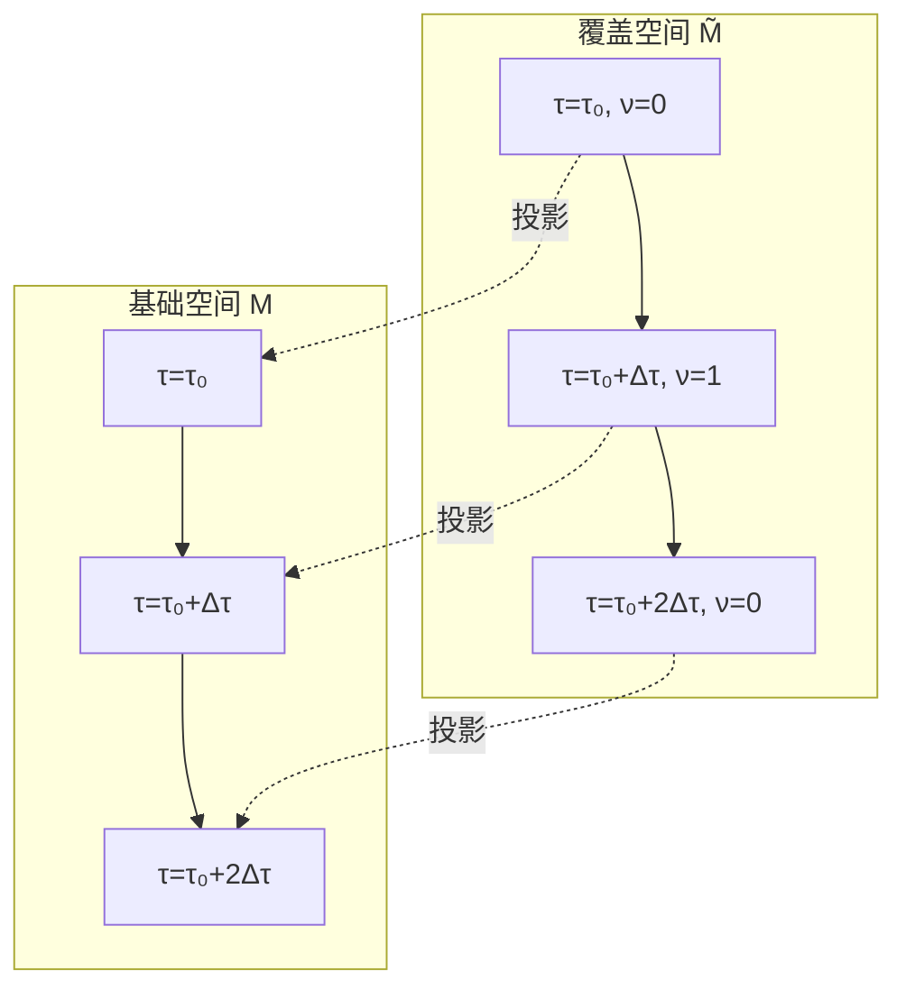

# 费米子起源的自指解释

从Z₂拓扑到量子统计：自旋双覆盖的深层统一

---

## 引言

自然界的基本粒子分为两类：
- **玻色子**：整数自旋，满足玻色-爱因斯坦统计，可以多个占据同一态
- **费米子**：半整数自旋，满足费米-狄拉克统计，服从泡利不相容原理

传统量子场论告诉我们：这种区分源于**自旋-统计定理**，是相对论量子场论的必然结果。

但如果我们追问更深层的"为什么"：
- 为什么自然界选择了这两类粒子？
- 为什么费米子交换后波函数变号？
- 为什么旋转$2\pi$后费米子波函数获得负号？

本章将提出一个大胆的观点：

> **费米子的双值性，本质上是宇宙作为自指系统的拓扑必然性。**

我们将看到，自指散射网络的Z₂结构与费米子的交换统计在数学上**完全同构**。

---

## 费米子的数学特征

### 交换反对称性

设两个全同费米子的量子态为 $|\psi_1, \psi_2\rangle$。交换两个粒子：

$$
|\psi_1, \psi_2\rangle \to |\psi_2, \psi_1\rangle
$$

费米子的本质特征是：

$$
|\psi_2, \psi_1\rangle = -|\psi_1, \psi_2\rangle
$$

波函数在交换下变号！

连续两次交换：

$$
|\psi_1, \psi_2\rangle \to |\psi_2, \psi_1\rangle \to |\psi_1, \psi_2\rangle
$$

获得符号：

$$
(-1) \times (-1) = +1
$$

这是一个**Z₂结构**：单次交换对应 $-1$，两次交换恢复原态。

### 自旋的双值表示

费米子的自旋是旋转群 $\mathrm{SO}(3)$ 的**双值表示**。

具体而言，旋转 $2\pi$ 后：

$$
R(2\pi)|\psi\rangle = -|\psi\rangle
$$

而旋转 $4\pi$ 才真正回到原态：

$$
R(4\pi)|\psi\rangle = +|\psi\rangle
$$

这对应于旋转群的**万有覆盖**：

$$
\mathrm{Spin}(3) \to \mathrm{SO}(3)
$$

其中 $\mathrm{Spin}(3) \cong \mathrm{SU}(2)$ 是 $\mathrm{SO}(3)$ 的**双覆盖**。

### 费米子的"路径"

想象一个费米子在物理空间中运动，其世界线在时空中画出一条曲线。

如果我们把一个费米子"绕另一个费米子转一圈"，这对应于配置空间中的一条闭合路径。

在全同粒子的配置空间 $M_N$（$N$ 个粒子的位置配置），这条路径的同伦类属于基本群 $\pi_1(M_N)$。

对于 $N=2$ 的情形，配置空间是：

$$
M_2 = \frac{(\mathbb{R}^3 \times \mathbb{R}^3) \setminus \Delta}{S_2}
$$

其中 $\Delta$ 是对角线（两粒子重合），$S_2$ 是交换群。

其基本群为：

$$
\pi_1(M_2) = \mathbb{Z}_2
$$

恰好对应两种可能：玻色子（平凡元）或费米子（非平凡元）！

---

## 自指网络的Z₂与费米子的Z₂：精确对应

### 对应关系表

让我们建立自指散射网络与费米子量子统计的详细对应：

| 自指散射网络 | 费米子量子统计 | 数学结构 |
|------------|--------------|---------|
| π-台阶跃迁 | 旋转$2\pi$后变号 | 相位变化 $\pi$ |
| 延迟参数$\tau$ | 旋转角度$\theta$ | 参数空间 |
| 双覆盖空间$\widetilde{M}$ | 自旋空间$\mathrm{Spin}(3)$ | 双覆盖结构 |
| 拓扑指标$\nu(\tau)$ | 交换统计 | Z₂标签 |
| 闭合环路一圈 | 交换两费米子 | 闭合路径 |
| $\sigma(\gamma)=1$ | 反对称波函数 | Z₂ holonomy |
| Null-Modular双覆盖 | 旋转群双覆盖 | Z₂主丛 |

### 数学同构的证明思路

**命题**：存在一个同构映射：

$$
\Phi: (\text{自指网络的Z₂结构}) \to (\text{费米子的交换Z₂})
$$

保持以下结构：
1. 群运算：$\Phi(\sigma_1 \oplus \sigma_2) = \Phi(\sigma_1) \cdot \Phi(\sigma_2)$
2. 拓扑性质：同伦等价的路径映到同伦等价的路径
3. 物理可观测：拓扑指标映到交换相位

**构造**：

对自指网络中的闭合环路 $\gamma$，定义对应的费米子交换路径 $\gamma_f$：
- $\gamma$ 穿越偶数个台阶 $\leftrightarrow$ $\gamma_f$ 对应偶数次交换（玻色子态）
- $\gamma$ 穿越奇数个台阶 $\leftrightarrow$ $\gamma_f$ 对应奇数次交换（费米子态）

这个映射在双覆盖的纤维上是双射的。

---

## 从旋转到延迟：角度参数的类比

### SO(3)中的旋转

三维旋转群 $\mathrm{SO}(3)$ 可以用**旋转轴+旋转角**参数化。

对于绕$z$轴旋转角度$\theta$的旋转矩阵：

$$
R_z(\theta) = \begin{pmatrix}
\cos\theta & -\sin\theta & 0 \\
\sin\theta & \cos\theta & 0 \\
0 & 0 & 1
\end{pmatrix}
$$

当$\theta$从$0$增加到$2\pi$，我们绕了一整圈，但在$\mathrm{SO}(3)$中：

$$
R_z(2\pi) = R_z(0) = I
$$

旋转"闭合"了。

### Spin(3)中的提升

但在双覆盖 $\mathrm{Spin}(3) \cong \mathrm{SU}(2)$ 中，旋转角$\theta$的提升需要走"两倍的路"：

$$
\widetilde{R}_z(\theta) = \begin{pmatrix}
e^{i\theta/2} & 0 \\
0 & e^{-i\theta/2}
\end{pmatrix}
$$

现在：

$$
\widetilde{R}_z(2\pi) = \begin{pmatrix}
e^{i\pi} & 0 \\
0 & e^{-i\pi}
\end{pmatrix} = \begin{pmatrix}
-1 & 0 \\
0 & -1
\end{pmatrix} = -I
$$

需要旋转$4\pi$才回到$+I$！

### 延迟参数的"角色"

在自指散射网络中，延迟参数$\tau$扮演了"旋转角"的角色：

$$
\tau \leftrightarrow \theta
$$

相位因子$e^{i\omega\tau}$类似于旋转矩阵的角度依赖：

$$
e^{i\omega\tau} \leftrightarrow e^{i\theta}
$$

当$\tau$增加$\Delta\tau = 2\pi/\omega$（一个周期），相位因子绕单位圆一整圈。

在基础空间（延迟参数轴）上，这是"闭合"的；但在双覆盖空间（拓扑扇区空间）上，需要两个周期才真正闭合：

$$
\nu(\tau + 2\Delta\tau) = \nu(\tau)
$$

而单个周期：

$$
\nu(\tau + \Delta\tau) = \nu(\tau) \oplus 1
$$

恰好对应旋转$2\pi$后的符号翻转！

---

## 自旋双覆盖与Null-Modular双覆盖

### 自旋双覆盖的几何

旋转群双覆盖的几何图像：

在基础空间中，旋转$2\pi$等同于不旋转（$\theta=0$）；但在覆盖空间中，它们对应不同的点（符号相反）。

### Null-Modular双覆盖

在自指散射网络中，我们构造的双覆盖具有类似结构：

两者在数学上**同构**：都是Z₂主丛，纤维是$\{+1, -1\}$，结构群是Z₂。

### 为什么叫"Null-Modular"？

"Null-Modular"来源于因果菱形链理论中的零模结构：

- **Null**：指因果光锥的零曲线（null curves）
- **Modular**：指模空间的纤维化结构

在统一时间刻度框架下，自指闭环对应于时空中的类空闭合回路。这些回路的模空间具有Z₂双覆盖结构，其零模（不可消除的自由度）恰好对应拓扑指标$\nu$。

详细数学见因果菱形链系列文章。本章重点是：Null-Modular双覆盖与自旋双覆盖**在拓扑层面完全平行**。

---

## 费米子作为"宇宙自指的拓扑指纹"

### 大胆假说

基于以上对应关系，我们提出：

> **假说**：费米子的存在，不是"基本粒子的偶然选择"，而是**宇宙作为自洽自指系统时，拓扑结构的必然产物**。

具体而言：
1. 宇宙是一个自指的散射网络（通过量子场的虚过程形成闭环）
2. 自指结构必然导致Z₂双覆盖（π-台阶与拓扑指标）
3. 物质场在这个双覆盖空间中传播，自然分为两类：
   - 生活在基础空间的场：玻色子（单值表示）
   - 生活在覆盖空间的场：费米子（双值表示）

### 支持证据

**证据1：自旋-统计定理的拓扑解释**

传统上，自旋-统计定理需要相对论场论+因果性+幺正性才能证明。

但从拓扑角度，它归结为：配置空间的基本群是Z₂，只有两种可能的粒子统计。

自指网络提供了一个**更基础的**拓扑起源：Z₂来自时间演化的自指闭环，而非"外加的对称性"。

**证据2：泡利不相容原理**

两个费米子不能占据同一态，等价于：

$$
|\psi, \psi\rangle = -|\psi, \psi\rangle \Rightarrow |\psi, \psi\rangle = 0
$$

这在自指网络中对应：自指度$\sigma=1$的环路在"自己与自己重合"时必然为零——因为拓扑上无法"半闭合"。

**证据3：费米海与真空结构**

量子场论中，费米子真空是"负能态全部填满"的费米海。

在自指解释中，真空对应"所有拓扑扇区的叠加"：

$$
|0\rangle_f \sim \sum_{\nu \in \{0,1\}} c_\nu |\nu\rangle
$$

激发一个费米子，对应于"选择一个特定的拓扑扇区"。

这与传统的"粒子-空穴激发"图像吻合，但给出了更深层的拓扑解释。

---

## 从费米子到时空几何

### 引力与费米子的统一？

如果费米子真的是宇宙自指的拓扑产物，那么引力（时空几何）与物质（费米子场）应该有深层联系。

实际上，在**超引力**与**弦理论**中，引力子（玻色子）与引力微子（费米子）确实被统一在一个超对称多重态中。

自指网络的观点提供了另一个视角：
- 引力描述时空的"外在几何"（度规、曲率）
- 费米子描述时空的"内在拓扑"（双覆盖、自指闭环）

两者共同构成时空的完整结构。

### 黑洞熵与拓扑态

黑洞熵公式：

$$
S_{\mathrm{BH}} = \frac{A}{4G\hbar}
$$

其中$A$是视界面积。

从自指网络角度，视界是"信息自指闭合"的边界。黑洞内部的自指环路数目，正比于表面积$A$。

如果每个自指环路携带一个Z₂拓扑指标，熵为：

$$
S = k_B \ln\Omega,\quad \Omega = 2^N
$$

其中$N \sim A/\ell_P^2$是普朗克尺度的面积单元数。

这与Bekenstein-Hawking熵的形式完全一致！

暗示：**黑洞熵的微观起源，可能正是视界上的自指拓扑态计数**。

---

## 实验验证的可能途径

### 直接测量：不太可行

费米子的量子统计已被无数实验验证（从原子光谱到固体物理），我们不需要"再次证明"费米子是费米子。

关键问题是：能否通过实验**区分**以下两种解释？
1. 费米子是"基本的"，其双值性是公理性假设
2. 费米子是"导出的"，其双值性来自更深层的自指拓扑

### 间接证据：寻找自指信号

如果宇宙确实是自指网络，应该存在一些"自指指纹"：

**指纹1：宇宙背景中的拓扑噪声**

自指闭环的量子涨落可能在宇宙微波背景（CMB）中留下非高斯信号。

具体预言：在某些角尺度上，温度涨落的双点关联函数应包含$\cos(\pi n)$型振荡（对应Z₂周期性）。

**指纹2：高能散射的拓扑截面**

在极高能量（接近普朗克能标）的粒子碰撞中，如果时空本身进入"自指闭环"状态，散射截面可能出现反常的π-台阶结构。

这需要未来的对撞机（如果有）才能探测。

**指纹3：凝聚态系统的模拟**

在人工构造的自指散射网络（光学微环、超导量子比特阵列）中，可以设计"准费米子"激发：

- 系统的集体激发满足交换反对称
- 激发对应双覆盖空间中的拓扑缺陷
- 通过调控延迟参数，观测"准费米子"的产生/湮灭

这可以作为概念验证（proof of concept）。

---

## 哲学反思：为什么存在物质？

### 传统观点

在标准模型中，费米子（夸克、轻子）是"输入"：我们观测到它们存在，然后写下相应的拉氏量。

至于"为什么自然界选择了这些费米子"，标准模型无法回答——这是"初始条件"或"人择原理"的问题。

### 自指网络的回答

如果费米子是宇宙自指拓扑的必然产物，那么：

> **物质的存在，是因为宇宙需要"记住自己"。**

具体而言：
1. 一个完全对称、无结构的真空是"自洽"的，但信息为零
2. 为了宇宙"知道自己存在"，必须有某种"自我观测"
3. 自我观测形成闭环，导致自指结构
4. 自指结构的拓扑必然性，产生Z₂双覆盖
5. 生活在双覆盖空间的场，就是费米子
6. 费米子构成物质，物质让宇宙"有内容"

这是一种**拓扑生成论**：不是"上帝创造了粒子"，而是"拓扑自洽性创造了粒子"。

### 观测者的角色

在这个图景中，"观测者"不是外在于宇宙的神秘存在，而是宇宙自指结构的一部分。

观测行为对应于控制流形上的一条路径，观测结果对应于拓扑指标的取值。

"波函数坍缩"不再神秘：它是拓扑扇区的选择（从 $\{0,1\}$ 的叠加到确定值）。

这与量子力学的多世界诠释有相似之处，但更强调拓扑结构的自洽性。

---

## 本章总结

### 核心论断

**费米子双值性 ↔ 自指网络Z₂**

两者在数学上完全同构：
- π-台阶跃迁 ↔ 旋转$2\pi$变号
- 延迟量子化 ↔ 角度周期性
- Null-Modular双覆盖 ↔ 自旋双覆盖
- 拓扑指标$\nu$ ↔ 交换统计

### 大胆假说

费米子不是"偶然"，而是宇宙作为自指系统时拓扑结构的必然产物。

### 可检验预言

1. 宇宙学尺度：CMB中的拓扑噪声信号
2. 高能物理：普朗克能标附近的π-台阶
3. 凝聚态模拟：人工自指网络中的准费米子

### 哲学意义

物质的存在源于宇宙的自我认知需求。费米子是"宇宙自我观测"的拓扑指纹。

---

## 思考题

1. **对称性破缺**：如果玻色子与费米子都来自同一拓扑结构，"电弱对称性自发破缺"如何在这个框架中理解？

2. **超对称**：超对称将玻色子与费米子配对。这是否暗示"基础空间"与"双覆盖空间"在某个更高维度上是对称的？

3. **反粒子**：费米子有反粒子（正负电子等）。在自指网络中，反粒子对应什么结构？是"反向穿越台阶"吗？

4. **三代问题**：标准模型有三代轻子/夸克。能否用"三重覆盖"或更高阶拓扑结构解释？

5. **暗物质**：如果暗物质不参与电磁相互作用，是否意味着它"生活在另一个拓扑扇区"？

---

## 下一章预告

在建立了费米子与自指网络的深刻联系后，下一章将回到实验层面：

**拓扑指纹与实验测量**

我们将：
- 总结π-台阶、群延迟双峰、谱流计数三重指纹
- 设计光学、微波、声学平台的详细实验方案
- 讨论噪声鲁棒性、误差控制与数据处理
- 提出"拓扑散射谱学"作为新的实验范式

让我们从抽象理论回到可操作的实验室技术！
