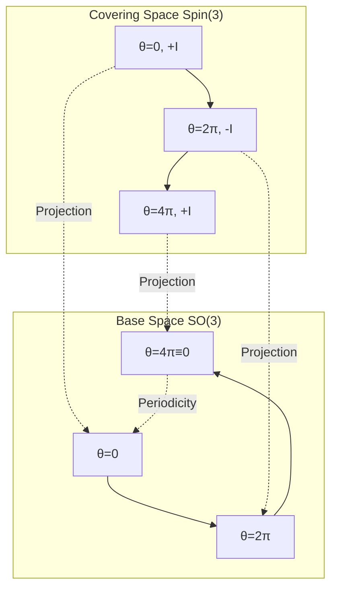
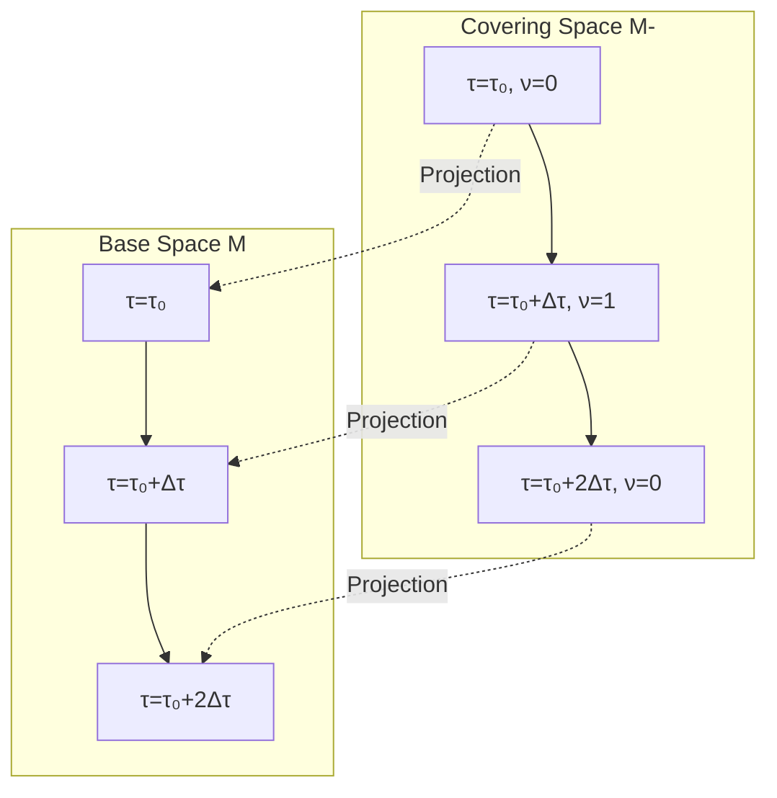

# Self-Referential Explanation of Fermion Origin

From Z₂ Topology to Quantum Statistics: Deep Unification of Spin Double Cover

---

## Introduction

Fundamental particles in nature are divided into two classes:
- **Bosons**: Integer spin, satisfy Bose-Einstein statistics, multiple particles can occupy same state
- **Fermions**: Half-integer spin, satisfy Fermi-Dirac statistics, obey Pauli exclusion principle

Traditional quantum field theory tells us: This distinction originates from **spin-statistics theorem**, is inevitable result of relativistic quantum field theory.

But if we ask deeper "why":
- Why did nature choose these two types of particles?
- Why do fermion wave functions change sign after exchange?
- Why do fermion wave functions acquire negative sign after $2\pi$ rotation?

This chapter proposes a bold viewpoint:

> **Double-valuedness of fermions is essentially topological inevitability of universe as self-referential system.**

We will see Z₂ structure of self-referential scattering network and exchange statistics of fermions are **completely isomorphic** mathematically.

---

## Mathematical Characteristics of Fermions

### Exchange Antisymmetry

Let quantum state of two identical fermions be $|\psi_1, \psi_2\rangle$. Exchanging two particles:

$$
|\psi_1, \psi_2\rangle \to |\psi_2, \psi_1\rangle
$$

Essential characteristic of fermions:

$$
|\psi_2, \psi_1\rangle = -|\psi_1, \psi_2\rangle
$$

Wave function changes sign under exchange!

Two consecutive exchanges:

$$
|\psi_1, \psi_2\rangle \to |\psi_2, \psi_1\rangle \to |\psi_1, \psi_2\rangle
$$

Obtain sign:

$$
(-1) \times (-1) = +1
$$

This is a **Z₂ structure**: Single exchange corresponds to $-1$, two exchanges restore original state.

### Double-Valued Representation of Spin

Spin of fermions is **double-valued representation** of rotation group $\mathrm{SO}(3)$.

Specifically, after rotation $2\pi$:

$$
R(2\pi)|\psi\rangle = -|\psi\rangle
$$

Only after rotation $4\pi$ truly returns to original state:

$$
R(4\pi)|\psi\rangle = +|\psi\rangle
$$

This corresponds to **universal cover** of rotation group:

$$
\mathrm{Spin}(3) \to \mathrm{SO}(3)
$$

where $\mathrm{Spin}(3) \cong \mathrm{SU}(2)$ is **double cover** of $\mathrm{SO}(3)$.

### "Paths" of Fermions

Imagine a fermion moving in physical space, its worldline draws a curve in spacetime.

If we "rotate one fermion around another fermion once", this corresponds to a closed path in configuration space.

In configuration space $M_N$ of identical particles ($N$ particle position configurations), homotopy class of this path belongs to fundamental group $\pi_1(M_N)$.

For $N=2$ case, configuration space is:

$$
M_2 = \frac{(\mathbb{R}^3 \times \mathbb{R}^3) \setminus \Delta}{S_2}
$$

where $\Delta$ is diagonal (two particles coincide), $S_2$ is permutation group.

Its fundamental group is:

$$
\pi_1(M_2) = \mathbb{Z}_2
$$

Exactly corresponding to two possibilities: Boson (trivial element) or Fermion (non-trivial element)!

---

## Z₂ of Self-Referential Network and Z₂ of Fermions: Precise Correspondence

### Correspondence Table

Let us establish detailed correspondence between self-referential scattering network and fermion quantum statistics:

| Self-Referential Scattering Network | Fermion Quantum Statistics | Mathematical Structure |
|-----------------------------------|---------------------------|----------------------|
| π-step transition | Sign change after $2\pi$ rotation | Phase change $\pi$ |
| Delay parameter $\tau$ | Rotation angle $\theta$ | Parameter space |
| Double cover space $\widetilde{M}$ | Spin space $\mathrm{Spin}(3)$ | Double cover structure |
| Topological index $\nu(\tau)$ | Exchange statistics | Z₂ label |
| Closed loop once | Exchange two fermions | Closed path |
| $\sigma(\gamma)=1$ | Antisymmetric wave function | Z₂ holonomy |
| Null-Modular double cover | Rotation group double cover | Z₂ principal bundle |

### Proof Strategy of Mathematical Isomorphism

**Proposition**: There exists an isomorphism:

$$
\Phi: (\text{Z₂ structure of self-referential network}) \to (\text{exchange Z₂ of fermions})
$$

Preserving following structures:
1. Group operation: $\Phi(\sigma_1 \oplus \sigma_2) = \Phi(\sigma_1) \cdot \Phi(\sigma_2)$
2. Topological property: Homotopy equivalent paths map to homotopy equivalent paths
3. Physical observable: Topological index maps to exchange phase

**Construction**:

For closed loop $\gamma$ in self-referential network, define corresponding fermion exchange path $\gamma_f$:
- $\gamma$ crosses even number of steps $\leftrightarrow$ $\gamma_f$ corresponds to even number of exchanges (boson state)
- $\gamma$ crosses odd number of steps $\leftrightarrow$ $\gamma_f$ corresponds to odd number of exchanges (fermion state)

This mapping is bijective on fibers of double cover.

---

## From Rotation to Delay: Analogy of Angle Parameters

### Rotation in SO(3)

Three-dimensional rotation group $\mathrm{SO}(3)$ can be parameterized by **rotation axis + rotation angle**.

For rotation matrix rotating angle $\theta$ around $z$-axis:

$$
R_z(\theta) = \begin{pmatrix}
\cos\theta & -\sin\theta & 0 \\
\sin\theta & \cos\theta & 0 \\
0 & 0 & 1
\end{pmatrix}
$$

When $\theta$ increases from $0$ to $2\pi$, we go around full circle, but in $\mathrm{SO}(3)$:

$$
R_z(2\pi) = R_z(0) = I
$$

Rotation "closes".

### Lift in Spin(3)

But in double cover $\mathrm{Spin}(3) \cong \mathrm{SU}(2)$, lift of rotation angle $\theta$ needs to go "twice the distance":

$$
\widetilde{R}_z(\theta) = \begin{pmatrix}
e^{i\theta/2} & 0 \\
0 & e^{-i\theta/2}
\end{pmatrix}
$$

Now:

$$
\widetilde{R}_z(2\pi) = \begin{pmatrix}
e^{i\pi} & 0 \\
0 & e^{-i\pi}
\end{pmatrix} = \begin{pmatrix}
-1 & 0 \\
0 & -1
\end{pmatrix} = -I
$$

Need rotation $4\pi$ to return to $+I$!

### "Role" of Delay Parameter

In self-referential scattering network, delay parameter $\tau$ plays role of "rotation angle":

$$
\tau \leftrightarrow \theta
$$

Phase factor $e^{i\omega\tau}$ similar to angle dependence of rotation matrix:

$$
e^{i\omega\tau} \leftrightarrow e^{i\theta}
$$

When $\tau$ increases by $\Delta\tau = 2\pi/\omega$ (one period), phase factor goes around unit circle once.

On base space (delay parameter axis), this is "closed"; but on double cover space (topological sector space), need two periods to truly close:

$$
\nu(\tau + 2\Delta\tau) = \nu(\tau)
$$

While single period:

$$
\nu(\tau + \Delta\tau) = \nu(\tau) \oplus 1
$$

Exactly corresponds to sign flip after rotation $2\pi$!

---

## Spin Double Cover and Null-Modular Double Cover

### Geometry of Spin Double Cover

Geometric picture of rotation group double cover:

In base space, rotation $2\pi$ equals no rotation ($\theta=0$); but in covering space, they correspond to different points (opposite signs).

### Null-Modular Double Cover

In self-referential scattering network, double cover we construct has similar structure:

Both are **isomorphic** mathematically: Both are Z₂ principal bundles, fibers are $\{+1, -1\}$, structure group is Z₂.

### Why Called "Null-Modular"?

"Null-Modular" originates from null mode structure in causal diamond chain theory:

- **Null**: Refers to null curves of causal light cones
- **Modular**: Refers to fibered structure of moduli space

Under unified time scale framework, self-referential closed loops correspond to spacelike closed loops in spacetime. Moduli space of these loops has Z₂ double cover structure, their null modes (non-eliminable degrees of freedom) exactly correspond to topological index $\nu$.

Detailed mathematics see causal diamond chain series articles. Focus of this chapter: Null-Modular double cover and spin double cover **completely parallel at topological level**.

---

## Fermions as "Topological Fingerprint of Universe's Self-Reference"

### Bold Hypothesis

Based on above correspondences, we propose:

> **Hypothesis**: Existence of fermions is not "accidental choice of fundamental particles", but **inevitable product of topological structure when universe is self-consistent self-referential system**.

Specifically:
1. Universe is a self-referential scattering network (forming closed loops via virtual processes of quantum fields)
2. Self-referential structure inevitably leads to Z₂ double cover (π-steps and topological index)
3. Matter fields propagating in this double cover space naturally divide into two classes:
   - Fields living in base space: Bosons (single-valued representation)
   - Fields living in covering space: Fermions (double-valued representation)

### Supporting Evidence

**Evidence 1: Topological Interpretation of Spin-Statistics Theorem**

Traditionally, spin-statistics theorem requires relativistic field theory + causality + unitarity to prove.

But from topological perspective, it reduces to: Fundamental group of configuration space is Z₂, only two possible particle statistics.

Self-referential network provides a **more fundamental** topological origin: Z₂ comes from self-referential closed loops of time evolution, not "externally imposed symmetry".

**Evidence 2: Pauli Exclusion Principle**

Two fermions cannot occupy same state, equivalent to:

$$
|\psi, \psi\rangle = -|\psi, \psi\rangle \Rightarrow |\psi, \psi\rangle = 0
$$

In self-referential network, this corresponds to: Loops with self-reference degree $\sigma=1$ must be zero when "coincide with themselves"—because topologically cannot "half-close".

**Evidence 3: Fermi Sea and Vacuum Structure**

In quantum field theory, fermion vacuum is Fermi sea with "all negative energy states filled".

In self-referential interpretation, vacuum corresponds to "superposition of all topological sectors":

$$
|0\rangle_f \sim \sum_{\nu \in \{0,1\}} c_\nu |\nu\rangle
$$

Exciting a fermion corresponds to "choosing a specific topological sector".

This matches traditional "particle-hole excitation" picture, but gives deeper topological interpretation.

---

## From Fermions to Spacetime Geometry

### Unification of Gravity and Fermions?

If fermions are really topological product of universe's self-reference, then gravity (spacetime geometry) and matter (fermion fields) should have deep connection.

Actually, in **supergravity** and **string theory**, graviton (boson) and gravitino (fermion) are indeed unified in a supersymmetric multiplet.

Self-referential network viewpoint provides another perspective:
- Gravity describes "extrinsic geometry" of spacetime (metric, curvature)
- Fermions describe "intrinsic topology" of spacetime (double cover, self-referential closed loops)

Together they constitute complete structure of spacetime.

### Black Hole Entropy and Topological States

Black hole entropy formula:

$$
S_{\mathrm{BH}} = \frac{A}{4G\hbar}
$$

where $A$ is horizon area.

From self-referential network perspective, horizon is boundary where "information self-referentially closes". Number of self-referential loops inside black hole proportional to surface area $A$.

If each self-referential loop carries a Z₂ topological index, entropy is:

$$
S = k_B \ln\Omega,\quad \Omega = 2^N
$$

where $N \sim A/\ell_P^2$ is number of Planck-scale area units.

This completely matches form of Bekenstein-Hawking entropy!

Implication: **Microscopic origin of black hole entropy may be exactly counting of self-referential topological states on horizon**.

---

## Possible Experimental Verification Approaches

### Direct Measurement: Not Very Feasible

Quantum statistics of fermions has been verified by countless experiments (from atomic spectra to solid state physics), we don't need to "prove again" that fermions are fermions.

Key question: Can experiments **distinguish** following two explanations?
1. Fermions are "fundamental", their double-valuedness is axiomatic assumption
2. Fermions are "derived", their double-valuedness comes from deeper self-referential topology

### Indirect Evidence: Searching for Self-Referential Signals

If universe is indeed self-referential network, should exist some "self-referential fingerprints":

**Fingerprint 1: Topological Noise in Cosmic Background**

Quantum fluctuations of self-referential closed loops may leave non-Gaussian signals in cosmic microwave background (CMB).

Specific prediction: On certain angular scales, two-point correlation function of temperature fluctuations should contain $\cos(\pi n)$-type oscillations (corresponding to Z₂ periodicity).

**Fingerprint 2: Topological Cross Sections in High-Energy Scattering**

In extremely high energy (near Planck scale) particle collisions, if spacetime itself enters "self-referential closed loop" state, scattering cross sections may show anomalous π-step structure.

This requires future colliders (if any) to detect.

**Fingerprint 3: Simulation in Condensed Matter Systems**

In artificially constructed self-referential scattering networks (optical microrings, superconducting qubit arrays), can design "quasi-fermion" excitations:

- Collective excitations of system satisfy exchange antisymmetry
- Excitations correspond to topological defects in double cover space
- By tuning delay parameters, observe creation/annihilation of "quasi-fermions"

This can serve as proof of concept.

---

## Philosophical Reflection: Why Does Matter Exist?

### Traditional Viewpoint

In standard model, fermions (quarks, leptons) are "input": We observe their existence, then write corresponding Lagrangian.

As for "why nature chose these fermions", standard model cannot answer—this is question of "initial conditions" or "anthropic principle".

### Answer from Self-Referential Network

If fermions are inevitable product of universe's self-referential topology, then:

> **Existence of matter is because universe needs to "remember itself".**

Specifically:
1. A completely symmetric, structureless vacuum is "self-consistent", but has zero information
2. For universe to "know it exists", must have some kind of "self-observation"
3. Self-observation forms closed loops, leading to self-referential structure
4. Topological inevitability of self-referential structure produces Z₂ double cover
5. Fields living in double cover space are fermions
6. Fermions constitute matter, matter gives universe "content"

This is a kind of **topological generativism**: Not "God created particles", but "topological self-consistency created particles".

### Role of Observers

In this picture, "observer" is not mysterious existence external to universe, but part of universe's self-referential structure.

Observation behavior corresponds to a path on control manifold, observation result corresponds to value of topological index.

"Wave function collapse" no longer mysterious: It is selection of topological sector (from superposition of $\{0,1\}$ to definite value).

This has similarities with many-worlds interpretation of quantum mechanics, but emphasizes self-consistency of topological structure more.

---

## Chapter Summary

### Core Assertions

**Fermion Double-Valuedness ↔ Z₂ of Self-Referential Network**

Both completely isomorphic mathematically:
- π-step transition ↔ Sign change after $2\pi$ rotation
- Delay quantization ↔ Angle periodicity
- Null-Modular double cover ↔ Spin double cover
- Topological index $\nu$ ↔ Exchange statistics

### Bold Hypothesis

Fermions are not "accidental", but inevitable product of topological structure when universe is self-referential system.

### Testable Predictions

1. Cosmological scale: Topological noise signals in CMB
2. High-energy physics: π-steps near Planck scale
3. Condensed matter simulation: Quasi-fermions in artificial self-referential networks

### Philosophical Significance

Existence of matter originates from universe's need for self-cognition. Fermions are topological fingerprint of "universe's self-observation".

---

## Thought Questions

1. **Symmetry Breaking**: If both bosons and fermions come from same topological structure, how to understand "electroweak symmetry spontaneous breaking" in this framework?

2. **Supersymmetry**: Supersymmetry pairs bosons with fermions. Does this imply "base space" and "double cover space" are symmetric in some higher dimension?

3. **Antiparticles**: Fermions have antiparticles (positrons, etc.). In self-referential network, what structure do antiparticles correspond to? Is it "crossing steps in reverse direction"?

4. **Three Generations Problem**: Standard model has three generations of leptons/quarks. Can this be explained by "triple cover" or higher-order topological structure?

5. **Dark Matter**: If dark matter doesn't participate in electromagnetic interactions, does this mean it "lives in another topological sector"?

---

## Preview of Next Chapter

After establishing deep connection between fermions and self-referential network, next chapter returns to experimental level:

**Topological Fingerprints and Experimental Measurement**

We will:
- Summarize triple fingerprints: π-steps, group delay double peaks, spectral flow counting
- Design detailed experimental schemes for optical, microwave, acoustic platforms
- Discuss noise robustness, error control and data processing
- Propose "topological scattering spectroscopy" as new experimental paradigm

Let us return from abstract theory to operational laboratory techniques!

