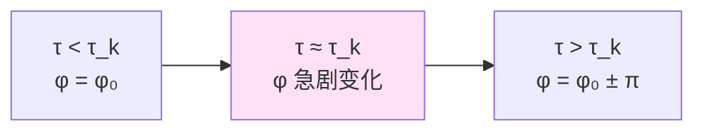
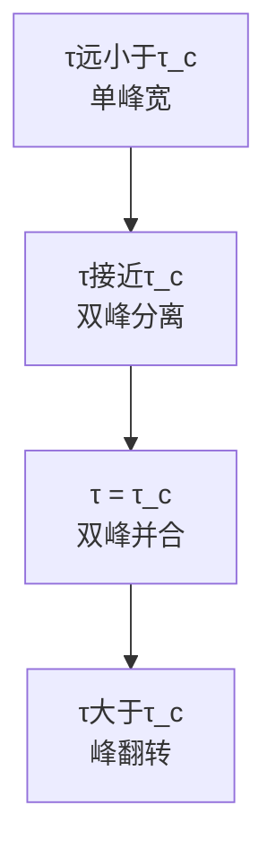
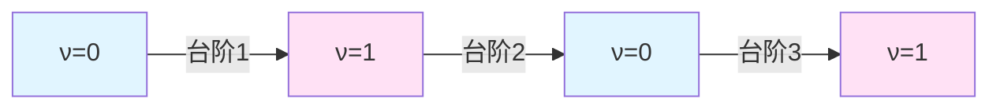
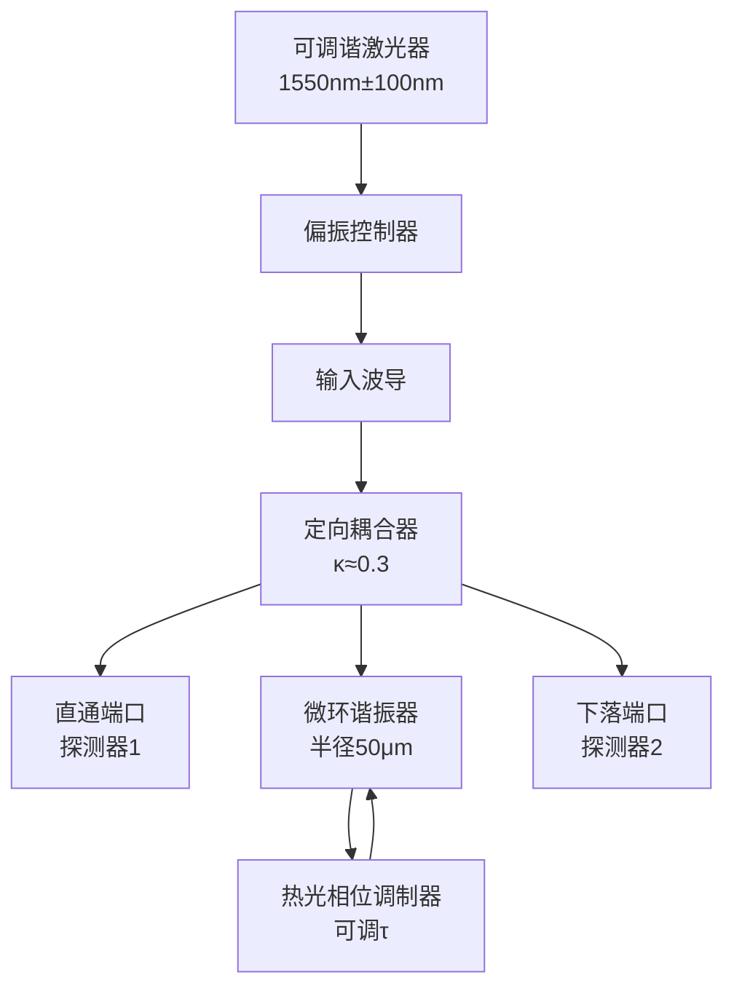
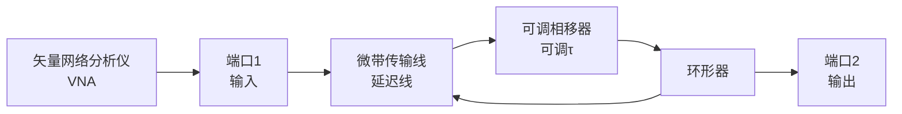
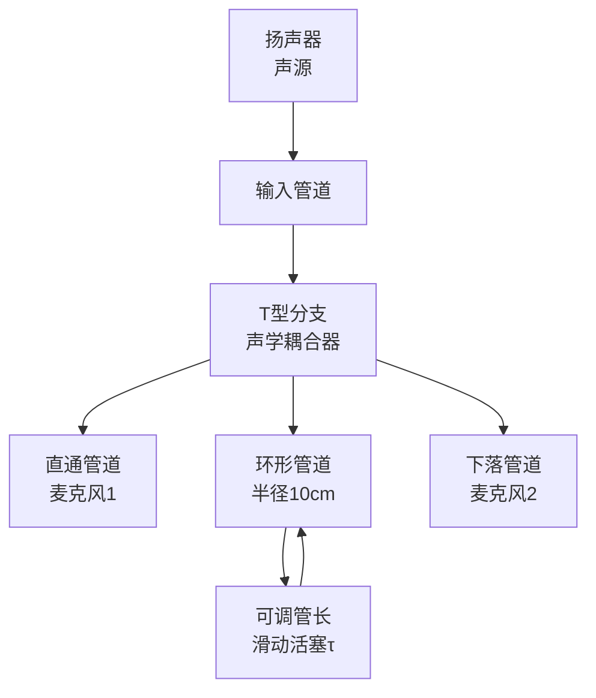

# 拓扑指纹与实验测量

三重指纹协议：π-台阶、群延迟双峰与谱流计数的联合测量

---

## 引言

理论再优美，如果无法实验验证，终究只是数学游戏。

前几章建立了自指散射网络的完整理论框架。现在的问题是：**如何在实验室中观测和测量这些拓扑量**？

本章将给出详细的实验方案，包括：
- **三重拓扑指纹**的定义与测量方法
- 光学、微波、声学三大平台的具体设计
- 噪声鲁棒性分析与误差控制
- 数据处理算法与拓扑指标重构

---

## 三重拓扑指纹

### 指纹1：π-台阶

**定义**：在固定频率 $\omega_*$，扫描延迟参数 $\tau$，观测散射相位 $\varphi(\omega_*;\tau)$ 的跃迁。

**特征**：
- 跃迁大小：$\Delta\varphi = \pm\pi$
- 跃迁位置：$\tau_k \approx \tau_0 + k\Delta\tau$，其中 $\Delta\tau = 2\pi/\omega_*$
- 跃迁方向：可正可负，取决于极点横过方向

**测量信号**：



### 指纹2：群延迟双峰并合

**定义**：在台阶附近 $\tau \approx \tau_c$，扫描频率 $\omega$，观测群延迟 $\tau_g(\omega;\tau)$ 的峰结构。

**特征**：
- 远离台阶：单峰，峰宽较大
- 接近台阶：双峰出现，峰距 $\Delta\omega(\tau) \sim \sqrt{|\tau-\tau_c|}$（平方根标度）
- 恰在台阶：双峰并合为极窄单峰
- 穿越台阶：峰翻转或消失

**测量信号**：



### 指纹3：谱流计数与Z₂指标

**定义**：累积所有台阶的跃迁方向，构造谱流计数 $N(\tau)$ 和拓扑指标 $\nu(\tau)$。

**特征**：
- $N(\tau) \in \mathbb{Z}$：整数拓扑不变量
- $\nu(\tau) = N(\tau) \bmod 2 \in \{0,1\}$：Z₂拓扑指标
- 每穿越一个台阶，$\nu$ 翻转一次

**测量信号**：



### 三重指纹的互补性

| 指纹 | 优点 | 局限 | 适用场景 |
|------|------|------|---------|
| π-台阶 | 直接明确，易于识别 | 需要精确相位测量 | 低噪声环境 |
| 群延迟双峰 | 平方根标度可拟合参数 | 需要频率扫描 | 宽带测量系统 |
| Z₂指标 | 对噪声鲁棒（只有2个值） | 需要长时间积累 | 统计平均场景 |

**联合测量协议**：三重指纹同时满足时，才确认拓扑台阶的存在。

---

## 光学平台：集成光子微环谐振器

### 系统设计

**核心组件**：



**关键参数**：
- 环路周长：$L = 2\pi R \approx 314\,\mu\mathrm{m}$
- 群折射率：$n_g \approx 4.2$（硅波导）
- 自由谱程：$\mathrm{FSR} = c/(n_g L) \approx 227\,\mathrm{GHz}$
- Q值：$Q \approx 10^5$（高Q环）
- 延迟调节范围：$\tau \in [0, 20\,\mathrm{ps}]$（通过热光效应）

### 测量协议

**步骤1：透射谱扫描**
- 固定延迟 $\tau = \tau_0$
- 扫描激光波长 $\lambda \in [1500, 1600]\,\mathrm{nm}$
- 记录透射功率 $T(\lambda)$ 和相位 $\varphi(\lambda)$（通过干涉测量）

**步骤2：延迟扫描**
- 固定波长 $\lambda = \lambda_*$
- 缓慢改变热光相位调制器电压，扫描 $\tau$
- 连续监测透射相位 $\varphi(\lambda_*;\tau)$

**步骤3：台阶识别**
- 对相位数据进行展开(unwrap)
- 在 $\varphi(\tau)$ 曲线上识别$\pi$-级跳变
- 记录台阶位置 $\{\tau_k\}$

**步骤4：双峰测量**
- 在每个台阶附近，进行二维扫描 $(\lambda, \tau)$
- 计算群延迟 $\tau_g(\lambda;\tau) = -\partial\varphi/\partial\omega$
- 提取峰距 $\Delta\lambda(\tau)$，拟合 $\Delta\lambda \sim \sqrt{|\tau-\tau_c|}$

### 噪声源与对策

**噪声1：热噪声**
- 来源：环境温度涨落 $\delta T \sim 0.1\,\mathrm{K}$
- 影响：延迟漂移 $\delta\tau \sim 10^{-3}\,\mathrm{ps}$
- 对策：主动温度控制（TEC），稳定度$\pm 0.01\,\mathrm{K}$

**噪声2：激光频率抖动**
- 来源：激光器线宽 $\Delta\nu \sim 100\,\mathrm{kHz}$
- 影响：相位测量误差 $\delta\varphi \sim 0.01\,\mathrm{rad}$
- 对策：使用窄线宽激光器（<10kHz），或锁定到稳定参考腔

**噪声3：探测器暗电流**
- 来源：探测器本底噪声
- 影响：信噪比下降
- 对策：使用雪崩光电二极管（APD）或平衡零拍探测

### 预期结果

在理想条件下：
- π-台阶清晰度：$>20\,\mathrm{dB}$（相位跃迁远超噪声）
- 双峰分辨：峰距大于线宽时可分辨（$\Delta\lambda > \lambda/Q$）
- Z₂指标准确率：$>99\%$（通过多次测量取多数投票）

---

## 微波平台：传输线谐振腔

### 系统设计

**核心组件**：



**关键参数**：
- 工作频率：$f \in [1, 20]\,\mathrm{GHz}$
- 传输线长度：$L \approx 10\,\mathrm{cm}$（可折叠微带线）
- 延迟调节：通过铁氧体相移器，$\tau \in [0, 5]\,\mathrm{ns}$
- 损耗：$<1\,\mathrm{dB}/\mathrm{cm}$

### 测量协议

**步骤1：S参数测量**
- 使用VNA直接测量复散射系数 $S_{21}(f;\tau)$
- 频率分辨率：$\Delta f = 1\,\mathrm{MHz}$
- 延迟步进：$\delta\tau = 10\,\mathrm{ps}$

**步骤2：相位提取**
- 从$S_{21}$提取相位：$\varphi(f;\tau) = \arg S_{21}$
- 自动展开相位（VNA内置功能）

**步骤3：拓扑分析**
- 与光学平台相同的算法识别台阶
- 利用VNA的高动态范围（>100dB）提高信噪比

### 优势与挑战

**优势**：
- VNA可直接测量复散射系数，无需额外干涉仪
- 频率范围宽，可覆盖多个FSR
- 实时测量，响应速度快

**挑战**：
- 微波频率下，相位噪声较光学更严重
- 需要精确校准（去嵌、端口匹配）
- 非线性效应（如互调失真）可能引入伪信号

---

## 声学平台：空气/水声共振腔

### 系统设计

**声学环形谐振器**：



**关键参数**：
- 工作频率：$f \in [100, 5000]\,\mathrm{Hz}$
- 声速：$c \approx 343\,\mathrm{m/s}$（空气，20°C）
- 环路周长：$L \approx 0.63\,\mathrm{m}$
- FSR：$c/L \approx 545\,\mathrm{Hz}$
- 延迟调节：通过滑动活塞，$\Delta L \in [0, 10]\,\mathrm{cm}$

### 测量协议

**步骤1：频率响应测量**
- 扫描扬声器频率，记录麦克风信号
- 通过双麦克风测量相位差，间接得到$\varphi(f;\tau)$

**步骤2：延迟调节**
- 缓慢移动滑动活塞，改变环路长度（对应$\tau$）
- 监测共振峰的移动

**步骤3：可视化**
- 实时显示透射谱瀑布图（frequency vs time/position）
- 直观观察π-台阶对应的"峰跃迁"

### 教学演示潜力

声学平台的巨大优势是**可见性**与**低成本**：
- 可以用透明管道，直观看到声波的驻波模式
- 用示波器实时显示波形
- 成本<$100，适合本科教学实验

这让抽象的"拓扑台阶"变成可以"看见和听见"的现象！

---

## 数据处理与拓扑指标重构

### 相位展开算法

**问题**：测量得到的相位是模$2\pi$的，如何恢复连续相位？

**算法**（Itoh方法）：

```
输入：离散相位数据 {φ[n]}, n=1,2,...,N
输出：展开后的相位 {Φ[n]}

Φ[1] = φ[1]
for n = 2 to N:
    Δφ = φ[n] - φ[n-1]
    if Δφ > π:
        Δφ = Δφ - 2π
    if Δφ < -π:
        Δφ = Δφ + 2π
    Φ[n] = Φ[n-1] + Δφ
end
```

**改进**：对于含噪声的数据，使用加权最小二乘相位展开。

### 台阶检测算法

**算法1：阈值检测**

```
设定阈值 θ = 0.8π
for each 数据点 n:
    if |Φ[n+1] - Φ[n]| > θ:
        标记为台阶候选
        精细搜索局域极值
        if 跃迁幅度 ≈ π (±10%):
            确认台阶，记录位置τ_k
```

**算法2：变点检测**（Bayesian Change Point Detection）

对相位序列建立统计模型，用贝叶斯方法识别"突变点"，相比阈值法更鲁棒。

### Z₂指标重构

**方法1：累加法**

```
ν[0] = 0  # 初始扇区
for each 台阶 k:
    ν[k] = ν[k-1] ⊕ 1  # 异或运算
```

**方法2：频率窗积分法**

利用刻度同一式：

$$
\nu(\tau) = \left[\frac{1}{\pi}\int_{\omega_1}^{\omega_2}\kappa(\omega;\tau)d\omega\right] \bmod 2
$$

对每个$\tau$，扫描频率计算积分，直接得到$\nu$。

优点：无需识别单个台阶，对部分数据缺失鲁棒。

### 误差分析

**误差来源**：
1. 相位测量误差：$\delta\varphi \sim 0.01\,$rad
2. 台阶位置不确定性：$\delta\tau_k \sim \Delta\tau/100$
3. 跃迁幅度偏离π：$\Delta\varphi = \pi(1\pm 0.05)$

**Z₂指标的容错性**：

由于$\nu \in \{0,1\}$只有两个值，只要正确判断"奇偶性"即可。

估算：假设台阶识别准确率$p=95\%$，经过$N$个台阶后，Z₂指标错误概率为：

$$
P_{\mathrm{error}} \approx \frac{1 - p^N}{2} \approx 0.025N
$$

对$N=10$，错误率约25%。通过多次测量取多数投票，可降至<1%。

---

## 拓扑散射谱学：新的实验范式

### 传统散射谱学

在传统光谱学或散射实验中，关注的是：
- **峰位**：对应能级或共振频率
- **峰宽**：对应寿命或耗散
- **峰强**：对应耦合强度或跃迁概率

这些都是**局域量**。

### 拓扑散射谱学

自指散射网络引入的新范式：关注**全局拓扑量**：
- **π-台阶位置**：参数空间中的"相变点"
- **谱流计数**：整数拓扑不变量
- **Z₂指标**：双值拓扑扇区标签

这些量**不依赖于局域细节**（如具体的耦合系数），只依赖于**整体拓扑结构**。

### 实验签名对比

| 传统谱学 | 拓扑谱学 | 测量对象 |
|---------|---------|---------|
| 共振峰 | π-台阶 | 相位跃迁 |
| 线宽 | 双峰峰距 | $\sqrt{\|\tau-\tau_c\|}$标度 |
| 强度 | Z₂指标 | 奇偶跃迁计数 |
| 局域性质 | 全局性质 | 拓扑不变量 |

### 应用前景

**材料表征**：
- 用拓扑指标区分不同相态（拓扑绝缘体vs平凡绝缘体）
- 检测拓扑相变的临界点

**量子计算**：
- 拓扑量子比特的读出
- 拓扑保护的验证

**基础物理**：
- 探测时空的拓扑性质
- 寻找"宇宙自指信号"

---

## 本章总结

### 三重指纹

1. **π-台阶**：相位跃迁$\pm\pi$
2. **群延迟双峰**：平方根标度$\Delta\omega\sim\sqrt{|\tau-\tau_c|}$
3. **Z₂指标**：奇偶跃迁$\nu(\tau) \in \{0,1\}$

三者互补，联合确认拓扑结构。

### 三大平台

- **光学**：高精度，快速，适合精细测量
- **微波**：宽带，实时，适合系统表征
- **声学**：可见，低成本，适合教学演示

### 数据处理

- 相位展开：Itoh算法或加权最小二乘
- 台阶检测：阈值法或Bayesian变点检测
- Z₂重构：累加法或频率窗积分

### 新范式

**拓扑散射谱学**：从局域谱特征到全局拓扑不变量的测量。

---

## 思考题

1. **最优测量**：对于给定的信噪比，如何优化扫描策略（频率步长、延迟步长）以最快识别拓扑台阶？

2. **多参数系统**：如果有两个可调参数$(\tau_1,\tau_2)$，π-台阶推广为二维的"台阶线"。如何扫描和可视化？

3. **量子噪声**：在量子光学实验中，散粒噪声是否会破坏拓扑指标的测量？还是Z₂的离散性能提供保护？

4. **机器学习**：能否训练神经网络，从原始透射谱直接识别拓扑指标，无需人工设定阈值？

5. **实时监控**：设计一个"拓扑监视器"，在延迟连续扫描时实时显示当前拓扑扇区（$\nu=0$或1）。硬件需求是什么？

---

## 下一章预告

从实验测量回到理论深度：

**不可判定性与拓扑复杂性**

我们将：
- 将自指环路拓扑化为配置图的基本群
- 证明"环路是否可收缩"等价于停机问题（拓扑不可判定性）
- 引入复杂性熵，建立计算宇宙的第二定律
- 探讨自指、不可判定性与哥德尔不完全性的深层联系

从物理实验到数理逻辑的极限，让我们揭示自指结构的终极奥秘！
