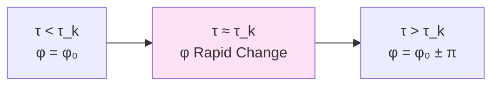
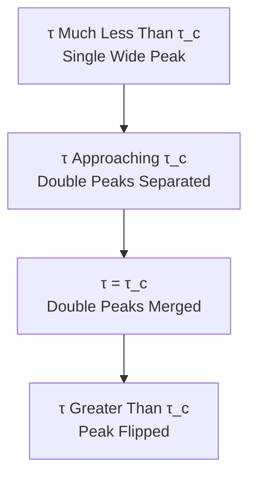
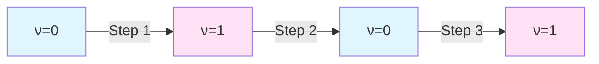
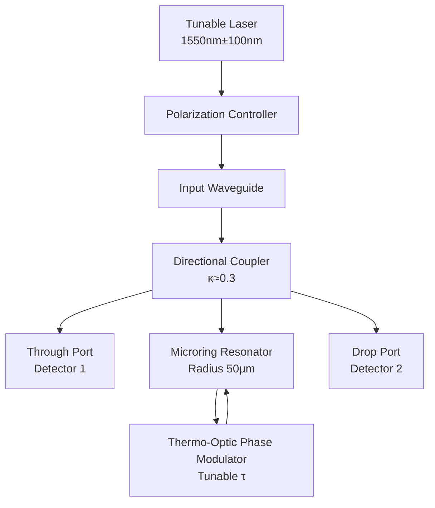
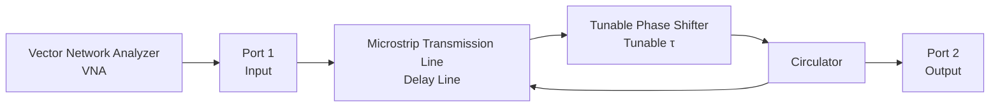
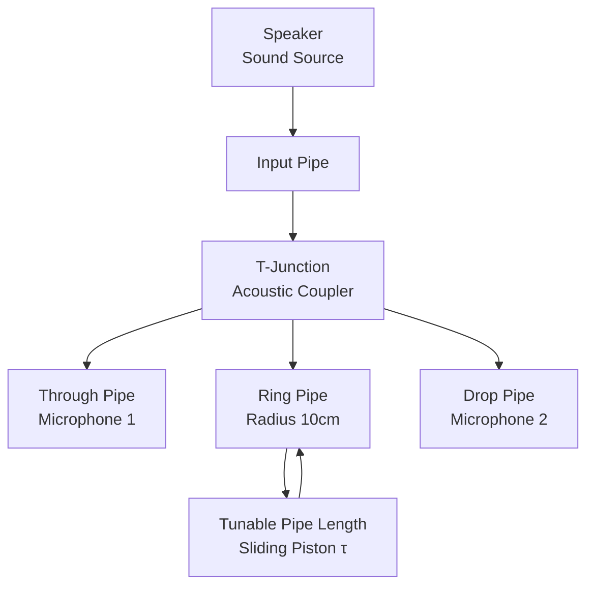

# Topological Fingerprints and Experimental Measurement

Triple Fingerprint Protocol: Joint Measurement of π-Steps, Group Delay Double Peaks, and Spectral Flow Counting

---

## Introduction

No matter how elegant the theory, if it cannot be experimentally verified, it remains just mathematical play.

Previous chapters established complete theoretical framework of self-referential scattering networks. Now the question is: **How to observe and measure these topological quantities in laboratory**?

This chapter provides detailed experimental schemes, including:
- Definition and measurement methods of **triple topological fingerprints**
- Specific designs for three major platforms: optical, microwave, acoustic
- Noise robustness analysis and error control
- Data processing algorithms and topological index reconstruction

---

## Triple Topological Fingerprints

### Fingerprint 1: π-Steps

**Definition**: At fixed frequency $\omega_*$, scan delay parameter $\tau$, observe transitions of scattering phase $\varphi(\omega_*;\tau)$.

**Characteristics**:
- Transition magnitude: $\Delta\varphi = \pm\pi$
- Transition positions: $\tau_k \approx \tau_0 + k\Delta\tau$, where $\Delta\tau = 2\pi/\omega_*$
- Transition direction: Can be positive or negative, depends on pole crossing direction

**Measurement Signal**:



### Fingerprint 2: Group Delay Double-Peak Merger

**Definition**: Near step $\tau \approx \tau_c$, scan frequency $\omega$, observe peak structure of group delay $\tau_g(\omega;\tau)$.

**Characteristics**:
- Far from step: Single peak, large peak width
- Approaching step: Double peaks appear, peak spacing $\Delta\omega(\tau) \sim \sqrt{|\tau-\tau_c|}$ (square-root scaling)
- Exactly at step: Double peaks merge into extremely narrow single peak
- Crossing step: Peak flips or disappears

**Measurement Signal**:



### Fingerprint 3: Spectral Flow Counting and Z₂ Index

**Definition**: Accumulate transition directions of all steps, construct spectral flow count $N(\tau)$ and topological index $\nu(\tau)$.

**Characteristics**:
- $N(\tau) \in \mathbb{Z}$: Integer topological invariant
- $\nu(\tau) = N(\tau) \bmod 2 \in \{0,1\}$: Z₂ topological index
- Each crossing of step, $\nu$ flips once

**Measurement Signal**:



### Complementarity of Triple Fingerprints

| Fingerprint | Advantages | Limitations | Applicable Scenarios |
|------------|-----------|------------|-------------------|
| π-Steps | Direct and clear, easy to identify | Requires precise phase measurement | Low-noise environment |
| Group Delay Double Peaks | Square-root scaling can fit parameters | Requires frequency scanning | Broadband measurement systems |
| Z₂ Index | Robust to noise (only 2 values) | Requires long-term accumulation | Statistical averaging scenarios |

**Joint Measurement Protocol**: Only when triple fingerprints simultaneously satisfy, confirm existence of topological steps.

---

## Optical Platform: Integrated Photonic Microring Resonator

### System Design

**Core Components**:



**Key Parameters**:
- Loop circumference: $L = 2\pi R \approx 314\,\mu\mathrm{m}$
- Group refractive index: $n_g \approx 4.2$ (silicon waveguide)
- Free Spectral Range: $\mathrm{FSR} = c/(n_g L) \approx 227\,\mathrm{GHz}$
- Q factor: $Q \approx 10^5$ (high-Q ring)
- Delay tuning range: $\tau \in [0, 20]\,\mathrm{ps}$ (via thermo-optic effect)

### Measurement Protocol

**Step 1: Transmission Spectrum Scan**
- Fix delay $\tau = \tau_0$
- Scan laser wavelength $\lambda \in [1500, 1600]\,\mathrm{nm}$
- Record transmission power $T(\lambda)$ and phase $\varphi(\lambda)$ (via interferometric measurement)

**Step 2: Delay Scan**
- Fix wavelength $\lambda = \lambda_*$
- Slowly change thermo-optic phase modulator voltage, scan $\tau$
- Continuously monitor transmission phase $\varphi(\lambda_*;\tau)$

**Step 3: Step Identification**
- Unwrap phase data
- Identify $\pi$-level jumps on $\varphi(\tau)$ curve
- Record step positions $\{\tau_k\}$

**Step 4: Double-Peak Measurement**
- Near each step, perform two-dimensional scan $(\lambda, \tau)$
- Calculate group delay $\tau_g(\lambda;\tau) = -\partial\varphi/\partial\omega$
- Extract peak spacing $\Delta\lambda(\tau)$, fit $\Delta\lambda \sim \sqrt{|\tau-\tau_c|}$

### Noise Sources and Countermeasures

**Noise 1: Thermal Noise**
- Source: Environmental temperature fluctuations $\delta T \sim 0.1\,\mathrm{K}$
- Impact: Delay drift $\delta\tau \sim 10^{-3}\,\mathrm{ps}$
- Countermeasure: Active temperature control (TEC), stability $\pm 0.01\,\mathrm{K}$

**Noise 2: Laser Frequency Jitter**
- Source: Laser linewidth $\Delta\nu \sim 100\,\mathrm{kHz}$
- Impact: Phase measurement error $\delta\varphi \sim 0.01\,\mathrm{rad}$
- Countermeasure: Use narrow-linewidth laser (<10kHz), or lock to stable reference cavity

**Noise 3: Detector Dark Current**
- Source: Detector background noise
- Impact: Signal-to-noise ratio degradation
- Countermeasure: Use avalanche photodiode (APD) or balanced homodyne detection

### Expected Results

Under ideal conditions:
- π-step clarity: $>20\,\mathrm{dB}$ (phase transition far exceeds noise)
- Double-peak resolution: Resolvable when peak spacing greater than linewidth ($\Delta\lambda > \lambda/Q$)
- Z₂ index accuracy: $>99\%$ (via majority voting from multiple measurements)

---

## Microwave Platform: Transmission Line Resonator

### System Design

**Core Components**:



**Key Parameters**:
- Operating frequency: $f \in [1, 20]\,\mathrm{GHz}$
- Transmission line length: $L \approx 10\,\mathrm{cm}$ (folded microstrip line)
- Delay tuning: Via ferrite phase shifter, $\tau \in [0, 5]\,\mathrm{ns}$
- Loss: $<1\,\mathrm{dB}/\mathrm{cm}$

### Measurement Protocol

**Step 1: S-Parameter Measurement**
- Use VNA to directly measure complex scattering coefficient $S_{21}(f;\tau)$
- Frequency resolution: $\Delta f = 1\,\mathrm{MHz}$
- Delay step: $\delta\tau = 10\,\mathrm{ps}$

**Step 2: Phase Extraction**
- Extract phase from $S_{21}$: $\varphi(f;\tau) = \arg S_{21}$
- Automatic phase unwrapping (VNA built-in function)

**Step 3: Topological Analysis**
- Same algorithm as optical platform to identify steps
- Utilize VNA's high dynamic range (>100dB) to improve signal-to-noise ratio

### Advantages and Challenges

**Advantages**:
- VNA can directly measure complex scattering coefficients, no additional interferometer needed
- Wide frequency range, can cover multiple FSRs
- Real-time measurement, fast response

**Challenges**:
- At microwave frequencies, phase noise more severe than optical
- Requires precise calibration (de-embedding, port matching)
- Nonlinear effects (e.g., intermodulation distortion) may introduce spurious signals

---

## Acoustic Platform: Air/Water Acoustic Resonator

### System Design

**Acoustic Ring Resonator**:



**Key Parameters**:
- Operating frequency: $f \in [100, 5000]\,\mathrm{Hz}$
- Sound speed: $c \approx 343\,\mathrm{m/s}$ (air, 20°C)
- Loop circumference: $L \approx 0.63\,\mathrm{m}$
- FSR: $c/L \approx 545\,\mathrm{Hz}$
- Delay tuning: Via sliding piston, $\Delta L \in [0, 10]\,\mathrm{cm}$

### Measurement Protocol

**Step 1: Frequency Response Measurement**
- Scan speaker frequency, record microphone signals
- Via dual-microphone measurement of phase difference, indirectly obtain $\varphi(f;\tau)$

**Step 2: Delay Tuning**
- Slowly move sliding piston, change loop length (corresponding to $\tau$)
- Monitor movement of resonance peaks

**Step 3: Visualization**
- Real-time display of transmission spectrum waterfall plot (frequency vs time/position)
- Intuitively observe "peak transitions" corresponding to π-steps

### Teaching Demonstration Potential

Huge advantage of acoustic platform is **visibility** and **low cost**:
- Can use transparent pipes, visually see standing wave modes of sound waves
- Use oscilloscope to display waveforms in real time
- Cost <$100, suitable for undergraduate teaching experiments

This makes abstract "topological steps" into phenomena that can be "seen and heard"!

---

## Data Processing and Topological Index Reconstruction

### Phase Unwrapping Algorithm

**Problem**: Measured phase is modulo $2\pi$, how to recover continuous phase?

**Algorithm** (Itoh method):

```
Input: Discrete phase data {φ[n]}, n=1,2,...,N
Output: Unwrapped phase {Φ[n]}

Φ[1] = φ[1]
for n = 2 to N:
    Δφ = φ[n] - φ[n-1]
    if Δφ > π:
        Δφ = Δφ - 2π
    if Δφ < -π:
        Δφ = Δφ + 2π
    Φ[n] = Φ[n-1] + Δφ
end
```

**Improvement**: For noisy data, use weighted least-squares phase unwrapping.

### Step Detection Algorithm

**Algorithm 1: Threshold Detection**

```
Set threshold θ = 0.8π
for each data point n:
    if |Φ[n+1] - Φ[n]| > θ:
        Mark as step candidate
        Fine search local extremum
        if transition magnitude ≈ π (±10%):
            Confirm step, record position τ_k
```

**Algorithm 2: Change Point Detection** (Bayesian Change Point Detection)

Establish statistical model for phase sequence, use Bayesian method to identify "change points", more robust than threshold method.

### Z₂ Index Reconstruction

**Method 1: Accumulation**

```
ν[0] = 0  # Initial sector
for each step k:
    ν[k] = ν[k-1] ⊕ 1  # XOR operation
```

**Method 2: Frequency Window Integral Method**

Using scale identity:

$$
\nu(\tau) = \left[\frac{1}{\pi}\int_{\omega_1}^{\omega_2}\kappa(\omega;\tau)d\omega\right] \bmod 2
$$

For each $\tau$, scan frequency to calculate integral, directly obtain $\nu$.

Advantage: No need to identify individual steps, robust to partial data loss.

### Error Analysis

**Error Sources**:
1. Phase measurement error: $\delta\varphi \sim 0.01\,$rad
2. Step position uncertainty: $\delta\tau_k \sim \Delta\tau/100$
3. Transition magnitude deviation from π: $\Delta\varphi = \pi(1\pm 0.05)$

**Fault Tolerance of Z₂ Index**:

Since $\nu \in \{0,1\}$ only has two values, as long as correctly judge "parity" it's fine.

Estimate: Assuming step identification accuracy $p=95\%$, after $N$ steps, Z₂ index error probability:

$$
P_{\mathrm{error}} \approx \frac{1 - p^N}{2} \approx 0.025N
$$

For $N=10$, error rate about 25%. Through multiple measurements with majority voting, can reduce to <1%.

---

## Topological Scattering Spectroscopy: New Experimental Paradigm

### Traditional Scattering Spectroscopy

In traditional spectroscopy or scattering experiments, focus on:
- **Peak positions**: Corresponding to energy levels or resonance frequencies
- **Peak widths**: Corresponding to lifetimes or dissipation
- **Peak intensities**: Corresponding to coupling strengths or transition probabilities

These are all **local quantities**.

### Topological Scattering Spectroscopy

New paradigm introduced by self-referential scattering network: Focus on **global topological quantities**:
- **π-Step positions**: "Phase transition points" in parameter space
- **Spectral flow counting**: Integer topological invariants
- **Z₂ Index**: Two-valued topological sector labels

These quantities **do not depend on local details** (like specific coupling coefficients), only depend on **overall topological structure**.

### Comparison of Experimental Signatures

| Traditional Spectroscopy | Topological Spectroscopy | Measurement Object |
|------------------------|------------------------|------------------|
| Resonance peaks | π-Steps | Phase transitions |
| Linewidth | Double-peak spacing | $\sqrt{|\tau-\tau_c|}$ scaling |
| Intensity | Z₂ Index | Parity transition counting |
| Local properties | Global properties | Topological invariants |

### Application Prospects

**Material Characterization**:
- Use topological index to distinguish different phases (topological insulator vs trivial insulator)
- Detect critical points of topological phase transitions

**Quantum Computing**:
- Readout of topological qubits
- Verification of topological protection

**Fundamental Physics**:
- Probe topological properties of spacetime
- Search for "cosmic self-referential signals"

---

## Chapter Summary

### Triple Fingerprints

1. **π-Steps**: Phase transition $\pm\pi$
2. **Group Delay Double Peaks**: Square-root scaling $\Delta\omega\sim\sqrt{|\tau-\tau_c|}$
3. **Z₂ Index**: Parity transition $\nu(\tau) \in \{0,1\}$

Three complement each other, jointly confirm topological structure.

### Three Major Platforms

- **Optical**: High precision, fast, suitable for fine measurements
- **Microwave**: Broadband, real-time, suitable for system characterization
- **Acoustic**: Visible, low cost, suitable for teaching demonstrations

### Data Processing

- Phase unwrapping: Itoh algorithm or weighted least squares
- Step detection: Threshold method or Bayesian change point detection
- Z₂ reconstruction: Accumulation method or frequency window integral

### New Paradigm

**Topological Scattering Spectroscopy**: From local spectral features to measurement of global topological invariants.

---

## Thought Questions

1. **Optimal Measurement**: For given signal-to-noise ratio, how to optimize scanning strategy (frequency step, delay step) to fastest identify topological steps?

2. **Multi-Parameter Systems**: If there are two tunable parameters $(\tau_1,\tau_2)$, π-steps generalize to two-dimensional "step lines". How to scan and visualize?

3. **Quantum Noise**: In quantum optical experiments, will shot noise destroy measurement of topological index? Or does discreteness of Z₂ provide protection?

4. **Machine Learning**: Can we train neural networks to directly identify topological index from raw transmission spectra, without manually setting thresholds?

5. **Real-Time Monitoring**: Design a "topological monitor" that displays current topological sector ($\nu=0$ or 1) in real time when delay continuously scans. What are hardware requirements?

---

## Preview of Next Chapter

Returning from experimental measurement to theoretical depth:

**Undecidability and Topological Complexity**

We will:
- Topologize self-referential loop topology as fundamental group of configuration graph
- Prove "whether loop is contractible" equivalent to halting problem (topological undecidability)
- Introduce complexity entropy, establish second law of computational universe
- Explore deep connections between self-reference, undecidability, and Gödel's incompleteness

From physical experiments to limits of mathematical logic, let us reveal ultimate mysteries of self-referential structure!

