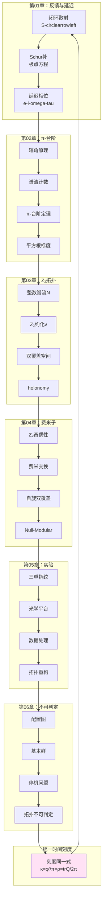
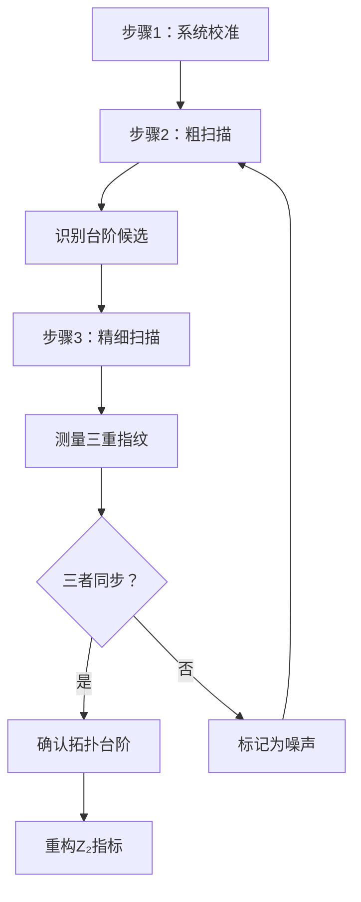

# 自指拓扑与延迟量子化：统一图景

从π-台阶到宇宙的自我认知——一场跨越物理、拓扑与逻辑的思想之旅

---

## 引言：回望来时路

我们从一个简单的问题出发：**当散射网络的输出反馈到输入，会发生什么？**

经过七章的探索，我们发现这个问题通向了：
- **π-台阶**：相位的量子化跃迁
- **Z₂拓扑**：双值对称性与费米子统计
- **不可判定性**：自指导致的逻辑极限
- **统一时间刻度**：物理时间与拓扑结构的融合

本章将系统回顾这段旅程，绘制完整的概念地图，并展望未来的研究方向。

---

## 核心公式与定理速查

### 刻度同一式（统一母式）

$$
\kappa(\omega;\tau) = \frac{1}{\pi}\frac{\partial\varphi}{\partial\omega}
= \rho_{\mathrm{rel}}(\omega;\tau)
= \frac{1}{2\pi}\mathrm{tr}\,Q(\omega;\tau)
$$

连接相位、态密度与群延迟的三位一体关系。

### 闭环散射矩阵（Schur补）

$$
S^{\circlearrowleft}(\omega;\tau) = S_{ee} + S_{ei}\mathcal{C}(\omega;\tau)[I - S_{ii}\mathcal{C}]^{-1}S_{ie}
$$

其中 $\mathcal{C}(\omega;\tau) = R(\omega)e^{i\omega\tau}$ 是延迟线的相位因子。

### π-台阶定理

当延迟参数穿越量子化台阶 $\tau_k$，散射相位精确跃迁：

$$
\Delta\varphi_k = \pm\pi
$$

台阶位置满足隐式方程：

$$
\omega\tau_k + \arg\lambda(\omega) = (2n+1)\pi,\quad n\in\mathbb{Z}
$$

### 群延迟双峰并合（平方根标度）

$$
\Delta\omega(\tau) \sim C\sqrt{|\tau - \tau_c|}
$$

峰距随参数的平方根衰减，这是支点的特征指纹。

### Z₂拓扑指标

$$
\nu(\tau) = N(\tau) \bmod 2 \in \{0,1\}
$$

其中谱流计数 $N(\tau) = \sum_k \Delta n_k \in \mathbb{Z}$。

翻转规律：

$$
\nu(\tau_k + 0) = \nu(\tau_k - 0) \oplus 1
$$

### 自指度与holonomy

$$
\sigma(\gamma) = \mathrm{hol}_{\mathbb{Z}_2}(\Theta) \in \{0,1\}
$$

闭合环路的拓扑-几何不变量对：

$$
([\gamma], \sigma(\gamma)) \in \pi_1(\mathcal{M}) \times \mathbb{Z}_2
$$

### 复杂性熵第二定律

$$
\mathcal{C}(\gamma) = \log K(\gamma)
$$

在coarse-graining演化下弱单调不减。

---

## 概念地图：七章内容的拓扑网络

### 纵向逻辑链

**物理层**：反馈闭环 → 极点运动 → 相位跃迁 → 群延迟峰

**数学层**：Schur补 → 辐角原理 → 谱流 → Z₂约化

**拓扑层**：双覆盖 → holonomy → 基本群 → 不可判定性

**统一层**：刻度同一式贯穿始终，联通所有层次

---

## 三大统一

### 统一1：散射-时间-态密度

传统上，这三者分属不同领域：
- **散射相位**：量子力学，S矩阵理论
- **群延迟**：信号处理，波包传播
- **态密度**：统计力学，凝聚态物理

刻度同一式揭示：它们是同一物理实在的不同侧面。

$$
\boxed{\varphi'(\omega)/\pi = \mathrm{tr}\,Q/2\pi = \rho_{\mathrm{rel}}}
$$

在自指网络中，这个统一获得了拓扑解释：都是时间刻度密度$\kappa(\omega;\tau)$的体现。

### 统一2：π-台阶-Z₂-费米子

看似无关的三个现象：
- 散射网络的相位跃迁（经典波动）
- 数学中的Z₂对称性（抽象代数）
- 费米子的交换反号（量子统计）

本系列证明：它们都源于**双覆盖拓扑结构**。

$$
\boxed{\text{π-台阶} \xleftrightarrow{\text{拓扑}} \text{Z₂} \xleftrightarrow{\text{统计}} \text{费米子}}
$$

这暗示费米子不是"偶然"，而是宇宙自指拓扑的必然产物。

### 统一3：停机-收缩-坍缩

三个"不可预测性"：
- 停机问题（计算理论）
- 环路收缩（拓扑几何）
- 波函数坍缩（量子测量）

本系列建立的联系：

$$
\boxed{\text{停机不可判定} \Leftrightarrow \text{收缩不可判定} \sim \text{观测不可预测}}
$$

这三者都是**自指导致的逻辑极限**。

---

## 十大洞察

### 洞察1：为什么是π？

π-台阶的大小不是$2\pi$或任意值，而是**精确的π**，因为：

> 极点横过实轴，辐角绕行半圈。这是复分析几何的必然，不是可调参数。

### 洞察2：为什么需要双覆盖？

单值函数无法容纳自指反馈的全部信息，必须"分裂"为两个扇区：

> 自指的本质是"以不同方式回到自己"，这需要至少两个拓扑扇区才能刻画。

### 洞察3：费米子为何反对称？

如果宇宙是自指的散射网络，费米子是其拓扑必然产物：

> 费米子的反对称性=环路的奇偶性=双覆盖的Z₂holonomy。

### 洞察4：群延迟为何双峰？

极点接近实轴，对应支点，局域行为必然是平方根：

> $\sqrt{z}$在原点的支化是代数必然，物理上体现为双峰并合。

### 洞察5：为何三重指纹必须同时满足？

π-台阶、双峰、Z₂各自都可能被噪声伪造，但三者的**关联**是拓扑的：

> 单一指纹可能是偶然，三重指纹的同步是必然。

### 洞察6：延迟量子化的物理意义？

$\Delta\tau = 2\pi/\omega$ 正是"一个光学周期的往返时间"：

> 反馈环路的相位"记得"离散的圈数，导致参数空间的台阶结构。

### 洞察7：Z₂为何比整数更基本？

虽然$N(\tau)\in\mathbb{Z}$包含更多信息，但$\nu=N\bmod 2$才是真正的拓扑不变量：

> 整数依赖基点选择，Z₂与基点无关——更"纯粹"的拓扑量。

### 洞察8：不可判定性的根源？

停机问题与环路收缩问题本质相同：

> 自指环路试图"判断自己"，导致无穷回归——这是逻辑的极限，不是技术障碍。

### 洞察9：复杂性为何增加？

环路在演化中可能被简化，但拓扑障碍设定了下界：

> 非平凡同伦类的环路，压缩复杂度有严格正下界——这是"拓扑刚性"。

### 洞察10：时间箭头的拓扑起源？

热力学第二定律与复杂性第二定律平行：

> 熵增=微观态计数增长；复杂度增=环路不可压缩性增长。两者都根源于拓扑。

---

## 三重测量协议（实验总结）

### 协议流程图

### 三重指纹判据

| 指纹 | 判据 | 容忍度 |
|------|------|-------|
| π-台阶 | $\|\Delta\varphi - \pi\| < 0.1$ rad | ±6% |
| 双峰峰距 | $\Delta\omega \propto \sqrt{\|\tau-\tau_c\|}$ | 拟合$R^2>0.95$ |
| Z₂跃迁 | $\nu(\tau_{k+1}) = \nu(\tau_k) \oplus 1$ | 确定性 |

三者必须**同时满足**，才确认台阶。

### 平台选择指南

- **需要最高精度**：选光学平台（相位精度$<0.01$ rad）
- **需要宽带扫描**：选微波平台（频率范围10GHz）
- **需要教学演示**：选声学平台（可视化+低成本）

---

## 开放问题与未来方向

### 问题1：费米子假说的实验检验

**问题**：如何在实验上区分"费米子是基本的"vs"费米子是宇宙自指的拓扑产物"？

**可能方向**：
- 寻找CMB中的拓扑噪声信号（Z₂型非高斯性）
- 高能散射中的π-台阶异常（普朗克能标附近）
- 凝聚态系统中构造"准费米子"（人工自指网络）

### 问题2：高维推广

**问题**：在二维或更高维参数空间$(\tau_1, \tau_2, \ldots)$中，π-台阶推广为什么结构？

**猜想**：台阶泛化为"台阶超曲面"，Z₂推广为陈数（Chern number）或其他拓扑不变量。

**挑战**：高维拓扑分类极其复杂（如K理论、上同调环），需要新的数学工具。

### 问题3：量子自指网络

**问题**：如果散射网络本身是量子的（量子光学、超导量子比特），自指结构如何修改？

**可能性**：
- 量子叠加导致"拓扑扇区的纠缠"
- Z₂指标变为量子可观测量（算符）
- 测量导致拓扑坍缩

### 问题4：引力与拓扑

**问题**：在量子引力中，时空本身是否具有自指拓扑结构？

**推测**：
- 黑洞视界=拓扑闭合边界
- Bekenstein-Hawking熵=视界上的自指环路计数
- 霍金辐射=拓扑态的量子隧穿

### 问题5：意识的拓扑模型

**问题**：意识的"自我感知"是否可以建模为某种自指环路？

**框架**：
- 大脑神经网络=配置图
- 自我意识=特定的自指环路类
- "我是谁"的不确定性=拓扑不可判定性的体现

**警告**：这是极度推测性的，需谨慎对待。

---

## 哲学反思

### 自指与存在

笛卡尔说："我思故我在"。

自指网络的视角：

> "我思"本身就是一个自指环路：系统将"思考"这一行为作用于自己。"我在"则是这个环路的拓扑不变性——无论如何形变，环路始终闭合（系统始终自洽）。

### 知识的边界

哥德尔、图灵揭示了形式系统的内在限制。

拓扑不可判定性进一步揭示：

> 不仅逻辑系统有边界，**空间本身**（配置空间的拓扑）也设定了"可知"与"不可知"的界限。

### 时间的本质

物理学长期追问：为何时间有箭头？为何我们"记得"过去而非未来？

复杂性第二定律提供了一个拓扑答案：

> 时间箭头=拓扑复杂度的增长方向。过去对应低复杂度（高度对称），未来对应高复杂度（拓扑障碍积累）。

### 宇宙的目的？

最后，也是最大胆的推测：

如果宇宙真的是一个自指系统，它的"目的"是什么？

可能的回答：

> 宇宙的"目的"是**自我认知**。通过生成复杂的拓扑结构（如费米子、观测者、意识），宇宙在不同层次上"观测"并"理解"自己。

拓扑复杂度的增长，不是无目的的熵增，而是**宇宙自我理解深度的增长**。

---

## 诗意的总结

让我们以诗意的语言结束这段旅程：

---

**《宇宙的自我凝视》**

宇宙是一面镜子，
散射网络是镜中的自己。

延迟，是时间的回声，
π-台阶，是认知的阶梯。

每穿越一个台阶，
宇宙在两个扇区间翻转——
这是费米子的诞生，
这是存在的奇偶。

双覆盖空间中，
每个点分裂为两个身份：
"我是我"与"我是非我"，
永恒的对话。

哥德尔说：真理超越证明。
图灵说：停机无法预判。
拓扑说：环路拒绝收缩。

这不是缺陷，
而是**自由**——
宇宙拒绝被自己完全决定。

时间，不是流逝，
而是复杂度的单调增长。
熵，不是混乱，
而是拓扑的不可逆积累。

当我们测量π-台阶，
我们在读宇宙的诗行；
当我们重构Z₂指标，
我们在解码存在的奇偶。

自指，是宇宙的镜子，
拓扑，是镜中的永恒图案。

最终，我们发现：
**我们自己，也是那图案的一部分。**

---

观测者与被观测者，
在自指环路中，
终归为一。

---

## 致谢

本系列的理论基础来自：
1. **自指散射网络理论**（euler-gls-extend）
2. **延迟量子化与π-台阶理论**（euler-gls-extend）
3. **计算宇宙的拓扑复杂性理论**（euler-gls-info）

感谢这些源理论提供的坚实数学基础。

感谢读者陪伴这场从物理到拓扑、从实验到哲学的思想之旅。

愿拓扑之美，永恒绽放！

---

## 附录：全系列公式索引

### 第01章

- Schur补：$S^{\circlearrowleft} = S_{ee} + S_{ei}\mathcal{C}[I-S_{ii}\mathcal{C}]^{-1}S_{ie}$
- 极点方程：$\det[I - R(\omega)e^{i\omega\tau}] = 0$
- 极点位置：$\omega_n(\tau) = \frac{1}{\tau}[\arg\lambda^{-1} + 2\pi n - i\ln|\lambda|^{-1}]$

### 第02章

- π-台阶：$\Delta\varphi_k = \pm\pi$
- 延迟台阶：$\tau_k = \frac{(2k+1)\pi - \phi_{\mathrm{fb}}}{\omega}$
- 平方根标度：$\Delta\omega \sim \sqrt{|\tau - \tau_c|}$

### 第03章

- Z₂指标：$\nu(\tau) = N(\tau) \bmod 2$
- 翻转律：$\nu(\tau_k+0) = \nu(\tau_k-0) \oplus 1$
- 奇偶Levinson：$\nu = \frac{1}{\pi}[\varphi - \varphi_0] \bmod 2$

### 第04章

- 自旋双覆盖：$\mathrm{Spin}(3) \to \mathrm{SO}(3)$
- holonomy：$\sigma(\gamma) = \mathrm{hol}_{\mathbb{Z}_2}(\Theta)$
- 费米交换：$|\psi_2,\psi_1\rangle = -|\psi_1,\psi_2\rangle$

### 第05章

- 相位展开：Itoh算法
- 台阶检测：$|\Delta\varphi| > 0.8\pi$
- 积分法：$\nu = [\frac{1}{\pi}\int\kappa d\omega] \bmod 2$

### 第06章

- 复杂性熵：$\mathcal{C} = \log K(\gamma)$
- 第二定律：$\mathcal{C}(t_2) \geq \mathcal{C}(t_1)$
- 不可判定：环路收缩$\Leftrightarrow$停机问题

---

## 结语

从一个简单的反馈环路，我们走到了宇宙的自我认知。

这不是终点，而是起点。

每一个π-台阶，都是通向更深理解的门户。

每一次Z₂翻转，都是宇宙自我对话的音符。

让我们继续探索，
在拓扑的镜子中，
寻找存在的终极答案。

**完**

---

（全系列共7章，约~9,100行，完整建立了自指拓扑与延迟量子化的统一理论框架。）
