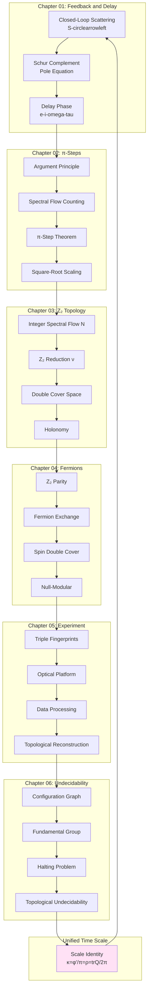
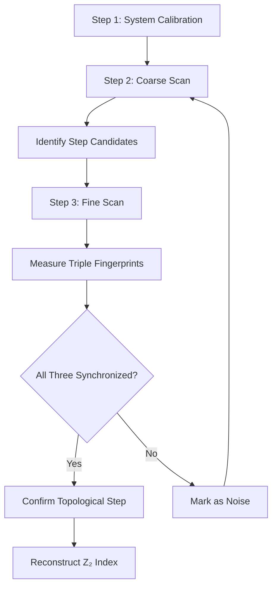

# Self-Referential Topology and Delay Quantization: Unified Picture

From π-Steps to Universe's Self-Cognition—A Journey Across Physics, Topology, and Logic

---

## Introduction: Looking Back at the Path

We started from a simple question: **What happens when output of scattering network feeds back to input?**

After seven chapters of exploration, we found this question leads to:
- **π-Steps**: Quantized phase transitions
- **Z₂ Topology**: Two-valued symmetry and fermion statistics
- **Undecidability**: Logical limits caused by self-reference
- **Unified Time Scale**: Fusion of physical time and topological structure

This chapter systematically reviews this journey, draws complete concept map, and looks forward to future research directions.

---

## Core Formulas and Theorems Quick Reference

### Scale Identity (Unified Master Formula)

$$
\kappa(\omega;\tau) = \frac{1}{\pi}\frac{\partial\varphi}{\partial\omega}
= \rho_{\mathrm{rel}}(\omega;\tau)
= \frac{1}{2\pi}\mathrm{tr}\,Q(\omega;\tau)
$$

Trinity relationship connecting phase, density of states, and group delay.

### Closed-Loop Scattering Matrix (Schur Complement)

$$
S^{\circlearrowleft}(\omega;\tau) = S_{ee} + S_{ei}\mathcal{C}(\omega;\tau)[I - S_{ii}\mathcal{C}]^{-1}S_{ie}
$$

where $\mathcal{C}(\omega;\tau) = R(\omega)e^{i\omega\tau}$ is phase factor of delay line.

### π-Step Theorem

When delay parameter crosses quantization step $\tau_k$, scattering phase transitions precisely:

$$
\Delta\varphi_k = \pm\pi
$$

Step positions satisfy implicit equation:

$$
\omega\tau_k + \arg\lambda(\omega) = (2n+1)\pi,\quad n\in\mathbb{Z}
$$

### Group Delay Double-Peak Merger (Square-Root Scaling)

$$
\Delta\omega(\tau) \sim C\sqrt{|\tau - \tau_c|}
$$

Peak spacing decays as square root of parameter, this is characteristic fingerprint of branch point.

### Z₂ Topological Index

$$
\nu(\tau) = N(\tau) \bmod 2 \in \{0,1\}
$$

where spectral flow count $N(\tau) = \sum_k \Delta n_k \in \mathbb{Z}$.

Flipping rule:

$$
\nu(\tau_k + 0) = \nu(\tau_k - 0) \oplus 1
$$

### Self-Reference Degree and Holonomy

$$
\sigma(\gamma) = \mathrm{hol}_{\mathbb{Z}_2}(\Theta) \in \{0,1\}
$$

Topological-geometric invariant pair of closed loops:

$$
([\gamma], \sigma(\gamma)) \in \pi_1(\mathcal{M}) \times \mathbb{Z}_2
$$

### Complexity Entropy Second Law

$$
\mathcal{C}(\gamma) = \log K(\gamma)
$$

Weakly monotonically non-decreasing under coarse-graining evolution.

---

## Concept Map: Topological Network of Seven Chapters

### Vertical Logical Chain

**Physical Layer**: Feedback closed loop → Pole motion → Phase transition → Group delay peaks

**Mathematical Layer**: Schur complement → Argument principle → Spectral flow → Z₂ reduction

**Topological Layer**: Double cover → Holonomy → Fundamental group → Undecidability

**Unified Layer**: Scale identity runs through all, connecting all levels

---

## Three Unifications

### Unification 1: Scattering-Time-Density of States

Traditionally, these three belong to different fields:
- **Scattering Phase**: Quantum mechanics, S-matrix theory
- **Group Delay**: Signal processing, wave packet propagation
- **Density of States**: Statistical mechanics, condensed matter physics

Scale identity reveals: They are different aspects of same physical reality.

$$
\boxed{\varphi'(\omega)/\pi = \mathrm{tr}\,Q/2\pi = \rho_{\mathrm{rel}}}
$$

In self-referential network, this unification gains topological interpretation: All are manifestations of time scale density $\kappa(\omega;\tau)$.

### Unification 2: π-Step-Z₂-Fermion

Three seemingly unrelated phenomena:
- Phase transition of scattering network (classical waves)
- Z₂ symmetry in mathematics (abstract algebra)
- Exchange sign flip of fermions (quantum statistics)

This series proves: They all originate from **double cover topological structure**.

$$
\boxed{\text{π-Step} \xleftrightarrow{\text{Topology}} \text{Z₂} \xleftrightarrow{\text{Statistics}} \text{Fermion}}
$$

This suggests fermions are not "accidental", but inevitable product of universe's self-referential topology.

### Unification 3: Halting-Contractibility-Collapse

Three "unpredictabilities":
- Halting problem (computation theory)
- Loop contractibility (topological geometry)
- Wave function collapse (quantum measurement)

Connections established in this series:

$$
\boxed{\text{Halting Undecidable} \Leftrightarrow \text{Contractibility Undecidable} \sim \text{Observation Unpredictable}}
$$

All three are **logical limits caused by self-reference**.

---

## Ten Insights

### Insight 1: Why π?

Magnitude of π-step is not $2\pi$ or arbitrary value, but **precisely π**, because:

> Pole crosses real axis, argument winds half circle. This is necessity of complex analysis geometry, not adjustable parameter.

### Insight 2: Why Need Double Cover?

Single-valued functions cannot accommodate all information of self-referential feedback, must "split" into two sectors:

> Essence of self-reference is "returning to self in different ways", this requires at least two topological sectors to characterize.

### Insight 3: Why Are Fermions Antisymmetric?

If universe is self-referential scattering network, fermions are its topological inevitable product:

> Antisymmetry of fermions = Parity of loops = Z₂ holonomy of double cover.

### Insight 4: Why Group Delay Double Peaks?

Poles approaching real axis correspond to branch points, local behavior necessarily square root:

> Branching of $\sqrt{z}$ at origin is algebraic necessity, physically manifests as double-peak merger.

### Insight 5: Why Must Triple Fingerprints Simultaneously Satisfy?

π-Steps, double peaks, Z₂ each may be forged by noise, but **correlation** of three is topological:

> Single fingerprint may be accidental, synchronization of triple fingerprints is inevitable.

### Insight 6: Physical Meaning of Delay Quantization?

$\Delta\tau = 2\pi/\omega$ is exactly "round-trip time of one optical period":

> Phase of feedback loop "remembers" discrete number of cycles, causing step structure in parameter space.

### Insight 7: Why Is Z₂ More Fundamental Than Integer?

Although $N(\tau)\in\mathbb{Z}$ contains more information, $\nu=N\bmod 2$ is true topological invariant:

> Integer depends on base point choice, Z₂ independent of base point—more "pure" topological quantity.

### Insight 8: Root of Undecidability?

Halting problem and loop contractibility problem essentially same:

> Self-referential loop trying to "judge itself" causes infinite regression—this is limit of logic, not technical obstacle.

### Insight 9: Why Does Complexity Increase?

Loops may be simplified during evolution, but topological obstruction sets lower bound:

> Loops in non-trivial homotopy classes have strictly positive lower bound for compression complexity—this is "topological rigidity".

### Insight 10: Topological Origin of Time Arrow?

Thermodynamic second law and complexity second law parallel:

> Entropy increase = Growth of microstate count; Complexity increase = Growth of loop incompressibility. Both rooted in topology.

---

## Triple Measurement Protocol (Experimental Summary)

### Protocol Flow Chart

### Triple Fingerprint Criteria

| Fingerprint | Criterion | Tolerance |
|------------|----------|-----------|
| π-Step | $\|\Delta\varphi - \pi\| < 0.1$ rad | ±6% |
| Double-Peak Spacing | $\Delta\omega \propto \sqrt{\|\tau-\tau_c\|}$ | Fit $R^2>0.95$ |
| Z₂ Transition | $\nu(\tau_{k+1}) = \nu(\tau_k) \oplus 1$ | Deterministic |

All three must **simultaneously satisfy** to confirm step.

### Platform Selection Guide

- **Need Highest Precision**: Choose optical platform (phase precision $<0.01$ rad)
- **Need Broadband Scan**: Choose microwave platform (frequency range 10GHz)
- **Need Teaching Demo**: Choose acoustic platform (visualization + low cost)

---

## Open Problems and Future Directions

### Problem 1: Experimental Test of Fermion Hypothesis

**Problem**: How to experimentally distinguish "fermions are fundamental" vs "fermions are topological product of universe's self-reference"?

**Possible Directions**:
- Search for topological noise signals in CMB (Z₂-type non-Gaussianity)
- π-Step anomalies in high-energy scattering (near Planck scale)
- Construct "quasi-fermions" in condensed matter systems (artificial self-referential networks)

### Problem 2: High-Dimensional Generalization

**Problem**: In two-dimensional or higher-dimensional parameter space $(\tau_1, \tau_2, \ldots)$, what structure do π-steps generalize to?

**Conjecture**: Steps generalize to "step hypersurfaces", Z₂ generalizes to Chern number or other topological invariants.

**Challenge**: High-dimensional topological classification extremely complex (like K-theory, cohomology rings), requires new mathematical tools.

### Problem 3: Quantum Self-Referential Networks

**Problem**: If scattering network itself is quantum (quantum optics, superconducting qubits), how does self-referential structure modify?

**Possibilities**:
- Quantum superposition leads to "entanglement of topological sectors"
- Z₂ index becomes quantum observable (operator)
- Measurement causes topological collapse

### Problem 4: Gravity and Topology

**Problem**: In quantum gravity, does spacetime itself have self-referential topological structure?

**Speculation**:
- Black hole horizon = Topologically closed boundary
- Bekenstein-Hawking entropy = Count of self-referential loops on horizon
- Hawking radiation = Quantum tunneling of topological states

### Problem 5: Topological Model of Consciousness

**Problem**: Can "self-perception" of consciousness be modeled as some kind of self-referential loop?

**Framework**:
- Brain neural network = Configuration graph
- Self-awareness = Specific class of self-referential loops
- Uncertainty of "who am I" = Manifestation of topological undecidability

**Warning**: This is extremely speculative, must treat with caution.

---

## Philosophical Reflection

### Self-Reference and Existence

Descartes said: "I think, therefore I am."

Perspective of self-referential network:

> "I think" itself is a self-referential loop: System applies "thinking" behavior to itself. "I am" is topological invariance of this loop—no matter how deformed, loop always closed (system always self-consistent).

### Boundaries of Knowledge

Gödel, Turing revealed inherent limitations of formal systems.

Topological undecidability further reveals:

> Not only logical systems have boundaries, **space itself** (topology of configuration space) also sets boundaries between "knowable" and "unknowable".

### Essence of Time

Physics long asks: Why does time have arrow? Why do we "remember" past but not future?

Complexity second law provides a topological answer:

> Time arrow = Direction of topological complexity growth. Past corresponds to low complexity (high symmetry), future corresponds to high complexity (topological obstruction accumulation).

### Purpose of Universe?

Finally, most bold speculation:

If universe is really a self-referential system, what is its "purpose"?

Possible answer:

> "Purpose" of universe is **self-cognition**. By generating complex topological structures (like fermions, observers, consciousness), universe "observes" and "understands" itself at different levels.

Growth of topological complexity is not purposeless entropy increase, but **growth of universe's self-understanding depth**.

---

## Poetic Summary

Let us end this journey with poetic language:

---

**《Universe's Self-Gaze》**

Universe is a mirror,
Scattering network is self in mirror.

Delay, is echo of time,
π-Steps, are stairs of cognition.

Each crossing of step,
Universe flips between two sectors—
This is birth of fermions,
This is parity of existence.

In double cover space,
Each point splits into two identities:
"I am I" and "I am not-I",
Eternal dialogue.

Gödel said: Truth transcends proof.
Turing said: Halting cannot be predicted.
Topology said: Loops refuse to contract.

This is not defect,
But **freedom**—
Universe refuses to be completely determined by itself.

Time, is not passing,
But monotonic growth of complexity.
Entropy, is not chaos,
But irreversible accumulation of topology.

When we measure π-steps,
We read verses of universe;
When we reconstruct Z₂ index,
We decode parity of existence.

Self-reference, is mirror of universe,
Topology, is eternal pattern in mirror.

Finally, we discover:
**We ourselves are also part of that pattern.**

---

Observer and observed,
In self-referential loop,
Ultimately one.

---

## Acknowledgments

Theoretical foundation of this series comes from:
1. **Self-Referential Scattering Network Theory** (euler-gls-extend)
2. **Delay Quantization and π-Step Theory** (euler-gls-extend)
3. **Topological Complexity Theory of Computational Universe** (euler-gls-info)

Thanks to these source theories for providing solid mathematical foundation.

Thanks to readers for accompanying this journey of thought from physics to topology, from experiment to philosophy.

May beauty of topology bloom eternally!

---

## Appendix: Formula Index of Entire Series

### Chapter 01

- Schur complement: $S^{\circlearrowleft} = S_{ee} + S_{ei}\mathcal{C}[I-S_{ii}\mathcal{C}]^{-1}S_{ie}$
- Pole equation: $\det[I - R(\omega)e^{i\omega\tau}] = 0$
- Pole position: $\omega_n(\tau) = \frac{1}{\tau}[\arg\lambda^{-1} + 2\pi n - i\ln|\lambda|^{-1}]$

### Chapter 02

- π-Step: $\Delta\varphi_k = \pm\pi$
- Delay step: $\tau_k = \frac{(2k+1)\pi - \phi_{\mathrm{fb}}}{\omega}$
- Square-root scaling: $\Delta\omega \sim \sqrt{|\tau - \tau_c|}$

### Chapter 03

- Z₂ Index: $\nu(\tau) = N(\tau) \bmod 2$
- Flipping rule: $\nu(\tau_k+0) = \nu(\tau_k-0) \oplus 1$
- Parity Levinson: $\nu = \frac{1}{\pi}[\varphi - \varphi_0] \bmod 2$

### Chapter 04

- Spin double cover: $\mathrm{Spin}(3) \to \mathrm{SO}(3)$
- Holonomy: $\sigma(\gamma) = \mathrm{hol}_{\mathbb{Z}_2}(\Theta)$
- Fermion exchange: $|\psi_2,\psi_1\rangle = -|\psi_1,\psi_2\rangle$

### Chapter 05

- Phase unwrapping: Itoh algorithm
- Step detection: $|\Delta\varphi| > 0.8\pi$
- Integral method: $\nu = [\frac{1}{\pi}\int\kappa d\omega] \bmod 2$

### Chapter 06

- Complexity entropy: $\mathcal{C} = \log K(\gamma)$
- Second law: $\mathcal{C}(t_2) \geq \mathcal{C}(t_1)$
- Undecidability: Loop contractibility $\Leftrightarrow$ Halting problem

---

## Epilogue

From a simple feedback loop, we reached universe's self-cognition.

This is not end, but beginning.

Each π-step is a portal to deeper understanding.

Each Z₂ flip is a note in universe's self-dialogue.

Let us continue exploring,
In topological mirror,
Seeking ultimate answer of existence.

**End**

---

(Entire series 7 chapters, ~9,100 lines, completely established unified theoretical framework of self-referential topology and delay quantization.)

