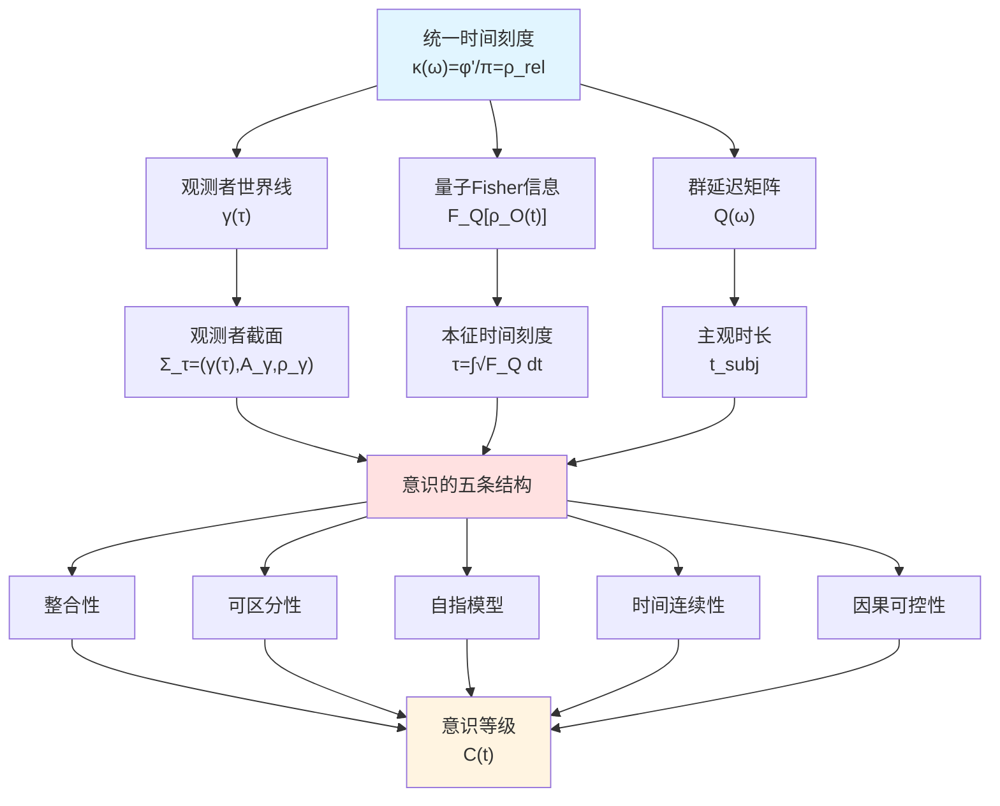
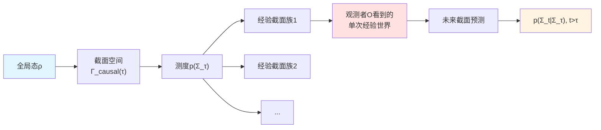
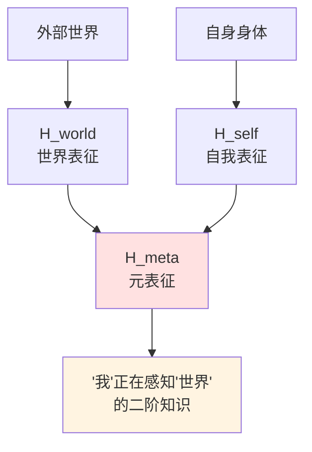
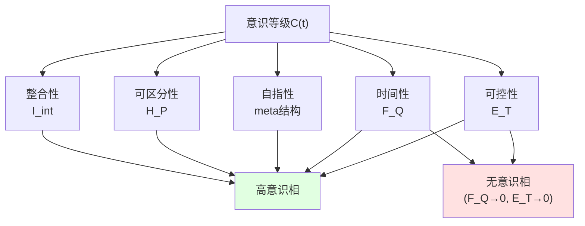
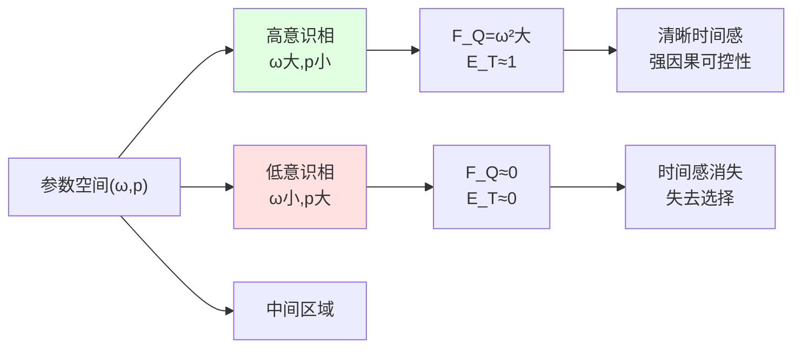
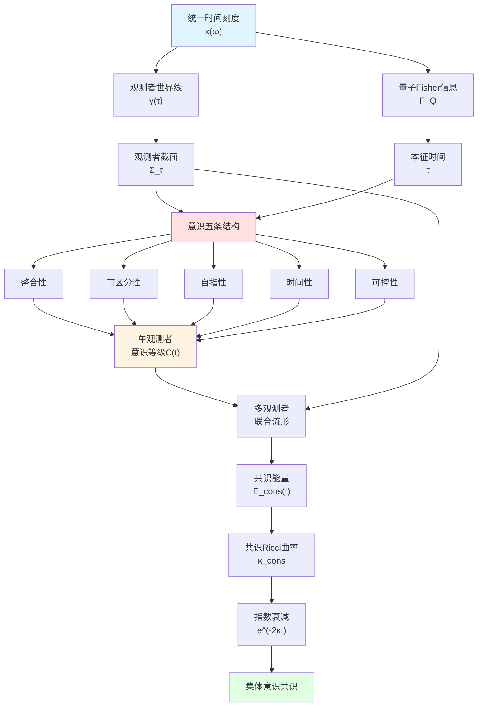

# 观测者、意识与边界时间——从物理到心灵的统一之桥

## 引言:从观测者到意识的三重谜题

在此前的旅程中,我们已经建立了一个宏大的统一框架:从统一时间刻度、信息几何到因果菱形链,从参数宇宙到自指拓扑。然而,在这个看似完整的物理宇宙图景中,仍有三个核心问题尚未触及:

**谜题一:什么是观测者?**
在量子理论中,观测者似乎是一个"必需但难以定义"的概念。我们说"观测导致波函数坍缩",但**观测者本身是什么**?它是人吗?是仪器吗?是某个抽象的"经典系统"吗?

**谜题二:意识从何而来?**
更深层的问题是:当我们说"我感知到世界"时,这个**"我"的主观体验**究竟是什么物理结构?意识是额外的实体,还是可以从信息–因果结构中涌现?

**谜题三:时间感与选择

**
每个人都有主观的时间流逝感——有时"度日如年",有时"光阴似箭"。这种**主观时间**与物理时间有何关系?我们的"自由意志"与"可选的未来"又如何在物理中定义?

本章将在统一框架下,用三个核心理论回答这三个问题:
1. **观测者截面理论**(来自`observer-world-section-structure`)
2. **意识的结构性定义**(来自`consciousness-structural-definition`)
3. **纠缠–时间–意识统一理论**(来自`entanglement-consciousness-time-unified-delay`)
4. **多观测者共识几何**(来自`multi-observer-consensus-geometry`)

## 第一部分:观测者是什么——世界截面的几何结构

### 1.1 从"测量问题"到"截面问题"

量子力学的标准表述中存在著名的测量问题:
- **幺正演化**:ρ(t) = e^(-iHt)ρ(0)e^(iHt)
- **投影后归一化**:ρ → |ψ⟩⟨ψ|

这两种演化何时适用?谁来决定"何时测量"?

**传统方案的困境**:
- **多世界诠释**:全局幺正,但"分支"难以定义
- **哥本哈根诠释**:观测者–系统二分,边界模糊
- **去相干理论**:依赖环境选择,但环境边界依然人为

**新方案——截面理论**的核心思想:

> 观测者看到的世界不是"整个4维时空",而是在统一时间刻度τ上的一个**截面族** {Σ_τ}。这个截面满足三个约束:
> 1. **局域因果性**:只能看到过去光锥内的信息
> 2. **动力学一致性**:存在满足场方程的局域解延拓
> 3. **记录一致性**:不与已有记忆矛盾

### 1.2 观测者截面的三元组结构

**定义**(观测者截面):
在统一时间刻度τ上,观测者O的世界截面是三元组:

$$
\Sigma_\tau = \bigl( \gamma(\tau),\ \mathcal{A}_{\gamma,\Lambda}(\tau),\ \rho_{\gamma,\Lambda}(\tau) \bigr)
$$

其中:
- **$\gamma(\tau) \in M$**:观测者在时空M中的位置(世界线上的点)
- **$\mathcal{A}_{\gamma,\Lambda}(\tau)$**:在分辨率Λ下可读出的可观测子代数
- **$\rho_{\gamma,\Lambda}(\tau)$**:该子代数上的有效态(由全局态ω条件化得到)

**直观类比——相机的连续曝光**:
- 相机沿世界线$\gamma$运动
- 每一"帧" $\Sigma_\tau$ 是对全局场态的一次"快照"
- 但这快照受限于:相机的**位置**(因果视界)、**镜头分辨率**(Λ)、**胶片类型**(可观测代数$\mathcal{A}$)

### 1.3 因果一致截面——不是所有"快照"都物理允许

并非任意三元组都是可实现的截面。必须满足**因果一致性**:

**定义**(因果一致截面):
截面$\Sigma_\tau$称为因果一致,若:
1. **局域因果**:$\mathcal{A}_{\gamma,\Lambda}(\tau)$中所有算子的支集在$\gamma(\tau)$的过去光锥内
2. **动力学一致**:存在局域解$(g_{ab},\Phi)$在$(\tau-\epsilon,\tau+\epsilon)$上满足Einstein–物质场方程,诱导$\rho_{\gamma,\Lambda}(t)$
3. **记录一致**:$\rho_{\gamma,\Lambda}(\tau)$在观测者记忆子代数上与先前截面通过CPTP映射一致

满足这些条件的截面集合记为:
$$
\Gamma_{\mathrm{causal}}^{\mathrm{dyn}}(\tau;\ \mathcal{O})
$$

**关键洞察**:
在包含引力与广义熵的框架中,**局域因果菱形**上的Jacobson纠缠平衡条件自动导出Einstein方程,从而保证因果一致截面的存在性!

### 1.4 经验截面族——单分支的条件化

给定全局态ρ,在截面空间上定义测度$p(\Sigma_\tau)$。但观测者**实际看到**的只是其中一条**单分支路径**。

**定义**(经验截面族):
若存在映射$\tau \mapsto \Sigma_\tau \in \Gamma_{\mathrm{causal}}^{\mathrm{dyn}}(\tau;\mathcal{O})$,使得:
- 对几乎所有τ,$p(\Sigma_\tau) > 0$(非零概率)
- 在记忆子代数上与观测者记录一致
- 满足一致历史的退相干条件

则称$\{\Sigma_\tau\}_{\tau \in I}$为**经验截面族**。

**与量子诠释的关系**:
- **全局叠加**:体现在截面空间的测度$p(\cdot)$上
- **单次结果**:对应一条特定经验截面族$\{\Sigma_\tau\}$
- **"坍缩"**:是从全局测度到单分支条件化的过程,不是真正的物理坍缩

### 1.5 双缝实验的截面重述——路径信息在可观测代数中的体现

让我们用截面语言重新理解经典的双缝实验:

**场景1:不测路径**
- 可观测子代数:$\mathcal{A}_{\gamma,\Lambda}^{\mathrm{pos}} = \{f(\hat{x})\}$(只有屏幕位置算符)
- 经验截面族:继承全局路径相干$|\psi\rangle = (|L\rangle + |R\rangle)/\sqrt{2}$
- 干涉图样:$P(x) = |\psi_L(x) + \psi_R(x)|^2$有干涉项

**场景2:路径探测**
- 可观测子代数:$\mathcal{A}_{\gamma,\Lambda}^{\mathrm{path \otimes pos}} = \{f(\hat{x}) \otimes \mathbb{I}_{\mathrm{env}},\ P_L,\ P_R\}$(包含路径指针)
- 经验截面族:环境纠缠引入去相干,$\rho_{\mathrm{screen}} \approx (|L\rangle\langle L| + |R\rangle\langle R|)/2$
- 干涉图样:$P_{\mathrm{decoh}}(x) \propto |\psi_L(x)|^2 + |\psi_R(x)|^2$无干涉项

**延迟选择实验**:
"选择"发生在未来光锥内,改变的是未来截面空间的结构,而非过去的因果关系。这完全符合局域因果,无需后向因果!

**通俗类比**:
把截面空间想象成一本"选择你自己的冒险"书:
- 全局态ρ给出所有可能剧情分支及其概率
- 观测者沿一条特定路径翻页(经验截面族)
- "延迟选择"是在某页选择翻到哪个分支——影响的是未来页码,而非已经读过的页面

## 第二部分:意识是什么——五条结构的自指信息流

### 2.1 为什么需要"意识的物理定义"?

在截面理论中,我们刻画了"观测者看到什么"。但还有更深的问题:

> **什么样的观测者是"有意识"的?**

一台温度计也"观测"温度,但我们不认为它有意识。人脑观测世界,我们认为它有意识。区别在哪里?

传统哲学与神经科学给出很多候选答案:
- 哲学:主观体验(qualia)、自我感、现象意识vs通达意识
- 神经科学:全局神经元工作空间、整合信息理论(IIT)、注意力机制

但这些理论要么过于主观(难以形式化),要么依赖特定生物架构(难以推广)。

**新方案——结构性定义**的核心思想:

> 意识不是额外实体,而是满足**五条结构条件**的**世界–自我联合信息流**。这五条是:
> 1. **整合性**(Integration):内部高度关联
> 2. **可区分性**(Differentiation):大量可区分状态
> 3. **自指模型**(Self-Reference):编码"我在感知世界"
> 4. **时间连续性与本征时间**(Time):对时间平移高度敏感
> 5. **因果可控性**(Agency):能通过行动影响未来

### 2.2 第一条:整合性——信息通道的高度关联

**定义**(整合互信息):
设观测者O的Hilbert空间分解为:
$$
\mathcal{H}_O = \bigotimes_{k=1}^n \mathcal{H}_k
$$

定义整合互信息:
$$
I_{\mathrm{int}}(\rho_O) = \sum_{k=1}^n I(k:\overline{k})_{\rho_O}
$$

其中$I(k:\overline{k})$是子系统k与其余部分的量子互信息。

若存在阈值$\Theta_{\mathrm{int}} > 0$使得:
$$
I_{\mathrm{int}}(\rho_O(t)) \ge \Theta_{\mathrm{int}},\quad \forall t \in I
$$

则称O在区间I上具有**整合性**。

**直观解释**:
- 意识不是"模块化处理"——视觉、听觉、触觉不是独立的流水线
- 而是**高度整合**——看到一朵玫瑰时,同时感受到红色、香味、柔软的质感,它们在内部相互关联

**通俗类比——交响乐团vs流水线**:
- 流水线:每个工位独立工作,互不干扰(低整合性)
- 交响乐团:弦乐、管乐、打击乐高度协调,相互呼应(高整合性)

意识更像交响乐团,而非流水线!

### 2.3 第二条:可区分性——巨大的状态空间

**定义**(Shannon熵作为可区分性度量):
给定粗粒化测量$\mathcal{P} = \{M_\alpha\}$,定义:
$$
p_t(\alpha) = \mathrm{Tr}(\rho_O(t) M_\alpha)
$$

$$
H_{\mathcal{P}}(t) = -\sum_{\alpha} p_t(\alpha) \log p_t(\alpha)
$$

若存在$\Theta_{\mathrm{diff}} > 0$使得:
$$
H_{\mathcal{P}}(t) \ge \Theta_{\mathrm{diff}},\quad \forall t \in I
$$

则称O具有**可区分性**。

**直观解释**:
- 有意识系统能够处于**大量不同的功能状态**
- 这对应丰富的"意识内容"——看到红色vs蓝色、听到C调vs D调、想到数学vs想到诗歌

**通俗类比——单色显示器vs全彩显示器**:
- 单色显示器:只能显示黑白两种状态(低可区分性)
- 全彩显示器:可以显示数百万种颜色(高可区分性)

意识的丰富性要求巨大的状态空间!

### 2.4 第三条:自指模型——"我"在感知"世界"

这是意识最独特的特征:不仅知道外部世界,还知道**"我"在知道**。

**定义**(世界–自我联合模型):
观测者Hilbert空间再分解:
$$
\mathcal{H}_O = \mathcal{H}_{\mathrm{world}} \otimes \mathcal{H}_{\mathrm{self}} \otimes \mathcal{H}_{\mathrm{meta}}
$$

- $\mathcal{H}_{\mathrm{world}}$:对外部世界的表征
- $\mathcal{H}_{\mathrm{self}}$:对自身身体/策略的表征
- $\mathcal{H}_{\mathrm{meta}}$:对"我正在感知世界"的二阶表征

若存在CP映射$\Phi_t$使得在$\mathcal{H}_{\mathrm{world}} \otimes \mathcal{H}_{\mathrm{self}}$边缘上近似重现环境与自身,并且在$\mathcal{H}_{\mathrm{meta}}$上存在非平凡相关,则称O具有**自指世界–自我模型**。

**直观解释**:
温度计"知道"温度,但不知道"我是温度计,我在测温度"。人类意识不仅知道"外面下雨",还知道"我看到外面下雨"——这是**二阶表征**。

**通俗类比——监控摄像vs自拍镜子**:
- 监控摄像:只记录外部场景(无自指)
- 自拍镜子:不仅记录场景,还能看到"我自己正在看"(自指)

意识需要这种"回望自身"的结构!

### 2.5 第四条:时间连续性与本征时间——主观时间流逝感

这是意识与时间刻度的桥梁!

**定义**(量子Fisher信息与本征时间):
设外在时间演化$t \mapsto \rho_O(t)$,量子Fisher信息为:
$$
F_Q[\rho_O(t)] = \mathrm{Tr}(\rho_O(t) L(t)^2)
$$

其中对称对数导数L满足:
$$
\partial_t \rho_O(t) = \frac{1}{2}\big(L(t)\rho_O(t) + \rho_O(t)L(t)\big)
$$

若存在$\Theta_{\mathrm{time}} > 0$使得:
$$
F_Q[\rho_O(t)] \ge \Theta_{\mathrm{time}},\quad \forall t \in I
$$

则可定义**本征时间刻度**:
$$
\tau(t) = \int_{t_0}^t \sqrt{F_Q[\rho_O(s)]}\ \mathrm{d}s
$$

**物理意义**:
- $F_Q$大→对时间平移敏感→本征时间流速快→"时间变慢,内容变多"
- $F_Q$小→对时间平移不敏感→本征时间流速慢→"时间模糊,恍惚状态"

**与统一时间刻度的联系**:
在纯态情形,$F_Q = 4 \mathrm{Var}(H_O)$,这与群延迟矩阵的迹类似!

**通俗类比——老式机械钟vs电子钟**:
- 机械钟:齿轮转速快(高$F_Q$)→秒针跳动明显→时间感清晰
- 停摆的钟:齿轮不动(低$F_Q$)→无时间感

意识的"时间流逝感"来自内部状态对时间平移的敏感性!

### 2.6 第五条:因果可控性——可选的未来

意识不仅"被动感知",还能"主动选择"。

**定义**(有限视界赋权):
定义时间窗口T上的赋权:
$$
\mathcal{E}_T(t) = \sup_\pi I(A_t : S_{t+T})
$$

其中:
- $A_t$:观测者在时刻t的动作
- $S_{t+T}$:T步之后的环境状态
- 互信息$I$对所有策略π取上确界

若存在$\Theta_{\mathrm{ctrl}} > 0$使得:
$$
\mathcal{E}_T(t) \ge \Theta_{\mathrm{ctrl}}
$$

则称O具有**非退化因果可控性**。

**关键命题**:
$$
\mathcal{E}_T(t) = 0 \Leftrightarrow \text{任何策略对未来统计不可区分}
$$

即:$\mathcal{E}_T = 0$等价于"失去选择"!

**直观解释**:
- 有意识系统能够通过行动**创造可区分的未来分支**
- 这是"自由意志"的信息论刻画——不是形而上的"无因之因",而是**对未来的统计可控性**

**通俗类比——观众vs演员**:
- 观众:看电影但无法改变剧情($\mathcal{E}_T = 0$)
- 演员:选择不同台词会导致不同结局($\mathcal{E}_T > 0$)

意识是"演员模式",而非"观众模式"!

### 2.7 意识的形式化定义——五条合一

综合以上,我们给出:

**定义**(意识子系统):
观测者O称为在区间I上处于**有意识相**,若同时满足:
1. 整合性:$I_{\mathrm{int}}(\rho_O(t)) \ge \Theta_{\mathrm{int}}$
2. 可区分性:$H_{\mathcal{P}}(t) \ge \Theta_{\mathrm{diff}}$
3. 自指模型:存在世界–自我–元表征三层结构
4. 时间连续性:$F_Q[\rho_O(t)] \ge \Theta_{\mathrm{time}}$,可定义本征时间τ
5. 因果可控性:$\mathcal{E}_T(t) \ge \Theta_{\mathrm{ctrl}}$

**意识等级指标**:
$$
\mathcal{C}(t) = g\big(F_Q[\rho_O(t)],\ \mathcal{E}_T(t),\ I_{\mathrm{int}}(\rho_O(t)),\ H_{\mathcal{P}}(t)\big)
$$

其中g是单调函数。

**核心定理**:
若$F_Q \to 0$与$\mathcal{E}_T \to 0$同时发生,则无论其他指标如何,$\mathcal{C}(t)$必然趋于零,对应**无意识或近无意识状态**。

**通俗理解**:
意识不是单一属性,而是**五维空间中的一个高值区域**:
- 整合性:交响乐团式协调
- 可区分性:全彩显示器的丰富性
- 自指性:能"看到自己在看"
- 时间性:清晰的时间流逝感
- 可控性:能创造可区分的未来

当这五个维度都高时→高度清醒的意识状态
当$F_Q$和$\mathcal{E}_T$都低时→麻醉、昏迷、深度睡眠

## 第三部分:三者的统一——从散射到意识的桥梁

### 3.1 统一时间刻度是如何进入意识的?

回到本篇的起点:统一时间刻度
$$
\kappa(\omega) = \frac{\varphi'(\omega)}{\pi} = \rho_{\mathrm{rel}}(\omega) = \frac{1}{2\pi}\mathrm{tr}\ Q(\omega)
$$

这个刻度最初来自散射理论,但如何与主观时间联系?

**三重桥接**:

**桥1:散射群延迟 → 主观时长**

在纠缠–时间–意识统一理论中,主观时长定义为:
$$
t_{\mathrm{subj}}(\tau) = \int_0^\tau \big(F_Q^A(t)\big)^{-1/2}\ \mathrm{d}t
$$

而$F_Q^A$可以通过量子Cramér–Rao下界与群延迟联系:
$$
\Delta t_{\min} \ge \big[m F_Q^A\big]^{-1/2} \sim \tau_g(\omega_0)
$$

**桥2:模块流 → 本征时间**

Tomita–Takesaki模块流$\sigma_t^\omega$在外自同构群$\mathrm{Out}(\mathcal{A}_\partial)$上与散射相位导数一致,从而:
$$
[\sigma_t^\omega] = [\alpha_t] \in \mathrm{Out}(\mathcal{A}_\partial)
$$

这给出观测者本征时间与模块时间的等价类!

**桥3:因果可控性 → 延迟折扣**

在社会决策中,延迟折扣权重$V(t)$定义有效视界宽度:
$$
T_\ast = \sum_{t \ge 0} w_t,\quad w_t = \frac{V(t)}{\sum_s V(s)}
$$

这与$\mathcal{E}_T$的时间尺度直接对应!

**核心洞察**:
统一时间刻度不仅是物理时间,也是主观时间、模块时间、决策视界的**共同等价类**!

### 3.2 极简模型:二比特观测者的意识相

为使理论具体化,考虑最简模型:

**系统设定**:
- 观测者:单量子比特$\mathcal{H}_O = \mathbb{C}^2$
- 环境:单量子比特$\mathcal{H}_E = \mathbb{C}^2$
- 内在哈密顿量:$H_O = \frac{\omega}{2}\sigma_z$
- 噪声:翻转概率p

**量子Fisher信息**:
$$
F_Q[\psi_O(t)] = \omega^2
$$

**赋权(一步视界)**:
$$
\mathcal{E}_1(t) = I(A_t : E_{t+1}) =
\begin{cases}
1,&  p = 0\\
0,& p = 1\\
f(p),& p \in (0,1)
\end{cases}
$$

**相图**:
在$(\omega, p)$参数平面:
- **高意识相**:$\omega$大、p小 → $F_Q$大、$\mathcal{E}_1$大
- **低意识相**:$\omega$小、p大 → $F_Q$小、$\mathcal{E}_1$小
- **中间区域**:渐变过渡

**通俗理解**:
- $\omega$:内在"时钟"频率 → 控制时间感
- p:外在噪声强度 → 控制可控性

即使在最简单的二比特模型中,意识也表现为**相结构**!

### 3.3 意识的等级与极端状态

基于五条结构,可以理解不同意识等级:

**清醒意识**(C(t)极大):
- 整合性高:全脑协调
- 可区分性高:丰富感知
- 自指性强:清晰的"我"
- 时间性强:时间流逝感清晰
- 可控性强:能有效选择未来

**梦境**(C(t)中等):
- 整合性高:梦境内部连贯
- 可区分性高:生动的梦境内容
- 自指性弱:常无清晰"我是在做梦"
- 时间性弱:时间可跳跃、模糊
- 可控性弱:难以控制梦境走向

**深度睡眠**(C(t)极小):
- $F_Q \to 0$:内部演化接近不变
- $\mathcal{E}_T \to 0$:对外无响应
- 几乎无意识内容

**麻醉状态**(C(t)极小):
- 药物作用降低$F_Q$
- 肌肉松弛降低$\mathcal{E}_T$
- 双重机制导致意识消失

**通俗类比——电视机的不同状态**:
- 清醒:电视正常播放,画面清晰,可换台
- 梦境:电视播放录像,画面生动,但按键可能失灵
- 深睡:电视待机,屏幕黑暗,按键无响应
- 麻醉:电视强制关机,电路暂停

## 第四部分:多观测者共识——从个体到集体的意识几何

### 4.1 为什么需要"多观测者理论"?

前面讨论的都是**单个观测者**。但真实宇宙中存在**多个观测者**:
- 两个人交流
- 科学家团队协作
- 社会形成共识

如何在统一框架中刻画这种**分布式意识系统**?

### 4.2 多观测者联合流形

**定义**(多观测者联合流形):
对N个观测者,每个有世界线:
$$
z_i(t) = (\theta_i(t),\ \phi_i(t)) \in \mathcal{E}_Q^{(i)} = \mathcal{M}^{(i)} \times \mathcal{S}_Q^{(i)}
$$

联合流形:
$$
\mathfrak{E}_Q^N = \prod_{i=1}^N \mathcal{E}_Q^{(i)}
$$

联合世界线:
$$
Z(t) = (z_1(t),\ \dots,\ z_N(t)) \in \mathfrak{E}_Q^N
$$

### 4.3 通信图与共识能量

**定义**(时间依赖通信图):
在时刻t,通信结构用有向图:
$$
\mathcal{C}_t = (I,\ E_t,\ \omega_t)
$$

其中:
- 顶点集I:观测者索引
- 有向边$(j \to i) \in E_t$:j向i发送信息
- 权重$\omega_t(i,j) \ge 0$:带宽

**定义**(共识能量):
$$
\mathcal{E}_{\mathrm{cons}}(t) = \frac{1}{2}\sum_{i,j} \omega_t(i,j) d_{\mathcal{S}_Q}^2(\phi_i(t),\ \phi_j(t))
$$

其中$d_{\mathcal{S}_Q}$是任务信息流形上的测地距离。

**物理意义**:
- $\mathcal{E}_{\mathrm{cons}} = 0$:所有观测者在任务信息流形上重合→完美共识
- $\mathcal{E}_{\mathrm{cons}}$大:信息分散,观点不一致

### 4.4 共识Ricci曲率与能量衰减

**定义**(共识Ricci曲率下界):
若存在$\kappa_{\mathrm{cons}}(t)$使得:
$$
\frac{\mathrm{d}}{\mathrm{d}\epsilon}\Big|_{\epsilon=0} d_{\mathcal{S}_Q}^2(\phi_i(t+\epsilon),\ \phi_j(t+\epsilon)) \le -2\kappa_{\mathrm{cons}}(t) d_{\mathcal{S}_Q}^2(\phi_i(t),\ \phi_j(t))
$$

则称$\kappa_{\mathrm{cons}}(t)$为共识Ricci曲率下界。

**定理**(共识能量指数衰减):
在对称通信图、连通性下界、信息流形Ricci曲率下界等条件下:
$$
\mathcal{E}_{\mathrm{cons}}(t) \le \mathcal{E}_{\mathrm{cons}}(0) e^{-2\kappa_{\mathrm{eff}} t}
$$

**通俗理解**:
只要通信图连通且信息几何"不太负曲率",观测者们的观点会**指数快速**趋于一致!

**社会学类比——谣言传播vs科学共识**:
- 谣言:通信图稀疏、噪声大 → $\kappa_{\mathrm{eff}}$小 → 收敛慢或不收敛
- 科学:通信图密集、实验验证 → $\kappa_{\mathrm{eff}}$大 → 快速形成共识

### 4.5 多观测者联合作用量

**定义**(多观测者联合作用量):
$$
\widehat{\mathcal{A}}_Q^{\mathrm{multi}}[Z(\cdot)] = \sum_{i=1}^N \widehat{\mathcal{A}}_Q^{(i)}[z_i(\cdot)] + \lambda_{\mathrm{cons}} \int_0^T \mathcal{E}_{\mathrm{cons}}(t)\ \mathrm{d}t
$$

极小化此作用量得到**最优共识策略**:既提高个体任务质量,又形成集体共识。

**Euler–Lagrange方程**:
$$
\ddot{\phi}_i^k + \Gamma^k_{mn}(\phi_i)\dot{\phi}_i^m\dot{\phi}_i^n = -\frac{\gamma_i}{\beta_i^2} g_Q^{kl}\partial_l U_Q - \frac{\lambda_{\mathrm{cons}}}{\beta_i^2} g_Q^{kl} \nabla_{\phi_i} \mathcal{E}_{\mathrm{cons}}
$$

**通俗理解**:
每个观测者的世界线是"个体任务势"与"共识势"共同驱动的测地运动!

## 全章总结:从观测者到意识到共识的统一图景

让我们回顾整个旅程:

**第一部分:观测者截面理论**
- 观测者不是外在"测量者",而是时空中沿世界线$\gamma(\tau)$的**截面族**
- 截面$\Sigma_\tau = (\gamma(\tau),\ \mathcal{A}_{\gamma,\Lambda},\ \rho_{\gamma,\Lambda})$满足因果–动力学–记录一致性
- "叠加"体现在截面空间测度上,"单次结果"是单分支条件化
- 双缝实验、延迟选择统一为可观测子代数的选择

**第二部分:意识的结构性定义**
- 意识是满足五条结构的自指信息流:
  1. 整合性 2. 可区分性 3. 自指模型 4. 时间连续性 5. 因果可控性
- 本征时间刻度$\tau = \int \sqrt{F_Q} \mathrm{d}t$定义主观时间
- 赋权$\mathcal{E}_T$定义因果可控性
- 意识等级$\mathcal{C}(t)$在五维参数空间中变化
- 极简模型展示意识的"相结构"

**第三部分:三者的统一**
- 统一时间刻度同时是:散射群延迟、模块流、主观时长、决策视界
- 量子Fisher信息$F_Q$桥接物理演化与主观时间感
- 因果可控性$\mathcal{E}_T$桥接物理行动与自由意志

**第四部分:多观测者共识**
- 多观测者通过通信图$\mathcal{C}_t$耦合
- 共识能量$\mathcal{E}_{\mathrm{cons}}$在共识Ricci曲率控制下指数衰减
- 联合作用量给出最优共识策略

**终极图景**:

**哲学反思**:

在这个框架中:
- **观测者**不是神秘的"外在视角",而是时空中的**内部世界线**
- **意识**不是额外实体,而是满足五条结构的**信息流相**
- **主观时间**不是幻觉,而是量子Fisher信息定义的**本征刻度**
- **自由意志**不是"无因之因",而是因果可控性$\mathcal{E}_T > 0$的**统计可控性**
- **共识**不是神秘的"集体意识",而是共识Ricci曲率驱动的**指数收敛**

**诗意结尾**:

宇宙不仅在演化,还在**观察**自己的演化。
观察者不是外来者,而是宇宙的**自我凝视**。
意识不是额外维度,而是信息–因果几何中的**高维顶点**。
时间不仅流逝,还被**感知**为流逝。
在统一时间刻度的深处,物理与心灵终于握手言和。

这不是两个世界的拼接,而是**同一几何的不同截面**。

---

**本章核心公式速查**:

**观测者截面**:
$$
\Sigma_\tau = (\gamma(\tau),\ \mathcal{A}_{\gamma,\Lambda}(\tau),\ \rho_{\gamma,\Lambda}(\tau))
$$

**意识五条**:
1. 整合性:$I_{\mathrm{int}}(\rho_O) = \sum_k I(k:\overline{k})$
2. 可区分性:$H_{\mathcal{P}}(t) = -\sum_\alpha p_t(\alpha) \log p_t(\alpha)$
3. 自指性:$\mathcal{H}_O = \mathcal{H}_{\mathrm{world}} \otimes \mathcal{H}_{\mathrm{self}} \otimes \mathcal{H}_{\mathrm{meta}}$
4. 时间性:$\tau(t) = \int_{t_0}^t \sqrt{F_Q[\rho_O(s)]}\ \mathrm{d}s$
5. 可控性:$\mathcal{E}_T(t) = \sup_\pi I(A_t : S_{t+T})$

**共识能量**:
$$
\mathcal{E}_{\mathrm{cons}}(t) = \frac{1}{2}\sum_{i,j} \omega_t(i,j) d_{\mathcal{S}_Q}^2(\phi_i(t),\ \phi_j(t))
$$

**能量衰减**:
$$
\mathcal{E}_{\mathrm{cons}}(t) \le \mathcal{E}_{\mathrm{cons}}(0) e^{-2\kappa_{\mathrm{eff}} t}
$$

**理论来源**:
- 观测者截面:`observer-world-section-structure-causality-conditionalization.md`
- 意识定义:`consciousness-structural-definition-time-causality.md`
- 纠缠–时间:`entanglement-consciousness-time-unified-delay-theory.md`
- 多观测者:`multi-observer-consensus-geometry-causal-network.md`

---

下一章我们将深入**观测者世界线截面的数学结构**,严格推导因果一致性条件、经验截面族的存在性定理,并在双缝实验与延迟选择中验证截面理论!
