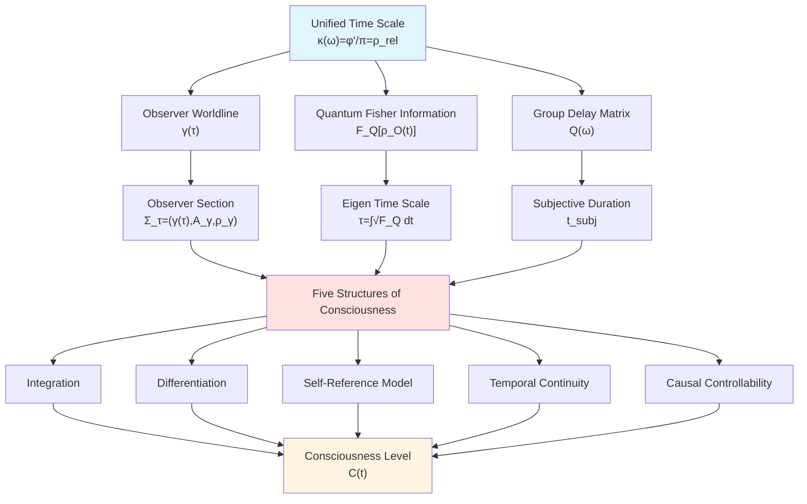
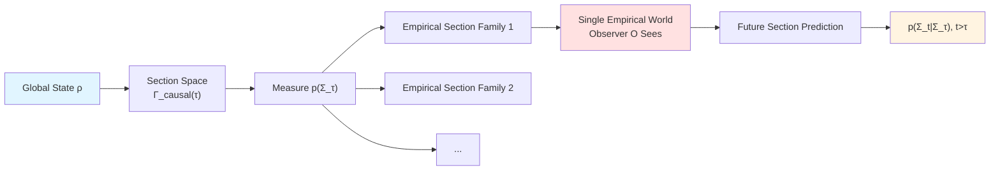
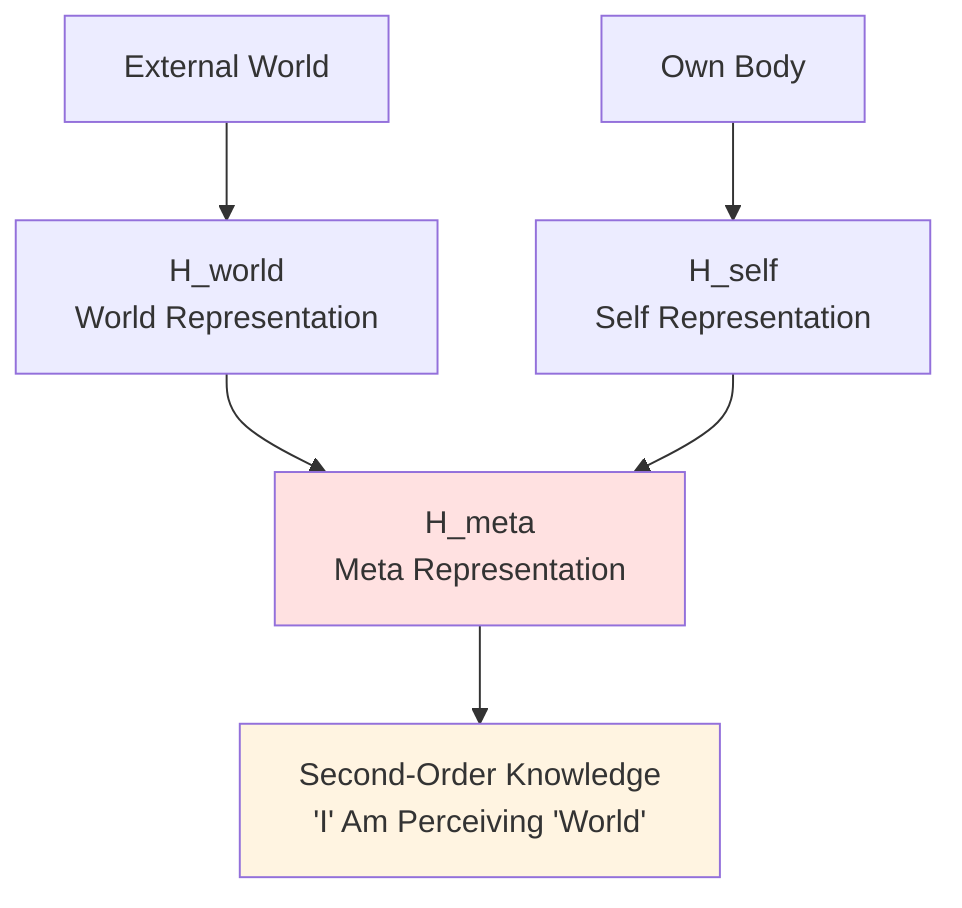
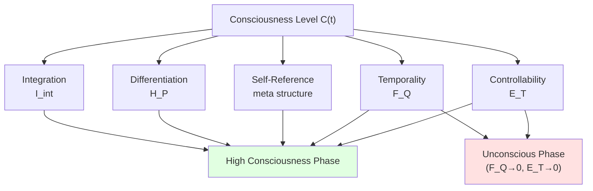
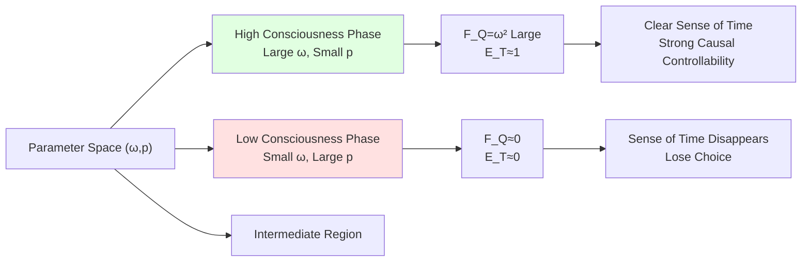
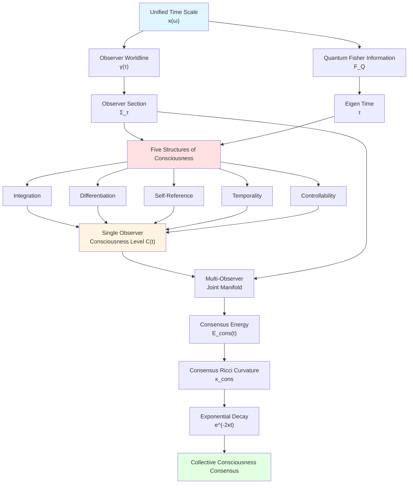

# Observers, Consciousness, and Boundary Time—Unifying Bridge from Physics to Mind

## Introduction: Three Puzzles from Observer to Consciousness

In previous journey, we have established a grand unified framework: From unified time scale, information geometry to causal diamond chains, from parameter universe to self-referential topology. However, in this seemingly complete picture of physical universe, three core questions remain untouched:

**Puzzle One: What is an Observer?**
In quantum theory, observer seems a concept that is "necessary but hard to define". We say "observation causes wave function collapse", but **what is observer itself**? Is it human? Is it instrument? Is it some abstract "classical system"?

**Puzzle Two: Where Does Consciousness Come From?**
Deeper question: When we say "I perceive the world", what physical structure is this **subjective experience of "I"**? Is consciousness an additional entity, or can it emerge from information-causal structure?

**Puzzle Three: Sense of Time and Choice**

Everyone has subjective sense of time passing—sometimes "days feel like years", sometimes "time flies". What is relationship between this **subjective time** and physical time? How are our "free will" and "optional futures" defined in physics?

This chapter will answer these three questions using three core theories under unified framework:
1. **Observer Section Theory** (from `observer-world-section-structure`)
2. **Structural Definition of Consciousness** (from `consciousness-structural-definition`)
3. **Entanglement-Time-Consciousness Unified Theory** (from `entanglement-consciousness-time-unified-delay`)
4. **Multi-Observer Consensus Geometry** (from `multi-observer-consensus-geometry`)

## Part One: What is Observer—Geometric Structure of World Sections

### 1.1 From "Measurement Problem" to "Section Problem"

Standard formulation of quantum mechanics has famous measurement problem:
- **Unitary Evolution**: $\rho(t) = e^{-iHt}\rho(0)e^{iHt}$
- **Projection and Renormalization**: $\rho \to |\psi\rangle\langle\psi|$

When do these two evolutions apply? Who decides "when to measure"?

**Dilemma of Traditional Approaches**:
- **Many-Worlds Interpretation**: Globally unitary, but "branching" hard to define
- **Copenhagen Interpretation**: Observer-system dichotomy, boundary vague
- **Decoherence Theory**: Depends on environment selection, but environment boundary still artificial

**Core Idea of New Approach—Section Theory**:

> World observer sees is not "entire 4-dimensional spacetime", but a **family of sections** $\{\Sigma_\tau\}$ on unified time scale $\tau$. This section satisfies three constraints:
> 1. **Local Causality**: Can only see information within past light cone
> 2. **Dynamical Consistency**: Exists local solution extension satisfying field equations
> 3. **Record Consistency**: No contradiction with existing memory

### 1.2 Triplet Structure of Observer Section

**Definition** (Observer Section):
On unified time scale $\tau$, world section of observer $O$ is triplet:

$$
\Sigma_\tau = \bigl( \gamma(\tau),\ \mathcal{A}_{\gamma,\Lambda}(\tau),\ \rho_{\gamma,\Lambda}(\tau) \bigr)
$$

where:
- **$\gamma(\tau) \in M$**: Position of observer in spacetime $M$ (point on worldline)
- **$\mathcal{A}_{\gamma,\Lambda}(\tau)$**: Observable subalgebra readable at resolution $\Lambda$
- **$\rho_{\gamma,\Lambda}(\tau)$**: Effective state on this subalgebra (obtained by conditioning global state $\omega$)

**Intuitive Analogy—Continuous Exposure of Camera**:
- Camera moves along worldline $\gamma$
- Each "frame" $\Sigma_\tau$ is a "snapshot" of global field state
- But this snapshot limited by: camera's **position** (causal horizon), **lens resolution** ($\Lambda$), **film type** (observable algebra $\mathcal{A}$)

### 1.3 Causally Consistent Sections—Not All "Snapshots" Are Physically Allowed

Not every triplet is realizable section. Must satisfy **causal consistency**:

**Definition** (Causally Consistent Section):
Section $\Sigma_\tau$ called causally consistent, if:
1. **Local Causality**: Support of all operators in $\mathcal{A}_{\gamma,\Lambda}(\tau)$ within past light cone of $\gamma(\tau)$
2. **Dynamical Consistency**: Exists local solution $(g_{ab},\Phi)$ on $(\tau-\epsilon,\tau+\epsilon)$ satisfying Einstein-matter field equations, inducing $\rho_{\gamma,\Lambda}(t)$
3. **Record Consistency**: $\rho_{\gamma,\Lambda}(\tau)$ consistent with previous sections via CPTP map on observer memory subalgebra

Set of sections satisfying these conditions denoted:
$$
\Gamma_{\mathrm{causal}}^{\mathrm{dyn}}(\tau;\ \mathcal{O})
$$

**Key Insight**:
In framework including gravity and generalized entropy, **Jacobson entanglement equilibrium condition** on local causal diamond automatically derives Einstein equations, thus guaranteeing existence of causally consistent sections!

### 1.4 Empirical Section Family—Conditionalization of Single Branch

Given global state $\rho$, define measure $p(\Sigma_\tau)$ on section space. But observer **actually sees** only one **single branch path** among them.

**Definition** (Empirical Section Family):
If exists mapping $\tau \mapsto \Sigma_\tau \in \Gamma_{\mathrm{causal}}^{\mathrm{dyn}}(\tau;\mathcal{O})$, such that:
- For almost all $\tau$, $p(\Sigma_\tau) > 0$ (non-zero probability)
- Consistent with observer records on memory subalgebra
- Satisfies decoherence condition of consistent histories

Then $\{\Sigma_\tau\}_{\tau \in I}$ called **empirical section family**.

**Relationship with Quantum Interpretation**:
- **Global Superposition**: Manifested in measure $p(\cdot)$ on section space
- **Single Result**: Corresponds to one specific empirical section family $\{\Sigma_\tau\}$
- **"Collapse"**: Process from global measure to single branch conditionalization, not true physical collapse

### 1.5 Section Reformulation of Double-Slit Experiment—Path Information Manifested in Observable Algebra

Let us re-understand classic double-slit experiment using section language:

**Scenario 1: No Path Measurement**
- Observable subalgebra: $\mathcal{A}_{\gamma,\Lambda}^{\mathrm{pos}} = \{f(\hat{x})\}$ (only screen position operators)
- Empirical section family: Inherits global path coherence $|\psi\rangle = (|L\rangle + |R\rangle)/\sqrt{2}$
- Interference pattern: $P(x) = |\psi_L(x) + \psi_R(x)|^2$ has interference term

**Scenario 2: Path Detection**
- Observable subalgebra: $\mathcal{A}_{\gamma,\Lambda}^{\mathrm{path \otimes pos}} = \{f(\hat{x}) \otimes \mathbb{I}_{\mathrm{env}},\ P_L,\ P_R\}$ (includes path pointer)
- Empirical section family: Environment entanglement introduces decoherence, $\rho_{\mathrm{screen}} \approx (|L\rangle\langle L| + |R\rangle\langle R|)/2$
- Interference pattern: $P_{\mathrm{decoh}}(x) \propto |\psi_L(x)|^2 + |\psi_R(x)|^2$ no interference term

**Delayed Choice Experiment**:
"Choice" occurs in future light cone, changes structure of future section space, not past causal relations. This completely conforms to local causality, no backward causality needed!

**Popular Analogy**:
Imagine section space as a "choose your own adventure" book:
- Global state $\rho$ gives all possible plot branches and their probabilities
- Observer flips pages along one specific path (empirical section family)
- "Delayed choice" is choosing which branch to flip to at some page—affects future pages, not already read pages

## Part Two: What is Consciousness—Self-Referential Information Flow with Five Structures

### 2.1 Why Need "Physical Definition of Consciousness"?

In section theory, we characterized "what observer sees". But deeper question remains:

> **What kind of observer is "conscious"?**

A thermometer also "observes" temperature, but we don't consider it conscious. Human brain observes world, we consider it conscious. What's the difference?

Traditional philosophy and neuroscience give many candidate answers:
- Philosophy: Subjective experience (qualia), sense of self, phenomenal vs access consciousness
- Neuroscience: Global neuronal workspace, integrated information theory (IIT), attention mechanism

But these theories either too subjective (hard to formalize) or depend on specific biological architecture (hard to generalize).

**Core Idea of New Approach—Structural Definition**:

> Consciousness is not additional entity, but **world-self joint information flow** satisfying **five structural conditions**. These five are:
> 1. **Integration**: High internal correlation
> 2. **Differentiation**: Large number of distinguishable states
> 3. **Self-Reference Model**: Encodes "I am perceiving world"
> 4. **Temporal Continuity and Eigen Time**: Highly sensitive to time translation
> 5. **Causal Controllability**: Can influence future through actions

### 2.2 First: Integration—High Correlation of Information Channels

**Definition** (Integrated Mutual Information):
Let observer $O$'s Hilbert space decompose as:
$$
\mathcal{H}_O = \bigotimes_{k=1}^n \mathcal{H}_k
$$

Define integrated mutual information:
$$
I_{\mathrm{int}}(\rho_O) = \sum_{k=1}^n I(k:\overline{k})_{\rho_O}
$$

where $I(k:\overline{k})$ is quantum mutual information between subsystem $k$ and rest.

If exists threshold $\Theta_{\mathrm{int}} > 0$ such that:
$$
I_{\mathrm{int}}(\rho_O(t)) \ge \Theta_{\mathrm{int}},\quad \forall t \in I
$$

Then $O$ said to have **integration** on interval $I$.

**Intuitive Explanation**:
- Consciousness not "modular processing"—vision, hearing, touch not independent pipelines
- But **highly integrated**—when seeing a rose, simultaneously feel red color, fragrance, soft texture, they internally correlate

**Popular Analogy—Symphony Orchestra vs Assembly Line**:
- Assembly line: Each station works independently, no interference (low integration)
- Symphony orchestra: Strings, winds, percussion highly coordinated, echo each other (high integration)

Consciousness more like symphony orchestra, not assembly line!

### 2.3 Second: Differentiation—Huge State Space

**Definition** (Shannon Entropy as Differentiation Measure):
Given coarse-grained measurement $\mathcal{P} = \{M_\alpha\}$, define:
$$
p_t(\alpha) = \mathrm{Tr}(\rho_O(t) M_\alpha)
$$

$$
H_{\mathcal{P}}(t) = -\sum_{\alpha} p_t(\alpha) \log p_t(\alpha)
$$

If exists $\Theta_{\mathrm{diff}} > 0$ such that:
$$
H_{\mathcal{P}}(t) \ge \Theta_{\mathrm{diff}},\quad \forall t \in I
$$

Then $O$ said to have **differentiation**.

**Intuitive Explanation**:
- Conscious system can be in **large number of different functional states**
- This corresponds to rich "conscious content"—seeing red vs blue, hearing C vs D, thinking math vs thinking poetry

**Popular Analogy—Monochrome Display vs Full-Color Display**:
- Monochrome display: Can only display black-white two states (low differentiation)
- Full-color display: Can display millions of colors (high differentiation)

Richness of consciousness requires huge state space!

### 2.4 Third: Self-Reference Model—"I" Perceiving "World"

This is most unique feature of consciousness: Not only knows external world, but also knows **"I" am knowing**.

**Definition** (World-Self Joint Model):
Observer Hilbert space further decomposes:
$$
\mathcal{H}_O = \mathcal{H}_{\mathrm{world}} \otimes \mathcal{H}_{\mathrm{self}} \otimes \mathcal{H}_{\mathrm{meta}}
$$

- $\mathcal{H}_{\mathrm{world}}$: Representation of external world
- $\mathcal{H}_{\mathrm{self}}$: Representation of own body/strategy
- $\mathcal{H}_{\mathrm{meta}}$: Second-order representation of "I am perceiving world"

If exists CP map $\Phi_t$ such that on $\mathcal{H}_{\mathrm{world}} \otimes \mathcal{H}_{\mathrm{self}}$ margin approximately reproduces environment and self, and on $\mathcal{H}_{\mathrm{meta}}$ exists non-trivial correlation, then $O$ said to have **self-referential world-self model**.

**Intuitive Explanation**:
Thermometer "knows" temperature, but doesn't know "I am thermometer, I am measuring temperature". Human consciousness not only knows "it's raining outside", but also knows "I see it's raining outside"—this is **second-order representation**.

**Popular Analogy—Surveillance Camera vs Selfie Mirror**:
- Surveillance camera: Only records external scene (no self-reference)
- Selfie mirror: Not only records scene, but can see "myself looking" (self-reference)

Consciousness needs this "looking back at self" structure!

### 2.5 Fourth: Temporal Continuity and Eigen Time—Subjective Sense of Time Passing

This is bridge between consciousness and time scale!

**Definition** (Quantum Fisher Information and Eigen Time):
Let external time evolution $t \mapsto \rho_O(t)$, quantum Fisher information is:
$$
F_Q[\rho_O(t)] = \mathrm{Tr}(\rho_O(t) L(t)^2)
$$

where symmetric logarithmic derivative $L$ satisfies:
$$
\partial_t \rho_O(t) = \frac{1}{2}\big(L(t)\rho_O(t) + \rho_O(t)L(t)\big)
$$

If exists $\Theta_{\mathrm{time}} > 0$ such that:
$$
F_Q[\rho_O(t)] \ge \Theta_{\mathrm{time}},\quad \forall t \in I
$$

Then can define **eigen time scale**:
$$
\tau(t) = \int_{t_0}^t \sqrt{F_Q[\rho_O(s)]}\ \mathrm{d}s
$$

**Physical Meaning**:
- Large $F_Q$ → Sensitive to time translation → Fast eigen time flow → "Time slows, content increases"
- Small $F_Q$ → Insensitive to time translation → Slow eigen time flow → "Time blurred, trance state"

**Connection with Unified Time Scale**:
In pure state case, $F_Q = 4 \mathrm{Var}(H_O)$, similar to trace of group delay matrix!

**Popular Analogy—Old Mechanical Clock vs Electronic Clock**:
- Mechanical clock: Fast gear speed (high $F_Q$) → Second hand clearly jumps → Clear sense of time
- Stopped clock: Gears don't move (low $F_Q$) → No sense of time

"Sense of time passing" of consciousness comes from sensitivity of internal state to time translation!

### 2.6 Fifth: Causal Controllability—Optional Futures

Consciousness not only "passively perceives", but also "actively chooses".

**Definition** (Finite Horizon Empowerment):
Define empowerment on time window $T$:
$$
\mathcal{E}_T(t) = \sup_\pi I(A_t : S_{t+T})
$$

where:
- $A_t$: Observer's action at time $t$
- $S_{t+T}$: Environment state $T$ steps later
- Mutual information $I$ takes supremum over all strategies $\pi$

If exists $\Theta_{\mathrm{ctrl}} > 0$ such that:
$$
\mathcal{E}_T(t) \ge \Theta_{\mathrm{ctrl}}
$$

Then $O$ said to have **non-degenerate causal controllability**.

**Key Proposition**:
$$
\mathcal{E}_T(t) = 0 \Leftrightarrow \text{Any strategy statistically indistinguishable for future}
$$

That is: $\mathcal{E}_T = 0$ equivalent to "losing choice"!

**Intuitive Explanation**:
- Conscious system can **create distinguishable future branches** through actions
- This is information-theoretic characterization of "free will"—not metaphysical "uncaused cause", but **statistical controllability of future**

**Popular Analogy—Audience vs Actor**:
- Audience: Watch movie but cannot change plot ($\mathcal{E}_T = 0$)
- Actor: Choosing different lines leads to different endings ($\mathcal{E}_T > 0$)

Consciousness is "actor mode", not "audience mode"!

### 2.7 Formal Definition of Consciousness—Five Combined

Combining above, we give:

**Definition** (Conscious Subsystem):
Observer $O$ said to be in **conscious phase** on interval $I$, if simultaneously satisfies:
1. Integration: $I_{\mathrm{int}}(\rho_O(t)) \ge \Theta_{\mathrm{int}}$
2. Differentiation: $H_{\mathcal{P}}(t) \ge \Theta_{\mathrm{diff}}$
3. Self-Reference Model: Exists world-self-meta three-layer structure
4. Temporal Continuity: $F_Q[\rho_O(t)] \ge \Theta_{\mathrm{time}}$, can define eigen time $\tau$
5. Causal Controllability: $\mathcal{E}_T(t) \ge \Theta_{\mathrm{ctrl}}$

**Consciousness Level Index**:
$$
\mathcal{C}(t) = g\big(F_Q[\rho_O(t)],\ \mathcal{E}_T(t),\ I_{\mathrm{int}}(\rho_O(t)),\ H_{\mathcal{P}}(t)\big)
$$

where $g$ is monotonic function.

**Core Theorem**:
If $F_Q \to 0$ and $\mathcal{E}_T \to 0$ occur simultaneously, then regardless of other indices, $\mathcal{C}(t)$ necessarily tends to zero, corresponding to **unconscious or near-unconscious state**.

**Popular Understanding**:
Consciousness not single attribute, but **high-value region in five-dimensional space**:
- Integration: Symphony orchestra-style coordination
- Differentiation: Richness of full-color display
- Self-Reference: Can "see self seeing"
- Temporality: Clear sense of time passing
- Controllability: Can create distinguishable futures

When all five dimensions high → Highly alert conscious state
When $F_Q$ and $\mathcal{E}_T$ both low → Anesthesia, coma, deep sleep

## Part Three: Unification of Three—Bridge from Scattering to Consciousness

### 3.1 How Does Unified Time Scale Enter Consciousness?

Return to starting point of this chapter: Unified time scale
$$
\kappa(\omega) = \frac{\varphi'(\omega)}{\pi} = \rho_{\mathrm{rel}}(\omega) = \frac{1}{2\pi}\mathrm{tr}\ Q(\omega)
$$

This scale originally from scattering theory, but how connect with subjective time?

**Triple Bridging**:

**Bridge 1: Scattering Group Delay → Subjective Duration**

In entanglement-time-consciousness unified theory, subjective duration defined as:
$$
t_{\mathrm{subj}}(\tau) = \int_0^\tau \big(F_Q^A(t)\big)^{-1/2}\ \mathrm{d}t
$$

And $F_Q^A$ can connect with group delay via quantum Cramér-Rao lower bound:
$$
\Delta t_{\min} \ge \big[m F_Q^A\big]^{-1/2} \sim \tau_g(\omega_0)
$$

**Bridge 2: Modular Flow → Eigen Time**

Tomita-Takesaki modular flow $\sigma_t^\omega$ agrees with scattering phase derivative on outer automorphism group $\mathrm{Out}(\mathcal{A}_\partial)$, thus:
$$
[\sigma_t^\omega] = [\alpha_t] \in \mathrm{Out}(\mathcal{A}_\partial)
$$

This gives equivalence class of observer eigen time and modular time!

**Bridge 3: Causal Controllability → Delay Discount**

In social decision-making, delay discount weight $V(t)$ defines effective horizon width:
$$
T_\ast = \sum_{t \ge 0} w_t,\quad w_t = \frac{V(t)}{\sum_s V(s)}
$$

This directly corresponds to time scale of $\mathcal{E}_T$!

**Core Insight**:
Unified time scale is not only physical time, but also **common equivalence class** of subjective time, modular time, decision horizon!

### 3.2 Minimal Model: Consciousness Phase of Two-Qubit Observer

To make theory concrete, consider minimal model:

**System Setup**:
- Observer: Single qubit $\mathcal{H}_O = \mathbb{C}^2$
- Environment: Single qubit $\mathcal{H}_E = \mathbb{C}^2$
- Intrinsic Hamiltonian: $H_O = \frac{\omega}{2}\sigma_z$
- Noise: Flip probability $p$

**Quantum Fisher Information**:
$$
F_Q[\psi_O(t)] = \omega^2
$$

**Empowerment (One-Step Horizon)**:
$$
\mathcal{E}_1(t) = I(A_t : E_{t+1}) =
\begin{cases}
1,&  p = 0\\
0,& p = 1\\
f(p),& p \in (0,1)
\end{cases}
$$

**Phase Diagram**:
On $(\omega, p)$ parameter plane:
- **High Consciousness Phase**: Large $\omega$, small $p$ → Large $F_Q$, large $\mathcal{E}_1$
- **Low Consciousness Phase**: Small $\omega$, large $p$ → Small $F_Q$, small $\mathcal{E}_1$
- **Intermediate Region**: Gradual transition

**Popular Understanding**:
- $\omega$: Intrinsic "clock" frequency → Controls sense of time
- $p$: External noise strength → Controls controllability

Even in simplest two-qubit model, consciousness manifests as **phase structure**!

### 3.3 Levels of Consciousness and Extreme States

Based on five structures, can understand different consciousness levels:

**Alert Consciousness** (C(t) maximum):
- High integration: Whole-brain coordination
- High differentiation: Rich perception
- Strong self-reference: Clear "I"
- Strong temporality: Clear sense of time passing
- Strong controllability: Can effectively choose future

**Dreaming** (C(t) intermediate):
- High integration: Dream internally coherent
- High differentiation: Vivid dream content
- Weak self-reference: Often no clear "I am dreaming"
- Weak temporality: Time can jump, blur
- Weak controllability: Hard to control dream direction

**Deep Sleep** (C(t) minimal):
- $F_Q \to 0$: Internal evolution nearly constant
- $\mathcal{E}_T \to 0$: No response to external
- Almost no conscious content

**Anesthesia** (C(t) minimal):
- Drug action reduces $F_Q$
- Muscle relaxation reduces $\mathcal{E}_T$
- Dual mechanism causes consciousness loss

**Popular Analogy—Different States of TV**:
- Alert: TV normal playback, clear picture, can change channel
- Dreaming: TV plays recording, vivid picture, but buttons may malfunction
- Deep sleep: TV standby, dark screen, buttons unresponsive
- Anesthesia: TV forced shutdown, circuit paused

## Part Four: Multi-Observer Consensus—Consciousness Geometry from Individual to Collective

### 4.1 Why Need "Multi-Observer Theory"?

Previous discussion all about **single observer**. But real universe contains **multiple observers**:
- Two people communicating
- Team of scientists collaborating
- Society forming consensus

How to characterize this **distributed consciousness system** in unified framework?

### 4.2 Multi-Observer Joint Manifold

**Definition** (Multi-Observer Joint Manifold):
For $N$ observers, each has worldline:
$$
z_i(t) = (\theta_i(t),\ \phi_i(t)) \in \mathcal{E}_Q^{(i)} = \mathcal{M}^{(i)} \times \mathcal{S}_Q^{(i)}
$$

Joint manifold:
$$
\mathfrak{E}_Q^N = \prod_{i=1}^N \mathcal{E}_Q^{(i)}
$$

Joint worldline:
$$
Z(t) = (z_1(t),\ \dots,\ z_N(t)) \in \mathfrak{E}_Q^N
$$

### 4.3 Communication Graph and Consensus Energy

**Definition** (Time-Dependent Communication Graph):
At time $t$, communication structure uses directed graph:
$$
\mathcal{C}_t = (I,\ E_t,\ \omega_t)
$$

where:
- Vertex set $I$: Observer indices
- Directed edge $(j \to i) \in E_t$: $j$ sends information to $i$
- Weight $\omega_t(i,j) \ge 0$: Bandwidth

**Definition** (Consensus Energy):
$$
\mathcal{E}_{\mathrm{cons}}(t) = \frac{1}{2}\sum_{i,j} \omega_t(i,j) d_{\mathcal{S}_Q}^2(\phi_i(t),\ \phi_j(t))
$$

where $d_{\mathcal{S}_Q}$ is geodesic distance on task information manifold.

**Physical Meaning**:
- $\mathcal{E}_{\mathrm{cons}} = 0$: All observers coincide on task information manifold → Perfect consensus
- Large $\mathcal{E}_{\mathrm{cons}}$: Information scattered, views inconsistent

### 4.4 Consensus Ricci Curvature and Energy Decay

**Definition** (Consensus Ricci Curvature Lower Bound):
If exists $\kappa_{\mathrm{cons}}(t)$ such that:
$$
\frac{\mathrm{d}}{\mathrm{d}\epsilon}\Big|_{\epsilon=0} d_{\mathcal{S}_Q}^2(\phi_i(t+\epsilon),\ \phi_j(t+\epsilon)) \le -2\kappa_{\mathrm{cons}}(t) d_{\mathcal{S}_Q}^2(\phi_i(t),\ \phi_j(t))
$$

Then $\kappa_{\mathrm{cons}}(t)$ called consensus Ricci curvature lower bound.

**Theorem** (Consensus Energy Exponential Decay):
Under conditions of symmetric communication graph, connectivity lower bound, information manifold Ricci curvature lower bound, etc.:
$$
\mathcal{E}_{\mathrm{cons}}(t) \le \mathcal{E}_{\mathrm{cons}}(0) e^{-2\kappa_{\mathrm{eff}} t}
$$

**Popular Understanding**:
As long as communication graph connected and information geometry "not too negative curvature", observers' views will **exponentially quickly** converge to agreement!

**Sociological Analogy—Rumor Spreading vs Scientific Consensus**:
- Rumor: Sparse communication graph, large noise → Small $\kappa_{\mathrm{eff}}$ → Slow convergence or no convergence
- Science: Dense communication graph, experimental verification → Large $\kappa_{\mathrm{eff}}$ → Rapid consensus formation

### 4.5 Multi-Observer Joint Action

**Definition** (Multi-Observer Joint Action):
$$
\widehat{\mathcal{A}}_Q^{\mathrm{multi}}[Z(\cdot)] = \sum_{i=1}^N \widehat{\mathcal{A}}_Q^{(i)}[z_i(\cdot)] + \lambda_{\mathrm{cons}} \int_0^T \mathcal{E}_{\mathrm{cons}}(t)\ \mathrm{d}t
$$

Minimizing this action gives **optimal consensus strategy**: Both improve individual task quality and form collective consensus.

**Euler-Lagrange Equations**:
$$
\ddot{\phi}_i^k + \Gamma^k_{mn}(\phi_i)\dot{\phi}_i^m\dot{\phi}_i^n = -\frac{\gamma_i}{\beta_i^2} g_Q^{kl}\partial_l U_Q - \frac{\lambda_{\mathrm{cons}}}{\beta_i^2} g_Q^{kl} \nabla_{\phi_i} \mathcal{E}_{\mathrm{cons}}
$$

**Popular Understanding**:
Each observer's worldline is geodesic motion driven jointly by "individual task potential" and "consensus potential"!

## Chapter Summary: Unified Picture from Observer to Consciousness to Consensus

Let us review entire journey:

**Part One: Observer Section Theory**
- Observer not external "measurer", but **family of sections** along worldline $\gamma(\tau)$ in spacetime
- Section $\Sigma_\tau = (\gamma(\tau),\ \mathcal{A}_{\gamma,\Lambda},\ \rho_{\gamma,\Lambda})$ satisfies causal-dynamical-record consistency
- "Superposition" manifested in measure on section space, "single result" is single branch conditionalization
- Double-slit experiment, delayed choice unified as selection of observable subalgebra

**Part Two: Structural Definition of Consciousness**
- Consciousness is self-referential information flow satisfying five structures:
  1. Integration 2. Differentiation 3. Self-Reference Model 4. Temporal Continuity 5. Causal Controllability
- Eigen time scale $\tau = \int \sqrt{F_Q} \mathrm{d}t$ defines subjective time
- Empowerment $\mathcal{E}_T$ defines causal controllability
- Consciousness level $\mathcal{C}(t)$ varies in five-dimensional parameter space
- Minimal model shows "phase structure" of consciousness

**Part Three: Unification of Three**
- Unified time scale simultaneously is: Scattering group delay, modular flow, subjective duration, decision horizon
- Quantum Fisher information $F_Q$ bridges physical evolution and subjective sense of time
- Causal controllability $\mathcal{E}_T$ bridges physical action and free will

**Part Four: Multi-Observer Consensus**
- Multi-observers couple through communication graph $\mathcal{C}_t$
- Consensus energy $\mathcal{E}_{\mathrm{cons}}$ exponentially decays under control of consensus Ricci curvature
- Joint action gives optimal consensus strategy

**Ultimate Picture**:

**Philosophical Reflection**:

In this framework:
- **Observer** not mysterious "external perspective", but **internal worldline** in spacetime
- **Consciousness** not additional entity, but **information flow phase** satisfying five structures
- **Subjective Time** not illusion, but **eigen scale** defined by quantum Fisher information
- **Free Will** not "uncaused cause", but **statistical controllability** of causal controllability $\mathcal{E}_T > 0$
- **Consensus** not mysterious "collective consciousness", but **exponential convergence** driven by consensus Ricci curvature

**Poetic Ending**:

Universe not only evolves, but also **observes** its own evolution.
Observer not outsider, but universe's **self-gaze**.
Consciousness not additional dimension, but **high-dimensional vertex** in information-causal geometry.
Time not only passes, but also **perceived** as passing.
In depths of unified time scale, physics and mind finally shake hands.

This not splicing of two worlds, but **different sections of same geometry**.

---

**Quick Reference of Core Formulas**:

**Observer Section**:
$$
\Sigma_\tau = (\gamma(\tau),\ \mathcal{A}_{\gamma,\Lambda}(\tau),\ \rho_{\gamma,\Lambda}(\tau))
$$

**Five Structures of Consciousness**:
1. Integration: $I_{\mathrm{int}}(\rho_O) = \sum_k I(k:\overline{k})$
2. Differentiation: $H_{\mathcal{P}}(t) = -\sum_\alpha p_t(\alpha) \log p_t(\alpha)$
3. Self-Reference: $\mathcal{H}_O = \mathcal{H}_{\mathrm{world}} \otimes \mathcal{H}_{\mathrm{self}} \otimes \mathcal{H}_{\mathrm{meta}}$
4. Temporality: $\tau(t) = \int_{t_0}^t \sqrt{F_Q[\rho_O(s)]}\ \mathrm{d}s$
5. Controllability: $\mathcal{E}_T(t) = \sup_\pi I(A_t : S_{t+T})$

**Consensus Energy**:
$$
\mathcal{E}_{\mathrm{cons}}(t) = \frac{1}{2}\sum_{i,j} \omega_t(i,j) d_{\mathcal{S}_Q}^2(\phi_i(t),\ \phi_j(t))
$$

**Energy Decay**:
$$
\mathcal{E}_{\mathrm{cons}}(t) \le \mathcal{E}_{\mathrm{cons}}(0) e^{-2\kappa_{\mathrm{eff}} t}
$$

**Theoretical Sources**:
- Observer Section: `observer-world-section-structure-causality-conditionalization.md`
- Consciousness Definition: `consciousness-structural-definition-time-causality.md`
- Entanglement-Time: `entanglement-consciousness-time-unified-delay-theory.md`
- Multi-Observer: `multi-observer-consensus-geometry-causal-network.md`

---

Next chapter we will deeply explore **mathematical structure of observer worldline sections**, rigorously derive causal consistency conditions, existence theorem of empirical section families, and verify section theory in double-slit experiment and delayed choice!

