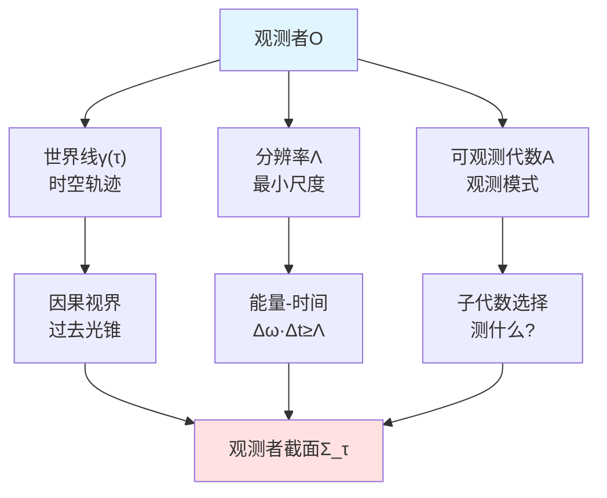
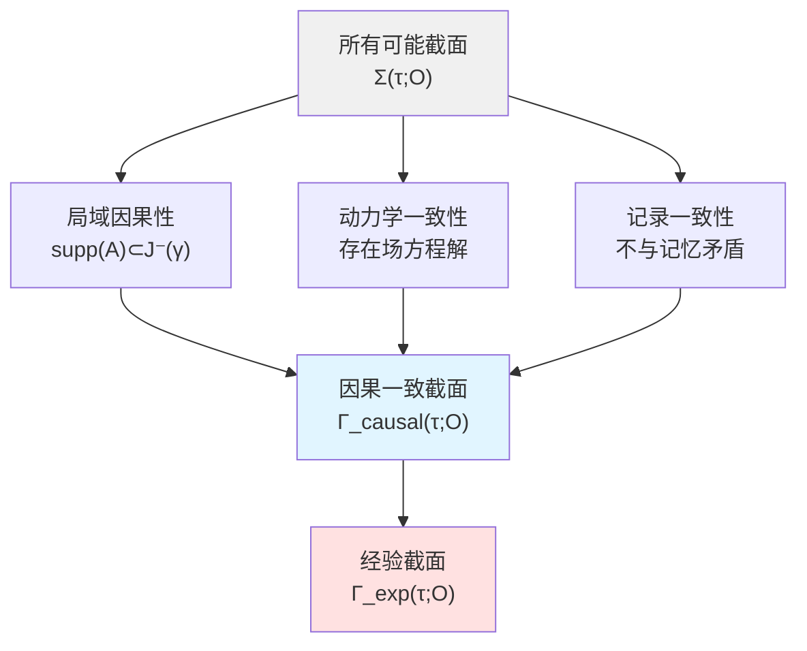
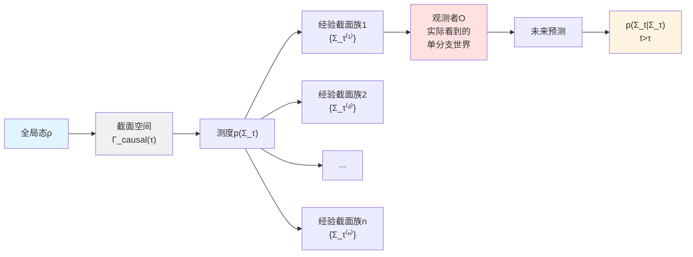
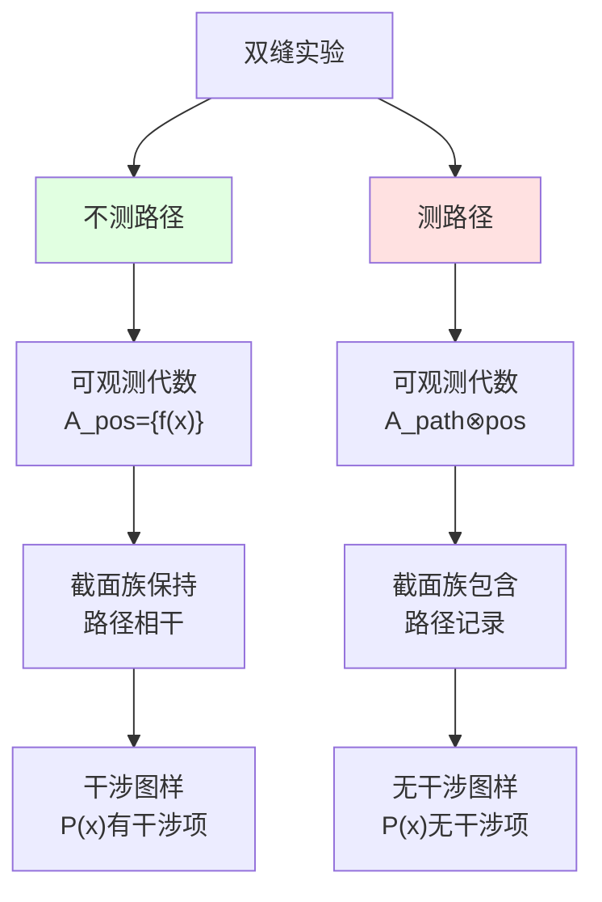
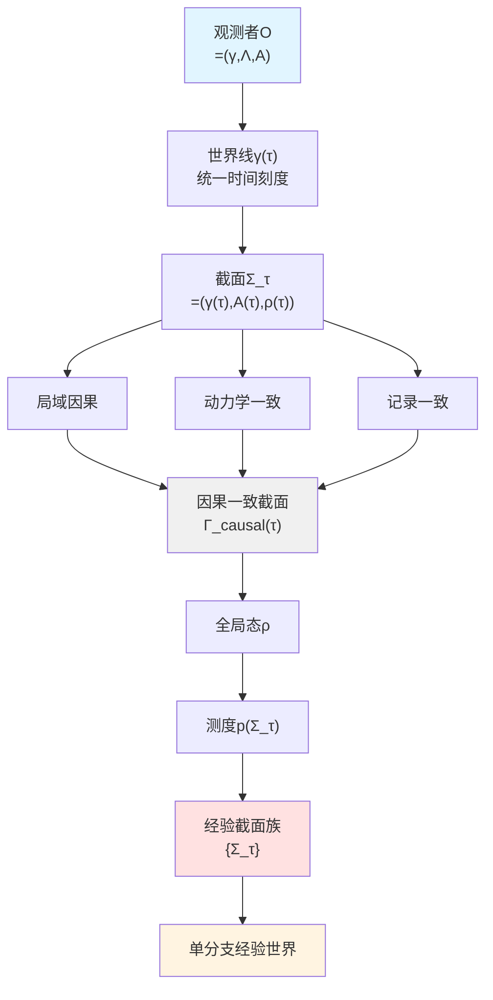

# 观测者世界线截面——因果结构中的"此刻"

## 引言:什么是"此刻"?

当你读到这句话时,你会说"这是**此刻**"。但在相对论的4维时空中,并不存在绝对的"此刻"——不同参考系有不同的同时性。那么,观测者感受到的"此刻"究竟是什么?

本章将给出精确答案:**观测者的"此刻"是其世界线在统一时间刻度τ上的一个截面** $\Sigma_\tau$。这个截面不是任意的,而是受到三重约束:
1. **局域因果性**:只能看到过去光锥
2. **动力学一致性**:必须存在满足场方程的局域解
3. **记录一致性**:不能与已有记忆矛盾

让我们从最基础的结构开始,逐步构建这一理论。

## 第一节:观测者的三元组结构

### 1.1 观测者作为时空中的内部对象

在经典物理中,观测者常被视为"外在视角"。但在统一框架中,**观测者本身是时空的一部分**。

**定义**(观测者):
观测者是三元组:
$$
\mathcal{O} = (\gamma,\ \Lambda,\ \mathcal{A}_{\gamma,\Lambda})
$$

其中:
- **$\gamma: I \to M$**:类时世界线,以本征时间$\tau \in I \subset \mathbb{R}$参数化
- **$\Lambda > 0$**:分辨率参数,刻画能量–时间、空间–动量的最小可分辨尺度
- **$\mathcal{A}_{\gamma,\Lambda} \subset \mathcal{A}_\partial$**:可观测子代数,与通道、分辨率相对应

**通俗理解——望远镜的三要素**:
1. 世界线$\gamma$:望远镜的**位置与运动轨迹**
2. 分辨率$\Lambda$:望远镜的**镜头精度**(能看多清楚)
3. 可观测代数$\mathcal{A}_{\gamma,\Lambda}$:望远镜的**观测模式**(可见光?红外?X射线?)

不同的望远镜(观测者)在同一时空中,但看到的"世界"不同!

### 1.2 统一时间刻度与本征时间

观测者世界线的参数化使用**统一时间刻度** $[\tau]$。回顾其定义:

**刻度同一式**:
$$
\frac{\varphi'(\omega)}{\pi} = \rho_{\mathrm{rel}}(\omega) = \frac{1}{2\pi}\mathrm{tr}\ Q(\omega)
$$

其中:
- $\varphi(\omega)$:总散射半相位
- $\rho_{\mathrm{rel}}(\omega)$:相对态密度
- $Q(\omega) = -i S(\omega)^\dagger \partial_\omega S(\omega)$:Wigner–Smith群延迟矩阵

在边界时间几何(BTG)框架中,证明了三种时间刻度的等价:
1. **散射时间**:来自群延迟矩阵迹
2. **模块时间**:来自Tomita–Takesaki模块流
3. **几何时间**:来自Brown–York边界哈密顿量

**观测者的本征时间**$\tau_{\mathrm{prop}}$沿世界线$\gamma$定义,属于这一等价类:
$$
\tau_{\mathrm{prop}} \in [\tau]
$$

**通俗类比——手表的三种读数**:
- 机械表:齿轮转动(对应散射群延迟)
- 电子表:晶振频率(对应模块流)
- 日晷:太阳位置(对应几何时间)

它们读数不同,但**换算关系固定**(仿射变换)——这就是"等价类"!

### 1.3 世界截面的精确定义

现在我们可以给出核心定义。

**定义**(世界截面):
在统一时间刻度$\tau$上,观测者$\mathcal{O}$的世界截面是三元组:
$$
\Sigma_\tau = \bigl(\gamma(\tau),\ \mathcal{A}_{\gamma,\Lambda}(\tau),\ \rho_{\gamma,\Lambda}(\tau)\bigr)
$$

其中:
1. **$\gamma(\tau) \in M$**:观测者在刻度τ下的时空位置
2. **$\mathcal{A}_{\gamma,\Lambda}(\tau) \subset \mathcal{A}_{\gamma,\Lambda}$**:在τ时刻已可读出或可激活的可观测子代数
3. **$\rho_{\gamma,\Lambda}(\tau)$**:该子代数上的有效态,由全局态$\omega$经条件化和粗粒化得到

**物理意义**:
截面$\Sigma_\tau$是观测者在"此刻"τ能够访问的**世界的一个快照**。但这快照不是全知全能的——受限于:
- **因果视界**:只能看到$\gamma(\tau)$的过去光锥
- **分辨率**:能量Λ以下的细节看不到
- **观测模式**:只能测量$\mathcal{A}_{\gamma,\Lambda}(\tau)$中的算符

**通俗类比——相机拍照的限制**:
- 因果视界:相机只能拍到光线已到达的物体(看不到"现在"的仙女座星系)
- 分辨率:镜头像素有限,拍不到原子尺度
- 观测模式:只拍可见光,拍不到红外或紫外

所有截面$\Sigma_\tau$构成**截面空间**:
$$
\Sigma(\tau;\ \mathcal{O}) = \{\text{所有满足基本可测性的截面}\}
$$

但并非所有截面都"物理允许"!

## 第二节:因果一致性——物理允许的截面

### 2.1 三条一致性约束

仅仅给出三元组$(\gamma(\tau),\ \mathcal{A},\ \rho)$还不够,必须满足物理约束。

**定义**(因果一致截面):
截面$\Sigma_\tau \in \Sigma(\tau;\ \mathcal{O})$称为**因果一致**,若满足:

**约束1:局域因果性**
对任意$A \in \mathcal{A}_{\gamma,\Lambda}(\tau)$,其支集(support)位于$\gamma(\tau)$的**过去因果区域**内:
$$
\mathrm{supp}(A) \subset J^-(\gamma(\tau))
$$

且任何依赖未来区域的算符对态的作用在$\mathcal{A}_{\gamma,\Lambda}(\tau)$上不可见。

**通俗理解**:不能"看到未来"!

**约束2:动力学一致性**
存在定义在$(\tau-\epsilon,\ \tau+\epsilon)$上的一族局域解$(g_{ab},\ \Phi)$(包括几何与物质场),使得:
- 对所有$t \in (\tau-\epsilon,\ \tau+\epsilon)$,该解满足Einstein方程与物质场方程
- 该解诱导的边界代数态在限制到$\mathcal{A}_{\gamma,\Lambda}(t)$时与某一$\rho_{\gamma,\Lambda}(t)$一致
- $\rho_{\gamma,\Lambda}(\tau)$是其中一员

**通俗理解**:必须"自洽演化"——前后时刻能通过场方程连接!

**约束3:记录一致性**
在包含观测者内部自由度与记忆的子代数$\mathcal{A}_{\mathrm{mem}} \subset \mathcal{A}_{\gamma,\Lambda}(\tau)$上,$\rho_{\gamma,\Lambda}(\tau)$与先前时刻$\tau' < \tau$的截面通过幺正演化或CPTP映射一致,**不存在与既有记录矛盾的配置**。

**通俗理解**:不能"记忆错乱"——今天记得的事不能与昨天矛盾!

满足这三条的截面集合记为:
$$
\Gamma_{\mathrm{causal}}^{\mathrm{dyn}}(\tau;\ \mathcal{O}) \subset \Sigma(\tau;\ \mathcal{O})
$$

### 2.2 因果菱形与局域解的存在性

**关键问题**:如何保证因果一致截面的存在性?

答案来自**Jacobson的纠缠平衡假设**!

**定理**(局域因果一致延拓):
在假设:
1. $(M,\ g)$稳定因果且局域双曲
2. 态$\omega$在局域上为Hadamard态
3. 在每个小因果菱形上满足广义熵极值条件

则对任意$p \in M$,存在包含p的小因果菱形$D_{p,r}$,以及一族满足Einstein方程与物质场方程的局域解$(g_{ab},\ \Phi)$,使得:
- 该解在$D_{p,r}$内存在且唯一(至局域微分同胚)
- 诱导的广义熵在边界上满足Jacobson型极值条件与QNEC/QFC约束

**证明思路**:
1. 小因果菱形上的IBVP(初边值问题)在适当函数空间良定
2. 能量条件与QNEC/QFC保证无病态聚焦
3. Jacobson纠缠平衡:$\delta S_{\mathrm{gen}} = 0 \Leftrightarrow G_{ab} + \Lambda g_{ab} = 8\pi G T_{ab}$

**通俗理解——拼图游戏**:
- 每个小因果菱形是一块"拼图"
- Jacobson条件保证每块拼图"边缘吻合"
- 沿世界线$\gamma$取覆盖$\{D_{\gamma(\tau_i),r_i}\}$,拼接局域解,得到完整图景

这保证了在有限时间区间$I = [\tau_0,\ \tau_1]$内,至少存在一个因果一致截面延拓族!

### 2.3 可观测子代数的选择——观测模式的物理意义

不同的观测模式对应不同的$\mathcal{A}_{\gamma,\Lambda}(\tau)$。这不是"主观选择",而有**客观物理意义**!

**例1:位置测量vs动量测量**
- 位置模式:$\mathcal{A}_{\mathrm{pos}} = \{f(\hat{x})\}$
- 动量模式:$\mathcal{A}_{\mathrm{mom}} = \{g(\hat{p})\}$

由Heisenberg不确定性,二者不可同时精确测量:
$$
[\hat{x},\ \hat{p}] = i\hbar \Rightarrow \mathcal{A}_{\mathrm{pos}} \not\subset \mathcal{A}_{\mathrm{mom}}
$$

**例2:单缝vs双缝**
- 不测路径:$\mathcal{A}_{\mathrm{screen}} = \{f(\hat{x}_{\mathrm{screen}})\}$
- 测路径:$\mathcal{A}_{\mathrm{path \otimes screen}} = \{P_L,\ P_R,\ f(\hat{x}_{\mathrm{screen}})\}$

引入路径探测器**扩展**了可观测子代数,导致去相干!

**例3:时间域双缝**
- 连续观测:$\mathcal{A}_{\mathrm{cont}} = \{O(t)\ |\ t \in \mathbb{R}\}$
- 时间窗口:$\mathcal{A}_{\mathrm{window}} = \{O(t)\ |\ t \in [t_1,\ t_1+\delta t] \cup [t_2,\ t_2+\delta t]\}$

时间窗口在统一刻度上选择两个"缝",能谱上出现干涉!

**通俗类比——不同滤镜的相机**:
- 黑白滤镜:只看亮度(低维可观测代数)
- RGB滤镜:看三原色(中维)
- 全光谱仪:看所有波长(高维)

选择不同滤镜,拍出的"世界"不同——但都是**同一世界的不同投影**!

## 第三节:全局态与截面空间上的测度

### 3.1 从Hilbert空间到截面空间

在标准量子力学中,全局态是Hilbert空间上的密度算符$\rho$。但观测者不能直接"看到"$\rho$——只能看到某个截面$\Sigma_\tau$!

如何将$\rho$"投影"到截面空间?

**关键思想**:每个截面$\Sigma_\tau$对应一个**效果算符**(effect operator)$E_{\Sigma_\tau}$。

**定义**(截面效果算符族):
对每个$\tau$,存在映射:
$$
\Sigma_\tau \mapsto E_{\Sigma_\tau}
$$

使得:
1. $E_{\Sigma_\tau} \ge 0$(正算符)
2. $\int_{\Gamma_{\mathrm{causal}}^{\mathrm{dyn}}(\tau;\ \mathcal{O})} E_{\Sigma_\tau}\ \mu(\mathrm{d}\Sigma_\tau) = \mathbb{I}$(归一化)

**概率权重**:
$$
p(\Sigma_\tau) = \mathrm{Tr}(\rho\ E_{\Sigma_\tau})
$$

从而在截面空间上得到测度$p_\tau$。

**通俗理解——投票系统**:
- 全局态$\rho$:所有选民的"总意见"
- 截面$\Sigma_\tau$:一个具体的"选举结果"
- 效果算符$E_{\Sigma_\tau}$:"计票规则"
- 概率$p(\Sigma_\tau)$:"该结果的得票率"

不同计票规则(可观测子代数),得到不同的结果分布!

### 3.2 一致历史框架与去相干

截面空间的测度结构与**一致历史**(consistent histories)框架密切相关。

**一致历史回顾**:
取有限时间序列$\tau_0 < \tau_1 < \cdots < \tau_n \subset I$,在每个$\tau_k$上选取POVM分解$\{E_{\alpha_k}^{(k)}\}$,定义**历史算符**:
$$
C_{\boldsymbol{\alpha}} = E_{\alpha_n}^{(n)} \cdots E_{\alpha_1}^{(1)} E_{\alpha_0}^{(0)}
$$

**去相干条件**:
若对$\boldsymbol{\alpha} \ne \boldsymbol{\beta}$有:
$$
\omega(C_{\boldsymbol{\alpha}} C_{\boldsymbol{\beta}}^\dagger) \approx 0
$$

则干涉项可忽略,历史概率良定:
$$
p(\boldsymbol{\alpha}) = \omega(C_{\boldsymbol{\alpha}} C_{\boldsymbol{\alpha}}^\dagger)
$$

**与截面理论的联系**:
- 历史$\boldsymbol{\alpha}$对应截面族$\{\Sigma_{\tau_k}\}_{k=0}^n$
- 去相干条件保证不同历史在可观测子代数上"正交"
- 条件化$p(\Sigma_t | \Sigma_\tau)$定义未来截面的预测

**通俗类比——多重平行宇宙vs单分支电影**:
- 全局态$\rho$:所有平行宇宙的"叠加"
- 去相干:不同宇宙之间"失去联系"
- 观测者经验:身处其中**一条**宇宙线(单分支)

## 第四节:经验截面族——观测者真正"看到"的世界

### 4.1 经验截面的定义

观测者不能同时"看到"所有截面——只能看到其中**一条单分支路径**。

**定义**(经验截面):
给定观测者$\mathcal{O}$与刻度$\tau$,若$\Sigma_\tau \in \Gamma_{\mathrm{causal}}^{\mathrm{dyn}}(\tau;\ \mathcal{O})$满足:
1. $p(\Sigma_\tau) > 0$(非零概率)
2. 在记忆子代数$\mathcal{A}_{\mathrm{mem}}$上,$\rho_{\gamma,\Lambda}(\tau)$与现实观测者的记忆一致
3. 存在至少一个$t \ge \tau$上定义的因果一致截面延拓族

则称$\Sigma_\tau$为观测者在刻度τ的**经验截面**。

所有此类截面构成:
$$
\Gamma^{\mathrm{exp}}(\tau;\ \mathcal{O}) \subset \Gamma_{\mathrm{causal}}^{\mathrm{dyn}}(\tau;\ \mathcal{O})
$$

**条件态**:
$$
\omega_{\Sigma_\tau}(A) = \frac{\omega(E_{\Sigma_\tau} A E_{\Sigma_\tau})}{\omega(E_{\Sigma_\tau})},\quad A \in \mathcal{A}_{\gamma,\Lambda}(\tau)
$$

这是观测者在该截面上的**经验世界**!

**定义**(经验截面族):
若存在映射$\tau \mapsto \Sigma_\tau \in \Gamma^{\mathrm{exp}}(\tau;\ \mathcal{O})$,使得对几乎所有$\tau$(相对于某自然测度)成立,则称$\{\Sigma_\tau\}_{\tau \in I}$为观测者的**经验截面族**。

**通俗类比——"选择你自己的冒险"游戏书**:
- 每一页:一个截面$\Sigma_\tau$
- 所有可能路径:截面空间$\Gamma_{\mathrm{causal}}$
- 你实际翻的路径:经验截面族$\{\Sigma_\tau\}$
- 概率$p(\Sigma_\tau)$:到达该页的"剧情合理性"

你只能沿**一条路径**玩,但所有路径都"存在"于书中!

### 4.2 核心定理:经验截面族的存在性

这是本章最重要的定理!

**定理**(经验截面族的存在):
在假设:
1. 几何–熵一致性(稳定因果、Hadamard态、广义熵极值)
2. 截面效果算符族良定义

下,对任意观测者$\mathcal{O}$与有界区间$I = [\tau_0,\ \tau_1]$,存在非空经验截面族$\{\Sigma_\tau\}_{\tau \in I}$,满足:
1. 对几乎所有$\tau \in I$,$\Sigma_\tau \in \Gamma^{\mathrm{exp}}(\tau;\ \mathcal{O})$
2. 对任意有限时间序列$\tau_0 < \cdots < \tau_n \subset I$,由$\{\Sigma_{\tau_k}\}$诱导的条件态与一致历史概率一致
3. 任何两条经验截面族若在某时刻$\tau_\ast$上在$\mathcal{A}_{\mathrm{mem}}$上一致,则在$[\tau_\ast,\ \tau_1]$上几乎处处给出相同的可观测概率预测

**证明纲要**:
1. **几何部分**:利用小因果菱形覆盖与Jacobson纠缠平衡,得到局域解族
2. **概率部分**:利用一致历史去相干条件,构造截面空间上的条件测度
3. **记忆部分**:记录一致性保证不同经验族在记忆上一致时,预测也一致

**物理意义**:
此定理精确表达了核心主张:**观测者的经验世界可刻画为因果一致截面族的单分支条件化路径,而全局叠加只体现在对未来截面的概率分布中**!

### 4.3 叠加与"坍缩"的重新理解

**定理**(叠加仅在未来截面的概率上显现):
对任意$\tau \in I$与经验截面$\Sigma_\tau \in \Gamma^{\mathrm{exp}}(\tau;\ \mathcal{O})$,存在定义在未来截面空间$\Gamma_{\mathrm{causal}}^{\mathrm{dyn}}(>\tau;\ \mathcal{O})$上的条件测度$p(\cdot | \Sigma_\tau)$,使得:
1. 观测者在τ时刻的经验由**单一态**$\omega_{\Sigma_\tau}$决定,不依赖其他截面
2. 所谓"叠加"仅通过$p(\Sigma_t | \Sigma_\tau)$这一族条件概率在$t > \tau$的截面预测中出现
3. 若对某未来事件F有$p(F | \Sigma_\tau) = 1$,则对所有与$\Sigma_\tau$记录一致的经验截面族,F在经验中必然发生

**通俗理解——天气预报vs实际天气**:
- 全局叠加:气象模型给出"明天60%晴天、40%雨天"
- 观测者今天的经验:单一状态(比如"今天多云")
- "坍缩":明天到来时,从概率分布变成单一结果
- 但这不是"真正的坍缩"——只是从"预测分布"变成"实际经验"

在截面理论中:
- **"此刻"**:单一截面$\Sigma_\tau$
- **"未来"**:概率分布$p(\Sigma_t | \Sigma_\tau),\ t > \tau$
- **"坍缩"**:$\Sigma_t$成为"新的此刻"时,其他可能性不再是"未来",而是"未实现的可能"

## 第五节:双缝实验的截面重述

现在让我们用截面语言重新理解量子力学的经典实验。

### 5.1 空间双缝:不测路径情形

**实验设置**:
- 单粒子入射态:$|\psi\rangle = \frac{1}{\sqrt{2}}(|L\rangle + |R\rangle)$
- 观测者可观测子代数:$\mathcal{A}_{\gamma,\Lambda}^{\mathrm{pos}} = \{f(\hat{x}_{\mathrm{screen}})\}$(只有屏幕位置)

**截面分析**:
1. 在每个时刻$\tau_k$,观测者的截面$\Sigma_{\tau_k}$包含:
   - 位置$\gamma(\tau_k)$
   - 可观测代数$\mathcal{A}^{\mathrm{pos}}$(不包含路径信息)
   - 有效态:$\rho_{\gamma,\Lambda}(\tau_k)$在$\mathcal{A}^{\mathrm{pos}}$上保持路径相干

2. 单次点击事件对应效果算符:$E_x \approx |x\rangle\langle x|$

3. 多次重复后,点击点云密度:
   $$
   P(x) = |\psi_L(x) + \psi_R(x)|^2 = |\psi_L(x)|^2 + |\psi_R(x)|^2 + 2\mathrm{Re}[\psi_L^\ast(x)\psi_R(x)]
   $$
   **有干涉项**!

**截面角度的理解**:
- 每次点击:经验截面族中的一个点
- 干涉图样:经验截面统计累积的结果
- **关键**:因为$\mathcal{A}^{\mathrm{pos}}$不包含路径算符,截面族继承全局相干!

**通俗类比——投影仪的聚焦模式**:
- 不测路径:投影仪聚焦在"屏幕"(位置)
- 看到的图案:干涉条纹(相干信息保留)

### 5.2 空间双缝:路径探测情形

**实验设置**:
- 系统–环境联合态:$|\Psi\rangle = \frac{1}{\sqrt{2}}(|L\rangle \otimes |E_L\rangle + |R\rangle \otimes |E_R\rangle)$
- 环境指针态$|E_L\rangle,\ |E_R\rangle$近似正交
- 可观测子代数扩展:$\mathcal{A}_{\gamma,\Lambda}^{\mathrm{path \otimes pos}} = \{f(\hat{x}),\ P_L \otimes \mathbb{I},\ P_R \otimes \mathbb{I}\}$

**截面分析**:
1. 截面$\Sigma_{\tau_k}$现在包含路径记录
2. 对环境偏迹后:
   $$
   \rho_{\mathrm{screen}} \approx \frac{1}{2}(|L\rangle\langle L| + |R\rangle\langle R|)
   $$
   **无干涉项**!(去相干)

3. 点击点云密度:
   $$
   P_{\mathrm{decoh}}(x) \propto |\psi_L(x)|^2 + |\psi_R(x)|^2
   $$

**截面角度的理解**:
- 引入路径探测器→扩展$\mathcal{A}_{\gamma,\Lambda}$
- 扩展后的截面族包含路径记录
- 不同路径的历史在$\mathcal{A}_{\mathrm{mem}}$上"正交"→去相干
- 干涉项被压制至可忽略

**通俗类比——标记的投影仪**:
- 测路径:投影仪同时显示"路径标签"和"位置"
- 标签信息"污染"了相干性
- 看到的图案:两个独立的高斯峰(无干涉)

### 5.3 Wheeler延迟选择实验

**实验设置**:
在粒子通过第一束分器(BS1)**之后**,在空间样分离区域决定是否插入第二束分器(BS2)。

**两种配置**:
1. **插入BS2**:观测干涉,可观测代数$\mathcal{A}_{\mathrm{interference}}$
2. **不插入BS2**:观测路径,可观测代数$\mathcal{A}_{\mathrm{path}}$

**"悖论"**:
决策在粒子"已通过BS1"之后做出,似乎要"后向影响过去"?

**截面理论的解答**:
1. 决策事件D发生在时刻$\tau_D$
2. 探测事件E发生在时刻$\tau_E > \tau_D$
3. **局域因果**要求:D必须在E的**过去光锥**内

**关键洞察**:
- "延迟选择"改变的是**未来截面空间**$\Gamma_{\mathrm{causal}}(>\tau_D)$的结构
- 不同配置对应不同的$\mathcal{A}_{\gamma,\Lambda}(\tau_E)$
- 但这不违背因果:决策D在E的过去,完全符合$\mathrm{supp}(A) \subset J^-(E)$!

**通俗类比——游戏中的剧情分支**:
- 在第5关(BS1)选择"左路"还是"右路"
- 但在第6关(决策点)可以选择"看剧情"还是"跳过剧情"
- 这不改变"你在第5关选了什么",只改变"第7关(探测)你看到什么"

**数学表述**:
- 插入BS2:截面族$\{\Sigma_\tau^{\mathrm{int}}\}$,其中$\mathcal{A}_{\gamma,\Lambda}^{\mathrm{int}}(\tau_E)$包含相位信息
- 不插入BS2:截面族$\{\Sigma_\tau^{\mathrm{path}}\}$,其中$\mathcal{A}_{\gamma,\Lambda}^{\mathrm{path}}(\tau_E)$包含路径信息

两者在$\tau < \tau_D$上一致,在$\tau \ge \tau_E$上不同——这是**未来截面的选择**,不是过去的改变!

### 5.4 时间域双缝实验

**实验设置**:
通过泵浦脉冲在时间上打开两个"窗口"$[\tau_1,\ \tau_1+\delta\tau]$、$[\tau_2,\ \tau_2+\delta\tau]$,探测光场能谱。

**截面分析**:
1. 可观测子代数选择时间窗口:
   $$
   \mathcal{A}_{\gamma,\Lambda}^{\mathrm{window}} = \{O(\omega)\ |\ \omega \in \text{频域}\}
   $$

2. 两个窗口在统一时间刻度$\tau$上的间隔:$\Delta\tau = \tau_2 - \tau_1$

3. 能谱干涉条纹间距:
   $$
   \Delta\omega \cdot \Delta\tau \sim 2\pi
   $$

**截面角度的理解**:
- 时间窗口:对统一刻度$[\tau]$的"采样"
- 两个窗口:两族截面$\{\Sigma_\tau^{(1)}\}$、$\{\Sigma_\tau^{(2)}\}$
- 能谱干涉:两族截面在频率读数子代数上的相干叠加

**通俗类比——快门的时间控制**:
- 空间双缝:两个空间位置的"缝"
- 时间双缝:两个时间位置的"缝"
- 空间干涉:位置上的条纹
- 时间干涉:频率上的条纹(Fourier对偶)

**统一时间刻度的关键作用**:
无论以本征时间、群延迟还是模块时间度量$\Delta\tau$,其与$\Delta\omega$的关系在等价类内一致!这使得时间双缝成为**边界时间几何的直接物理实现**。

## 第六节:工程实现方案

如何在实验室中检验截面理论?

### 6.1 微波散射网络中的截面工程

**目标**:在可控的散射网络中显式构造不同的可观测子代数,观测截面选择的效应。

**实验步骤**:
1. **设计双路径网络**:
   - 左路$\mathcal{N}_L$、右路$\mathcal{N}_R$
   - 可调散射相位$\phi_L(\omega),\ \phi_R(\omega)$

2. **配置1:不测路径**
   - 仅测输出端口功率$P_{\mathrm{out}}(\omega)$
   - 对应$\mathcal{A}_{\gamma,\Lambda}^{\mathrm{pos}} = \{P_{\mathrm{out}}\}$

3. **配置2:路径探测**
   - 在每条路径插入吸收/放大器,引入路径标记
   - 对应$\mathcal{A}_{\gamma,\Lambda}^{\mathrm{path \otimes pos}} = \{P_L,\ P_R,\ P_{\mathrm{out}}\}$

4. **测量**:
   - 比较两种配置下的$P_{\mathrm{out}}(\omega)$
   - 验证配置1有干涉,配置2无干涉

5. **群延迟一致性**:
   - 测量Wigner–Smith群延迟$Q(\omega)$
   - 验证$\frac{1}{2\pi}\mathrm{tr}\ Q(\omega) = \frac{\varphi'(\omega)}{\pi}$
   - 确认截面选择与统一时间刻度的关联

**预言**:
群延迟刻度、干涉可见度的变化可在刻度同一式下统一解释,无需超因果!

### 6.2 ITO光学时间双缝

**目标**:在时间域实现双缝,检验统一时间刻度在时间双缝中的作用。

**实验步骤**:
1. 使用ITO薄膜,通过泵浦脉冲诱导两次折射率突变
2. 时间间隔$\Delta\tau$可调
3. 测量探测光能谱$S(\omega)$
4. 观测能谱干涉条纹,验证$\Delta\omega \propto 1/\Delta\tau$

**截面理论预言**:
- 能谱条纹间距与时间窗口间隔满足Fourier关系
- 无论用本征时间、群延迟还是模块时间度量$\Delta\tau$,关系式在等价类内一致

### 6.3 原子量子存储器中的时间–频率干涉

**目标**:在量子存储器中实现时间–频率双缝,直接检验记忆截面。

**实验步骤**:
1. 将两个时间间隔可调的写入脉冲耦合到冷原子Ensemble
2. 产生两个相干的collective spin-wave模式
3. 读出过程中测量时间分布与能谱
4. 将存储–读出过程纳入$\mathcal{A}_{\mathrm{mem}}$,分析"记忆截面"

**截面理论预言**:
- 长寿命记忆自由度对应$\mathcal{A}_{\mathrm{mem}}$的扩展
- 经验截面族在记忆子代数上的一致性可通过读出统计检验

## 全章总结

本章建立了**观测者世界线截面**的完整理论:

**核心概念**:
1. **观测者**:三元组$(\gamma,\ \Lambda,\ \mathcal{A}_{\gamma,\Lambda})$
2. **世界截面**:$\Sigma_\tau = (\gamma(\tau),\ \mathcal{A}_{\gamma,\Lambda}(\tau),\ \rho_{\gamma,\Lambda}(\tau))$
3. **因果一致性**:局域因果、动力学一致、记录一致
4. **经验截面族**:观测者实际看到的单分支路径

**核心定理**:
1. **存在性**:在Jacobson纠缠平衡假设下,因果一致截面族必存在
2. **唯一性(模记忆)**:两条经验族若记忆一致,则预测一致
3. **叠加重述**:叠加只在未来截面概率$p(\Sigma_t | \Sigma_\tau)$中显现

**实验应用**:
- 双缝实验:不同$\mathcal{A}_{\gamma,\Lambda}$对应不同截面族
- 延迟选择:改变未来截面结构,不违背因果
- 时间双缝:统一时间刻度的直接验证

**哲学意涵**:
- "此刻"不是绝对的,而是观测者世界线上的截面
- "坍缩"不是物理过程,而是从概率分布到单一经验的认知转变
- "多世界"与"单分支"不矛盾:测度存在于截面空间,经验存在于单分支

**诗意结尾**:

观测者不是时空之外的旁观者,
而是时空之内的一条**世界线**。
每个"此刻"不是绝对的时间切片,
而是因果–动力学–记忆约束下的**截面**。
全局叠加并未消失,
只是退居为**未来的概率云**。
我们沿着经验截面族前行,
在统一时间刻度上,
物理与经验终于和解。

---

**核心公式速查**:

**观测者**:
$$
\mathcal{O} = (\gamma: I \to M,\ \Lambda,\ \mathcal{A}_{\gamma,\Lambda})
$$

**世界截面**:
$$
\Sigma_\tau = (\gamma(\tau),\ \mathcal{A}_{\gamma,\Lambda}(\tau),\ \rho_{\gamma,\Lambda}(\tau))
$$

**因果一致条件**:
1. $\mathrm{supp}(A) \subset J^-(\gamma(\tau))$
2. 存在局域解$(g_{ab},\ \Phi)$满足Einstein方程
3. $\rho_{\gamma,\Lambda}(\tau)$与$\mathcal{A}_{\mathrm{mem}}$上先前态一致

**条件态**:
$$
\omega_{\Sigma_\tau}(A) = \frac{\omega(E_{\Sigma_\tau} A E_{\Sigma_\tau})}{\omega(E_{\Sigma_\tau})}
$$

**未来预测**:
$$
p(\Sigma_t | \Sigma_\tau) = \frac{p(\Sigma_t \cap \Sigma_\tau)}{p(\Sigma_\tau)},\quad t > \tau
$$

**理论来源**:
- `observer-world-section-structure-causality-conditionalization.md`
- Jacobson纠缠平衡:`arxiv.org/abs/1505.04753`
- QNEC/QFC:`arxiv.org/abs/1509.02542`

---

下一章我们将深入**意识的数学定义**,用量子Fisher信息、互信息和因果可控性给出意识的五条结构性标准!
